## Alert

### 1.nmap
#### nmap之后加上域名，再namp一次
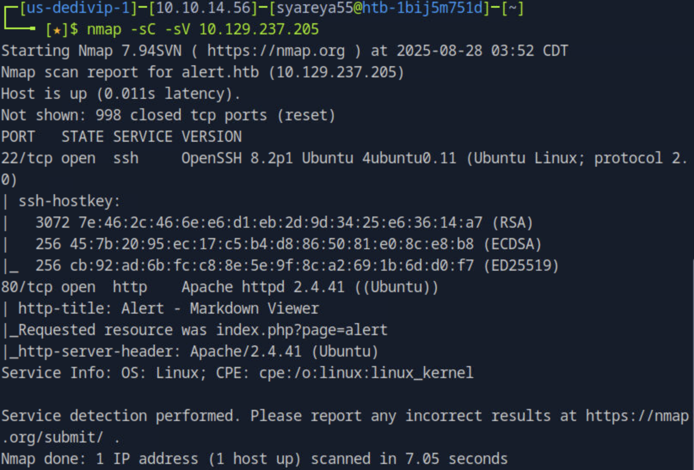
#### 在渗透 Web 服务时，Apache + Debian/Ubuntu 系靶机 → 优先去看/etc/apache2/sites-available/000-default.conf(默认生成)
### 2.ffuf
```
[★]$ ffuf -w /usr/share/wordlists/seclists/Discovery/Web-Content/directory-list-2.3-medium.txt:FUZZ -u "http://alert.htb/FUZZ" -ic
```
#### 会发现uploads、css、messages,需要将扩展名指定为.php
```
[★]$ ffuf -w /usr/share/wordlists/seclists/Discovery/Web-Content/directory-list-2.3-medium.txt:FUZZ -u "http://alert.htb/FUZZ" -ic -e .php
```
#### 注意到输出是相同的，所以根据单词的数量进行过滤,Shift + Ctrl + F
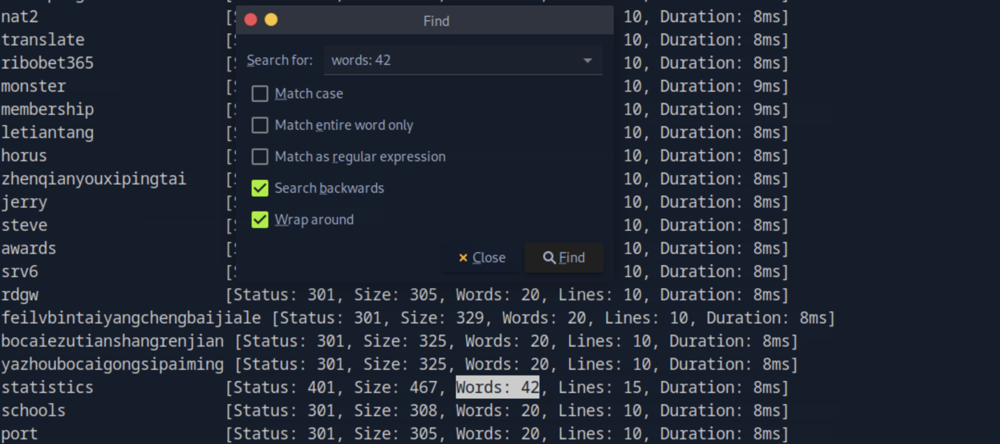
#### 看到statistics有42个单词。我们将统计子域添加到/etc/hosts文件
```
[★]$ sudo sed -i '/10.129.237.205 alert.htb/ s/$/ statistics.alert.htb/' /etc/hosts
```
#### s/.../.../ 是替换命令。这里的 $ 代表 行尾,在这行的结尾追加 statistics.alert.htb
#### 在访问统计子域时，看到一个登录页面
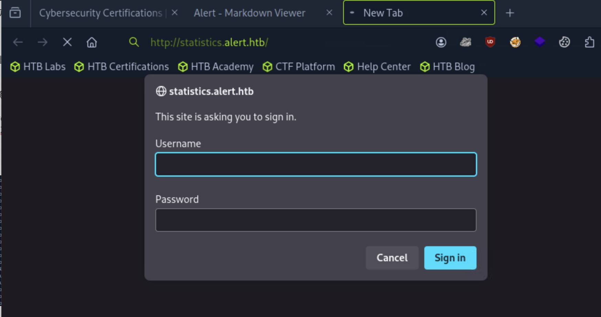
### 3.Markdown的XSS 
#### 在 Markdown 中最常见的 XSS 方式是注入执行 JavaScript 的常见 HTML 标签，因为一些 Makdown 解释器也会接受 HTML
#### https://book.hacktricks.wiki/en/pentesting-web/xss-cross-site-scripting/xss-in-markdown.html
### 3.1 测试XSS漏洞是否存在
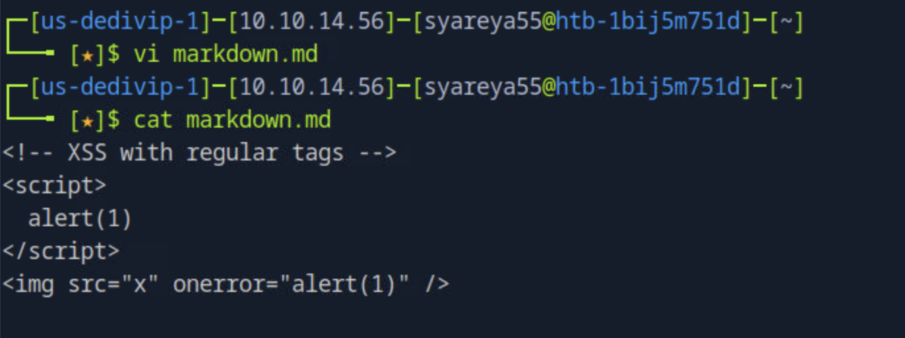
```
$ nc -lvnp 3000
```
#### 在http://alert.htb/ 的Markdown Viewer 上传markdown.md
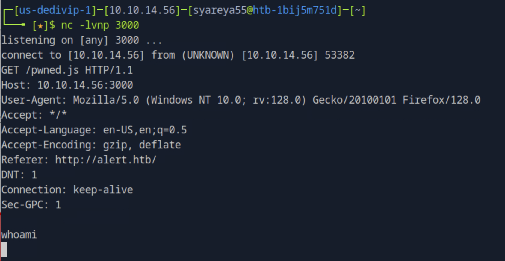
#### 是个GET请求，Ctrl + C结束nc，可以看到在右下角看到Share Markdown
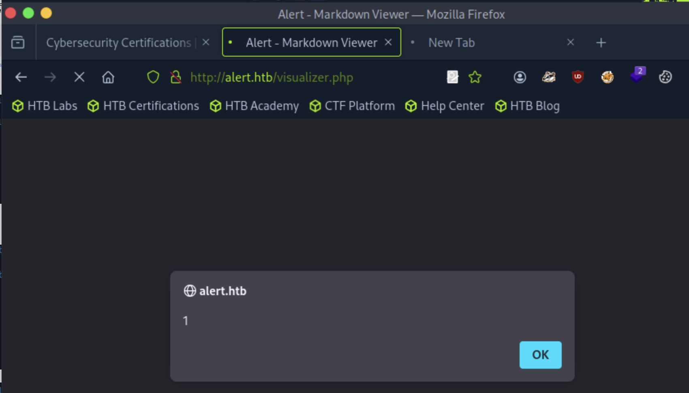
#### 警报已经触发。这证实了XSS漏洞
### 3.2 操作
```
$ python3 -m http.server 3000
```
```
$ vi pwned.js
```
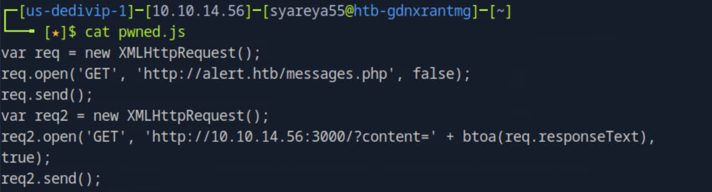
#### 在Markdown Viewer 上传markdown.md,点击Share Markdown获得不一样的url
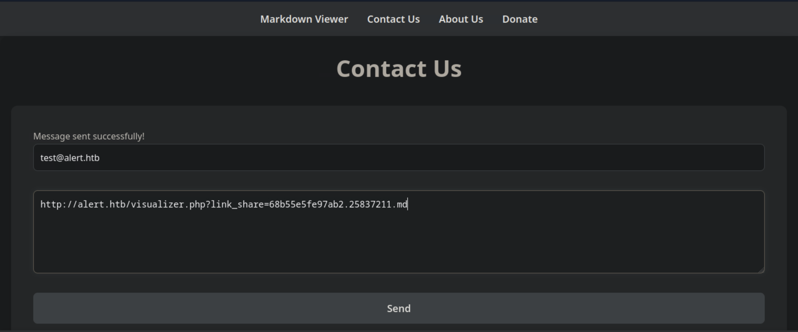
#### 在Contact Us上传url ,信息便会传回$ python3 -m http.server 3000
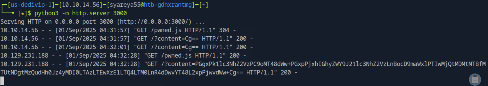
#### 使用Base64编码响应
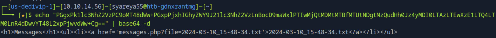
#### 修改pwned.js
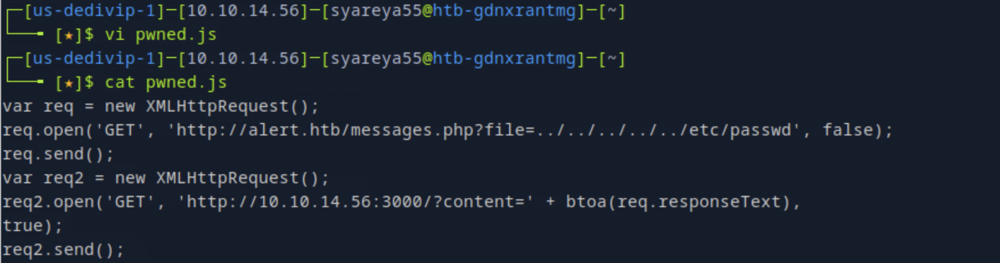
#### --再
#### 在Markdown Viewer 上传markdown.md,点击Share Markdown获得不一样的url
#### 在Contact Us上传url ,信息便会传回$ python3 -m http.server 3000
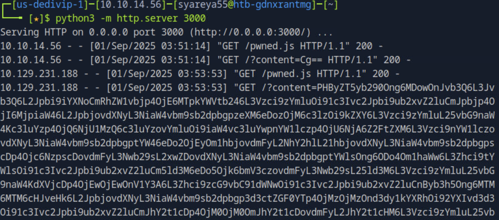
#### 使用Base64编码响应
```
$ echo "PHByZT48VmlydHVhbEhvc3QgKjo4MD4KICAgIFNlcnZlck5hbWUgYWxlcnQuaHRiCgogICAgRG9jdW1lbnRSb290IC92YXIvd3d3L2FsZXJ0Lmh0YgoKICAgIDxEaXJlY3RvcnkgL3Zhci93d3cvYWxlcnQuaHRiPgogICAgICAgIE9wdGlvbnMgRm9sbG93U3ltTGlua3MgTXVsdGlWaWV3cwogICAgICAgIEFsbG93T3ZlcnJpZGUgQWxsCiAgICA8L0RpcmVjdG9yeT4KCiAgICBSZXdyaXRlRW5naW5lIE9uCiAgICBSZXdyaXRlQ29uZCAle0hUVFBfSE9TVH0gIV5hbGVydFwuaHRiJAogICAgUmV3cml0ZUNvbmQgJXtIVFRQX0hPU1R9ICFeJAogICAgUmV3cml0ZVJ1bGUgXi8/KC4qKSQgaHR0cDovL2FsZXJ0Lmh0Yi8kMSBbUj0zMDEsTF0KCiAgICBFcnJvckxvZyAke0FQQUNIRV9MT0dfRElSfS9lcnJvci5sb2cKICAgIEN1c3RvbUxvZyAke0FQQUNIRV9MT0dfRElSfS9hY2Nlc3MubG9nIGNvbWJpbmVkCjwvVmlydHVhbEhvc3Q+Cgo8VmlydHVhbEhvc3QgKjo4MD4KICAgIFNlcnZlck5hbWUgc3RhdGlzdGljcy5hbGVydC5odGIKCiAgICBEb2N1bWVudFJvb3QgL3Zhci93d3cvc3RhdGlzdGljcy5hbGVydC5odGIKCiAgICA8RGlyZWN0b3J5IC92YXIvd3d3L3N0YXRpc3RpY3MuYWxlcnQuaHRiPgogICAgICAgIE9wdGlvbnMgRm9sbG93U3ltTGlua3MgTXVsdGlWaWV3cwogICAgICAgIEFsbG93T3ZlcnJpZGUgQWxsCiAgICA8L0RpcmVjdG9yeT4KCiAgICA8RGlyZWN0b3J5IC92YXIvd3d3L3N0YXRpc3RpY3MuYWxlcnQuaHRiPgogICAgICAgIE9wdGlvbnMgSW5kZXhlcyBGb2xsb3dTeW1MaW5rcyBNdWx0aVZpZXdzCiAgICAgICAgQWxsb3dPdmVycmlkZSBBbGwKICAgICAgICBBdXRoVHlwZSBCYXNpYwogICAgICAgIEF1dGhOYW1lICJSZXN0cmljdGVkIEFyZWEiCiAgICAgICAgQXV0aFVzZXJGaWxlIC92YXIvd3d3L3N0YXRpc3RpY3MuYWxlcnQuaHRiLy5odHBhc3N3ZAogICAgICAgIFJlcXVpcmUgdmFsaWQtdXNlcgogICAgPC9EaXJlY3Rvcnk+CgogICAgRXJyb3JMb2cgJHtBUEFDSEVfTE9HX0RJUn0vZXJyb3IubG9nCiAgICBDdXN0b21Mb2cgJHtBUEFDSEVfTE9HX0RJUn0vYWNjZXNzLmxvZyBjb21iaW5lZAo8L1ZpcnR1YWxIb3N0PgoKPC9wcmU+Cg==" | base64 -d
```
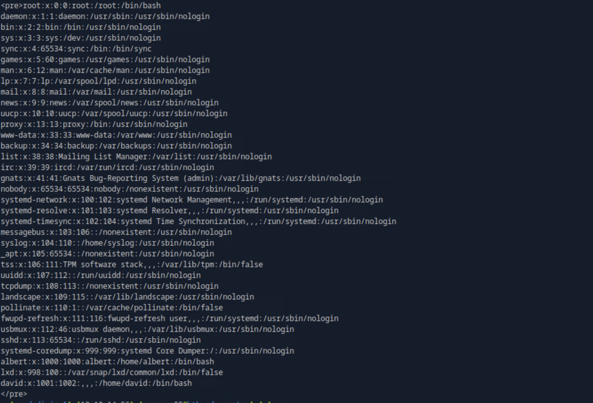
#### 从/etc/passwd得出 倒数第三个albert用户
#### Apache 默认安装后确实会生成 000-default.conf
#### 修改pwned.js
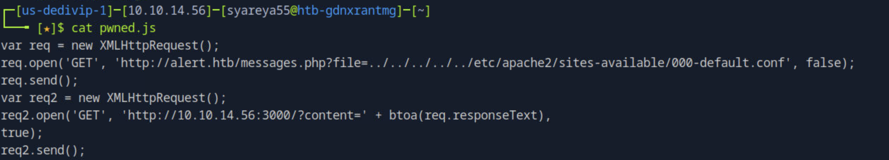
#### --再
#### 在Markdown Viewer 上传markdown.md,点击Share Markdown获得不一样的url
#### 在Contact Us上传url ,信息便会传回$ python3 -m http.server 3000
#### 使用Base64编码响应
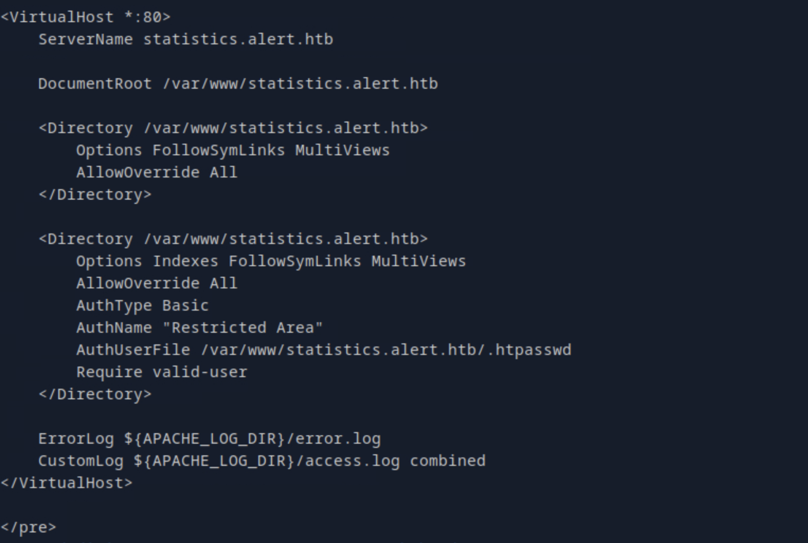
#### 得到了路径/var/www/statistics.alert.htb
#### 修改pwned.js
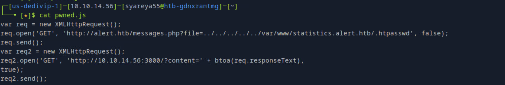
#### --再
#### 在Markdown Viewer 上传markdown.md,点击Share Markdown获得不一样的url
#### 在Contact Us上传url ,信息便会传回$ python3 -m http.server 3000
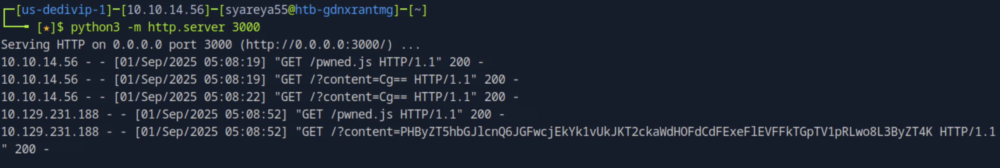
#### 使用Base64编码响应
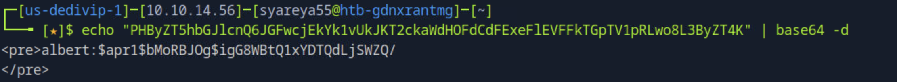
#### 这表明这里使用的哈希是Apache $apr1$ MD5，使用Hashcat来破解它
### 3.3 Hashcat
```
$ ls /usr/share/wordlists/rockyou.txt.gz
$ cp /usr/share/wordlists/rockyou.txt.gz .
$ gunzip rockyou.txt.gz
```
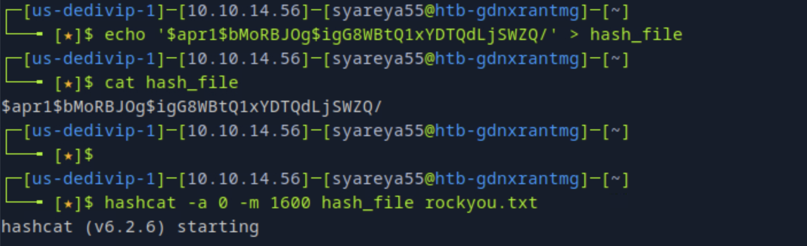
#### 获得密码为manchesterunited
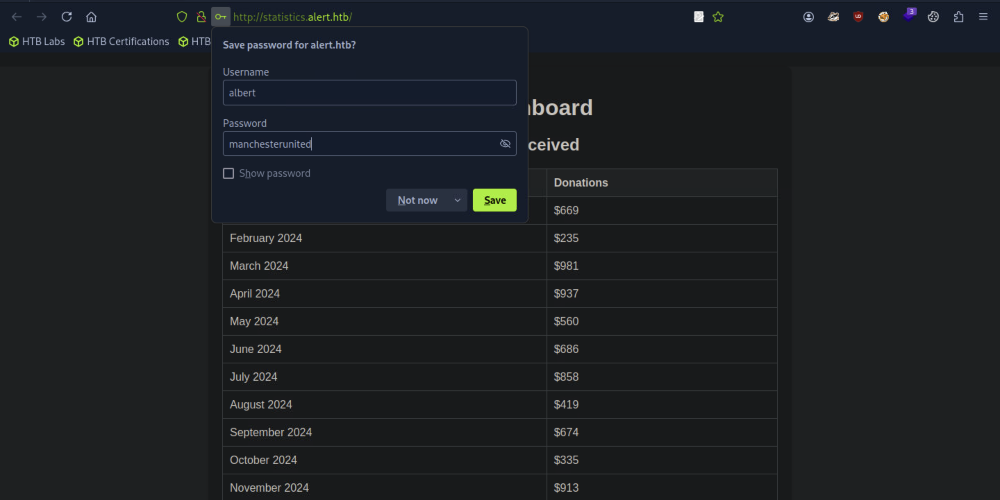
### 4.ssh
```
$ ssh albert@alert.htb
```
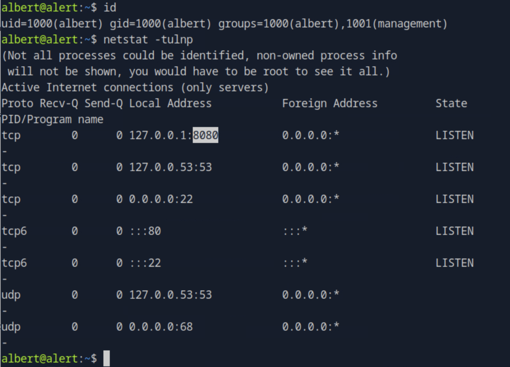
#### 有个本地端口侦听，连接它，在另一个端口
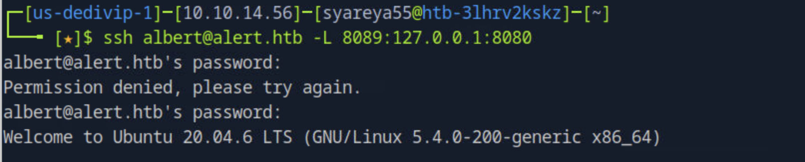
#### 访问浏览器http://127.0.0.1:8089
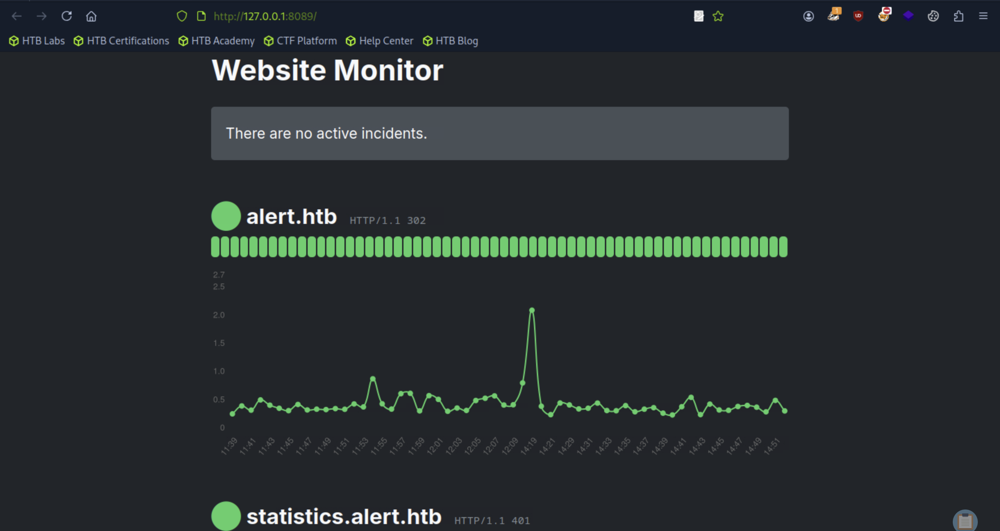
### 4.1 pspy64s
#### pspy64s 是 pspy 工具的一个编译版本。pspy 是一款用于 Linux 提权枚举的工具，可以在不需要 root 权限的情况下 监控进程执行。
```
它的主要用途是观察：
    * 有哪些定时任务（cron jobs）在后台执行；
    * 哪些服务或脚本被周期性运行；
    * 有哪些进程是以更高权限（如 root）执行的。
```
#### 在普通端口下载它，然后上传到ssh
```
$ wget https://github.com/DominicBreuker/pspy/releases/download/v1.2.0/pspy64s
$ python3 -m http.server 4000
```
#### 在ssh端下载它，运行
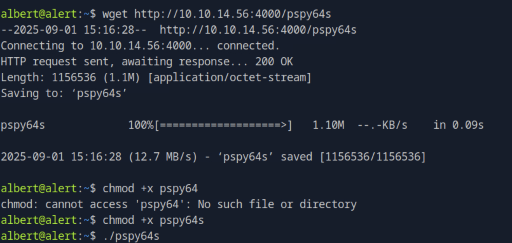
#### 查看输出，注意到一些有趣的东西，/opt/website-monitor/monitor.php在不断的运行
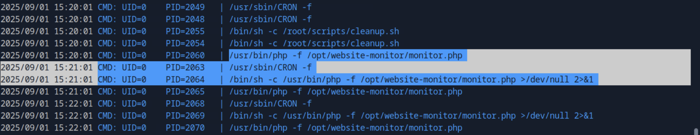
```
albert@alert:~$ cat /opt/website-monitor/monitor.php
```
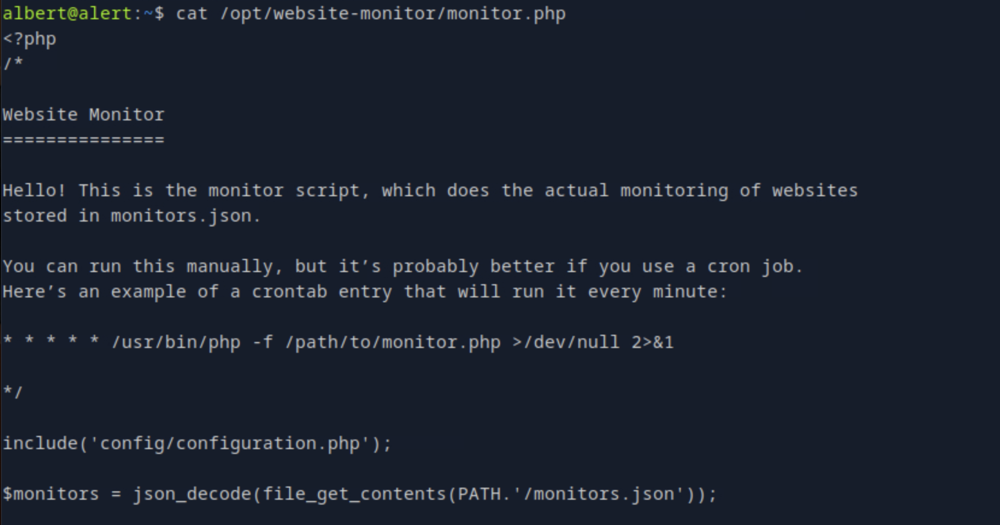
```
* * * * * * /usr/bin/php -f /path/to/monitor.php >/dev/null 2>&1

monitor.php 中包含了配置文件
* 
* include('config/configuration.php');
* 说明脚本在同级目录下有一个 config/ 子目录
* 里面放了 configuration.php，通常存储 PATH、监控列表等配置
```
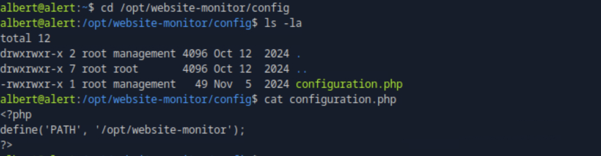
####  vi configuration.php
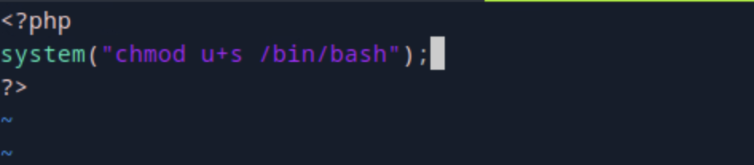
#### 修改之后，cat查看它，它还是会恢复，使用普通用户运行/bin/bash -p
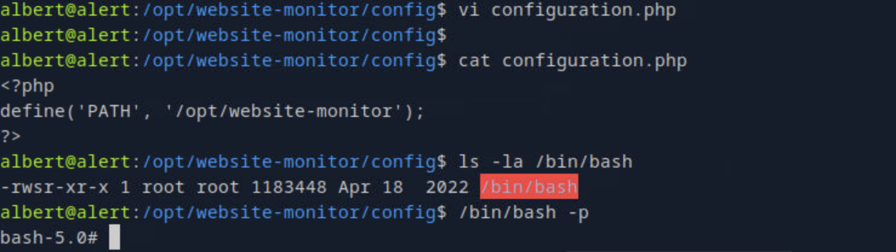
