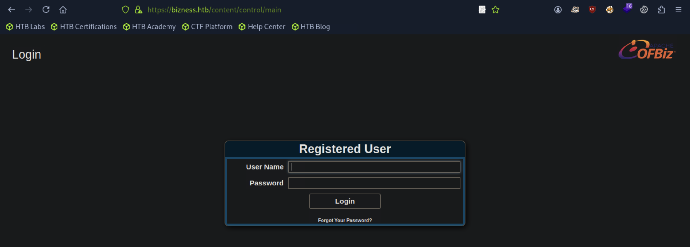

## Bizness
```
[★]$ nmap 10.129.96.208 -sC -sV
Starting Nmap 7.94SVN ( https://nmap.org ) at 2025-09-22 08:52 CDT
Nmap scan report for 10.129.96.208
Host is up (0.011s latency).
Not shown: 997 closed tcp ports (reset)
PORT    STATE SERVICE  VERSION
22/tcp  open  ssh      OpenSSH 8.4p1 Debian 5+deb11u3 (protocol 2.0)
| ssh-hostkey: 
|   3072 3e:21:d5:dc:2e:61:eb:8f:a6:3b:24:2a:b7:1c:05:d3 (RSA)
|   256 39:11:42:3f:0c:25:00:08:d7:2f:1b:51:e0:43:9d:85 (ECDSA)
|_  256 b0:6f:a0:0a:9e:df:b1:7a:49:78:86:b2:35:40:ec:95 (ED25519)
80/tcp  open  http     nginx 1.18.0
|_http-server-header: nginx/1.18.0
|_http-title: Did not follow redirect to https://bizness.htb/
443/tcp open  ssl/http nginx 1.18.0
|_http-server-header: nginx/1.18.0
| tls-nextprotoneg: 
|_  http/1.1
|_ssl-date: TLS randomness does not represent time
| tls-alpn: 
|_  http/1.1
| ssl-cert: Subject: organizationName=Internet Widgits Pty Ltd/stateOrProvinceName=Some-State/countryName=UK
| Not valid before: 2023-12-14T20:03:40
|_Not valid after:  2328-11-10T20:03:40
|_http-title: Did not follow redirect to https://bizness.htb/
Service Info: OS: Linux; CPE: cpe:/o:linux:linux_kernel
```
```
[★]$ echo '10.129.96.208 bizness.htb' | sudo tee -a /etc/hosts
```
#### 浏览到端口80将我们重定向到应用程序的https端点，端口443。我们找到了静态的商业网站，没有任何显著的功能
#### 我们使用feroxbuster执行目录扫描并发现托管在此上的潜在端点服务器。
#### 一些404
```
[★]$ feroxbuster -k -u https://bizness.htb
<SNIP>
404      GET        1l       61w      682c https://bizness.htb/META-INF
500      GET        7l       13w      177c https://bizness.htb/common/with
500      GET        7l       13w      177c https://bizness.htb/images/icons/wusage
500      GET        7l       13w      177c https://bizness.htb/common/JavaScript
404      GET        1l       61w      682c https://bizness.htb/images/META-INF
500      GET        7l       13w      177c https://bizness.htb/common/js/jquery/js
404      GET        1l       61w      682c https://bizness.htb/content/META-INF
404      GET        1l       61w      682c https://bizness.htb/catalog/META-INF
404      GET        1l       61w      682c https://bizness.htb/common/META-INF
<SNIP>
```
#### -k：忽略 TLS/SSL 证书校验（HTB 常用，不会因自签证书报错）|-u：目标 URL|默认情况下这条命令会用内置默认字典去爆破根路径，线程数、扩展名等都用默认值
#### 输出返回许多端点，其中许多端点都包含WEB-INF的路径。我们注意，它们还返回404错误代码。
#### 我们尝试浏览到上述端点之一，如/content/，并被重定向到Apache OFBiz服务的登录页面。

#### 查看页面的页脚，我们看到该服务的版本被公开，即发布18.12
#### Apache OFBiz （Open For Business）是一个开源的企业资源规划（ERP）系统用Java编写的。它提供了一套企业应用程序，可以集成和自动化许多组织的业务流程
Copyright (c) 2001-2025 The Apache Software Foundation. Powered by Apache OFBiz. Release 18.12 
### Foothold
#### 研究这个版本的Apache OFBiz让我们发现了一个关于预认证的信息，远程代码执行漏洞，分配CVE-2023-49070。
https://socprime.com/blog/cve-2023-49070-exploit-detection-a-critical-pre-auth-rce-vulnerability-in-apache-ofbiz/
#### 该漏洞源于OFBiz中不再正式使用的已弃用组件维护，但仍然存在于服务中，接受和处理XML-RPC请求。在兴奋中级别，所讨论的组件容易受到不安全反序列化的影响(这是常见的发生在基于java的应用程序中)。使用诸如ysoserial之类的工具，此漏洞可以用来执行任意代码。
访问这个https://github.com/frohoff/ysoserial/页面，下面Installation，点击latest release jar
#### 自披露以来，GitHub上现在存在一些概念验证（PoC）存储库，例如这一个。按照指示，我们首先将ysoserial.jar文件下载到本地系统。
https://github.com/abdoghazy2015/ofbiz-CVE-2023-49070-RCE-POC
```
[★]$ ls
ysoserial-all.jar
[★]$ wget https://raw.githubusercontent.com/abdoghazy2015/ofbiz-CVE-2023-49070-RCE-POC/refs/heads/main/exploit.py
```
#### ysoserial需要一个可用的Java安装，这是特定于平台的，超出了本文的范围这篇文章。本教程使用Java-11-openjdk。在大多数Linux发行版上，您可以使用以下命令检查备选的java安装命令:
```
[★]$ sudo update-alternatives --config java
```
#### 一旦下载了jar并复制了Python脚本，我们就会尝试运行这个漏洞。的Repository为我们提供了这些选项：
#### 在尝试获取shell之前，我们看看是否可以通过以下方式向攻击机器发送ICMP数据包执行ping命令。我们首先使用tcpdump为这些数据包设置一个监听器：
```
sudo tcpdump -i 2 icmp
```
#### 然后，我们使用以下参数运行该漏洞：
```
[★]$ sudo apt install openjdk-11-jre-headless -y
[★]$ sudo update-alternatives --config java
There are 2 choices for the alternative java (providing /usr/bin/java).

  Selection    Path                                         Priority   Status
------------------------------------------------------------
* 0            /usr/lib/jvm/java-17-openjdk-amd64/bin/java   1711      auto mode
  1            /usr/lib/jvm/java-11-openjdk-amd64/bin/java   1111      manual mode
  2            /usr/lib/jvm/java-17-openjdk-amd64/bin/java   1711      manual mode

Press <enter> to keep the current choice[*], or type selection number: 1
update-alternatives: using /usr/lib/jvm/java-11-openjdk-amd64/bin/java to provide /usr/bin/java (java) in manual mode
[★]$ java -version
openjdk version "11.0.22" 2024-01-16
OpenJDK Runtime Environment (build 11.0.22+7-post-Debian-2)
OpenJDK 64-Bit Server VM (build 11.0.22+7-post-Debian-2, mixed mode, sharing)
```
