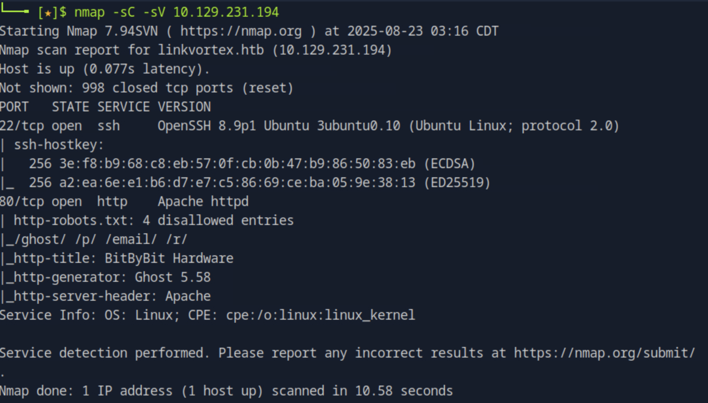
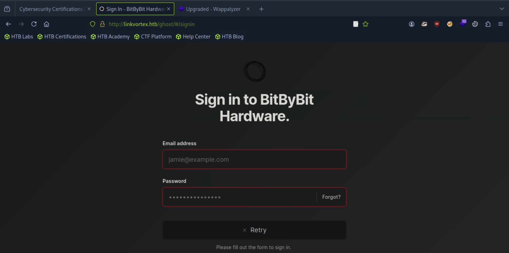
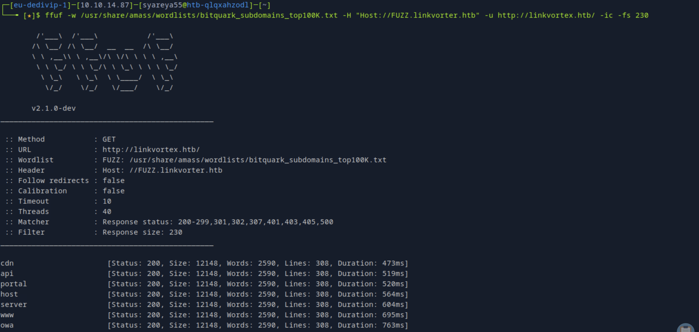
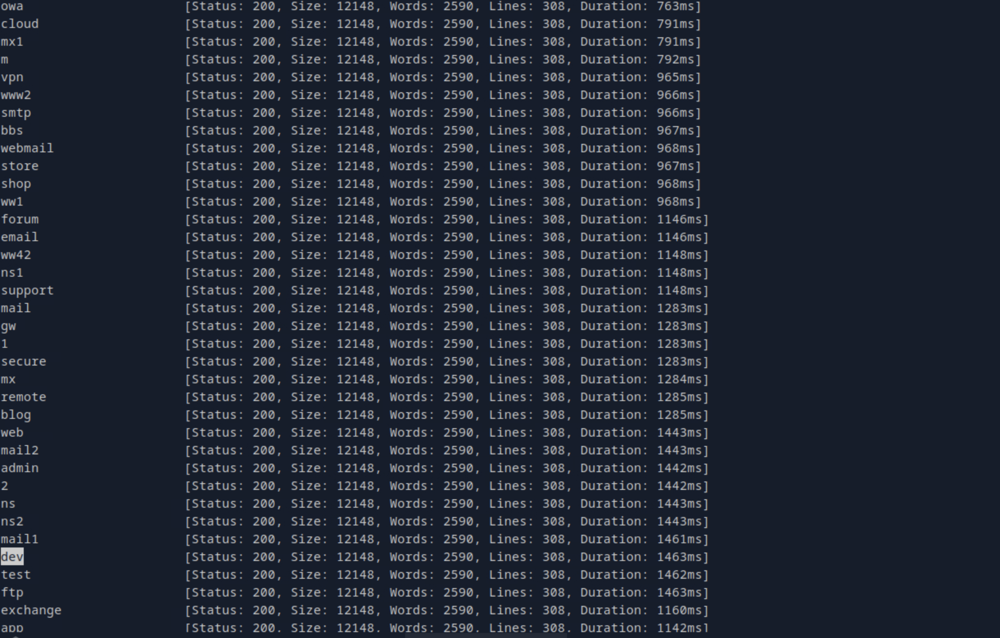
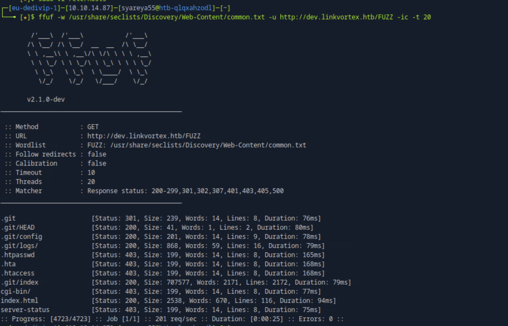
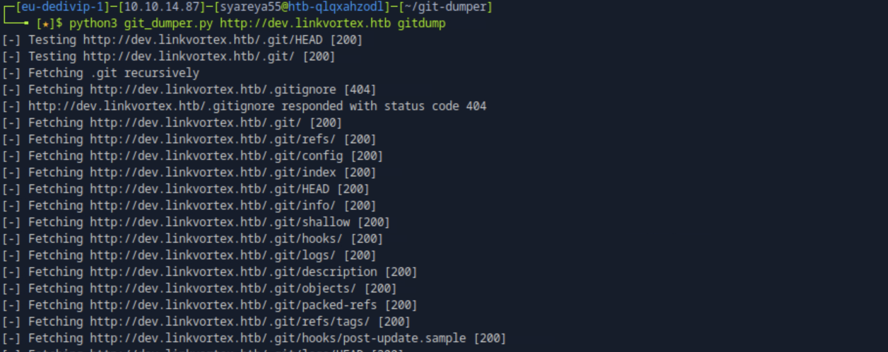
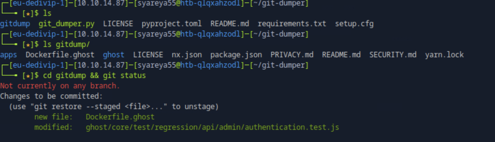
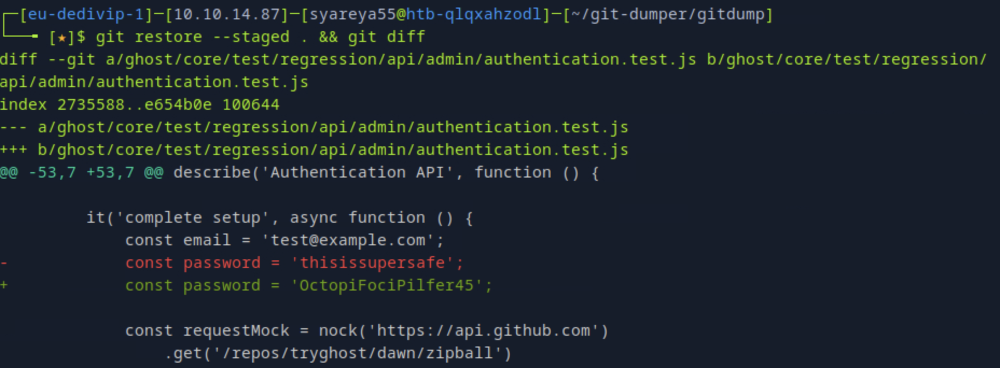
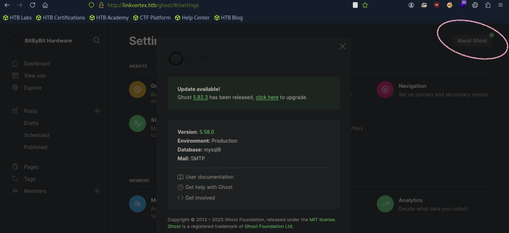

## Linkvortex

22/tcp

80/tcp

### 1.不寻常的操作，namp完之后加上浏览器出现的域名，再nmap一次，会出现新的信息
```
$ echo 'IP linkvortex.htb' | sudo tee -a /etc/hosts
$ nmap -sC -sV IP
```

#### robots.txt文件有四个不允许的输入页面
#### 登陆浏览器http://linkvortex.htb/ghost/

### 2.模糊枚举
#### 在/usr/share/里面没有自带的amass
```
$ sudo apt install amass -y
//在github下载仓库https://github.com/owasp-amass/amass 反倒没有找到amass里面的字典

$ ffuf -w /usr/share/amass/wordlists/bitquark_subdomains_top100K.txt -H "Host:
FUZZ.linkvortex.htb" -u http://linkvortex.htb/ -ic -fs 230
```
#### -ic 
Ignore comments，忽略字典文件里以 # 开头的注释行。
#### -fs 230
Filter by size，过滤掉响应大小 = 230 字节 的结果（说明这是默认错误页面的大小）；
这样就只会显示“和默认错误不同”的真正子域。

#### 这里的官方文档说是枚举出了子域名dev,但是上万个一模一样状态200信息的不同单词，...按 Ctrl+Shift+F 可以搜索

```
$ echo 'IP dev.linkvortex.htb' | sudo tee -a /etc/hosts
```
#### 访问浏览器的子域名：没有任何可以交互的东西，继续模糊枚举子域名
```
$ ffuf -w /usr/share/seclists/Discovery/Web-Content/common.txt -u
http://dev.linkvortex.htb/FUZZ -ic -t 20
```

#### 暴露的Git目录！

### 3.对于Git目录
#### 使用gitdumper之类的工具将目录转储到本地机器并对其进行探索进一步
#### 将指定正确的URL，然后gitdump将把目录转储到本地机器上
```
$ pip3 install requests_pkcs12  //依赖库
$ python3.11 -m pip install --upgrade pip

$ git clone https://github.com/arthaud/git-dumper.git

$ cd git-dumper
$ python3 git-dumper.py http://dev.linkvortex.htb gitdump
```

```
$ cd gitdump && git status
```

#### 修改的特定文件是authentication.test.js
```
$ git restore --staged . && git diff //查看当前所有修改的具体差异，同时取消了暂存状态
```

#### 得到了OctopiFociPilfer45

### 4.登陆浏览器http://linkvortex.htb/ghost/
#### 将尝试使用admin@linkvortex.htb作为电子邮件，因为看到它们是主网站上许多帖子的作者
#### 查看版本信息 /setting --> Ghost

#### 版本是5.58.0，漏洞是CVE-2023-40028
```
//三个相关的网址
https://www.cve.org/CVERecord?id=CVE-2023-40028
https://github.com/0xyassine/CVE-2023-40028/tree/master
https://ghost.org/help/imports/
```
### 5.操作
```

