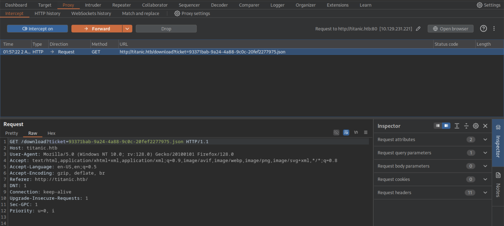
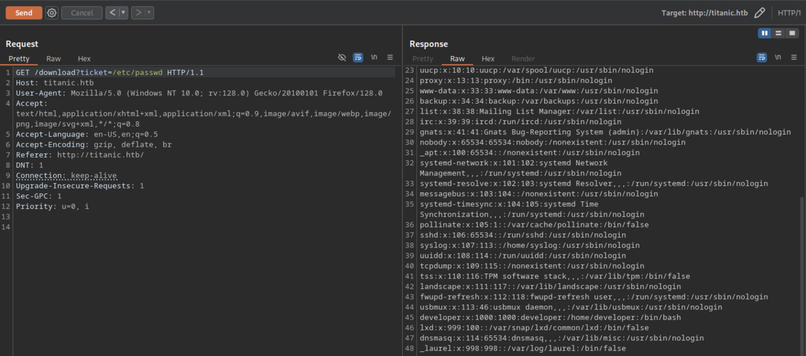
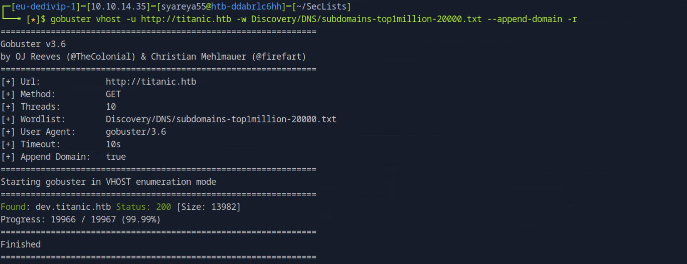
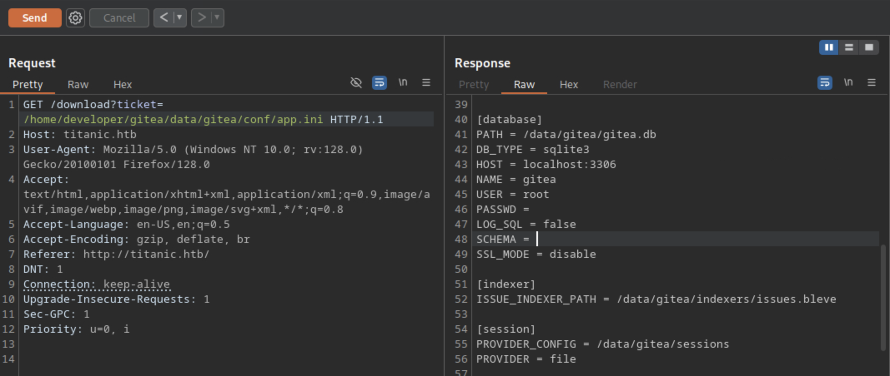

# Titanic

## 1.BurpSuite__http://titanic.htb
拦截下载页面，下载内容是提交信息，生成.json文件

### [1]直接Send,Forward,Forward立即跳出内容

### [2]在获得的GET请求 /download?ticket=/etc/password Send，内容会在Respinse中出现


## 2.找出子域名
Seclists 是一个非常流行的安全测试和渗透工具列表，里面包含了各种常用的字典和资源
`git clone https://github.com/danielmiessler/SecLists.git`


## 3.在http://dev.titanic.htb的Explore里面，总体主要内容，非操作
```
Repositories
├── developer/docker-config      # Docker 配置集合
│   ├── gitea/                   # 包含 Gitea 服务的 docker-compose 配置
│   │   └── docker-compose.yml
│   └── mysql/                   # 包含 MySQL 服务的 docker-compose 配置
│       └── docker-compose.yml
└── developer/flash-app          # 基于 Python 的 Web 应用，使用 Flask 框架开发
```
docker-compose.yml
```
version: '3'  ##Docker Compose V3 格式，适用于 Docker 1.13+

services:     ##定义服务块，每一个子项如gitea就是一个独立的服务
  gitea:      ##定义一个名为 gitea 的服务，也就是 Gitea Git 服务器实例
    image: gitea/gitea      ##指定使用的镜像为 gitea/gitea，这是官方发布在 Docker Hub 上的 Gitea 镜像
    container_name: gitea   ##给这个容器取一个固定的名字叫 gitea
    ports:
      - "127.0.0.1:3000:3000"      ##把宿主机的 localhost:3000 映射到容器的 3000 端口，用于访问 Gitea Web UI
      - "127.0.0.1:2222:22"        ##把宿主机的 localhost:2222 映射到容器的 22 端口，供 Git over SSH 使用
    volumes:                             ##即使容器被销毁，数据也会保留在宿主机中
      - /home/developer/gitea/data:/data ##数据挂载：宿主机路径/home/developer/gitea/data 映射到容器的/data 目录
    environment:        ##环境变量设置
      - USER_UID=1000   ##设置容器内运行 Gitea 的用户 UID 为 1000
      - USER_GID=1000   ##设置 GID 为 1000；可以避免数据权限不一致的问题，通常 1000 是默认的第一个非 root 用户 UID
    restart: always     ##指定容器自动重启策略为 always；无论是否正常退出，都会重启容器；系统重启后也会自动拉起这个服务
```
## 4.搬运容器操作
#### 在主机上创建一个文件夹，把 docker-compose.yml 粘贴进去，然后运行 docker-compose up -d，即可启动容器。
```
$ mkdir gitea
$ cd gitea
$ sudo systemctl start docker            //启动 Docker 守护进程

$ vi docker-compose.yml                  //在http://dev.titanic.htb复制docker-compose.yml里边的内容
$ docker compose up -d                   //启动容器,-d 表示后台运行
$ sudo docker compose ps                 //查看当前运行的容器状态
$ sudo docker compose exec -it gitea sh  //exec：执行容器内命令;-it：交互模式并分配伪终端;gitea：容器名称;sh：进入容器时使用的 Shell

/ # pwd                                  //在容器中查看目录结构
/ # cd data/gitea/conf                   //通常这是挂载卷映射的目录
/data/gitea/conf # ls                    //显示 app.ini，它是 Gitea 的主配置文件
app.ini
```
#### 结果获得一个路径为/data/gitea/conf/app.ini
因为
```
//docker-compose.yml 中配置了 volume
volumes:  
  - /home/developer/gitea/data:/data
```
所以
```
容器内的 /data/gitea/conf/app.ini
=
宿主机的 /home/developer/gitea/data/gitea/conf/app.ini
```
## 5.使用1.BurpSuite__http://titanic.htb把/etc/passwd换成得到的路径

#### 目的：BurpSuite（或者说攻击者）能通过 app.ini 中这段配置发现 SQLite 数据库的路径：
```
[database]
DB_TYPE = sqlite3
PATH = /data/gitea/gitea.db //Gitea 使用 SQLite 数据库，并且数据库文件就存放在这
```
## 6.


