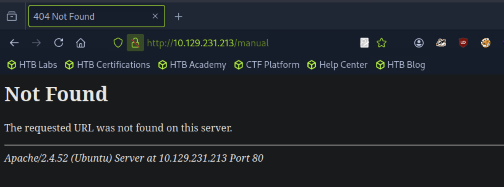
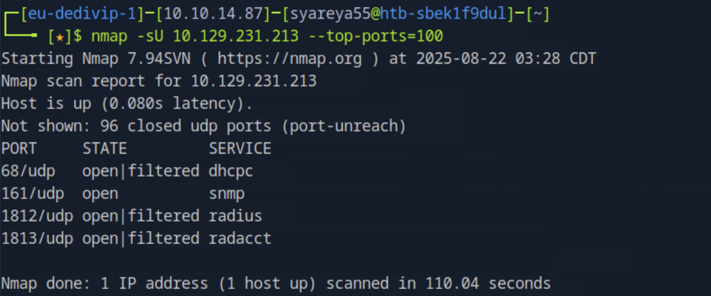
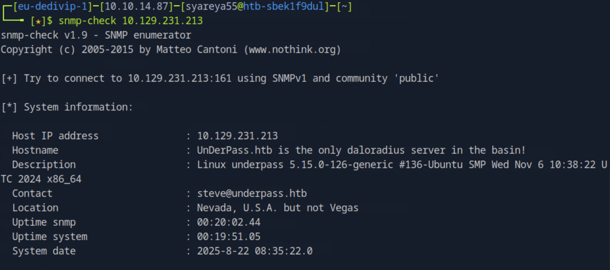
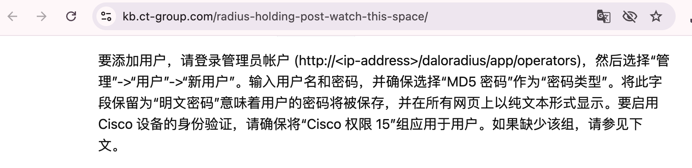
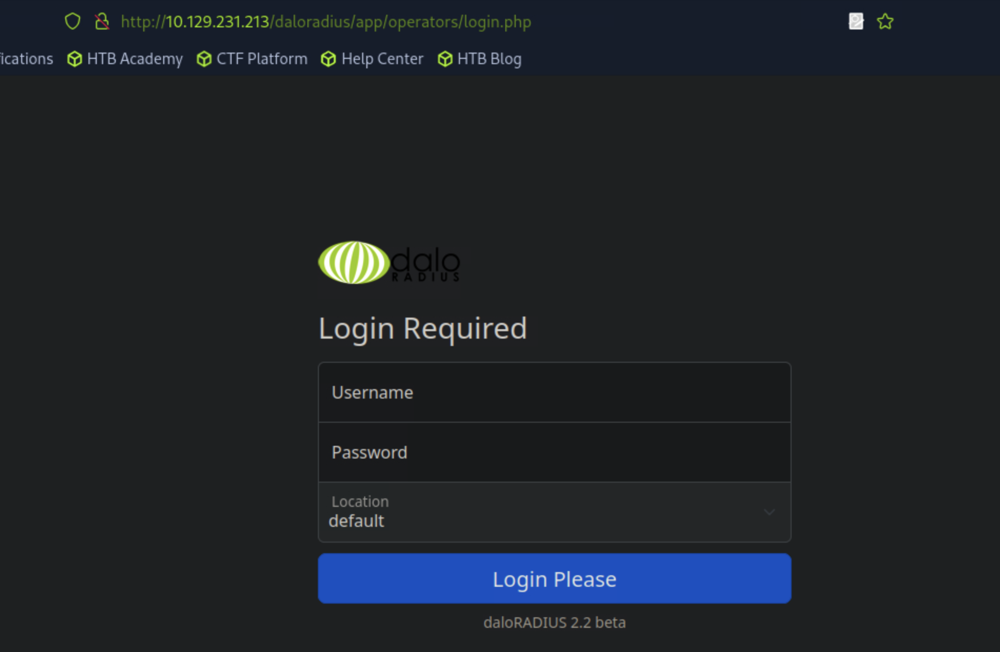
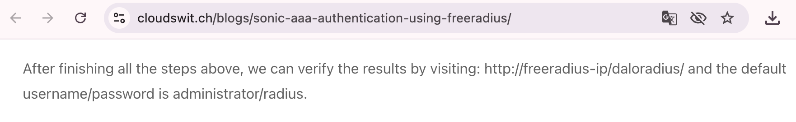
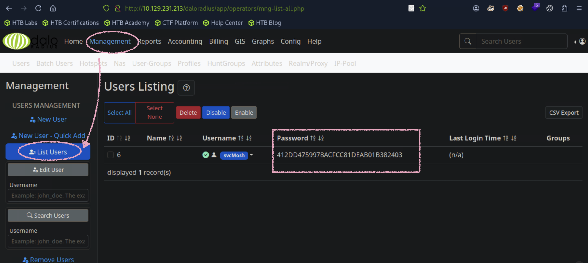
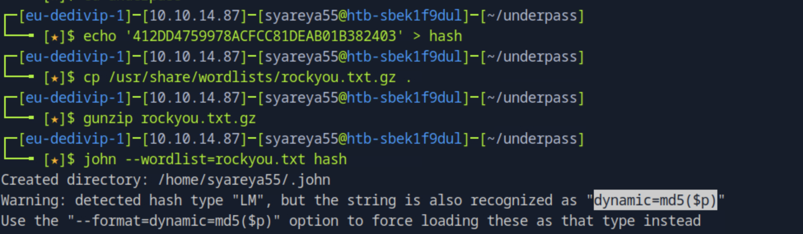
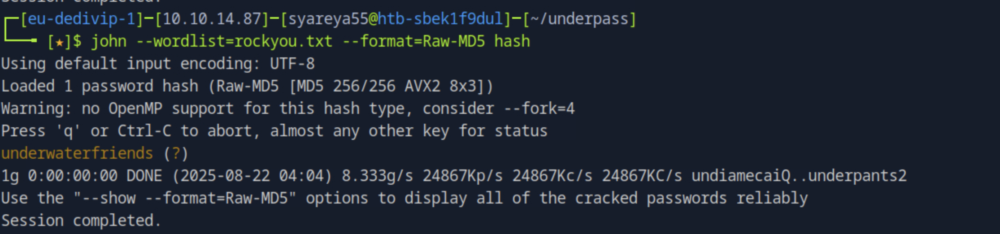
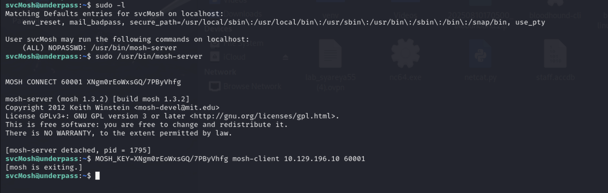

## UnderPass

22 | 80


### 枚举Nmap自带的“前 100 个最常用端口
```
$ nmap -sU 10.129.231.213 --top-ports=100
```

### 有个正常开启的snmp端口
```
$ snmp-check 10.129.231.213
```

### 域名出现了
```
$ echo '10.129.231.213 underpass.htb' | sudo tee -a /etc/hosts
```
### 同时也出现了一个服务器 daloraduis
#### 1.google搜索它：daloRADIUS是一个先进的RADIUS web平台，旨在管理热点和通用ISP部署。它具有丰富的用户管理，图形化
#### 尝试访问http://underpass.htb/daloradius/

#### 2.google搜索daloraduis --> http://underpass.htb/daloradius/app/operators 在这发现可以登录的路径


#### 3.google搜索daloraduis --> https://cloudswit.ch/blogs/sonic-aaa-authentication-using-freeradius/ 在这发现存在默认凭据administrator/radius

### 在daloraduis应用程序页面发现用户svcMosh和hash密码，Management --> List Users

#### 解hash


#### 密码为underwaterfriends
### 登陆ssh 
```
ssh svcMosh@underpass.htb

svcMosh@underpass:~$ cat user.txt
```
### sudo配置
#### 说什么和 SSH 不同，mosh 完全依赖 UDP，说什么很可能 UDP 流量根本没有对外放通 ｜ 我离开了HTB的Pwnbox
#### 其实很纯粹，在可运行server端的地方，也运行client端

