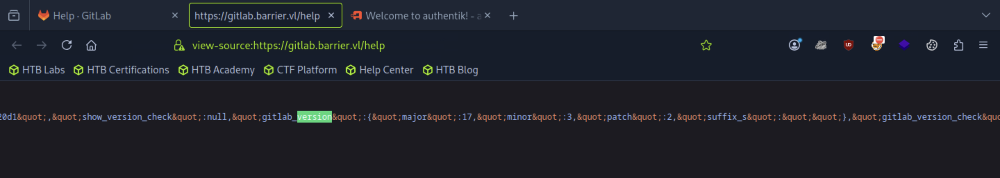
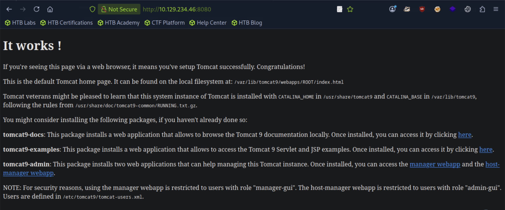
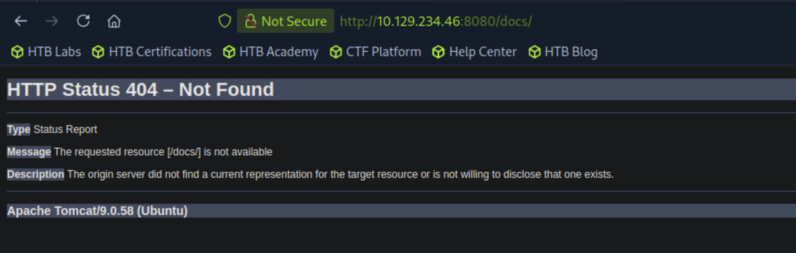
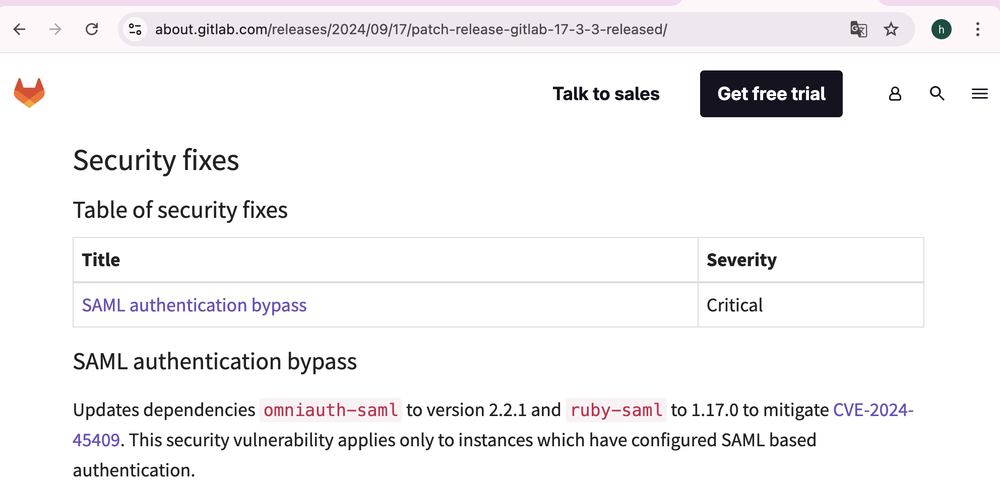
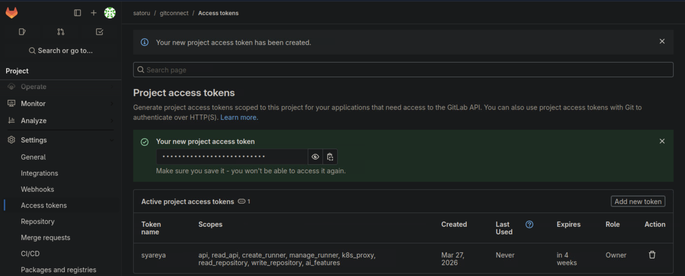

## Barrier
```
[★]$ nmap -p- -vvv --min-rate 10000 10.129.234.46
PORT     STATE SERVICE        REASON
22/tcp   open  ssh            syn-ack ttl 63
80/tcp   open  http           syn-ack ttl 62
443/tcp  open  https          syn-ack ttl 62
8080/tcp open  http-proxy     syn-ack ttl 63
9000/tcp open  cslistener     syn-ack ttl 62
9443/tcp open  tungsten-https syn-ack ttl 62
```

<details>
<summary>Nmap</summary>

```
[★]$ nmap -p 22,80,443,8080,9000,9443 -sCV 10.129.234.46
Starting Nmap 7.94SVN ( https://nmap.org ) at 2026-03-27 01:57 CDT
Nmap scan report for 10.129.234.46
Host is up (0.0091s latency).

PORT     STATE SERVICE             VERSION
22/tcp   open  ssh                 OpenSSH 8.9p1 Ubuntu 3ubuntu0.13 (Ubuntu Linux; protocol 2.0)
| ssh-hostkey: 
|_  3072 f3:6c:aa:fe:2c:20:f6:55:a0:5b:61:54:cf:39:17:d0 (RSA)
80/tcp   open  http                nginx
|_http-title: Did not follow redirect to https://gitlab.barrier.vl:443/
443/tcp  open  ssl/http            nginx
|_ssl-date: TLS randomness does not represent time
| ssl-cert: Subject: commonName=gitlab.barrier.vl/organizationName=Mycompany/stateOrProvinceName=Some-State/countryName=AU
| Subject Alternative Name: DNS:gitlab.barrier.vl
| Not valid before: 2026-01-28T11:21:55
|_Not valid after:  2126-01-04T11:21:55
| http-title: Sign in \xC2\xB7 GitLab
|_Requested resource was https://10.129.234.46/users/sign_in
|_http-trane-info: Problem with XML parsing of /evox/about
| http-robots.txt: 58 disallowed entries (15 shown)
| / /autocomplete/users /autocomplete/projects /search 
| /admin /profile /dashboard /users /api/v* /help /s/ /-/profile 
|_/-/user_settings/profile /-/ide/ /-/experiment
8080/tcp open  http                Apache Tomcat
|_http-open-proxy: Proxy might be redirecting requests
|_http-title: Apache Tomcat
9000/tcp open  cslistener?
| fingerprint-strings: 
|   GenericLines, Help, Kerberos, RTSPRequest, SSLSessionReq, TLSSessionReq, TerminalServerCookie: 
|     HTTP/1.1 400 Bad Request
|     Content-Type: text/plain; charset=utf-8
|     Connection: close
|     Request
|   GetRequest: 
|     HTTP/1.0 302 Found
|     Content-Length: 0
|     Content-Type: text/html; charset=utf-8
|     Date: Fri, 27 Mar 2026 06:57:34 GMT
|     Location: /flows/-/default/authentication/?next=/
|     Referrer-Policy: same-origin
|     Vary: Accept-Encoding
|     Vary: Cookie
|     X-Authentik-Id: d172472750544afd88d5a610fdb69de7
|     X-Content-Type-Options: nosniff
|     X-Frame-Options: DENY
|     X-Powered-By: authentik
|   HTTPOptions: 
|     HTTP/1.0 302 Found
|     Content-Length: 0
|     Content-Type: text/html; charset=utf-8
|     Date: Fri, 27 Mar 2026 06:57:34 GMT
|     Location: /flows/-/default/authentication/?next=/
|     Referrer-Policy: same-origin
|     Vary: Accept-Encoding
|     Vary: Cookie
|     X-Authentik-Id: 8a82fc32bf484167a1a24779ddacf494
|     X-Content-Type-Options: nosniff
|     X-Frame-Options: DENY
|_    X-Powered-By: authentik
9443/tcp open  ssl/tungsten-https?
| ssl-cert: Subject: commonName=authentik default certificate/organizationName=authentik
| Subject Alternative Name: DNS:*
| Not valid before: 2026-03-27T06:47:56
|_Not valid after:  2027-03-27T06:47:56
| fingerprint-strings: 
|   GenericLines, Help, Kerberos, RTSPRequest, SSLSessionReq, TLSSessionReq, TerminalServerCookie: 
|     HTTP/1.1 400 Bad Request
|     Content-Type: text/plain; charset=utf-8
|     Connection: close
|     Request
|   GetRequest: 
|     HTTP/1.0 302 Found
|     Content-Length: 0
|     Content-Type: text/html; charset=utf-8
|     Date: Fri, 27 Mar 2026 06:57:36 GMT
|     Location: /flows/-/default/authentication/?next=/
|     Referrer-Policy: same-origin
|     Vary: Accept-Encoding
|     Vary: Cookie
|     X-Authentik-Id: 651632576ad64bf5919474ba481c756f
|     X-Content-Type-Options: nosniff
|     X-Frame-Options: DENY
|     X-Powered-By: authentik
|   HTTPOptions: 
|     HTTP/1.0 302 Found
|     Content-Length: 0
|     Content-Type: text/html; charset=utf-8
|     Date: Fri, 27 Mar 2026 06:57:37 GMT
|     Location: /flows/-/default/authentication/?next=/
|     Referrer-Policy: same-origin
|     Vary: Accept-Encoding
|     Vary: Cookie
|     X-Authentik-Id: 43875d4e797644708cd824977962cf81
|     X-Content-Type-Options: nosniff
|     X-Frame-Options: DENY
|_    X-Powered-By: authentik
2 services unrecognized despite returning data. If you know the service/version, please submit the following fingerprints at https://nmap.org/cgi-bin/submit.cgi?new-service :
==============NEXT SERVICE FINGERPRINT (SUBMIT INDIVIDUALLY)==============
SF-Port9000-TCP:V=7.94SVN%I=7%D=3/27%Time=69C62A5E%P=x86_64-pc-linux-gnu%r
SF:(GenericLines,67,"HTTP/1\.1\x20400\x20Bad\x20Request\r\nContent-Type:\x
SF:20text/plain;\x20charset=utf-8\r\nConnection:\x20close\r\n\r\n400\x20Ba
SF:d\x20Request")%r(GetRequest,16F,"HTTP/1\.0\x20302\x20Found\r\nContent-L
SF:ength:\x200\r\nContent-Type:\x20text/html;\x20charset=utf-8\r\nDate:\x2
SF:0Fri,\x2027\x20Mar\x202026\x2006:57:34\x20GMT\r\nLocation:\x20/flows/-/
SF:default/authentication/\?next=/\r\nReferrer-Policy:\x20same-origin\r\nV
SF:ary:\x20Accept-Encoding\r\nVary:\x20Cookie\r\nX-Authentik-Id:\x20d17247
SF:2750544afd88d5a610fdb69de7\r\nX-Content-Type-Options:\x20nosniff\r\nX-F
SF:rame-Options:\x20DENY\r\nX-Powered-By:\x20authentik\r\n\r\n")%r(HTTPOpt
SF:ions,16F,"HTTP/1\.0\x20302\x20Found\r\nContent-Length:\x200\r\nContent-
SF:Type:\x20text/html;\x20charset=utf-8\r\nDate:\x20Fri,\x2027\x20Mar\x202
SF:026\x2006:57:34\x20GMT\r\nLocation:\x20/flows/-/default/authentication/
SF:\?next=/\r\nReferrer-Policy:\x20same-origin\r\nVary:\x20Accept-Encoding
SF:\r\nVary:\x20Cookie\r\nX-Authentik-Id:\x208a82fc32bf484167a1a24779ddacf
SF:494\r\nX-Content-Type-Options:\x20nosniff\r\nX-Frame-Options:\x20DENY\r
SF:\nX-Powered-By:\x20authentik\r\n\r\n")%r(RTSPRequest,67,"HTTP/1\.1\x204
SF:00\x20Bad\x20Request\r\nContent-Type:\x20text/plain;\x20charset=utf-8\r
SF:\nConnection:\x20close\r\n\r\n400\x20Bad\x20Request")%r(Help,67,"HTTP/1
SF:\.1\x20400\x20Bad\x20Request\r\nContent-Type:\x20text/plain;\x20charset
SF:=utf-8\r\nConnection:\x20close\r\n\r\n400\x20Bad\x20Request")%r(SSLSess
SF:ionReq,67,"HTTP/1\.1\x20400\x20Bad\x20Request\r\nContent-Type:\x20text/
SF:plain;\x20charset=utf-8\r\nConnection:\x20close\r\n\r\n400\x20Bad\x20Re
SF:quest")%r(TerminalServerCookie,67,"HTTP/1\.1\x20400\x20Bad\x20Request\r
SF:\nContent-Type:\x20text/plain;\x20charset=utf-8\r\nConnection:\x20close
SF:\r\n\r\n400\x20Bad\x20Request")%r(TLSSessionReq,67,"HTTP/1\.1\x20400\x2
SF:0Bad\x20Request\r\nContent-Type:\x20text/plain;\x20charset=utf-8\r\nCon
SF:nection:\x20close\r\n\r\n400\x20Bad\x20Request")%r(Kerberos,67,"HTTP/1\
SF:.1\x20400\x20Bad\x20Request\r\nContent-Type:\x20text/plain;\x20charset=
SF:utf-8\r\nConnection:\x20close\r\n\r\n400\x20Bad\x20Request");
==============NEXT SERVICE FINGERPRINT (SUBMIT INDIVIDUALLY)==============
SF-Port9443-TCP:V=7.94SVN%T=SSL%I=7%D=3/27%Time=69C62A61%P=x86_64-pc-linux
SF:-gnu%r(GetRequest,16F,"HTTP/1\.0\x20302\x20Found\r\nContent-Length:\x20
SF:0\r\nContent-Type:\x20text/html;\x20charset=utf-8\r\nDate:\x20Fri,\x202
SF:7\x20Mar\x202026\x2006:57:36\x20GMT\r\nLocation:\x20/flows/-/default/au
SF:thentication/\?next=/\r\nReferrer-Policy:\x20same-origin\r\nVary:\x20Ac
SF:cept-Encoding\r\nVary:\x20Cookie\r\nX-Authentik-Id:\x20651632576ad64bf5
SF:919474ba481c756f\r\nX-Content-Type-Options:\x20nosniff\r\nX-Frame-Optio
SF:ns:\x20DENY\r\nX-Powered-By:\x20authentik\r\n\r\n")%r(GenericLines,67,"
SF:HTTP/1\.1\x20400\x20Bad\x20Request\r\nContent-Type:\x20text/plain;\x20c
SF:harset=utf-8\r\nConnection:\x20close\r\n\r\n400\x20Bad\x20Request")%r(H
SF:TTPOptions,16F,"HTTP/1\.0\x20302\x20Found\r\nContent-Length:\x200\r\nCo
SF:ntent-Type:\x20text/html;\x20charset=utf-8\r\nDate:\x20Fri,\x2027\x20Ma
SF:r\x202026\x2006:57:37\x20GMT\r\nLocation:\x20/flows/-/default/authentic
SF:ation/\?next=/\r\nReferrer-Policy:\x20same-origin\r\nVary:\x20Accept-En
SF:coding\r\nVary:\x20Cookie\r\nX-Authentik-Id:\x2043875d4e797644708cd8249
SF:77962cf81\r\nX-Content-Type-Options:\x20nosniff\r\nX-Frame-Options:\x20
SF:DENY\r\nX-Powered-By:\x20authentik\r\n\r\n")%r(RTSPRequest,67,"HTTP/1\.
SF:1\x20400\x20Bad\x20Request\r\nContent-Type:\x20text/plain;\x20charset=u
SF:tf-8\r\nConnection:\x20close\r\n\r\n400\x20Bad\x20Request")%r(Help,67,"
SF:HTTP/1\.1\x20400\x20Bad\x20Request\r\nContent-Type:\x20text/plain;\x20c
SF:harset=utf-8\r\nConnection:\x20close\r\n\r\n400\x20Bad\x20Request")%r(S
SF:SLSessionReq,67,"HTTP/1\.1\x20400\x20Bad\x20Request\r\nContent-Type:\x2
SF:0text/plain;\x20charset=utf-8\r\nConnection:\x20close\r\n\r\n400\x20Bad
SF:\x20Request")%r(TerminalServerCookie,67,"HTTP/1\.1\x20400\x20Bad\x20Req
SF:uest\r\nContent-Type:\x20text/plain;\x20charset=utf-8\r\nConnection:\x2
SF:0close\r\n\r\n400\x20Bad\x20Request")%r(TLSSessionReq,67,"HTTP/1\.1\x20
SF:400\x20Bad\x20Request\r\nContent-Type:\x20text/plain;\x20charset=utf-8\
SF:r\nConnection:\x20close\r\n\r\n400\x20Bad\x20Request")%r(Kerberos,67,"H
SF:TTP/1\.1\x20400\x20Bad\x20Request\r\nContent-Type:\x20text/plain;\x20ch
SF:arset=utf-8\r\nConnection:\x20close\r\n\r\n400\x20Bad\x20Request");
Service Info: OS: Linux; CPE: cpe:/o:linux:linux_kernel
```
</details>

#### 加入域名
```
[★]$ echo '10.129.234.46 barrier.vl gitlab.barrier.vl' | sudo tee -a /etc/hosts
10.129.234.46 barrier.vl gitlab.barrier.vl
```
OpenSSH 8.9p1 Ubuntu 3ubuntu0.13 (Ubuntu Linux; protocol 2.0)
#### 关键词搜索：'openssh 3ubuntu0.13 jammy' , 'Ubuntu package openssh 8.9'
#### 根据OpenSSH 版本判断，主机很可能运行的是 Ubuntu 22.04 jammy LTS（或者可能是 22.10 kinetic）
#### 端口 22 和 8080 的 TTL 值显示为 63，这是距离仅一跳的 Linux 系统的预期 TTL 值：
```
[★]$ sudo lft 10.129.234.46:22
traceroute to 10.129.234.46 (10.129.234.46), 30 hops max, 60 byte packets
 1  10.10.14.1 (10.10.14.1)  8.465 ms  8.258 ms
 2  barrier.vl (10.129.234.46)  8.604 ms  8.638 ms
[★]$ sudo lft 10.129.234.46:8080
traceroute to 10.129.234.46 (10.129.234.46), 30 hops max, 60 byte packets
 1  10.10.14.1 (10.10.14.1)  8.392 ms  8.412 ms
 2  barrier.vl (10.129.234.46)  9.141 ms  8.816 ms
```
#### 其他四个端口还需要一次跃点才能到达：
```
[★]$ sudo lft 10.129.234.46:80
traceroute to 10.129.234.46 (10.129.234.46), 30 hops max, 60 byte packets
 1  10.10.14.1 (10.10.14.1)  8.459 ms  8.349 ms
 2  barrier.vl (10.129.234.46)  8.776 ms  9.688 ms
 3  barrier.vl (10.129.234.46)  8.877 ms  8.806 ms
[★]$ sudo lft 10.129.234.46:443
traceroute to 10.129.234.46 (10.129.234.46), 30 hops max, 60 byte packets
 1  10.10.14.1 (10.10.14.1)  8.467 ms  8.471 ms
 2  barrier.vl (10.129.234.46)  8.750 ms  8.955 ms
 3  barrier.vl (10.129.234.46)  9.092 ms  8.701 ms
[★]$ sudo lft 10.129.234.46:9000
traceroute to 10.129.234.46 (10.129.234.46), 30 hops max, 60 byte packets
 1  10.10.14.1 (10.10.14.1)  8.511 ms  8.385 ms
 2  barrier.vl (10.129.234.46)  8.808 ms  8.865 ms
 3  barrier.vl (10.129.234.46)  9.019 ms  8.872 ms
[★]$ sudo lft 10.129.234.46:9443
traceroute to 10.129.234.46 (10.129.234.46), 30 hops max, 60 byte packets
 1  10.10.14.1 (10.10.14.1)  8.250 ms  8.254 ms
 2  barrier.vl (10.129.234.46)  8.730 ms  8.911 ms
 3  barrier.vl (10.129.234.46)  8.881 ms  9.138 ms
```
#### 这表明它们正在一个或多个容器中运行
#### 通过访问浏览器 端口 9000 和 9443 都显示引用Authentik 的标头
#### 80端口左下角'Explore',可以看到一个公共仓库,有一个gitconnect.py
<details>
<summary>gitconnect.py</summary>

```
import requests
from urllib.parse import urljoin
import urllib3
urllib3.disable_warnings(urllib3.exceptions.InsecureRequestWarning)

def get_gitlab_repos():
    base_url = 'https://gitlab.barrier.vl'
    api_url = urljoin(base_url, '/api/v4/')
    
    auth_data = {
        'grant_type': 'password',
        'username': 'satoru',
        'password': '***'
    }
    
    try:
        session = requests.Session()
        session.verify = False
        
        response = session.post(urljoin(base_url, '/oauth/token'), data=auth_data)
        response.raise_for_status()
        
        token = response.json()['access_token']
        headers = {'Authorization': f'Bearer {token}'}
        
        projects_response = session.get(urljoin(api_url, 'projects'), headers=headers)
        projects_response.raise_for_status()
        
        projects = projects_response.json()
        
        print("Available repositories:")
        for project in projects:
            print(f"\nName: {project['name']}")
            print(f"Description: {project.get('description', 'No description available')}")
            print(f"URL: {project['web_url']}")
            print(f"Last activity: {project['last_activity_at']}")
            print("-" * 50)
            
    except requests.exceptions.RequestException as e:
        print(f"Error occurred: {str(e)}")
        if hasattr(e.response, 'text'):
            print(f"Response text: {e.response.text}")
    finally:
        session.close()

if __name__ == "__main__":
    get_gitlab_repos()
```
</details>

#### 看之前提交中该文件的更改，可以找到密码
```
    auth_data = {
          'grant_type': 'password',
          'username': 'satoru',
          'password': 'dGJ2V72SUEMsM3Ca'
    }
```
#### 这些凭证可以正常登录。目前还没有新的仓库，但我可以创建仓库。我没有看到任何可用的运行器
```
[★]$ curl -k -I https://barrier.vl
HTTP/2 302 
server: nginx
date: Fri, 27 Mar 2026 07:39:15 GMT
content-type: text/html; charset=utf-8
content-length: 0
location: https://barrier.vl/users/sign_in
cache-control: no-cache
content-security-policy: 
permissions-policy: interest-cohort=()
x-content-type-options: nosniff
x-download-options: noopen
x-frame-options: SAMEORIGIN
x-gitlab-meta: {"correlation_id":"01KMQ3QAQAMJBAFEZZ1ZFHH85E","version":"1"}
x-permitted-cross-domain-policies: none
x-request-id: 01KMQ3QAQAMJBAFEZZ1ZFHH85E
x-runtime: 0.032424
x-ua-compatible: IE=edge
x-xss-protection: 1; mode=block
strict-transport-security: max-age=63072000
referrer-policy: strict-origin-when-cross-origin
```
#### 在网站上点击'Help'查看源代码，搜索'version' 看到17.3.2

### Tomcat - TCP 8080
https://tomcat.apache.org/
#### 端口 8080 上的站点是Apache Tomcat 的默认页面：

#### /manager这里通常是管理员页面所在的地方，但是它会弹出身份验证提示，而 Satoru 凭据不起作用
```
[★]$ curl -I http://10.129.234.46:8080
HTTP/1.1 200 
Accept-Ranges: bytes
ETag: W/"1895-1734881225489"
Last-Modified: Sun, 22 Dec 2024 15:27:05 GMT
Content-Type: text/html
Content-Length: 1895
Date: Fri, 27 Mar 2026 07:54:04 GMT
```
#### 404 页面是Tomcat 的默认 404页面

#### 目录暴力破解
<details>
<summary>[★]$ feroxbuster -u http://barrier.vl:8080</summary>

```
[★]$ feroxbuster -u http://barrier.vl:8080
                                                                
 ___  ___  __   __     __      __         __   ___
|__  |__  |__) |__) | /  `    /  \ \_/ | |  \ |__
|    |___ |  \ |  \ | \__,    \__/ / \ | |__/ |___
by Ben "epi" Risher 🤓                 ver: 2.11.0
───────────────────────────┬──────────────────────
 🎯  Target Url            │ http://barrier.vl:8080
 🚀  Threads               │ 50
 📖  Wordlist              │ /usr/share/seclists/Discovery/Web-Content/raft-medium-directories.txt
 👌  Status Codes          │ All Status Codes!
 💥  Timeout (secs)        │ 7
 🦡  User-Agent            │ feroxbuster/2.11.0
 🔎  Extract Links         │ true
 🏁  HTTP methods          │ [GET]
 🔃  Recursion Depth       │ 4
 🎉  New Version Available │ https://github.com/epi052/feroxbuster/releases/latest
───────────────────────────┴──────────────────────
 🏁  Press [ENTER] to use the Scan Management Menu™
──────────────────────────────────────────────────
404      GET        1l       69w        -c Auto-filtering found 404-like response and created new filter; toggle off with --dont-filter
401      GET       63l      291w     2499c http://barrier.vl:8080/manager/html
401      GET       54l      241w     2044c http://barrier.vl:8080/host-manager/html
302      GET        0l        0w        0c http://barrier.vl:8080/manager => http://barrier.vl:8080/manager/
404      GET        1l       62w      691c http://barrier.vl:8080/WEB-INF
302      GET        0l        0w        0c http://barrier.vl:8080/host-manager/ => http://barrier.vl:8080/host-manager/html
302      GET        0l        0w        0c http://barrier.vl:8080/manager/ => http://barrier.vl:8080/manager/html
200      GET       29l      211w     1895c http://barrier.vl:8080/
404      GET        1l       62w      691c http://barrier.vl:8080/META-INF
404      GET       44l      184w        -c Auto-filtering found 404-like response and created new filter; toggle off with --dont-filter
302      GET        0l        0w        0c http://barrier.vl:8080/manager/images => http://barrier.vl:8080/manager/images/
302      GET        0l        0w        0c http://barrier.vl:8080/manager/css => http://barrier.vl:8080/manager/css/
```
</details>

#### 没什么其他特别有趣的事
### Authentik - TCP 9000 / 9443
#### Authentik是一款开源的身份提供商 (IdP) 和单点登录 (SSO) 解决方案。它支持 SAML、OAuth2、OpenID Connect 和 LDAP 等协议，使组织能够集中管理跨多个应用程序的身份验证，并作为 GitLab、Grafana、Nextcloud 等服务的统一登录门户。它采用自托管模式，通常通过 Docker 进行部署。
#### 使用 Satoru 凭据登录成功，显示两个应用程序 'satoru','dGJ2V72SUEMsM3Ca'
#### 点击第一个应用“Gitlab”，Fn12的Network:显示302的那一个（在第一个），查看请求，发现它使用SAML对 GitLab 进行身份验证：
```
GET
	https://gitlab.barrier.vl/users/auth/saml/callback?SAMLResponse=nVhZk5s6t33nV6T...
```
#### 查看gitlab的官方页面的版本17.3.2
https://about.gitlab.com/releases/categories/releases/
#### 它的补丁版本是17.3.3 
https://about.gitlab.com/releases/2024/09/17/patch-release-gitlab-17-3-3-released/

#### SAML身份验证绕过 SAML authentication bypass	Critical
#### 更新依赖项omniauth-saml至 2.2.1 版本和ruby-saml1.17.0 版本，以缓解CVE-2024-45409 漏洞。此安全漏洞仅适用于已配置基于 SAML 身份验证的实例
https://nvd.nist.gov/vuln/detail/CVE-2024-45409
#### Ruby SAML 库用于实现 SAML 授权的客户端。Ruby-SAML 12.2 及更早版本以及 1.13.0 至 1.16.0 版本中的版本无法正确验证 SAML 响应的签名。因此，未经身份验证的攻击者如果能够访问任何已签名的 SAML 文档（由身份提供商 (IdP) 签名），就可以伪造包含任意内容的 SAML 响应/断言。这将允许攻击者以任意用户身份登录到存在漏洞的系统中。此漏洞已在 1.17.0 和 1.12.3 版本中修复
### 枚举 GitLab 用户
#### 为了确定要以哪个用户身份登录，我需要知道可用的用户名。我需要一个 API 令牌，可以通过访问“首选项”页面（点击已登录用户的图标），然后点击“访问令牌”来获取。在那里，我将点击“添加新令牌”，并为其授予所有权限范围：

